Chapter 02
================
A Solomon Kurz
2018-05-28

2.1 Correlation and prediction
------------------------------

Here we load a couple necessary packages, load the data, and take a peek at them.

``` r
library(readr)
library(tidyverse)

glbwarm <- read_csv("data/glbwarm/glbwarm.csv")

glimpse(glbwarm)
```

    ## Observations: 815
    ## Variables: 7
    ## $ govact   <dbl> 3.6, 5.0, 6.6, 1.0, 4.0, 7.0, 6.8, 5.6, 6.0, 2.6, 1.4, 5.6, 7.0, 3.8, 3.4, 4.2, 1.0, 2.6...
    ## $ posemot  <dbl> 3.67, 2.00, 2.33, 5.00, 2.33, 1.00, 2.33, 4.00, 5.00, 5.00, 1.00, 4.00, 1.00, 5.67, 3.00...
    ## $ negemot  <dbl> 4.67, 2.33, 3.67, 5.00, 1.67, 6.00, 4.00, 5.33, 6.00, 2.00, 1.00, 4.00, 5.00, 4.67, 2.00...
    ## $ ideology <int> 6, 2, 1, 1, 4, 3, 4, 5, 4, 7, 6, 4, 2, 4, 5, 2, 6, 4, 2, 4, 4, 2, 6, 4, 4, 3, 4, 5, 4, 5...
    ## $ age      <int> 61, 55, 85, 59, 22, 34, 47, 65, 50, 60, 71, 60, 71, 59, 32, 36, 69, 70, 41, 48, 38, 63, ...
    ## $ sex      <int> 0, 0, 1, 0, 1, 0, 1, 1, 1, 1, 1, 0, 1, 0, 1, 1, 1, 0, 0, 0, 0, 1, 1, 1, 1, 1, 1, 0, 0, 1...
    ## $ partyid  <int> 2, 1, 1, 1, 1, 2, 1, 1, 2, 3, 2, 1, 1, 1, 1, 1, 2, 3, 1, 3, 2, 1, 3, 2, 1, 1, 1, 3, 1, 1...

If you are new to tidyverse-style syntax, possibly the oddest component is the pipe (i.e., `%>%`). I’m not going to explain the `%>%` in this project, but you might learn more about in [this brief clip](https://www.youtube.com/watch?v=9yjhxvu-pDg), starting around [minute 21:25 in this talk by Wickham](https://www.youtube.com/watch?v=K-ss_ag2k9E&t=1285s), or in [section 5.6.1 from Grolemund and Wickham’s *R for Data Science*](http://r4ds.had.co.nz/transform.html#combining-multiple-operations-with-the-pipe). Really, all of chapter 5 of *R4DS* is great for new R and new tidyverse users, and their chapter 3 is a nice introduction to plotting with ggplot2.

Here is our version of Figure 2.1.

``` r
glbwarm %>% 
  group_by(negemot, govact) %>% 
  count() %>% 
  
  ggplot(aes(x = negemot, y = govact)) +
  geom_point(aes(size = n)) +
  labs(x = expression(paste("NEGEMOT: Negative emotions about climate change (", italic("X"), ")")),
       y = expression(paste("GOVACT: Support for governmentaction (", italic("Y"), ")"))) +
  theme_bw() +
  theme(legend.position = "none")
```


There are other ways to handle the [overplotting issue, such as jittering](http://ggplot2.tidyverse.org/reference/position_jitter.html).

``` r
glbwarm %>% 
  ggplot(aes(x = negemot, y = govact)) +
  geom_jitter(height = .05, width = .05, 
              alpha = 1/2, size = 1/3) +
  labs(x = expression(paste("NEGEMOT: Negative emotions about climate change (", italic("X"), ")")),
       y = expression(paste("GOVACT: Support for governmentaction (", italic("Y"), ")"))) +
  theme_bw()
```

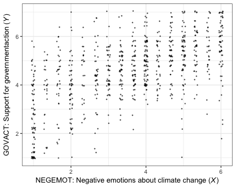

Here's the simple Pearson's correlation coefficient.

``` r
cor(glbwarm$negemot, glbwarm$govact)
```

    ## [1] 0.5777458

If you want more plentiful output, the `cor.test()` function provides a *t* value, the degrees of freedom, the corresponding *p*-value and the 95% confidence intervals, in addition to the Pearson's correlation coefficient.

``` r
cor.test(glbwarm$negemot, glbwarm$govact)
```

    ## 
    ##  Pearson's product-moment correlation
    ## 
    ## data:  glbwarm$negemot and glbwarm$govact
    ## t = 20.183, df = 813, p-value < 2.2e-16
    ## alternative hypothesis: true correlation is not equal to 0
    ## 95 percent confidence interval:
    ##  0.5301050 0.6217505
    ## sample estimates:
    ##       cor 
    ## 0.5777458

To get the Bayesian version, we'll open the brms package. Here we'll start simple and just use the default priors and settings, but with the addition of parallel sampling via `cores = 4`.

``` r
library(brms)

fit0 <- 
  brm(data = glbwarm, family = gaussian,
      cbind(negemot, govact) ~ 1,
      chains = 4, cores = 4)
```

``` r
print(fit0)
```

    ##  Family: MV(gaussian, gaussian) 
    ##   Links: mu = identity; sigma = identity
    ##          mu = identity; sigma = identity 
    ## Formula: negemot ~ 1 
    ##          govact ~ 1 
    ##    Data: glbwarm (Number of observations: 815) 
    ## Samples: 4 chains, each with iter = 2000; warmup = 1000; thin = 1;
    ##          total post-warmup samples = 4000
    ## 
    ## Population-Level Effects: 
    ##                   Estimate Est.Error l-95% CI u-95% CI Eff.Sample Rhat
    ## negemot_Intercept     3.56      0.05     3.45     3.66       3323 1.00
    ## govact_Intercept      4.59      0.05     4.49     4.68       3510 1.00
    ## 
    ## Family Specific Parameters: 
    ##                        Estimate Est.Error l-95% CI u-95% CI Eff.Sample Rhat
    ## sigma_negemot              1.53      0.04     1.46     1.61       3098 1.00
    ## sigma_govact               1.36      0.03     1.30     1.43       3582 1.00
    ## rescor(negemot,govact)     0.58      0.02     0.53     0.62       3489 1.00
    ## 
    ## Samples were drawn using sampling(NUTS). For each parameter, Eff.Sample 
    ## is a crude measure of effective sample size, and Rhat is the potential 
    ## scale reduction factor on split chains (at convergence, Rhat = 1).

Within the brms framework, *σ* of the Gaussian likelihood is considered a family-specific parameter (e.g., there is no *σ* for the Poisson distribution). When you have an intercept-only regression model with multiple variables, the covariance among their *σ* parameters, `rescor(negemot,govact)` in this case, is a correlation.

To learn more about the multivariate syntax in brms, code `vignette("brms_multivariate")`.

But to clarify the output:

-   'Estimate' = the posterior mean, analogous to the frequentist point estimate
-   'Est.Error' = the posterior *S**D*, analogous to the frequentist standard error
-   'l-95% CI' = the lower-level of the percentile-based 95% Bayesian credible interval
-   'u-95% CI' = the upper-level of the same

2.2 The simple linear regression model
--------------------------------------

Here is how one might get the simple OLS coefficients in base R with the `lm()` function.

``` r
(fit1 <- lm(data = glbwarm, govact ~ 1 + negemot))
```

    ## 
    ## Call:
    ## lm(formula = govact ~ 1 + negemot, data = glbwarm)
    ## 
    ## Coefficients:
    ## (Intercept)      negemot  
    ##      2.7573       0.5142

For more detailed output, put the model object `fit1` into the `summary()` function.

``` r
summary(fit1)
```

    ## 
    ## Call:
    ## lm(formula = govact ~ 1 + negemot, data = glbwarm)
    ## 
    ## Residuals:
    ##     Min      1Q  Median      3Q     Max 
    ## -4.3285 -0.6731  0.1018  0.7554  3.2142 
    ## 
    ## Coefficients:
    ##             Estimate Std. Error t value Pr(>|t|)    
    ## (Intercept)  2.75732    0.09866   27.95   <2e-16 ***
    ## negemot      0.51424    0.02548   20.18   <2e-16 ***
    ## ---
    ## Signif. codes:  0 '***' 0.001 '**' 0.01 '*' 0.05 '.' 0.1 ' ' 1
    ## 
    ## Residual standard error: 1.111 on 813 degrees of freedom
    ## Multiple R-squared:  0.3338, Adjusted R-squared:  0.333 
    ## F-statistic: 407.3 on 1 and 813 DF,  p-value: < 2.2e-16

Here's the Bayesian model in brms.

``` r
fit1 <- 
  brm(data = glbwarm, family = gaussian,
      govact ~ 1 + negemot,
      chains = 4, cores = 4)
```

There are several ways to get a brms model summary. A go-to is with the `print()` function.

``` r
print(fit1)
```

    ##  Family: gaussian 
    ##   Links: mu = identity; sigma = identity 
    ## Formula: govact ~ 1 + negemot 
    ##    Data: glbwarm (Number of observations: 815) 
    ## Samples: 4 chains, each with iter = 2000; warmup = 1000; thin = 1;
    ##          total post-warmup samples = 4000
    ## 
    ## Population-Level Effects: 
    ##           Estimate Est.Error l-95% CI u-95% CI Eff.Sample Rhat
    ## Intercept     2.76      0.10     2.55     2.95       3280 1.00
    ## negemot       0.51      0.03     0.47     0.57       3188 1.00
    ## 
    ## Family Specific Parameters: 
    ##       Estimate Est.Error l-95% CI u-95% CI Eff.Sample Rhat
    ## sigma     1.11      0.03     1.06     1.17       4000 1.00
    ## 
    ## Samples were drawn using sampling(NUTS). For each parameter, Eff.Sample 
    ## is a crude measure of effective sample size, and Rhat is the potential 
    ## scale reduction factor on split chains (at convergence, Rhat = 1).

The `summary()` function works very much the same way. To get a more focused look, you can use the `posterior_summary()` function:

``` r
posterior_summary(fit1)
```

    ##                  Estimate  Est.Error          Q2.5         Q97.5
    ## b_Intercept     2.7561806 0.09823308     2.5541589     2.9478411
    ## b_negemot       0.5145271 0.02518915     0.4651528     0.5653607
    ## sigma           1.1129013 0.02798737     1.0590556     1.1668103
    ## lp__        -1248.6359693 1.21346322 -1251.6572789 -1247.2301212

That also yields the log posterior, `lp__`, which you can learn more about [here](https://cran.r-project.org/web/packages/rstan/vignettes/rstan.html#the-log-posterior-function-and-gradient) or [here](https://www.jax.org/news-and-insights/jax-blog/2015/october/lp-in-stan-output). We won't focus on the `lp__` directly in this project.

But anyways, the `Q2.5` and `Q97.5`, are the lower- and upper-levels of the 95% credible intervals. The `Q` prefix stands for quantile ([see this thread](https://github.com/paul-buerkner/brms/issues/425)). In this case, these are a renamed version of the `l-95% CI` and `u-95% CI` columns from our `print()` output.

To make a quick plot of the regression line, one can use the convenient brms function, `marginal_effects()`.

``` r
marginal_effects(fit1)
```


If you want to customize that output, you might nest it in `plot()`.

``` r
plot(marginal_effects(fit1),
     points = T,
     point_args = c(height = .05, width = .05, 
                    alpha = 1/2, size = 1/3))
```

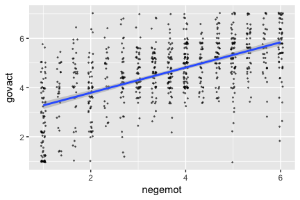

It's also useful to be able to work with the output of a brms model directly. For our first step, we'll put our HMC draws into a data frame.

``` r
post <- posterior_samples(fit1)

head(post)
```

    ##   b_Intercept b_negemot    sigma      lp__
    ## 1    3.033007 0.4608034 1.153014 -1252.520
    ## 2    2.996691 0.4682748 1.126836 -1250.709
    ## 3    2.801110 0.4991724 1.143643 -1247.999
    ## 4    2.765419 0.5116679 1.158539 -1248.539
    ## 5    2.774392 0.5218589 1.138820 -1248.275
    ## 6    2.717307 0.5257444 1.163556 -1248.928

Next, we'll use the `fitted()` function to simulate model-implied summaries for the expected `govact` value, given particular predictor values. Our first model only has `negemot` as a predictor, and we'll ask for the expected `govact` values for `negemot` ranging from 0 to 7.

``` r
nd <- tibble(negemot = seq(from = 0, to = 7, length.out = 30))

f_fit1 <-
  fitted(fit1,
         newdata = nd) %>% 
  as_tibble() %>% 
  bind_cols(nd)

f_fit1
```

    ## # A tibble: 30 x 5
    ##    Estimate Est.Error  Q2.5 Q97.5 negemot
    ##       <dbl>     <dbl> <dbl> <dbl>   <dbl>
    ##  1     2.76    0.0982  2.55  2.95   0    
    ##  2     2.88    0.0927  2.69  3.06   0.241
    ##  3     3.00    0.0873  2.83  3.17   0.483
    ##  4     3.13    0.0819  2.96  3.29   0.724
    ##  5     3.25    0.0767  3.10  3.40   0.966
    ##  6     3.38    0.0715  3.23  3.52   1.21 
    ##  7     3.50    0.0666  3.37  3.63   1.45 
    ##  8     3.63    0.0618  3.50  3.75   1.69 
    ##  9     3.75    0.0573  3.63  3.86   1.93 
    ## 10     3.87    0.0531  3.77  3.98   2.17 
    ## # ... with 20 more rows

The first two columns should look familiar to the output from `print(fit1)`, above. The next two columns, `Q2.5` and `Q97.5`, are the lower- and upper-levels of the 95% credible intervals, like we got from `posterior_samples()`. We got the final column with the `bind_cols(nd)` code.

Here's our bespoke version of Figure 2.4.

``` r
glbwarm %>% 
  group_by(negemot, govact) %>% 
  count() %>% 
  
  ggplot(aes(x = negemot)) +
  geom_point(aes(y = govact, size = n)) +
  geom_ribbon(data = f_fit1,
              aes(ymin = Q2.5,
                  ymax = Q97.5),
              fill = "grey75", alpha = 3/4) +
  geom_line(data = f_fit1,
            aes(y = Estimate)) +
  annotate("text", x = 2.2, y = 7.5, label = "Cases with positive residuals", color = "red3") +
  annotate("text", x = 4.75, y = .8, label = "Cases with negative residuals", color = "blue3") +
  labs(x = expression(paste("NEGEMOT: Negative emotions about climate change (", italic("X"), ")")),
       y = expression(paste("GOVACT: Support for governmentaction (", italic("Y"), ")"))) +
  coord_cartesian(xlim = range(glbwarm$negemot)) +
  theme_bw() +
  theme(legend.position = "none")
```


### Simple linear regression with a dichotomous antecedent variable.

Here we add `sex` to the model.

``` r
fit2 <- 
  brm(data = glbwarm, family = gaussian,
      govact ~ 1 + sex,
      chains = 4, cores = 4)
```

``` r
print(fit2)
```

    ##  Family: gaussian 
    ##   Links: mu = identity; sigma = identity 
    ## Formula: govact ~ 1 + sex 
    ##    Data: glbwarm (Number of observations: 815) 
    ## Samples: 4 chains, each with iter = 2000; warmup = 1000; thin = 1;
    ##          total post-warmup samples = 4000
    ## 
    ## Population-Level Effects: 
    ##           Estimate Est.Error l-95% CI u-95% CI Eff.Sample Rhat
    ## Intercept     4.72      0.07     4.59     4.84       3721 1.00
    ## sex          -0.27      0.10    -0.46    -0.08       4000 1.00
    ## 
    ## Family Specific Parameters: 
    ##       Estimate Est.Error l-95% CI u-95% CI Eff.Sample Rhat
    ## sigma     1.36      0.03     1.29     1.43       4000 1.00
    ## 
    ## Samples were drawn using sampling(NUTS). For each parameter, Eff.Sample 
    ## is a crude measure of effective sample size, and Rhat is the potential 
    ## scale reduction factor on split chains (at convergence, Rhat = 1).

Our model output is very close to that in the text. If you just wanted the coefficients, you might use the `fixef()` function.

``` r
fixef(fit2) %>% round(digits = 3)
```

    ##           Estimate Est.Error   Q2.5  Q97.5
    ## Intercept    4.717     0.067  4.585  4.844
    ## sex         -0.265     0.096 -0.461 -0.081

Though not necessary, we used the `round()` function to reduce the number of significant digits in the output.

You can get a little more information with the `posterior_summary()` function.

But since Bayesian estimation yields an entire posterior distrubution, you can visualize that distribution in any number of ways. Before we do so, we'll need to put the posterior draws into a data frame.

``` r
post <- posterior_samples(fit2)
```

We could summarize the posterior with boxplots:

``` r
post %>% 
  rename(female = b_Intercept) %>% 
  mutate(male = female + b_sex) %>% 
  select(male, female) %>% 
  gather() %>% 
  
  ggplot(aes(x = key, y = value)) +
  geom_boxplot(aes(fill = key)) +
  theme_bw() +
  theme(legend.position = "none")
```

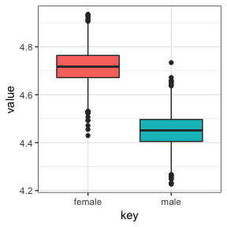

Or with overlapping density plots:

``` r
post %>% 
  rename(female = b_Intercept) %>% 
  mutate(male = female + b_sex) %>% 
  select(male, female) %>% 
  gather() %>% 
  
  ggplot(aes(x = value, group = key, fill = key)) +
  geom_density(color = "transparent", alpha = 2/3) +
  theme_bw()
```

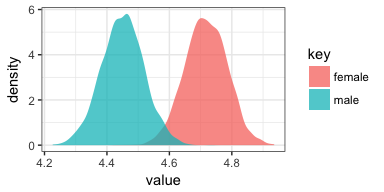

Or even with violin plots with superimposed posterior medians and 95% intervals:

``` r
post %>% 
  rename(female = b_Intercept) %>% 
  mutate(male = female + b_sex) %>% 
  select(male, female) %>% 
  gather() %>% 
  
  ggplot(aes(x = key, y = value)) +
  geom_violin(aes(fill = key), color = "transparent", alpha = 2/3) +
  stat_summary(fun.y = median,
               fun.ymin = function(i){quantile(i, probs = .025)},
               fun.ymax = function(i){quantile(i, probs = .975)}) +
  theme_bw() +
  theme(legend.position = "none")
```

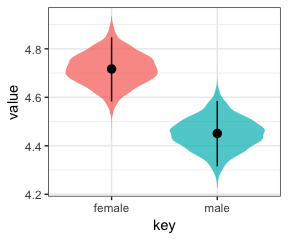

For even more ideas, see Matthew Kay's [tidybayes package](https://github.com/mjskay/tidybayes). You can also get a sense of the model estimates for women and men with a little addition. Here we continue to use the `round()` function to simplify the output.

``` r
# for women
round(fixef(fit2)[1, ], digits = 2)
```

    ##  Estimate Est.Error      Q2.5     Q97.5 
    ##      4.72      0.07      4.59      4.84

``` r
# for men
round(fixef(fit2)[1, ] + fixef(fit2)[2, ], digits = 2)
```

    ##  Estimate Est.Error      Q2.5     Q97.5 
    ##      4.45      0.16      4.12      4.76

Here's the partially standardized model.

``` r
glbwarm <-
  glbwarm %>% 
  mutate(govact_z = (govact - mean(govact))/sd(govact))

lm(data = glbwarm, govact_z ~ 1 + sex)
```

    ## 
    ## Call:
    ## lm(formula = govact_z ~ 1 + sex, data = glbwarm)
    ## 
    ## Coefficients:
    ## (Intercept)          sex  
    ##     0.09629     -0.19717

``` r
fit2_p_z <- 
  brm(data = glbwarm, family = gaussian,
      govact_z ~ 1 + sex,
      chains = 4, cores = 4)
```

    ## Compiling the C++ model

    ## Start sampling

``` r
fixef(fit2_p_z)
```

    ##             Estimate  Est.Error         Q2.5       Q97.5
    ## Intercept  0.0967205 0.04892884  0.002069941  0.19106976
    ## sex       -0.1975736 0.06937593 -0.332382534 -0.06161169

2.3 Alternative explanations for association
--------------------------------------------

On page 46, Hayes produces a couple correlations. Here's how to get them from base R.

``` r
cor(glbwarm$sex, glbwarm$negemot)
```

    ## [1] -0.1173564

``` r
cor(glbwarm$sex, glbwarm$govact)
```

    ## [1] -0.09861854

Again, if we wanted to get full Bayesian estimates, we'd fit an intercept-only multivariate model.

``` r
brm(data = glbwarm, family = gaussian,
    cbind(negemot, govact, sex) ~ 1,
    chains = 4, cores = 4) %>% 
  
  print(digits = 3)
```

    ##  Family: MV(gaussian, gaussian, gaussian) 
    ##   Links: mu = identity; sigma = identity
    ##          mu = identity; sigma = identity
    ##          mu = identity; sigma = identity 
    ## Formula: negemot ~ 1 
    ##          govact ~ 1 
    ##          sex ~ 1 
    ##    Data: glbwarm (Number of observations: 815) 
    ## Samples: 4 chains, each with iter = 2000; warmup = 1000; thin = 1;
    ##          total post-warmup samples = 4000
    ## 
    ## Population-Level Effects: 
    ##                   Estimate Est.Error l-95% CI u-95% CI Eff.Sample  Rhat
    ## negemot_Intercept    3.558     0.054    3.453    3.663       4000 0.999
    ## govact_Intercept     4.588     0.047    4.497    4.678       4000 1.000
    ## sex_Intercept        0.488     0.018    0.453    0.524       4000 1.000
    ## 
    ## Family Specific Parameters: 
    ##                        Estimate Est.Error l-95% CI u-95% CI Eff.Sample  Rhat
    ## sigma_negemot             1.532     0.039    1.456    1.610       4000 1.000
    ## sigma_govact              1.363     0.034    1.299    1.433       4000 1.000
    ## sigma_sex                 0.501     0.012    0.477    0.527       4000 0.999
    ## rescor(negemot,govact)    0.576     0.024    0.529    0.622       4000 1.000
    ## rescor(negemot,sex)      -0.117     0.035   -0.185   -0.047       4000 1.000
    ## rescor(govact,sex)       -0.098     0.035   -0.166   -0.030       4000 0.999
    ## 
    ## Samples were drawn using sampling(NUTS). For each parameter, Eff.Sample 
    ## is a crude measure of effective sample size, and Rhat is the potential 
    ## scale reduction factor on split chains (at convergence, Rhat = 1).

For our purposes, the action is in the 'rescor(*i*, *j*)' portions of the 'Family Specific Parameters' section.

Anyway, if you wanted to get all the correlations among the `glbwarm` variables, rather than piecewise `cor()` approach, you could use the `lowerCor()` function from the [psych package](https://cran.r-project.org/web/packages/psych/index.html).

``` r
psych::lowerCor(glbwarm[, 1:7], digits = 3)
```

    ##          govact posemt negemt idelgy age    sex    partyd
    ## govact    1.000                                          
    ## posemot   0.043  1.000                                   
    ## negemot   0.578  0.128  1.000                            
    ## ideology -0.418 -0.029 -0.349  1.000                     
    ## age      -0.097  0.042 -0.057  0.212  1.000              
    ## sex      -0.099  0.074 -0.117  0.133  0.166  1.000       
    ## partyid  -0.360 -0.036 -0.324  0.619  0.154  0.109  1.000

2.4 Multiple linear regression
------------------------------

``` r
fit3 <- 
  brm(data = glbwarm, family = gaussian,
      govact ~ 1 + negemot + posemot + ideology + sex + age,
      chains = 4, cores = 4)
```

``` r
print(fit3)
```

    ##  Family: gaussian 
    ##   Links: mu = identity; sigma = identity 
    ## Formula: govact ~ 1 + negemot + posemot + ideology + sex + age 
    ##    Data: glbwarm (Number of observations: 815) 
    ## Samples: 4 chains, each with iter = 2000; warmup = 1000; thin = 1;
    ##          total post-warmup samples = 4000
    ## 
    ## Population-Level Effects: 
    ##           Estimate Est.Error l-95% CI u-95% CI Eff.Sample Rhat
    ## Intercept     4.06      0.21     3.65     4.46       4000 1.00
    ## negemot       0.44      0.03     0.39     0.49       4000 1.00
    ## posemot      -0.03      0.03    -0.08     0.03       4000 1.00
    ## ideology     -0.22      0.03    -0.27    -0.16       4000 1.00
    ## sex          -0.01      0.08    -0.16     0.14       4000 1.00
    ## age          -0.00      0.00    -0.01     0.00       4000 1.00
    ## 
    ## Family Specific Parameters: 
    ##       Estimate Est.Error l-95% CI u-95% CI Eff.Sample Rhat
    ## sigma     1.07      0.03     1.02     1.12       4000 1.00
    ## 
    ## Samples were drawn using sampling(NUTS). For each parameter, Eff.Sample 
    ## is a crude measure of effective sample size, and Rhat is the potential 
    ## scale reduction factor on split chains (at convergence, Rhat = 1).

Here is the posterior mean, what you might call the Bayesian point estimate, for:

-   negative emotions = 3,
-   positive emotions = 4,
-   `ideology` = 2,
-   is male (i.e., `sex` = 1), and
-   is 30 years of `age`

``` r
fixef(fit3)[1] + 
  fixef(fit3)[2]*3 + 
  fixef(fit3)[3]*4 + 
  fixef(fit3)[4]*2 + 
  fixef(fit3)[5]*1 + 
  fixef(fit3)[6]*30
```

    ## [1] 4.793519

Here's the same deal for a man of the same values, but with one point higher on `negemot`.

``` r
fixef(fit3)[1] + 
  fixef(fit3)[2]*4 + 
  fixef(fit3)[3]*4 + 
  fixef(fit3)[4]*2 + 
  fixef(fit3)[5]*1 + 
  fixef(fit3)[6]*30
```

    ## [1] 5.234857

If you want a full expression of the model uncertaintly in terms of the shape of the posterior distribution and the 95% intervals, you'll probably just want to use `posterior_samples()` and do a little data processing.

``` r
post <- posterior_samples(fit3)

post <-
  post %>%
  mutate(our_posterior = b_Intercept + b_negemot*4 + b_posemot*4 + b_ideology*2 + b_sex*1 + b_age*30)
  
post_summary <-
  quantile(post$our_posterior, probs = c(.025, .5, .975)) %>% 
  as_tibble() %>% 
  mutate(labels = value %>% 
           round(digits = 3) %>% 
           as.character())

ggplot(data = post,
       aes(x = our_posterior)) +
  geom_density(fill = "black") +
  geom_vline(xintercept = post_summary$value,
             size = c(.5, .75, .5), linetype = c(2, 1, 2), color = "white") +
  scale_x_continuous(NULL,
                     breaks = post_summary$value,
                     labels = post_summary$labels) +
  scale_y_continuous(NULL, breaks = NULL) +
  labs(subtitle = "The expected govact score for a 30-year-old man for whom\nnegemot and posemot both equal 4 and ideology equals 2.\nThe solid and dashed white vertical lines are the posterior\nmedian and 95% intervals, respectively.") +
  theme_bw()
```

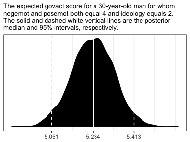

In the text, Hayes shows that individuals based on these two conditions would be expected to differ by 0.441 (i.e., 5.244 - 4.803 = 0.441). That's fine if you're only working with OLS point estimates. But a proper Bayesian approach would express the difference in terms of an entire poster distribution, or at least a point estimate accompanied by some sort of intervals. Here we'll just work with the posterior to create a difference distribution. You could do that with a little deft `posterior_samples()` wrangling. Here we'll employ `fitted()`.

``` r
nd <-
  tibble(negemot = c(3, 4),
         posemot = 4,
         ideology = 2,
         sex = 1,
         age = 30)

fitted(fit3, 
         newdata = nd,
         summary = F) %>% 
  as_tibble() %>% 
  rename(condition_a = V1,
         contition_b = V2) %>% 
  mutate(difference = contition_b - condition_a) %>% 
  
  ggplot(aes(x = difference)) +
  geom_density(fill = "black", color = "transparent") +
  scale_y_continuous(NULL, breaks = NULL) +
  ggtitle("The posterior density for the difference between\nthe two conditions.") +
  theme_bw()
```

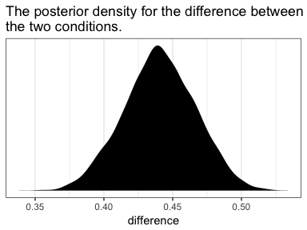

### The standardized regression model.

Since brms doesn't automatically give us the standardized coefficients the way OLS output often does, we'll have to be proactive. One solution is just to standardized the data themselves and then re-fit the model with those standardized variables. That leads us to the issue of how one standardized variables to begin with. Recall that standardizing entails subtracting the mean of a variable from that variable and then dividing that value by the standard deviation. We don't want to do that by hand. So one handy way is to make a custom function to do that work for us.

``` r
sandardize <- function(x){
  (x - mean(x))/sd(x)
}
```

Go [here](http://r4ds.had.co.nz/functions.html) to learn more about making custom functions in R.

Here we'll employ our custom `standardize()` function to make standardized versions of our variables.

``` r
glbwarm <-
  glbwarm %>% 
  mutate(posemot_z = sandardize(posemot), 
         negemot_z = sandardize(negemot), 
         ideology_z = sandardize(ideology),
         sex_z = sandardize(sex),
         age_z = sandardize(age))
```

Now we've got us our standardized variables, let's fit a standardized model.

``` r
fit3_z <- 
  brm(data = glbwarm, family = gaussian,
      govact_z ~ 1 + negemot_z + posemot_z + ideology_z + sex_z + age_z,
      chains = 4, cores = 4)
```

Here are the newly standardized coefficient summaries, minus the `Intercept`.

``` r
fixef(fit3_z)[-1, ] %>% round(3)
```

    ##            Estimate Est.Error   Q2.5  Q97.5
    ## negemot_z     0.495     0.028  0.440  0.551
    ## posemot_z    -0.026     0.028 -0.081  0.028
    ## ideology_z   -0.242     0.029 -0.300 -0.185
    ## sex_z        -0.004     0.028 -0.059  0.052
    ## age_z        -0.016     0.029 -0.073  0.042

Our coefficients match up nicely with those in the text. Just as with Hayes's OLS estimates, we should not attempt to interpret the standardized `sex_z` coefficient from our Bayesian model.

Here's how we'd fit a partially standardized model--a model in which all variables except for `sex` are standardized.

``` r
fit3_z_p <- 
  update(fit3_z,
         newdata = glbwarm,
         formula = govact_z ~ 1 + negemot_z + posemot_z + ideology_z + sex + age_z,
         chains = 4, cores = 4)
```

And here are the coefficient summaries, including the `Intercept`, for the *partially*-standardized model.

``` r
fixef(fit3_z_p) %>% round(3)
```

    ##            Estimate Est.Error   Q2.5  Q97.5
    ## Intercept     0.004     0.038 -0.070  0.077
    ## negemot_z     0.495     0.030  0.438  0.555
    ## posemot_z    -0.026     0.027 -0.082  0.028
    ## ideology_z   -0.242     0.030 -0.300 -0.184
    ## sex          -0.008     0.054 -0.112  0.102
    ## age_z        -0.017     0.029 -0.073  0.039

As Hayes wrote, now `sex` = -0.008 has a sensible interpretation. "We can say that men and women differ by \[-0.008\] standard deviations in their support for government action when all other variables in the model are held constant (p. 53)."

On page 54, Hayes gave us the equation to transform unstandardized coefficients to standardized ones:

$$\\tilde{b}\_{i} = b\_{i}\\left(\\frac{SD\_{X\_{i}}}{SD\_{Y}}\\right)$$

Let's give it a whirl with `negemot`.

``` r
# Here's the coefficient for `negemot` from the standardized model, `fit3_z`
fixef(fit3_z)["negemot_z", "Estimate"]
```

    ## [1] 0.495402

``` r
# Here's the coefficient for `negemot` from the unstandardized model, `fit3`
fixef(fit3)["negemot", "Estimate"]
```

    ## [1] 0.4413384

``` r
# And here we use Hayes's formula to standardize the unstandardized coefficient
fixef(fit3)["negemot", "Estimate"]*(sd(glbwarm$negemot)/sd(glbwarm$govact))
```

    ## [1] 0.4958377

Looks like we got it within rounding error--pretty good!

However, this is just the posterior mean, the Bayesian point estimate. If we want to more fully express the uncertainty around the mean--and we do--, we'll need to work with the posterior draws.

``` r
# the posterior draws from the unstandardized model
posterior_samples(fit3) %>% 
  # using Hayes's formula to standardize `b_negemot`
  mutate(hand_made_b_negemot_z = b_negemot*(sd(glbwarm$negemot)/sd(glbwarm$govact))) %>% 
  # taking on the `b_negemot_z` column from the standardized `fit3_z` models posterior draws
  bind_cols(posterior_samples(fit3_z) %>%
              select(b_negemot_z)) %>% 
  # isolating those two columns
  select(hand_made_b_negemot_z, b_negemot_z) %>% 
  # converting the data to the long format and grouping by `key`
  gather() %>% 
  group_by(key) %>% 
  # here we summarize the results
  summarise(mean = mean(value),
            sd = sd(value),
            ll = quantile(value, probs = .025),
            ul = quantile(value, probs = .975)) %>% 
  mutate_if(is.double, round, digits = 3)
```

    ## # A tibble: 2 x 5
    ##   key                    mean     sd    ll    ul
    ##   <chr>                 <dbl>  <dbl> <dbl> <dbl>
    ## 1 b_negemot_z           0.495 0.0280 0.440 0.551
    ## 2 hand_made_b_negemot_z 0.496 0.0300 0.437 0.553

So our summary confirms that we can apply Hayes's formula to a `posterior_samples()` column in order to get fuller summary statistics for a hand-converted standardized coefficient. This would be in full compliance with, say, APA recommendations to include 95% intervals with all effect sizes--the standardized regression coefficient being the effect size, here.

2.5 Measures of model fit
-------------------------

In the Bayesian world, we don't tend to appeal to the *S**S*<sub>*r**e**s**i**d**u**a**l*</sub>, the *M**S*<sub>*r**e**s**i**d**u**a**l*</sub>, or the standard error of estimate. We do sometimes, however, appeal to the *R*<sup>2</sup>. I'm not going to go into the technical details here, but you should be aware that the Bayesian *R*<sup>2</sup> is not calculated the same as the OLS *R*<sup>2</sup> is. If you want to dive in, check out the paper by [Gelman, Goodrich, Gabry, and Ali](https://github.com/jgabry/bayes_R2/blob/master/bayes_R2.pdf). Here's how to get it in brms.

``` r
bayes_R2(fit3, summary = T) %>% round(digits = 3)
```

    ##    Estimate Est.Error  Q2.5 Q97.5
    ## R2    0.389      0.02 0.349 0.426

Happily, it comes with 95% intervals, which will make the editors at APA journals happy. If you want to go beyond summary statistics and take a look at the full posterior, just set `summary = F` and data wrangle and plot as usual.

``` r
bayes_R2(fit3, summary = F) %>% 
  as_tibble() %>% 
  
  ggplot(aes(x = R2)) +
  geom_density(fill = "black", color = "transparent") +
  scale_y_continuous(NULL, breaks = NULL) +
  labs(title = expression(paste("Behold: The Bayesian ", italic("R")^{2}, " distribution for fit3")),
       x = NULL) +
  coord_cartesian(xlim = 0:1) +
  theme_bw()
```


Another way we examine model fit is with graphical posterior predictive checks. Posterior predictive checking is a very general approach, which you might learn more about [here](http://www.stat.columbia.edu/~gelman/research/published/bayes-vis.pdf) or with a few keyword searches in on [Gelman's blog](http://andrewgelman.com). One basic way is to use the model in order to simulate data and then compare those data with the original data--the basic idea being that good fitting models should produce data similar to the original data.

Recall how we've used `fitted()` to make regression lines and expected values? We'll, now we'll use `predict()` to simulate data based on our models.

``` r
predict(fit3, 
        summary = F,
        nsamples = 3) %>%
  t() %>% 
  as_tibble() %>% 
  gather() %>% 
  mutate(key = str_replace(key, "V", "simulation ")) %>% 
  rename(govact = value) %>% 
  bind_cols(
    bind_rows(
      glbwarm %>% select(-govact),
      glbwarm %>% select(-govact),
      glbwarm %>% select(-govact))
    ) %>% 
  
  ggplot(aes(x = negemot, y = govact)) +
  geom_jitter(height = .05, width = .05, 
              alpha = 1/2, size = 1/3) +
  coord_cartesian(ylim = 0:9) +
  theme_bw() +
  facet_wrap(~key, ncol = 3)
```

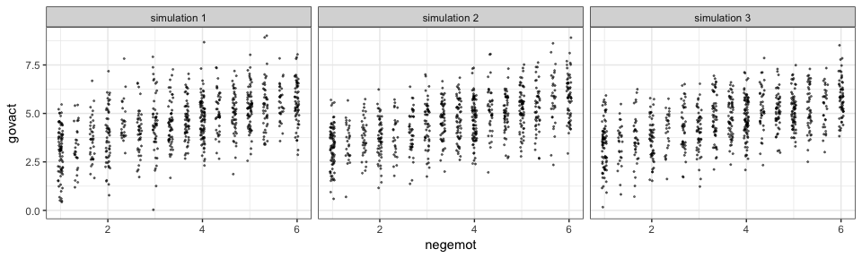

The question is, do these simulated data sets look like the original data? Let's see.

``` r
glbwarm %>% 
  ggplot(aes(x = negemot, y = govact)) +
  geom_jitter(height = .05, width = .05, 
              alpha = 1/2, size = 1/3) +
  coord_cartesian(ylim = 0:9) +
  theme_bw()
```


Overall, the simulations aren't bad. But in all three, `govact` tends to veer above 7.5, which is where the original data appear to be bounded. But otherwise the overall shape is pretty close, at least with respect to `negemot`.

There's nothing special about three simulations. Three is just more than one and gives you a sense of the variance across simulations. Also, we only examined the model fit with respect to `negemot`. Since there are other variables in the model, we might also assess the model based on them.

Another method is with the `brms::pp_check()` function, which allows users to access a variety of convenience functions from the [bayesplot package](https://github.com/stan-dev/bayesplot). Here we'll use the default settings.

``` r
pp_check(fit3)
```

    ## Using 10 posterior samples for ppc type 'dens_overlay' by default.

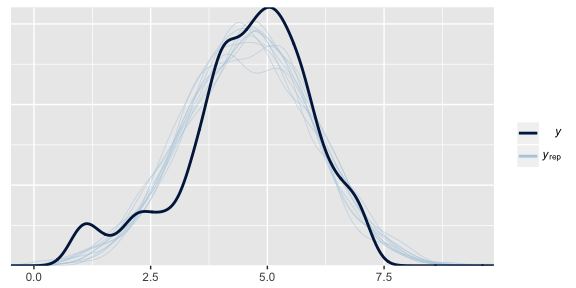

What we did was simulate 10 data sets worth of `govact` values, plot their densities (i.e., the thin blue lines) and compare them with the density of the original `govact` values. What we want is for the thin blue lines to largely align with the thick blue line. Though not perfect, the simulations from our `fit3` did a pretty okay job of reproducing the original `govact` distribution. For more ideas on this method, see the brms [reference manual](https://cran.r-project.org/web/packages/brms/brms.pdf) and [this vignette](https://cran.r-project.org/web/packages/bayesplot/vignettes/graphical-ppcs.html) for the bayesplot package.

2.6 Statistical inference
-------------------------

Here's a tidyverse way to do Hayes's simulation. We're just using OLS regression with the `lm()` function. You could do this with Bayesian HMC estimation, but man would it take a while.

``` r
# first, we'll need two custom functions
# this first one will use the `sample_n()` function to randomly sample from `glbwarm`
make_sample <- function(i){
  set.seed(i)
  sample_n(glbwarm, 50, replace = F)
}

# this second function will fit our model, the same one from `fit3`, to each of our subsamples
glbwarm_model <- function(df) {
  lm(govact ~ 1 + negemot + posemot + ideology + sex + age, data = df)
}

# we need an iteration index, which will double as the values we set our seed with in our `make_sample()` function
tibble(iter = 1:1e4) %>% 
  group_by(iter) %>% 
  # inserting our subsamples
  mutate(sample = map(iter, make_sample)) %>% 
  # fitting our models
  mutate(model = map(sample, glbwarm_model)) %>% 
  # taking those model results and tidying them with the broom package
  mutate(broom = map(model, broom::tidy)) %>% 
  # unnesting allows us to access our model results
  unnest(broom) %>% 
  # we're only going to focus on the estimates for `negemot`
  filter(term == "negemot") %>% 
  
  # Here it is, Figure 2.7
  ggplot(aes(x = estimate)) +
  geom_histogram(binwidth = .025, boundary = 0) +
  labs(x = "Unstandardized regression coefficient for negemot",
       y = "Frequency in 1e4 samples of size 50") +
  theme_bw()
```


To learn more about this approach to simulations, see [this section of R4DS](http://r4ds.had.co.nz/many-models.html#nested-data).

### Testing a null hypothesis.

As Bayesians, we don't need to wed ourselves to the null hypothesis. We're not interested in the probability of the data given the null hypothesis. Rather, we're interested in the probability of the parameters given the data.

``` r
posterior_samples(fit3) %>% 
  
  ggplot(aes(x = b_negemot)) +
  geom_density(fill = "black", color = "transparent") +
  geom_vline(xintercept = posterior_interval(fit3)["b_negemot", ], 
             color = "white", linetype = 2) +
  scale_x_continuous(breaks = posterior_interval(fit3)["b_negemot", ] %>% as.double(),
                     labels = posterior_interval(fit3)["b_negemot", ] %>% as.double() %>% round(digits = 2) %>% as.character()) +
  scale_y_continuous(NULL, breaks = NULL) +
  labs(subtitle = "The most probable values for our b_negemot parameter are the ones around the peak of the\ndensity. For convenience, the dashed lines denote the 95% credible intervals. Sure, you could\nask yourself, 'Is zero within those intervals?' But with such rich output, that's such an\nimpoverished question to ask.") +
  theme_bw()
```

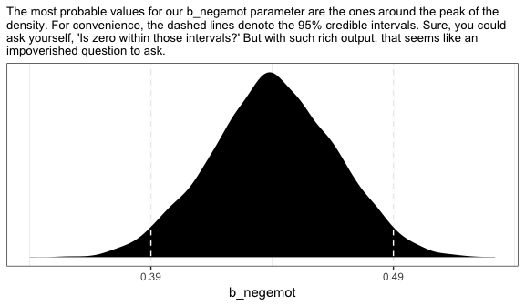

### Interval estimation.

Within the Bayesian paradigm, we don't typically use 95% intervals based on *b*<sub>*i*</sub> ± *t*<sub>*c*%</sub>*s**e*<sub>*b*<sub>*i*</sub></sub>. With the brms package, we typically use percentile-based intervals. Take the 95% credible intervals for the `negemot` coefficient from model `fit3`:

``` r
posterior_interval(fit3)["b_negemot", ]
```

    ##      2.5%     97.5% 
    ## 0.3889769 0.4919195

We actually get those intervals with the simple use of the base R `quantile()` function.

``` r
posterior_samples(fit3) %>% 
  summarize(the_2.5_percentile = quantile(b_negemot, probs = .025),
            the_97.5_percentile = quantile(b_negemot, probs = .975))
```

    ##   the_2.5_percentile the_97.5_percentile
    ## 1          0.3889769           0.4919195

The consequence of this is that our Bayesian credible intervals aren't necessarily symmetric. Which is fine because the posterior distribution for a given parameter isn't always symmetric.

But not all Bayesian intervals are percentile-based. John Kruschke, for example, often recommends highest posterior density intervals in [his work](http://www.indiana.edu/~kruschke/DoingBayesianDataAnalysis/). The brms package doesn't have a convenience function for these, but you can compute them with help from the [HDInterval package](https://cran.r-project.org/web/packages/HDInterval/index.html).

``` r
library(HDInterval)

hdi(posterior_samples(fit3)[ , "b_negemot"], credMass = .95)
```

    ##     lower     upper 
    ## 0.3889853 0.4920029 
    ## attr(,"credMass")
    ## [1] 0.95

Finally, because Bayesians aren't bound to the NHST paradigm, we aren’t bound to 95% intervals, either. For example, in both his [excellent text](http://xcelab.net/rm/statistical-rethinking/) and as a default in its accompanying [rethinking package](https://github.com/rmcelreath/rethinking), Richard McElreath often uses 89% intervals. Alternatively, Andrew Gelman has publically advocated for [50% intervals](http://andrewgelman.com/2016/11/05/why-i-prefer-50-to-95-intervals/). The most important thing is to express the uncertainty in the posterior in a clearly-specified way. If you'd like, say, 80% intervals in your model summary, you can insert a `prob` argument into either `print()` or `summary()`.

``` r
print(fit3, prob = .8)
```

    ##  Family: gaussian 
    ##   Links: mu = identity; sigma = identity 
    ## Formula: govact ~ 1 + negemot + posemot + ideology + sex + age 
    ##    Data: glbwarm (Number of observations: 815) 
    ## Samples: 4 chains, each with iter = 2000; warmup = 1000; thin = 1;
    ##          total post-warmup samples = 4000
    ## 
    ## Population-Level Effects: 
    ##           Estimate Est.Error l-80% CI u-80% CI Eff.Sample Rhat
    ## Intercept     4.06      0.21     3.79     4.32       4000 1.00
    ## negemot       0.44      0.03     0.41     0.48       4000 1.00
    ## posemot      -0.03      0.03    -0.06     0.01       4000 1.00
    ## ideology     -0.22      0.03    -0.25    -0.18       4000 1.00
    ## sex          -0.01      0.08    -0.11     0.08       4000 1.00
    ## age          -0.00      0.00    -0.00     0.00       4000 1.00
    ## 
    ## Family Specific Parameters: 
    ##       Estimate Est.Error l-80% CI u-80% CI Eff.Sample Rhat
    ## sigma     1.07      0.03     1.03     1.10       4000 1.00
    ## 
    ## Samples were drawn using sampling(NUTS). For each parameter, Eff.Sample 
    ## is a crude measure of effective sample size, and Rhat is the potential 
    ## scale reduction factor on split chains (at convergence, Rhat = 1).

Note how two of our columns changed to 'l-80% CI' and 'u-80% CI'.

You can specify custom percentile levels with `posterior_summary()`:

``` r
posterior_summary(fit3, probs = c(.9, .8, .7, .6, .4, .3, .2, .1)) %>% 
  round(digits = 2)
```

    ##             Estimate Est.Error      Q90      Q80      Q70      Q60      Q40      Q30      Q20      Q10
    ## b_Intercept     4.06      0.21     4.32     4.23     4.17     4.11     4.01     3.95     3.89     3.79
    ## b_negemot       0.44      0.03     0.48     0.46     0.45     0.45     0.43     0.43     0.42     0.41
    ## b_posemot      -0.03      0.03     0.01     0.00    -0.01    -0.02    -0.03    -0.04    -0.05    -0.06
    ## b_ideology     -0.22      0.03    -0.18    -0.19    -0.20    -0.21    -0.23    -0.23    -0.24    -0.25
    ## b_sex          -0.01      0.08     0.08     0.05     0.03     0.01    -0.03    -0.05    -0.07    -0.11
    ## b_age           0.00      0.00     0.00     0.00     0.00     0.00     0.00     0.00     0.00     0.00
    ## sigma           1.07      0.03     1.10     1.09     1.08     1.07     1.06     1.05     1.05     1.03
    ## lp__        -1215.86      1.88 -1213.75 -1214.25 -1214.69 -1215.09 -1216.02 -1216.58 -1217.27 -1218.33

And of course, you can use multiple interval summaries when you `summarize()` the output from `posterior_samples()`. E.g.,

``` r
posterior_samples(fit3) %>% 
  select(b_Intercept:b_age) %>% 
  gather() %>% 
  group_by(key) %>% 
  summarize(`l-95% CI` = quantile(value, probs = .025),
            `u-95% CI` = quantile(value, probs = .975),
            `l-50% CI` = quantile(value, probs = .25),
            `u-50% CI` = quantile(value, probs = .75)) %>% 
  mutate_if(is.double, round, digits = 2)
```

    ## # A tibble: 6 x 5
    ##   key         `l-95% CI` `u-95% CI` `l-50% CI` `u-50% CI`
    ##   <chr>            <dbl>      <dbl>      <dbl>      <dbl>
    ## 1 b_age          -0.0100     0          0          0     
    ## 2 b_ideology     -0.270     -0.160     -0.240     -0.200 
    ## 3 b_Intercept     3.65       4.46       3.92       4.20  
    ## 4 b_negemot       0.390      0.490      0.420      0.460 
    ## 5 b_posemot      -0.0800     0.0300    -0.0500    -0.0100
    ## 6 b_sex          -0.160      0.140     -0.0600     0.0400

Throughout this project, I'm going to be lazy and default to conventional 95% intervals, with occasional appearances of 50% intervals.

### Testing a hypothesis about a set of antecedent variables.

Here we'll make use of the `update()` function to hastily fit our reduced model, `fit4`.

``` r
fit4 <- 
  update(fit3,
         govact ~ 1 + ideology + sex + age,
         chains = 4, cores = 4)
```

We can get a look at the *R*<sup>2</sup> estimates for our competing models like this.

``` r
bayes_R2(fit3) %>% round(digits = 2)
```

    ##    Estimate Est.Error Q2.5 Q97.5
    ## R2     0.39      0.02 0.35  0.43

``` r
bayes_R2(fit4) %>% round(digits = 2)
```

    ##    Estimate Est.Error Q2.5 Q97.5
    ## R2     0.18      0.02 0.14  0.22

So far, it looks like our fuller model, `fit3`, explains more variation in the data. If we wanted to look at their distributions, we'd set `summary = F` in the `bayes_R2()` function and convert the results to a data frame or tibble. Here we use `bind_cols()` to put the *R*<sup>2</sup> results for both in the same tibble.

``` r
R2s <-
  bayes_R2(fit3, summary = F) %>%
  as_tibble() %>%
  rename(R2_fit3 = R2) %>% 
  bind_cols(
    bayes_R2(fit4, summary = F) %>%
      as_tibble() %>%
      rename(R2_fit4 = R2)
  )

head(R2s)
```

    ## # A tibble: 6 x 2
    ##   R2_fit3 R2_fit4
    ##     <dbl>   <dbl>
    ## 1   0.393   0.191
    ## 2   0.358   0.142
    ## 3   0.394   0.199
    ## 4   0.375   0.140
    ## 5   0.363   0.189
    ## 6   0.420   0.172

With our `R2s` tibble in hand, we're ready to plot.

``` r
R2s %>% 
  gather() %>% 
  
  ggplot(aes(x = value, fill = key)) +
  geom_density(color = "transparent") +
  coord_cartesian(xlim = 0:1) +
  theme_bw()
```

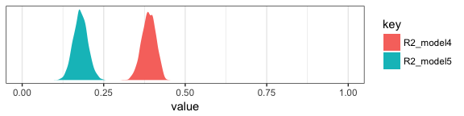

Yep, the *R*<sup>2</sup> distribution for `fit3`, the one including the emotion variables, is clearly larger than that for the more parsimonious `fit4`. And it'd just take a little more data wrangling to get a formal difference score.

``` r
R2s %>% 
  mutate(difference = R2_fit4 - R2_fit3) %>% 
  
  ggplot(aes(x = difference)) +
  geom_density(fill = "black", color = "transparent") +
  scale_y_continuous(NULL, breaks = NULL) +
  coord_cartesian(xlim = -1:0) +
  labs(title = expression(paste(Delta, italic("R")^{2})),
       subtitle = expression(paste("This is the amount the ", italic("R")^{2}, " dropped after we pruned the emotion variables from the model.")),
       x = NULL) +
  theme_bw()
```


The *R*<sup>2</sup> approach is popular within the social sciences. But it has its limitations. It's first limitation is that it doesn't correct for model complexity. The second is it’s not applicable to a range of models, such as those that do not use the Gaussian likelihood (e.g., logistic regression) or to multilevel models.

Happily, information criteria offer a more general framework. The AIC is the most popular information criteria among frequentists. Within the Bayesian world, we have the DIC, the WAIC, and the LOO. The DIC is quickly falling out of favor and is not immediately available with the brms package. However, we can use the WAIC and the LOO, both of which are computed in brms via the [loo package](https://github.com/stan-dev/loo).

In brms, you can get the WAIC or LOO values with either `waic()` or `loo()`. Here we use `loo()` and save the output as objects.

``` r
l_fit3 <- loo(fit3)
l_fit4 <- loo(fit4)
```

Here's the main loo-summary output for `fit3`.

``` r
l_fit3
```

    ## 
    ## Computed from 4000 by 815 log-likelihood matrix
    ## 
    ##          Estimate   SE
    ## elpd_loo  -1213.9 22.7
    ## p_loo         7.7  0.6
    ## looic      2427.8 45.5
    ## ------
    ## Monte Carlo SE of elpd_loo is 0.0.
    ## 
    ## All Pareto k estimates are good (k < 0.5).
    ## See help('pareto-k-diagnostic') for details.

You get a wealth of output, more of which can be seen with `str(l_fit3)`. For now, notice the "All pareto k estimates are good (k &lt; 0.5)." Pareto *k* values [can be used for diagnostics](https://cran.r-project.org/web/packages/loo/vignettes/loo2-example.html#plotting-pareto-k-diagnostics). Each case in the data gets its own *k* value and we like it when those *k*s are low. The makers of the loo package get worried when those *k*s exceed 0.7 and as a result, `loo()` spits out a warning message when they do. Happily, we have no such warning messages in this example.

If you want to work with the *k* values directly, you can extract them and place them into a tibble like so:

``` r
l_fit3$diagnostics %>% 
  as_tibble()
```

    ## # A tibble: 815 x 2
    ##    pareto_k n_eff
    ##       <dbl> <dbl>
    ##  1 -0.0186   3972
    ##  2 -0.0835   3992
    ##  3  0.0588   3886
    ##  4  0.181    2429
    ##  5 -0.00311  3996
    ##  6  0.00702  3964
    ##  7 -0.0792   3936
    ##  8 -0.0902   3993
    ##  9 -0.0321   3994
    ## 10 -0.118    3987
    ## # ... with 805 more rows

The `pareto_k` values can be used to examine cases that are overly-influential on the model parameters, something akin to a Cook's *D*<sub>*i*</sub>. See, for example [this discussion on stackoverflow.com](https://stackoverflow.com/questions/39578834/linear-model-diagnostics-for-bayesian-models-using-rstan/39595436) in which several members of the [Stan team](http://mc-stan.org) weighed in. The issue is also discussed in [this paper](https://arxiv.org/abs/1507.04544) and in [this lecture by Aki Vehtari](https://www.youtube.com/watch?v=FUROJM3u5HQ&feature=youtu.be&a=).

But anyway, we're getting ahead of ourselves. Back to the LOO.

Like other information criteria, the LOO values aren't of interest in and of themselves. However, the values of one model's LOO relative to that of another is of great interest. We generally prefer models with lower information criteria. With `compare_ic()`, we can compute a formal difference score between multiple loo objects.

``` r
compare_ic(l_fit3, l_fit4)
```

    ##               LOOIC    SE
    ## fit3        2427.80 45.50
    ## fit4        2665.17 41.10
    ## fit3 - fit4 -237.37 31.83

We also get a standard error. Here it looks like `fit3` was substantially better, in terms of LOO-values, than `fit4`.

For more on the LOO, see the [loo reference manual](https://cran.r-project.org/web/packages/loo/loo.pdf), this [handy vignette](https://cran.r-project.org/web/packages/loo/vignettes/loo2-example.html), or the scholarly papers referenced therein. Also, although McElreath doesn't discuss the LOO, he does cover the topic in general in his [text](http://xcelab.net/rm/statistical-rethinking/) and in his [online lectures on the topic](https://www.youtube.com/watch?v=t0pRuy1_190&t=1307s&list=PLDcUM9US4XdM9_N6XUUFrhghGJ4K25bFc&index=9).

2.7 Multicategorical antecedent variables
-----------------------------------------

You can get a count of the cases within a give `partyid` like this:

``` r
glbwarm %>% 
  group_by(partyid) %>% 
  count()
```

    ## # A tibble: 3 x 2
    ## # Groups: partyid [3]
    ##   partyid     n
    ##     <int> <int>
    ## 1       1   359
    ## 2       2   192
    ## 3       3   264

`partyid` is coded: 1 = Democrat 2 = Independent 3 = Repuclican

We can get grouped means for `govact` like this:

``` r
glbwarm %>% 
  group_by(partyid) %>% 
  summarize(mean_support_for_governmental_action = mean(govact))
```

    ## # A tibble: 3 x 2
    ##   partyid mean_support_for_governmental_action
    ##     <int>                                <dbl>
    ## 1       1                                 5.06
    ## 2       2                                 4.61
    ## 3       3                                 3.92

We can make dummies with the `ifelse()` function. We'll just go ahead and do that right within the `brm()` function.

``` r
fit5 <- 
  brm(data = glbwarm %>% 
        mutate(Democrat = ifelse(partyid == 1, 1, 0),
               Republican = ifelse(partyid == 3, 1, 0)), 
      family = gaussian,
      govact ~ 1 + Democrat + Republican,
      chains = 4, cores = 4)
```

``` r
fixef(fit5)
```

    ##              Estimate  Est.Error      Q2.5      Q97.5
    ## Intercept   4.6047397 0.09192306  4.421902  4.7837561
    ## Democrat    0.4602426 0.11525769  0.229980  0.6863669
    ## Republican -0.6810575 0.12166362 -0.919737 -0.4472906

The intercept is the stand-in for Independents and the other two coefficients are difference scores.

The *R*<sup>2</sup> is okay:

``` r
bayes_R2(fit5) %>% round(digits = 3)
```

    ##    Estimate Est.Error  Q2.5 Q97.5
    ## R2    0.133     0.021 0.093 0.174

There's no need to compute an *F* test on our *R*<sup>2</sup>. The posterior mean and it's 95% intervals are well away from zero. But you could use your `bayes_R2(fit5, summary = F)` plotting skills from above to more fully inspect the posterior if you'd like.

We could also use information criteria. One method would be to compare the WAIC or LOO value of `fit5` with an intercept-only model. First, we'll need to fit that model.

``` r
fit6 <- 
  update(fit5,
         govact ~ 1,
         chains = 4, cores = 4)
```

If we just put both models into `waic()`, we can side step the need to save their outputs as objects which we then put into `compare_ic()`.

``` r
waic(fit5, fit6)
```

    ##                WAIC    SE
    ## fit5        2707.24 40.14
    ## fit6        2817.68 42.69
    ## fit5 - fit6 -110.44 20.81

The WAIC comparison suggests `fit5`, the one with the `partyid` dummies, is an improvement over the simple intercept-only model. Another way to compare the information criteria is with AIC-type weighting. The brms package offers a variety of weighting methods via the `model_weights()` function.

``` r
MWs <- model_weights(fit5, fit6, weights = "waic")

MWs
```

    ##         fit5         fit6 
    ## 1.000000e+00 1.044231e-24

If you're not a fan of scientific notation, you can put the results in a tibble and look at them on a plot.

``` r
MWs %>% 
  as.data.frame() %>% 
  rownames_to_column() %>% 

  ggplot(aes(x = ., y = rowname)) +
  geom_point() +
  labs(subtitle = "The weights should sum to 1. In this case virtually all the weight is placed\nin fit5. Recall, however, that these are RELATIVE weights. Throw another\nmodel fit into the hopper and the weights might well change.", 
       x = "WAIC weight", y = NULL) +
  theme_bw() +
  theme(axis.ticks.y = element_blank())
```

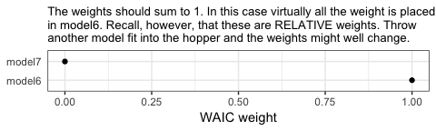

You could, of course, do all this with the LOO.

2.8 Assumptions for interpretation and statistical inference
------------------------------------------------------------

### Normality.

The brms package is quite general and allows users to fit models from a variety of likelihoods other than the Gaussian. For example, users can accommodate outliers/extreme values with Student's t regression. You can do count regression with the Poisson or the negative binomial...

### Homoscedasticity.

The brms package can also accommodate homoscedasticity with distributional modeling. In short, one simply models *σ* in addition to the mean, *μ*. See Bürkner's [handy vignette](https://cran.r-project.org/web/packages/brms/vignettes/brms_distreg.html) on the topic.

### Independence.

And the issue of independence is where the multilevel model comes on. See any relevant text, such as [*Statistical Rethinking*](http://xcelab.net/rm/statistical-rethinking/) or [*Data Analysis Using Regression and Multilevel/Hierarchical Models*](http://www.stat.columbia.edu/~gelman/arm/).

Note. The analyses in this document were done with:

-   R 3.4.4
-   RStudio 1.1.442
-   rmarkdown 1.9
-   readr 1.1.1
-   tidyverse 1.2.1
-   rstan 2.17.3
-   rethinking 1.59
-   brms 2.3.1
-   broom 0.4.3
-   HDInterval 0.1.3
-   loo 2.0.0

Reference
---------

Hayes, A. F. (2018). *Introduction to mediation, moderation, and conditional process analysis: A regression-based approach.* (2nd ed.). New York, NY, US: The Guilford Press.
