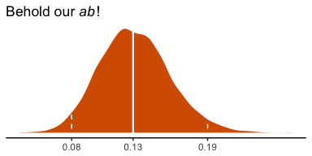

Chapter 03
================
A Solomon Kurz
2018-05-29

3.2. Example with dichotomous *X*: The influence of presumed media influence
----------------------------------------------------------------------------

Here we load a couple necessary packages, load the data, and take a peek at them.

``` r
library(readr)
library(tidyverse)

p <- read_csv("data/pmi/pmi.csv")

glimpse(p)
```

    ## Observations: 123
    ## Variables: 6
    ## $ cond     <int> 1, 0, 1, 0, 0, 0, 0, 1, 0, 0, 1, 0, 1, 0, 1, 1, 0, 0, 1, 0, 1, 1, 1, 1, 1, 0, 1, 0, 1, 0...
    ## $ pmi      <dbl> 7.0, 6.0, 5.5, 6.5, 6.0, 5.5, 3.5, 6.0, 4.5, 7.0, 1.0, 6.0, 5.0, 7.0, 7.0, 7.0, 4.5, 3.5...
    ## $ import   <int> 6, 1, 6, 6, 5, 1, 1, 6, 6, 6, 3, 3, 4, 7, 1, 6, 3, 3, 2, 4, 4, 6, 7, 4, 5, 4, 6, 5, 5, 7...
    ## $ reaction <dbl> 5.25, 1.25, 5.00, 2.75, 2.50, 1.25, 1.50, 4.75, 4.25, 6.25, 1.25, 2.75, 3.75, 5.00, 4.00...
    ## $ gender   <int> 1, 1, 1, 0, 1, 1, 0, 1, 1, 1, 0, 0, 0, 0, 0, 0, 0, 0, 0, 1, 0, 0, 1, 1, 0, 1, 0, 0, 0, 1...
    ## $ age      <dbl> 51.0, 40.0, 26.0, 21.0, 27.0, 25.0, 23.0, 25.0, 22.0, 24.0, 22.0, 21.0, 23.0, 21.0, 22.0...

You can get the male/female split like so:

``` r
p %>% 
  group_by(gender) %>% 
  count()
```

    ## # A tibble: 2 x 2
    ## # Groups: gender [2]
    ##   gender     n
    ##    <int> <int>
    ## 1      0    80
    ## 2      1    43

Here is the split by `condition`:

``` r
p %>% 
  group_by(cond) %>% 
  count()
```

    ## # A tibble: 2 x 2
    ## # Groups: cond [2]
    ##    cond     n
    ##   <int> <int>
    ## 1     0    65
    ## 2     1    58

Here is how to get the ungrouped Mean and *SD* values for `reaction` and `pmi`, as presented in Table 3.1,

``` r
p %>% 
  select(reaction, pmi) %>% 
  gather() %>% 
  group_by(key) %>% 
  summarise(mean = mean(value),
            sd = sd(value)) %>% 
  mutate_if(is.double, round, digits = 3)
```

    ## # A tibble: 2 x 3
    ##   key       mean    sd
    ##   <chr>    <dbl> <dbl>
    ## 1 pmi       5.60  1.32
    ## 2 reaction  3.48  1.55

You might get the Mean and *SD* values for `reaction` and `pmi` grouped by `cond` like this:

``` r
p %>% 
  select(reaction, pmi, cond) %>% 
  gather(key, value, -cond) %>% 
  group_by(cond, key) %>% 
  summarise(mean = mean(value),
            sd = sd(value)) %>% 
  mutate_if(is.double, round, digits = 3)
```

    ## # A tibble: 4 x 4
    ## # Groups: cond [2]
    ##    cond key       mean    sd
    ##   <int> <chr>    <dbl> <dbl>
    ## 1     0 pmi       5.38  1.34
    ## 2     0 reaction  3.25  1.61
    ## 3     1 pmi       5.85  1.27
    ## 4     1 reaction  3.75  1.45

Let's load our primary statistical package.

``` r
library(brms)
```

Before we begin, I should acknowledge that I greatly benefited by [this great blog post](http://www.imachordata.com/bayesian-sem-with-brms/) by Jarrett Byrnes.

In brms, we handle mediation models using the [multivariate syntax](https://cran.r-project.org/web/packages/brms/vignettes/brms_multivariate.html). There are a few ways to do this. Let's start simple.

If you look at the path model in Figure 3.3, you'll note that `reaction` is predicted by `pmi` and `cond`. `pmi`, in turn, is predicted solely by `cond`. So we have two regression models, which is just the kind of thing the brms multivariate syntax is for. So first, let's specify both models, which we'll nest in `bf()` functions and save as objects.

``` r
y_model <- bf(reaction ~ 1 + pmi + cond)
m_model <- bf(pmi ~ 1 + cond)
```

Now we have our `bf()` objects in hand, we'll combine them with the `+` operator within the `brm()` function. We'll also specify `set_rescor(FALSE)`--we're not interested in adding a residual correlation between `reaction` and `pmi`.

``` r
fit0 <-
  brm(data = p, family = gaussian,
      y_model + m_model + set_rescor(FALSE),
      chains = 4, cores = 4)
```

Here are our results.

``` r
print(fit0)
```

    ##  Family: MV(gaussian, gaussian) 
    ##   Links: mu = identity; sigma = identity
    ##          mu = identity; sigma = identity 
    ## Formula: reaction ~ 1 + pmi + cond 
    ##          pmi ~ 1 + cond 
    ##    Data: p (Number of observations: 123) 
    ## Samples: 4 chains, each with iter = 2000; warmup = 1000; thin = 1;
    ##          total post-warmup samples = 4000
    ## 
    ## Population-Level Effects: 
    ##                    Estimate Est.Error l-95% CI u-95% CI Eff.Sample Rhat
    ## reaction_Intercept     0.51      0.54    -0.55     1.56       4000 1.00
    ## pmi_Intercept          5.38      0.17     5.06     5.72       4000 1.00
    ## reaction_pmi           0.51      0.10     0.32     0.69       4000 1.00
    ## reaction_cond          0.26      0.26    -0.25     0.78       4000 1.00
    ## pmi_cond               0.48      0.25    -0.00     0.96       4000 1.00
    ## 
    ## Family Specific Parameters: 
    ##                Estimate Est.Error l-95% CI u-95% CI Eff.Sample Rhat
    ## sigma_reaction     1.41      0.10     1.24     1.61       4000 1.00
    ## sigma_pmi          1.32      0.09     1.16     1.51       4000 1.00
    ## 
    ## Samples were drawn using sampling(NUTS). For each parameter, Eff.Sample 
    ## is a crude measure of effective sample size, and Rhat is the potential 
    ## scale reduction factor on split chains (at convergence, Rhat = 1).

If you compare our model summary with the coefficients in the path model in Figure 3.3, you'll see our coefficients are the same. The brms summary also includes intercepts and residual variances, which are typically omitted in path diagrams, even though they're still part of the model.

If you're getting lost in all the model output, try this.

``` r
fixef(fit0)[3:5, ] %>% round(digits = 3)
```

    ##               Estimate Est.Error   Q2.5 Q97.5
    ## reaction_pmi     0.509     0.096  0.324 0.692
    ## reaction_cond    0.260     0.262 -0.250 0.776
    ## pmi_cond         0.477     0.245  0.000 0.957

Also note that Hayes tends to refer to the intercepts as constants.

In his Table 3.2, he also includes the *R*<sup>2</sup> values. Here are ours.

``` r
bayes_R2(fit0) %>% round(digits = 3)
```

    ##             Estimate Est.Error  Q2.5 Q97.5
    ## R2_reaction    0.211     0.055 0.106 0.316
    ## R2_pmi         0.039     0.032 0.000 0.116

It's worth it to actually plot the *R*<sup>2</sup> distributions.

``` r
# we'll get our color palette from ggthemes
library(ggthemes)

bayes_R2(fit0, summary = F) %>% 
  as_tibble() %>% 
  gather() %>% 
  
  ggplot(aes(x = value, fill = key)) +
  geom_density(color = "transparent", alpha = 2/3) +
  scale_fill_colorblind() +  # we got this color palette from the ggthemes package
  coord_cartesian(xlim = 0:1) +
  labs(title = expression(paste("The ", italic("R")^{2}, " distributions for fit0")),
       x = NULL) +
  theme_classic()
```


We went through the trouble of plotting the *R*<sup>2</sup> distributions because it’s useful to understand that they won’t often be symmetric when they’re near their logical boundaries (i.e., 0 and 1). This is where asymmetric Bayesian credible intervals can really shine.

Let's get down to business, the indirect effect, the *ab* pathway. In our model

-   *a* = `pmi_cond`
-   *b* = `reaction_pmi`

You can isolate them with `fixef()[i]`.

``` r
fixef(fit0)[5 , ]
```

    ##      Estimate     Est.Error          Q2.5         Q97.5 
    ##  0.4766510444  0.2451287243 -0.0001399349  0.9574024368

``` r
fixef(fit0)[3 , ]
```

    ##   Estimate  Est.Error       Q2.5      Q97.5 
    ## 0.50881908 0.09566662 0.32416105 0.69150489

So the naive approach would be to just multiply them.

``` r
(fixef(fit0)[5 , ] * fixef(fit0)[3 , ]) %>% round(digits = 3)
```

    ##  Estimate Est.Error      Q2.5     Q97.5 
    ##     0.243     0.023     0.000     0.662

Now, this does get us the correct 'Estimate' (i.e., posterior mean). However, the posterior *SD* and 95% intervals are off. If you want to do this properly, you need to work with the poster samples themselves. Here they are:

``` r
post <- posterior_samples(fit0)

glimpse(post)
```

    ## Observations: 4,000
    ## Variables: 8
    ## $ b_reaction_Intercept <dbl> 0.940673842, 0.375645494, 0.602420667, 0.552142310, 0.733835086, 0.241162311...
    ## $ b_pmi_Intercept      <dbl> 5.212625, 5.470439, 5.252294, 5.499512, 5.183923, 5.150398, 5.386420, 5.2865...
    ## $ b_reaction_pmi       <dbl> 0.4043567, 0.5632420, 0.4670230, 0.5222035, 0.4985212, 0.5714610, 0.4318949,...
    ## $ b_reaction_cond      <dbl> 0.47305027, 0.10178421, 0.41126481, 0.18589913, 0.32476694, 0.47003378, 0.11...
    ## $ b_pmi_cond           <dbl> 0.20188654, 0.39775594, 0.56216806, 0.37817440, 0.52995864, 0.56055789, 0.81...
    ## $ sigma_reaction       <dbl> 1.377976, 1.482431, 1.305074, 1.503381, 1.343042, 1.336886, 1.487399, 1.3835...
    ## $ sigma_pmi            <dbl> 1.361034, 1.244075, 1.389508, 1.231779, 1.463141, 1.459922, 1.312628, 1.4082...
    ## $ lp__                 <dbl> -435.9447, -432.8215, -432.9694, -433.0390, -435.1710, -435.9136, -434.5750,...

Here we compute the indirect effect, `ab`.

``` r
post <-
  post %>% 
  mutate(ab = b_pmi_cond*b_reaction_pmi)
```

Now we've got `ab` as a properly computed vector, we can summarize it with the `quantile()` function.

``` r
quantile(post$ab, probs = c(.5, .025, .975)) %>% 
  round(digits = 3)
```

    ##   50%  2.5% 97.5% 
    ## 0.234 0.000 0.526

And we can even visualize it as a density.

``` r
post %>% 
  
  ggplot(aes(x = ab)) +
  geom_density(color = "transparent", 
               fill = colorblind_pal()(3)[3]) +
  scale_y_continuous(NULL, breaks = NULL) +
  labs(title = expression(paste("Our indirect effect, the ", italic("ab"), " pathway")),
       x = NULL) +
  theme_classic()
```


It's also worth pointing out that as the indirect effect isn't perfectly symmetric, it's mean and median aren't quite the same.

``` r
post %>% 
  summarize(mean = mean(ab),
            median = median(ab)) %>% 
  round(digits = 3)
```

    ##    mean median
    ## 1 0.243  0.234

Their magnitudes are similar, but this asymmetry will be a source of contrast to our estimates and those in the text. This is also something to consider when reporting on central tendency. When the indirect effect--or any other parameter, for that matter--is quite asymmetric, you might prefer reporting the median rather than the mean.

On page 90, Hayes computed the *adjusted means* for *Y*. For both `cond == 1` and `cond == 0`, he computed the expected values for `reaction` when `pmi` was at its mean. A natural way to do that in brms is with fitted. First, we'll put our input values for `cond` and `pmi` in a tibble, which we'll call `nd`. Then we'll feed `nd` into the `newdata` argument within the `fitted()` function.

``` r
nd <-
  tibble(cond = 1:0,
         pmi = mean(p$pmi))

fitted(fit0, newdata = nd)
```

    ## , , reaction
    ## 
    ##      Estimate Est.Error     Q2.5    Q97.5
    ## [1,] 3.620395 0.1909154 3.245150 4.000688
    ## [2,] 3.360312 0.1758648 3.015594 3.716157
    ## 
    ## , , pmi
    ## 
    ##      Estimate Est.Error     Q2.5    Q97.5
    ## [1,] 5.856628 0.1748424 5.517357 6.194212
    ## [2,] 5.379977 0.1689722 5.056097 5.715568

Because `fit0` is a multivariate model, `fitted()` returns the model-implied summaries for both `reaction` and `pmi`. If you just want the adjusted means for `reaction`, you can use the `resp` argument within `fitted()`.

``` r
fitted(fit0, newdata = nd, resp = "reaction") %>% round(digits = 3)
```

    ##      Estimate Est.Error  Q2.5 Q97.5
    ## [1,]     3.62     0.191 3.245 4.001
    ## [2,]     3.36     0.176 3.016 3.716

Note how this is where the two values in the *Y* adjusted column in Table 3.1 came from.

However, if we want to reproduce how Hayes computed the total effect (i.e. *c*<sup>′</sup> + *ab*), we'll need to work with the posterior itself, `post`. Recall, we've already saved the indirect effect as a vector, `ab`. The direct effect, *c*<sup>′</sup>, is labeled `b_reaction_cond` within `post`. in order to get the total effect, *c*, all we need to is add those vectors together.

``` r
post <-
  post %>% 
  mutate(total_effect = b_reaction_cond + ab)
```

Here's the posterior mean with its 95% intervals

``` r
post %>% 
  summarize(mean = mean(total_effect),
            ll = quantile(total_effect, prob = .025),
            ul = quantile(total_effect, prob = .975))
```

    ##        mean          ll       ul
    ## 1 0.5031172 -0.05328235 1.055605

### ~~Estimation of the model in PROCESS for SPSS and SAS~~

Nothing new for us, here.

3.4 Statistical inference
-------------------------

### Inference about hte direct effect of *X* on *Y*

In this section, Hayes provides a *t* test and corresponding *p*-value for the direct effect (i.e., *c*<sup>′</sup>, `b_reaction_cond`). Instead of the *t* test, we can just look at the posterior distribution.

``` r
post %>% 
  
  ggplot(aes(x = b_reaction_cond)) +
  geom_density(color = "transparent", 
               fill = colorblind_pal()(4)[4]) +
  geom_vline(xintercept = 0, color = "white", linetype = 2) +
  scale_y_continuous(NULL, breaks = NULL) +
  labs(title = expression(paste("Yep, 0 is a credible value for ", italic("c"), ".")),
       x = NULL) +
  theme_classic()
```


If you wanted to quantify what proportion of the density was less than 0, you could do:

``` r
post %>% 
  summarize(proportion_below_zero = filter(., b_reaction_cond < 0) %>% nrow()/nrow(.))
```

    ##   proportion_below_zero
    ## 1                 0.165

This is something like a Bayesian *p*-value. But of course, you could always just look at the posterior intervals.

``` r
posterior_interval(fit0)["b_reaction_cond", ]
```

    ##       2.5%      97.5% 
    ## -0.2500646  0.7760681

### Inference about the indirect of *X* on *Y* through *M*.

#### The normal theory approach.

This is not our approach.

#### Bootstrap confidence interval.

This is not our approach.

However, Markov chain Monte Carlo (MCMC) methods are iterative and share some characteristics with boostrapping. On page 98, Hayes outlined 6 steps for constructing the *ab* bootstrap confidence interval. Here are our responses to those steps w/r/t Bayes with MCMC--or in our case HMC (i.e., Hamiltonian Monte Carlo).

If HMC or MCMC, in general, are new to you, you might check out [this lecture](https://www.youtube.com/watch?v=BWEtS3HuU5A&t=7s).

Anyway, Hayes's 6 steps:

##### 1.

With HMC we do not take random samples of the data themselves. Rather, we take random draws from the posterior distribution. The posterior distribution is the joint probability distribution of our model.

##### 2.

After we fit our model (i.e., with the `brm()` function) and save our posterior draws in a data frame (i.e., `post <- posterior_samples(my_model_fit)`), we then make a new column (a.k.a. vector, variable) that is the product of our coefficients for the *a* and *b* pathways. In the example above, this looked like `post %>% mutate(ab = b_pmi_cond*b_reaction_pmi)`. Let's take a look at those columns.

``` r
post %>% 
  select(b_pmi_cond, b_reaction_pmi, ab) %>% 
  slice(1:10)
```

    ## # A tibble: 10 x 3
    ##    b_pmi_cond b_reaction_pmi     ab
    ##         <dbl>          <dbl>  <dbl>
    ##  1      0.202          0.404 0.0816
    ##  2      0.398          0.563 0.224 
    ##  3      0.562          0.467 0.263 
    ##  4      0.378          0.522 0.197 
    ##  5      0.530          0.499 0.264 
    ##  6      0.561          0.571 0.320 
    ##  7      0.819          0.432 0.354 
    ##  8      0.780          0.409 0.319 
    ##  9      0.278          0.643 0.179 
    ## 10      0.690          0.430 0.297

Our data frame, `post`, has 4000 rows. Why 4000? By default, brms runs 4 HMC chains. Each chain has 2000 iterations, 1000 of which are warmups. We discard the warmups. As such, there are 1000 good iterations left in each chain and 1000\*4 = 4000. We can change these defaults as needed. At this point in the project, the default settings have been fine.

So, each row in `post` are the parameter values based on one of those draws. And again, these are draws from the posterior distribution. They are not draws from the data.

##### 3.

We don't refit the model *k* times based on the samples from the data. We take a number of draws from the posterior distribution. Hayes likes to take 5000 samples when he bootstraps. Happily, that number is quite similar to our 4000 HMC draws. Whether 5000, 4000 or 10,000, these are all large enough numbers that the distributions become fairly stable. With HMC, however, you might want to increase the number of iterations if the effective sample size, 'Eff.Sample' in the `print()` output, is substantially smaller than the number of iterations.

##### 4.

When we use the `quantile()` function to compute our Bayesian credible intervals, we've sorted. Conceptually, we've done this:

``` r
post %>% 
  select(ab) %>% 
  arrange(ab) %>% 
  slice(1:10)
```

    ## # A tibble: 10 x 1
    ##        ab
    ##     <dbl>
    ##  1 -0.318
    ##  2 -0.232
    ##  3 -0.146
    ##  4 -0.141
    ##  5 -0.139
    ##  6 -0.127
    ##  7 -0.127
    ##  8 -0.125
    ##  9 -0.120
    ## 10 -0.118

##### 5.

Yes, this is what we do, too.

``` r
ci <- 95

.5*(100 - ci)
```

    ## [1] 2.5

##### 6.

This is also what we do.

``` r
ci <- 95

(100 - .5*(100 - ci))
```

    ## [1] 97.5

Also, notice the headers in the rightmost two columns in our `posterior_summary()` output:

``` r
posterior_summary(fit0)
```

    ##                          Estimate  Est.Error          Q2.5        Q97.5
    ## b_reaction_Intercept    0.5100980 0.54346755 -5.529745e-01    1.5589090
    ## b_pmi_Intercept         5.3799766 0.16897219  5.056097e+00    5.7155682
    ## b_reaction_pmi          0.5088191 0.09566662  3.241611e-01    0.6915049
    ## b_reaction_cond         0.2600824 0.26156955 -2.500646e-01    0.7760681
    ## b_pmi_cond              0.4766510 0.24512872 -1.399349e-04    0.9574024
    ## sigma_reaction          1.4081640 0.09549843  1.241331e+00    1.6089843
    ## sigma_pmi               1.3189654 0.08707321  1.160000e+00    1.5050505
    ## lp__                 -434.9261514 1.98050508 -4.396800e+02 -432.1738065

Those 2.5 and 97.5 quantiles from above are just what brms is giving us in our 95% Bayesian credible intervals.

Here's our version of Figure 3.5

``` r
# these will come in handy in the subtitle
ll <- quantile(post$ab, probs = .025) %>% round(digits = 3)
ul <- quantile(post$ab, probs = .975) %>% round(digits = 3)

post %>% 
  
  ggplot(aes(x = ab)) +
  geom_histogram(color = "white", size = .25, 
               fill = colorblind_pal()(5)[5],
               binwidth = .025, boundary = 0) +
  geom_vline(xintercept = quantile(post$ab, probs = c(.025, .975)),
             linetype = 3, color = colorblind_pal()(6)[6]) +
  labs(x = expression(paste("Indirect effect (", italic("ab"), ")")),
       y = "Frequency in 4,000 HMC posterior draws",
       subtitle = paste("95% of the posterior draws are between", ll, "and", ul)) +
  theme_classic()
```


Again, as Hayes discussed how to specify different types of intervals in PROCESS on page 102, you can ask for different kinds of intervals in your `print()` or `summary()` output with the `probs` argument, just as you can with `quantile()` when working directly with the posterior draws.

Hayes discussed setting the seed in PROCESS on page 104. You can do this with the `seed` argument in the `brm()` function, too.

#### Alternative "asymmetric" confidence interval approaches.

This section does not quite refer to us. I'm a little surprised Hayes didn't at least dedicate a paragraph or two mentioning Bayesian estimation. Sure, he mentioned Monte Carlo, but not within the context of Bayes. So it goes...

3.5 An example with continuous *X*: Economic stress among small-business owners
-------------------------------------------------------------------------------

Here's the `estress` data.

``` r
estress <- read_csv("data/estress/estress.csv")

glimpse(estress)
```

    ## Observations: 262
    ## Variables: 7
    ## $ tenure   <dbl> 1.67, 0.58, 0.58, 2.00, 5.00, 9.00, 0.00, 2.50, 0.50, 0.58, 9.00, 1.92, 2.00, 1.42, 0.92...
    ## $ estress  <dbl> 6.0, 5.0, 5.5, 3.0, 4.5, 6.0, 5.5, 3.0, 5.5, 6.0, 5.5, 4.0, 3.0, 2.5, 3.5, 6.0, 4.0, 6.0...
    ## $ affect   <dbl> 2.60, 1.00, 2.40, 1.16, 1.00, 1.50, 1.00, 1.16, 1.33, 3.00, 3.00, 2.00, 1.83, 1.16, 1.16...
    ## $ withdraw <dbl> 3.00, 1.00, 3.66, 4.66, 4.33, 3.00, 1.00, 1.00, 2.00, 4.00, 4.33, 1.00, 5.00, 1.66, 4.00...
    ## $ sex      <int> 1, 0, 1, 1, 1, 1, 0, 0, 1, 1, 1, 1, 1, 1, 1, 1, 1, 1, 0, 0, 0, 1, 1, 1, 0, 1, 0, 0, 0, 1...
    ## $ age      <int> 51, 45, 42, 50, 48, 48, 51, 47, 40, 43, 57, 36, 33, 29, 33, 48, 40, 45, 37, 42, 54, 57, ...
    ## $ ese      <dbl> 5.33, 6.05, 5.26, 4.35, 4.86, 5.05, 3.66, 6.13, 5.26, 4.00, 2.53, 6.60, 5.20, 5.66, 5.66...

The model set up is just like before. There are no complications switching from a binary *X* variable to a continuous one.

``` r
y_model <- bf(withdraw ~ 1 + estress + affect)
m_model <- bf(affect ~ 1 + estress)
```

With our `y_model` and `m_model` defined, we're ready to fit.

``` r
fit1 <-
  brm(data = estress, family = gaussian,
      y_model + m_model + set_rescor(FALSE),
      chains = 4, cores = 4)
```

Let's take a look.

``` r
print(fit1, digits = 3)
```

    ##  Family: MV(gaussian, gaussian) 
    ##   Links: mu = identity; sigma = identity
    ##          mu = identity; sigma = identity 
    ## Formula: withdraw ~ 1 + estress + affect 
    ##          affect ~ 1 + estress 
    ##    Data: estress (Number of observations: 262) 
    ## Samples: 4 chains, each with iter = 2000; warmup = 1000; thin = 1;
    ##          total post-warmup samples = 4000
    ## 
    ## Population-Level Effects: 
    ##                    Estimate Est.Error l-95% CI u-95% CI Eff.Sample  Rhat
    ## withdraw_Intercept    1.444     0.254    0.951    1.946       4000 1.000
    ## affect_Intercept      0.802     0.146    0.515    1.085       4000 0.999
    ## withdraw_estress     -0.076     0.053   -0.183    0.027       4000 1.000
    ## withdraw_affect       0.770     0.105    0.566    0.970       4000 1.000
    ## affect_estress        0.172     0.030    0.115    0.232       4000 0.999
    ## 
    ## Family Specific Parameters: 
    ##                Estimate Est.Error l-95% CI u-95% CI Eff.Sample  Rhat
    ## sigma_withdraw    1.139     0.051    1.045    1.240       4000 0.999
    ## sigma_affect      0.685     0.031    0.630    0.747       4000 0.999
    ## 
    ## Samples were drawn using sampling(NUTS). For each parameter, Eff.Sample 
    ## is a crude measure of effective sample size, and Rhat is the potential 
    ## scale reduction factor on split chains (at convergence, Rhat = 1).

The 'Eff.Sample' and 'Rhat' values look great. Happily, the values in our summary cohere well with those Hayes reported in Table 3.5. Here are our *R*<sup>2</sup> values.

``` r
bayes_R2(fit1)
```

    ##              Estimate  Est.Error       Q2.5     Q97.5
    ## R2_withdraw 0.1828189 0.03869631 0.10983433 0.2590225
    ## R2_affect   0.1163300 0.03494122 0.05361269 0.1878666

These are also quite similar to those in the text. Here's our indirect effect.

``` r
# putting the posterior draws into a data frame
post <- posterior_samples(fit1)

# computing the ab coefficient with multiplication
post <-
  post %>% 
  mutate(ab = b_affect_estress*b_withdraw_affect)

# getting the posterior median and 95% intervals with `quantile()`
quantile(post$ab, probs = c(.5, .025, .975)) %>% round(digits = 3)
```

    ##   50%  2.5% 97.5% 
    ## 0.131 0.079 0.194

We can visualize its shape, median, and 95% intervals in a density plot.

``` r
post %>% 
  ggplot(aes(x = ab)) +
  geom_density(color = "transparent", 
               fill = colorblind_pal()(7)[7]) +
  geom_vline(xintercept = quantile(post$ab, probs = c(.025, .5, .975)), 
             color = "white", linetype = c(2, 1, 2), size = c(.5, .8, .5)) +
  scale_x_continuous(breaks = quantile(post$ab, probs = c(.025, .5, .975)),
                     labels = quantile(post$ab, probs = c(.025, .5, .975)) %>% round(2) %>% as.character()) +
  scale_y_continuous(NULL, breaks = NULL) +
  labs(title = expression(paste("Behold our ", italic("ab"), "!")),
       x = NULL) +
  theme_classic()
```



Here's *c*<sup>′</sup>, the direct effect of `esterss` predicting `withdraw`.

``` r
posterior_summary(fit1)["b_withdraw_estress", ]
```

    ##    Estimate   Est.Error        Q2.5       Q97.5 
    ## -0.07640530  0.05326720 -0.18292212  0.02691913

It has wide flapping intervals with do straddle zero. A little addition will give us the direct effect, *c*.

``` r
post <-
  post %>% 
  mutate(c = b_withdraw_estress + ab)

quantile(post$c, probs = c(.5, .025, .975)) %>% round(digits = 3)
```

    ##    50%   2.5%  97.5% 
    ##  0.057 -0.054  0.163

Note. The analyses in this document were done with:

-   R 3.4.4
-   RStudio 1.1.442
-   rmarkdown 1.9
-   readr 1.1.1
-   tidyverse 1.2.1
-   rstan 2.17.3
-   brms 2.3.1
-   ggthemes 3.5.0

Reference
---------

Hayes, A. F. (2018). *Introduction to mediation, moderation, and conditional process analysis: A regression-based approach.* (2nd ed.). New York, NY, US: The Guilford Press.
