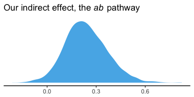
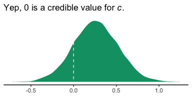

Chapter 03
================
A Solomon Kurz
2018-05-29

3.2. Example with dichotomous *X*: The influence of presumed media influence
----------------------------------------------------------------------------

Here we load a couple necessary packages, load the data, and take a peek at them.

``` r
library(readr)
library(tidyverse)

p <- read_csv("data/pmi/pmi.csv")

glimpse(p)
```

    ## Observations: 123
    ## Variables: 6
    ## $ cond     <int> 1, 0, 1, 0, 0, 0, 0, 1, 0, 0, 1, 0, 1, 0, 1, 1, 0, 0, 1, 0, 1, 1, 1, 1, 1, 0, 1, 0, 1, 0...
    ## $ pmi      <dbl> 7.0, 6.0, 5.5, 6.5, 6.0, 5.5, 3.5, 6.0, 4.5, 7.0, 1.0, 6.0, 5.0, 7.0, 7.0, 7.0, 4.5, 3.5...
    ## $ import   <int> 6, 1, 6, 6, 5, 1, 1, 6, 6, 6, 3, 3, 4, 7, 1, 6, 3, 3, 2, 4, 4, 6, 7, 4, 5, 4, 6, 5, 5, 7...
    ## $ reaction <dbl> 5.25, 1.25, 5.00, 2.75, 2.50, 1.25, 1.50, 4.75, 4.25, 6.25, 1.25, 2.75, 3.75, 5.00, 4.00...
    ## $ gender   <int> 1, 1, 1, 0, 1, 1, 0, 1, 1, 1, 0, 0, 0, 0, 0, 0, 0, 0, 0, 1, 0, 0, 1, 1, 0, 1, 0, 0, 0, 1...
    ## $ age      <dbl> 51.0, 40.0, 26.0, 21.0, 27.0, 25.0, 23.0, 25.0, 22.0, 24.0, 22.0, 21.0, 23.0, 21.0, 22.0...

You can get the male/female split like so:

``` r
p %>% 
  group_by(gender) %>% 
  count()
```

    ## # A tibble: 2 x 2
    ## # Groups: gender [2]
    ##   gender     n
    ##    <int> <int>
    ## 1      0    80
    ## 2      1    43

Here is the split by `condition`:

``` r
p %>% 
  group_by(cond) %>% 
  count()
```

    ## # A tibble: 2 x 2
    ## # Groups: cond [2]
    ##    cond     n
    ##   <int> <int>
    ## 1     0    65
    ## 2     1    58

Here is how to get the ungrouped Mean and *S**D* values for `reaction` and `pmi`, as presented in Table 3.1,

``` r
p %>% 
  select(reaction, pmi) %>% 
  gather() %>% 
  group_by(key) %>% 
  summarise(mean = mean(value),
            sd = sd(value)) %>% 
  mutate_if(is.double, round, digits = 3)
```

    ## # A tibble: 2 x 3
    ##   key       mean    sd
    ##   <chr>    <dbl> <dbl>
    ## 1 pmi       5.60  1.32
    ## 2 reaction  3.48  1.55

You might get the Mean and *S**D* values for `reaction` and `pmi` grouped by `cond` like this:

``` r
p %>% 
  select(reaction, pmi, cond) %>% 
  gather(key, value, -cond) %>% 
  group_by(cond, key) %>% 
  summarise(mean = mean(value),
            sd = sd(value)) %>% 
  mutate_if(is.double, round, digits = 3)
```

    ## # A tibble: 4 x 4
    ## # Groups: cond [2]
    ##    cond key       mean    sd
    ##   <int> <chr>    <dbl> <dbl>
    ## 1     0 pmi       5.38  1.34
    ## 2     0 reaction  3.25  1.61
    ## 3     1 pmi       5.85  1.27
    ## 4     1 reaction  3.75  1.45

Let's load our primary statistical package.

``` r
library(brms)
```

Before we begin, I should acknowledge that I greatly benefited by [this great blog post](http://www.imachordata.com/bayesian-sem-with-brms/) by Jarrett Byrnes.

In brms, we handle mediation models using the [multivariate syntax](https://cran.r-project.org/web/packages/brms/vignettes/brms_multivariate.html). There are a few ways to do this. Let's start simple.

If you look at the path model in Figure 3.3, you'll note that `reaction` is predicted by `pmi` and `cond`. `pmi`, in turn, is predicted solely by `cond`. So we have two regression models, which is just the kind of thing the brms multivariate syntax is for. So first, let's specify both models, which we'll nest in `bf()` functions and save as objects.

``` r
y_model <- bf(reaction ~ 1 + pmi + cond)
m_model <- bf(pmi ~ 1 + cond)
```

Now we have our `bf()` objects in hand, we'll combine them with the `+` operator within the `brm()` function. We'll also specify `set_rescor(FALSE)`--we're not interested in adding a residual correlation between `reaction` and `pmi`.

``` r
fit0 <-
  brm(data = p, family = gaussian,
      y_model + m_model + set_rescor(FALSE),
      chains = 4, cores = 4)
```

Here are our results.

``` r
print(fit0)
```

    ##  Family: MV(gaussian, gaussian) 
    ##   Links: mu = identity; sigma = identity
    ##          mu = identity; sigma = identity 
    ## Formula: reaction ~ 1 + pmi + cond 
    ##          pmi ~ 1 + cond 
    ##    Data: p (Number of observations: 123) 
    ## Samples: 4 chains, each with iter = 2000; warmup = 1000; thin = 1;
    ##          total post-warmup samples = 4000
    ## 
    ## Population-Level Effects: 
    ##                    Estimate Est.Error l-95% CI u-95% CI Eff.Sample Rhat
    ## reaction_Intercept     0.53      0.55    -0.52     1.61       4000 1.00
    ## pmi_Intercept          5.38      0.16     5.06     5.69       4000 1.00
    ## reaction_pmi           0.51      0.10     0.32     0.69       4000 1.00
    ## reaction_cond          0.26      0.26    -0.25     0.77       4000 1.00
    ## pmi_cond               0.48      0.24     0.01     0.95       4000 1.00
    ## 
    ## Family Specific Parameters: 
    ##                Estimate Est.Error l-95% CI u-95% CI Eff.Sample Rhat
    ## sigma_reaction     1.41      0.10     1.24     1.62       4000 1.00
    ## sigma_pmi          1.32      0.09     1.16     1.50       4000 1.00
    ## 
    ## Samples were drawn using sampling(NUTS). For each parameter, Eff.Sample 
    ## is a crude measure of effective sample size, and Rhat is the potential 
    ## scale reduction factor on split chains (at convergence, Rhat = 1).

If you compare our model summary with the coefficients in the path model in Figure 3.3, you'll see our coefficients are the same. The brms summary also includes intercepts and residual variances, which are typically omitted in path diagrams, even though they're still part of the model.

If you're getting lost in all the model output, try this.

``` r
fixef(fit0)[3:5, ] %>% round(digits = 3)
```

    ##               Estimate Est.Error   Q2.5 Q97.5
    ## reaction_pmi     0.505     0.096  0.316 0.690
    ## reaction_cond    0.257     0.256 -0.254 0.770
    ## pmi_cond         0.479     0.238  0.012 0.948

Also note that Hayes tends to refer to the intercepts as constants.

In his Table 3.2, he also includes the *R*<sup>2</sup> values. Here are ours.

``` r
bayes_R2(fit0) %>% round(digits = 3)
```

    ##             Estimate Est.Error  Q2.5 Q97.5
    ## R2_reaction    0.209     0.055 0.102 0.315
    ## R2_pmi         0.039     0.031 0.000 0.115

It's worth it to actually plot the *R*<sup>2</sup> distributions.

``` r
# we'll get our color palette from ggthemes
library(ggthemes)

bayes_R2(fit0, summary = F) %>% 
  as_tibble() %>% 
  gather() %>% 
  
  ggplot(aes(x = value, fill = key)) +
  geom_density(color = "transparent", alpha = 2/3) +
  scale_fill_colorblind() +  # we got this color palette from the ggthemes package
  coord_cartesian(xlim = 0:1) +
  labs(title = expression(paste("The ", italic("R")^{2}, " distributions for fit0")),
       x = NULL) +
  theme_classic()
```


We went through the trouble of plotting the *R*<sup>2</sup> distributions because it’s useful to understand that they won’t often be symmetric when they’re near their logical boundaries (i.e., 0 and 1). This is where asymmetric Bayesian credible intervals can really shine.

Let's get down to business, the indirect effect, the *a**b* pathway. In our model

-   *a* = `pmi_cond`
-   *b* = `reaction_pmi`

You can isolate them with `fixef()[i]`.

``` r
fixef(fit0)[5 , ]
```

    ##   Estimate  Est.Error       Q2.5      Q97.5 
    ## 0.47936648 0.23776524 0.01203656 0.94816819

``` r
fixef(fit0)[3 , ]
```

    ##   Estimate  Est.Error       Q2.5      Q97.5 
    ## 0.50500954 0.09595046 0.31601740 0.68966730

So the naive approach would be to just multiply them.

``` r
(fixef(fit0)[5 , ] * fixef(fit0)[3 , ]) %>% round(digits = 3)
```

    ##  Estimate Est.Error      Q2.5     Q97.5 
    ##     0.242     0.023     0.004     0.654

Now, this does get us the correct 'Estimate' (i.e., posterior mean). However, the posterior *S**D* and 95% intervals are off. If you want to do this properly, you need to work with the poster samples themselves. Here they are:

``` r
post <- posterior_samples(fit0)

glimpse(post)
```

    ## Observations: 4,000
    ## Variables: 8
    ## $ b_reaction_Intercept <dbl> -0.28115970, 0.62200831, 0.58157332, 0.02143685, -0.41197137, 0.28864804, 0....
    ## $ b_pmi_Intercept      <dbl> 5.321566, 5.460493, 5.286848, 5.502795, 5.752869, 5.325021, 5.300863, 5.4520...
    ## $ b_reaction_pmi       <dbl> 0.6270093, 0.5406060, 0.4502046, 0.6240616, 0.6762247, 0.5599866, 0.4503599,...
    ## $ b_reaction_cond      <dbl> 0.27527959, 0.23810965, 0.24557968, 0.07715507, 0.09369346, 0.10183750, 0.24...
    ## $ b_pmi_cond           <dbl> 0.63671042, 0.61464757, 0.34907679, 0.27577554, -0.06624962, 0.35854652, 0.3...
    ## $ sigma_reaction       <dbl> 1.407755, 1.336900, 1.463407, 1.428664, 1.414679, 1.308803, 1.352680, 1.4810...
    ## $ sigma_pmi            <dbl> 1.335458, 1.369248, 1.254629, 1.182069, 1.281619, 1.297255, 1.288574, 1.3191...
    ## $ lp__                 <dbl> -432.9393, -435.3835, -435.0549, -434.0420, -436.3363, -432.5405, -432.1107,...

Here we compute the indirect effect, `ab`.

``` r
post <-
  post %>% 
  mutate(ab = b_pmi_cond*b_reaction_pmi)
```

Now we've got `ab` as a properly computed vector, we can summarize it with the `quantile()` function.

``` r
quantile(post$ab, probs = c(.5, .025, .975)) %>% 
  round(digits = 3)
```

    ##   50%  2.5% 97.5% 
    ## 0.235 0.006 0.516

And we can even visualize it as a density.

``` r
post %>% 
  
  ggplot(aes(x = ab)) +
  geom_density(color = "transparent", 
               fill = colorblind_pal()(3)[3]) +
  scale_y_continuous(NULL, breaks = NULL) +
  labs(title = expression(paste("Our indirect effect, the ", italic("ab"), " pathway")),
       x = NULL) +
  theme_classic()
```



It's also worth pointing out that as the indirect effect isn't perfectly symmetric, it's mean and median aren't quite the same.

``` r
post %>% 
  summarize(mean = mean(ab),
            median = median(ab)) %>% 
  round(digits = 3)
```

    ##    mean median
    ## 1 0.241  0.235

Their magnitudes are similar, but this asymmetry will be a source of contrast to our estimates and those in the text.

On page 90, Hayes computed the *adjusted means* for *Y*. For both `cond == 1` and `cond == 0`, he computed the expected values for `reaction` when `pmi` was at its mean. A natural way to do that in brms is with fitted. First, we'll put our input values for `cond` and `pmi` in a tibble, which we'll call `nd`. Then we'll feed `nd` into the `newdata` argument within the `fitted()` function.

``` r
nd <-
  tibble(cond = 1:0,
         pmi = mean(p$pmi))

fitted(fit0, newdata = nd)
```

    ## , , reaction
    ## 
    ##      Estimate Est.Error     Q2.5    Q97.5
    ## [1,] 3.615226 0.1894777 3.238465 3.971558
    ## [2,] 3.357784 0.1768709 3.006871 3.703902
    ## 
    ## , , pmi
    ## 
    ##      Estimate Est.Error     Q2.5    Q97.5
    ## [1,] 5.857917 0.1703916 5.521682 6.193695
    ## [2,] 5.378551 0.1599040 5.058301 5.690644

Because `fit0` is a multivariate model, `fitted()` returns the model-implied summaries for both `reaction` and `pmi`. If you just want the adjusted means for `reaction`, you can use the `resp` argument within `fitted()`.

``` r
fitted(fit0, newdata = nd, resp = "reaction") %>% round(digits = 3)
```

    ##      Estimate Est.Error  Q2.5 Q97.5
    ## [1,]    3.615     0.189 3.238 3.972
    ## [2,]    3.358     0.177 3.007 3.704

Note how this is where the two values in the *Y* adjusted column in Table 3.1 came from.

However, if we want to reproduce how Hayes computed the total effect (i.e. *c*<sup>′</sup> + *a**b*), we'll need to work with the posterior itself, `post`. Recall, we've already saved the indirect effect as a vector, `ab`. The direct effect, *c*<sup>′</sup>, is labeled `b_reaction_cond` within `post`. in order to get the total effect, *c*, all we need to is add those vectors together.

``` r
post <-
  post %>% 
  mutate(total_effect = b_reaction_cond + ab)
```

Here's the posterior mean with its 95% intervals

``` r
post %>% 
  summarize(mean = mean(total_effect),
            ll = quantile(total_effect, prob = .025),
            ul = quantile(total_effect, prob = .975))
```

    ##        mean          ll       ul
    ## 1 0.4986968 -0.04308541 1.057497

### ~~Estimation of the model in PROCESS for SPSS and SAS~~

Nothing new for us, here.

3.4 Statistical inference
-------------------------

### Inference about hte direct effect of *X* on *Y*

In this section, Hayes provides a *t* test and corresponding *p*-value for the direct effect (i.e., *c*<sup>′</sup>, `b_reaction_cond`). Instead of the *t* test, we can just look at the posterior distribution.

``` r
post %>% 
  
  ggplot(aes(x = b_reaction_cond)) +
  geom_density(color = "transparent", 
               fill = colorblind_pal()(4)[4]) +
  geom_vline(xintercept = 0, color = "white", linetype = 2) +
  scale_y_continuous(NULL, breaks = NULL) +
  labs(title = expression(paste("Yep, 0 is a credible value for ", italic("c"), ".")),
       x = NULL) +
  theme_classic()
```



If you wanted to quantify what proportion of the density was less than 0, you could do:

``` r
post %>% 
  summarize(proportion_below_zero = filter(., b_reaction_cond < 0) %>% nrow()/nrow(.))
```

    ##   proportion_below_zero
    ## 1                0.1575

This is something like a Bayesian *p*-value. But of course, you could always just look at the posterior intervals.

``` r
posterior_interval(fit0)["b_reaction_cond", ]
```

    ##       2.5%      97.5% 
    ## -0.2535087  0.7695793

**More to come**

Note. The analyses in this document were done with:

-   R 3.4.4
-   RStudio 1.1.442
-   rmarkdown 1.9
-   readr 1.1.1
-   tidyverse 1.2.1
-   rstan 2.17.3
-   brms 2.3.1
-   ggthemes 3.5.0

Reference
---------

Hayes, A. F. (2018). *Introduction to mediation, moderation, and conditional process analysis: A regression-based approach.* (2nd ed.). New York, NY, US: The Guilford Press.
