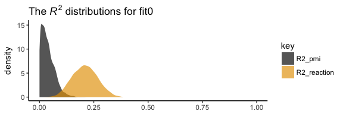

Chapter 03
================
A Solomon Kurz
2018-05-28

3.2. Example with dichotomous *X*: The influence of presumed media influence
----------------------------------------------------------------------------

Here we load a couple necessary packages, load the data, and take a peek at them.

``` r
library(readr)
library(tidyverse)

p <- read_csv("data/pmi/pmi.csv")

glimpse(p)
```

    ## Observations: 123
    ## Variables: 6
    ## $ cond     <int> 1, 0, 1, 0, 0, 0, 0, 1, 0, 0, 1, 0, 1, 0, 1, 1, 0, 0, 1, 0, 1, 1, 1, 1, 1, 0, 1, 0, 1, 0...
    ## $ pmi      <dbl> 7.0, 6.0, 5.5, 6.5, 6.0, 5.5, 3.5, 6.0, 4.5, 7.0, 1.0, 6.0, 5.0, 7.0, 7.0, 7.0, 4.5, 3.5...
    ## $ import   <int> 6, 1, 6, 6, 5, 1, 1, 6, 6, 6, 3, 3, 4, 7, 1, 6, 3, 3, 2, 4, 4, 6, 7, 4, 5, 4, 6, 5, 5, 7...
    ## $ reaction <dbl> 5.25, 1.25, 5.00, 2.75, 2.50, 1.25, 1.50, 4.75, 4.25, 6.25, 1.25, 2.75, 3.75, 5.00, 4.00...
    ## $ gender   <int> 1, 1, 1, 0, 1, 1, 0, 1, 1, 1, 0, 0, 0, 0, 0, 0, 0, 0, 0, 1, 0, 0, 1, 1, 0, 1, 0, 0, 0, 1...
    ## $ age      <dbl> 51.0, 40.0, 26.0, 21.0, 27.0, 25.0, 23.0, 25.0, 22.0, 24.0, 22.0, 21.0, 23.0, 21.0, 22.0...

You can get the male/female split like so:

``` r
p %>% 
  group_by(gender) %>% 
  count()
```

    ## # A tibble: 2 x 2
    ## # Groups: gender [2]
    ##   gender     n
    ##    <int> <int>
    ## 1      0    80
    ## 2      1    43

Here is the split by `condition`:

``` r
p %>% 
  group_by(cond) %>% 
  count()
```

    ## # A tibble: 2 x 2
    ## # Groups: cond [2]
    ##    cond     n
    ##   <int> <int>
    ## 1     0    65
    ## 2     1    58

Here is how to get the ungrouped Mean and *S**D* values for `reaction` and `pmi`, as presented in Table 3.1,

``` r
p %>% 
  select(reaction, pmi) %>% 
  gather() %>% 
  group_by(key) %>% 
  summarise(mean = mean(value),
            sd = sd(value)) %>% 
  mutate_if(is.double, round, digits = 3)
```

    ## # A tibble: 2 x 3
    ##   key       mean    sd
    ##   <chr>    <dbl> <dbl>
    ## 1 pmi       5.60  1.32
    ## 2 reaction  3.48  1.55

You might get the Mean and *S**D* values for `reaction` and `pmi` grouped by `cond` like this:

``` r
p %>% 
  select(reaction, pmi, cond) %>% 
  gather(key, value, -cond) %>% 
  group_by(cond, key) %>% 
  summarise(mean = mean(value),
            sd = sd(value)) %>% 
  mutate_if(is.double, round, digits = 3)
```

    ## # A tibble: 4 x 4
    ## # Groups: cond [2]
    ##    cond key       mean    sd
    ##   <int> <chr>    <dbl> <dbl>
    ## 1     0 pmi       5.38  1.34
    ## 2     0 reaction  3.25  1.61
    ## 3     1 pmi       5.85  1.27
    ## 4     1 reaction  3.75  1.45

Let's load our primary statistical package.

``` r
library(brms)
```

Before we begin, I should acknowledge that I greatly benefited by [this great blog post](http://www.imachordata.com/bayesian-sem-with-brms/) by Jarrett Byrnes.

In brms, we handle mediation models using the [multivariate syntax](https://cran.r-project.org/web/packages/brms/vignettes/brms_multivariate.html). There are a few ways to do this. Let's start simple.

If you look at the path model in Figure 3.3, you'll note that `reaction` is predicted by `pmi` and `cond`. `pmi`, in turn, is predicted solely by `cond`. So we have two regression models, which is just the kind of thing the brms multivariate syntax is for. So first, let's specify both models, which we'll nest in `bf()` functions and save as objects.

``` r
y_model <- bf(reaction ~ 1 + pmi + cond)
m_model <- bf(pmi ~ 1 + cond)
```

Now we have our `bf()` objects in hand, we'll combine them with the `+` operator within the `brm()` function. We'll also specify `set_rescor(FALSE)`--we're not interested in adding a residual correlation between `reaction` and `pmi`.

``` r
fit0 <-
  brm(data = p, family = gaussian,
      y_model + m_model + set_rescor(FALSE),
      chains = 4, cores = 4)
```

Here are our results.

``` r
print(fit0)
```

    ##  Family: MV(gaussian, gaussian) 
    ##   Links: mu = identity; sigma = identity
    ##          mu = identity; sigma = identity 
    ## Formula: reaction ~ 1 + pmi + cond 
    ##          pmi ~ 1 + cond 
    ##    Data: p (Number of observations: 123) 
    ## Samples: 4 chains, each with iter = 2000; warmup = 1000; thin = 1;
    ##          total post-warmup samples = 4000
    ## 
    ## Population-Level Effects: 
    ##                    Estimate Est.Error l-95% CI u-95% CI Eff.Sample Rhat
    ## reaction_Intercept     0.53      0.54    -0.52     1.59       4000 1.00
    ## pmi_Intercept          5.38      0.17     5.05     5.71       4000 1.00
    ## reaction_pmi           0.51      0.10     0.31     0.70       4000 1.00
    ## reaction_cond          0.25      0.26    -0.25     0.75       4000 1.00
    ## pmi_cond               0.48      0.24     0.01     0.96       4000 1.00
    ## 
    ## Family Specific Parameters: 
    ##                Estimate Est.Error l-95% CI u-95% CI Eff.Sample Rhat
    ## sigma_reaction     1.41      0.09     1.25     1.59       4000 1.00
    ## sigma_pmi          1.32      0.09     1.17     1.51       4000 1.00
    ## 
    ## Samples were drawn using sampling(NUTS). For each parameter, Eff.Sample 
    ## is a crude measure of effective sample size, and Rhat is the potential 
    ## scale reduction factor on split chains (at convergence, Rhat = 1).

If you compare our model summary with the coefficients in the path model in Figure 3.3, you'll see our coefficients are the same. The brms summary also includes intercepts and residual variances, which are typically omitted in path diagrams, even though they're still part of the model.

If you're getting lost in all the model output, try this.

``` r
fixef(fit0)[3:5, ] %>% round(digits = 3)
```

    ##               Estimate Est.Error   Q2.5 Q97.5
    ## reaction_pmi     0.506     0.098  0.314 0.698
    ## reaction_cond    0.251     0.258 -0.246 0.752
    ## pmi_cond         0.482     0.243  0.014 0.956

Also note that Hayes tends to refer to the intercepts as constants.

In his Table 3.2, he also includes the *R*<sup>2</sup> values. Here are ours.

``` r
bayes_R2(fit0) %>% round(digits = 3)
```

    ##             Estimate Est.Error  Q2.5 Q97.5
    ## R2_reaction    0.209     0.055 0.101 0.315
    ## R2_pmi         0.040     0.032 0.001 0.116

It's worth it to actually plot the *R*<sup>2</sup> distributions.

``` r
library(ggthemes)

bayes_R2(fit0, summary = F) %>% 
  as_tibble() %>% 
  gather() %>% 
  
  ggplot(aes(x = value, fill = key)) +
  geom_density(color = "transparent", alpha = 2/3) +
  scale_fill_colorblind() +  # we got this color palette from the ggthemes package
  coord_cartesian(xlim = 0:1) +
  labs(title = expression(paste("The ", italic("R")^{2}, " distributions for fit0")),
       x = NULL) +
  theme_classic()
```



We went through the trouble of plotting the *R*<sup>2</sup> distributions because it’s useful to understand that they won’t often be symmetric when they’re near their logical boundaries (i.e., 0 and 1). This is where asymmetric Bayesian credible intervals can really shine.

Let's get down to business, the indirect effect, the *a**b* pathway. In our model

-   *a* = `pmi_cond`
-   *b* = `reaction_pmi`

You can isolate them with `fixef()[i]`.

``` r
fixef(fit0)[5 , ]
```

    ##  Estimate Est.Error      Q2.5     Q97.5 
    ## 0.4819944 0.2430722 0.0135772 0.9562304

``` r
fixef(fit0)[3 , ]
```

    ##  Estimate Est.Error      Q2.5     Q97.5 
    ## 0.5060646 0.0976633 0.3141897 0.6980785

So the naive approach would be to just multiply them.

``` r
(fixef(fit0)[5 , ] * fixef(fit0)[3 , ]) %>% round(digits = 3)
```

    ##  Estimate Est.Error      Q2.5     Q97.5 
    ##     0.244     0.024     0.004     0.668

Now, this does get us the correct 'Estimate' (i.e., posterior mean). However, the posterior *S**D* and 95% intervals are off. If you want to do this properly, you need to work with the poster samples themselves. Here they are:

``` r
post <- posterior_samples(fit0)

glimpse(post)
```

    ## Observations: 4,000
    ## Variables: 8
    ## $ b_reaction_Intercept <dbl> 0.75775425, 0.80799622, 0.27800519, 0.95328528, 1.00721986, 1.26748526, -0.1...
    ## $ b_pmi_Intercept      <dbl> 5.568519, 5.246249, 5.555607, 5.325756, 5.357816, 5.348240, 5.398154, 5.0983...
    ## $ b_reaction_pmi       <dbl> 0.4906762, 0.4781968, 0.5356177, 0.4327614, 0.4134809, 0.4103802, 0.5878054,...
    ## $ b_reaction_cond      <dbl> 0.12545875, 0.42504991, 0.08036166, 0.46447436, 0.35691319, 0.14674151, 0.31...
    ## $ b_pmi_cond           <dbl> -0.228103534, 0.897404248, 0.059609017, 0.677536124, 0.473503990, 0.53950804...
    ## $ sigma_reaction       <dbl> 1.346505, 1.409901, 1.407250, 1.367248, 1.369626, 1.388301, 1.410006, 1.3849...
    ## $ sigma_pmi            <dbl> 1.317257, 1.335113, 1.284563, 1.365747, 1.340849, 1.181413, 1.449527, 1.3403...
    ## $ lp__                 <dbl> -436.8911, -434.6342, -434.0985, -432.9711, -431.9473, -433.9431, -434.0656,...

Here we compute the indirect effect, `ab`.

``` r
post <-
  post %>% 
  mutate(ab = b_pmi_cond*b_reaction_pmi)
```

Now we've got `ab` as a properly computed vector, we can summarize it with the `quantile()` function.

``` r
quantile(post$ab, probs = c(.5, .025, .975)) %>% 
  round(digits = 3)
```

    ##   50%  2.5% 97.5% 
    ## 0.236 0.006 0.534

And we can even visualize it as a density.

``` r
post %>% 
  
  ggplot(aes(x = ab)) +
  geom_density(color = "transparent", 
               fill = colorblind_pal()(2)[2]) +
  scale_y_continuous(NULL, breaks = NULL) +
  labs(title = expression(paste("Our indirect effect, the ", italic("ab"), " pathway")),
       x = NULL) +
  theme_classic()
```


**More to come**

Note. The analyses in this document were done with:

-   R 3.4.4
-   RStudio 1.1.442
-   rmarkdown 1.9
-   readr 1.1.1
-   tidyverse 1.2.1
-   rstan 2.17.3
-   brms 2.3.1
-   ggthemes 3.5.0

Reference
---------

Hayes, A. F. (2018). *Introduction to mediation, moderation, and conditional process analysis: A regression-based approach.* (2nd ed.). New York, NY, US: The Guilford Press.
