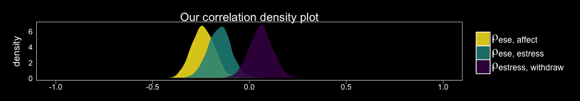
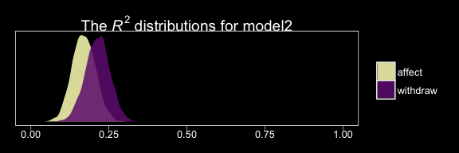

Chapter 04
================
A Solomon Kurz
2018-05-30

4.2. Confounding and causal order
---------------------------------

Here we load a couple necessary packages, load the data, and take a peek at them.

``` r
library(readr)
library(tidyverse)

estress <- read_csv("data/estress/estress.csv")

glimpse(estress)
```

    ## Observations: 262
    ## Variables: 7
    ## $ tenure   <dbl> 1.67, 0.58, 0.58, 2.00, 5.00, 9.00, 0.00, 2.50, 0.50, 0.58, 9.00, 1.92, 2.00, 1.42, 0.92...
    ## $ estress  <dbl> 6.0, 5.0, 5.5, 3.0, 4.5, 6.0, 5.5, 3.0, 5.5, 6.0, 5.5, 4.0, 3.0, 2.5, 3.5, 6.0, 4.0, 6.0...
    ## $ affect   <dbl> 2.60, 1.00, 2.40, 1.16, 1.00, 1.50, 1.00, 1.16, 1.33, 3.00, 3.00, 2.00, 1.83, 1.16, 1.16...
    ## $ withdraw <dbl> 3.00, 1.00, 3.66, 4.66, 4.33, 3.00, 1.00, 1.00, 2.00, 4.00, 4.33, 1.00, 5.00, 1.66, 4.00...
    ## $ sex      <int> 1, 0, 1, 1, 1, 1, 0, 0, 1, 1, 1, 1, 1, 1, 1, 1, 1, 1, 0, 0, 0, 1, 1, 1, 0, 1, 0, 0, 0, 1...
    ## $ age      <int> 51, 45, 42, 50, 48, 48, 51, 47, 40, 43, 57, 36, 33, 29, 33, 48, 40, 45, 37, 42, 54, 57, ...
    ## $ ese      <dbl> 5.33, 6.05, 5.26, 4.35, 4.86, 5.05, 3.66, 6.13, 5.26, 4.00, 2.53, 6.60, 5.20, 5.66, 5.66...

Here are the Pearson's correlations.

``` r
psych::lowerCor(estress, digits = 3)
```

    ##          tenure estrss affect wthdrw sex    age    ese   
    ## tenure    1.000                                          
    ## estress   0.068  1.000                                   
    ## affect   -0.065  0.340  1.000                            
    ## withdraw -0.035  0.064  0.417  1.000                     
    ## sex      -0.003  0.133  0.046  0.050  1.000              
    ## age       0.266  0.066 -0.018 -0.035  0.083  1.000       
    ## ese      -0.060 -0.158 -0.246 -0.243  0.028 -0.083  1.000

Recall that if you want the correlations with Bayesian estimation and those sweet Bayesian credible intervals, you set up an intercept-only multivariate model.

``` r
library(brms)

fit0 <- 
  brm(data = estress, family = gaussian,
      cbind(ese, estress, affect, withdraw) ~ 1,
      chains = 4, cores = 4)
```

The summary:

``` r
print(fit0, digits = 3)
```

    ##  Family: MV(gaussian, gaussian, gaussian, gaussian) 
    ##   Links: mu = identity; sigma = identity
    ##          mu = identity; sigma = identity
    ##          mu = identity; sigma = identity
    ##          mu = identity; sigma = identity 
    ## Formula: ese ~ 1 
    ##          estress ~ 1 
    ##          affect ~ 1 
    ##          withdraw ~ 1 
    ##    Data: estress (Number of observations: 262) 
    ## Samples: 4 chains, each with iter = 2000; warmup = 1000; thin = 1;
    ##          total post-warmup samples = 4000
    ## 
    ## Population-Level Effects: 
    ##                    Estimate Est.Error l-95% CI u-95% CI Eff.Sample  Rhat
    ## ese_Intercept         5.606     0.059    5.488    5.720       4000 1.001
    ## estress_Intercept     4.621     0.087    4.447    4.795       4000 1.000
    ## affect_Intercept      1.599     0.045    1.509    1.685       4000 0.999
    ## withdraw_Intercept    2.322     0.079    2.166    2.473       4000 1.000
    ## 
    ## Family Specific Parameters: 
    ##                          Estimate Est.Error l-95% CI u-95% CI Eff.Sample  Rhat
    ## sigma_ese                   0.953     0.042    0.875    1.038       4000 0.999
    ## sigma_estress               1.436     0.062    1.323    1.563       4000 1.000
    ## sigma_affect                0.730     0.032    0.670    0.796       4000 0.999
    ## sigma_withdraw              1.258     0.056    1.151    1.373       4000 1.001
    ## rescor(ese,estress)        -0.154     0.059   -0.265   -0.038       4000 1.001
    ## rescor(ese,affect)         -0.240     0.058   -0.353   -0.122       4000 1.000
    ## rescor(estress,affect)      0.334     0.054    0.224    0.436       4000 1.000
    ## rescor(ese,withdraw)       -0.238     0.059   -0.348   -0.120       4000 0.999
    ## rescor(estress,withdraw)    0.061     0.061   -0.057    0.178       4000 1.000
    ## rescor(affect,withdraw)     0.411     0.052    0.304    0.507       4000 1.000
    ## 
    ## Samples were drawn using sampling(NUTS). For each parameter, Eff.Sample 
    ## is a crude measure of effective sample size, and Rhat is the potential 
    ## scale reduction factor on split chains (at convergence, Rhat = 1).

Since we have posteriors for the correlations, why not plot them? Here we use the `theme_black()` from brms and a color scheme from the [viridis package](https://cran.r-project.org/web/packages/viridis/index.html).

``` r
library(viridis)

posterior_samples(fit0) %>% 
  select(rescor__ese__estress, rescor__ese__affect, rescor__estress__withdraw) %>% 
  gather() %>% 
  
  ggplot(aes(x = value, fill = key)) +
  geom_density(alpha = .85, color = "transparent") +
  scale_fill_viridis(discrete = T, option = "D", direction = -1,
                     labels = c(expression(paste(rho["ese, affect"])),
                                expression(paste(rho["ese, estress"])),
                                expression(paste(rho["estress, withdraw"]))),
                     guide = guide_legend(label.hjust = 0,
                                          label.theme = element_text(size = 15, angle = 0, color = "white"),
                                          title.theme = element_blank())) +
  coord_cartesian(xlim = c(-1, 1)) +
  labs(title = "Our correlation density plot",
       x = NULL) +
  theme_black() +
  theme(panel.grid = element_blank(),
        axis.text.y = element_text(hjust = 0),
        axis.ticks.y = element_blank())
```



### Accounting for confounding and epiphenomenal association

``` r
y_model <- bf(withdraw ~ 1 + estress + affect + ese + sex + tenure)
m_model <- bf(affect ~ 1 + estress + ese + sex + tenure)
```

With our `y_model` and `m_model` defined, we're ready to fit.

``` r
fit1 <-
  brm(data = estress, family = gaussian,
      y_model + m_model + set_rescor(FALSE),
      chains = 4, cores = 4)
```

Here's the summary:

``` r
print(fit1, digits = 3)
```

    ##  Family: MV(gaussian, gaussian) 
    ##   Links: mu = identity; sigma = identity
    ##          mu = identity; sigma = identity 
    ## Formula: withdraw ~ 1 + estress + affect + ese + sex + tenure 
    ##          affect ~ 1 + estress + ese + sex + tenure 
    ##    Data: estress (Number of observations: 262) 
    ## Samples: 4 chains, each with iter = 2000; warmup = 1000; thin = 1;
    ##          total post-warmup samples = 4000
    ## 
    ## Population-Level Effects: 
    ##                    Estimate Est.Error l-95% CI u-95% CI Eff.Sample  Rhat
    ## withdraw_Intercept    2.746     0.562    1.625    3.865       4000 0.999
    ## affect_Intercept      1.784     0.315    1.160    2.382       4000 0.999
    ## withdraw_estress     -0.092     0.053   -0.194    0.015       4000 1.000
    ## withdraw_affect       0.706     0.101    0.504    0.903       4000 0.999
    ## withdraw_ese         -0.212     0.077   -0.365   -0.059       4000 0.999
    ## withdraw_sex          0.125     0.142   -0.144    0.403       4000 1.000
    ## withdraw_tenure      -0.002     0.011   -0.023    0.019       4000 0.999
    ## affect_estress        0.160     0.030    0.101    0.219       4000 0.999
    ## affect_ese           -0.155     0.045   -0.242   -0.066       4000 0.999
    ## affect_sex            0.016     0.086   -0.151    0.182       4000 0.999
    ## affect_tenure        -0.011     0.006   -0.023    0.001       4000 0.999
    ## 
    ## Family Specific Parameters: 
    ##                Estimate Est.Error l-95% CI u-95% CI Eff.Sample  Rhat
    ## sigma_withdraw    1.127     0.050    1.037    1.225       4000 1.000
    ## sigma_affect      0.671     0.030    0.616    0.731       4000 0.999
    ## 
    ## Samples were drawn using sampling(NUTS). For each parameter, Eff.Sample 
    ## is a crude measure of effective sample size, and Rhat is the potential 
    ## scale reduction factor on split chains (at convergence, Rhat = 1).

In the printout, notice how first within intercepts and then with covariates and sigma, the coefficients are presented as for `withdraw` first and then `affect`. Also notice how the coefficients for the covariates are presented in the same order for each criterions. Hopefully that'll make it easier to sift through the printout. Happily, our coefficients are quite similar to those in Table 4.1

Here are the *R*<sup>2</sup> values.

``` r
bayes_R2(fit1) %>% round(digits = 3)
```

    ##             Estimate Est.Error  Q2.5 Q97.5
    ## R2_withdraw    0.212     0.038 0.138 0.286
    ## R2_affect      0.170     0.037 0.099 0.244

These are also in the same ballpark, but a little higher. Why not glance at their densities?

``` r
bayes_R2(fit1, summary = F) %>% 
  as_tibble() %>% 
  gather() %>% 
  
  ggplot(aes(x = value, fill = key)) +
  geom_density(color = "transparent", alpha = .85) +
  scale_fill_manual(values = c(viridis_pal(option = "A")(7)[c(7, 3)]), 
                    labels = c("affect", "withdraw"),
                    guide = guide_legend(title.theme = element_blank())) +
  scale_y_continuous(NULL, breaks = NULL) +
  coord_cartesian(xlim = 0:1) +
  labs(title = expression(paste("The ", italic("R")^{2}, " distributions for fit1")),
       x = NULL) +
  theme_black() +
  theme(panel.grid = element_blank())
```



Here we retrieve the posterior samples, compute the indirect effect, and summarize the indirect effect with `quantile()`.

``` r
post <-
  posterior_samples(fit1) %>% 
  mutate(ab = b_affect_estress*b_withdraw_affect)

quantile(post$ab, probs = c(.5, .025, .975)) %>% 
  round(digits = 3)
```

    ##   50%  2.5% 97.5% 
    ## 0.111 0.065 0.169

Similar results to the text (p. 127). Here's what it looks like.

``` r
post %>% 
  
  ggplot(aes(x = ab)) +
  geom_density(color = "transparent",
               fill = viridis_pal(option = "A")(7)[5]) +
  geom_vline(xintercept = quantile(post$ab, probs = c(.5, .025, .975)),
             color = "black", linetype = c(1, 3, 3)) +
  scale_y_continuous(NULL, breaks = NULL) +
  xlab(expression(italic("ab"))) +
  theme_black() +
  theme(panel.grid = element_blank())
```


Once again, those sweet Bayesian credible intervals get the job done.

Here's a way to get both the direct effect, *c*<sup>′</sup> (i.e., `b_withdraw_estress`), and the total effect, *c* (i.e., *c*<sup>′</sup> + *ab*) of `estress` on `withdraw`.

``` r
post %>% 
  mutate(c = b_withdraw_estress + ab) %>% 
  rename(c_prime = b_withdraw_estress) %>% 
  select(c_prime, c) %>% 
  gather() %>%
  group_by(key) %>% 
  summarize(mean = mean(value), 
            ll = quantile(value, probs = .025),
            ul = quantile(value, probs = .975)) %>% 
  mutate_if(is_double, round, digits = 3)
```

    ## # A tibble: 2 x 4
    ##   key        mean      ll     ul
    ##   <chr>     <dbl>   <dbl>  <dbl>
    ## 1 c        0.0200 -0.0860 0.128 
    ## 2 c_prime -0.0920 -0.194  0.0150

Both appear pretty small. Which leads us to the next section...

4.3 Effect size
---------------

### The partially standardized effect.

We get *SD*s using the `sd()` function. Here's the *SD* for our *Y* variable, `withdraw`.

``` r
sd(estress$withdraw)
```

    ## [1] 1.24687

Here we compute the partially standardized effect sizes for *c*<sup>′</sup> and *ab* by dividing those vectors in our `post` object by `sd(estress$withdraw)`, which we saved as `SD_y`.

``` r
SD_y <- sd(estress$withdraw)

post %>% 
  mutate(c_prime_ps = b_withdraw_estress/SD_y,
         ab_ps = ab/SD_y) %>% 
  mutate(c_ps = c_prime_ps + ab_ps) %>% 
  select(c_prime_ps, ab_ps, c_ps) %>% 
  gather() %>%
  group_by(key) %>% 
  summarize(mean = mean(value), 
            median = median(value),
            ll = quantile(value, probs = .025),
            ul = quantile(value, probs = .975)) %>% 
  mutate_if(is_double, round, digits = 3)
```

    ## # A tibble: 3 x 5
    ##   key           mean  median      ll     ul
    ##   <chr>        <dbl>   <dbl>   <dbl>  <dbl>
    ## 1 ab_ps       0.0900  0.0890  0.0520 0.136 
    ## 2 c_prime_ps -0.0740 -0.0750 -0.156  0.0120
    ## 3 c_ps        0.0160  0.0160 -0.0690 0.103

The results are similar, though not identical, to those in the text. Here we have both rounding error and estimation differences at play. The plots:

``` r
post %>% 
  mutate(c_prime_ps = b_withdraw_estress/SD_y,
         ab_ps = ab/SD_y) %>% 
  mutate(c_ps = c_prime_ps + ab_ps) %>% 
  select(c_prime_ps, ab_ps, c_ps) %>% 
  gather() %>% 
  
  ggplot(aes(x = value, fill = key)) +
  geom_density(alpha = .85, color = "transparent") +
  scale_fill_viridis(discrete = T, option = "D") +
  scale_y_continuous(NULL, breaks = NULL) +
  labs(title = "Partially-standardized coefficients",
       x = NULL) +
  theme_black() +
  theme(panel.grid = element_blank(),
        legend.position = "none") +
  facet_wrap(~key, ncol = 3)
```


On page 135, Hayes revisited the model from section 3.3. We'll have to reload the data and refit that model to follow along.

``` r
p <- read_csv("data/pmi/pmi.csv")

y_model <- bf(reaction ~ 1 + pmi + cond)
m_model <- bf(pmi ~ 1 + cond)

fit_3.3 <-
  brm(data = p, family = gaussian,
      y_model + m_model + set_rescor(FALSE),
      chains = 4, cores = 4)
```

The partially-standardized parameters require some posterior samples wrangling.

``` r
post_3.3 <- posterior_samples(fit_3.3)

SD_y_3.3 <- sd(p$reaction)

post_3.3 %>% 
  mutate(ab = b_pmi_cond * b_reaction_pmi,
         c_prime = b_reaction_cond) %>% 
  mutate(ab_ps = ab/SD_y_3.3,
         c_prime_ps = c_prime/SD_y_3.3) %>% 
  mutate(c_ps = c_prime_ps + ab_ps) %>% 
  select(c_prime_ps, ab_ps, c_ps) %>% 
  gather() %>%
  group_by(key) %>% 
  summarize(mean = mean(value), 
            median = median(value),
            ll = quantile(value, probs = .025),
            ul = quantile(value, probs = .975)) %>% 
  mutate_if(is_double, round, digits = 3)
```

    ## # A tibble: 3 x 5
    ##   key         mean median       ll    ul
    ##   <chr>      <dbl>  <dbl>    <dbl> <dbl>
    ## 1 ab_ps      0.154  0.151  0.00400 0.334
    ## 2 c_prime_ps 0.164  0.162 -0.167   0.495
    ## 3 c_ps       0.318  0.317 -0.0480  0.691

Happily, these results are closer to those in the text than with the previous example.

### The completely standardized effect

**Note**. Hayes could have made this more clear in the text, but the `estress` model he referred to in this section was the one from way back in section 3.5, *not* the one from earlier in this chapter.

One way to get a sandardized sollution is to standardize the variables in the data and then fit the model with those standardized variables. To do so, we'll revisit our custom `standardize()`, put it to work, and fit the standardized version of the model from section 3.5, which we'll call `fit1_z`.

``` r
sandardize <- function(x){
  (x - mean(x))/sd(x)
}

estress <-
  estress %>% 
  mutate(withdraw_z = sandardize(withdraw), 
         estress_z  = sandardize(estress), 
         affect_z   = sandardize(affect))

y_model <- bf(withdraw_z ~ 1 + estress_z + affect_z)
m_model <- bf(affect_z ~ 1 + estress_z)

fit_3.5_z <-
  brm(data = estress, family = gaussian,
      y_model + m_model + set_rescor(FALSE),
      chains = 4, cores = 4)
```

Here they are, our newly standardized coefficients:

``` r
fixef(fit_3.5_z) %>% round(digits = 3)
```

    ##                     Estimate Est.Error   Q2.5 Q97.5
    ## withdrawz_Intercept   -0.001     0.055 -0.110 0.107
    ## affectz_Intercept      0.001     0.060 -0.118 0.118
    ## withdrawz_estress_z   -0.086     0.059 -0.201 0.030
    ## withdrawz_affect_z     0.445     0.059  0.325 0.558
    ## affectz_estress_z      0.340     0.058  0.228 0.453

Here we do the wrangling necessary to spell out the standardized effects for *ab*, *c*<sup>′</sup>, and *c*.

``` r
post_3.5 <- posterior_samples(fit_3.5_z)

post_3.5 %>% 
  mutate(ab_s = b_affectz_estress_z * b_withdrawz_affect_z,
         c_prime_s = b_withdrawz_estress_z) %>%
  mutate(c_s = ab_s + c_prime_s) %>% 
  select(c_prime_s, ab_s, c_s) %>% 
  gather() %>%
  group_by(key) %>% 
  summarize(mean = mean(value), 
            median = median(value),
            ll = quantile(value, probs = .025),
            ul = quantile(value, probs = .975)) %>% 
  mutate_if(is_double, round, digits = 3)
```

    ## # A tibble: 3 x 5
    ##   key          mean  median      ll     ul
    ##   <chr>       <dbl>   <dbl>   <dbl>  <dbl>
    ## 1 ab_s       0.151   0.150   0.0910 0.220 
    ## 2 c_prime_s -0.0860 -0.0860 -0.201  0.0300
    ## 3 c_s        0.0650  0.0640 -0.0610 0.189

Let's confirm that we can recover these values by applying the formulas on page 135 to the unstandardized model, which we'll call `fit_3.5`. First, we'll have to fit that model (recall, we haven't fit that one since chapter 3).

``` r
y_model <- bf(withdraw ~ 1 + estress + affect)
m_model <- bf(affect ~ 1 + estress)

fit_3.5 <-
  brm(data = estress, family = gaussian,
      y_model + m_model + set_rescor(FALSE),
      chains = 4, cores = 4)
```

Here are the unstandardized coefficients:

``` r
fixef(fit_3.5) %>% round(digits = 3)
```

    ##                    Estimate Est.Error   Q2.5 Q97.5
    ## withdraw_Intercept    1.444     0.254  0.945 1.942
    ## affect_Intercept      0.799     0.142  0.527 1.076
    ## withdraw_estress     -0.077     0.052 -0.179 0.023
    ## withdraw_affect       0.770     0.106  0.559 0.979
    ## affect_estress        0.173     0.029  0.116 0.230

And here we hand compute the standardized effects by applying Hayes's formulas to the unstandardized results:

``` r
post_3.5 <- posterior_samples(fit_3.5)

SD_x <- sd(estress$estress)
SD_y <- sd(estress$withdraw)

post_3.5 %>% 
  mutate(ab = b_affect_estress * b_withdraw_affect,
         c_prime = b_withdraw_estress) %>% 
  mutate(ab_s = (SD_x*ab)/SD_y,
         c_prime_s = (SD_x*c_prime)/SD_y) %>% 
  mutate(c_s = ab_s + c_prime_s) %>% 
  select(c_prime_s, ab_s, c_s) %>% 
  gather() %>%
  group_by(key) %>% 
  summarize(mean = mean(value), 
            median = median(value),
            ll = quantile(value, probs = .025),
            ul = quantile(value, probs = .975)) %>% 
  mutate_if(is_double, round, digits = 3)
```

    ## # A tibble: 3 x 5
    ##   key          mean  median      ll     ul
    ##   <chr>       <dbl>   <dbl>   <dbl>  <dbl>
    ## 1 ab_s       0.152   0.150   0.0920 0.222 
    ## 2 c_prime_s -0.0880 -0.0880 -0.205  0.0260
    ## 3 c_s        0.0650  0.0640 -0.0560 0.185

Success!

### Some (problematic) measures only for indirect effects.

Hayes recommended against these, so I'm not going to bother working any examples.

4.4 Statistical power
---------------------

As Hayed discussed, power is an important but thorny issue within the frequentist paradigm. Given that we’re not particularly interested in rejecting the point-null hypothesis as Bayesians and that we bring in priors (which we’ve largely avoided explicitly mentioning in his project but have been quietly using all along), the issue is even more difficult for Bayesians. To learn more on the topic, check out [Miočević, MacKinnon, and Levy's paper](https://www.tandfonline.com/doi/abs/10.1080/10705511.2017.1312407?src=recsys&journalCode=hsem20) on power in small-sample Bayesian analyses or [Gelman and Carlin's paper](http://journals.sagepub.com/doi/pdf/10.1177/1745691614551642) offering an alternative to the power paradigm.

4.5 Multiple *X*s or *Y*s: Analyze separately or simultaneously?
----------------------------------------------------------------

### Multiple *X* variables.

The same basic problems with multicollinearity applies to the Bayesian paradigm, too.

### Estimation of a model with multiple *X* variables in ~~PROCESS~~ brms.

Hayes discussed the limitation that his PROCESS program may only handle a single *X* variable in the `x=` part of the command line, for which he displayed a workaround. We don’t have such a limitation in brms. Using Hayes’s hypothetical data syntax for a model with three *X*s, the brms code would be:

``` r
y_model <- bf(dv ~ 1 + iv1 + iv2 + iv3 + med)
m_model <- bf(med ~ 1 + iv1 + iv2 + iv3)

fit <-
  brm(data = data, family = gaussian,
      y_model + m_model + set_rescor(FALSE),
      chains = 4, cores = 4)
```

To show it in action, let's simulate some data.

``` r
N <- 1e3

set.seed(4.5)
d <-
  tibble(iv1 = rnorm(N, mean = 0, sd = 1),
         iv2 = rnorm(N, mean = 0, sd = 1),
         iv3 = rnorm(N, mean = 0, sd = 1),
         med = rnorm(N, mean = 0 + iv1*-1 + iv2*0 + iv3*1, sd = 1),
         dv  = rnorm(N, mean = 0 + iv1*0 + iv2*.5 + iv3*1 + med*.5, sd = 1))

head(d)
```

    ## # A tibble: 6 x 5
    ##      iv1    iv2     iv3    med     dv
    ##    <dbl>  <dbl>   <dbl>  <dbl>  <dbl>
    ## 1  0.217  0.177 -1.39   -0.755 -1.77 
    ## 2 -0.542  1.69   0.0513  0.721  0.402
    ## 3  0.891 -1.35   1.10    0.777 -0.132
    ## 4  0.596  1.08  -0.203  -0.955  1.02 
    ## 5  1.64  -0.456 -0.428  -2.89  -3.26 
    ## 6  0.689 -0.681 -0.429  -0.462 -2.38

Before we proceed, if data simulation is new to you, you might check out [Roger Peng's helpful tutorial](https://www.youtube.com/watch?v=tvv4IA8PEzw) on the subject.

Here's the model.

``` r
y_model <- bf(dv ~ 1 + iv1 + iv2 + iv3 + med)
m_model <- bf(med ~ 1 + iv1 + iv2 + iv3)

fit_4.5_simulation_mx <-
  brm(data = d, family = gaussian,
      y_model + m_model + set_rescor(FALSE),
      chains = 4, cores = 4)
```

And the results:

``` r
print(fit_4.5_simulation_mx)
```

    ##  Family: MV(gaussian, gaussian) 
    ##   Links: mu = identity; sigma = identity
    ##          mu = identity; sigma = identity 
    ## Formula: dv ~ 1 + iv1 + iv2 + iv3 + med 
    ##          med ~ 1 + iv1 + iv2 + iv3 
    ##    Data: d (Number of observations: 1000) 
    ## Samples: 4 chains, each with iter = 2000; warmup = 1000; thin = 1;
    ##          total post-warmup samples = 4000
    ## 
    ## Population-Level Effects: 
    ##               Estimate Est.Error l-95% CI u-95% CI Eff.Sample Rhat
    ## dv_Intercept     -0.01      0.03    -0.07     0.05       4000 1.00
    ## med_Intercept     0.00      0.03    -0.06     0.06       4000 1.00
    ## dv_iv1            0.02      0.04    -0.06     0.11       3046 1.00
    ## dv_iv2            0.56      0.03     0.50     0.62       4000 1.00
    ## dv_iv3            1.01      0.05     0.92     1.10       2907 1.00
    ## dv_med            0.46      0.03     0.40     0.53       2394 1.00
    ## med_iv1          -0.93      0.03    -1.00    -0.87       4000 1.00
    ## med_iv2           0.03      0.03    -0.03     0.09       4000 1.00
    ## med_iv3           0.98      0.03     0.92     1.04       4000 1.00
    ## 
    ## Family Specific Parameters: 
    ##           Estimate Est.Error l-95% CI u-95% CI Eff.Sample Rhat
    ## sigma_dv      1.00      0.02     0.96     1.05       4000 1.00
    ## sigma_med     0.97      0.02     0.93     1.02       4000 1.00
    ## 
    ## Samples were drawn using sampling(NUTS). For each parameter, Eff.Sample 
    ## is a crude measure of effective sample size, and Rhat is the potential 
    ## scale reduction factor on split chains (at convergence, Rhat = 1).

brms came through just fine. If you wanted to simulate data with a particular correlation structure for the `iv` variables, you might use the `mvnorm()` function from the [MASS package](https://cran.r-project.org/web/packages/MASS/index.html), which you can learn more about [here](http://blog.revolutionanalytics.com/2016/02/multivariate_data_with_r.html).

### Multiple *Y* variables.

We've already been using the multivariate syntax in brms for our simple mediation models. Fitting a mediation model with multiple *Y* variables is a minor extension. Let's simulate more data.

``` r
N <- 1e3

set.seed(4.5)
d <-
  tibble(iv  = rnorm(N, mean = 0, sd = 1),
         med = rnorm(N, mean = 0 + iv*.5, sd = 1),
         dv1 = rnorm(N, mean = 0 + iv*-1 + med*0,  sd = 1),
         dv2 = rnorm(N, mean = 0 + iv*0  + med*.5, sd = 1),
         dv3 = rnorm(N, mean = 0 + iv*1  + med*1,  sd = 1))

head(d)
```

    ## # A tibble: 6 x 5
    ##       iv    med    dv1    dv2     dv3
    ##    <dbl>  <dbl>  <dbl>  <dbl>   <dbl>
    ## 1  0.217  0.285 -1.61   0.999  0.420 
    ## 2 -0.542  1.42   0.594  0.836  0.0208
    ## 3  0.891 -0.902  0.206  0.120 -0.954 
    ## 4  0.596  1.37  -0.799  0.530  3.13  
    ## 5  1.64   0.362 -2.06  -0.643  0.840 
    ## 6  0.689 -0.337 -1.12   0.487 -1.03

Here's the model.

``` r
y_model_1 <- bf(dv1 ~ 1 + iv + med)
y_model_2 <- bf(dv2 ~ 1 + iv + med)
y_model_3 <- bf(dv3 ~ 1 + iv + med)
m_model <- bf(med ~ 1 + iv)

fit_4.5_simulation_my <-
  brm(data = d, family = gaussian,
      y_model_1 + y_model_2 + y_model_3 + m_model + set_rescor(FALSE),
      chains = 4, cores = 4)
```

``` r
print(fit_4.5_simulation_my)
```

    ##  Family: MV(gaussian, gaussian, gaussian, gaussian) 
    ##   Links: mu = identity; sigma = identity
    ##          mu = identity; sigma = identity
    ##          mu = identity; sigma = identity
    ##          mu = identity; sigma = identity 
    ## Formula: dv1 ~ 1 + iv + med 
    ##          dv2 ~ 1 + iv + med 
    ##          dv3 ~ 1 + iv + med 
    ##          med ~ 1 + iv 
    ##    Data: d (Number of observations: 1000) 
    ## Samples: 4 chains, each with iter = 2000; warmup = 1000; thin = 1;
    ##          total post-warmup samples = 4000
    ## 
    ## Population-Level Effects: 
    ##               Estimate Est.Error l-95% CI u-95% CI Eff.Sample Rhat
    ## dv1_Intercept     0.01      0.03    -0.05     0.08       4000 1.00
    ## dv2_Intercept     0.00      0.03    -0.06     0.06       4000 1.00
    ## dv3_Intercept    -0.01      0.03    -0.07     0.05       4000 1.00
    ## med_Intercept     0.03      0.03    -0.04     0.09       4000 1.00
    ## dv1_iv           -1.05      0.04    -1.12    -0.98       4000 1.00
    ## dv1_med           0.05      0.03    -0.01     0.11       4000 1.00
    ## dv2_iv            0.05      0.04    -0.02     0.12       4000 1.00
    ## dv2_med           0.53      0.03     0.47     0.59       4000 1.00
    ## dv3_iv            1.03      0.04     0.96     1.10       4000 1.00
    ## dv3_med           1.06      0.03     1.00     1.12       4000 1.00
    ## med_iv            0.53      0.03     0.46     0.59       4000 1.00
    ## 
    ## Family Specific Parameters: 
    ##           Estimate Est.Error l-95% CI u-95% CI Eff.Sample Rhat
    ## sigma_dv1     0.98      0.02     0.93     1.02       4000 1.00
    ## sigma_dv2     0.97      0.02     0.93     1.02       4000 1.00
    ## sigma_dv3     1.00      0.02     0.96     1.05       4000 1.00
    ## sigma_med     1.00      0.02     0.96     1.04       4000 1.00
    ## 
    ## Samples were drawn using sampling(NUTS). For each parameter, Eff.Sample 
    ## is a crude measure of effective sample size, and Rhat is the potential 
    ## scale reduction factor on split chains (at convergence, Rhat = 1).

brms to the rescue once again!

Note. The analyses in this document were done with:

-   R 3.4.4
-   RStudio 1.1.442
-   rmarkdown 1.9
-   readr 1.1.1
-   tidyverse 1.2.1
-   psych 1.7.3.21
-   rstan 2.17.3
-   brms 2.3.1
-   viridis 0.4.0

Reference
---------

Hayes, A. F. (2018). *Introduction to mediation, moderation, and conditional process analysis: A regression-based approach.* (2nd ed.). New York, NY, US: The Guilford Press.
