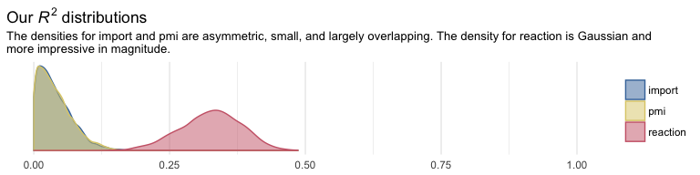
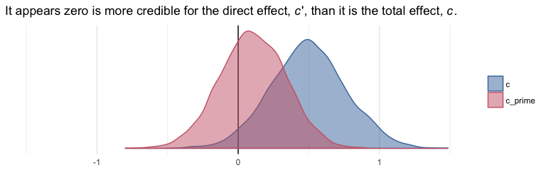
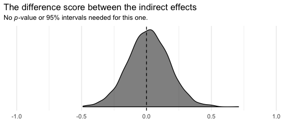
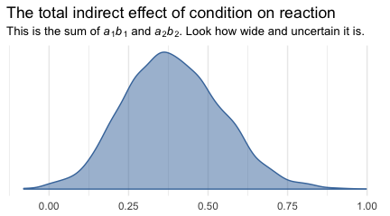
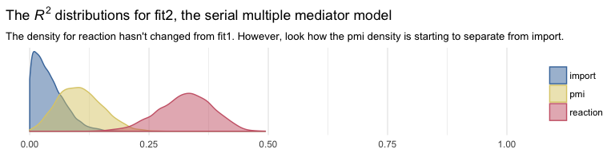
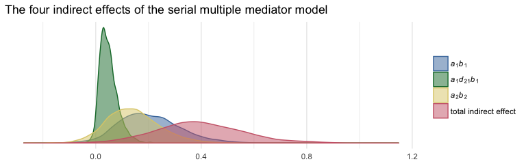

Chapter 05
================
A Solomon Kurz
2018-06-03

5.2 Example using the presumed media influence study
----------------------------------------------------

Here we load a couple necessary packages, load the data, and take a `glimpse()`.

``` r
library(readr)
library(tidyverse)

pmi <- read_csv("data/pmi/pmi.csv")

glimpse(pmi)
```

    ## Observations: 123
    ## Variables: 6
    ## $ cond     <int> 1, 0, 1, 0, 0, 0, 0, 1, 0, 0, 1, 0, 1, 0, 1, 1, 0, 0, 1, 0, 1, 1, 1, 1, 1, 0, 1, 0, 1, 0...
    ## $ pmi      <dbl> 7.0, 6.0, 5.5, 6.5, 6.0, 5.5, 3.5, 6.0, 4.5, 7.0, 1.0, 6.0, 5.0, 7.0, 7.0, 7.0, 4.5, 3.5...
    ## $ import   <int> 6, 1, 6, 6, 5, 1, 1, 6, 6, 6, 3, 3, 4, 7, 1, 6, 3, 3, 2, 4, 4, 6, 7, 4, 5, 4, 6, 5, 5, 7...
    ## $ reaction <dbl> 5.25, 1.25, 5.00, 2.75, 2.50, 1.25, 1.50, 4.75, 4.25, 6.25, 1.25, 2.75, 3.75, 5.00, 4.00...
    ## $ gender   <int> 1, 1, 1, 0, 1, 1, 0, 1, 1, 1, 0, 0, 0, 0, 0, 0, 0, 0, 0, 1, 0, 0, 1, 1, 0, 1, 0, 0, 0, 1...
    ## $ age      <dbl> 51.0, 40.0, 26.0, 21.0, 27.0, 25.0, 23.0, 25.0, 22.0, 24.0, 22.0, 21.0, 23.0, 21.0, 22.0...

Bayesian correlations, recall, just take an intercepts-only multivariate model.

``` r
library(brms)

fit0 <- 
  brm(data = pmi, family = gaussian,
      cbind(pmi, import) ~ 1,
      chains = 4, cores = 4)
```

A little indexing with the `posterior_summary()` function will get us the Bayesian correlation with its posterior *SD* and intervals.

``` r
posterior_summary(fit0)["rescor__pmi__import", ] %>% round(digits = 3)
```

    ##  Estimate Est.Error      Q2.5     Q97.5 
    ##     0.278     0.082     0.113     0.431

As with single mediation models, the multiple mediation model requires we carefully construct the formula for each criterion. We'll continue to use the multiple `bf()` approach.

``` r
m1_model <- bf(import   ~ 1 + cond)
m2_model <- bf(pmi      ~ 1 + cond)
y_model  <- bf(reaction ~ 1 + import + pmi + cond)
```

And now we fit the model.

``` r
fit1 <-
  brm(data = pmi, family = gaussian,
      y_model + m1_model + m2_model + set_rescor(FALSE),
      chains = 4, cores = 4)
```

``` r
print(fit1)
```

    ##  Family: MV(gaussian, gaussian, gaussian) 
    ##   Links: mu = identity; sigma = identity
    ##          mu = identity; sigma = identity
    ##          mu = identity; sigma = identity 
    ## Formula: reaction ~ 1 + import + pmi + cond 
    ##          import ~ 1 + cond 
    ##          pmi ~ 1 + cond 
    ##    Data: pmi (Number of observations: 123) 
    ## Samples: 4 chains, each with iter = 2000; warmup = 1000; thin = 1;
    ##          total post-warmup samples = 4000
    ## 
    ## Population-Level Effects: 
    ##                    Estimate Est.Error l-95% CI u-95% CI Eff.Sample Rhat
    ## reaction_Intercept    -0.16      0.53    -1.18     0.88       4000 1.00
    ## import_Intercept       3.91      0.22     3.48     4.33       4000 1.00
    ## pmi_Intercept          5.38      0.17     5.05     5.70       4000 1.00
    ## reaction_import        0.32      0.07     0.18     0.47       4000 1.00
    ## reaction_pmi           0.40      0.09     0.21     0.58       4000 1.00
    ## reaction_cond          0.11      0.25    -0.38     0.59       4000 1.00
    ## import_cond            0.63      0.31     0.01     1.24       4000 1.00
    ## pmi_cond               0.47      0.24    -0.00     0.97       4000 1.00
    ## 
    ## Family Specific Parameters: 
    ##                Estimate Est.Error l-95% CI u-95% CI Eff.Sample Rhat
    ## sigma_reaction     1.30      0.09     1.15     1.48       4000 1.00
    ## sigma_import       1.73      0.11     1.53     1.96       4000 1.00
    ## sigma_pmi          1.32      0.09     1.16     1.50       4000 1.00
    ## 
    ## Samples were drawn using sampling(NUTS). For each parameter, Eff.Sample 
    ## is a crude measure of effective sample size, and Rhat is the potential 
    ## scale reduction factor on split chains (at convergence, Rhat = 1).

Because we have three criteria, we'll have three Bayesian *R*<sup>2</sup> posteriors.

``` r
library(ggthemes)

bayes_R2(fit1, summary = F) %>% 
  as_tibble() %>% 
  gather() %>% 
  mutate(key = str_remove(key, "R2_")) %>% 
  
  ggplot(aes(x = value, color = key, fill = key)) +
  geom_density(alpha = .5) +
  scale_color_ptol() +
  scale_fill_ptol() +
  scale_y_continuous(NULL, breaks = NULL) +
  coord_cartesian(xlim = 0:1) +
  labs(title = expression(paste("Our ", italic("R")^{2}, " distributions")),
       subtitle = "The densities for import and pmi are asymmetric, small, and largely overlapping. The density for reaction is Gaussian and\nmore impressive in magnitude.",
       x = NULL) +
  theme_minimal() +
  theme(legend.title = element_blank())
```



It'll take a bit of data wrangling to rename our model parameters to the *a*, *b*... configuration. We'll compute the indirect effects and *c*, too.

``` r
post <- posterior_samples(fit1)

post<-
  post %>% 
  mutate(a1 = b_import_cond,
         a2 = b_pmi_cond,
         b1 = b_reaction_import,
         b2 = b_reaction_pmi,
         c_prime = b_reaction_cond) %>% 
  mutate(a1b1 = a1*b1,
         a2b2 = a2*b2) %>% 
  mutate(c = c_prime + a1b1 + a2b2)
```

Here are their summaries. Since Bayesians use means, medians, and sometimes the mode to describe the central tendencies of a parameter, this time we'll mix it up and just use the median.

``` r
post %>% 
  select(a1:c) %>% 
  gather() %>% 
  group_by(key) %>% 
  summarize(median = median(value), 
            ll = quantile(value, probs = .025),
            ul = quantile(value, probs = .975)) %>% 
  mutate_if(is_double, round, digits = 3)
```

    ## # A tibble: 8 x 4
    ##   key     median       ll    ul
    ##   <chr>    <dbl>    <dbl> <dbl>
    ## 1 a1       0.626  0.00700 1.24 
    ## 2 a1b1     0.194  0.00200 0.448
    ## 3 a2       0.468  0       0.973
    ## 4 a2b2     0.178  0       0.428
    ## 5 b1       0.325  0.180   0.471
    ## 6 b2       0.398  0.211   0.585
    ## 7 c        0.498 -0.0400  1.06 
    ## 8 c_prime  0.107 -0.379   0.588

``` r
post %>% 
  mutate(dif = a1b1*b1) %>% 
  summarize(median = median(dif), 
            ll = quantile(dif, probs = .025),
            ul = quantile(dif, probs = .975)) %>% 
  mutate_if(is_double, round, digits = 3)
```

    ##   median    ll    ul
    ## 1  0.061 0.001 0.188

In the middle paragraph of page 158, Hayes showd how the mean difference in `imprt` between the two `cond` groups multiplied by `b1`, the coefficient of `import` predicting `reaction`, is equal to the `a1b1` indirect effect. He does this with simple algebra using the group means and the point estimates.

Let's follow along. First, we'll get those two group means and save them as numbers to arbitrary precision.

``` r
(
  import_means <-
    pmi %>%
    group_by(cond) %>% 
    summarize(mean = mean(import))
 )
```

    ## # A tibble: 2 x 2
    ##    cond  mean
    ##   <int> <dbl>
    ## 1     0  3.91
    ## 2     1  4.53

``` r
(cond_0_import_mean <- import_means[1, 2] %>% pull())
```

    ## [1] 3.907692

``` r
(cond_1_import_mean <- import_means[2, 2] %>% pull())
```

    ## [1] 4.534483

Here we follow the formula in the last sentence of the paragraph and then compare the results to the posterior for `a1b1`.

``` r
post %>% 
  # Using his formula to make our new vector, `hand_made_a1b1` 
  mutate(hand_made_a1b1 = (cond_1_import_mean - cond_0_import_mean)*b1) %>% 
  # Here's all the usual data wrangling
  select(a1b1, hand_made_a1b1) %>% 
  gather() %>% 
  group_by(key) %>% 
  summarize(mean = mean(value), 
            median = median(value), 
            ll = quantile(value, probs = .025),
            ul = quantile(value, probs = .975)) %>% 
  mutate_if(is_double, round, digits = 3)
```

    ## # A tibble: 2 x 5
    ##   key             mean median      ll    ul
    ##   <chr>          <dbl>  <dbl>   <dbl> <dbl>
    ## 1 a1b1           0.202  0.194 0.00200 0.448
    ## 2 hand_made_a1b1 0.204  0.204 0.113   0.295

Yep, at the mean, Hayes's formula is spot on. But the distributions are distinct. They differ slightly at the median and vastly in the widths of the posterior intervals. I’m no mathematician, so take this with a grain of salt, but I suspect this has to do with how we used fixed values (i.e., the difference of the subsample means) to compute `hand_made_a1b1`, but all the components in `a1b1` were estimated.

Here we'll follow the same protocol for `a2b2`.

``` r
(
  pmi_means <-
    pmi %>%
    group_by(cond) %>% 
    summarize(mean = mean(pmi))
 )
```

    ## # A tibble: 2 x 2
    ##    cond  mean
    ##   <int> <dbl>
    ## 1     0  5.38
    ## 2     1  5.85

``` r
cond_0_pmi_mean <- pmi_means[1, 2] %>% pull()
cond_1_pmi_mean <- pmi_means[2, 2] %>% pull()
```

``` r
post %>% 
  mutate(hand_made_a2b2 = (cond_1_pmi_mean - cond_0_pmi_mean)*b2) %>% 
  select(a2b2, hand_made_a2b2) %>% 
  gather() %>% 
  group_by(key) %>% 
  summarize(mean = mean(value), 
            median = median(value), 
            ll = quantile(value, probs = .025),
            ul = quantile(value, probs = .975)) %>% 
  mutate_if(is_double, round, digits = 3)
```

    ## # A tibble: 2 x 5
    ##   key             mean median    ll    ul
    ##   <chr>          <dbl>  <dbl> <dbl> <dbl>
    ## 1 a2b2           0.188  0.178 0     0.428
    ## 2 hand_made_a2b2 0.190  0.190 0.101 0.279

To get the total indirect effect as discussed on page 160, we simply add the `a1b1` and `a2b2` columns.

``` r
post <-
  post %>% 
  mutate(total_indirect_effect = a1b1 + a2b2) 

post %>% 
  select(total_indirect_effect) %>% 
  summarize(mean = mean(total_indirect_effect), 
            median = median(total_indirect_effect), 
            ll = quantile(total_indirect_effect, probs = .025),
            ul = quantile(total_indirect_effect, probs = .975)) %>% 
  mutate_if(is_double, round, digits = 3)
```

    ##   mean median    ll    ul
    ## 1 0.39  0.384 0.111 0.703

To use the equations on the top of page 161, we'll just work directly with the original vectors in `post`.

``` r
post %>% 
  mutate(Y_bar_given_X_1 = b_import_Intercept + b_reaction_cond*1 + b_reaction_import*b_import_Intercept + b_reaction_pmi*b_pmi_Intercept,
         Y_bar_given_X_0 = b_import_Intercept + b_reaction_cond*0 + b_reaction_import*b_import_Intercept + b_reaction_pmi*b_pmi_Intercept) %>% 
  mutate(c_prime_by_hand = Y_bar_given_X_1 - Y_bar_given_X_0) %>% 
  select(c_prime, c_prime_by_hand) %>% 
  gather() %>% 
  group_by(key) %>% 
  summarize(mean = mean(value), 
            median = median(value), 
            ll = quantile(value, probs = .025),
            ul = quantile(value, probs = .975))
```

    ## # A tibble: 2 x 5
    ##   key              mean median     ll    ul
    ##   <chr>           <dbl>  <dbl>  <dbl> <dbl>
    ## 1 c_prime         0.105  0.107 -0.379 0.588
    ## 2 c_prime_by_hand 0.105  0.107 -0.379 0.588

We computed `c` a while ago.

``` r
post %>% 
  summarize(mean = mean(c), 
            median = median(c), 
            ll = quantile(c, probs = .025),
            ul = quantile(c, probs = .975))
```

    ##        mean   median          ll       ul
    ## 1 0.4953603 0.497973 -0.04034939 1.055767

And `c` minus `c_prime` is straight subtraction.

``` r
post %>% 
  mutate(c_minus_c_prime = c - c_prime) %>% 
  summarize(mean = mean(c_minus_c_prime), 
            median = median(c_minus_c_prime), 
            ll = quantile(c_minus_c_prime, probs = .025),
            ul = quantile(c_minus_c_prime, probs = .975))
```

    ##        mean    median        ll        ul
    ## 1 0.3900979 0.3839824 0.1107489 0.7026917

5.3 Statistical inference
-------------------------

### Inference about the direct and total effects.

We're not going to bother with *p*-values and we've already computed the 95% Bayesian credible intervals, above. But we can examine our parameters with a density plot.

``` r
post %>% 
  select(c, c_prime) %>% 
  gather() %>%
  
  ggplot(aes(x = value, fill = key, color = key)) +
  geom_vline(xintercept = 0, color = "black") +
  geom_density(alpha = .5) +
  scale_color_ptol(NULL) +
  scale_fill_ptol(NULL) +
  scale_y_continuous(NULL, breaks = NULL) +
  labs(title = expression(paste("It appears zero is more credible for the direct effect, ", italic(c), "', than it is the total effect, ", italic(c), ".")),
       x = NULL) +
  coord_cartesian(xlim = -c(-1.5, 1.5)) +
  theme_minimal()
```



### Inference about specific indirect effects.

Again, no need to worry about bootstrapping within the Bayesian paradigm. We can compute high-quality percentile-based intervals with our HMC-based posterior samples.

``` r
post %>%
  select(a1b1, a2b2) %>% 
  gather() %>% 
  group_by(key) %>% 
  summarize(ll = quantile(value, probs = .025),
            ul = quantile(value, probs = .975)) %>% 
  mutate_if(is.double, round, digits = 3)
```

    ## # A tibble: 2 x 3
    ##   key        ll    ul
    ##   <chr>   <dbl> <dbl>
    ## 1 a1b1  0.00200 0.448
    ## 2 a2b2  0       0.428

### Pairwise comparisons between specific indirect effects.

Within the Bayesian paradigm, it's straightforward to compare indirect effects. All one has to do is compute a difference score and summarize it somehow. Here it is, `a1b1` minus `a2b2`

``` r
post <-
  post %>% 
  mutate(difference = a1b1 - a2b2) 

post %>%
  summarize(mean = mean(difference),
            ll = quantile(difference, probs = .025),
            ul = quantile(difference, probs = .975)) %>% 
  mutate_if(is.double, round, digits = 3)
```

    ##    mean     ll    ul
    ## 1 0.015 -0.305 0.336

Why not plot?

``` r
post %>% 
  
  ggplot(aes(x = difference)) +
  geom_vline(xintercept = 0, color = "black", linetype = 2) +
  geom_density(color = "black", fill = "black", alpha = .5) +
  scale_y_continuous(NULL, breaks = NULL) +
  labs(title = "The difference score between the indirect effects",
       subtitle = expression(paste("No ", italic(p), "-value or 95% intervals needed for this one.")),
       x = NULL) +
  coord_cartesian(xlim = -1:1) +
  theme_minimal()
```



Although note well that this does not mean their difference is exactly zero. The shape of the posterior distribution testifies our uncertainty in their difference. Our best bet is that the difference is approximately zero, but it could easily be plus or minus a quarter of a point or more.

### Inference about the total indirect effect.

Here's the plot.

``` r
post %>% 
  
  ggplot(aes(x = total_indirect_effect, fill = factor(0), color = factor(0))) +
  geom_density(alpha = .5) +
  scale_color_ptol() +
  scale_fill_ptol() +
  scale_y_continuous(NULL, breaks = NULL) +
  labs(title = "The total indirect effect of condition on reaction",
       subtitle = expression(paste("This is the sum of ", italic(a)[1], italic(b)[1], " and ", italic(a)[2], italic(b)[2], ". Look how wide and uncertain it is.")),
       x = NULL) +
  theme_minimal() +
  theme(legend.position = "none")
```



5.4 The serial multiple mediator model
--------------------------------------

### Example from the presumed media influence study.

The model syntax is similar to the earlier multiple mediator model. All we change is adding `import` to the list of predictors in the `m2_model`.

``` r
m1_model <- bf(import   ~ 1 + cond)
m2_model <- bf(pmi      ~ 1 + import + cond)
y_model  <- bf(reaction ~ 1 + import + pmi + cond)

fit2 <-
  brm(data = pmi, family = gaussian,
      y_model + m1_model + m2_model + set_rescor(FALSE),
      chains = 4, cores = 4)
```

``` r
print(fit2)
```

    ##  Family: MV(gaussian, gaussian, gaussian) 
    ##   Links: mu = identity; sigma = identity
    ##          mu = identity; sigma = identity
    ##          mu = identity; sigma = identity 
    ## Formula: reaction ~ 1 + import + pmi + cond 
    ##          import ~ 1 + cond 
    ##          pmi ~ 1 + import + cond 
    ##    Data: pmi (Number of observations: 123) 
    ## Samples: 4 chains, each with iter = 2000; warmup = 1000; thin = 1;
    ##          total post-warmup samples = 4000
    ## 
    ## Population-Level Effects: 
    ##                    Estimate Est.Error l-95% CI u-95% CI Eff.Sample Rhat
    ## reaction_Intercept    -0.15      0.53    -1.18     0.90       4000 1.00
    ## import_Intercept       3.91      0.22     3.47     4.35       4000 1.00
    ## pmi_Intercept          4.61      0.31     4.02     5.22       4000 1.00
    ## reaction_import        0.32      0.07     0.18     0.47       4000 1.00
    ## reaction_pmi           0.40      0.09     0.21     0.58       4000 1.00
    ## reaction_cond          0.11      0.25    -0.38     0.59       4000 1.00
    ## import_cond            0.63      0.32     0.00     1.26       4000 1.00
    ## pmi_import             0.20      0.07     0.06     0.33       4000 1.00
    ## pmi_cond               0.35      0.23    -0.10     0.81       4000 1.00
    ## 
    ## Family Specific Parameters: 
    ##                Estimate Est.Error l-95% CI u-95% CI Eff.Sample Rhat
    ## sigma_reaction     1.30      0.08     1.15     1.48       4000 1.00
    ## sigma_import       1.73      0.12     1.53     1.97       4000 1.00
    ## sigma_pmi          1.28      0.08     1.13     1.45       4000 1.00
    ## 
    ## Samples were drawn using sampling(NUTS). For each parameter, Eff.Sample 
    ## is a crude measure of effective sample size, and Rhat is the potential 
    ## scale reduction factor on split chains (at convergence, Rhat = 1).

The *R*<sup>2</sup> posterior densities:

``` r
bayes_R2(fit2, summary = F) %>% 
  as_tibble() %>% 
  gather() %>% 
  mutate(key = str_remove(key, "R2_")) %>% 
  
  ggplot(aes(x = value, color = key, fill = key)) +
  geom_density(alpha = .5) +
  scale_color_ptol() +
  scale_fill_ptol() +
  scale_y_continuous(NULL, breaks = NULL) +
  coord_cartesian(xlim = 0:1) +
  labs(title = expression(paste("The ", italic("R")^{2}, " distributions for fit2, the serial multiple mediator model")),
       subtitle = "The density for reaction hasn't changed from fit1. However, look how the pmi density is starting to separate from import.",
       x = NULL) +
  theme_minimal() +
  theme(legend.title = element_blank())
```



As before, here we'll save the posterior samples into a data frame and rename the parameters a bit to match Hayes's nomenclature.

``` r
post <- posterior_samples(fit2)

post <-
  post %>% 
  mutate(a1 = b_import_cond,
         a2 = b_pmi_cond,
         b1 = b_reaction_import,
         b2 = b_reaction_pmi,
         c_prime = b_reaction_cond,
         d21 = b_pmi_import)
```

Here are the parameter summaries for the pathways depicted in Figure 5.6.

``` r
post %>% 
  select(a1:d21) %>% 
  gather() %>% 
  group_by(key) %>% 
  summarize(mean = mean(value), 
            median = median(value), 
            ll = quantile(value, probs = .025),
            ul = quantile(value, probs = .975)) %>% 
  mutate_if(is_double, round, digits = 3)
```

    ## # A tibble: 6 x 5
    ##   key      mean median       ll    ul
    ##   <chr>   <dbl>  <dbl>    <dbl> <dbl>
    ## 1 a1      0.632  0.632  0.00300 1.26 
    ## 2 a2      0.353  0.356 -0.105   0.807
    ## 3 b1      0.324  0.324  0.183   0.472
    ## 4 b2      0.396  0.396  0.214   0.581
    ## 5 c_prime 0.106  0.105 -0.380   0.589
    ## 6 d21     0.195  0.195  0.0600  0.329

To get our version of the parameter summaries in Table 5.2, all you have to do is add the summaries for the intercepts to what we did above.

``` r
post %>% 
  rename(im1 = b_import_Intercept,
         im2 = b_pmi_Intercept,
         iy = b_reaction_Intercept) %>% 
  select(a1:d21, starts_with("i")) %>% 
  gather() %>% 
  group_by(key) %>% 
  summarize(mean = mean(value), 
            median = median(value), 
            ll = quantile(value, probs = .025),
            ul = quantile(value, probs = .975)) %>% 
  mutate_if(is_double, round, digits = 3)
```

    ## # A tibble: 9 x 5
    ##   key       mean median       ll    ul
    ##   <chr>    <dbl>  <dbl>    <dbl> <dbl>
    ## 1 a1       0.632  0.632  0.00300 1.26 
    ## 2 a2       0.353  0.356 -0.105   0.807
    ## 3 b1       0.324  0.324  0.183   0.472
    ## 4 b2       0.396  0.396  0.214   0.581
    ## 5 c_prime  0.106  0.105 -0.380   0.589
    ## 6 d21      0.195  0.195  0.0600  0.329
    ## 7 im1      3.91   3.91   3.46    4.35 
    ## 8 im2      4.61   4.61   4.02    5.22 
    ## 9 iy      -0.146 -0.148 -1.18    0.898

Here we compute the four indirect effects.

``` r
post <-
  post %>%  
  mutate(a1b1 = a1*b1,
         a2b2 = a2*b2,
         a1d21b2 = a1*d21*b2) %>% 
  mutate(total_indirect_effect = a1b1 + a2b2 + a1d21b2)
```

The summaries for the indirect effects are as follows.

``` r
post %>% 
  select(a1b1:total_indirect_effect) %>% 
  gather() %>% 
  group_by(key) %>% 
  summarize(mean = mean(value), 
            median = median(value), 
            ll = quantile(value, probs = .025),
            ul = quantile(value, probs = .975)) %>% 
  mutate_if(is_double, round, digits = 3)
```

    ## # A tibble: 4 x 5
    ##   key                     mean median       ll    ul
    ##   <chr>                  <dbl>  <dbl>    <dbl> <dbl>
    ## 1 a1b1                  0.204  0.194   0.00100 0.457
    ## 2 a1d21b2               0.0490 0.0440 -0.00100 0.129
    ## 3 a2b2                  0.141  0.135  -0.0380  0.358
    ## 4 total_indirect_effect 0.394  0.386   0.0820  0.752

To get the contrasts Hayes presented in page 179, we just do a little subtraction.

``` r
post %>%  
  transmute(C1 = a1b1 - a2b2,
            C2 = a1b1 - a1d21b2,
            C3 = a2b2 - a1d21b2) %>% 
  gather() %>% 
  group_by(key) %>% 
  summarize(mean = mean(value), 
            median = median(value), 
            ll = quantile(value, probs = .025),
            ul = quantile(value, probs = .975)) %>% 
  mutate_if(is_double, round, digits = 3)
```

    ## # A tibble: 3 x 5
    ##   key     mean median       ll    ul
    ##   <chr>  <dbl>  <dbl>    <dbl> <dbl>
    ## 1 C1    0.0630 0.0630 -0.256   0.386
    ## 2 C2    0.155  0.144  -0.00200 0.379
    ## 3 C3    0.0920 0.0880 -0.109   0.319

And just because it's fun, we may as well plot our indirect effects.

``` r
# this will help us save a little space with the plot code
my_labels <- c(expression(paste(italic(a)[1], italic(b)[1])),
               expression(paste(italic(a)[1], italic(d)[21], italic(b)[1])),
               expression(paste(italic(a)[2], italic(b)[2])),
               "total indirect effect")
post %>% 
  select(a1b1:total_indirect_effect) %>% 
  gather() %>%
  
  ggplot(aes(x = value, fill = key, color = key)) +
  geom_density(alpha = .5) +
  scale_color_ptol(NULL, labels = my_labels,
                   guide = guide_legend(label.hjust = 0)) +
  scale_fill_ptol(NULL, labels = my_labels,
                   guide = guide_legend(label.hjust = 0)) +
  scale_y_continuous(NULL, breaks = NULL) +
  labs(title = "The four indirect effects of the serial multiple mediator model",
       x = NULL) +
  theme_minimal()
```



Note. The analyses in this document were done with:

-   R 3.4.4
-   RStudio 1.1.442
-   rmarkdown 1.9
-   readr 1.1.1
-   tidyverse 1.2.1
-   rstan 2.17.3
-   brms 2.3.1
-   ggthemes 3.5.0

Reference
---------

Hayes, A. F. (2018). *Introduction to mediation, moderation, and conditional process analysis: A regression-based approach.* (2nd ed.). New York, NY, US: The Guilford Press.
