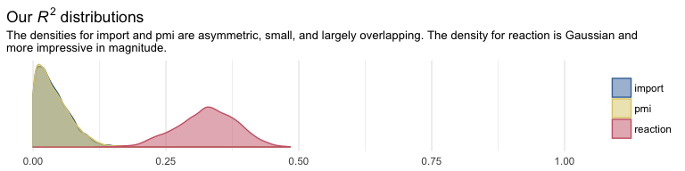
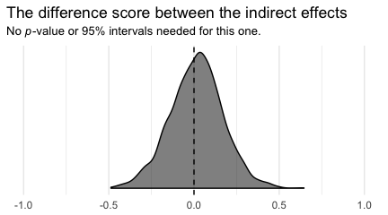
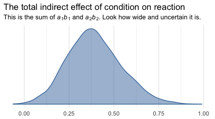

Chapter 05
================
A Solomon Kurz
2018-06-02

5.2 Example using the presumed media influence study
----------------------------------------------------

Here we load a couple necessary packages, load the data, and take a peek at them.

``` r
library(readr)
library(tidyverse)

pmi <- read_csv("data/pmi/pmi.csv")

glimpse(pmi)
```

    ## Observations: 123
    ## Variables: 6
    ## $ cond     <int> 1, 0, 1, 0, 0, 0, 0, 1, 0, 0, 1, 0, 1, 0, 1, 1, 0, 0, 1, 0, 1, 1, 1, 1, 1, 0, 1, 0, 1, 0...
    ## $ pmi      <dbl> 7.0, 6.0, 5.5, 6.5, 6.0, 5.5, 3.5, 6.0, 4.5, 7.0, 1.0, 6.0, 5.0, 7.0, 7.0, 7.0, 4.5, 3.5...
    ## $ import   <int> 6, 1, 6, 6, 5, 1, 1, 6, 6, 6, 3, 3, 4, 7, 1, 6, 3, 3, 2, 4, 4, 6, 7, 4, 5, 4, 6, 5, 5, 7...
    ## $ reaction <dbl> 5.25, 1.25, 5.00, 2.75, 2.50, 1.25, 1.50, 4.75, 4.25, 6.25, 1.25, 2.75, 3.75, 5.00, 4.00...
    ## $ gender   <int> 1, 1, 1, 0, 1, 1, 0, 1, 1, 1, 0, 0, 0, 0, 0, 0, 0, 0, 0, 1, 0, 0, 1, 1, 0, 1, 0, 0, 0, 1...
    ## $ age      <dbl> 51.0, 40.0, 26.0, 21.0, 27.0, 25.0, 23.0, 25.0, 22.0, 24.0, 22.0, 21.0, 23.0, 21.0, 22.0...

``` r
library(brms)

fit0 <- 
  brm(data = pmi, family = gaussian,
      cbind(pmi, import) ~ 1,
      chains = 4, cores = 4)
```

Here's the Bayesian correlation with its posterior *SD* and intervals.

``` r
posterior_summary(fit0)["rescor__pmi__import", ] %>% round(digits = 3)
```

    ##  Estimate Est.Error      Q2.5     Q97.5 
    ##     0.277     0.085     0.101     0.436

``` r
y_model  <- bf(reaction ~ 1 + import + pmi + cond)
m1_model <- bf(import   ~ 1 + cond)
m2_model <- bf(pmi      ~ 1 + cond)
```

Now we have our `bf()` objects in hand, we'll combine them with the `+` operator within the `brm()` function. We'll also specify `set_rescor(FALSE)`--we're not interested in adding a residual correlation between `reaction` and `pmi`.

``` r
fit1 <-
  brm(data = pmi, family = gaussian,
      y_model + m1_model + m2_model + set_rescor(FALSE),
      chains = 4, cores = 4)
```

``` r
print(fit1)
```

    ##  Family: MV(gaussian, gaussian, gaussian) 
    ##   Links: mu = identity; sigma = identity
    ##          mu = identity; sigma = identity
    ##          mu = identity; sigma = identity 
    ## Formula: reaction ~ 1 + import + pmi + cond 
    ##          import ~ 1 + cond 
    ##          pmi ~ 1 + cond 
    ##    Data: pmi (Number of observations: 123) 
    ## Samples: 4 chains, each with iter = 2000; warmup = 1000; thin = 1;
    ##          total post-warmup samples = 4000
    ## 
    ## Population-Level Effects: 
    ##                    Estimate Est.Error l-95% CI u-95% CI Eff.Sample Rhat
    ## reaction_Intercept    -0.14      0.54    -1.19     0.93       4000 1.00
    ## import_Intercept       3.90      0.22     3.47     4.32       4000 1.00
    ## pmi_Intercept          5.38      0.17     5.06     5.71       4000 1.00
    ## reaction_import        0.32      0.07     0.19     0.46       4000 1.00
    ## reaction_pmi           0.40      0.10     0.20     0.58       4000 1.00
    ## reaction_cond          0.10      0.23    -0.36     0.56       4000 1.00
    ## import_cond            0.63      0.31     0.03     1.24       4000 1.00
    ## pmi_cond               0.47      0.24    -0.01     0.95       4000 1.00
    ## 
    ## Family Specific Parameters: 
    ##                Estimate Est.Error l-95% CI u-95% CI Eff.Sample Rhat
    ## sigma_reaction     1.30      0.09     1.15     1.49       4000 1.00
    ## sigma_import       1.73      0.11     1.53     1.97       4000 1.00
    ## sigma_pmi          1.32      0.09     1.16     1.50       4000 1.00
    ## 
    ## Samples were drawn using sampling(NUTS). For each parameter, Eff.Sample 
    ## is a crude measure of effective sample size, and Rhat is the potential 
    ## scale reduction factor on split chains (at convergence, Rhat = 1).

Now we have three criteria, we'll have three Bayesian *R*<sup>2</sup> posteriors.

``` r
library(ggthemes)

bayes_R2(fit1, summary = F) %>% 
  as_tibble() %>% 
  gather() %>% 
  mutate(key = str_remove(key, "R2_")) %>% 
  
  ggplot(aes(x = value, color = key, fill = key)) +
  geom_density(alpha = .5) +
  scale_color_ptol() +
  scale_fill_ptol() +
  scale_y_continuous(NULL, breaks = NULL) +
  coord_cartesian(xlim = 0:1) +
  labs(title = expression(paste("Our ", italic("R")^{2}, " distributions")),
       subtitle = "The densities for import and pmi are asymmetric, small, and largely overlapping. The density for reaction is Gaussian and\nmore impressive in magnitude.",
       x = NULL) +
  theme_minimal() +
  theme(legend.title = element_blank())
```



It'll take a bit of data wrangling to rename/configure our model parameters to the *a*, *b*...configuration.

``` r
post <- posterior_samples(fit1)

post<-
  post %>% 
  mutate(a1 = b_import_cond,
         a2 = b_pmi_cond,
         b1 = b_reaction_import,
         b2 = b_reaction_pmi,
         c_prime = b_reaction_cond) %>% 
  mutate(a1b1 = a1*b1,
         a2b2 = a2*b2) %>% 
  mutate(c = c_prime + a1b1 + a2b2)
```

Here are their summaries, this time using the posterior medians instead of the means.

``` r
post %>% 
  select(a1:c) %>% 
  gather() %>% 
  group_by(key) %>% 
  summarize(median = median(value), 
            ll = quantile(value, probs = .025),
            ul = quantile(value, probs = .975)) %>% 
  mutate_if(is_double, round, digits = 3)
```

    ## # A tibble: 8 x 4
    ##   key     median       ll    ul
    ##   <chr>    <dbl>    <dbl> <dbl>
    ## 1 a1       0.627  0.0340  1.24 
    ## 2 a1b1     0.195  0.0110  0.455
    ## 3 a2       0.476 -0.0110  0.953
    ## 4 a2b2     0.179 -0.00500 0.423
    ## 5 b1       0.325  0.187   0.462
    ## 6 b2       0.397  0.203   0.580
    ## 7 c        0.495 -0.0240  1.02 
    ## 8 c_prime  0.102 -0.362   0.558

``` r
post %>% 
  mutate(dif = a1b1*b1) %>% 
  summarize(median = median(dif), 
            ll = quantile(dif, probs = .025),
            ul = quantile(dif, probs = .975)) %>% 
  mutate_if(is_double, round, digits = 3)
```

    ##   median    ll    ul
    ## 1  0.062 0.003 0.184

In the middle paragraph of page 158, Hayes shows how the mean difference in `imprt` between the two `cond` groups multiplied by `b1`, the coefficient of `import` predicting `reaction`, is equal to the `a1b1` indirect effect. He does this with simple algebra using the group means and the point estimates.

Let's follow along. First, here we'll get those two group means and save them as numbers to arbitrary precision.

``` r
(
  import_means <-
    pmi %>%
    group_by(cond) %>% 
    summarize(mean = mean(import))
 )
```

    ## # A tibble: 2 x 2
    ##    cond  mean
    ##   <int> <dbl>
    ## 1     0  3.91
    ## 2     1  4.53

``` r
(cond_0_import_mean <- import_means[1, 2] %>% pull())
```

    ## [1] 3.907692

``` r
(cond_1_import_mean <- import_means[2, 2] %>% pull())
```

    ## [1] 4.534483

Here we follow the formula in the last sentence of the paragraph and then compare the results to the posterior for `a1b1`.

``` r
post %>% 
  # Using his formula to make our new vector, `hand_made_a1b1` 
  mutate(hand_made_a1b1 = (cond_1_import_mean - cond_0_import_mean)*b1) %>% 
  # Here's all the usual data wrangling
  select(a1b1, hand_made_a1b1) %>% 
  gather() %>% 
  group_by(key) %>% 
  summarize(mean = mean(value), 
            median = median(value), 
            ll = quantile(value, probs = .025),
            ul = quantile(value, probs = .975)) %>% 
  mutate_if(is_double, round, digits = 3)
```

    ## # A tibble: 2 x 5
    ##   key             mean median     ll    ul
    ##   <chr>          <dbl>  <dbl>  <dbl> <dbl>
    ## 1 a1b1           0.205  0.195 0.0110 0.455
    ## 2 hand_made_a1b1 0.203  0.204 0.117  0.290

Yep, at the mean, Hayes's formula is spot on. But the distributions are distinct. They differ slightly at the median and vastly in the widths of the posterior intervals. I’m no mathematician, so take this with a grain of salt, but I suspect this has to do with how we used fixed values (i.e., the difference of the subsample means) to compute `hand_made_a1b1`, but all the components in `a1b1` were estimated.

Here we'll follow the same protocol for `a2b2`.

``` r
(
  pmi_means <-
    pmi %>%
    group_by(cond) %>% 
    summarize(mean = mean(pmi))
 )
```

    ## # A tibble: 2 x 2
    ##    cond  mean
    ##   <int> <dbl>
    ## 1     0  5.38
    ## 2     1  5.85

``` r
cond_0_pmi_mean <- pmi_means[1, 2] %>% pull()
cond_1_pmi_mean <- pmi_means[2, 2] %>% pull()
```

``` r
post %>% 
  mutate(hand_made_a2b2 = (cond_1_pmi_mean - cond_0_pmi_mean)*b2) %>% 
  select(a2b2, hand_made_a2b2) %>% 
  gather() %>% 
  group_by(key) %>% 
  summarize(mean = mean(value), 
            median = median(value), 
            ll = quantile(value, probs = .025),
            ul = quantile(value, probs = .975)) %>% 
  mutate_if(is_double, round, digits = 3)
```

    ## # A tibble: 2 x 5
    ##   key             mean median       ll    ul
    ##   <chr>          <dbl>  <dbl>    <dbl> <dbl>
    ## 1 a2b2           0.189  0.179 -0.00500 0.423
    ## 2 hand_made_a2b2 0.188  0.189  0.0970  0.276

To get the total indirece effect as discussed on page 160, we simply add the `a1b1` and `a2b2` columns.

``` r
post <-
  post %>% 
  mutate(total_indirect_effect = a1b1 + a2b2) 

post %>% 
  select(total_indirect_effect) %>% 
  summarize(mean = mean(total_indirect_effect), 
            median = median(total_indirect_effect), 
            ll = quantile(total_indirect_effect, probs = .025),
            ul = quantile(total_indirect_effect, probs = .975)) %>% 
  mutate_if(is_double, round, digits = 3)
```

    ##    mean median    ll    ul
    ## 1 0.394  0.387 0.109 0.709

To work the equations on the top of page 161, we'll just work directly with the original vectors in `post`.

``` r
post %>% 
  mutate(Y_bar_given_X_1 = b_import_Intercept + b_reaction_cond*1 + b_reaction_import*b_import_Intercept + b_reaction_pmi*b_pmi_Intercept,
         Y_bar_given_X_0 = b_import_Intercept + b_reaction_cond*0 + b_reaction_import*b_import_Intercept + b_reaction_pmi*b_pmi_Intercept) %>% 
  mutate(c_prime_by_hand = Y_bar_given_X_1 - Y_bar_given_X_0) %>% 
  select(c_prime, c_prime_by_hand) %>% 
  gather() %>% 
  group_by(key) %>% 
  summarize(mean = mean(value), 
            median = median(value), 
            ll = quantile(value, probs = .025),
            ul = quantile(value, probs = .975))
```

    ## # A tibble: 2 x 5
    ##   key              mean median     ll    ul
    ##   <chr>           <dbl>  <dbl>  <dbl> <dbl>
    ## 1 c_prime         0.103  0.102 -0.362 0.558
    ## 2 c_prime_by_hand 0.103  0.102 -0.362 0.558

We already computed `c` a while ago.

``` r
post %>% 
  summarize(mean = mean(c), 
            median = median(c), 
            ll = quantile(c, probs = .025),
            ul = quantile(c, probs = .975))
```

    ##        mean    median          ll       ul
    ## 1 0.4967174 0.4954561 -0.02405504 1.021424

And `c` minus `c_prime` is straight subtraction.

``` r
post %>% 
  mutate(c_minus_c_prime = c - c_prime) %>% 
  summarize(mean = mean(c_minus_c_prime), 
            median = median(c_minus_c_prime), 
            ll = quantile(c_minus_c_prime, probs = .025),
            ul = quantile(c_minus_c_prime, probs = .975))
```

    ##      mean   median        ll        ul
    ## 1 0.39388 0.387354 0.1094908 0.7088137

5.3 Statistical inference
-------------------------

### Inference about the direct and total effects.

We're not going to bother with *p*-values and we've already computed the 95% Bayesian credible intervals, above. But we can examine our parameters with a density plot.

``` r
post %>% 
  select(c, c_prime) %>% 
  gather() %>%
  
  ggplot(aes(x = value, fill = key, color = key)) +
  geom_vline(xintercept = 0, color = "black") +
  geom_density(alpha = .5) +
  scale_color_ptol(NULL) +
  scale_fill_ptol(NULL) +
  scale_y_continuous(NULL, breaks = NULL) +
  labs(title = expression(paste("It appears zero is more credible for the direct effect, ", italic(c), "', than it is the total effect, ", italic(c), ".")),
       x = NULL) +
  coord_cartesian(xlim = -c(-1.5, 1.5)) +
  theme_minimal()
```


### Inference about specific indirect effects.

Again, no need to worry about bootstrapping within the Bayesian paradigm. We have high-quality percentile-based intervals based on our HMC-based posterior samples.

``` r
post %>%
  select(a1b1, a2b2) %>% 
  gather() %>% 
  group_by(key) %>% 
  summarize(ll = quantile(value, probs = .025),
            ul = quantile(value, probs = .975)) %>% 
  mutate_if(is.double, round, digits = 3)
```

    ## # A tibble: 2 x 3
    ##   key         ll    ul
    ##   <chr>    <dbl> <dbl>
    ## 1 a1b1   0.0110  0.455
    ## 2 a2b2  -0.00500 0.423

### Pairwise comparisons between specific indirect effects.

Within the Bayesian paradigm, it straightforward to compare indirect effects. All one has to do is compute a difference score. Here it is, `a1b1` minus `a2b2`

``` r
post <-
  post %>% 
  mutate(difference = a1b1 - a2b2) 

post %>%
  summarize(mean = mean(difference),
            ll = quantile(difference, probs = .025),
            ul = quantile(difference, probs = .975)) %>% 
  mutate_if(is.double, round, digits = 3)
```

    ##    mean     ll    ul
    ## 1 0.016 -0.298 0.331

Why not plot?

``` r
post %>% 
  
  ggplot(aes(x = difference)) +
  geom_vline(xintercept = 0, color = "black", linetype = 2) +
  geom_density(color = "black", fill = "black", alpha = .5) +
  scale_y_continuous(NULL, breaks = NULL) +
  labs(title = "The difference score between the indirect effects",
       subtitle = expression(paste("No ", italic(p), "-value or 95% intervals needed for this one.")),
       x = NULL) +
  coord_cartesian(xlim = -1:1) +
  theme_minimal()
```



### Inference about the total indirect effect.

Here's the plot.

``` r
post %>% 
  
  ggplot(aes(x = total_indirect_effect, fill = factor(0), color = factor(0))) +
  geom_density(alpha = .5) +
  scale_color_ptol() +
  scale_fill_ptol() +
  scale_y_continuous(NULL, breaks = NULL) +
  labs(title = "The total indirect effect of condition on reaction",
       subtitle = expression(paste("This is the sum of ", italic(a)[1], italic(b)[1], " and ", italic(a)[2], italic(b)[2], ". Look how wide and uncertain it is.")),
       x = NULL) +
  theme_minimal() +
  theme(legend.position = "none")
```



5.4 The serial multiple mediator model
--------------------------------------

**More to come...**

Note. The analyses in this document were done with:

-   R 3.4.4
-   RStudio 1.1.442
-   rmarkdown 1.9
-   readr 1.1.1
-   tidyverse 1.2.1
-   rstan 2.17.3
-   brms 2.3.1
-   ggthemes 3.5.0

Reference
---------

Hayes, A. F. (2018). *Introduction to mediation, moderation, and conditional process analysis: A regression-based approach.* (2nd ed.). New York, NY, US: The Guilford Press.
