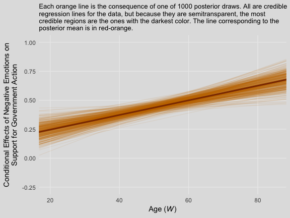
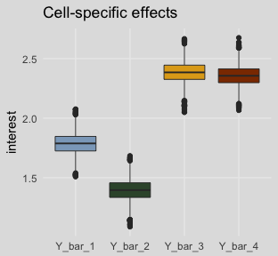
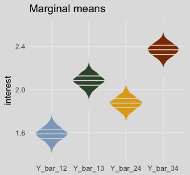
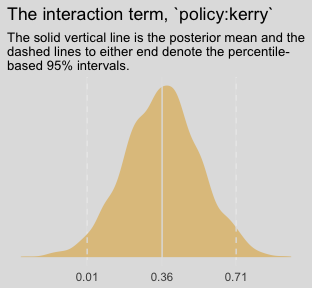
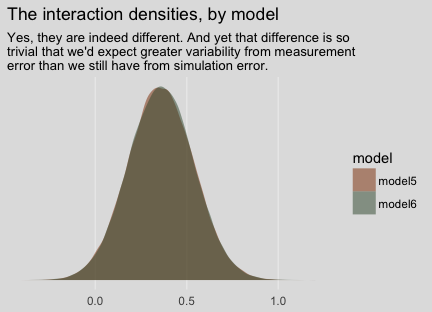
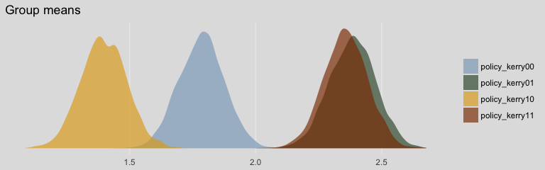

Chapter 08
================
A Solomon Kurz
2018-07-01

8.1 Moderation with a dichotomous moderator
-------------------------------------------

Here we load a couple necessary packages, load the data, and take a `glimpse()`.

``` r
library(readr)
library(tidyverse)

disaster <- read_csv("data/disaster/disaster.csv")

glimpse(disaster)
```

    ## Observations: 211
    ## Variables: 5
    ## $ id      <int> 1, 2, 3, 4, 5, 6, 7, 8, 9, 10, 11, 12, 13, 14, 15, 16, 17, 18, 19, 20, 21, 22, ...
    ## $ frame   <int> 1, 1, 1, 1, 1, 0, 0, 1, 0, 0, 1, 1, 0, 0, 1, 1, 1, 1, 0, 0, 1, 0, 1, 0, 1, 1, 0...
    ## $ donate  <dbl> 5.6, 4.2, 4.2, 4.6, 3.0, 5.0, 4.8, 6.0, 4.2, 4.4, 5.8, 6.2, 6.0, 4.2, 4.4, 5.8,...
    ## $ justify <dbl> 2.95, 2.85, 3.00, 3.30, 5.00, 3.20, 2.90, 1.40, 3.25, 3.55, 1.55, 1.60, 1.65, 2...
    ## $ skeptic <dbl> 1.8, 5.2, 3.2, 1.0, 7.6, 4.2, 4.2, 1.2, 1.8, 8.8, 1.0, 5.4, 2.2, 3.6, 7.8, 1.6,...

Our first moderation model is:

``` r
library(brms)

model1 <-
  brm(data = disaster, family = gaussian,
      justify ~ 1 + skeptic + frame + frame:skeptic,
      chains = 4, cores = 4)
```

``` r
print(model1)
```

    ##  Family: gaussian 
    ##   Links: mu = identity; sigma = identity 
    ## Formula: justify ~ 1 + skeptic + frame + frame:skeptic 
    ##    Data: disaster (Number of observations: 211) 
    ## Samples: 4 chains, each with iter = 2000; warmup = 1000; thin = 1;
    ##          total post-warmup samples = 4000
    ## 
    ## Population-Level Effects: 
    ##               Estimate Est.Error l-95% CI u-95% CI Eff.Sample Rhat
    ## Intercept         2.45      0.15     2.16     2.74       2449 1.00
    ## skeptic           0.10      0.04     0.03     0.18       2405 1.00
    ## frame            -0.56      0.21    -0.98    -0.15       2102 1.00
    ## skeptic:frame     0.20      0.05     0.09     0.30       2068 1.00
    ## 
    ## Family Specific Parameters: 
    ##       Estimate Est.Error l-95% CI u-95% CI Eff.Sample Rhat
    ## sigma     0.82      0.04     0.74     0.91       3284 1.00
    ## 
    ## Samples were drawn using sampling(NUTS). For each parameter, Eff.Sample 
    ## is a crude measure of effective sample size, and Rhat is the potential 
    ## scale reduction factor on split chains (at convergence, Rhat = 1).

We'll compute our Bayeisan *R*<sup>2</sup> in the typical way.

``` r
bayes_R2(model1) %>% round(digits = 3)
```

    ##    Estimate Est.Error  Q2.5 Q97.5
    ## R2    0.249     0.044 0.161 0.331

### Visualizing and probing the interaction.

For the plots in this chapter, we'll take our color palette from the [ochRe package](https://github.com/ropenscilabs/ochRe), which provides Australia-inspired colors. We'll also use a few theme settings from good-old [ggthemes](https://cran.r-project.org/web/packages/ggthemes/vignettes/ggthemes.html). As in the last chapter, we'll save our adjusted theme settings as an object, `theme_08`.

``` r
library(ggthemes)
library(ochRe)

theme_08 <-
  theme_minimal() +
  theme(panel.grid.minor = element_blank(),
        plot.background = element_rect(fill = ochre_palettes[["olsen_seq"]][8],
                                       color = "transparent"))
```

Happily, the ochRe package has a handy convenience function, `viz_palette()`, that makes it easy to preview the colors available in a given palette. We'll be using "olsen\_qual" and "olsen\_seq".

``` r
viz_palette(ochre_palettes[["olsen_qual"]])
```


``` r
viz_palette(ochre_palettes[["olsen_seq"]])
```


Here's our Figure 8.3.

``` r
# these will come in handy with `geom_text()`, below
green_slope <- (fixef(model1)["skeptic", 1] + fixef(model1)[4, 1]) %>% round(digits = 3)
blue_slope  <- fixef(model1)["skeptic", 1] %>% round(digits = 3)

(
  nd <-
  tibble(frame = rep(0:1, times = 2),
         skeptic = rep(c(0, 7), each = 2))
  )
```

    ## # A tibble: 4 x 2
    ##   frame skeptic
    ##   <int>   <dbl>
    ## 1     0       0
    ## 2     1       0
    ## 3     0       7
    ## 4     1       7

``` r
fitted(model1, newdata = nd, 
       summary = F) %>% 
  as_tibble() %>% 
  gather() %>% 
  mutate(iter = rep(1:4000, times = 4),
         frame = rep(rep(0:1, each = 4000),
                     times = 2),
         skeptic = rep(c(0, 7), each = 4000*2)) %>% 
  
  ggplot(aes(x = skeptic, y = value, 
             group = interaction(frame, iter),
             color = frame %>% as.character())) +
  geom_line(aes(color = frame %>% as.character()),
            size = 1/6, alpha = 1/25) +
  geom_text(data = tibble(skeptic = c(4, 4.6),
                          value   = c(3.5, 2.6),
                          frame   = 1:0,
                          iter    = 0,
                          label   = c(paste("the slope when frame = 1 is about", green_slope),
                                      paste("the slope when frame = 0 is about", blue_slope)),
                          angle   = c(28, 6)),
            aes(label = label, angle = angle)) +
  scale_color_manual(NULL, values = ochre_palettes[["olsen_qual"]][(5:6)]) +
  scale_x_continuous(breaks = 1:6) +
  coord_cartesian(xlim = 1:6,
                  ylim = 2:4) +
  labs(title = "The moderation effect in a spaghetti plot",
       subtitle = "Using brms defaults, we have 4000 posterior draws. Much like we have 4000\ndraws for each model parameter, when we combine those draws across\nparameters, we end up with 4000 model equations. The consequence is we can\nalso express the line plot as 4000 semitransparent lines, one for each level of\nour moderator, frame.",
       x = expression(paste("Climate Change Skepticism (", italic("X"), ")")),
       y = "Strength of Justification for Withholding Aid") +
  theme_08 +
  theme(legend.position = "none")
```


In addition to our fancy Australia-inspired colors, we'll also play around a bit with spaghetti plots in this chapter. To my knowledge, this use of spaghetti plots is uniquely Bayesian. If you're trying to wrap your head around what on earth we just did, take a look at the first few rows from `posterior_samples()` object, `post`.

``` r
post <- posterior_samples(model1)

head(post)
```

    ##   b_Intercept  b_skeptic    b_frame b_skeptic:frame     sigma      lp__
    ## 1    2.378435 0.09829383 -0.4858424       0.2490275 0.8057153 -262.7562
    ## 2    2.482302 0.11117890 -0.4577867       0.1275876 0.8409089 -262.3542
    ## 3    2.467849 0.11865836 -0.5592876       0.1443568 0.8245727 -262.0716
    ## 4    2.554654 0.10159182 -0.5453138       0.1579281 0.7748326 -261.8279
    ## 5    2.410596 0.07313614 -0.5822472       0.2818075 0.8460630 -263.7375
    ## 6    2.625331 0.08257169 -0.8432761       0.1979940 0.7717212 -264.7918

We've got six rows, each one corresponding to the credible parameter values from a given posterior draw. The `lp__` is uniquely Bayesian and beyond the scope of this project. You might think of `sigma` as the Bayesian analogue to what the OLS folks often refer to as error or the residual variance. Hayes doesn't tend to emphasize it in this text, but it's something you'll want to pay increasing attention to as you move along in your Bayesian career. All the columns starting with `b_` are the regression parameters, the model coefficients or the fixed effects. But anyways, notice that those `b_` columns correspond to the four parameter values in formula 8.2 on page 270. Here they are, but reformatted to more closely mimic the text:

1.  *Y*-hat = 2.378 + 0.098*X* + -0.486*W* + 0.249*XW*
2.  *Y*-hat = 2.482 + 0.111*X* + -0.458*W* + 0.128*XW*
3.  *Y*-hat = 2.468 + 0.119*X* + -0.559*W* + 0.144*XW*
4.  *Y*-hat = 2.555 + 0.102*X* + -0.545*W* + 0.158*XW*
5.  *Y*-hat = 2.411 + 0.073*X* + -0.582*W* + 0.282*XW*
6.  *Y*-hat = 2.625 + 0.083*X* + -0.843*W* + 0.198*XW*

Each row of `post`, each iteration or posterior draw, yields a full model equation that is a credible description of the data—or at least as credible as we can get within the limits of the model we have specified, our priors (which we typically cop out on and just use defaults in this project), and how well those fit when applied to the data at hand. So when we use brms convenience functions like `fitted()`, we pass specific predictor values through those 4000 unique model equations, which produces 4000 similar but distinct expected *Y*-values. So although a nice way to summarize those 4000 values is with summaries such as the posterior mean/median and 95% intervals, another way is to just plot an individual regression line for each of the iterations. That is what’s going on when we depict out models with a spaghetti plot.

The thing I like about spaghetti plots is that they give a three-dimensional sense of the posterior. Note that each individual line is very skinny and semitransparent. When you pile a whole bunch of them atop each other, the peaked or most credible regions of the posterior are the most saturated in color. Less credible posterior regions almost seamlessly merge into the background. Also, note how the combination of many similar but distinct straight lines results in a bowtie shape. Hopefully this clarifies where that shape’s been coming from when we use `geom_ribbon()` to plot the 95% intervals.

But anyways, you could recode `frame` in a number of ways, including `ifelse()` or, in this case, by simple arithmetic. With `frame_ep` in hand, we’re ready to refit the model.

``` r
disaster <-
  disaster %>% 
  mutate(frame_ep = 1 - frame)

model2 <-
  update(model1, newdata = disaster,
         formula = justify ~ 1 + skeptic + frame_ep + frame_ep:skeptic,
         chains = 4, cores = 4)
```

``` r
print(model2)
```

    ##  Family: gaussian 
    ##   Links: mu = identity; sigma = identity 
    ## Formula: justify ~ skeptic + frame_ep + skeptic:frame_ep 
    ##    Data: disaster (Number of observations: 211) 
    ## Samples: 4 chains, each with iter = 2000; warmup = 1000; thin = 1;
    ##          total post-warmup samples = 4000
    ## 
    ## Population-Level Effects: 
    ##                  Estimate Est.Error l-95% CI u-95% CI Eff.Sample Rhat
    ## Intercept            1.88      0.16     1.58     2.18       1891 1.00
    ## skeptic              0.31      0.04     0.23     0.38       1932 1.00
    ## frame_ep             0.57      0.22     0.14     0.99       1610 1.00
    ## skeptic:frame_ep    -0.20      0.06    -0.31    -0.10       1630 1.00
    ## 
    ## Family Specific Parameters: 
    ##       Estimate Est.Error l-95% CI u-95% CI Eff.Sample Rhat
    ## sigma     0.82      0.04     0.74     0.90       2647 1.00
    ## 
    ## Samples were drawn using sampling(NUTS). For each parameter, Eff.Sample 
    ## is a crude measure of effective sample size, and Rhat is the potential 
    ## scale reduction factor on split chains (at convergence, Rhat = 1).

Our results match nicely with the formula on page 275.

If you want to follow along with Hayes on pate 276 and isolate the 95% credible intervals for the `skeptic` parameter, you can use `posterior_interval()`.

``` r
posterior_interval(model2)["b_skeptic", ] %>% round(digits = 3)
```

    ##  2.5% 97.5% 
    ## 0.230 0.385

8.2 Interaction between two quantitative variables
--------------------------------------------------

Here's the `glbwarm` data.

``` r
glbwarm <- read_csv("data/glbwarm/glbwarm.csv")

glimpse(glbwarm)
```

    ## Observations: 815
    ## Variables: 7
    ## $ govact   <dbl> 3.6, 5.0, 6.6, 1.0, 4.0, 7.0, 6.8, 5.6, 6.0, 2.6, 1.4, 5.6, 7.0, 3.8, 3.4, 4.2...
    ## $ posemot  <dbl> 3.67, 2.00, 2.33, 5.00, 2.33, 1.00, 2.33, 4.00, 5.00, 5.00, 1.00, 4.00, 1.00, ...
    ## $ negemot  <dbl> 4.67, 2.33, 3.67, 5.00, 1.67, 6.00, 4.00, 5.33, 6.00, 2.00, 1.00, 4.00, 5.00, ...
    ## $ ideology <int> 6, 2, 1, 1, 4, 3, 4, 5, 4, 7, 6, 4, 2, 4, 5, 2, 6, 4, 2, 4, 4, 2, 6, 4, 4, 3, ...
    ## $ age      <int> 61, 55, 85, 59, 22, 34, 47, 65, 50, 60, 71, 60, 71, 59, 32, 36, 69, 70, 41, 48...
    ## $ sex      <int> 0, 0, 1, 0, 1, 0, 1, 1, 1, 1, 1, 0, 1, 0, 1, 1, 1, 0, 0, 0, 0, 1, 1, 1, 1, 1, ...
    ## $ partyid  <int> 2, 1, 1, 1, 1, 2, 1, 1, 2, 3, 2, 1, 1, 1, 1, 1, 2, 3, 1, 3, 2, 1, 3, 2, 1, 1, ...

Although Hayes made a distinction between the *X*, *M*, and *C* variables in the text, that distinction is conceptual and doesn't impact the way we enter them into `brm()`. Rather, the `brm()` formula clarifies they're all just predictors.

``` r
model3 <- 
  brm(data = glbwarm, family = gaussian,
      govact ~ 1 + negemot + age + negemot:age + posemot + ideology + sex,
      chains = 4, cores = 4)
```

Our results cohere nicely with the Hayes's formula in the middle of page 278 or in Table 8.2.

``` r
print(model3, digits = 3)
```

    ##  Family: gaussian 
    ##   Links: mu = identity; sigma = identity 
    ## Formula: govact ~ 1 + negemot + age + negemot:age + posemot + ideology + sex 
    ##    Data: glbwarm (Number of observations: 815) 
    ## Samples: 4 chains, each with iter = 2000; warmup = 1000; thin = 1;
    ##          total post-warmup samples = 4000
    ## 
    ## Population-Level Effects: 
    ##             Estimate Est.Error l-95% CI u-95% CI Eff.Sample  Rhat
    ## Intercept      5.171     0.350    4.482    5.847       2477 1.001
    ## negemot        0.120     0.084   -0.047    0.280       2243 1.001
    ## age           -0.024     0.006   -0.036   -0.012       2304 1.001
    ## posemot       -0.021     0.028   -0.074    0.033       4000 1.000
    ## ideology      -0.211     0.027   -0.265   -0.158       3677 1.000
    ## sex           -0.010     0.078   -0.163    0.142       3668 1.000
    ## negemot:age    0.006     0.002    0.003    0.009       2302 1.001
    ## 
    ## Family Specific Parameters: 
    ##       Estimate Est.Error l-95% CI u-95% CI Eff.Sample  Rhat
    ## sigma    1.058     0.027    1.008    1.112       4000 1.000
    ## 
    ## Samples were drawn using sampling(NUTS). For each parameter, Eff.Sample 
    ## is a crude measure of effective sample size, and Rhat is the potential 
    ## scale reduction factor on split chains (at convergence, Rhat = 1).

Here's the *R*<sup>2</sup>.

``` r
bayes_R2(model3) %>% round(digits = 3)
```

    ##    Estimate Est.Error  Q2.5 Q97.5
    ## R2    0.401     0.021 0.358 0.441

As the *R*<sup>2</sup> is a good bit away from the boundaries, it's nicely Gaussian.

``` r
bayes_R2(model3, summary = F) %>% 
  as_tibble() %>% 

  ggplot(aes(x = R2)) +
  geom_density(size = 0, fill = ochre_palettes[["olsen_qual"]][(1)]) +
  scale_y_continuous(NULL, breaks = NULL) +
  coord_cartesian(xlim = 0:1) +
  labs(title = expression(paste("Loot at how Gaussian our ", italic(R)^2, " is!")),
       subtitle = expression(paste("No need to put a ", italic(p), "-value on that sucker.")),
       x = NULL) +
  theme_08
```


For our version of Figure 8.4, we'll need to adjust our `nd` data for `fitted()`.

``` r
(
  nd <-
  tibble(negemot = rep(c(1, 6), each = 3),
         age = rep(c(30, 50, 70), times = 2),
         posemot = mean(glbwarm$posemot),
         ideology = mean(glbwarm$ideology),
         sex = mean(glbwarm$sex))
  )
```

    ## # A tibble: 6 x 5
    ##   negemot   age posemot ideology   sex
    ##     <dbl> <dbl>   <dbl>    <dbl> <dbl>
    ## 1       1    30    3.13     4.08 0.488
    ## 2       1    50    3.13     4.08 0.488
    ## 3       1    70    3.13     4.08 0.488
    ## 4       6    30    3.13     4.08 0.488
    ## 5       6    50    3.13     4.08 0.488
    ## 6       6    70    3.13     4.08 0.488

Our `fitted()` and ggplot2 code will be quite similar to the last spaghetti plot. Only this time we'll use `filter()` to reduce the number of posterior draws we show in the plot.

``` r
# these will come in handy with `geom_text()`, below
slope_30 <- (fixef(model3)["negemot", 1] + fixef(model3)["negemot:age", 1]*30) %>% round(digits = 3)
slope_50 <- (fixef(model3)["negemot", 1] + fixef(model3)["negemot:age", 1]*50) %>% round(digits = 3)
slope_70 <- (fixef(model3)["negemot", 1] + fixef(model3)["negemot:age", 1]*70) %>% round(digits = 3)

fitted(model3, newdata = nd, 
       summary = F) %>% 
  as_tibble() %>% 
  gather() %>% 
  mutate(iter = rep(1:4000, times = 6),
         negemot = rep(rep(c(1, 6), each = 3),
                       each = 4000),
         age = rep(rep(c(30, 50, 70), times = 2),
                   each = 4000)) %>% 
  # here we'll reduce our spaghetti plot lines to 100 per age category
  filter(iter <= 100) %>% 
  
  ggplot(aes(x = negemot, y = value, 
             group = interaction(age, iter),
             color = age %>% as.character())) +
  geom_line(aes(color = age %>% as.character()),
            size = 3/4, alpha = 1/8) +
  geom_text(data = tibble(negemot = 6.1,
                          value   = c(5.4, 5.7, 6),
                          age     = c(30, 50, 70),
                          iter    = 0,
                          label   = c(paste("the slope for 30 year olds is about", slope_30),
                                      paste("the slope for 50 year olds is about", slope_50),
                                      paste("the slope for 70 year olds is about", slope_70))),
            aes(label = label),
            hjust = 0) +
  scale_color_manual(NULL, values = ochre_palettes[["olsen_qual"]][c(4, 1, 3)]) +
  scale_x_continuous(breaks = 1:6) +
  coord_cartesian(xlim = 1:9,
                  ylim = c(2.9, 6.1)) +
  labs(title = "The moderation effect of age on negemot",
       x = expression(paste("Negative Emotions about Climate Change (", italic("X"), ")")),
       y = "Support for Government Action") +
  theme_08 +
  theme(legend.position = "none")
```


When we reduce the number of lines depicted in the plot, we lose some of the three-dimensional illusion. It’s nice, however, to get a closer look to each individual line. To each their own.

We'll continue with our spaghetti plot approach for Figure 8.7. Again, when we did the JN technique plot for Chapter 7, we computed values for the posterior mean and the 95% intervals. Because the intervals follow a bowtie shape, we had to compute the *Y*-values for many values across the x-axis in order to make the curve look smooth. But as long as we stick with the spaghetti plot approach, all we need are the values at the endpoints of each iteration. Although each line is straight, the combination of many lines is what produces the bowtie effect.

``` r
# here is our primary data object
post <-
  posterior_samples(model3) %>% 
  transmute(at_15 = b_negemot + `b_negemot:age`*15,
            at_90 = b_negemot + `b_negemot:age`*90,
            iter = 1:n()) %>% 
  gather(key, value, -iter) %>% 
  rename(age = key) %>% 
  mutate(age = str_remove(age, "at_") %>% as.double())

# Here we compute the points for the posterior mean
post_means <-
  post %>% 
  group_by(age) %>% 
  summarize(value = mean(value)) %>% 
  mutate(iter = 0)

# the plot
post %>% 
  filter(iter < 501) %>% 

  ggplot(aes(x = age, y = value, group = iter)) +
  geom_line(color = ochre_palettes[["olsen_qual"]][1],
            alpha = 1/12) +
  geom_line(data = post_means,
            color = ochre_palettes[["olsen_qual"]][3],
            size = 1.1) +
  scale_y_continuous(breaks = seq(from = -.25, to = 1, by = .25)) +
  coord_cartesian(xlim = c(20, 85),
                  ylim = c(-.25, 1)) +
  labs(subtitle = "Each orange line is the consequence of one of 1000 posterior draws. All are credible\nregression lines for the data, but because they are semitransparent, the most\ncredible regions are the ones with the darkest color. The line corresponding to the\nposterior mean is in red-orange.",
       x = expression(paste("Age (", italic("W"), ")")),
       y = "Conditional Effects of Negative Emotions on\nSupport for Government Action") +
  theme_08
```



8.3 Hierarchical versus simultaneous entry
------------------------------------------

Here's our multivariable but non-moderation model, `model4`.

``` r
model4 <-
  update(model1, 
         formula = justify ~ 1 + skeptic + frame,
         chains = 4, cores = 4)
```

Here we'll compute the corresponding *R*<sup>2</sup> and compare it with the one for the original interaction model with a difference score.

``` r
# the moderation model's R2
R2s <-
  bayes_R2(model1, summary = F) %>% 
  as_tibble() %>% 
  rename(moderation_model = R2) %>% 
  # here we add the multivaraible model's R2
  bind_cols(
    bayes_R2(model4, summary = F) %>% 
      as_tibble() %>% 
      rename(multivariable_model = R2)
  ) %>% 
  # we'll need a difference score
  mutate(difference = moderation_model - multivariable_model) %>% 
  # putting the data in the long format and grouping will make summarizing easier
  gather(R2, value)

R2s %>% 
  group_by(R2) %>% 
  summarize(median = median(value),
            ll = quantile(value, probs = .025),
            ul = quantile(value, probs = .975)) %>% 
  mutate_if(is.double, round, digits = 3)
```

    ## # A tibble: 3 x 4
    ##   R2                  median     ll    ul
    ##   <chr>                <dbl>  <dbl> <dbl>
    ## 1 difference           0.048 -0.073 0.169
    ## 2 moderation_model     0.251  0.161 0.331
    ## 3 multivariable_model  0.201  0.113 0.286

Note that the Bayesian *R*<sup>2</sup> performed differently than the *F*-test in the text.

``` r
R2s %>% 
  filter(R2 == "difference") %>% 

  ggplot(aes(x = value)) +
  geom_density(aes(fill = model), size = 0, fill = ochre_palettes[["olsen_seq"]][14]) +
  scale_y_continuous(NULL, breaks = NULL) +
  labs(title = expression(paste("The Bayesian ", Delta, italic(R)^2, " distribution")),
       subtitle = "Although most of the posterior mass is positive--suggesting the moderation model accounted for more variance than the simple\nmultivariable model--, a substantial portion of the postrior is within the negative parameter space. Sure, if we had to bet, the safer\nbet is on the moderation model. But that bet wouled be quite uncertain and we might well loose our shirts. Also, note the width of\nthe distribution; credible values range from -0.1 to nearly 0.2.",
       x = NULL) +
  coord_cartesian(xlim = c(-.4, .4)) +
  theme_08
```


We can also compare these with the LOO, which, as is typical of information criteria, corrects for model coplexity.

``` r
(l_model1 <- loo(model1))
```

    ## 
    ## Computed from 4000 by 211 log-likelihood matrix
    ## 
    ##          Estimate   SE
    ## elpd_loo   -259.0 10.8
    ## p_loo         5.4  0.9
    ## looic       518.0 21.7
    ## ------
    ## Monte Carlo SE of elpd_loo is 0.0.
    ## 
    ## All Pareto k estimates are good (k < 0.5).
    ## See help('pareto-k-diagnostic') for details.

``` r
(l_model4 <- loo(model4))
```

    ## 
    ## Computed from 4000 by 211 log-likelihood matrix
    ## 
    ##          Estimate   SE
    ## elpd_loo   -264.7 11.2
    ## p_loo         4.7  0.9
    ## looic       529.5 22.4
    ## ------
    ## Monte Carlo SE of elpd_loo is 0.0.
    ## 
    ## All Pareto k estimates are good (k < 0.5).
    ## See help('pareto-k-diagnostic') for details.

The LOO values aren't of interest in and of themselves. However, the bottom of the `loo()` output was useful because for both models we learned that "All Pareto k estimates are good (k &lt; 0.5).", which assures us that we didn't have a problem with overly-influential outlier values. But even though the LOO values weren't interesting themselves, their difference score is. We'll use `compare_ic()` to get that.

``` r
compare_ic(l_model1, l_model4)
```

    ##                  LOOIC    SE
    ## model1          518.04 21.67
    ## model4          529.48 22.39
    ## model1 - model4 -11.44  8.27

As a reminder, we generally prefer models with lower information criteria, which in this case is clearly the moderation model (i.e., `model1`). However, the standard error value for the difference is quite large, which suggests that the model with the lowest value isn't the clear winner. Happily, these results match nicely with the Bayesian *R*<sup>2</sup> difference score. The moderation model appears somewhat better than the multivariable model, but its superiority is hardly decisive.

8.4 The equivalence between moderated regression analysis and a 2 X 2 factorial analysis of variance
----------------------------------------------------------------------------------------------------

I'm just not going to encourage ANOVA *F*-testing methodology. However, I will show the Bayesian regression model. First, here are the data.

``` r
caskets <- read_csv("data/caskets/caskets.csv")

glimpse(caskets)
```

    ## Observations: 541
    ## Variables: 7
    ## $ policy   <int> 1, 0, 1, 1, 1, 0, 1, 1, 0, 1, 1, 1, 0, 1, 0, 1, 0, 0, 1, 1, 0, 1, 0, 1, 0, 1, ...
    ## $ interest <dbl> 4.0, 2.0, 3.0, 1.0, 1.0, 2.0, 1.0, 2.5, 3.0, 1.0, 2.0, 3.5, 1.0, 1.0, 1.5, 3.0...
    ## $ age      <int> 39, 57, 63, 56, 50, 87, 33, 64, 82, 28, 18, 52, 42, 39, 64, 72, 54, 84, 55, 27...
    ## $ educ     <int> 3, 3, 2, 5, 3, 2, 7, 2, 3, 3, 1, 1, 5, 4, 3, 2, 3, 4, 7, 2, 3, 5, 4, 5, 5, 3, ...
    ## $ male     <int> 1, 1, 0, 1, 0, 1, 0, 1, 0, 0, 1, 0, 0, 1, 0, 0, 0, 0, 1, 1, 1, 0, 1, 1, 1, 1, ...
    ## $ conserv  <int> 4, 3, 6, 3, 3, 5, 6, 3, 6, 7, 4, 2, 7, 6, 5, 6, 6, 3, 7, 6, 5, 5, 3, 4, 6, 2, ...
    ## $ kerry    <int> 1, 1, 1, 1, 1, 0, 0, 1, 0, 0, 0, 1, 1, 0, 1, 1, 1, 1, 0, 0, 0, 0, 1, 0, 0, 0, ...

The model:

``` r
model5 <-
  brm(data = caskets, family = gaussian,
      interest ~ 1 + policy + kerry + policy:kerry,
      chains = 4, cores = 4)
```

``` r
print(model5)
```

    ##  Family: gaussian 
    ##   Links: mu = identity; sigma = identity 
    ## Formula: interest ~ 1 + policy + kerry + policy:kerry 
    ##    Data: caskets (Number of observations: 541) 
    ## Samples: 4 chains, each with iter = 2000; warmup = 1000; thin = 1;
    ##          total post-warmup samples = 4000
    ## 
    ## Population-Level Effects: 
    ##              Estimate Est.Error l-95% CI u-95% CI Eff.Sample Rhat
    ## Intercept        1.79      0.09     1.61     1.96       2155 1.00
    ## policy          -0.39      0.12    -0.63    -0.15       2000 1.00
    ## kerry            0.60      0.13     0.35     0.85       2096 1.00
    ## policy:kerry     0.36      0.18     0.01     0.71       1756 1.00
    ## 
    ## Family Specific Parameters: 
    ##       Estimate Est.Error l-95% CI u-95% CI Eff.Sample Rhat
    ## sigma     1.04      0.03     0.98     1.10       4000 1.00
    ## 
    ## Samples were drawn using sampling(NUTS). For each parameter, Eff.Sample 
    ## is a crude measure of effective sample size, and Rhat is the potential 
    ## scale reduction factor on split chains (at convergence, Rhat = 1).

Those results don't look anything like what Hayes reported in Tables 8.3 or 8.4. However, a little deft manipulation of the posterior samples can yield equivalent results to Hayes's Table 8.3.

``` r
post <- 
  posterior_samples(model5) %>% 
  mutate(Y_bar_1 = b_Intercept + b_policy*0 + b_kerry*0 + `b_policy:kerry`*0*0,
         Y_bar_3 = b_Intercept + b_policy*0 + b_kerry*1 + `b_policy:kerry`*0*1,
         Y_bar_2 = b_Intercept + b_policy*1 + b_kerry*0 + `b_policy:kerry`*1*0,
         Y_bar_4 = b_Intercept + b_policy*1 + b_kerry*1 + `b_policy:kerry`*1*1,
         
         Y_bar_12 = b_Intercept + b_policy*.5 + b_kerry*0 + `b_policy:kerry`*.5*0,
         Y_bar_34 = b_Intercept + b_policy*.5 + b_kerry*1 + `b_policy:kerry`*.5*1,
         Y_bar_13 = b_Intercept + b_policy*0 + b_kerry*.5 + `b_policy:kerry`*0*.5,
         Y_bar_24 = b_Intercept + b_policy*1 + b_kerry*.5 + `b_policy:kerry`*1*.5)
```

Here are the cell-specific means in Table 8.3.

``` r
post %>% 
  select(Y_bar_1:Y_bar_4) %>% 
  gather() %>% 
  group_by(key) %>% 
  summarize(median = median(value),
            ll = quantile(value, probs = .025),
            ul = quantile(value, probs = .975)) %>% 
  mutate_if(is.double, round, digits = 3)
```

    ## # A tibble: 4 x 4
    ##   key     median    ll    ul
    ##   <chr>    <dbl> <dbl> <dbl>
    ## 1 Y_bar_1   1.79  1.61  1.96
    ## 2 Y_bar_2   1.40  1.22  1.57
    ## 3 Y_bar_3   2.38  2.20  2.56
    ## 4 Y_bar_4   2.36  2.19  2.53

And here are the marginal means from Table 8.3.

``` r
post %>% 
  select(Y_bar_12:Y_bar_24) %>% 
  gather() %>% 
  group_by(key) %>% 
  summarize(median = median(value),
            ll = quantile(value, probs = .025),
            ul = quantile(value, probs = .975)) %>% 
  mutate_if(is.double, round, digits = 3)
```

    ## # A tibble: 4 x 4
    ##   key      median    ll    ul
    ##   <chr>     <dbl> <dbl> <dbl>
    ## 1 Y_bar_12   1.59  1.46  1.71
    ## 2 Y_bar_13   2.08  1.96  2.21
    ## 3 Y_bar_24   1.88  1.75  2   
    ## 4 Y_bar_34   2.37  2.25  2.49

For kicks and giggles, here are what the cell-specific means look like in box plots.

``` r
post %>% 
  select(Y_bar_1:Y_bar_4) %>% 
  gather() %>% 
  
  ggplot(aes(x = key, y = value, fill = key)) +
  geom_boxplot(size = 1/3) +
  scale_fill_manual(values = ochre_palettes[["olsen_qual"]][c(5, 6, 4, 3)]) +
  labs(title = "Cell-specific effects",
       x = NULL, 
       y = "interest") +
  theme_08 +
  theme(legend.position = "none")
```



And here are the same for the marginal means. This time we'll show the shapes of the posteriors with violin plots with horizontal lines depicting the median and interquartile ranges.

``` r
post %>% 
  select(Y_bar_12:Y_bar_24) %>% 
  gather() %>% 
  
  ggplot(aes(x = key, y = value, fill = key)) +
  geom_violin(draw_quantiles = c(.25, .5, .75),
              color = ochre_palettes[["olsen_seq"]][8]) +
  scale_fill_manual(values = ochre_palettes[["olsen_qual"]][c(5, 6, 4, 3)]) +
  labs(title = "Marginal means",
       x = NULL, 
       y = "interest") +
  theme_08 +
  theme(legend.position = "none")
```



On page 294, Hayes used point estimates to compute the *simple effect* of policy information among Kerry supporters and then the same thing among Bush supporters. Here's how we'd do that when working with the full vector of posterior iterations:

``` r
post %>% 
  transmute(simple_effect_Kerry = Y_bar_4 - Y_bar_3,
            simple_effect_Bush = Y_bar_2 - Y_bar_1) %>% 
  gather() %>% 
  group_by(key) %>% 
  summarize(median = median(value),
            ll = quantile(value, probs = .025),
            ul = quantile(value, probs = .975)) %>% 
  mutate_if(is.double, round, digits = 3)
```

    ## # A tibble: 2 x 4
    ##   key                 median     ll     ul
    ##   <chr>                <dbl>  <dbl>  <dbl>
    ## 1 simple_effect_Bush  -0.388 -0.635 -0.146
    ## 2 simple_effect_Kerry -0.025 -0.277  0.219

So then computing the main effect for policy information using the simple effects is little more than an extension of those steps.

``` r
post %>% 
  transmute(main_effect = ((Y_bar_4 - Y_bar_3) + (Y_bar_2 - Y_bar_1))/2) %>% 
  summarize(median = median(main_effect),
            ll = quantile(main_effect, probs = .025),
            ul = quantile(main_effect, probs = .975)) %>% 
  mutate_if(is.double, round, digits = 3)
```

    ##   median     ll     ul
    ## 1 -0.208 -0.379 -0.036

And we get the same results by strategically subtracting the marginal means.

``` r
post %>% 
  transmute(main_effect = Y_bar_24 - Y_bar_13) %>% 
  summarize(median = median(main_effect),
            ll = quantile(main_effect, probs = .025),
            ul = quantile(main_effect, probs = .975)) %>% 
  mutate_if(is.double, round, digits = 3)
```

    ##   median     ll     ul
    ## 1 -0.208 -0.379 -0.036

So then the main effect of for candidate is similarly computed using either approach:

``` r
post %>% 
  transmute(main_effect = ((Y_bar_4 - Y_bar_2) + (Y_bar_3 - Y_bar_1))/2) %>% 
  summarize(median = median(main_effect),
            ll = quantile(main_effect, probs = .025),
            ul = quantile(main_effect, probs = .975)) %>% 
  mutate_if(is.double, round, digits = 3)
```

    ##   median    ll    ul
    ## 1   0.78 0.607 0.955

``` r
post %>% 
  transmute(main_effect = Y_bar_34 - Y_bar_12) %>% 
  summarize(median = median(main_effect),
            ll = quantile(main_effect, probs = .025),
            ul = quantile(main_effect, probs = .975)) %>% 
  mutate_if(is.double, round, digits = 3)
```

    ##   median    ll    ul
    ## 1   0.78 0.607 0.955

We don't have an *F*-test for our Bayesian moderation model. But we do have an interaction term. Here's its distribution:

``` r
post %>% 
  ggplot(aes(x = `b_policy:kerry`)) +
  geom_density(size = 0,
               fill = ochre_palettes[["olsen_qual"]][2]) +
  geom_vline(xintercept = fixef(model5)["policy:kerry", c(1, 3, 4)],
             color = ochre_palettes[["olsen_seq"]][8], linetype = c(1, 2, 2)) +
  scale_x_continuous(breaks = fixef(model5)["policy:kerry", c(1, 3, 4)],
                     labels = fixef(model5)["policy:kerry", c(1, 3, 4)] %>% round(digits = 2)) +
  scale_y_continuous(NULL, breaks = NULL) +
  labs(title = "The interaction term, `policy:kerry`",
       subtitle = "The solid vertical line is the posterior mean and the\ndashed lines to either end denote the percentile-\nbased 95% intervals.",
       x = NULL) +
  theme_08 +
  theme(legend.position = "none")
```



Following Hayes's work on the bottom of page 295, here's how you'd reproduce that by manipulating our *Y*-bar vectors.

``` r
post %>% 
  transmute(reproduced_interaction_term = (Y_bar_4 - Y_bar_3) - (Y_bar_2 - Y_bar_1)) %>% 
  summarize(median = median(reproduced_interaction_term),
            ll = quantile(reproduced_interaction_term, probs = .025),
            ul = quantile(reproduced_interaction_term, probs = .975)) %>% 
  mutate_if(is.double, round, digits = 2)
```

    ##   median   ll   ul
    ## 1   0.37 0.01 0.71

Extending that logic, we also get:

``` r
post %>% 
  transmute(reproduced_interaction_term = (Y_bar_4 - Y_bar_2) - (Y_bar_3 - Y_bar_1)) %>% 
  summarize(median = median(reproduced_interaction_term),
            ll = quantile(reproduced_interaction_term, probs = .025),
            ul = quantile(reproduced_interaction_term, probs = .975)) %>% 
  mutate_if(is.double, round, digits = 2)
```

    ##   median   ll   ul
    ## 1   0.37 0.01 0.71

### Simple effects parameterization.

We might reacquaint ourselves with the formula from `model5`.

``` r
model5$formula
```

    ## interest ~ 1 + policy + kerry + policy:kerry

The results cohere nicely with the "Model 1" results at the top of Table 8.5.

``` r
fixef(model5) %>% round(digits = 3)
```

    ##              Estimate Est.Error   Q2.5  Q97.5
    ## Intercept       1.785     0.089  1.608  1.963
    ## policy         -0.390     0.124 -0.635 -0.146
    ## kerry           0.597     0.127  0.347  0.846
    ## policy:kerry    0.363     0.177  0.011  0.711

The Bayesian *R*<sup>2</sup> portion looks on point, too.

``` r
bayes_R2(model5) %>% round(digits = 3)
```

    ##    Estimate Est.Error  Q2.5 Q97.5
    ## R2     0.14     0.025 0.093 0.189

Our various `Y_bar` transformations from before continue to cohere with the coefficients, above, just like in the text. E.g., the `policy` coefficient may be returned like so:

``` r
post %>% 
  transmute(b1 = b_policy,
            `Y_bar_2 - Y_bar_1` = Y_bar_2 - Y_bar_1) %>% 
  gather() %>% 
  group_by(key) %>% 
  summarize(mean = mean(value),
            sd = sd(value)) %>% 
  mutate_if(is.double, round, digits = 3)
```

    ## # A tibble: 2 x 3
    ##   key                mean    sd
    ##   <chr>             <dbl> <dbl>
    ## 1 b1                -0.39 0.124
    ## 2 Y_bar_2 - Y_bar_1 -0.39 0.124

We can continue to use Hayes's `Y_bar` transformations to return the `kerry` coefficient, too.

``` r
post %>% 
  transmute(b2 = b_kerry,
            `Y_bar_3 - Y_bar_1` = Y_bar_3 - Y_bar_1) %>% 
  gather() %>% 
  group_by(key) %>% 
  summarize(mean = mean(value),
            sd = sd(value)) %>% 
  mutate_if(is.double, round, digits = 3)
```

    ## # A tibble: 2 x 3
    ##   key                mean    sd
    ##   <chr>             <dbl> <dbl>
    ## 1 b2                0.597 0.127
    ## 2 Y_bar_3 - Y_bar_1 0.597 0.127

Here we compute *b*<sub>3</sub> with the difference between the simple effects of *X* at levels of *W*.

``` r
post %>% 
  transmute(b3 = `b_policy:kerry`,
            `(Y_bar_4 - Y_bar_3) - (Y_bar_2 - Y_bar_1)` = (Y_bar_4 - Y_bar_3) - (Y_bar_2 - Y_bar_1)) %>% 
  gather() %>% 
  group_by(key) %>% 
  summarize(mean = mean(value),
            sd = sd(value)) %>% 
  mutate_if(is.double, round, digits = 3)
```

    ## # A tibble: 2 x 3
    ##   key                                        mean    sd
    ##   <chr>                                     <dbl> <dbl>
    ## 1 (Y_bar_4 - Y_bar_3) - (Y_bar_2 - Y_bar_1) 0.363 0.177
    ## 2 b3                                        0.363 0.177

And now *b*<sub>3</sub> with the difference between the simple effects of *W* at levels of *X*.

``` r
post %>% 
  transmute(b3 = `b_policy:kerry`,
            `(Y_bar_4 - Y_bar_2) - (Y_bar_3 - Y_bar_1)` = (Y_bar_4 - Y_bar_2) - (Y_bar_3 - Y_bar_1)) %>% 
  gather() %>% 
  group_by(key) %>% 
  summarize(mean = mean(value),
            sd = sd(value)) %>% 
  mutate_if(is.double, round, digits = 3)
```

    ## # A tibble: 2 x 3
    ##   key                                        mean    sd
    ##   <chr>                                     <dbl> <dbl>
    ## 1 (Y_bar_4 - Y_bar_2) - (Y_bar_3 - Y_bar_1) 0.363 0.177
    ## 2 b3                                        0.363 0.177

### Main effects parameterization.

A nice feature of brms is you transform your data right within the `brm()` or `update()` functions. Here we'll make our two new main-effects-coded variables, `policy_me` and `kerry_me`, with the `mutate()` function right within `update()`.

``` r
model6 <-
  update(model5,
         newdata = caskets %>%
           mutate(policy_me = policy - .5,
                  kerry_me = kerry - .5), 
         family = gaussian,
         interest ~ 1 + policy_me + kerry_me + policy_me:kerry_me,
         chains = 4, cores = 4)
```

Here's our analogue to the "Model 2" portion of Table 8.5.

``` r
fixef(model6) %>% round(digits = 3)
```

    ##                    Estimate Est.Error   Q2.5  Q97.5
    ## Intercept             1.980     0.044  1.894  2.067
    ## policy_me            -0.204     0.092 -0.382 -0.020
    ## kerry_me              0.779     0.087  0.605  0.943
    ## policy_me:kerry_me    0.353     0.178  0.002  0.698

``` r
bayes_R2(model6) %>% round(digits = 3)
```

    ##    Estimate Est.Error  Q2.5 Q97.5
    ## R2     0.14     0.025 0.093 0.189

Like with `model6`, above, we'll need a bit of algebra to compute our *Y*-bar<sub>*i*</sub> vectors.

``` r
post <- 
  posterior_samples(model6) %>% 
  mutate(Y_bar_1 = b_Intercept + b_policy_me*-.5 + b_kerry_me*-.5 + `b_policy_me:kerry_me`*-.5*-.5,
         Y_bar_3 = b_Intercept + b_policy_me*-.5 + b_kerry_me*.5 + `b_policy_me:kerry_me`*-.5*.5,
         Y_bar_2 = b_Intercept + b_policy_me*.5 + b_kerry_me*-.5 + `b_policy_me:kerry_me`*.5*-.5,
         Y_bar_4 = b_Intercept + b_policy_me*.5 + b_kerry_me*.5 + `b_policy_me:kerry_me`*.5*.5)
```

With our `post` for `fit5` in hand, we'll follow the formulas at the top of page 298 to compute our *b*<sub>1</sub> and *b*<sub>2</sub> distributions.

``` r
post %>% 
  transmute(b1 = ((Y_bar_4 - Y_bar_3) + (Y_bar_2 - Y_bar_1))/2,
            b2 = ((Y_bar_4 - Y_bar_2) + (Y_bar_3 - Y_bar_1))/2) %>% 
  gather() %>% 
  group_by(key) %>% 
  summarize(mean = mean(value),
            sd = sd(value)) %>% 
  mutate_if(is.double, round, digits = 3)
```

    ## # A tibble: 2 x 3
    ##   key     mean    sd
    ##   <chr>  <dbl> <dbl>
    ## 1 b1    -0.204 0.092
    ## 2 b2     0.779 0.087

Hayes pointed out that the interaction effect, *b*<sub>3</sub>, is the same across models his OLS Models 1 and 2. This is largely true for our Bayesian HMC `fit4` adn `fit5` models:

``` r
fixef(model5)[4, ] %>% round(digits = 3)
```

    ##  Estimate Est.Error      Q2.5     Q97.5 
    ##     0.363     0.177     0.011     0.711

``` r
fixef(model6)[4, ] %>% round(digits = 3)
```

    ##  Estimate Est.Error      Q2.5     Q97.5 
    ##     0.353     0.178     0.002     0.698

However, the results aren’t exactly the same because of simulation error. If you were working on a project requiring high precision, increase the number of posterior iterations. To demonstrate, here we'll increase each chain's post-warmup iteration count by an order of magnitude, resulting in 80,000 post-warmup iterations rather than the defuault 4,000.

``` r
model5 <-
  update(model5,
         chains = 4, cores = 4, warmup = 1000, iter = 21000)

model6 <-
  update(model6,
         chains = 4, cores = 4, warmup = 1000, iter = 21000)
```

Now they're quite a bit closer.

``` r
fixef(model5)[4, ] %>% round(digits = 3)
```

    ##  Estimate Est.Error      Q2.5     Q97.5 
    ##     0.359     0.179     0.008     0.709

``` r
fixef(model6)[4, ] %>% round(digits = 3)
```

    ##  Estimate Est.Error      Q2.5     Q97.5 
    ##     0.360     0.179     0.010     0.709

And before you get fixate on how there are still differences after 80,000 iterations, each, consider comparing the two density plots:

``` r
posterior_samples(model5) %>% 
  as_tibble() %>% 
  select(`b_policy:kerry`) %>% 
  rename(iteraction = `b_policy:kerry`) %>% 
  bind_rows(
    posterior_samples(model6) %>% 
      as_tibble() %>% 
      select(`b_policy_me:kerry_me`) %>% 
      rename(iteraction = `b_policy_me:kerry_me`)
  ) %>% 
  mutate(model = rep(c("model5", "model6"), each = 80000)) %>% 
  
  ggplot(aes(x = iteraction, fill = model)) +
  geom_density(size = 0, alpha = 1/2) +
  scale_fill_manual(values = ochre_palettes[["olsen_qual"]][c(3, 6)]) +
  scale_y_continuous(NULL, breaks = NULL) +
  labs(title = "The interaction densities, by model",
       subtitle = "Yes, they are indeed different. And yet that difference is so\ntrivial that we'd expect greater variability from measurement\nerror than we still have from simulation error.",
       x = NULL) +
  theme_08 
```



### Conducting ~~a 2 X 2 between-participants factorial ANOVA using PROCESS~~ another regression model with brms.

Since we're square in regression land with brms, there's no direct analogue for us, here. However, notice the post-ANOVA *t*-tests Hayes presented on page 300. If we just want to consider the 2 X 2 structure of our two dummy variables as indicative of four groups, we have one more coding system available for the job. With the handy `str_c()` function, we'll concatenate the `policy` and `kerry` values into a nominal variable, `policy_kerry`. Here's what that looks like:

``` r
caskets <-
  caskets %>% 
  mutate(policy_kerry = str_c(policy, kerry))

head(caskets)
```

    ## # A tibble: 6 x 8
    ##   policy interest   age  educ  male conserv kerry policy_kerry
    ##    <int>    <dbl> <int> <int> <int>   <int> <int> <chr>       
    ## 1      1        4    39     3     1       4     1 11          
    ## 2      0        2    57     3     1       3     1 01          
    ## 3      1        3    63     2     0       6     1 11          
    ## 4      1        1    56     5     1       3     1 11          
    ## 5      1        1    50     3     0       3     1 11          
    ## 6      0        2    87     2     1       5     0 00

Now check out what happens if we reformat our formula to `interest ~ 0 + policy_kerry`.

``` r
model7 <-
  brm(data = caskets, family = gaussian,
      interest ~ 0 + policy_kerry,
      chains = 4, cores = 4)
```

The `brm()` function recnognized `policy_kerry` was a character vector and treated it as a nominal variable. The `0 +` part of the function removed the model intercept. Here's how that effects the output:

``` r
print(model7)
```

    ##  Family: gaussian 
    ##   Links: mu = identity; sigma = identity 
    ## Formula: interest ~ 0 + policy_kerry 
    ##    Data: caskets (Number of observations: 541) 
    ## Samples: 4 chains, each with iter = 2000; warmup = 1000; thin = 1;
    ##          total post-warmup samples = 4000
    ## 
    ## Population-Level Effects: 
    ##                Estimate Est.Error l-95% CI u-95% CI Eff.Sample Rhat
    ## policy_kerry00     1.79      0.09     1.61     1.96       4000 1.00
    ## policy_kerry01     2.38      0.09     2.20     2.56       4000 1.00
    ## policy_kerry10     1.40      0.09     1.22     1.58       4000 1.00
    ## policy_kerry11     2.36      0.09     2.18     2.53       4000 1.00
    ## 
    ## Family Specific Parameters: 
    ##       Estimate Est.Error l-95% CI u-95% CI Eff.Sample Rhat
    ## sigma     1.04      0.03     0.98     1.10       4000 1.00
    ## 
    ## Samples were drawn using sampling(NUTS). For each parameter, Eff.Sample 
    ## is a crude measure of effective sample size, and Rhat is the potential 
    ## scale reduction factor on split chains (at convergence, Rhat = 1).

Without the typical intercept, `brm()` estimated the means for each of the four `policy_kerry` groups. It's kinda like an intercept-only model, but with four intercepts. Here's what their densities look like:

``` r
post <- posterior_samples(model7)

post %>% 
  select(b_policy_kerry00:b_policy_kerry11) %>% 
  gather() %>%
  mutate(key = str_remove(key, "b_")) %>% 
  
  ggplot(aes(x = value, fill = key)) +
  geom_density(color = "transparent", alpha = 2/3) +
  scale_fill_manual(NULL,
                    values = ochre_palettes[["olsen_qual"]][c(5, 6, 4, 3)]) +
  scale_y_continuous(NULL, breaks = NULL) +
  labs(title = "Group means",
       x = NULL) +
  theme_08
```



Since each of the four primary vectors in our `post` object is of a group mean, it's trivial to compute difference scores. To compute the difference score analogous to Hayes's two *t*-tests, we'd do the following.

``` r
post %>% 
  transmute(difference_1 = b_policy_kerry10 - b_policy_kerry00,
            difference_2 = b_policy_kerry11 - b_policy_kerry01) %>% 
  gather() %>% 
  group_by(key) %>% 
  summarize(median = median(value),
            ll = quantile(value, probs = .025),
            ul = quantile(value, probs = .975)) %>% 
  mutate_if(is.double, round, digits = 3)
```

    ## # A tibble: 2 x 4
    ##   key          median     ll     ul
    ##   <chr>         <dbl>  <dbl>  <dbl>
    ## 1 difference_1 -0.388 -0.632 -0.143
    ## 2 difference_2 -0.027 -0.272  0.229

Note. The analyses in this document were done with:

-   R 3.4.4
-   RStudio 1.1.442
-   rmarkdown 1.9
-   ggthemes 3.5.0
-   ochRe 1.0.0
-   tidyverse 1.2.1
-   readr 1.1.1
-   rstan 2.17.3
-   brms 2.3.2

Reference
---------

Hayes, A. F. (2018). *Introduction to mediation, moderation, and conditional process analysis: A regression-based approach.* (2nd ed.). New York, NY, US: The Guilford Press.
