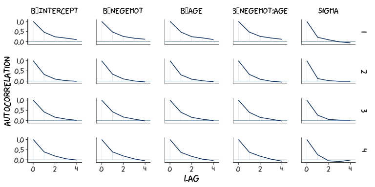
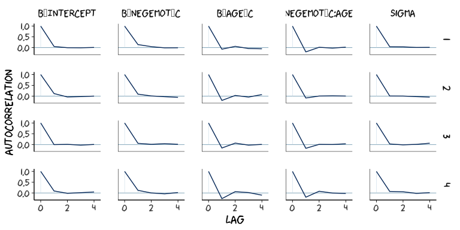
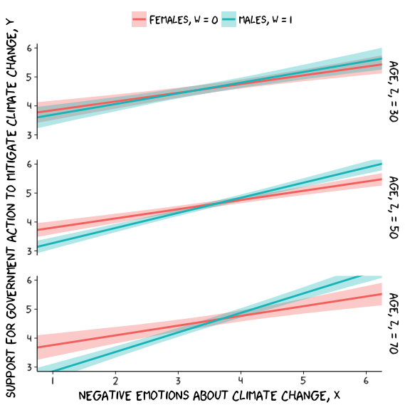
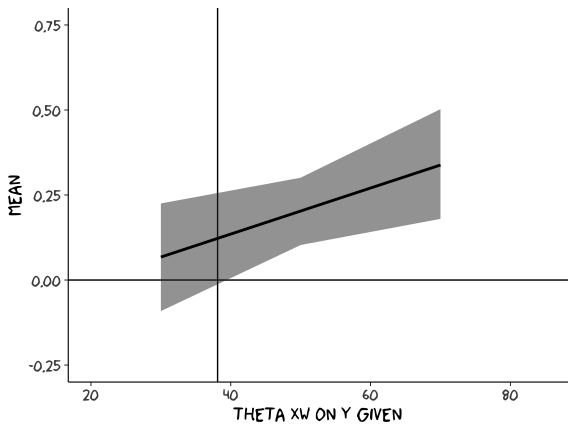

Chapter 09
================
A Solomon Kurz
2018-06-21

9.1 Truths and myths about mean-centering
-----------------------------------------

Here we load a couple necessary packages, load the data, and take a `glimpse()`.

``` r
library(readr)
library(tidyverse)

glbwarm <- read_csv("data/glbwarm/glbwarm.csv")

glimpse(glbwarm)
```

    ## Observations: 815
    ## Variables: 7
    ## $ govact   <dbl> 3.6, 5.0, 6.6, 1.0, 4.0, 7.0, 6.8, 5.6, 6.0, 2.6, 1.4, 5.6, 7.0, 3.8, 3.4, 4.2, 1.0...
    ## $ posemot  <dbl> 3.67, 2.00, 2.33, 5.00, 2.33, 1.00, 2.33, 4.00, 5.00, 5.00, 1.00, 4.00, 1.00, 5.67,...
    ## $ negemot  <dbl> 4.67, 2.33, 3.67, 5.00, 1.67, 6.00, 4.00, 5.33, 6.00, 2.00, 1.00, 4.00, 5.00, 4.67,...
    ## $ ideology <int> 6, 2, 1, 1, 4, 3, 4, 5, 4, 7, 6, 4, 2, 4, 5, 2, 6, 4, 2, 4, 4, 2, 6, 4, 4, 3, 4, 5,...
    ## $ age      <int> 61, 55, 85, 59, 22, 34, 47, 65, 50, 60, 71, 60, 71, 59, 32, 36, 69, 70, 41, 48, 38,...
    ## $ sex      <int> 0, 0, 1, 0, 1, 0, 1, 1, 1, 1, 1, 0, 1, 0, 1, 1, 1, 0, 0, 0, 0, 1, 1, 1, 1, 1, 1, 0,...
    ## $ partyid  <int> 2, 1, 1, 1, 1, 2, 1, 1, 2, 3, 2, 1, 1, 1, 1, 1, 2, 3, 1, 3, 2, 1, 3, 2, 1, 1, 1, 3,...

Before we fit our models, we'll go ahead and make our mean-centered predictors, `negemot_c` and `age_c`.

``` r
glbwarm <-
  glbwarm %>% 
  mutate(negemot_c = negemot - mean(negemot),
         age_c = age - mean(age))
```

Now we're ready to fit Models 1 and 2. But before we do, it's worth repeating part of the text:

> Mean-centering has been recommended in a few highly regarded books on regression analysis (e.g., [Aiken & West, 1991](https://books.google.com/books/about/Multiple_Regression.html?id=LcWLUyXcmnkC); [Cohen et al., 2003](https://books.google.com/books/about/Applied_Multiple_Regression_Correlation.html?id=fAnSOgbdFXIC)), and several explanations have been offered for why mean-centering should be undertaken prior to computation of the product and model estimation. The explanation that seems to have resulted in the most misunderstanding is that *X* and *W* are likely to be highly correlated with *XW* and this will produce estimation problems caused by collinearity and result in poor or "strange" estimates of regression coefficients, large standard errors, and reduced power of the statistical test of the interaction. But his is, in large part, simply a myth. (p. 304)

As we'll see in just a bit, there are some important reasons for Bayesians using HMC to mean center that wouldn't pop up within the OLS paradigm. First let's fit `model1` and `model2`.

``` r
library(brms)

model1 <- 
  brm(data = glbwarm, family = gaussian,
      govact ~ 1 + negemot + age + negemot:age,
      chains = 4, cores = 4)

model2 <- 
  update(model1, newdata = glbwarm,
         govact ~ 1 + negemot_c + age_c + negemot_c:age_c,
         chains = 4, cores = 4)
```

As with Hayes's OLS models, our HMC models yield the same Bayesian *R*<sup>2</sup> distributions, within simulation error.

``` r
bayes_R2(model1) %>% round(digits = 3)
```

    ##    Estimate Est.Error Q2.5 Q97.5
    ## R2    0.354     0.022 0.31 0.395

``` r
bayes_R2(model2) %>% round(digits = 3)
```

    ##    Estimate Est.Error Q2.5 Q97.5
    ## R2    0.353     0.022 0.31 0.395

Our model summaries also correspond nicely with those in Table 9.1.

``` r
print(model1, digits = 3)
```

    ##  Family: gaussian 
    ##   Links: mu = identity; sigma = identity 
    ## Formula: govact ~ 1 + negemot + age + negemot:age 
    ##    Data: glbwarm (Number of observations: 815) 
    ## Samples: 4 chains, each with iter = 2000; warmup = 1000; thin = 1;
    ##          total post-warmup samples = 4000
    ## 
    ## Population-Level Effects: 
    ##             Estimate Est.Error l-95% CI u-95% CI Eff.Sample  Rhat
    ## Intercept      4.337     0.330    3.678    4.993       1628 1.001
    ## negemot        0.147     0.085   -0.025    0.313       1610 1.001
    ## age           -0.031     0.006   -0.043   -0.019       1621 1.001
    ## negemot:age    0.007     0.002    0.004    0.010       1557 1.002
    ## 
    ## Family Specific Parameters: 
    ##       Estimate Est.Error l-95% CI u-95% CI Eff.Sample  Rhat
    ## sigma    1.096     0.028    1.042    1.153       2498 1.002
    ## 
    ## Samples were drawn using sampling(NUTS). For each parameter, Eff.Sample 
    ## is a crude measure of effective sample size, and Rhat is the potential 
    ## scale reduction factor on split chains (at convergence, Rhat = 1).

``` r
print(model2, digits = 3)
```

    ##  Family: gaussian 
    ##   Links: mu = identity; sigma = identity 
    ## Formula: govact ~ negemot_c + age_c + negemot_c:age_c 
    ##    Data: glbwarm (Number of observations: 815) 
    ## Samples: 4 chains, each with iter = 2000; warmup = 1000; thin = 1;
    ##          total post-warmup samples = 4000
    ## 
    ## Population-Level Effects: 
    ##                 Estimate Est.Error l-95% CI u-95% CI Eff.Sample  Rhat
    ## Intercept          4.596     0.038    4.519    4.672       3332 1.000
    ## negemot_c          0.500     0.025    0.451    0.549       3515 0.999
    ## age_c             -0.005     0.002   -0.010   -0.001       4000 0.999
    ## negemot_c:age_c    0.007     0.002    0.004    0.010       4000 1.000
    ## 
    ## Family Specific Parameters: 
    ##       Estimate Est.Error l-95% CI u-95% CI Eff.Sample  Rhat
    ## sigma    1.097     0.027    1.047    1.154       3267 1.000
    ## 
    ## Samples were drawn using sampling(NUTS). For each parameter, Eff.Sample 
    ## is a crude measure of effective sample size, and Rhat is the potential 
    ## scale reduction factor on split chains (at convergence, Rhat = 1).

However, notice the 'Eff.Sample' columns. The values for `model2` were substantially larger than those for `model1`. 'Eff.Sample' is Bürkner's term for the number of effective samples. Recall that because we've been using brms defaults, we have 4 HMC chains, each of which contains 2000 draws (iterations), the first 1000 of which are warmup values. After we discard the warmup values, that leaves 1000 draws from each chain--4000 total. As it turns out, Markov chains, and thus HMC chains, are typically *autocorrelated*, which means that each draw is partially dependent on the previous draw. Ideally, the autocorrelations are near zero. That's often not the case.

The [bayesplot package](https://github.com/stan-dev/bayesplot) offers a variety of [diagnostic plots](https://cran.r-project.org/web/packages/bayesplot/vignettes/visual-mcmc-diagnostics.html#effective-sample-size). Here we'll use the `mcmc_acf()` function to make autocorrelation plots for all model parameters. Note that when we add `add_chain = T` to `brms::posterior_samples()`, we add an index to the data that allows us to keep track of which iteration comes from which chain. That index will come in handy for our `mcmc_acf()` plots.

``` r
library(bayesplot)

post1 <- posterior_samples(model1, add_chain = T)
mcmc_acf(post1, 
         pars = c("b_Intercept", "b_negemot", "b_age", "b_negemot:age", "sigma"),
         lags = 4) 
```


``` r
post2 <- posterior_samples(model2, add_chain = T)
mcmc_acf(post2, 
         pars = c("b_Intercept", "b_negemot_c", "b_age_c", "b_negemot_c:age_c", "sigma"),
         lags = 4) 
```


So again, high autocorrelations in the HMC chains have consequences for the effective sample size. In the [Visual MCMC diagnostics using the bayesplot package](https://cran.r-project.org/web/packages/bayesplot/vignettes/visual-mcmc-diagnostics.html#effective-sample-size) vignette, Gabry wrote:

> The effective sample size is an estimate of the number of independent draws from the posterior distribution of the estimand of interest. Because the draws within a Markov chain are *not* independent if there is autocorrelation, the effective sample size, *n*<sub>eff</sub>, will be smaller than the total sample size, *N*. The larger the ratio of *n*<sub>eff</sub> to *N* the better.

The 'Eff.Sample' values were all close to 4000 with `model2` and the autocorrelations were very low, too. The reverse was true for `model1`. The upshot is that even though we have 4000 samples for each parameter, those samples don't necessarily give us the same quality of information fully independent samples would. 'Eff.Sample' helps you determine how concerned you should be. And, as it turns out, things like centering can help increase a models 'Eff.Sample' values.

Wading in further, we can use the `neff_ratio()` function to collect the *n*<sub>eff</sub> to *N* ratio for each model parameter and then use `mcmc_neff()` to make a visual diagnostic. Here we do so for `model1` and `model2`.

``` r
ratios_model1 <- 
  neff_ratio(model1, 
             pars = c("b_Intercept", "b_negemot", "b_age", "b_negemot:age", "sigma"))
ratios_model2 <- 
  neff_ratio(model2,
             pars = c("b_Intercept", "b_negemot_c", "b_age_c", "b_negemot_c:age_c", "sigma"))

mcmc_neff(ratios_model1) + yaxis_text(hjust = 0)
```


``` r
mcmc_neff(ratios_model2) + yaxis_text(hjust = 0)
```


Although none of the *n*<sub>eff</sub> to *N* ratios were in the shockingly-low range for either model, there were substantially closer to 1 for `model2`.

In addition to autocorrelations and *n*<sub>eff</sub> to *N* ratios, there is also the issue that the parameters in the model can themselves be correlated. If you like a visual approach, you can use `brms::pairs()` to retrieve histograms for each parameter along with scatter plots showing the shape of their correlations. Here we'll use the `off_diag_args` argument to customize some of the plot settings.

``` r
pairs(model1,
      off_diag_args = list(size = 1/10,
                           alpha = 1/5))
```



``` r
pairs(model2,
      off_diag_args = list(size = 1/10,
                           alpha = 1/5))
```



When fitting models with HMC, centering can make a difference for the parameter correlations. If you prefer a more numeric approach, `vcov()` will yield the variance/covariance matrix--or correlation matrix when using `correlation = T`--for the parameters in a model.

``` r
vcov(model1, correlation = T) %>% round(digits = 2)
```

    ##             Intercept negemot   age negemot:age
    ## Intercept        1.00   -0.93 -0.95        0.88
    ## negemot         -0.93    1.00  0.88       -0.95
    ## age             -0.95    0.88  1.00       -0.92
    ## negemot:age      0.88   -0.95 -0.92        1.00

``` r
vcov(model2, correlation = T) %>% round(digits = 2)
```

    ##                 Intercept negemot_c age_c negemot_c:age_c
    ## Intercept            1.00     -0.03  0.03            0.05
    ## negemot_c           -0.03      1.00  0.06           -0.09
    ## age_c                0.03      0.06  1.00           -0.01
    ## negemot_c:age_c      0.05     -0.09 -0.01            1.00

*And so wait, what does that even mean for a parameter to correlate with another parameter?* you might ask. Fair enough. Let's compute a correlation step by step. First, `posterior_samples()`:

``` r
post <- posterior_samples(model1)

head(post)
```

    ##   b_Intercept b_negemot       b_age b_negemot:age    sigma      lp__
    ## 1    4.403728 0.1114640 -0.03003817   0.007396204 1.088235 -1235.441
    ## 2    4.500435 0.1666328 -0.03455496   0.007141672 1.102326 -1237.037
    ## 3    4.291949 0.1461668 -0.02926550   0.007125883 1.097990 -1234.971
    ## 4    4.114642 0.1695000 -0.02447830   0.006388947 1.103440 -1236.583
    ## 5    4.583618 0.0979061 -0.03309017   0.007752180 1.055650 -1237.391
    ## 6    3.990672 0.2072579 -0.02670000   0.006373618 1.167371 -1239.838

Now we've put our posterior iterations into a data object, `post`, we can make a scatter plot of two parameters. Here we'll choose `b_negemot` and the interaction coefficient, `b_negemot:age`.

``` r
post %>% 
  ggplot(aes(x = b_negemot, y = `b_negemot:age`)) +
  geom_point(size = 1/10, alpha = 1/5) +
  labs(subtitle = "Each dot is of the parameter pair from a single\niteration. Across the 4,000 total posterior iterations,\nit becomes clear the two parameters are highly\nnegatively correlated.")
```


And indeed, the Pearson's correlation is:

``` r
cor(post$b_negemot, post$`b_negemot:age`)
```

    ## [1] -0.95462

And what was that part from the `vcov()` output, again?

``` r
vcov(model1, correlation = T)["negemot", "negemot:age"]
```

    ## [1] -0.95462

Boom! That's where the correlations come from.

This entire topic of HMC diagnostics can seem baffling, especially when compared to the simplicity of OLS. If this is your first introduction, you might want to watch lectures [10](https://www.youtube.com/watch?v=BWEtS3HuU5A&list=PLDcUM9US4XdM9_N6XUUFrhghGJ4K25bFc) and [11](https://www.youtube.com/watch?v=13mEekRdOcQ&list=PLDcUM9US4XdM9_N6XUUFrhghGJ4K25bFc) from McElreath's [Statistical Rethinking Fall 2017 lecture series](https://www.youtube.com/playlist?list=PLDcUM9US4XdM9_N6XUUFrhghGJ4K25bFc). Accordingly, you might check out chapter 8 of his [*Statistical Rethinking* text](https://xcelab.net/rm/statistical-rethinking/) and [my project explaining how to reproduce the analyses in that chapter in brms](https://github.com/ASKurz/Statistical_Rethinking_with_brms_ggplot2_and_the_tidyverse/blob/master/Ch._08_Markov_Chain_Monte_Carlo.md).

### The effect of mean-centering on multicollinearity and the standard error of *b*<sub>3</sub>.

This can be difficult to keep track of, but what we just looked at were the correlations among **model parameters**. These are *not* the same as correlations among **variables**. As such, those correlations are not the same as those in Table 9.2. But we can get those, too. First we'll have to do a little more data processing to get all the necessary mean-centered variables and standardized variables.

``` r
glbwarm <-
  glbwarm %>% 
  mutate(negemot_x_age     = negemot*age,
         negemot_c_x_age_c = negemot_c*age_c,
         negemot_z         = (negemot - mean(negemot))/sd(negemot),
         age_z             = (age     - mean(age)    )/sd(age)) %>% 
  mutate(negemot_z_x_age_z = negemot_z*age_z)
```

And recall that to get our sweet Bayesian correlations, we use the multivariate `cbind()` syntax to fit an intercepts-only model. Here we do that for all three of the Table 9.2 sections.

``` r
correlations1 <- 
  brm(data = glbwarm, family = gaussian,
      cbind(negemot, age, negemot_x_age) ~ 1,
      chains = 4, cores = 4)

correlations2 <- 
  brm(data = glbwarm, family = gaussian,
      cbind(negemot_c, age_c, negemot_c_x_age_c) ~ 1,
      chains = 4, cores = 4)

correlations3 <- 
  brm(data = glbwarm, family = gaussian,
      cbind(negemot_z, age_z, negemot_z_x_age_z) ~ 1,
      chains = 4, cores = 4)
```

Their summaries:

``` r
print(correlations1, digits = 3)
```

    ##  Family: MV(gaussian, gaussian, gaussian) 
    ##   Links: mu = identity; sigma = identity
    ##          mu = identity; sigma = identity
    ##          mu = identity; sigma = identity 
    ## Formula: negemot ~ 1 
    ##          age ~ 1 
    ##          negemot_x_age ~ 1 
    ##    Data: glbwarm (Number of observations: 815) 
    ## Samples: 4 chains, each with iter = 2000; warmup = 1000; thin = 1;
    ##          total post-warmup samples = 4000
    ## 
    ## Population-Level Effects: 
    ##                       Estimate Est.Error l-95% CI u-95% CI Eff.Sample  Rhat
    ## negemot_Intercept        3.557     0.055    3.448    3.661       3342 1.000
    ## age_Intercept           49.529     0.544   48.427   50.598       4000 1.000
    ## negemotxage_Intercept  174.750     3.454  167.918  181.580       3160 1.001
    ## 
    ## Family Specific Parameters: 
    ##                             Estimate Est.Error l-95% CI u-95% CI Eff.Sample  Rhat
    ## sigma_negemot                  1.530     0.037    1.458    1.605       3598 1.002
    ## sigma_age                     16.359     0.397   15.617   17.152       3393 1.000
    ## sigma_negemotxage             97.374     2.426   92.659  102.307       2943 1.001
    ## rescor(negemot,age)           -0.060     0.035   -0.127    0.009       3160 1.002
    ## rescor(negemot,negemotxage)    0.765     0.014    0.735    0.792       2729 1.001
    ## rescor(age,negemotxage)        0.547     0.024    0.498    0.593       4000 1.001
    ## 
    ## Samples were drawn using sampling(NUTS). For each parameter, Eff.Sample 
    ## is a crude measure of effective sample size, and Rhat is the potential 
    ## scale reduction factor on split chains (at convergence, Rhat = 1).

``` r
print(correlations2, digits = 3)
```

    ##  Family: MV(gaussian, gaussian, gaussian) 
    ##   Links: mu = identity; sigma = identity
    ##          mu = identity; sigma = identity
    ##          mu = identity; sigma = identity 
    ## Formula: negemot_c ~ 1 
    ##          age_c ~ 1 
    ##          negemot_c_x_age_c ~ 1 
    ##    Data: glbwarm (Number of observations: 815) 
    ## Samples: 4 chains, each with iter = 2000; warmup = 1000; thin = 1;
    ##          total post-warmup samples = 4000
    ## 
    ## Population-Level Effects: 
    ##                         Estimate Est.Error l-95% CI u-95% CI Eff.Sample  Rhat
    ## negemotc_Intercept         0.000     0.054   -0.106    0.103       4000 0.999
    ## agec_Intercept             0.009     0.566   -1.089    1.081       4000 0.999
    ## negemotcxagec_Intercept   -1.422     0.863   -3.078    0.259       4000 1.000
    ## 
    ## Family Specific Parameters: 
    ##                                Estimate Est.Error l-95% CI u-95% CI Eff.Sample  Rhat
    ## sigma_negemotc                    1.533     0.038    1.461    1.611       4000 1.000
    ## sigma_agec                       16.375     0.404   15.617   17.185       4000 1.000
    ## sigma_negemotcxagec              24.246     0.609   23.077   25.484       4000 1.000
    ## rescor(negemotc,agec)            -0.057     0.035   -0.127    0.013       4000 0.999
    ## rescor(negemotc,negemotcxagec)    0.092     0.035    0.023    0.159       4000 0.999
    ## rescor(agec,negemotcxagec)       -0.015     0.036   -0.084    0.056       4000 0.999
    ## 
    ## Samples were drawn using sampling(NUTS). For each parameter, Eff.Sample 
    ## is a crude measure of effective sample size, and Rhat is the potential 
    ## scale reduction factor on split chains (at convergence, Rhat = 1).

``` r
print(correlations3, digits = 3)
```

    ##  Family: MV(gaussian, gaussian, gaussian) 
    ##   Links: mu = identity; sigma = identity
    ##          mu = identity; sigma = identity
    ##          mu = identity; sigma = identity 
    ## Formula: negemot_z ~ 1 
    ##          age_z ~ 1 
    ##          negemot_z_x_age_z ~ 1 
    ##    Data: glbwarm (Number of observations: 815) 
    ## Samples: 4 chains, each with iter = 2000; warmup = 1000; thin = 1;
    ##          total post-warmup samples = 4000
    ## 
    ## Population-Level Effects: 
    ##                         Estimate Est.Error l-95% CI u-95% CI Eff.Sample  Rhat
    ## negemotz_Intercept         0.000     0.036   -0.070    0.070       4000 1.000
    ## agez_Intercept            -0.000     0.034   -0.069    0.066       4000 1.000
    ## negemotzxagez_Intercept   -0.057     0.034   -0.123    0.008       4000 0.999
    ## 
    ## Family Specific Parameters: 
    ##                                Estimate Est.Error l-95% CI u-95% CI Eff.Sample  Rhat
    ## sigma_negemotz                    1.002     0.025    0.956    1.053       4000 0.999
    ## sigma_agez                        1.003     0.025    0.956    1.053       4000 1.000
    ## sigma_negemotzxagez               0.972     0.024    0.927    1.021       4000 0.999
    ## rescor(negemotz,agez)            -0.057     0.035   -0.124    0.012       4000 0.999
    ## rescor(negemotz,negemotzxagez)    0.092     0.036    0.020    0.161       4000 0.999
    ## rescor(agez,negemotzxagez)       -0.016     0.035   -0.084    0.053       4000 0.999
    ## 
    ## Samples were drawn using sampling(NUTS). For each parameter, Eff.Sample 
    ## is a crude measure of effective sample size, and Rhat is the potential 
    ## scale reduction factor on split chains (at convergence, Rhat = 1).

A more condensed way to get that information might be with the `VarCorr()` function. Just make sure to tack `$residual__$cor` onto the end.

``` r
VarCorr(correlations1)$residual__$cor %>% 
  round(digits = 3)
```

    ## , , negemot
    ## 
    ##             Estimate Est.Error   Q2.5 Q97.5
    ## negemot        1.000     0.000  1.000 1.000
    ## age           -0.060     0.035 -0.127 0.009
    ## negemotxage    0.765     0.014  0.735 0.792
    ## 
    ## , , age
    ## 
    ##             Estimate Est.Error   Q2.5 Q97.5
    ## negemot       -0.060     0.035 -0.127 0.009
    ## age            1.000     0.000  1.000 1.000
    ## negemotxage    0.547     0.024  0.498 0.593
    ## 
    ## , , negemotxage
    ## 
    ##             Estimate Est.Error  Q2.5 Q97.5
    ## negemot        0.765     0.014 0.735 0.792
    ## age            0.547     0.024 0.498 0.593
    ## negemotxage    1.000     0.000 1.000 1.000

For the sake of space, I'll let you check that out for `correlations2` and `correlations3`. If you're tricky with your `VarCorr()` indexing, you can also get the model-implied variances.

``` r
VarCorr(correlations1)$residual__$cov[1, , "negemot"] %>% round(digits = 3)
```

    ##  Estimate Est.Error      Q2.5     Q97.5 
    ##     2.341     0.114     2.127     2.575

``` r
VarCorr(correlations1)$residual__$cov[2, , "age"] %>% round(digits = 3)
```

    ##  Estimate Est.Error      Q2.5     Q97.5 
    ##   267.767    13.011   243.895   294.196

``` r
VarCorr(correlations1)$residual__$cov[3, , "negemotxage"] %>% round(digits = 3)
```

    ##  Estimate Est.Error      Q2.5     Q97.5 
    ##  9487.516   473.152  8585.761 10466.822

And if you're like totally lost with all this indexing, you might code `VarCorr(correlations1) %>% str()` and spend a little time looking at what `VarCorr()` produces.

On page 309, Hayes explanied why the OLS variance for *b*<sub>3</sub> is unaffected by mean-centering. The story was similar for our HMC model, too:

``` r
fixef(model1)["negemot:age", "Est.Error"]
```

    ## [1] 0.001604113

``` r
fixef(model2)["negemot_c:age_c", "Est.Error"]
```

    ## [1] 0.001577777

For more details, you might also see the [28.11. Standardizing Predictors and Outputs subsection of the Stan Modeling Language User’s Guide and Reference Manual, 2.17.0](http://mc-stan.org/users/documentation/)--[Stan](http://mc-stan.org), of course, being the computational engine underneath our brms hood.

### The effect of mean-centering on *b*<sub>1</sub>, *b*<sub>2</sub>, and their ~~standard errors~~ posterior *SD*s.

If you only care about posterior means, you can reproduce the results at the bottom of page 310 like:

``` r
fixef(model1)["negemot", 1] + 
  fixef(model1)["negemot:age", 1]*mean(glbwarm$age)
```

    ## [1] 0.5006701

But we're proper Bayesians and like a summary of the spread in the posterior. So we'll evoke `posterior_samples()` and the other usual steps.

``` r
post <- posterior_samples(model1)

post %>% 
  transmute(our_contidional_effect_given_W_bar = b_negemot + `b_negemot:age`*mean(glbwarm$age)) %>%
  summarize(mean = mean(our_contidional_effect_given_W_bar),
            sd = sd(our_contidional_effect_given_W_bar)) %>% 
  round(digits = 3)
```

    ##    mean    sd
    ## 1 0.501 0.026

And note how the standard error Hayes computed at the top of page 311 corresponds nicely with the posterior *SD* we just computed. Hayes employed a fancy formula; we just used `sd()`.

9.2 The estimation and interpretation of standardized regression coefficients in a moderation analysis
------------------------------------------------------------------------------------------------------

### Variant 1.

We've already computed standardized predictors. Now we just need to standardize the criterion, `govact`.

``` r
glbwarm <-
  glbwarm %>% 
  mutate(govact_z = (govact - mean(govact))/sd(govact))
```

Fit:

``` r
model3 <- 
  update(model1, newdata = glbwarm,
         govact_z ~ 1 + negemot_z + age_z + negemot_z:age_z,
         chains = 4, cores = 4)
```

``` r
bayes_R2(model3) %>% round(digits = 3)
```

    ##    Estimate Est.Error  Q2.5 Q97.5
    ## R2    0.354     0.021 0.311 0.395

``` r
print(model3, digits = 3)
```

    ##  Family: gaussian 
    ##   Links: mu = identity; sigma = identity 
    ## Formula: govact_z ~ negemot_z + age_z + negemot_z:age_z 
    ##    Data: glbwarm (Number of observations: 815) 
    ## Samples: 4 chains, each with iter = 2000; warmup = 1000; thin = 1;
    ##          total post-warmup samples = 4000
    ## 
    ## Population-Level Effects: 
    ##                 Estimate Est.Error l-95% CI u-95% CI Eff.Sample  Rhat
    ## Intercept          0.007     0.029   -0.050    0.063       4000 1.000
    ## negemot_z          0.562     0.028    0.508    0.618       4000 0.999
    ## age_z             -0.064     0.028   -0.119   -0.009       4000 1.000
    ## negemot_z:age_z    0.132     0.029    0.076    0.189       4000 1.000
    ## 
    ## Family Specific Parameters: 
    ##       Estimate Est.Error l-95% CI u-95% CI Eff.Sample  Rhat
    ## sigma    0.807     0.020    0.769    0.846       4000 1.002
    ## 
    ## Samples were drawn using sampling(NUTS). For each parameter, Eff.Sample 
    ## is a crude measure of effective sample size, and Rhat is the potential 
    ## scale reduction factor on split chains (at convergence, Rhat = 1).

### Variant 2.

This time we need to standardize our interaction term, `negemot_x_age_z`, by hand.

``` r
glbwarm <-
  glbwarm %>% 
  mutate(negemot_x_age_z = (negemot_x_age - mean(negemot_x_age))/sd(negemot_x_age))
```

Now we're ready to fit.

``` r
model4 <- 
  update(model1, newdata = glbwarm,
         govact_z ~ 1 + negemot_z + age_z + negemot_x_age_z,
         chains = 4, cores = 4)
```

``` r
bayes_R2(model4) %>% round(digits = 3)
```

    ##    Estimate Est.Error  Q2.5 Q97.5
    ## R2    0.354     0.021 0.311 0.394

``` r
print(model4, digits = 3)
```

    ##  Family: gaussian 
    ##   Links: mu = identity; sigma = identity 
    ## Formula: govact_z ~ negemot_z + age_z + negemot_x_age_z 
    ##    Data: glbwarm (Number of observations: 815) 
    ## Samples: 4 chains, each with iter = 2000; warmup = 1000; thin = 1;
    ##          total post-warmup samples = 4000
    ## 
    ## Population-Level Effects: 
    ##                 Estimate Est.Error l-95% CI u-95% CI Eff.Sample  Rhat
    ## Intercept          0.000     0.028   -0.054    0.053       2766 1.002
    ## negemot_z          0.168     0.095   -0.014    0.357       1174 1.002
    ## age_z             -0.366     0.073   -0.507   -0.223       1074 1.002
    ## negemot_x_age_z    0.508     0.114    0.284    0.722       1120 1.002
    ## 
    ## Family Specific Parameters: 
    ##       Estimate Est.Error l-95% CI u-95% CI Eff.Sample  Rhat
    ## sigma    0.807     0.020    0.768    0.848       2508 1.001
    ## 
    ## Samples were drawn using sampling(NUTS). For each parameter, Eff.Sample 
    ## is a crude measure of effective sample size, and Rhat is the potential 
    ## scale reduction factor on split chains (at convergence, Rhat = 1).

The results correspond nicely to those in Table 9.1.

9.3 A caution on manual centering and standardization
-----------------------------------------------------

It's worthwhile considering the issue of listwise deletion when data are partially missing. The brms default is to delete rows with missingness, "NA" in R, for the predictors. However, [brms allows users to perform one-step Bayesian imputation for missing values using the `mi()` syntax](https://cran.r-project.org/web/packages/brms/vignettes/brms_missings.html). First we'll firt see what happens when you fit a model in brms when some of the `negemot_z` values are missing, but without using the `mi()` syntax. And of course before we do that, we'll make a `negemot_z_missing` variable, which is identical to `negemot_z`, but about 10% of the values are missing.

``` r
set.seed(815)
glbwarm <-
  glbwarm %>% 
  mutate(missing = rbinom(n = 815, size = 1, prob = .1)) %>% 
  mutate(negemot_z_missing = ifelse(missing == 1, NA, negemot_z))
```

If you've never used `rbinom()` before, code `?rbinom` or look it up in your favorite web search engine. Here's our listwise deletion model, which corresponds to what you'd get from a tpical OLS-based program.

``` r
model5 <- 
  update(model3, newdata = glbwarm,
         govact_z ~ 1 + negemot_z_missing + age_z + negemot_z_missing:age_z,
         chains = 4, cores = 4)
```

Let's compare the listwise deletion results with the model based on all the data.

``` r
print(model3)
```

    ##  Family: gaussian 
    ##   Links: mu = identity; sigma = identity 
    ## Formula: govact_z ~ negemot_z + age_z + negemot_z:age_z 
    ##    Data: glbwarm (Number of observations: 815) 
    ## Samples: 4 chains, each with iter = 2000; warmup = 1000; thin = 1;
    ##          total post-warmup samples = 4000
    ## 
    ## Population-Level Effects: 
    ##                 Estimate Est.Error l-95% CI u-95% CI Eff.Sample Rhat
    ## Intercept           0.01      0.03    -0.05     0.06       4000 1.00
    ## negemot_z           0.56      0.03     0.51     0.62       4000 1.00
    ## age_z              -0.06      0.03    -0.12    -0.01       4000 1.00
    ## negemot_z:age_z     0.13      0.03     0.08     0.19       4000 1.00
    ## 
    ## Family Specific Parameters: 
    ##       Estimate Est.Error l-95% CI u-95% CI Eff.Sample Rhat
    ## sigma     0.81      0.02     0.77     0.85       4000 1.00
    ## 
    ## Samples were drawn using sampling(NUTS). For each parameter, Eff.Sample 
    ## is a crude measure of effective sample size, and Rhat is the potential 
    ## scale reduction factor on split chains (at convergence, Rhat = 1).

``` r
print(model5)
```

    ##  Family: gaussian 
    ##   Links: mu = identity; sigma = identity 
    ## Formula: govact_z ~ negemot_z_missing + age_z + negemot_z_missing:age_z 
    ##    Data: glbwarm (Number of observations: 719) 
    ## Samples: 4 chains, each with iter = 2000; warmup = 1000; thin = 1;
    ##          total post-warmup samples = 4000
    ## 
    ## Population-Level Effects: 
    ##                         Estimate Est.Error l-95% CI u-95% CI Eff.Sample Rhat
    ## Intercept                   0.00      0.03    -0.06     0.06       4000 1.00
    ## negemot_z_missing           0.56      0.03     0.50     0.62       4000 1.00
    ## age_z                      -0.05      0.03    -0.11     0.00       4000 1.00
    ## negemot_z_missing:age_z     0.12      0.03     0.06     0.18       4000 1.00
    ## 
    ## Family Specific Parameters: 
    ##       Estimate Est.Error l-95% CI u-95% CI Eff.Sample Rhat
    ## sigma     0.81      0.02     0.77     0.86       4000 1.00
    ## 
    ## Samples were drawn using sampling(NUTS). For each parameter, Eff.Sample 
    ## is a crude measure of effective sample size, and Rhat is the potential 
    ## scale reduction factor on split chains (at convergence, Rhat = 1).

In this case, the model results were similar to those based on all the data because we used `rbinom()` to delete the predictor values completely at random. With real data and real-live missing data mechanisms, the situation isn't often so rosy. But anyway, the real story, here, is the `Data: glbwarm (Number of observations: $n$)` line at the top of the `print()` outputs. The number, *n*, was 815 in the model using all the data and 719 for the one based on listwise deletion. That's a lot of missing information.

The `mi()` syntax will allow us to use all the rows in a model, even if one or more of the predictors contain missing values. The syntax makes the model a multivariate model in that now we'll be modeling both `govact_z` *and* `negemot_z_missing`. There are multiple ways to write a [multivariate model in brms](https://cran.r-project.org/web/packages/brms/vignettes/brms_multivariate.html). One nice way is to write the model for each criterion separately in a `bf()` statement. You combine the `bf()` statements together with the `+` operator. And for models like the ones in Hayes's text, you'll also want to tack on `set_rescor(FALSE)`. You can do this within the `brm()` function, as usual. But I find that this clutters the code up more than I like. So another approach is to save the combination of `bf()` statements as an object.

``` r
my_model <- 
  bf(govact_z  ~ 1 + mi(negemot_z_missing) + age_z + mi(negemot_z_missing):age_z) + 
  bf(negemot_z_missing | mi() ~ 1) + 
  set_rescor(FALSE)
```

With our multivariate formula saved as `my_model`, we're ready to plug it into `brm()` and fit.

``` r
model6 <- 
  brm(data = glbwarm,
      family = gaussian,
      my_model,
      chains = 4, cores = 4)
```

Let's see what we've done.

``` r
print(model6)
```

    ##  Family: MV(gaussian, gaussian) 
    ##   Links: mu = identity; sigma = identity
    ##          mu = identity; sigma = identity 
    ## Formula: govact_z ~ 1 + mi(negemot_z_missing) + age_z + mi(negemot_z_missing):age_z 
    ##          negemot_z_missing | mi() ~ 1 
    ##    Data: glbwarm (Number of observations: 815) 
    ## Samples: 4 chains, each with iter = 2000; warmup = 1000; thin = 1;
    ##          total post-warmup samples = 4000
    ## 
    ## Population-Level Effects: 
    ##                                   Estimate Est.Error l-95% CI u-95% CI Eff.Sample Rhat
    ## govactz_Intercept                     0.00      0.03    -0.05     0.06       4000 1.00
    ## negemotzmissing_Intercept             0.00      0.04    -0.07     0.08       4000 1.00
    ## govactz_age_z                        -0.07      0.03    -0.12    -0.01       4000 1.00
    ## govactz_minegemot_z_missing           0.56      0.03     0.50     0.61       4000 1.00
    ## govactz_minegemot_z_missing:age_z     0.13      0.03     0.07     0.19       4000 1.00
    ## 
    ## Family Specific Parameters: 
    ##                       Estimate Est.Error l-95% CI u-95% CI Eff.Sample Rhat
    ## sigma_govactz             0.81      0.02     0.77     0.85       4000 1.00
    ## sigma_negemotzmissing     1.00      0.03     0.95     1.05       4000 1.00
    ## 
    ## Samples were drawn using sampling(NUTS). For each parameter, Eff.Sample 
    ## is a crude measure of effective sample size, and Rhat is the potential 
    ## scale reduction factor on split chains (at convergence, Rhat = 1).

When using the multivariate `mi()` syntax, your `print()` output becomes more complicated. Now we have a regression model for both `govact_z` and `negemot_z_missing`. At a minimum, each has its own intercept and residual variance (i.e., sigma). In the 'Population-Level Effects' section, the first part of the names for each regression coefficient clarifies which *Y*-variable it corresponds to (e.g., `govactz_Intercept` is the intercept for our primary *Y*-variable, `govact_z`). In the 'Family Specific Parameters' section, the sigmas are similarly labeled.

Perhaps most importantly, we see "Data: glbwarm (Number of observations: 815)" at the top of the output. The multivariate `mi()` syntax used all the available data. No listwise deletion necessary.

The `print()` output for our model obscured some of the results. To clarify what the `mi()` syntax did, let's peek at the first columns returned by `posterior_samples()`.

``` r
post <- posterior_samples(model6)

post[, 1:20] %>% 
  glimpse()
```

    ## Observations: 4,000
    ## Variables: 20
    ## $ b_govactz_Intercept                     <dbl> 0.0181383302, -0.0157326422, 0.0541318227, -0.034953...
    ## $ b_negemotzmissing_Intercept             <dbl> -0.0307637493, -0.0576830166, -0.0456627319, 0.03928...
    ## $ b_govactz_age_z                         <dbl> -0.097128166, -0.078661301, -0.083013163, -0.0640657...
    ## $ bsp_govactz_minegemot_z_missing         <dbl> 0.4922146, 0.5356537, 0.5646695, 0.5716735, 0.572536...
    ## $ `bsp_govactz_minegemot_z_missing:age_z` <dbl> 0.13762695, 0.14981250, 0.15308656, 0.09964480, 0.10...
    ## $ sigma_govactz                           <dbl> 0.8110994, 0.8215303, 0.7763660, 0.8493301, 0.856560...
    ## $ sigma_negemotzmissing                   <dbl> 0.9753204, 1.0090418, 1.0279405, 0.9557356, 0.969063...
    ## $ `Ymi_negemotzmissing[7]`                <dbl> 1.74991761, 1.09547254, 0.73468761, 1.10011759, 1.47...
    ## $ `Ymi_negemotzmissing[22]`               <dbl> 0.17423965, 0.64322923, 0.90150105, -0.05036961, 0.5...
    ## $ `Ymi_negemotzmissing[31]`               <dbl> -0.324453965, -0.437521581, 0.292070674, -0.36131765...
    ## $ `Ymi_negemotzmissing[55]`               <dbl> -2.295059382, -1.076011699, 0.159550899, -0.46651615...
    ## $ `Ymi_negemotzmissing[60]`               <dbl> 0.02262024, 0.05999956, 1.34228118, -0.24186362, 0.0...
    ## $ `Ymi_negemotzmissing[66]`               <dbl> -0.12286084, -0.49384017, -0.11129494, -0.45227533, ...
    ## $ `Ymi_negemotzmissing[72]`               <dbl> -1.35785668, -0.41280703, 0.51579125, 0.22405164, 0....
    ## $ `Ymi_negemotzmissing[86]`               <dbl> -0.11296394, -0.17204023, 0.72675978, -1.29127972, -...
    ## $ `Ymi_negemotzmissing[87]`               <dbl> -0.467488859, 0.025624740, -0.116221060, -1.29201106...
    ## $ `Ymi_negemotzmissing[98]`               <dbl> -0.69646520, -1.77535027, -0.99531982, 0.59370055, 0...
    ## $ `Ymi_negemotzmissing[103]`              <dbl> 0.03547854, 0.17929884, 1.22315695, -0.03041375, 0.6...
    ## $ `Ymi_negemotzmissing[107]`              <dbl> -2.157201115, -1.897721053, -0.863650535, -0.2811301...
    ## $ `Ymi_negemotzmissing[131]`              <dbl> 0.40998377, -0.41145431, -0.93377592, 0.04128900, 0....

Columns `b_govactz_Intercept` through `sigma_negemotzmissing` were business as usual. But notice all the `Ymi_negemotzmissing[i]` columns. In each of these we see 4,000 posterior draws for the missing `negemot_z_missing` values. The `[i]` part of the column names indexes which row number the iterations correspond to. Since we made a lot of missing values in the data, I won't go through them all. But we can focus on a few to get a sense of the results.

``` r
post %>% 
  select(`Ymi_negemotzmissing[7]`:`Ymi_negemotzmissing[131]`) %>% 
  gather(row, value) %>% 
  group_by(row) %>% 
  # Yep, that's right, we're summarizing as usual
  summarize(mean = mean(value),
            sd = sd(value),
            ll = quantile(value, probs = .025),
            ul = quantile(value, probs = .975)) %>% 
  mutate_if(is.double, round, digits = 2) %>%
  mutate(row = str_extract(row, "\\d+") %>% as.integer())  # this line just makes the row names easier to read
```

    ## # A tibble: 13 x 5
    ##      row   mean    sd     ll    ul
    ##    <int>  <dbl> <dbl>  <dbl> <dbl>
    ##  1   103  0.650 0.820 -0.940 2.27 
    ##  2   107 -0.590 0.810 -2.15  0.970
    ##  3   131 -0.480 0.710 -1.84  0.900
    ##  4    22  0.390 0.770 -1.12  1.92 
    ##  5    31 -0.150 0.760 -1.64  1.38 
    ##  6    55 -0.250 0.840 -1.87  1.36 
    ##  7    60  0.480 0.760 -1.02  1.97 
    ##  8    66 -0.350 0.870 -2.11  1.35 
    ##  9     7  0.910 0.810 -0.680 2.51 
    ## 10    72  0.330 0.740 -1.13  1.79 
    ## 11    86 -0.330 0.780 -1.85  1.20 
    ## 12    87 -0.670 0.760 -2.19  0.840
    ## 13    98 -0.190 0.860 -1.90  1.46

In conventional mean-imputation, you just plug the sample mean into the missing value slot (which is a sin against data; don't do this). With multiple imputation, you create a small number of alternative data sets, typically 5, into which you impute plausible values into the missing value slots. With one-step Bayesian imputation using the `mi()` syntax, you get an entire posterior distribution for each missing value. And if you have variables in the data set that might help predict what those missing values are, you’d just plug that into the model. For more on the topic, see Bürkner’s [vignette](https://cran.r-project.org/web/packages/brms/vignettes/brms_missings.html), McElreath’s [lecture on the topic](https://www.youtube.com/watch?v=Yi0EqAu043A), or my [effort to translate the chapter 14 code in McElreath’s text into brms](https://github.com/ASKurz/Statistical_Rethinking_with_brms_ggplot2_and_the_tidyverse/blob/master/Ch._14_Missing_Data_and_Other_Opportunities.md).

The take home message is there is no need to ignore missing data or use outdated procedures like listwise deletion. Be a champion and model your missing data with brms.

9.4 More than one moderator
---------------------------

None of this is a problem for brms. But instead of using the `model=i` syntax in Hayes's PROCESS, you just have to specify your model formula in `brm()`.

### Additive multiple moderation.

It's trivial to add `sex`, its interaction with `negemot`, and the two covariates (i.e., `posemot` and `ideology`) to the model. We can even do it within `update()`.

``` r
model7 <- 
  update(model1, newdata = glbwarm,
         govact ~ 1 + negemot + sex + age + posemot + ideology + negemot:sex + negemot:age,
         chains = 4, cores = 4)
```

Our output matches nicely with the formula at the bottom of page 232 and the PROCESS output in Figure 9.2.

``` r
print(model7, digits = 3)
```

    ##  Family: gaussian 
    ##   Links: mu = identity; sigma = identity 
    ## Formula: govact ~ negemot + sex + age + posemot + ideology + negemot:sex + negemot:age 
    ##    Data: glbwarm (Number of observations: 815) 
    ## Samples: 4 chains, each with iter = 2000; warmup = 1000; thin = 1;
    ##          total post-warmup samples = 4000
    ## 
    ## Population-Level Effects: 
    ##             Estimate Est.Error l-95% CI u-95% CI Eff.Sample  Rhat
    ## Intercept      5.277     0.339    4.623    5.940       2451 1.000
    ## negemot        0.091     0.081   -0.064    0.251       2168 1.001
    ## sex           -0.734     0.191   -1.108   -0.356       2099 1.001
    ## age           -0.018     0.006   -0.030   -0.007       2114 1.000
    ## posemot       -0.023     0.028   -0.078    0.032       4000 0.999
    ## ideology      -0.207     0.027   -0.260   -0.155       4000 1.001
    ## negemot:sex    0.203     0.049    0.110    0.299       2105 1.001
    ## negemot:age    0.005     0.002    0.002    0.008       2024 1.000
    ## 
    ## Family Specific Parameters: 
    ##       Estimate Est.Error l-95% CI u-95% CI Eff.Sample  Rhat
    ## sigma    1.048     0.025    1.001    1.099       3512 1.000
    ## 
    ## Samples were drawn using sampling(NUTS). For each parameter, Eff.Sample 
    ## is a crude measure of effective sample size, and Rhat is the potential 
    ## scale reduction factor on split chains (at convergence, Rhat = 1).

On page 325, Hayes discussed the unique variance each of the two moderation terms accounted for after controlling for the other covariates. In order to get our Bayesian version of these, we'll have to fit two additional models, one after removing each of the interaction terms.

``` r
model8 <- 
  update(model7, newdata = glbwarm,
         govact ~ 1 + negemot + sex + age + posemot + ideology + negemot:sex,
         chains = 4, cores = 4)

model9 <- 
  update(model7, newdata = glbwarm,
         govact ~ 1 + negemot + sex + age + posemot + ideology + negemot:age,
         chains = 4, cores = 4)
```

Here we'll extract the `bayes_R2()` iterations for each of the three models, place them all in a single tibble, and then do a little arithmetic to get the difference scores. After all that data wrangling, we'll `summarize()` as usual.

``` r
r2_without_age_interaction <- bayes_R2(model8, summary = F) %>% as_tibble()
r2_without_sex_interaction <- bayes_R2(model9, summary = F) %>% as_tibble()
r2_with_both_interactions  <- bayes_R2(model7, summary = F) %>% as_tibble()

r2s <-
  tibble(r2_without_age_interaction = r2_without_age_interaction$R2,
         r2_without_sex_interaction = r2_without_sex_interaction$R2,
         r2_with_both_interactions  = r2_with_both_interactions$R2) %>% 
  mutate(delta_r2_due_to_age_interaction = r2_with_both_interactions - r2_without_age_interaction,
         delta_r2_due_to_sex_interaction = r2_with_both_interactions - r2_without_sex_interaction)

r2s %>% 
  select(delta_r2_due_to_age_interaction:delta_r2_due_to_sex_interaction) %>% 
  gather() %>% 
  group_by(key) %>% 
  summarize(mean = mean(value),
            ll = quantile(value, probs = .025),
            ul = quantile(value, probs = .975)) %>% 
  mutate_if(is.double, round, digits = 3)
```

    ## # A tibble: 2 x 4
    ##   key                                mean      ll     ul
    ##   <chr>                             <dbl>   <dbl>  <dbl>
    ## 1 delta_r2_due_to_age_interaction 0.00700 -0.0490 0.0630
    ## 2 delta_r2_due_to_sex_interaction 0.0130  -0.0430 0.0680

Recall that *R*<sup>2</sup> is in a 0-to-1 metric. It's a proportion. If you want to convert that to a percentage, as in percent of variance explained, you'd just multiply by 100. To make it explicit, let's do that.

``` r
r2s %>% 
  select(delta_r2_due_to_age_interaction:delta_r2_due_to_sex_interaction) %>% 
  gather() %>% 
  group_by(key) %>%
  summarize(mean = mean(value)*100,
            ll = quantile(value, probs = .025)*100,
            ul = quantile(value, probs = .975)*100) %>% 
  mutate_if(is.double, round, digits = 3)
```

    ## # A tibble: 2 x 4
    ##   key                              mean    ll    ul
    ##   <chr>                           <dbl> <dbl> <dbl>
    ## 1 delta_r2_due_to_age_interaction 0.688 -4.87  6.32
    ## 2 delta_r2_due_to_sex_interaction 1.27  -4.32  6.78

Hopefully it's clear how our proportions turned percentages correspond to the figures on page 325. However, note how our 95% credible intervals do not cohere with the *p*-values from Hayes's *F*-tests.

If we want to prep for our version of Figure 9.3, we'll need to carefully specify the predictor values we'll pass through the `fitted()` function. Here we do so and save them in `nd`.

``` r
nd <-
  tibble(negemot = rep(seq(from = .5, to = 6.5, length.out = 30),
                       times = 6),
         sex = rep(rep(0:1, each = 30),
                   times = 3),
         age = rep(c(30, 50, 70), each = 60),
         posemot = mean(glbwarm$posemot),
         ideology = mean(glbwarm$ideology))

head(nd)
```

    ## # A tibble: 6 x 5
    ##   negemot   sex   age posemot ideology
    ##     <dbl> <int> <dbl>   <dbl>    <dbl>
    ## 1   0.500     0  30.0    3.13     4.08
    ## 2   0.707     0  30.0    3.13     4.08
    ## 3   0.914     0  30.0    3.13     4.08
    ## 4   1.12      0  30.0    3.13     4.08
    ## 5   1.33      0  30.0    3.13     4.08
    ## 6   1.53      0  30.0    3.13     4.08

With our `nd` values in hand, we're ready to make our version of Figure 9.3.

``` r
fitted(model7, newdata = nd) %>% 
  as_tibble() %>% 
  bind_cols(nd) %>% 
  # These lines will make the strip text match with those with Hayes's Figure
  mutate(sex = ifelse(sex == 0, str_c("Females (W = ", sex, ")"),
                      str_c("Males (W = ", sex, ")")),
         age = str_c("Age (Z) = ", age)) %>% 
  
  # finally, the plot!
  ggplot(aes(x = negemot, group = sex)) +
  geom_ribbon(aes(ymin = Q2.5, ymax = Q97.5, fill = sex),
              alpha = 1/3, color = "transparent") +
  geom_line(aes(y = Estimate, color = sex),
            size = 1) +
  scale_x_continuous(breaks = 1:6) +
  coord_cartesian(xlim = 1:6,
                  ylim = 3:6) +
  labs(x = expression(paste("Negative Emotions about Climate Change (", italic(X), ")")),
       y = expression(paste("Support for Government Action to Mitigate Climate Change (", italic(Y), ")"))) +
  theme(legend.position = "top",
        legend.title = element_blank()) +
  facet_grid(age ~ .)
```


### Moderated moderation.

To fit the moderated moderation model in brms, just add to two new interaction terms to the `formula`.

``` r
model10 <- 
  update(model7, newdata = glbwarm,
         govact ~ 1 + negemot + sex + age + posemot + ideology + 
           negemot:sex + negemot:age + sex:age + 
           negemot:sex:age,
         chains = 4, cores = 4)
```

``` r
print(model10, digits = 3)
```

    ##  Family: gaussian 
    ##   Links: mu = identity; sigma = identity 
    ## Formula: govact ~ negemot + sex + age + posemot + ideology + negemot:sex + negemot:age + sex:age + negemot:sex:age 
    ##    Data: glbwarm (Number of observations: 815) 
    ## Samples: 4 chains, each with iter = 2000; warmup = 1000; thin = 1;
    ##          total post-warmup samples = 4000
    ## 
    ## Population-Level Effects: 
    ##                 Estimate Est.Error l-95% CI u-95% CI Eff.Sample  Rhat
    ## Intercept          4.560     0.488    3.602    5.483       1394 1.003
    ## negemot            0.273     0.119    0.046    0.511       1340 1.004
    ## sex                0.534     0.651   -0.706    1.808       1123 1.005
    ## age               -0.003     0.010   -0.022    0.016       1353 1.003
    ## posemot           -0.020     0.027   -0.073    0.035       2913 1.000
    ## ideology          -0.206     0.027   -0.261   -0.155       3672 1.001
    ## negemot:sex       -0.132     0.168   -0.464    0.192       1089 1.005
    ## negemot:age        0.001     0.002   -0.004    0.006       1361 1.004
    ## sex:age           -0.025     0.012   -0.051   -0.002       1126 1.004
    ## negemot:sex:age    0.007     0.003    0.000    0.013       1147 1.004
    ## 
    ## Family Specific Parameters: 
    ##       Estimate Est.Error l-95% CI u-95% CI Eff.Sample  Rhat
    ## sigma    1.048     0.026    0.998    1.100       2880 1.001
    ## 
    ## Samples were drawn using sampling(NUTS). For each parameter, Eff.Sample 
    ## is a crude measure of effective sample size, and Rhat is the potential 
    ## scale reduction factor on split chains (at convergence, Rhat = 1).

Our `print()` output matches farily well with the OLS results on pages 332 and 333. Our new Bayesian *R*<sup>2</sup> is:

``` r
bayes_R2(model10) %>% round(digits = 3)
```

    ##    Estimate Est.Error  Q2.5 Q97.5
    ## R2    0.416      0.02 0.376 0.454

Because we haven't changed the predictor variables in the model--just added interactions among them--there's no need to redo our `nd` values. Rather, all we need to do is pass them through `fitted()` based on our new `model10` and plot. Without further ado, here our Figure 9.6.

``` r
fitted(model10, newdata = nd) %>% 
  as_tibble() %>% 
  bind_cols(nd) %>% 
  # These lines will make the strip text match with those with Hayes's Figure
  mutate(sex = ifelse(sex == 0, str_c("Females (W = ", sex, ")"),
                      str_c("Males (W = ", sex, ")")),
         age = str_c("Age (Z) = ", age)) %>% 
  
  # behold, Figure 9.6!
  ggplot(aes(x = negemot, group = sex)) +
  geom_ribbon(aes(ymin = Q2.5, ymax = Q97.5, fill = sex),
              alpha = 1/3, color = "transparent") +
  geom_line(aes(y = Estimate, color = sex),
            size = 1) +
  scale_x_continuous(breaks = 1:6) +
  coord_cartesian(xlim = 1:6,
                  ylim = 3:6) +
  labs(x = expression(paste("Negative Emotions about Climate Change (", italic(X), ")")),
       y = expression(paste("Support for Government Action to Mitigate Climate Change (", italic(Y), ")"))) +
  theme(legend.position = "top",
        legend.title = element_blank()) +
  facet_grid(age ~ .)
```


For the pick-a-point values Hayes covered on page 338, recall that when using `posterior_sample()`, our *b*<sub>4</sub> is `b_negemot:sex` and our *b*<sub>7</sub> is `b_negemot:sex:age`.

``` r
post <- posterior_samples(model10)

post %>% 
  transmute(`age = 30` = `b_negemot:sex` + `b_negemot:sex:age`*30, 
            `age = 50` = `b_negemot:sex` + `b_negemot:sex:age`*50, 
            `age = 70` = `b_negemot:sex` + `b_negemot:sex:age`*70) %>% 
  gather(theta_XW_on_Y_given, value) %>%
  group_by(theta_XW_on_Y_given) %>%
  summarize(mean = mean(value),
            ll = quantile(value, probs = .025),
            ul = quantile(value, probs = .975)) %>% 
  mutate_if(is.double, round, digits = 3)
```

    ## # A tibble: 3 x 4
    ##   theta_XW_on_Y_given   mean      ll    ul
    ##   <chr>                <dbl>   <dbl> <dbl>
    ## 1 age = 30            0.0700 -0.0850 0.225
    ## 2 age = 50            0.204   0.107  0.303
    ## 3 age = 70            0.339   0.182  0.496

The way we made a JN technique plot with `fitted()` way back in chapter 7 isn't going to work, here. At least not as far as I can see. Rather, we're going to have to skillfully manipulate our `post` object. For those new to R, this might be a little confusing at first. So I'm going to make a crude attempt first and then get more sophisticated.

Crude attempt:

``` r
post %>% 
  transmute(`age = 30` = `b_negemot:sex` + `b_negemot:sex:age`*30, 
            `age = 50` = `b_negemot:sex` + `b_negemot:sex:age`*50, 
            `age = 70` = `b_negemot:sex` + `b_negemot:sex:age`*70) %>% 
  gather(theta_XW_on_Y_given, value) %>%
  mutate(theta_XW_on_Y_given = str_extract(theta_XW_on_Y_given, "\\d+") %>% as.double()) %>% 
  group_by(theta_XW_on_Y_given) %>%
  summarize(mean = mean(value),
            ll = quantile(value, probs = .025),
            ul = quantile(value, probs = .975)) %>% 
  
  ggplot(aes(x = theta_XW_on_Y_given)) +
  geom_hline(yintercept = 0) +
  geom_vline(xintercept = 38.114) +
  geom_ribbon(aes(ymin = ll, ymax = ul),
              alpha = 1/2) +
  geom_line(aes(y = mean), 
            size = 1) +
  coord_cartesian(xlim = 20:85,
                  ylim = c(-.25, .75))
```



Notice how we just took the code from our pick-a-point analysis, left out the `mutate_if()` rounding part, and dumped it into a plot. So one obvious approach would be to pick like 30 or 50 `age` values to plug into `transmute()` and just do the same thing. If you're super afraid of coding, that'd be one intuitive but extremely verbose attempt. And I've done stuff like that earlier in my R career. There's no shame in being extremely verbose and redundant if that's what makes sense. Another way is to think in terms of functions. When we made `age = 30` within `transmute()`, we took a specific `age` value (i.e., 30) and plugged it into the formula `b_negemot:sex + b_negemot:sex:age*i` where i = 30. And when we made `age = 50` we did exacly the same thing but switched out the 30 for a 50. So what we need is a function that will take a range of values for i, plug them into our `b_negemot:sex + b_negemot:sex:age*i` formula, and then neatly return the output. A nice base R function for that is `sapply()`.

``` r
sapply(15:90, function(i){
  post$`b_negemot:sex` + post$`b_negemot:sex:age`*i
}) %>% 
  as_tibble() %>% 
  str()
```

    ## Classes 'tbl_df', 'tbl' and 'data.frame':    4000 obs. of  76 variables:
    ##  $ V1 : num  -0.173 -0.15 0.205 0.142 0.137 ...
    ##  $ V2 : num  -0.164 -0.14 0.208 0.142 0.141 ...
    ##  $ V3 : num  -0.156 -0.129 0.21 0.143 0.146 ...
    ##  $ V4 : num  -0.147 -0.118 0.213 0.143 0.151 ...
    ##  $ V5 : num  -0.138 -0.108 0.215 0.144 0.155 ...
    ##  $ V6 : num  -0.1299 -0.0969 0.218 0.1441 0.1601 ...
    ##  $ V7 : num  -0.1213 -0.0862 0.2206 0.1445 0.1648 ...
    ##  $ V8 : num  -0.1127 -0.0755 0.2232 0.1449 0.1695 ...
    ##  $ V9 : num  -0.1042 -0.0649 0.2258 0.1453 0.1742 ...
    ##  $ V10: num  -0.0956 -0.0542 0.2284 0.1457 0.1789 ...
    ##  $ V11: num  -0.087 -0.0435 0.231 0.1462 0.1836 ...
    ##  $ V12: num  -0.0785 -0.0328 0.2336 0.1466 0.1883 ...
    ##  $ V13: num  -0.0699 -0.0221 0.2361 0.147 0.1931 ...
    ##  $ V14: num  -0.0613 -0.0115 0.2387 0.1474 0.1978 ...
    ##  $ V15: num  -0.052786 -0.000774 0.24135 0.147855 0.202485 ...
    ##  $ V16: num  -0.04422 0.00991 0.24395 0.14828 0.2072 ...
    ##  $ V17: num  -0.0357 0.0206 0.2465 0.1487 0.2119 ...
    ##  $ V18: num  -0.0271 0.0313 0.2491 0.1491 0.2166 ...
    ##  $ V19: num  -0.0185 0.0419 0.2517 0.1495 0.2213 ...
    ##  $ V20: num  -0.00997 0.05263 0.25435 0.14997 0.22605 ...
    ##  $ V21: num  -0.0014 0.0633 0.2569 0.1504 0.2308 ...
    ##  $ V22: num  0.00716 0.07399 0.25955 0.15081 0.23547 ...
    ##  $ V23: num  0.0157 0.0847 0.2621 0.1512 0.2402 ...
    ##  $ V24: num  0.0243 0.0954 0.2647 0.1517 0.2449 ...
    ##  $ V25: num  0.0329 0.106 0.2673 0.1521 0.2496 ...
    ##  $ V26: num  0.0414 0.1167 0.2699 0.1525 0.2543 ...
    ##  $ V27: num  0.05 0.127 0.273 0.153 0.259 ...
    ##  $ V28: num  0.0585 0.1381 0.2751 0.1533 0.2637 ...
    ##  $ V29: num  0.0671 0.1488 0.2777 0.1538 0.2685 ...
    ##  $ V30: num  0.0757 0.1594 0.2803 0.1542 0.2732 ...
    ##  $ V31: num  0.0842 0.1701 0.2829 0.1546 0.2779 ...
    ##  $ V32: num  0.0928 0.1808 0.2855 0.155 0.2826 ...
    ##  $ V33: num  0.101 0.191 0.288 0.155 0.287 ...
    ##  $ V34: num  0.11 0.202 0.291 0.156 0.292 ...
    ##  $ V35: num  0.118 0.213 0.293 0.156 0.297 ...
    ##  $ V36: num  0.127 0.224 0.296 0.157 0.301 ...
    ##  $ V37: num  0.136 0.234 0.299 0.157 0.306 ...
    ##  $ V38: num  0.144 0.245 0.301 0.158 0.311 ...
    ##  $ V39: num  0.153 0.256 0.304 0.158 0.316 ...
    ##  $ V40: num  0.161 0.266 0.306 0.158 0.32 ...
    ##  $ V41: num  0.17 0.277 0.309 0.159 0.325 ...
    ##  $ V42: num  0.178 0.288 0.312 0.159 0.33 ...
    ##  $ V43: num  0.187 0.298 0.314 0.16 0.334 ...
    ##  $ V44: num  0.196 0.309 0.317 0.16 0.339 ...
    ##  $ V45: num  0.204 0.32 0.319 0.161 0.344 ...
    ##  $ V46: num  0.213 0.33 0.322 0.161 0.349 ...
    ##  $ V47: num  0.221 0.341 0.325 0.161 0.353 ...
    ##  $ V48: num  0.23 0.352 0.327 0.162 0.358 ...
    ##  $ V49: num  0.238 0.362 0.33 0.162 0.363 ...
    ##  $ V50: num  0.247 0.373 0.332 0.163 0.367 ...
    ##  $ V51: num  0.256 0.384 0.335 0.163 0.372 ...
    ##  $ V52: num  0.264 0.394 0.338 0.163 0.377 ...
    ##  $ V53: num  0.273 0.405 0.34 0.164 0.382 ...
    ##  $ V54: num  0.281 0.416 0.343 0.164 0.386 ...
    ##  $ V55: num  0.29 0.426 0.345 0.165 0.391 ...
    ##  $ V56: num  0.298 0.437 0.348 0.165 0.396 ...
    ##  $ V57: num  0.307 0.448 0.351 0.166 0.4 ...
    ##  $ V58: num  0.315 0.459 0.353 0.166 0.405 ...
    ##  $ V59: num  0.324 0.469 0.356 0.166 0.41 ...
    ##  $ V60: num  0.333 0.48 0.358 0.167 0.415 ...
    ##  $ V61: num  0.341 0.491 0.361 0.167 0.419 ...
    ##  $ V62: num  0.35 0.501 0.364 0.168 0.424 ...
    ##  $ V63: num  0.358 0.512 0.366 0.168 0.429 ...
    ##  $ V64: num  0.367 0.523 0.369 0.169 0.433 ...
    ##  $ V65: num  0.375 0.533 0.371 0.169 0.438 ...
    ##  $ V66: num  0.384 0.544 0.374 0.169 0.443 ...
    ##  $ V67: num  0.393 0.555 0.377 0.17 0.448 ...
    ##  $ V68: num  0.401 0.565 0.379 0.17 0.452 ...
    ##  $ V69: num  0.41 0.576 0.382 0.171 0.457 ...
    ##  $ V70: num  0.418 0.587 0.384 0.171 0.462 ...
    ##  $ V71: num  0.427 0.597 0.387 0.172 0.466 ...
    ##  $ V72: num  0.435 0.608 0.39 0.172 0.471 ...
    ##  $ V73: num  0.444 0.619 0.392 0.172 0.476 ...
    ##  $ V74: num  0.452 0.629 0.395 0.173 0.481 ...
    ##  $ V75: num  0.461 0.64 0.397 0.173 0.485 ...
    ##  $ V76: num  0.47 0.651 0.4 0.174 0.49 ...

Okay, to that looks a little monstrous. But what we did in the first argument in `sapply()` was tell the function which values we'd like to use in some function. We chose each integer ranging from 15 to 90--which, if you do the math, is 76 values. We then told `sapply()` to plug those values into a custom function, which we defined as `function(i){post$b_negemot:sex + post$b_negemot:sex:age*i}`. In our custom function, `i` was a placeholder for each of those 76 integers. But remember that `post` has 4000 rows, each one corresponding to one of the 4000 posterior iterations. Thus, for each of our 76 `i`-values, we got 4000 results. The `sapply()` function returns a matrix. Since we like to work within the tidyverse and use ggplot2, we just went ahead and put those results in a tibble.

Anyway, with our `sapply()` output in hand, all we need to do is a little more indexing and summarizing and we're ready to plot. The result is our very own version of Figure 9.7.

``` r
sapply(15:90, function(i){
  post$`b_negemot:sex` + post$`b_negemot:sex:age`*i
}) %>% 
  as_tibble() %>% 
  gather() %>% 
  mutate(age = rep(15:90, each = 4000)) %>% 
  group_by(age) %>% 
  summarize(mean = mean(value),
            ll = quantile(value, probs = .025),
            ul = quantile(value, probs = .975)) %>% 
  
  ggplot(aes(x = age)) +
  geom_hline(yintercept = 0, color = "grey75") +
  geom_vline(xintercept = 38.114, color = "grey75") +
  geom_ribbon(aes(ymin = ll, ymax = ul),
              alpha = 1/2) +
  geom_line(aes(y = mean), 
            size = 1) +
  coord_cartesian(xlim = 20:85,
                  ylim = c(-.25, .75)) +
  labs(x = expression(paste("Age (", italic(Z), ")")),
       y = "Conditional Two-way Interaction Between\nNegative Emotions and Sex")
```



Or for kicks and giggles, another way to get a clearer sense of how our data informed the shape of the plot, here we replace our `geom_ribbon() + geom_line()` code with `geom_pointrange()`.

``` r
sapply(15:90, function(i){
  post$`b_negemot:sex` + post$`b_negemot:sex:age`*i
}) %>% 
  as_tibble() %>% 
  gather() %>% 
  mutate(age = rep(15:90, each = 4000)) %>% 
  group_by(age) %>% 
  summarize(mean = mean(value),
            ll = quantile(value, probs = .025),
            ul = quantile(value, probs = .975)) %>% 
  
  ggplot(aes(x = age)) +
  geom_hline(yintercept = 0, color = "grey75") +
  geom_vline(xintercept = 38.114, color = "grey75") +
  geom_pointrange(aes(y = mean, ymin = ll, ymax = ul),
                  shape = 16, size = 1/3) +
  coord_cartesian(xlim = 20:85,
                  ylim = c(-.25, .75)) +
  labs(x = expression(paste("Age (", italic(Z), ")")),
       y = "Conditional Two-way Interaction Between\nNegative Emotions and Sex")
```


Although I probably wouldn’t try to use a plot like this in a manuscript, I hope it makes clear how the way we’ve been implementing the JN technique is just the pick-a-point approach in bulk. No magic.

For all you tidyverse fanatics out there, don't worry. There are more tidyverse-centric ways to get the plot values than with `sapply()`. We'll get to them soon enough. It's advantageous to have good old base R `sapply()` up your sleeve, too. And new R users, it's helpful to know that `sapply()` is one part of the `apply()` family of base R functions, which you might learn more about [here](https://www.r-%7Bbloggers.com%7Dr-tutorial-on-the-apply-family-of-functions/) or [here](http://www.dummies.com/programming/r/how-to-use-the-apply-family-of-functions-in-r/) or [here](https://nsaunders.wordpress.com/2010/08/20/a-brief-introduction-to-apply-in-r/).

Comparing conditional effects
-----------------------------

### Implementation in ~~PROCESS~~ brms.

Since we don't have the `contrast` feature automated like in PROCESS, we'll have to carefully follow the equations at the bottom of page 344 to specify the values properly in R.

``` r
post %>% 
  transmute(`30-year-old men`   = b_negemot + `b_negemot:sex`*1 + `b_negemot:age`*30 + `b_negemot:sex:age`*1*30, 
            `50-year-old women` = b_negemot + `b_negemot:sex`*0 + `b_negemot:age`*50 + `b_negemot:sex:age`*0*30) %>%
  mutate(contrast = `30-year-old men` - `50-year-old women`) %>% 
  gather() %>%
  group_by(key) %>%
  summarize(mean = mean(value),
            sd = sd(value),
            ll = quantile(value, probs = .025),
            ul = quantile(value, probs = .975)) %>% 
  mutate_if(is.double, round, digits = 3)
```

    ## # A tibble: 3 x 5
    ##   key                 mean     sd      ll    ul
    ##   <chr>              <dbl>  <dbl>   <dbl> <dbl>
    ## 1 30-year-old men   0.369  0.0620  0.250  0.491
    ## 2 50-year-old women 0.317  0.0370  0.244  0.389
    ## 3 contrast          0.0520 0.0700 -0.0820 0.190

Notice how our posterior *SD* corresponded nicely to the standard error in Hayes's contrast test. And we didn't even have to worry about using the frightening formula 9.21 on page 345. That information was contained in the posterior distribution all along. All we had to do was combine the parameter iterations with a little algebra and then `summarize()`.

Note. The analyses in this document were done with:

-   R 3.4.4
-   RStudio 1.1.442
-   rmarkdown 1.9
-   tidyverse 1.2.1
-   readr 1.1.1
-   rstan 2.17.3
-   brms 2.3.2

Reference
---------

Hayes, A. F. (2018). *Introduction to mediation, moderation, and conditional process analysis: A regression-based approach.* (2nd ed.). New York, NY, US: The Guilford Press.
