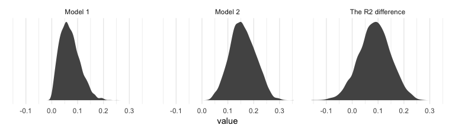
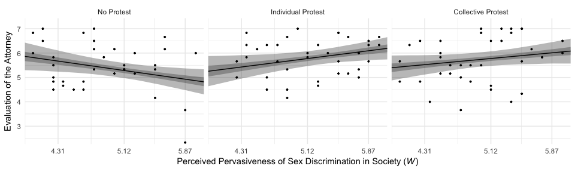
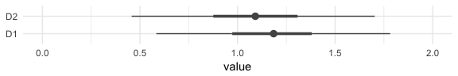
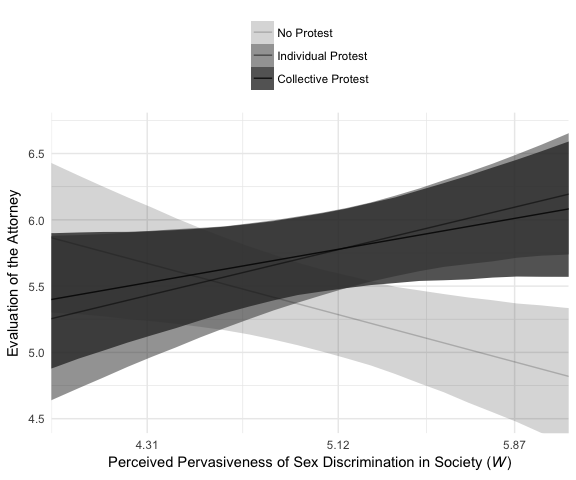
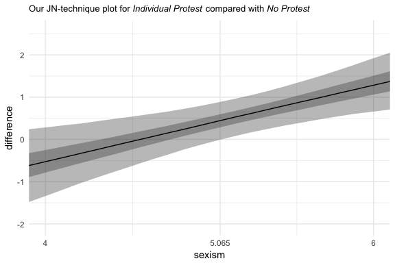
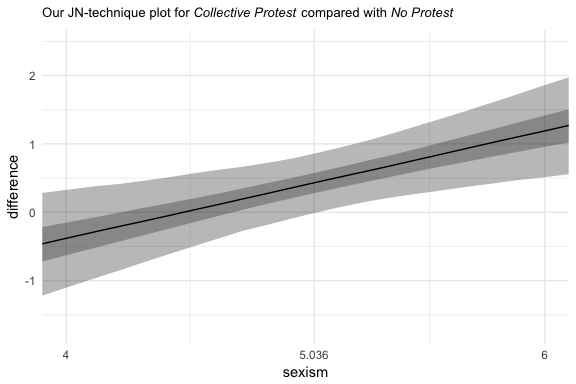
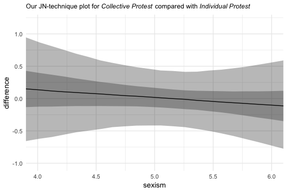
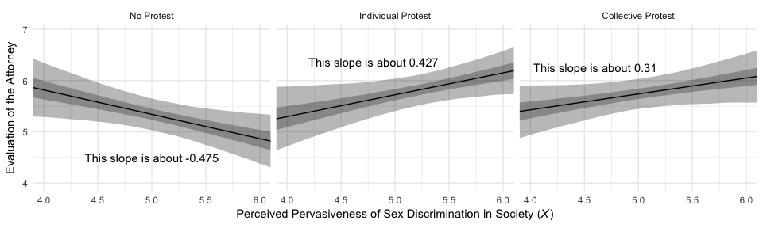

Chapter 10
================
A Solomon Kurz
2018-06-24

10.2 An example from the sex disrimination in the workplace study
-----------------------------------------------------------------

Here we load a couple necessary packages, load the data, and take a `glimpse()`.

``` r
library(readr)
library(tidyverse)

protest <- read_csv("data/protest/protest.csv")

glimpse(protest)
```

    ## Observations: 129
    ## Variables: 6
    ## $ subnum   <int> 209, 44, 124, 232, 30, 140, 27, 64, 67, 182, 85, 109, 122, 69, 45, 28, 170, 66...
    ## $ protest  <int> 2, 0, 2, 2, 2, 1, 2, 0, 0, 0, 2, 2, 0, 1, 1, 0, 1, 2, 2, 1, 2, 1, 1, 2, 2, 0, ...
    ## $ sexism   <dbl> 4.87, 4.25, 5.00, 5.50, 5.62, 5.75, 5.12, 6.62, 5.75, 4.62, 4.75, 6.12, 4.87, ...
    ## $ angry    <int> 2, 1, 3, 1, 1, 1, 2, 1, 6, 1, 2, 5, 2, 1, 1, 1, 2, 1, 3, 4, 1, 1, 1, 5, 1, 5, ...
    ## $ liking   <dbl> 4.83, 4.50, 5.50, 5.66, 6.16, 6.00, 4.66, 6.50, 1.00, 6.83, 5.00, 5.66, 5.83, ...
    ## $ respappr <dbl> 4.25, 5.75, 4.75, 7.00, 6.75, 5.50, 5.00, 6.25, 3.00, 5.75, 5.25, 7.00, 4.50, ...

With a little `ifelse()`, computing the dummies `D1` and `D2` is easy enough.

``` r
protest <-
  protest %>% 
  mutate(D1 = ifelse(protest == 1, 1, 0),
         D2 = ifelse(protest == 2, 1, 0))
```

With `model1` and `model2` we fit the multicategorical multivariable model and the multicategorical moderation models, respectively.

``` r
library(brms)

model1 <-
  brm(data = protest, family = gaussian,
      liking ~ 1 + D1 + D2 + sexism,
      chains = 4, cores = 4)

model2 <-
  update(model1,
         newdata = protest,
         liking ~ 1 + D1 + D2 + sexism + D1:sexism + D2:sexism,
         chains = 4, cores = 4)
```

``` r
r2s <-
  bayes_R2(model1, summary = F) %>% 
  as_tibble() %>% 
  rename(`Model 1` = R2) %>% 
  bind_cols(
    bayes_R2(model2, summary = F) %>% 
      as_tibble() %>% 
      rename(`Model 2` = R2)
  ) %>% 
  mutate(`The R2 difference` = `Model 2` - `Model 1`)
  
r2s %>% 
  gather()  %>% 
  # This line isn't necessary, but it sets the order the summaries appear in
  mutate(key = factor(key, levels = c("Model 1", "Model 2", "The R2 difference"))) %>% 
  group_by(key) %>% 
  summarize(mean = mean(value),
            median = median(value),
            ll = quantile(value, probs = .025),
            ul = quantile(value,  probs = .975)) %>% 
  mutate_if(is.double, round, digits = 3)
```

    ## # A tibble: 3 x 5
    ##   key                 mean median      ll    ul
    ##   <fctr>             <dbl>  <dbl>   <dbl> <dbl>
    ## 1 Model 1           0.0700 0.0660  0.0110 0.153
    ## 2 Model 2           0.158  0.155   0.0680 0.255
    ## 3 The R2 difference 0.0870 0.0880 -0.0350 0.205

Interestingly, even though our posterior means and medians for the model-specific *R*<sup>2</sup> values differed some from the OLS estimates in the text, their difference corresponded quite nicely to the one in the text. Let's take a look at their values.

``` r
r2s %>% 
  gather() %>% 
  ggplot(aes(x = value)) +
  geom_density(size = 0, fill = "grey33") +
  scale_y_continuous(NULL, breaks = NULL) +
  facet_wrap(~key, scales = "free_y") +
  theme_minimal()
```



The coefficient summaries cohere well with those in Table 10.1.

``` r
print(model1, digits = 3)
```

    ##  Family: gaussian 
    ##   Links: mu = identity; sigma = identity 
    ## Formula: liking ~ 1 + D1 + D2 + sexism 
    ##    Data: protest (Number of observations: 129) 
    ## Samples: 4 chains, each with iter = 2000; warmup = 1000; thin = 1;
    ##          total post-warmup samples = 4000
    ## 
    ## Population-Level Effects: 
    ##           Estimate Est.Error l-95% CI u-95% CI Eff.Sample  Rhat
    ## Intercept    4.764     0.633    3.492    5.999       4000 0.999
    ## D1           0.493     0.232    0.032    0.953       4000 1.000
    ## D2           0.442     0.228    0.001    0.890       4000 1.001
    ## sexism       0.109     0.120   -0.121    0.344       4000 0.999
    ## 
    ## Family Specific Parameters: 
    ##       Estimate Est.Error l-95% CI u-95% CI Eff.Sample  Rhat
    ## sigma    1.044     0.066    0.925    1.182       4000 1.000
    ## 
    ## Samples were drawn using sampling(NUTS). For each parameter, Eff.Sample 
    ## is a crude measure of effective sample size, and Rhat is the potential 
    ## scale reduction factor on split chains (at convergence, Rhat = 1).

``` r
print(model2, digits = 3)
```

    ##  Family: gaussian 
    ##   Links: mu = identity; sigma = identity 
    ## Formula: liking ~ D1 + D2 + sexism + D1:sexism + D2:sexism 
    ##    Data: protest (Number of observations: 129) 
    ## Samples: 4 chains, each with iter = 2000; warmup = 1000; thin = 1;
    ##          total post-warmup samples = 4000
    ## 
    ## Population-Level Effects: 
    ##           Estimate Est.Error l-95% CI u-95% CI Eff.Sample  Rhat
    ## Intercept    7.718     1.042    5.646    9.704       1216 1.001
    ## D1          -4.128     1.506   -7.199   -1.216       1166 1.001
    ## D2          -3.530     1.409   -6.275   -0.763       1273 1.003
    ## sexism      -0.475     0.203   -0.868   -0.068       1221 1.002
    ## D1:sexism    0.902     0.287    0.340    1.484       1166 1.002
    ## D2:sexism    0.786     0.276    0.248    1.325       1301 1.003
    ## 
    ## Family Specific Parameters: 
    ##       Estimate Est.Error l-95% CI u-95% CI Eff.Sample  Rhat
    ## sigma    1.007     0.066    0.894    1.144       2586 1.000
    ## 
    ## Samples were drawn using sampling(NUTS). For each parameter, Eff.Sample 
    ## is a crude measure of effective sample size, and Rhat is the potential 
    ## scale reduction factor on split chains (at convergence, Rhat = 1).

10.3 Visualizing the model
--------------------------

To get our version of the values in Table 10.2, we'll first recreate columns *D<sub>1</sub>* through *W* (SEXISM) and save then as a tibble, `nd`.

``` r
(
  nd <-
  tibble(D1 = rep(c(0, 1, 0), each = 3),
         D2 = rep(c(0, 0, 1), each = 3),
         sexism = rep(quantile(protest$sexism, probs = c(.16, .5, .84)), 
                      times = 3))
  )
```

    ## # A tibble: 9 x 3
    ##      D1    D2 sexism
    ##   <dbl> <dbl>  <dbl>
    ## 1  0     0      4.31
    ## 2  0     0      5.12
    ## 3  0     0      5.87
    ## 4  1.00  0      4.31
    ## 5  1.00  0      5.12
    ## 6  1.00  0      5.87
    ## 7  0     1.00   4.31
    ## 8  0     1.00   5.12
    ## 9  0     1.00   5.87

With `nd` in hand, we'll feed the predictor values into `fitted()` for the typical posterior summaries.

``` r
fitted(model2, newdata = nd) %>% round(digits = 3)
```

    ##       Estimate Est.Error  Q2.5 Q97.5
    ##  [1,]    5.671     0.222 5.239 6.107
    ##  [2,]    5.285     0.160 4.973 5.596
    ##  [3,]    4.929     0.229 4.483 5.371
    ##  [4,]    5.428     0.247 4.954 5.915
    ##  [5,]    5.775     0.154 5.467 6.079
    ##  [6,]    6.095     0.200 5.711 6.486
    ##  [7,]    5.526     0.203 5.119 5.912
    ##  [8,]    5.778     0.152 5.477 6.073
    ##  [9,]    6.011     0.221 5.568 6.449

But is we want to make a decent line plot, we'll need many more values for `sexism`, which will appear on the x-axis.

``` r
nd <-
  tibble(sexism = rep(seq(from = 3.5, to = 6.5, length.out = 30), 
                      times = 9),
         D1 = rep(rep(c(0, 1, 0), each = 3),
                  each = 30),
         D2 = rep(rep(c(0, 0, 1), each = 3),
                  each = 30))
```

This time we'll save the results from `fitted()` as a tlbble and wrangle a bit to get ready for Figure 10.3.

``` r
model2_fitted <- 
  fitted(model2, newdata = nd, probs = c(.025, .25, .75, .975)) %>% 
  as_tibble() %>% 
  bind_cols(nd) %>% 
  mutate(condition = rep(c("No Protest", "Individual Protest", "Collective Protest"),
                         each = 3*30)) %>% 
  # This line is not necessary, but it will help order the facets of the plot
  mutate(condition = factor(condition, levels = c("No Protest", "Individual Protest", "Collective Protest"))) 

glimpse(model2_fitted)
```

    ## Observations: 270
    ## Variables: 10
    ## $ Estimate  <dbl> 6.054889, 6.005726, 5.956562, 5.907398, 5.858234, 5.809071, 5.759907, 5.71074...
    ## $ Est.Error <dbl> 0.3563523, 0.3377031, 0.3193489, 0.3013436, 0.2837537, 0.2666615, 0.2501688, ...
    ## $ Q2.5      <dbl> 5.346329, 5.332224, 5.323433, 5.315942, 5.298342, 5.288724, 5.271949, 5.25070...
    ## $ Q25       <dbl> 5.814302, 5.779419, 5.738434, 5.701776, 5.664781, 5.626923, 5.586934, 5.54867...
    ## $ Q75       <dbl> 6.292780, 6.229897, 6.167536, 6.106784, 6.045609, 5.985302, 5.924930, 5.86752...
    ## $ Q97.5     <dbl> 6.748393, 6.667239, 6.582097, 6.502161, 6.417319, 6.332666, 6.250131, 6.16962...
    ## $ sexism    <dbl> 3.500000, 3.603448, 3.706897, 3.810345, 3.913793, 4.017241, 4.120690, 4.22413...
    ## $ D1        <dbl> 0, 0, 0, 0, 0, 0, 0, 0, 0, 0, 0, 0, 0, 0, 0, 0, 0, 0, 0, 0, 0, 0, 0, 0, 0, 0,...
    ## $ D2        <dbl> 0, 0, 0, 0, 0, 0, 0, 0, 0, 0, 0, 0, 0, 0, 0, 0, 0, 0, 0, 0, 0, 0, 0, 0, 0, 0,...
    ## $ condition <fctr> No Protest, No Protest, No Protest, No Protest, No Protest, No Protest, No P...

For Figure 10.3 and many to follow for this chapter, we'll superimpose 50% intervals on top of 95% intervals.

``` r
# This will help us add the original data points to the plot
protest <-
  protest %>% 
  mutate(condition = ifelse(protest == 0, "No Protest",
                            ifelse(protest == 1, "Individual Protest", 
                                   "Collective Protest"))) %>% 
  mutate(condition = factor(condition, levels = c("No Protest", "Individual Protest", "Collective Protest"))) 
  

# This will help us with the x-axis
breaks <-
  tibble(values = quantile(protest$sexism, probs = c(.16, .5, .84))) %>% 
  mutate(labels = values %>% round(2) %>% as.character())

# Here we plot
model2_fitted %>% 
  ggplot(aes(x = sexism)) +
  geom_ribbon(aes(ymin = Q2.5, ymax = Q97.5),
              alpha = 1/3) +
  geom_ribbon(aes(ymin = Q25, ymax = Q75),
              alpha = 1/3) +
  geom_line(aes(y = Estimate)) +
  geom_point(data = protest,
             aes(y = liking),
             size = 2/3) +
  scale_x_continuous(breaks = breaks$values,
                     labels = breaks$labels) +
  coord_cartesian(xlim = 4:6,
                  ylim = c(2.5, 7.2)) +
  labs(x = expression(paste("Perceived Pervasiveness of Sex Discrimination in Society (", italic(W), ")")),
       y = "Evaluation of the Attorney") +
  facet_wrap(~condition) +
  theme_minimal()
```



By adding the data to the plots, they are both more informative and now serve as a posterior predictive check.

Probing the interaction
-----------------------

### The pick-a-point approach.

#### Omnibus inference.

Hayes used the omnibus testing framework to assess how important coefficients *b*<sub>1</sub> and *b*<sub>2</sub> were to our interaction model, `model1`. Before fitting the models, he discussed why he preferred to fit models after centering `sexism` (i.e., *W*) to 4.25. Here we'll call our centered variable `sexism_p`, where `_p` stands in for "prime".

``` r
protest <-
  protest %>% 
  mutate(sexism_p = sexism - 4.25)
```

From here on, `model3` is the moderation model without the lower-order `D1` and `D2` terms; `model4` is the full moderation model.

``` r
# The model without D1 + D2
model3 <-
  update(model2,
         newdata = protest,
         liking ~ 1 + sexism_p + D1:sexism_p + D2:sexism_p,
         chains = 4, cores = 4)

# The full model with D1 + D2
model4 <-
  update(model2,
         newdata = protest,
         liking ~ 1 + D1 + D2 + sexism_p + D1:sexism_p + D2:sexism_p,
         chains = 4, cores = 4)
```

The coefficient summaries for `model4` correspond to the top section of Table 10.3 (p. 373).

``` r
fixef(model4) %>% round(digits = 3)
```

    ##             Estimate Est.Error   Q2.5  Q97.5
    ## Intercept      5.698     0.224  5.265  6.150
    ## D1            -0.293     0.347 -0.986  0.420
    ## D2            -0.184     0.307 -0.798  0.422
    ## sexism_p      -0.473     0.208 -0.892 -0.062
    ## D1:sexism_p    0.897     0.294  0.297  1.478
    ## D2:sexism_p    0.780     0.278  0.228  1.334

We can compare their Bayesian *R*<sup>2</sup> distributions like we usually do.

``` r
r2s <-
  bayes_R2(model3, summary = F) %>% 
  as_tibble() %>% 
  rename(`Model without D1 + D2` = R2) %>% 
  bind_cols(
    bayes_R2(model4, summary = F) %>% 
      as_tibble() %>% 
      rename(`Model with D1 + D2` = R2)
  ) %>% 
  mutate(`The R2 difference` = `Model with D1 + D2` - `Model without D1 + D2`)
  
r2s %>% 
  gather() %>% 
  mutate(key = factor(key, levels = c("Model without D1 + D2", "Model with D1 + D2", "The R2 difference"))) %>% 
  group_by(key) %>% 
  summarize(median = median(value),
            ll = quantile(value, probs = .025),
            ul = quantile(value,  probs = .975)) %>% 
  mutate_if(is.double, round, digits = 3)
```

    ## # A tibble: 3 x 4
    ##   key                   median      ll    ul
    ##   <fctr>                 <dbl>   <dbl> <dbl>
    ## 1 Model without D1 + D2 0.137   0.0500 0.240
    ## 2 Model with D1 + D2    0.154   0.0620 0.257
    ## 3 The R2 difference     0.0170 -0.117  0.159

Our results differ a bit from those in the text, but the substantive interpretation is the same. The `D1` and `D2` parameters added little predictive power to the model in terms of *R*<sup>2</sup>. We can also use information criteria to compare the models. Here are the results from using the LOO-CV.

``` r
loo(model3, model4,
    reloo = T)
```

    ##                  LOOIC    SE
    ## model3          371.81 22.08
    ## model4          374.70 21.84
    ## model3 - model4  -2.89  1.70

\[When I ran the `loo()` without the `reloo` argument, I got a warning message about an observation with an overly-large pareto *k* value. Setting `reloo = T` fixed the problem.\]

The LOO-CV difference between the two models was pretty small and its standard error was of about the same magnitude of its difference. Thus, the LOO-CV gives the same general message as the *R*<sup>2</sup>. The `D1` and `D2` parameters were sufficiently small and uncertain enough that constraining them to zero did little in terms of reducing the explanatory power of the statistical model.

Here's the same thing all over again, but this time after centering `sexism` on 5.120.

``` r
protest <-
  protest %>% 
  mutate(sexism_p = sexism - 5.120)

# The model without D1 + D2
model3 <-
  update(model2,
         newdata = protest,
         liking ~ 1 + sexism_p + D1:sexism_p + D2:sexism_p,
         chains = 4, cores = 4)

# The full model with D1 + D2
model4 <-
  update(model2,
         newdata = protest,
         liking ~ 1 + D1 + D2 + sexism_p + D1:sexism_p + D2:sexism_p,
         chains = 4, cores = 4)
```

These coefficient summaries correspond to the middle section of Table 10.3 (p. 373).

``` r
fixef(model4) %>% round(digits = 3)
```

    ##             Estimate Est.Error   Q2.5  Q97.5
    ## Intercept      5.290     0.161  4.965  5.603
    ## D1             0.483     0.223  0.056  0.927
    ## D2             0.491     0.223  0.061  0.932
    ## sexism_p      -0.466     0.211 -0.876 -0.053
    ## D1:sexism_p    0.900     0.298  0.313  1.479
    ## D2:sexism_p    0.768     0.281  0.228  1.318

Here are the Bayesian *R*<sup>2</sup> summaries and the summary for their difference.

``` r
r2s <-
  bayes_R2(model3, summary = F) %>% 
  as_tibble() %>% 
  rename(`Model without D1 + D2` = R2) %>% 
  bind_cols(
    bayes_R2(model4, summary = F) %>% 
      as_tibble() %>% 
      rename(`Model with D1 + D2` = R2)
  ) %>% 
  mutate(`The R2 difference` = `Model with D1 + D2` - `Model without D1 + D2`)
  
r2s %>% 
  gather() %>% 
  mutate(key = factor(key, levels = c("Model without D1 + D2", "Model with D1 + D2", "The R2 difference"))) %>% 
  group_by(key) %>% 
  summarize(median = median(value),
            ll = quantile(value, probs = .025),
            ul = quantile(value,  probs = .975)) %>% 
  mutate_if(is.double, round, digits = 3)
```

    ## # A tibble: 3 x 4
    ##   key                   median      ll    ul
    ##   <fctr>                 <dbl>   <dbl> <dbl>
    ## 1 Model without D1 + D2 0.102   0.0280 0.195
    ## 2 Model with D1 + D2    0.154   0.0640 0.257
    ## 3 The R2 difference     0.0510 -0.0780 0.179

``` r
loo(model3, model4)
```

    ##                  LOOIC    SE
    ## model3          377.24 23.73
    ## model4          375.09 21.81
    ## model3 - model4   2.15  5.94

Here again our Bayesian *R*<sup>2</sup> and `loo()` results cohere, both suggesting the `D1` and `D2` parameters were of little predictive utility. Note how this differs a little from the second *F*-test on page 370.

Here's what happens when we center `sexism` on 5.896.

``` r
protest <-
  protest %>% 
  mutate(sexism_p = sexism - 5.896)

# The model without D1 + D2
model3 <-
  update(model2,
         newdata = protest,
         liking ~ 1 + sexism_p + D1:sexism_p + D2:sexism_p,
         chains = 4, cores = 4)

# The full model with D1 + D2
model4 <-
  update(model2,
         newdata = protest,
         liking ~ 1 + D1 + D2 + sexism_p + D1:sexism_p + D2:sexism_p,
         chains = 4, cores = 4)
```

These coefficient summaries correspond to the lower section of Table 10.3 (p. 373).

``` r
fixef(model4) %>% round(digits = 3)
```

    ##             Estimate Est.Error   Q2.5  Q97.5
    ## Intercept      4.924     0.229  4.474  5.382
    ## D1             1.180     0.306  0.584  1.782
    ## D2             1.090     0.318  0.457  1.703
    ## sexism_p      -0.468     0.208 -0.868 -0.055
    ## D1:sexism_p    0.894     0.294  0.304  1.461
    ## D2:sexism_p    0.773     0.275  0.218  1.319

Again, the *R*<sup>2</sup> distributions and their difference-score distribution.

``` r
r2s <-
  bayes_R2(model3, summary = F) %>% 
  as_tibble() %>% 
  rename(`Model without D1 + D2` = R2) %>% 
  bind_cols(
    bayes_R2(model4, summary = F) %>% 
      as_tibble() %>% 
      rename(`Model with D1 + D2` = R2)
  ) %>% 
  mutate(`The R2 difference` = `Model with D1 + D2` - `Model without D1 + D2`)
  
r2s %>% 
  gather() %>% 
  mutate(key = factor(key, levels = c("Model without D1 + D2", "Model with D1 + D2", "The R2 difference"))) %>% 
  group_by(key) %>% 
  summarize(median = median(value),
            ll = quantile(value, probs = .025),
            ul = quantile(value,  probs = .975)) %>% 
  mutate_if(is.double, round, digits = 3)
```

    ## # A tibble: 3 x 4
    ##   key                   median      ll     ul
    ##   <fctr>                 <dbl>   <dbl>  <dbl>
    ## 1 Model without D1 + D2 0.0270 0.00300 0.0940
    ## 2 Model with D1 + D2    0.154  0.0670  0.250 
    ## 3 The R2 difference     0.123  0.0160  0.225

``` r
loo(model3, model4)
```

    ##                  LOOIC    SE
    ## model3          387.46 26.55
    ## model4          374.73 21.83
    ## model3 - model4  12.72 10.93

Although our Bayesian *R*<sup>2</sup> difference is now predominantly positive, the LOO-CV difference for the two models remains uncertain. Here's a look at the two parameters in question using a handmade coefficient plot.

``` r
posterior_samples(model4) %>% 
  select(b_D1:b_D2) %>% 
  gather() %>% 
  mutate(key = str_remove(key, "b_")) %>% 
  
  ggplot(aes(key, y = value)) +
  stat_summary(fun.y = median,
               fun.ymin = function(i){quantile(i, probs = .025)},
               fun.ymax = function(i){quantile(i, probs = .975)},
               color = "grey33") +
  stat_summary(geom = "linerange",
               fun.ymin = function(i){quantile(i, probs = .25)},
               fun.ymax = function(i){quantile(i, probs = .75)},
               color = "grey33",
               size = 1.25) +
  xlab(NULL) +
  coord_flip(ylim = 0:2) +
  theme_minimal()
```



For Figure 10.4, we'll drop our faceting approach and just make one big plot. Heads up: I'm going to drop the 50% intervals from this plot. They'd just make it too busy.

``` r
model2_fitted %>% 
  ggplot(aes(x = sexism, alpha = condition)) +
  geom_ribbon(aes(ymin = Q2.5, ymax = Q97.5),
              size = 0) +
  geom_line(aes(y = Estimate)) +
  scale_alpha_manual(values = c(.2, .5, .8)) +
  scale_x_continuous(breaks = breaks$values,
                     labels = breaks$labels) +
  coord_cartesian(xlim = 4:6,
                  ylim = c(4.5, 6.7)) +
  labs(x = expression(paste("Perceived Pervasiveness of Sex Discrimination in Society (", italic(W), ")")),
       y = "Evaluation of the Attorney") +
  theme_minimal() +
  theme(legend.title = element_blank(),
        legend.position = "top",
        legend.direction = "vertical")
```



#### Pairwise inference.

To "consider the effect of Catherine's behavior on how she is perceived among people who are relatively high in their perceptions of the pervasiveness of sex discrimination in society (p. 372)", we'll use `fitted()`. Since the number of unique predictor values is small for this example, we'll just plug them directly into the `newdata` argument rather than first saving them as a `nd` object.

``` r
fitted(model2,
       newdata = tibble(D1 = c(0, 1, 0),
                        D2 = c(0, 0, 1),
                        sexism = 5.896)) %>% 
  round(digits = 3)
```

    ##      Estimate Est.Error  Q2.5 Q97.5
    ## [1,]    4.916     0.232 4.463 5.366
    ## [2,]    6.106     0.204 5.717 6.504
    ## [3,]    6.019     0.225 5.571 6.463

Note that for these analyses, we just used `model2`, the model based on the un-centered `sexism` variable. We can also continue using `fitted()` in conjunction with the original `model2` to get the group comparisons for when *W* = 4.250. Since these involve computing difference scores, we'll have to use `summary = F` and do some wrangling.

``` r
fitted(model2,
       newdata = tibble(D1 = c(0, 1, 0),
                        D2 = c(0, 0, 1),
                        sexism = 4.25),
       summary = F) %>% 
  as_tibble() %>% 
  rename(`No Protest` = V1, 
         `Individual Protest` = V2,
         `Collective Protest` = V3) %>% 
  mutate(difference_a = `Individual Protest` - `No Protest`,
         difference_b = `Collective Protest` - `No Protest`) %>% 
  gather() %>% 
  mutate(key = factor(key, levels = c("No Protest", "Individual Protest", "Collective Protest", 
                                      "difference_a", "difference_b"))) %>% 
  group_by(key) %>% 
  summarize(mean = mean(value),
            sd = sd(value),
            ll = quantile(value, probs = .025),
            ul = quantile(value, probs = .975)) %>% 
  mutate_if(is.double, round, digits = 3)
```

    ## # A tibble: 5 x 5
    ##   key                  mean    sd     ll    ul
    ##   <fctr>              <dbl> <dbl>  <dbl> <dbl>
    ## 1 No Protest          5.70  0.231  5.25  6.15 
    ## 2 Individual Protest  5.40  0.256  4.91  5.91 
    ## 3 Collective Protest  5.51  0.211  5.09  5.91 
    ## 4 difference_a       -0.295 0.349 -0.988 0.392
    ## 5 difference_b       -0.191 0.313 -0.818 0.427

Here's the same thing for when *W* = 5.120.

``` r
fitted(model2,
       newdata = tibble(D1 = c(0, 1, 0),
                        D2 = c(0, 0, 1),
                        sexism = 5.120),
       summary = F) %>% 
  as_tibble() %>% 
  rename(`No Protest` = V1, 
         `Individual Protest` = V2,
         `Collective Protest` = V3) %>% 
  mutate(difference_a = `Individual Protest` - `No Protest`,
         difference_b = `Collective Protest` - `No Protest`) %>% 
  gather() %>% 
  mutate(key = factor(key, levels = c("No Protest", "Individual Protest", "Collective Protest", 
                                      "difference_a", "difference_b"))) %>% 
  group_by(key) %>% 
  summarize(mean = mean(value),
            sd = sd(value),
            ll = quantile(value, probs = .025),
            ul = quantile(value, probs = .975)) %>% 
  mutate_if(is.double, round, digits = 3)
```

    ## # A tibble: 5 x 5
    ##   key                 mean    sd     ll    ul
    ##   <fctr>             <dbl> <dbl>  <dbl> <dbl>
    ## 1 No Protest         5.28  0.160 4.97   5.60 
    ## 2 Individual Protest 5.78  0.154 5.47   6.08 
    ## 3 Collective Protest 5.78  0.152 5.48   6.07 
    ## 4 difference_a       0.490 0.226 0.0470 0.932
    ## 5 difference_b       0.493 0.222 0.0540 0.925

Finally, here it is for when *W* = 5.986.

``` r
fitted(model2,
       newdata = tibble(D1 = c(0, 1, 0),
                        D2 = c(0, 0, 1),
                        sexism = 5.986),
       summary = F) %>% 
  as_tibble() %>% 
  rename(`No Protest` = V1, 
         `Individual Protest` = V2,
         `Collective Protest` = V3) %>% 
  mutate(difference_a = `Individual Protest` - `No Protest`,
         difference_b = `Collective Protest` - `No Protest`) %>% 
  gather() %>% 
  mutate(key = factor(key, levels = c("No Protest", "Individual Protest", "Collective Protest", 
                                      "difference_a", "difference_b"))) %>% 
  group_by(key) %>% 
  summarize(mean = mean(value),
            sd = sd(value),
            ll = quantile(value, probs = .025),
            ul = quantile(value, probs = .975)) %>% 
  mutate_if(is.double, round, digits = 3)
```

    ## # A tibble: 5 x 5
    ##   key                 mean    sd    ll    ul
    ##   <fctr>             <dbl> <dbl> <dbl> <dbl>
    ## 1 No Protest          4.87 0.246 4.39   5.35
    ## 2 Individual Protest  6.14 0.217 5.73   6.57
    ## 3 Collective Protest  6.05 0.238 5.57   6.52
    ## 4 difference_a        1.27 0.323 0.651  1.90
    ## 5 difference_b        1.17 0.339 0.508  1.84

### The Johnson-Neyman technique.

#### Omnibus inference.

Consider the first sentence of the section:

> Applied to probing an interaction between a multicategorical *X* and a continuous *W*, an omnibus version of the JM technique involves finding the value or values of *W* where their *F*-ratio comparing the *g* estimated values of *Y* is just statistically significant.

Since we're not using *F*-tests with our approach to Bayesian modeling, the closest we might have is a series of *R*<sup>2</sup> difference tests, which would require refitting the model multiple times over many ways of centering the *W*-variable, `sexism`. I suppose you could do this if you wanted, but it just seems silly, to me. I'll leave this one up to the interested reader.

#### Pairwise inference.

Hayes didn't make plots for this section, but if you're careful constructing your `nd` and with the subsequent wrangling, you can make the usual plots. Since we have two conditions we'd like to compare with *No Protest*, we'll make two plots. Here's the comparison using *Individual Protest*, first.

``` r
# the transition value Hayes identified in the text
Hayes_value <- 5.065

nd <-
  tibble(D1 = rep(0:1, each = 30),
         D2 = rep(0, times = 30*2),
         sexism = rep(seq(from = 3.5, to = 6.5, length.out = 30), 
                      times = 2))

# we need some new data
fitted(model2,
       newdata = nd,
       summary = F) %>% 
  as_tibble() %>% 
  gather() %>% 
  mutate(sexism = rep(rep(seq(from = 3.5, to = 6.5, length.out = 30), 
                          each = 4000),
                      times = 2)) %>% 
  mutate(condition = rep(c("No Protest", "Individual Protest"),
                         each = 4000*30)) %>% 
  mutate(iter = rep(1:4000, times = 30*2)) %>% 
  select(-key) %>% 
  rename(estimate = value) %>% 
  spread(key = condition, value = estimate) %>% 
  mutate(difference = `Individual Protest` - `No Protest`) %>% 
  
  # the plot
  ggplot(aes(x = sexism, y = difference)) +
  stat_summary(geom = "ribbon",
               fun.ymin = function(i){quantile(i, probs = .025)},
               fun.ymax = function(i){quantile(i, probs = .975)},
               alpha = 1/3) +
  stat_summary(geom = "ribbon",
               fun.ymin = function(i){quantile(i, probs = .25)},
               fun.ymax = function(i){quantile(i, probs = .75)},
               alpha = 1/3) +
  stat_summary(geom = "line",
               fun.y = median) +
  scale_x_continuous(breaks = c(4, Hayes_value, 6),
                     labels = c("4", Hayes_value, "6")) +
  coord_cartesian(xlim = 4:6) +
  labs(subtitle = expression(paste("Our JN-technique plot for ", italic("Individual Protest"), " compared with ", italic("No Protest")))) +
  theme_minimal()
```



Now we're ready to compare *No Protest* to *Collective Protest*. The main difference is with the `rep()` code in the `D1` and `D2` columns in `nd`. Other than that, we just switched out a few "Individual" labels with "Collective".

``` r
# the transition value Hayes identified in the text
Hayes_value <- 5.036

nd <-
  tibble(D1 = rep(0, times = 30*2),
         D2 = rep(0:1, each = 30),
         sexism = rep(seq(from = 3.5, to = 6.5, length.out = 30), 
                      times = 2))

fitted(model2,
       newdata = nd,
       summary = F) %>% 
  as_tibble() %>% 
  gather() %>% 
  mutate(sexism = rep(rep(seq(from = 3.5, to = 6.5, length.out = 30), 
                          each = 4000),
                      times = 2)) %>% 
  mutate(condition = rep(c("No Protest", "Collective Protest"),
                         each = 4000*30)) %>% 
  mutate(iter = rep(1:4000, times = 30*2)) %>% 
  select(-key) %>% 
  rename(estimate = value) %>% 
  spread(key = condition, value = estimate) %>% 
  mutate(difference = `Collective Protest` - `No Protest`) %>% 

  ggplot(aes(x = sexism, y = difference)) +
  stat_summary(geom = "ribbon",
               fun.ymin = function(i){quantile(i, probs = .025)},
               fun.ymax = function(i){quantile(i, probs = .975)},
               alpha = 1/3) +
  stat_summary(geom = "ribbon",
               fun.ymin = function(i){quantile(i, probs = .25)},
               fun.ymax = function(i){quantile(i, probs = .75)},
               alpha = 1/3) +
  stat_summary(geom = "line",
               fun.y = median) +
  scale_x_continuous(breaks = c(4, Hayes_value, 6),
                     labels = c("4", Hayes_value, "6")) +
  coord_cartesian(xlim = 4:6) +
  labs(subtitle = expression(paste("Our JN-technique plot for ", italic("Collective Protest"), " compared with ", italic("No Protest")))) +
  theme_minimal()
```



And here we do it one last time between the two active protest conditions.

``` r
nd <-
  tibble(D1 = rep(1:0, each = 30),
         D2 = rep(0:1, each = 30),
         sexism = rep(seq(from = 3.5, to = 6.5, length.out = 30), 
                      times = 2))

fitted(model2,
       newdata = nd,
       summary = F) %>% 
  as_tibble() %>% 
  gather() %>% 
  mutate(sexism = rep(rep(seq(from = 3.5, to = 6.5, length.out = 30), 
                          each = 4000),
                      times = 2)) %>% 
  mutate(condition = rep(c("Individual Protest", "Collective Protest"),
                         each = 4000*30)) %>% 
  mutate(iter = rep(1:4000, times = 30*2)) %>% 
  select(-key) %>% 
  rename(estimate = value) %>% 
  spread(key = condition, value = estimate) %>% 
  mutate(difference = `Collective Protest` - `Individual Protest`) %>% 
  
  ggplot(aes(x = sexism, y = difference)) +
  stat_summary(geom = "ribbon",
               fun.ymin = function(i){quantile(i, probs = .025)},
               fun.ymax = function(i){quantile(i, probs = .975)},
               alpha = 1/3) +
  stat_summary(geom = "ribbon",
               fun.ymin = function(i){quantile(i, probs = .25)},
               fun.ymax = function(i){quantile(i, probs = .75)},
               alpha = 1/3) +
  stat_summary(geom = "line",
               fun.y = median) +
  coord_cartesian(xlim = 4:6) +
  labs(subtitle = expression(paste("Our JN-technique plot for ", italic("Collective Protest"), " compared with ", italic("Individual Protest")))) +
  theme_minimal()
```



Not much difference there.

When the moderator is multicategorical
--------------------------------------

Just as a refresher, here's the `print()` output for `model2`.

``` r
print(model2, digits = 3)
```

    ##  Family: gaussian 
    ##   Links: mu = identity; sigma = identity 
    ## Formula: liking ~ D1 + D2 + sexism + D1:sexism + D2:sexism 
    ##    Data: protest (Number of observations: 129) 
    ## Samples: 4 chains, each with iter = 2000; warmup = 1000; thin = 1;
    ##          total post-warmup samples = 4000
    ## 
    ## Population-Level Effects: 
    ##           Estimate Est.Error l-95% CI u-95% CI Eff.Sample  Rhat
    ## Intercept    7.718     1.042    5.646    9.704       1216 1.001
    ## D1          -4.128     1.506   -7.199   -1.216       1166 1.001
    ## D2          -3.530     1.409   -6.275   -0.763       1273 1.003
    ## sexism      -0.475     0.203   -0.868   -0.068       1221 1.002
    ## D1:sexism    0.902     0.287    0.340    1.484       1166 1.002
    ## D2:sexism    0.786     0.276    0.248    1.325       1301 1.003
    ## 
    ## Family Specific Parameters: 
    ##       Estimate Est.Error l-95% CI u-95% CI Eff.Sample  Rhat
    ## sigma    1.007     0.066    0.894    1.144       2586 1.000
    ## 
    ## Samples were drawn using sampling(NUTS). For each parameter, Eff.Sample 
    ## is a crude measure of effective sample size, and Rhat is the potential 
    ## scale reduction factor on split chains (at convergence, Rhat = 1).

The Bayesian *R*<sup>2</sup>:

``` r
bayes_R2(model2) %>% round(digits = 3)
```

    ##    Estimate Est.Error  Q2.5 Q97.5
    ## R2    0.158     0.049 0.068 0.255

And the *R*<sup>2</sup> difference between this and the model excluding the interaction terms:

``` r
bayes_R2(model1, summary = F) %>% 
  as_tibble() %>% 
  rename(`Model 1` = R2) %>% 
  bind_cols(
    bayes_R2(model2, summary = F) %>% 
      as_tibble() %>% 
      rename(`Model 2` = R2)
  ) %>% 
  transmute(difference = `Model 2` - `Model 1`) %>% 
  summarize(mean = mean(difference),
            ll = quantile(difference, probs = .025),
            ul = quantile(difference,  probs = .975)) %>% 
  mutate_if(is.double, round, digits = 3)
```

    ## # A tibble: 1 x 3
    ##     mean      ll    ul
    ##    <dbl>   <dbl> <dbl>
    ## 1 0.0870 -0.0350 0.205

Much like in the text, our Figure 10.7 is just a little different from what we did with Figure 10.3.

``` r
# This will help us with the `geom_text()` annotation
slopes <-
  tibble(slope = c(fixef(model2)["sexism", "Estimate"] + fixef(model2)["D1:sexism", "Estimate"],
                   fixef(model2)["sexism", "Estimate"] + fixef(model2)["D2:sexism", "Estimate"],
                   fixef(model2)["sexism", "Estimate"]),
         x = c(4.8, 4.6, 5),
         y = c(6.37, 6.25, 4.5),
         condition = c("Individual Protest", "Collective Protest", "No Protest")) %>% 
  mutate(label = str_c("This slope is about ", slope %>% round(digits = 3)),
         condition = factor(condition, levels = c("No Protest", "Individual Protest", "Collective Protest")))

# Here we plot
model2_fitted %>% 
  ggplot(aes(x = sexism)) +
  geom_ribbon(aes(ymin = Q2.5, ymax = Q97.5),
              alpha = 1/3) +
  geom_ribbon(aes(ymin = Q25, ymax = Q75),
              alpha = 1/3) +
  geom_line(aes(y = Estimate)) +
  geom_text(data = slopes,
            aes(x = x,
                y = y,
                label = label)) +
  coord_cartesian(xlim = 4:6) +
  labs(x = expression(paste("Perceived Pervasiveness of Sex Discrimination in Society (", italic(X), ")")),
       y = "Evaluation of the Attorney") +
  facet_wrap(~condition) +
  theme_minimal()
```



### Probing the interaction and interpreting the regression coefficients.

We computed the posterior means for the slopes when prepping for the figure, above. Here's how we might get more complete posterior summaries. Much like in the text, our Figure 10.7 is just a little different from what we did with Figure 10.3.

``` r
post <- 
  posterior_samples(model2) %>% 
  transmute(`No Protest` = b_sexism + `b_D1:sexism`*0 + `b_D2:sexism`*0,
            `Individual Protest` = b_sexism + `b_D1:sexism`*1 + `b_D2:sexism`*0,
            `Collective Protest` = b_sexism + `b_D1:sexism`*0 + `b_D2:sexism`*1)

post %>% 
  gather() %>% 
  mutate(key = factor(key, levels = c("No Protest", "Individual Protest", "Collective Protest"))) %>% 
  group_by(key) %>% 
  summarise(mean = mean(value),
            sd = sd(value),
            ll = quantile(value, probs = .025),
            ul = quantile(value, probs = .975)) %>% 
  mutate_if(is.double, round, digits = 3)
```

    ## # A tibble: 3 x 5
    ##   key                  mean    sd      ll      ul
    ##   <fctr>              <dbl> <dbl>   <dbl>   <dbl>
    ## 1 No Protest         -0.475 0.203 -0.868  -0.0680
    ## 2 Individual Protest  0.427 0.208  0.0170  0.830 
    ## 3 Collective Protest  0.310 0.191 -0.0520  0.691

Here are the differences among the three protest groups.

``` r
post %>% 
  transmute(`Individual Protest - No Protest` = `Individual Protest` - `No Protest`,
            `Collective Protest - No Protest` = `Collective Protest` - `No Protest`,
            `Individual Protest - Collective Protest` = `Individual Protest` - `Collective Protest`) %>% 
  gather() %>% 
  # again, not necessary, but useful for reordering the summaries
  mutate(key = factor(key, levels = c("Individual Protest - No Protest", "Collective Protest - No Protest", "Individual Protest - Collective Protest"))) %>% 
  group_by(key) %>% 
  summarise(mean = mean(value),
            sd = sd(value),
            ll = quantile(value, probs = .025),
            ul = quantile(value, probs = .975)) %>% 
  mutate_if(is.double, round, digits = 3)
```

    ## # A tibble: 3 x 5
    ##   key                                      mean    sd     ll    ul
    ##   <fctr>                                  <dbl> <dbl>  <dbl> <dbl>
    ## 1 Individual Protest - No Protest         0.902 0.287  0.340 1.48 
    ## 2 Collective Protest - No Protest         0.786 0.276  0.248 1.32 
    ## 3 Individual Protest - Collective Protest 0.116 0.284 -0.460 0.655

Note. The analyses in this document were done with:

-   R 3.4.4
-   RStudio 1.1.442
-   rmarkdown 1.9
-   tidyverse 1.2.1
-   readr 1.1.1
-   rstan 2.17.3
-   brms 2.3.2

Reference
---------

Hayes, A. F. (2018). *Introduction to mediation, moderation, and conditional process analysis: A regression-based approach.* (2nd ed.). New York, NY, US: The Guilford Press.
