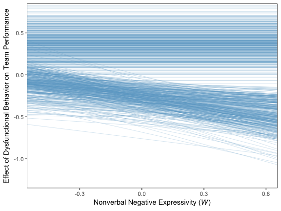
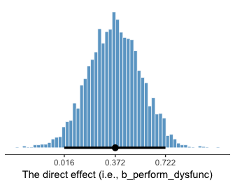
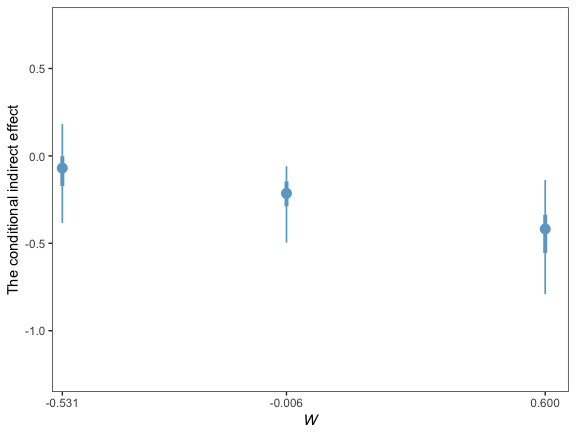

Chapter 11
================
A Solomon Kurz
2018-06-26

11.3 Example: Hiding your feelings from your work team
------------------------------------------------------

Here we load a couple necessary packages, load the data, and take a `glimpse()`.

``` r
library(readr)
library(tidyverse)

teams <- read_csv("data/teams/teams.csv")

glimpse(teams)
```

    ## Observations: 60
    ## Variables: 4
    ## $ dysfunc <dbl> -0.23, -0.13, 0.00, -0.33, 0.39, 1.02, -0.35, -0.23, 0.39, -0.08, -0.23, 0.09, ...
    ## $ negtone <dbl> -0.51, 0.22, -0.08, -0.11, -0.48, 0.72, -0.18, -0.13, 0.52, -0.26, 1.08, 0.53, ...
    ## $ negexp  <dbl> -0.49, -0.49, 0.84, 0.84, 0.17, -0.82, -0.66, -0.16, -0.16, -0.16, -0.16, 0.50,...
    ## $ perform <dbl> 0.12, 0.52, -0.08, -0.08, 0.12, 1.12, -0.28, 0.32, -1.08, -0.28, -1.08, -0.28, ...

Recall that we fit mediation models in brms using multivariate syntax. In previous attempts, we've defined and saved the model components outside of the `brm()` function and then plugged then into `brm()` using their identifier. Just to shake things up a bit, we'll just do all the steps right in `brm()`, this time.

``` r
library(brms)

model1 <-
  brm(data = teams, family = gaussian,
      bf(negtone ~ 1 + dysfunc) +
        bf(perform ~ 1 + dysfunc + negtone + negexp + negtone:negexp) + 
        set_rescor(FALSE),
      chains = 4, cores = 4)
```

``` r
print(model1, digits = 3)
```

    ##  Family: MV(gaussian, gaussian) 
    ##   Links: mu = identity; sigma = identity
    ##          mu = identity; sigma = identity 
    ## Formula: negtone ~ 1 + dysfunc 
    ##          perform ~ 1 + dysfunc + negtone + negexp + negtone:negexp 
    ##    Data: teams (Number of observations: 60) 
    ## Samples: 4 chains, each with iter = 2000; warmup = 1000; thin = 1;
    ##          total post-warmup samples = 4000
    ## 
    ## Population-Level Effects: 
    ##                        Estimate Est.Error l-95% CI u-95% CI Eff.Sample  Rhat
    ## negtone_Intercept         0.025     0.066   -0.102    0.152       4000 0.999
    ## perform_Intercept        -0.012     0.059   -0.133    0.104       4000 0.999
    ## negtone_dysfunc           0.622     0.178    0.277    0.974       4000 0.999
    ## perform_dysfunc           0.367     0.189   -0.011    0.740       4000 1.000
    ## perform_negtone          -0.437     0.138   -0.709   -0.173       4000 1.001
    ## perform_negexp           -0.018     0.121   -0.262    0.214       4000 0.999
    ## perform_negtone:negexp   -0.518     0.247   -1.004   -0.035       4000 0.999
    ## 
    ## Family Specific Parameters: 
    ##               Estimate Est.Error l-95% CI u-95% CI Eff.Sample  Rhat
    ## sigma_negtone    0.487     0.046    0.407    0.586       4000 1.000
    ## sigma_perform    0.459     0.045    0.380    0.556       4000 1.000
    ## 
    ## Samples were drawn using sampling(NUTS). For each parameter, Eff.Sample 
    ## is a crude measure of effective sample size, and Rhat is the potential 
    ## scale reduction factor on split chains (at convergence, Rhat = 1).

Our model summary coheres nicely with Table 11.1 and the formulas on page 409. Here are the *R*<sup>2</sup> distribution summaries.

``` r
bayes_R2(model1) %>% round(digits = 3)
```

    ##            Estimate Est.Error  Q2.5 Q97.5
    ## R2_negtone    0.194     0.081 0.042 0.353
    ## R2_perform    0.322     0.078 0.152 0.458

On page 410 we get two sample means. Here they are:

``` r
mean(teams$negexp) %>% round(digits = 3)
```

    ## [1] -0.008

``` r
mean(teams$perform) %>% round(digits = 3)
```

    ## [1] -0.032

For our Figure 11.4 and other similar figures in this chapter, we'll use spaghetti plots. Recall that with a spaghetti plots for linear models, we only need two values for the variable on the x-axis, rather than the typical 30+.

``` r
nd <-
  tibble(dysfunc = mean(teams$dysfunc),
         negtone = rep(c(-.8, .8), times = 3),
         negexp = rep(quantile(teams$negexp, probs = c(.16, .50, .84)),
                      each = 2))
```

Here's our Figure 11.4, which uses only the first 40 HMC iterations for the spaghetti-plot lines.

``` r
fitted(model1, 
       newdata = nd,
       resp = "perform", 
       summary = F) %>% 
  as_tibble() %>% 
  gather() %>% 
  mutate(iter = rep(1:4000, times = 2*3),
         negtone = rep(rep(c(-.8, .8), times = 3),
                       each = 4000),
         negexp = rep(rep(quantile(teams$negexp, probs = c(.16, .50, .84)),
                          each = 2),
                      each = 4000)) %>% 
  mutate(negexp = str_c("expresivity = ", negexp)) %>%
  mutate(negexp = factor(negexp, levels = c("expresivity = -0.49", "expresivity = -0.06", "expresivity = 0.6"))) %>% 
  filter(iter < 41) %>% 
  
  ggplot(aes(x = negtone, y = value, group = iter)) +
  geom_line(color = "skyblue3",
            size = 1/4) +
  coord_cartesian(xlim = c(-.5, .5),
                  ylim = c(-.6, .6)) +
  labs(x = expression(paste("Negative Tone of the Work Climate (", italic(M), ")")),
       y = "Team Performance") +
  theme_bw() +
  theme(panel.grid = element_blank(),
        strip.background = element_rect(color = "transparent", fill = "transparent")) +
  facet_wrap(~negexp)
```


Also, the plot theme in this chapter is a nod to [John Kruschke](http://www.indiana.edu/~kruschke/DoingBayesianDataAnalysis/).

### Quantifying and visualizing (conditional) indirect and direct effects.

#### The conditional indirect effect of *X*.

Here's how to get the posterior summaries corresponding to the last two columns in Table 11.2.

``` r
post <-
  posterior_samples(model1) %>% 
  mutate(`Conditional effect of M when W is -0.531` = b_perform_negtone + `b_perform_negtone:negexp`*-0.531,
            `Conditional effect of M when W is -0.006` = b_perform_negtone + `b_perform_negtone:negexp`*-0.060,
            `Conditional effect of M when W is 0.600` = b_perform_negtone + `b_perform_negtone:negexp`*0.600,
            
            `Conditional indirect effect when W is -0.531` = b_negtone_dysfunc*(b_perform_negtone + `b_perform_negtone:negexp`*-0.531),
            `Conditional indirect effect when W is -0.006` = b_negtone_dysfunc*(b_perform_negtone + `b_perform_negtone:negexp`*-0.060),
            `Conditional indirect effect when W is 0.600` = b_negtone_dysfunc*(b_perform_negtone + `b_perform_negtone:negexp`*0.600)) 

post %>% 
  select(starts_with("Conditional")) %>% 
  gather() %>% 
  mutate(key = factor(key, levels = c("Conditional effect of M when W is -0.531",
                                      "Conditional effect of M when W is -0.006",
                                      "Conditional effect of M when W is 0.600",
                                      
                                      "Conditional indirect effect when W is -0.531", 
                                      "Conditional indirect effect when W is -0.006",
                                      "Conditional indirect effect when W is 0.600"))) %>% 
  group_by(key) %>% 
  summarize(mean = mean(value),
            sd = sd(value),
            ll = quantile(value, probs = .025),
            ul = quantile(value, probs = .975)) %>% 
  mutate_if(is.double, round, digits = 3)
```

    ## # A tibble: 6 x 5
    ##   key                                            mean    sd     ll      ul
    ##   <fctr>                                        <dbl> <dbl>  <dbl>   <dbl>
    ## 1 Conditional effect of M when W is -0.531     -0.162 0.217 -0.601  0.255 
    ## 2 Conditional effect of M when W is -0.006     -0.406 0.143 -0.695 -0.136 
    ## 3 Conditional effect of M when W is 0.600      -0.748 0.169 -1.08  -0.406 
    ## 4 Conditional indirect effect when W is -0.531 -0.102 0.145 -0.429  0.158 
    ## 5 Conditional indirect effect when W is -0.006 -0.254 0.120 -0.518 -0.0580
    ## 6 Conditional indirect effect when W is 0.600  -0.466 0.173 -0.842 -0.166

#### The direct effect.

The direct effect for his model is `b_perform_dysfunc` in brms. Here's how to get it's summary values from `posterior_summary()`.

``` r
posterior_summary(model1)["b_perform_dysfunc", ] %>% round(digits = 3)
```

    ##  Estimate Est.Error      Q2.5     Q97.5 
    ##     0.367     0.189    -0.011     0.740

For Figure 11.7 we'll use the first 400 HMC iterations.

``` r
post <-
  post %>% 
  mutate(`-0.7` = b_negtone_dysfunc*(b_perform_negtone + `b_perform_negtone:negexp`*-0.7),
         `0.7` = b_negtone_dysfunc*(b_perform_negtone + `b_perform_negtone:negexp`*0.7))
  
post %>% 
  select(b_perform_dysfunc, `-0.7`:`0.7`) %>% 
  gather(key, value, -b_perform_dysfunc) %>% 
  mutate(negexp = key %>% as.double(),
         iter = rep(1:4000, times = 2)) %>% 
  filter(iter < 401) %>% 
  
  ggplot(aes(x = negexp, group = iter)) +
  geom_hline(aes(yintercept = b_perform_dysfunc),
             color = "skyblue3",
             size = .3, alpha = .3) +
  geom_line(aes(y = value),
            color = "skyblue3",
            size = .3, alpha = .3) +
  coord_cartesian(xlim = c(-.5, .6),
                  ylim = c(-1.25, .75)) +
  labs(x = expression(paste("Nonverbal Negative Expressivity (", italic(W), ")")),
       y = "Effect of Dysfunctional Behavior on Team Performance") +
  theme_bw() +
  theme(panel.grid = element_blank())
```



Since the `b_perform_dysfunc` values are constant across *W*, the individual HMC iterations end up perfectly parallel in the spaghetti plot. This is an example of a visualization I'd avoid making with a spaghetti plot for a professional presentation. But hopefully it has some pedagogical value, here.

11.6 Statistical inference
--------------------------

### Inference about the direct effect.

We've already seen the 95% crecible intervals for the direct effect, `b_perform_dysfunc`, which we can get with `print()`, `posterior_summary()`, or even `fixef()`. Here we'll go beyond summaries and plot using `geom_histogram()`.

``` r
post %>% 
  ggplot(aes(x = b_perform_dysfunc)) +
  geom_histogram(binwidth = .025, boundary = 0, 
                 color = "white", fill = "skyblue3", size = 1/4) +
  geom_segment(aes(x = posterior_summary(model1)["b_perform_dysfunc", 3], xend = posterior_summary(model1)["b_perform_dysfunc", 4],
                   y = 0, yend = 0),
               size = 1) +
  scale_x_continuous(breaks = posterior_summary(model1)["b_perform_dysfunc", c(1, 3:4)],
                     labels = posterior_summary(model1)["b_perform_dysfunc", c(1, 3:4)] %>% round(3)) +
  scale_y_continuous(NULL, breaks = NULL) +
  xlab("The direct effect (i.e., b_perform_dysfunc)") +
  theme_bw() +
  theme(panel.grid = element_blank(),
        panel.border = element_blank(),
        axis.line.x = element_line(size = 1/4))
```



The thick horizontal line at the bottom helps clarify the 95% credible region.

### Inference about the indirect effect.

Much like above, we can make a plot of the conditional indirect effect *ab*<sub>3</sub>.

``` r
post <-
  post %>% 
  mutate(ab_3 = b_negtone_dysfunc*`b_perform_negtone:negexp`)

post %>% 
  ggplot(aes(x = ab_3)) +
  geom_histogram(binwidth = .025, boundary = 0, 
                 color = "white", fill = "skyblue3", size = 1/4) +
  geom_segment(aes(x = quantile(post$ab_3, probs = .025), xend = quantile(post$ab_3, probs = .975),
                   y = 0, yend = 0),
               size = 1) +
  scale_x_continuous(breaks = quantile(post$ab_3, probs = c(.025, .5, .975)),
                     labels = quantile(post$ab_3, probs = c(.025, .5, .975)) %>% round(3)) +
  scale_y_continuous(NULL, breaks = NULL) +
  xlab(expression(paste("The indirect effect, ", italic(ab)[3]))) +
  theme_bw() +
  theme(panel.grid = element_blank(),
        panel.border = element_blank(),
        axis.line.x = element_line(size = 1/4))
```


### Probing moderation of mediation.

#### Normal theory approach.

As we're square within the Bayesian modeling paradigm, we have no need to appeal to normal theory for the posterior *SD*s or 95% intervals.

#### ~~Bootstrap confidence intervals~~ Percentile-based Bayesian credible intervals.

We produced the summary values corresponding to those in Table 11.3 some time ago. Here they are, again.

``` r
post %>% 
  select(starts_with("Conditional indirect")) %>% 
  gather() %>% 
  mutate(key = factor(key, levels = c("Conditional indirect effect when W is -0.531", 
                                      "Conditional indirect effect when W is -0.006",
                                      "Conditional indirect effect when W is 0.600"))) %>% 
  group_by(key) %>% 
  summarize(mean = mean(value),
            sd = sd(value),
            ll = quantile(value, probs = .025),
            ul = quantile(value, probs = .975)) %>% 
  mutate_if(is.double, round, digits = 3)
```

    ## # A tibble: 3 x 5
    ##   key                                            mean    sd     ll      ul
    ##   <fctr>                                        <dbl> <dbl>  <dbl>   <dbl>
    ## 1 Conditional indirect effect when W is -0.531 -0.102 0.145 -0.429  0.158 
    ## 2 Conditional indirect effect when W is -0.006 -0.254 0.120 -0.518 -0.0580
    ## 3 Conditional indirect effect when W is 0.600  -0.466 0.173 -0.842 -0.166

And we might plot these with something like:

``` r
post %>% 
  select(starts_with("Conditional indirect")) %>% 
  gather() %>% 
  mutate(key = str_remove(key, "Conditional indirect effect when W is ") %>% as.double()) %>% 
  
  ggplot(aes(x = key, y = value, group = key)) +
  stat_summary(fun.y = mean,
               fun.ymin = function(i){quantile(i, probs = .025)},
               fun.ymax = function(i){quantile(i, probs = .975)},
               color = "skyblue3", size = 1) +
  scale_x_continuous(breaks = c(-.531, -.006, .6)) +
  coord_cartesian(xlim = c(-.5, .6),
                  ylim = c(-1.25, .75)) +
  labs(x = expression(italic(W)),
       y = "The conditional indirect effect") +
  theme_bw() +
  theme(panel.grid = element_blank())
```


This, of course, leads us right into

#### The Johnson-Neyman approach.

On page 429, Hayes discussed how Preacher et al. (2007)'s attempt to apply the JN technique in this context presumed

> the sampling distribution of the conditional indirect effect is normal. Given that the sampling distribution of the conditional indirect effect is not normal, the approach they describe yields, at best, an approximate solution. To \[Hayes's\] knowledge, no one has ever proposed a bootstrapping-based analogue of the Johnson-Neyman method for probing the moderation of an indirect effect.

However, our Bayesian HMC approach makes no such assumption. All we need to do is manipulate the posterior as usual. Here it is, this time using all 4000 iterations:

``` r
post %>% 
  transmute(`-0.8` = b_perform_negtone + `b_perform_negtone:negexp`*-0.8,
            `0.8` = b_perform_negtone + `b_perform_negtone:negexp`*0.8) %>% 
  gather() %>% 
  mutate(key = key %>% as.double,
         iter = rep(1:4000, times = 2)) %>% 
  
  ggplot(aes(x = key, y = value, group = iter)) +
  geom_line(color = "skyblue3",
            size = 1/6, alpha = 1/15) +
  coord_cartesian(xlim = c(-.5, .6),
                  ylim = c(-1.25, .75)) +
  labs(x = expression(italic(W)),
       y = "The conditional indirect effect") +
  theme_bw() +
  theme(panel.grid = element_blank())
```



Note. The analyses in this document were done with:

-   R 3.4.4
-   RStudio 1.1.442
-   rmarkdown 1.9
-   tidyverse 1.2.1
-   readr 1.1.1
-   rstan 2.17.3
-   brms 2.3.2

Reference
---------

Hayes, A. F. (2018). *Introduction to mediation, moderation, and conditional process analysis: A regression-based approach.* (2nd ed.). New York, NY, US: The Guilford Press.
