Chapter 13
================
A Solomon Kurz
2018-06-29

13.1 Revisiting sexual discrimination in the workplace
------------------------------------------------------

Here we load a couple necessary packages, load the data, and take a `glimpse()`.

``` r
library(readr)
library(tidyverse)

protest <- read_csv("data/protest/protest.csv")

glimpse(protest)
```

    ## Observations: 129
    ## Variables: 6
    ## $ subnum   <int> 209, 44, 124, 232, 30, 140, 27, 64, 67, 182, 85, 109, 122, 69, 45, 28, 170, 66...
    ## $ protest  <int> 2, 0, 2, 2, 2, 1, 2, 0, 0, 0, 2, 2, 0, 1, 1, 0, 1, 2, 2, 1, 2, 1, 1, 2, 2, 0, ...
    ## $ sexism   <dbl> 4.87, 4.25, 5.00, 5.50, 5.62, 5.75, 5.12, 6.62, 5.75, 4.62, 4.75, 6.12, 4.87, ...
    ## $ angry    <int> 2, 1, 3, 1, 1, 1, 2, 1, 6, 1, 2, 5, 2, 1, 1, 1, 2, 1, 3, 4, 1, 1, 1, 5, 1, 5, ...
    ## $ liking   <dbl> 4.83, 4.50, 5.50, 5.66, 6.16, 6.00, 4.66, 6.50, 1.00, 6.83, 5.00, 5.66, 5.83, ...
    ## $ respappr <dbl> 4.25, 5.75, 4.75, 7.00, 6.75, 5.50, 5.00, 6.25, 3.00, 5.75, 5.25, 7.00, 4.50, ...

With a little `ifelse()`, we can make the `D1` and `D2` contrast-coded dummies.

``` r
protest <-
  protest %>% 
  mutate(D1 = ifelse(protest == 0, -2/3, 1/3),
         D2 = ifelse(protest == 0, 0,
                     ifelse(protest == 1, -1/2, 1/2)))
```

Now we're ready to fit our primary model, the conditional process model with a multicategorical antecedent.

``` r
library(brms)

m_model <- bf(respappr ~ 1 + D1 + D2 + sexism + D1:sexism + D2:sexism)
y_model <- bf(liking   ~ 1 + D1 + D2 + respappr + sexism + D1:sexism + D2:sexism)

model1 <-
  brm(data = protest, family = gaussian,
      m_model + y_model + set_rescor(FALSE),
      chains = 4, cores = 4)
```

Here's the model summary, which coheres reasonably well with the output in Table 13.1.

``` r
print(model1, digits = 3)
```

    ##  Family: MV(gaussian, gaussian) 
    ##   Links: mu = identity; sigma = identity
    ##          mu = identity; sigma = identity 
    ## Formula: respappr ~ 1 + D1 + D2 + sexism + D1:sexism + D2:sexism 
    ##          liking ~ 1 + D1 + D2 + respappr + sexism + D1:sexism + D2:sexism 
    ##    Data: protest (Number of observations: 129) 
    ## Samples: 4 chains, each with iter = 2000; warmup = 1000; thin = 1;
    ##          total post-warmup samples = 4000
    ## 
    ## Population-Level Effects: 
    ##                    Estimate Est.Error l-95% CI u-95% CI Eff.Sample  Rhat
    ## respappr_Intercept    4.604     0.687    3.291    5.941       4000 1.000
    ## liking_Intercept      3.489     0.649    2.173    4.728       4000 0.999
    ## respappr_D1          -2.960     1.481   -5.850   -0.094       3650 1.000
    ## respappr_D2           1.685     1.630   -1.509    4.909       3717 1.000
    ## respappr_sexism       0.042     0.133   -0.216    0.298       4000 1.000
    ## respappr_D1:sexism    0.860     0.287    0.304    1.413       3690 1.000
    ## respappr_D2:sexism   -0.248     0.313   -0.856    0.368       3726 1.000
    ## liking_D1            -2.759     1.202   -5.032   -0.418       2990 1.001
    ## liking_D2             0.040     1.324   -2.628    2.591       3192 1.000
    ## liking_respappr       0.366     0.073    0.224    0.509       4000 0.999
    ## liking_sexism         0.070     0.106   -0.139    0.283       4000 0.999
    ## liking_D1:sexism      0.531     0.237    0.059    0.991       2905 1.001
    ## liking_D2:sexism     -0.036     0.253   -0.526    0.473       3151 1.000
    ## 
    ## Family Specific Parameters: 
    ##                Estimate Est.Error l-95% CI u-95% CI Eff.Sample  Rhat
    ## sigma_respappr    1.149     0.074    1.012    1.307       4000 1.001
    ## sigma_liking      0.917     0.059    0.811    1.041       4000 1.000
    ## 
    ## Samples were drawn using sampling(NUTS). For each parameter, Eff.Sample 
    ## is a crude measure of effective sample size, and Rhat is the potential 
    ## scale reduction factor on split chains (at convergence, Rhat = 1).

The `tidybayes::geom_halfeyeh()` function gives us a nice way to look at the output with a coefficient plot.

``` r
library(tidybayes)

post <- posterior_samples(model1)

post %>% 
  select(starts_with("b_")) %>% 
  gather() %>% 
  mutate(criterion = ifelse(str_detect(key, "respappr"), "criterion: respappr", "criterion: liking"),
         criterion = factor(criterion, levels = c("criterion: respappr", "criterion: liking")),
         key = str_remove(key, "b_respappr_"),
         key = str_remove(key, "b_liking_"),
         key = factor(key, levels = c("Intercept", "respappr", "D2:sexism", "D1:sexism", "sexism", "D2", "D1"))) %>% 

  ggplot(aes(x = value, y = key, group = key)) +
  geom_halfeyeh(.prob = c(0.95, 0.5), 
                scale = "width", relative_scale = .75,
                color = "white") +
  coord_cartesian(xlim = c(-7, 6)) +
  labs(x = NULL, y = NULL) +
  theme_black() +
  theme(axis.text.y = element_text(hjust = 0),
        axis.ticks.y = element_blank(),
        panel.grid.minor = element_blank(),
        panel.grid.major = element_line(color = "grey20")) +
  facet_wrap(~criterion)
```

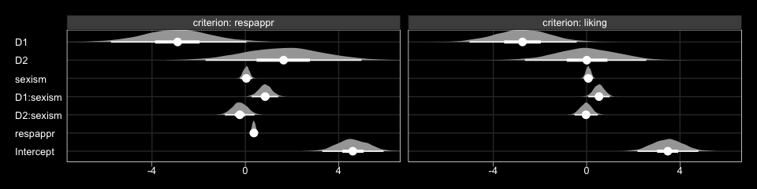

The Bayesian *R*<sup>2</sup> distributions are reasonably close to the estimates in the text.

``` r
bayes_R2(model1) %>% round(digits = 3)
```

    ##             Estimate Est.Error  Q2.5 Q97.5
    ## R2_respappr    0.322     0.054 0.211 0.419
    ## R2_liking      0.297     0.054 0.184 0.398

13.2 Looking at the components of the indirect effect of *X*
------------------------------------------------------------

When making a `newdata` object to feed into `fitted()` with more complicated models, it can be useful to review the model formula like so:

``` r
model1$formula
```

    ## respappr ~ 1 + D1 + D2 + sexism + D1:sexism + D2:sexism 
    ## liking ~ 1 + D1 + D2 + respappr + sexism + D1:sexism + D2:sexism

Now we'll prep for and make our version of Figure 13.3.

``` r
nd <-
  tibble(D1 = rep(c(1/3, -2/3, 1/3), each = 30),
         D2 = rep(c(1/2, 0, -1/2), each = 30),
         sexism = rep(seq(from = 3.5, to = 6.5, length.out = 30),
                      times = 3))

model1_fitted <-
  fitted(model1, 
       newdata = nd,
       resp = "respappr") %>% 
  as_tibble() %>% 
  bind_cols(nd) %>% 
  mutate(condition = ifelse(D2 == 0, "No Protest",
                            ifelse(D2 == -1/2, "Individual Protest", "Collective Protest"))) %>% 
  mutate(condition = factor(condition, levels = c("No Protest", "Individual Protest", "Collective Protest")))

protest <-
  protest %>% 
  mutate(condition = ifelse(protest == 0, "No Protest",
                            ifelse(protest == 1, "Individual Protest", "Collective Protest"))) %>% 
  mutate(condition = factor(condition, levels = c("No Protest", "Individual Protest", "Collective Protest")))

model1_fitted %>% 
  ggplot(aes(x = sexism, group = condition)) +
  geom_ribbon(aes(ymin = Q2.5, ymax = Q97.5),
              linetype = 3, color = "white", fill = "transparent") +
  geom_line(aes(y = Estimate), color = "white") +
  geom_point(data = protest, aes(x = sexism, y = respappr),
             color = "red", size = 2/3) +
  coord_cartesian(xlim = 4:6) +
  labs(x = expression(paste("Perceived Pervasiveness of Sex Discrimination in Society (", italic(W), ")")),
       y = expression(paste("Perceived Appropriateness of Response (", italic(M), ")"))) +
  theme_black() +
  theme(panel.grid = element_blank()) +
  facet_wrap(~condition)
```


In order to get the *R*<sup>2</sup> difference distribution analogous to the change in *R*<sup>2</sup> *F*-test Hayes discussed on page 482, we'll have to first refit the model without the interaction for the *M* criterion.

``` r
m_model <- bf(respappr ~ 1 + D1 + D2 + sexism)
y_model <- bf(liking   ~ 1 + D1 + D2 + respappr + sexism + D1:sexism + D2:sexism)

model2 <-
  brm(data = protest, family = gaussian,
      m_model + y_model + set_rescor(FALSE),
      chains = 4, cores = 4)
```

Now we're ready to compare *R*<sup>2</sup> distributions.

``` r
bayes_R2(model1, resp = "respappr", summary = F) %>% 
  as_tibble() %>% 
  rename(model1 = R2_respappr) %>% 
  bind_cols(
    bayes_R2(model2, resp = "respappr", summary = F) %>% 
      as_tibble() %>% 
      rename(model2 = R2_respappr)
  ) %>% 
  mutate(difference = model1 - model2) %>% 
  
  ggplot(aes(x = difference)) +
  geom_density(size = 0, fill = "grey50") +
  geom_vline(xintercept = 0, color = "black") +
  scale_y_continuous(NULL, breaks = NULL) +
  coord_cartesian(xlim = c(-.5, .5)) +
  xlab(expression(paste(Delta, italic(R)^2))) +
  theme_black() +
  theme(panel.grid = element_blank())
```

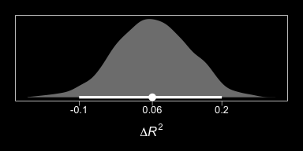

And we might also compare the models by their information criteria.

``` r
loo(model1, model2)
```

    ##                  LOOIC    SE
    ## model1          760.53 29.57
    ## model2          765.71 29.65
    ## model1 - model2  -5.18  8.18

``` r
waic(model1, model2)
```

    ##                   WAIC    SE
    ## model1          760.26 29.52
    ## model2          765.45 29.57
    ## model1 - model2  -5.19  8.16

The Bayesian *R*<sup>2</sup>, the LOO-CV, and the WAIC all suggest there's little difference between the two models with respect to their predictive utility. In such a case, I'd lean on theory to choose between them. If inclined, one could also do Bayesian model averaging.

Within our Bayesian modeling paradigm, we don't have a direct analogue to the *F*-tests Hayes presented on page 483. But a little `fitted()` and follow-up wrangling will give us some difference scores.

``` r
# we need new `nd` data
nd <-
  tibble(D1 = rep(c(1/3, -2/3, 1/3), each = 3),
         D2 = rep(c(1/2, 0, -1/2), each = 3),
         sexism = rep(c(4.250, 5.120, 5.896), times = 3))

# this time we'll use `summary = F`
model1_fitted <-
  fitted(model1, 
       newdata = nd,
       resp = "respappr", 
       summary = F) %>% 
  as_tibble() %>% 
  gather() %>% 
  mutate(condition = rep(c("Collective Protest", "No Protest", "Individual Protest"),
                         each = 3*4000),
         sexism = rep(c(4.250, 5.120, 5.896), times = 3) %>% rep(., each = 4000),
         iter = rep(1:4000, times = 9)) %>% 
  select(-key) %>% 
  spread(key = condition, value = value) %>% 
  mutate(`Individual Protest - No Protest` = `Individual Protest` - `No Protest`,
         `Collective Protest - No Protest` = `Collective Protest` - `No Protest`,
         `Collective Protest - Individual Protest` = `Collective Protest` - `Individual Protest`)

# a tiny bit more wrangling and we're ready to plot the difference distributions
model1_fitted %>% 
  select(sexism, contains("-")) %>% 
  gather(key, value, -sexism) %>% 
  
  ggplot(aes(x = value)) +
  geom_density(size = 0, fill = "grey50") +
  geom_vline(xintercept = 0, color = "grey25", linetype = 2) +
  scale_y_continuous(NULL, breaks = NULL) +
  facet_grid(sexism~key) +
  theme_black() +
  theme(panel.grid = element_blank())
```

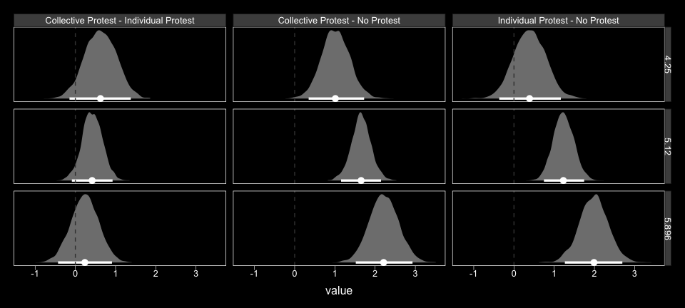

Now we have `model1_fitted`, it's easy to get the typical numeric summaries for the differences.

``` r
model1_fitted %>% 
  select(sexism, contains("-")) %>% 
  gather(key, value, -sexism) %>% 
  group_by(key, sexism) %>% 
  summarize(mean = mean(value),
            ll = quantile(value, probs = .025),
            ul = quantile(value, probs = .975)) %>% 
  mutate_if(is.double, round, digits = 3)
```

    ## # A tibble: 9 x 5
    ## # Groups:   key [3]
    ##   key                                     sexism  mean     ll    ul
    ##   <chr>                                    <dbl> <dbl>  <dbl> <dbl>
    ## 1 Collective Protest - Individual Protest   4.25 0.632 -0.092 1.36 
    ## 2 Collective Protest - Individual Protest   5.12 0.416 -0.052 0.894
    ## 3 Collective Protest - Individual Protest   5.90 0.224 -0.43  0.872
    ## 4 Collective Protest - No Protest           4.25 1.01   0.325 1.69 
    ## 5 Collective Protest - No Protest           5.12 1.65   1.17  2.13 
    ## 6 Collective Protest - No Protest           5.90 2.22   1.52  2.95 
    ## 7 Individual Protest - No Protest           4.25 0.38  -0.431 1.16 
    ## 8 Individual Protest - No Protest           5.12 1.24   0.733 1.75 
    ## 9 Individual Protest - No Protest           5.90 2.00   1.31  2.70

The three levels of `Collective Protest - Individual Protest` correspond nicely with some of the analyses Hayes presented on pages 484--486. However, they don't get at the differences Hayes expressed as *θ* D1 to *M*. For those, we'll have to work directly with the `posterior_samples()`.

``` r
post <- posterior_samples(model1)

post %>% 
  mutate(`Difference in how Catherine's behavior is perceived between being told she protested or not when W is 4.250` = b_respappr_D1 + `b_respappr_D1:sexism`*4.250,
         `Difference in how Catherine's behavior is perceived between being told she protested or not when W is 5.210` = b_respappr_D1 + `b_respappr_D1:sexism`*5.120,
         `Difference in how Catherine's behavior is perceived between being told she protested or not when W is 5.896` = b_respappr_D1 + `b_respappr_D1:sexism`*5.896) %>% 
  select(contains("Difference")) %>% 
  gather() %>% 
  group_by(key) %>% 
  summarize(mean = mean(value),
            ll = quantile(value, probs = .025),
            ul = quantile(value, probs = .975)) %>% 
  mutate_if(is.double, round, digits = 3)
```

    ## # A tibble: 3 x 4
    ##   key                                                                              mean    ll    ul
    ##   <chr>                                                                           <dbl> <dbl> <dbl>
    ## 1 Difference in how Catherine's behavior is perceived between being told she pro… 0.696 0.045  1.33
    ## 2 Difference in how Catherine's behavior is perceived between being told she pro… 1.44  1.02   1.88
    ## 3 Difference in how Catherine's behavior is perceived between being told she pro… 2.11  1.49   2.75

### Estimating the second stage of the mediation process.

Here's *b*.

``` r
post %>% 
  
  ggplot(aes(x = b_liking_respappr)) +
  geom_density(size = 0, fill = "grey50") +
  scale_x_continuous(breaks = c(-1, fixef(model1)["liking_respappr", 1], 1),
                     labels = c(-1, 
                                fixef(model1)["liking_respappr", 1] %>% round(3),
                                1)) +
  scale_y_continuous(NULL, breaks = NULL) +
  coord_cartesian(xlim = -1:1) +
  xlab(expression(paste("b_liking_respappr (i.e., ", italic(b), ")"))) +
  theme_black() +
  theme(panel.grid = element_blank())
```

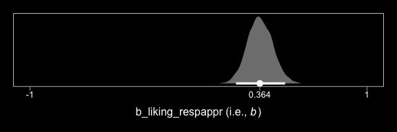

13.3 Relative conditional indirect effects
------------------------------------------

Before we use Hayes's formulas at the top of pate 488 to re-express the posterior in terms of the relative conditional indirect effects, we might want to clarify which of the `post` columns correspond to the relevant parameters.

-   *a*<sub>1</sub> = `b_respappr_D1`
-   *a*<sub>2</sub> = `b_respappr_D2`
-   *a*<sub>4</sub> = `b_respappr_D1:sexism`
-   *a*<sub>5</sub> = `b_respappr_D2:sexism`
-   *b* = `b_liking_respappr`

To get our posterior transformations, we'll use the `tidyverse::map()` approach, which first requires we define two custom functions.

``` r
# (a1 + a4W)*b
D1_function <- function(w){
  (post$b_respappr_D1 + post$`b_respappr_D1:sexism`*w)*post$b_liking_respappr
  }

# (a2 + a5W)*b
D2_function <- function(w){
  (post$b_respappr_D2 + post$`b_respappr_D2:sexism`*w)*post$b_liking_respappr
  }
```

Next, we'll make a 30-row tibble with each row a value for `sexism`, ranging from 3.5 to 6.5. We'll then apply our two custom functions to the `sexism` values and wrangle the results a bit to make them useful for our purposes.

``` r
rcie_tibble <-
  tibble(sexism = seq(from = 3.5, to = 6.5, length.out = 30)) %>% 
  group_by(sexism) %>% 
  mutate(`Protest vs. No Protest` = map(sexism, D1_function),
         `Collective vs. Individual Protest` = map(sexism, D2_function)) %>% 
  unnest() %>% 
  ungroup() %>% 
  mutate(iter = rep(1:4000, times = 30)) %>% 
  gather(`indirect effect`, value, -sexism, -iter) %>% 
  mutate(`indirect effect` = factor(`indirect effect`, levels = c("Protest vs. No Protest", "Collective vs. Individual Protest")))

head(rcie_tibble)
```

    ## # A tibble: 6 x 4
    ##   sexism  iter `indirect effect`        value
    ##    <dbl> <int> <fct>                    <dbl>
    ## 1    3.5     1 Protest vs. No Protest -0.0448
    ## 2    3.5     2 Protest vs. No Protest  0.159 
    ## 3    3.5     3 Protest vs. No Protest -0.166 
    ## 4    3.5     4 Protest vs. No Protest  0.308 
    ## 5    3.5     5 Protest vs. No Protest -0.231 
    ## 6    3.5     6 Protest vs. No Protest  0.431

Here is our variant of Figure 13.4, with respect to the relative conditional indirect effects.

``` r
rcie_tibble %>% 
  group_by(`indirect effect`, sexism) %>% 
  summarize(median = median(value),
            ll = quantile(value, probs = .025),
            ul = quantile(value, probs = .975)) %>% 
  
  ggplot(aes(x = sexism, group = `indirect effect`)) +
  geom_ribbon(aes(ymin = ll, ymax = ul),
              color = "white", fill = "transparent", linetype = 3) +
  geom_line(aes(y = median),
            color = "white") +
  coord_cartesian(xlim = 4:6,
                  ylim = c(-.6, .8)) +
  labs(x = expression(paste("Perceived Pervasiveness of Sex Discrimination in Society (", italic(W), ")")),
       y = "Relative Conditional Effect on Liking") +
  theme_black() +
  theme(panel.grid = element_blank(),
        legend.position = "none") +
  facet_grid(~ `indirect effect`)
```

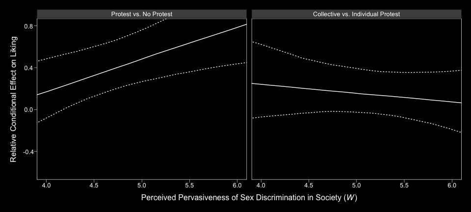

Here are the indirect effect summaries relevant to the contents of Table 13.2.

``` r
rcie_tibble_pick_a_point <-
  # notice how we've restricted ourselves to only 3 values for `sexism`
  tibble(sexism = c(4.25, 5.125, 5.896)) %>% 
  group_by(sexism) %>% 
  mutate(`Protest vs. No Protest` = map(sexism, D1_function),
         `Collective vs. Individual Protest` = map(sexism, D2_function)) %>% 
  unnest() %>% 
  ungroup() %>% 
  # because we only have 3 `sexism` values, we only need to repeat `times = 3`
  mutate(iter = rep(1:4000, times = 3)) %>% 
  gather(`indirect effect`, value, -sexism, -iter) %>% 
  mutate(`indirect effect` = factor(`indirect effect`, levels = c("Protest vs. No Protest", "Collective vs. Individual Protest")))

rcie_tibble_pick_a_point %>% 
  group_by(sexism, `indirect effect`) %>% 
  summarize(median = median(value),
            ll = quantile(value, probs = .025),
            ul = quantile(value, probs = .975)) %>% 
  mutate_if(is.double, round, digits = 3)
```

    ## # A tibble: 6 x 5
    ## # Groups:   sexism [3]
    ##   sexism `indirect effect`                 median     ll    ul
    ##    <dbl> <fct>                              <dbl>  <dbl> <dbl>
    ## 1   4.25 Protest vs. No Protest             0.245  0.018 0.537
    ## 2   4.25 Collective vs. Individual Protest  0.222 -0.034 0.552
    ## 3   5.12 Protest vs. No Protest             0.524  0.289 0.816
    ## 4   5.12 Collective vs. Individual Protest  0.147 -0.019 0.357
    ## 5   5.90 Protest vs. No Protest             0.766  0.42  1.18 
    ## 6   5.90 Collective vs. Individual Protest  0.078 -0.16  0.343

13.4 Testing and probing moderation of mediation
------------------------------------------------

### A test of moderation of the relative indirect effect.

To get the slopes of `Protest vs. No Protest` and `Collective vs. Individual Protest` (i.e., *a*<sub>4</sub>*b* and *a*<sub>5</sub>*b*, respectively), we just work directly with the `posterior_samples()`, which we've saved as `post`.

``` r
post <-
  post %>% 
  mutate(a4b = `b_respappr_D1:sexism`*b_liking_respappr,
         a5b = `b_respappr_D2:sexism`*b_liking_respappr) 

post %>% 
  select(a4b:a5b) %>%
  gather() %>% 
  group_by(key) %>% 
  summarize(mean = mean(value),
            ll = quantile(value, probs = .025),
            ul = quantile(value, probs = .975)) %>% 
  mutate_if(is.double, round, digits = 3)
```

    ## # A tibble: 2 x 4
    ##   key     mean     ll    ul
    ##   <chr>  <dbl>  <dbl> <dbl>
    ## 1 a4b    0.316  0.097 0.582
    ## 2 a5b   -0.091 -0.337 0.135

Here they are in a `geom_halfeyeh()` plot.

``` r
post %>% 
  select(a4b:a5b) %>%
  gather() %>% 
 
  ggplot(aes(x = value, y = key, group = key)) +
  geom_halfeyeh(.prob = c(0.95, 0.5),
                color = "white") +
  labs(x = NULL, y = NULL) +
  theme_black() +
  theme(axis.ticks.y = element_blank(),
        panel.grid.minor.y = element_blank(),
        panel.grid.major.y = element_blank()) 
```

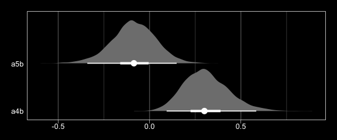

### Probing moderation of mediation.

We already computed the relevant 95% credible intervals at the end of section **13.3 Relative conditional indirect effects**. We could inspect those in a `geom_halfeyeh()` plot, too.

``` r
rcie_tibble_pick_a_point %>%   
  
  ggplot(aes(x = value, y = sexism, group = sexism)) +
  geom_halfeyeh(.prob = c(0.95, 0.5),
                color = "white") +
  labs(x = "Relative Conditional Effect on Liking", y = NULL) +
  theme_black() +
  theme(axis.text.y = element_text(hjust = 0),
        axis.ticks.y = element_blank(),
        panel.grid.minor.y = element_blank(),
        panel.grid.major.y = element_blank()) +
  facet_wrap(~`indirect effect`)
```

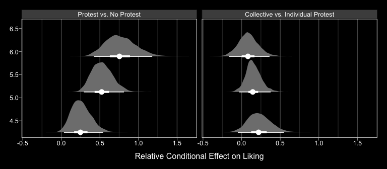

13.5 Relative conditional direct effects
----------------------------------------

In order to get the *R*<sup>2</sup> difference distribution analogous to the change in *R*<sup>2</sup> *F*-test Hayes discussed on pages 495--496, we'll have to first refit the model without the interaction for the *Y* criterion, `liking`.

``` r
m_model <- bf(respappr ~ 1 + D1 + D2 + sexism + D1:sexism + D2:sexism)
y_model <- bf(liking   ~ 1 + D1 + D2 + respappr + sexism)

model3 <-
  brm(data = protest, family = gaussian,
      m_model + y_model + set_rescor(FALSE),
      chains = 4, cores = 4)
```

Here's the *R*<sup>2</sup> difference density.

``` r
bayes_R2(model1, resp = "liking", summary = F) %>% 
  as_tibble() %>% 
  rename(model1 = R2_liking) %>% 
  bind_cols(
    bayes_R2(model3, resp = "liking", summary = F) %>% 
      as_tibble() %>% 
      rename(model3 = R2_liking)
  ) %>% 
  mutate(difference = model1 - model3) %>% 
  
  ggplot(aes(x = difference)) +
  geom_density(size = 0, fill = "grey50") +
  geom_vline(xintercept = 0, color = "black") +
  scale_y_continuous(NULL, breaks = NULL) +
  coord_cartesian(xlim = c(-.5, .5)) +
  xlab(expression(paste(Delta, italic(R)^2))) +
  theme_black() +
  theme(panel.grid = element_blank())
```

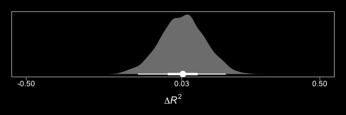

We'll also compare the models by their information criteria.

``` r
loo(model1, model3)
```

    ##                  LOOIC    SE
    ## model1          760.53 29.57
    ## model3          761.92 31.15
    ## model1 - model3  -1.39  5.67

``` r
waic(model1, model3)
```

    ##                   WAIC    SE
    ## model1          760.26 29.52
    ## model3          761.63 31.09
    ## model1 - model3  -1.37  5.68

As when we went through these steps for `resp = "respappr"`, above, the Bayesian *R*<sup>2</sup>, the LOO-CV, and the WAIC all suggest there's little difference between the two models with respect to predictive utility. In such a case, I'd lean on theory to choose between them. If inclined, one could also do Bayesian model averaging.

Our approach to plotting the relative conditional *direct* effects will mirror what we did for the relative conditional *indirect* effects, above. Here are the `brm()` parameters that correspond to the parameter names of Hayes's notation.

-   *c*<sub>1</sub> = `b_liking_D1`
-   *c*<sub>2</sub> = `b_liking_D2`
-   *c*<sub>4</sub> = `b_liking_D1:sexism`
-   *c*<sub>5</sub> = `b_liking_D2:sexism`

With all clear, we're off to the races.

``` r
# c1 + c4W
D1_function <- function(w){
  post$b_liking_D1 + post$`b_liking_D1:sexism`*w
  }

# c2 + c5W
D2_function <- function(w){
  post$b_liking_D2 + post$`b_liking_D2:sexism`*w
  }

rcde_tibble <-
  tibble(sexism = seq(from = 3.5, to = 6.5, length.out = 30)) %>% 
  group_by(sexism) %>% 
  mutate(`Protest vs. No Protest`            = map(sexism, D1_function),
         `Collective vs. Individual Protest` = map(sexism, D2_function)) %>% 
  unnest() %>% 
  ungroup() %>% 
  mutate(iter = rep(1:4000, times = 30)) %>% 
  gather(`direct effect`, value, -sexism, -iter) %>% 
  mutate(`direct effect` = factor(`direct effect`, levels = c("Protest vs. No Protest", "Collective vs. Individual Protest")))

head(rcde_tibble)
```

    ## # A tibble: 6 x 4
    ##   sexism  iter `direct effect`         value
    ##    <dbl> <int> <fct>                   <dbl>
    ## 1    3.5     1 Protest vs. No Protest -0.694
    ## 2    3.5     2 Protest vs. No Protest -1.08 
    ## 3    3.5     3 Protest vs. No Protest -0.215
    ## 4    3.5     4 Protest vs. No Protest -1.01 
    ## 5    3.5     5 Protest vs. No Protest -0.907
    ## 6    3.5     6 Protest vs. No Protest -1.22

Here is our variant of Figure 13.4, with respect to the relative conditional direct effects.

``` r
rcde_tibble %>% 
  group_by(`direct effect`, sexism) %>% 
  summarize(median = median(value),
            ll = quantile(value, probs = .025),
            ul = quantile(value, probs = .975)) %>% 
  
  ggplot(aes(x = sexism, group = `direct effect`)) +
  geom_ribbon(aes(ymin = ll, ymax = ul),
              color = "white", fill = "transparent", linetype = 3) +
  geom_line(aes(y = median),
            color = "white") +
  coord_cartesian(xlim = 4:6,
                  ylim = c(-.6, .8)) +
  labs(x = expression(paste("Perceived Pervasiveness of Sex Discrimination in Society (", italic(W), ")")),
       y = "Relative Conditional Effect on Liking") +
  theme_black() +
  theme(panel.grid = element_blank(),
        legend.position = "none") +
  facet_grid(~ `direct effect`)
```

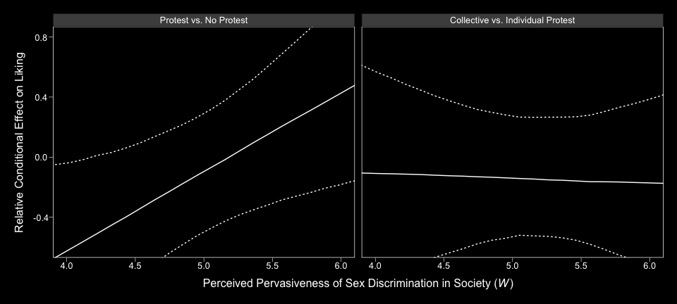

Holy smokes, them are some wide 95% CIs! No wonder the information criteria and *R*<sup>2</sup> comparisons were so uninspiring.

Notice that the y-axis is on the parameter space. In Hayes's Figure 13.5, the y-axis is on the `liking` space, instead. When we want things in the parameter space, we work with the output of `posterior_samples()`; when we want them in the criterion space, we use `fitted()`.

``` r
# we need new `nd` data
nd <-
  tibble(D1 = rep(c(1/3, -2/3, 1/3), each = 30),
         D2 = rep(c(1/2, 0, -1/2), each = 30),
         respappr = mean(protest$respappr),
         sexism = seq(from = 3.5, to = 6.5, length.out = 30) %>% rep(., times = 3))

# we feed `nd` into `fitted()`
model1_fitted <-
  fitted(model1, 
       newdata = nd,
       resp = "liking", 
       summary = T) %>% 
  as_tibble() %>% 
  bind_cols(nd) %>% 
  mutate(condition = ifelse(D2 == 0, "No Protest",
                            ifelse(D2 == -1/2, "Individual Protest", "Collective Protest"))) %>% 
  mutate(condition = factor(condition, levels = c("No Protest", "Individual Protest", "Collective Protest")))
 
model1_fitted %>% 
  ggplot(aes(x = sexism, group = condition)) +
  geom_ribbon(aes(ymin = Q2.5, ymax = Q97.5),
              linetype = 3, color = "white", fill = "transparent") +
  geom_line(aes(y = Estimate), color = "white") +
  geom_point(data = protest, aes(x = sexism, y = liking),
             color = "red", size = 2/3) +
  coord_cartesian(xlim = 4:6,
                  ylim = 4:7) +
  labs(x = expression(paste("Perceived Pervasiveness of Sex Discrimination in Society (", italic(W), ")")),
       y = expression(paste("Evaluation of the Attorney (", italic(Y), ")"))) +
  theme_black() +
  theme(panel.grid = element_blank()) +
  facet_wrap(~condition)
```

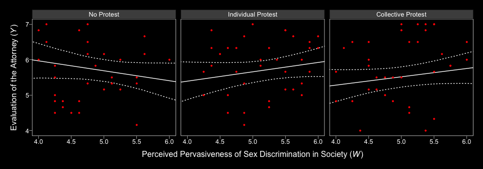

We expanded the range of the y-axis, a bit, to show more of that data (and there's even more data outside of our expanded range). Also note how after doing so and after including the 95% CI bands, the crossing regression line effect in Hayes’s Figure 13.5 isn’t as impressive looking any more.

On pages 497--498, Hayes discussed more omnibus *F*-tests. Much like with the *M* criterion, we won't come up with Bayesian *F*-tests, but we might go ahead and make pairwise comparisons at the three percentiles Hayes prefers.

``` r
# we need new `nd` data
nd <-
  tibble(D1 = rep(c(1/3, -2/3, 1/3), each = 3),
         D2 = rep(c(1/2, 0, -1/2), each = 3),
         respappr = mean(protest$respappr),
         sexism = rep(c(4.250, 5.120, 5.896), times = 3))

# this tie we'll use `summary = F`
model1_fitted <-
  fitted(model1, 
       newdata = nd,
       resp = "liking", 
       summary = F) %>% 
  as_tibble() %>% 
  gather() %>% 
  mutate(condition = rep(c("Collective Protest", "No Protest", "Individual Protest"),
                         each = 3*4000),
         sexism = rep(c(4.250, 5.120, 5.896), times = 3) %>% rep(., each = 4000),
         iter = rep(1:4000, times = 9)) %>% 
  select(-key) %>% 
  spread(key = condition, value = value) %>% 
  mutate(`Individual Protest - No Protest` = `Individual Protest` - `No Protest`,
         `Collective Protest - No Protest` = `Collective Protest` - `No Protest`,
         `Collective Protest - Individual Protest` = `Collective Protest` - `Individual Protest`)

# a tiny bit more wrangling and we're ready to plot the difference distributions
model1_fitted %>% 
  select(sexism, contains("-")) %>% 
  gather(key, value, -sexism) %>% 
  
  ggplot(aes(x = value)) +
  geom_density(size = 0, fill = "grey50") +
  geom_vline(xintercept = 0, color = "grey25", linetype = 2) +
  scale_y_continuous(NULL, breaks = NULL) +
  facet_grid(sexism~key) +
  theme_black() +
  theme(panel.grid = element_blank())
```

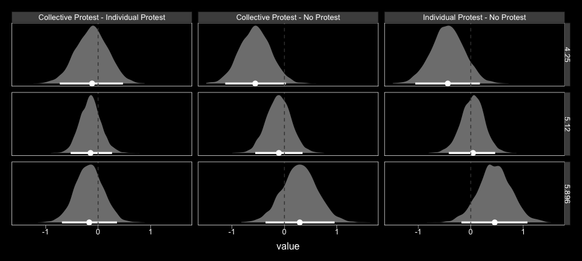

Now we have `model1_fitted`, it's easy to get the typical numeric summaries for the differences.

``` r
model1_fitted %>% 
  select(sexism, contains("-")) %>% 
  gather(key, value, -sexism) %>% 
  group_by(key, sexism) %>% 
  summarize(mean = mean(value),
            ll = quantile(value, probs = .025),
            ul = quantile(value, probs = .975)) %>% 
  mutate_if(is.double, round, digits = 3)
```

    ## # A tibble: 9 x 5
    ## # Groups:   key [3]
    ##   key                                     sexism   mean     ll    ul
    ##   <chr>                                    <dbl>  <dbl>  <dbl> <dbl>
    ## 1 Collective Protest - Individual Protest   4.25 -0.114 -0.727 0.483
    ## 2 Collective Protest - Individual Protest   5.12 -0.146 -0.54  0.251
    ## 3 Collective Protest - Individual Protest   5.90 -0.174 -0.705 0.372
    ## 4 Collective Protest - No Protest           4.25 -0.559 -1.12  0.03 
    ## 5 Collective Protest - No Protest           5.12 -0.113 -0.570 0.328
    ## 6 Collective Protest - No Protest           5.90  0.285 -0.349 0.914
    ## 7 Individual Protest - No Protest           4.25 -0.445 -1.08  0.179
    ## 8 Individual Protest - No Protest           5.12  0.032 -0.396 0.462
    ## 9 Individual Protest - No Protest           5.90  0.458 -0.143 1.07

We don't have *p*-values, but all the differences are small in magnitude and have wide 95% intervals straddling zero.

To get the difference scores Hayes presented on pages 498--500, one might:

``` r
post %>% 
  mutate(`Difference in liking between being told she protested or not when W is 4.250` = b_liking_D1 + `b_liking_D1:sexism`*4.250,
         `Difference in liking between being told she protested or not when W is 5.120` = b_liking_D1 + `b_liking_D1:sexism`*5.120,
         `Difference in liking between being told she protested or not when W is 5.896` = b_liking_D1 + `b_liking_D1:sexism`*5.896,
         
         `Difference in liking between collective vs. individual protest when W is 4.250` = b_liking_D2 + `b_liking_D2:sexism`*4.250,
         `Difference in liking between collective vs. individual protest when W is 5.120` = b_liking_D2 + `b_liking_D2:sexism`*5.120,
         `Difference in liking between collective vs. individual protest when W is 5.896` = b_liking_D2 + `b_liking_D2:sexism`*5.896) %>% 
  select(contains("Difference in liking")) %>% 
  gather() %>% 
  group_by(key) %>% 
  summarize(mean = mean(value),
            ll = quantile(value, probs = .025),
            ul = quantile(value, probs = .975)) %>% 
  mutate_if(is.double, round, digits = 3)
```

    ## # A tibble: 6 x 4
    ##   key                                                                             mean     ll    ul
    ##   <chr>                                                                          <dbl>  <dbl> <dbl>
    ## 1 Difference in liking between being told she protested or not when W is 4.250  -0.502 -1.01  0.037
    ## 2 Difference in liking between being told she protested or not when W is 5.120  -0.04  -0.442 0.354
    ## 3 Difference in liking between being told she protested or not when W is 5.896   0.372 -0.2   0.919
    ## 4 Difference in liking between collective vs. individual protest when W is 4.2… -0.114 -0.727 0.483
    ## 5 Difference in liking between collective vs. individual protest when W is 5.1… -0.146 -0.54  0.251
    ## 6 Difference in liking between collective vs. individual protest when W is 5.8… -0.174 -0.705 0.372

Note. The analyses in this document were done with:

-   R 3.4.4
-   RStudio 1.1.442
-   rmarkdown 1.9
-   tidyverse 1.2.1
-   readr 1.1.1
-   rstan 2.17.3
-   brms 2.3.2
-   tidybayes 0.12.1.9000

Reference
---------

Hayes, A. F. (2018). *Introduction to mediation, moderation, and conditional process analysis: A regression-based approach.* (2nd ed.). New York, NY, US: The Guilford Press.
