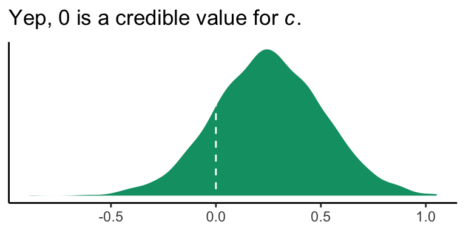
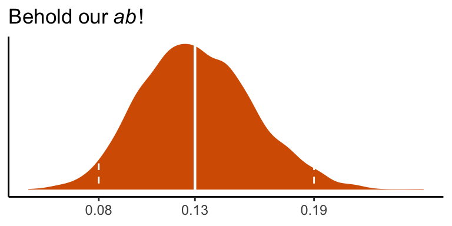

# (PART) MEDIATION ANALYSIS {-}

# The Simple Mediation Model


Hayes closed the opening with:

> Whereas answering questions about *when* or *for whom* is the domain of moderation analysis, questions that ask about *how* pertain to *mediation*, the focus of this and the next three chapters. In this chapter, [we'll explore] the *simple mediation model* and illustrate using ~~OLS regression-based~~ Bayesian path analysis how the effect of an antecedent variable $X$ on some final consequent $Y$ can be partitioned into two paths of influence, *direct* and *indirect*. [@hayesIntroductionMediationModeration2018, p. 78, *emphasis* in the original]

## The simple mediation model

> Mediation analysis is a statistical method used to evaluate evidence from studies designed to test hypotheses about how some causal antecedent variable $X$ transmits its effect on a consequent variable $Y$.
>
> When thinking about whether a phenomenon or theory you are studying could be conceptualized as a mediation process, it is important to keep in mind that mediation is ultimately a causal explanation. It is assumed that the relationships in the system are causal, and, importantly, that $M$ is causally located *between* $X$ and $Y$. It must be assumed, if not also empirically substantiated, that $X$ causes $M$, which in turn causes $Y$. $M$ cannot possibly carry $X$’s effect on $Y$ if $M$ is not located causally between $X$ and $Y$. (pp. 78--81, *emphasis* in the original)

## Estimation of the direct, indirect, and total effects of $X$

Given the simple three-term mediation model, the statistical model is expressed in the two equations

\begin{align*}
M & = i_M + a X + e_M \\
Y & = i_Y + c' X + b M + e_Y.
\end{align*}

When using OLS software, as Hayes promotes throughout the text, these equations are estimated sequentially. However, the **brms** package has multivariate capabilities. As such, our results will be from a Bayesian multivariate model that computes both equations at once. They're both part of a joint model. When we consider more advanced models later in the text, our multivariate models will fit even more than two equations at once. None of this is a problem for **brms**.

## Example with dichotomous $X$: The influence of presumed media influence

Here we load a couple necessary packages, load the data, and take a peek.


```r
library(tidyverse)

pmi <- read_csv("data/pmi/pmi.csv")

glimpse(pmi)
```

```
## Rows: 123
## Columns: 6
## $ cond     <dbl> 1, 0, 1, 0, 0, 0, 0, 1, 0, 0, 1, 0, 1, 0, 1, 1, 0, 0, 1, 0, 1, 1, 1, 1, 1, 0, 1, 0, 1, 0, 0…
## $ pmi      <dbl> 7.0, 6.0, 5.5, 6.5, 6.0, 5.5, 3.5, 6.0, 4.5, 7.0, 1.0, 6.0, 5.0, 7.0, 7.0, 7.0, 4.5, 3.5, 7…
## $ import   <dbl> 6, 1, 6, 6, 5, 1, 1, 6, 6, 6, 3, 3, 4, 7, 1, 6, 3, 3, 2, 4, 4, 6, 7, 4, 5, 4, 6, 5, 5, 7, 4…
## $ reaction <dbl> 5.25, 1.25, 5.00, 2.75, 2.50, 1.25, 1.50, 4.75, 4.25, 6.25, 1.25, 2.75, 3.75, 5.00, 4.00, 5…
## $ gender   <dbl> 1, 1, 1, 0, 1, 1, 0, 1, 1, 1, 0, 0, 0, 0, 0, 0, 0, 0, 0, 1, 0, 0, 1, 1, 0, 1, 0, 0, 0, 1, 0…
## $ age      <dbl> 51.0, 40.0, 26.0, 21.0, 27.0, 25.0, 23.0, 25.0, 22.0, 24.0, 22.0, 21.0, 23.0, 21.0, 22.0, 2…
```

You can get the male/female split like so.


```r
pmi %>% 
  count(gender)
```

```
## # A tibble: 2 × 2
##   gender     n
##    <dbl> <int>
## 1      0    80
## 2      1    43
```

Here is the split by `condition`.


```r
pmi %>% 
  count(cond)
```

```
## # A tibble: 2 × 2
##    cond     n
##   <dbl> <int>
## 1     0    65
## 2     1    58
```

Here is how to get the ungrouped mean and $\textit{SD}$ values for `reaction` and `pmi`, as presented in Table 3.1.


```r
pmi %>% 
  pivot_longer(c(reaction, pmi)) %>% 
  group_by(name) %>% 
  summarise(mean = mean(value),
            sd   = sd(value)) %>% 
  mutate_if(is.double, round, digits = 3)
```

```
## # A tibble: 2 × 3
##   name      mean    sd
##   <chr>    <dbl> <dbl>
## 1 pmi       5.60  1.32
## 2 reaction  3.48  1.55
```

You might get the mean and $\textit{SD}$ values for `reaction` and `pmi` grouped by `cond` like this.


```r
pmi %>% 
  pivot_longer(c(reaction, pmi)) %>% 
  group_by(cond, name) %>% 
  summarise(mean = mean(value),
            sd   = sd(value)) %>% 
  mutate_if(is.double, round, digits = 3)
```

```
## # A tibble: 4 × 4
## # Groups:   cond [2]
##    cond name      mean    sd
##   <dbl> <chr>    <dbl> <dbl>
## 1     0 pmi       5.38  1.34
## 2     0 reaction  3.25  1.61
## 3     1 pmi       5.85  1.27
## 4     1 reaction  3.75  1.45
```

Let's load our primary statistical package, **brms**.


```r
library(brms)
```

Before we begin, I should acknowledge that I greatly benefited by [this great blog post on path analysis in brms](https://www.imachordata.com/2017/12/21/bayesian-sem-with-brms/) by [Jarrett Byrnes](https://www.imachordata.com/about/). With **brms**, we handle mediation models using the [multivariate syntax](https://CRAN.R-project.org/package=brms/vignettes/brms_multivariate.html) [@Bürkner2022Multivariate]. There are a few ways to do this. Let's start simple.

If you look at the path model in Figure 3.3, you'll note that `reaction` is predicted by `pmi` and `cond`. `pmi`, in turn, is predicted solely by `cond`. So we have two regression models, which is just the kind of thing the **brms** multivariate syntax is for. So first let's specify both models, which we'll nest in `bf()` functions and save as objects.


```r
y_model <- bf(reaction ~ 1 + pmi + cond)
m_model <- bf(pmi ~ 1 + cond)
```

Now we have our `bf()` objects in hand, we'll combine them with the `+` operator within the `brm()` function. We'll also specify `set_rescor(FALSE)` because we are not interested in adding a residual correlation between `reaction` and `pmi`.


```r
model3.1 <- brm(
  data = pmi, 
  family = gaussian,
  y_model + m_model + set_rescor(FALSE),
  cores = 4,
  file = "fits/model03.01")
```

Here are our results.


```r
print(model3.1)
```

```
##  Family: MV(gaussian, gaussian) 
##   Links: mu = identity; sigma = identity
##          mu = identity; sigma = identity 
## Formula: reaction ~ 1 + pmi + cond 
##          pmi ~ 1 + cond 
##    Data: pmi (Number of observations: 123) 
##   Draws: 4 chains, each with iter = 2000; warmup = 1000; thin = 1;
##          total post-warmup draws = 4000
## 
## Population-Level Effects: 
##                    Estimate Est.Error l-95% CI u-95% CI Rhat Bulk_ESS Tail_ESS
## reaction_Intercept     0.52      0.55    -0.55     1.58 1.00     6477     3316
## pmi_Intercept          5.38      0.15     5.08     5.67 1.00     6251     3184
## reaction_pmi           0.51      0.10     0.31     0.70 1.00     6169     3365
## reaction_cond          0.25      0.26    -0.26     0.76 1.00     5433     2768
## pmi_cond               0.48      0.23     0.04     0.93 1.00     6831     3069
## 
## Family Specific Parameters: 
##                Estimate Est.Error l-95% CI u-95% CI Rhat Bulk_ESS Tail_ESS
## sigma_reaction     1.41      0.09     1.24     1.60 1.00     5651     2932
## sigma_pmi          1.32      0.08     1.17     1.49 1.00     6248     2910
## 
## Draws were sampled using sampling(NUTS). For each parameter, Bulk_ESS
## and Tail_ESS are effective sample size measures, and Rhat is the potential
## scale reduction factor on split chains (at convergence, Rhat = 1).
```

If you compare our model summary with the coefficients in the path model in Figure 3.3, you'll see our coefficients are the same. The **brms** summary also includes intercepts and residual variances, which are typically omitted in path diagrams even though they're still part of the model.

If you're getting lost in all the model output, try taking out the constant and error terms.


```r
fixef(model3.1)[3:5, ] %>% round(digits = 3)
```

```
##               Estimate Est.Error   Q2.5 Q97.5
## reaction_pmi     0.507     0.098  0.314 0.696
## reaction_cond    0.252     0.258 -0.263 0.757
## pmi_cond         0.478     0.227  0.035 0.929
```

In his Table 3.2, Hayes included the $R^2$ values. Here are ours.


```r
bayes_R2(model3.1) %>% round(digits = 3)
```

```
##            Estimate Est.Error  Q2.5 Q97.5
## R2reaction    0.209     0.056 0.101 0.317
## R2pmi         0.039     0.030 0.001 0.111
```

It's worth it to actually plot the $R^2$ distributions. We'll take our color palette from the [**ggthemes** package](https://CRAN.R-project.org/package=ggthemes) [@R-ggthemes].


```r
library(ggthemes)

bayes_R2(model3.1, summary = F) %>% 
  data.frame() %>% 
  pivot_longer(everything()) %>% 
  mutate(name = str_remove(name, "R2")) %>% 
  
  ggplot(aes(x = value, fill = name)) +
  geom_density(color = "transparent", alpha = 2/3) +
  scale_fill_colorblind(NULL) +  # we got this color palette from the ggthemes package
  coord_cartesian(xlim = 0:1) +
  labs(title = expression(paste("The ", italic("R")^{2}, " distributions for model3.1")),
       x = NULL) +
  theme_classic()
```


We went through the trouble of plotting the $R^2$ distributions because it's useful to understand that they won't often be symmetric when they're near their logical boundaries (i.e., 0 and 1). This is where asymmetric Bayesian credible intervals can really shine.

Let's get down to business and examine the indirect effect, the $ab$ pathway. In our model,

* $a$ = `pmi_cond` and
* $b$ = `reaction_pmi`.

You can isolate them with `fixef()[i, ]`.


```r
fixef(model3.1)[5, ]
```

```
##   Estimate  Est.Error       Q2.5      Q97.5 
## 0.47826304 0.22688910 0.03540068 0.92879374
```

```r
fixef(model3.1)[3, ]
```

```
##   Estimate  Est.Error       Q2.5      Q97.5 
## 0.50655988 0.09764479 0.31385098 0.69578157
```

So the naive approach would be to just multiply them.


```r
(fixef(model3.1)[5, ] * fixef(model3.1)[3, ]) %>% round(digits = 3)
```

```
##  Estimate Est.Error      Q2.5     Q97.5 
##     0.242     0.022     0.011     0.646
```

Now, this does get us the correct 'Estimate' (i.e., posterior mean). However, the posterior $\textit{SD}$ and 95% intervals are off. If you want to do this properly, you need to work with the poster samples themselves. We do that with the `as_draws_df()` function.


```r
draws <- as_draws_df(model3.1)

glimpse(draws)
```

```
## Rows: 4,000
## Columns: 12
## $ b_reaction_Intercept <dbl> 3.504173e-01, 3.709087e-01, 9.834039e-02, 8.472168e-01, 1.308578e-01, 6.617100e…
## $ b_pmi_Intercept      <dbl> 5.593477, 5.221651, 5.596498, 5.008179, 5.221197, 5.440538, 5.495575, 5.421468,…
## $ b_reaction_pmi       <dbl> 0.5264621, 0.5493630, 0.5681480, 0.4454483, 0.5533578, 0.4959108, 0.5118134, 0.…
## $ b_reaction_cond      <dbl> -0.252662935, 0.617586525, 0.220744749, 0.282507395, 0.316521189, 0.210106073, …
## $ b_pmi_cond           <dbl> 0.20475270, 0.63722353, 0.24630473, 0.87306055, 0.34635204, 0.43479263, 0.60891…
## $ sigma_reaction       <dbl> 1.432913, 1.390006, 1.434894, 1.371039, 1.486793, 1.278881, 1.297105, 1.298125,…
## $ sigma_pmi            <dbl> 1.301103, 1.273754, 1.299293, 1.380452, 1.365904, 1.342461, 1.386392, 1.283587,…
## $ lprior               <dbl> -6.673399, -6.699569, -6.675656, -6.710765, -6.738489, -6.658791, -6.669843, -6…
## $ lp__                 <dbl> -431.8571, -430.0315, -427.7059, -429.1300, -429.2515, -427.2221, -428.7214, -4…
## $ .chain               <int> 1, 1, 1, 1, 1, 1, 1, 1, 1, 1, 1, 1, 1, 1, 1, 1, 1, 1, 1, 1, 1, 1, 1, 1, 1, 1, 1…
## $ .iteration           <int> 1, 2, 3, 4, 5, 6, 7, 8, 9, 10, 11, 12, 13, 14, 15, 16, 17, 18, 19, 20, 21, 22, …
## $ .draw                <int> 1, 2, 3, 4, 5, 6, 7, 8, 9, 10, 11, 12, 13, 14, 15, 16, 17, 18, 19, 20, 21, 22, …
```

Here we compute the indirect effect, `ab`.


```r
draws <- draws %>% 
  mutate(ab = b_pmi_cond * b_reaction_pmi)
```

Now we have `ab` as a properly computed vector, we can summarize it with the `quantile()` function.


```r
quantile(draws$ab, probs = c(.5, .025, .975)) %>% 
  round(digits = 3)
```

```
##   50%  2.5% 97.5% 
## 0.232 0.017 0.513
```

And we can even visualize it as a density.


```r
draws %>% 
  ggplot(aes(x = ab)) +
  geom_density(color = "transparent", 
               fill = colorblind_pal()(3)[3]) +
  scale_y_continuous(NULL, breaks = NULL) +
  labs(title = expression(paste("Our indirect effect, the ", italic("ab"), " pathway")),
       x = NULL) +
  theme_classic()
```


It's also worth pointing out that as the indirect effect isn't perfectly symmetric, its mean and median aren't quite the same.


```r
draws %>% 
  summarize(mean   = mean(ab),
            median = median(ab)) %>% 
  round(digits = 3)
```

```
## # A tibble: 1 × 2
##    mean median
##   <dbl>  <dbl>
## 1 0.242  0.232
```

Their magnitudes are similar, but this asymmetry will be a source of contrast to our estimates and the OLS estimates Hayes reported throughout his text. This is also something to consider when reporting on central tendency. When the indirect effect--or any other parameter, for that matter--is quite asymmetric, you might prefer reporting the median rather than the mean.

On page 90, Hayes computed the *adjusted means* for $Y$. For both `cond == 1` and `cond == 0`, he computed the expected values for `reaction` when `pmi` was at its mean. A natural way to do that in **brms** is with `fitted()`. First we'll put our input values for `cond` and `pmi` in a tibble, which we'll call `nd`. Then we'll feed `nd` into the `newdata` argument within the `fitted()` function.


```r
nd <-
  tibble(cond = 1:0,
         pmi  = mean(pmi$pmi))

fitted(model3.1, newdata = nd)
```

```
## , , reaction
## 
##      Estimate Est.Error     Q2.5    Q97.5
## [1,] 3.613162 0.1901055 3.230107 3.978794
## [2,] 3.360795 0.1750825 3.009563 3.702770
## 
## , , pmi
## 
##      Estimate Est.Error     Q2.5    Q97.5
## [1,] 5.856210 0.1706542 5.511162 6.191147
## [2,] 5.377947 0.1546516 5.081493 5.674961
```

Because `model3.1` is a multivariate model, `fitted()` returned the model-implied summaries for both `reaction` and `pmi`. If you just want the adjusted means for `reaction`, you can use the `resp` argument within `fitted()`.


```r
fitted(model3.1, newdata = nd, resp = "reaction") %>% round(digits = 3)
```

```
##      Estimate Est.Error Q2.5 Q97.5
## [1,]    3.613     0.190 3.23 3.979
## [2,]    3.361     0.175 3.01 3.703
```

Note how this is where the two values in the $Y$ adjusted column in Table 3.1 came from.

However, if we want to reproduce how Hayes computed the total effect (i.e., $c' + ab$), we'll need to work with the posterior draws themselves, `draws`. Recall, we've already saved the indirect effect as a vector, `ab`. The direct effect, $c'$, is labeled `b_reaction_cond` within `draws`. To get the total effect, $c$, all we need to is add those vectors together.


```r
draws <- draws %>% 
  mutate(total_effect = b_reaction_cond + ab)
```

Here are the posterior mean with its quantile-based 95% intervals.


```r
draws %>% 
  summarize(mean = mean(total_effect),
            ll   = quantile(total_effect, prob = .025),
            ul   = quantile(total_effect, prob = .975))
```

```
## # A tibble: 1 × 3
##    mean      ll    ul
##   <dbl>   <dbl> <dbl>
## 1 0.495 -0.0285  1.04
```

### ~~Estimation of the model in PROCESS for SPSS and SAS.~~

Nothing new for us, here.

## Statistical inference

Our approach will not match up neatly with Hayes's on this topic.

### Inference about the total effect of $X$ on $Y$.

As we mentioned in Chapter 2, we can indeed focus on rejecting $H_0$ when using Bayesian statistics. I, however, am not a fan of that approach and I will not be focusing on Bayesian $p$-values. But throughout this project, we will make great efforts to express the (un)certainty in our models with various plots of posterior distributions and summary statistics, such as measures of central tendency (e.g., means) and spread (e.g., percentile-based 95% intervals).

So instead of $t$- and $p$-values for $c'$, we are going to focus on the distribution. We already gave the mean and 95% intervals, above. Here's a look at the density.


```r
 draws %>% 
  ggplot(aes(x = total_effect)) +
  geom_density(color = "transparent", 
               fill = colorblind_pal()(3)[2]) +
  scale_y_continuous(NULL, breaks = NULL) +
  xlab(expression(paste(italic(c)," (i.e., the total effect)"))) +
  theme_classic()
```


### Inference about the direct effect of $X$ on $Y$.

Like in the last section, we will just look at the posterior distribution for the direct effect (i.e., $c'$, `b_reaction_cond`).


```r
draws %>% 
  ggplot(aes(x = b_reaction_cond)) +
  geom_density(color = "transparent", 
               fill = colorblind_pal()(4)[4]) +
  geom_vline(xintercept = 0, color = "white", linetype = 2) +
  scale_y_continuous(NULL, breaks = NULL) +
  labs(title = expression(paste("Yep, 0 is a credible value for ", italic("c"), ".")),
       x = NULL) +
  theme_classic()
```



If you wanted to quantify what proportion of the density was less than 0, you could execute something like this.


```r
draws %>% 
  summarize(proportion_below_zero = mean(b_reaction_cond < 0))
```

```
## # A tibble: 1 × 1
##   proportion_below_zero
##                   <dbl>
## 1                 0.160
```

This is something like a Bayesian $p$-value. But of course, you could always just look at the posterior intervals.


```r
posterior_interval(model3.1)["b_reaction_cond", ]
```

```
##       2.5%      97.5% 
## -0.2628266  0.7570081
```

### Inference about the indirect of $X$ on $Y$ through $M$.

> The indirect effect quantifies how much two cases that differ by a unit on $X$ are estimated to differ on $Y$ as a result of $X$'s influence on $M$, which in turn influences $Y$. The indirect effect is relevant as to [what extent] $X$'s effect on $Y$ can be said to be transmitted through the mechanism represented by the $X \rightarrow M \rightarrow Y$ causal chain of events. (p. 95)

#### The normal theory approach.

This is not our approach.

#### Bootstrap confidence interval.

This is not our approach.

However, Markov chain Monte Carlo (MCMC) methods are iterative and share some characteristics with boostrapping. On page 98, Hayes outlined 6 steps for constructing the $ab$ bootstrap confidence interval. Here are our responses to those steps w/r/t Bayes with MCMC--or in our case HMC (i.e., Hamiltonian Monte Carlo).

If HMC or MCMC, in general, are new to you, you might check out [this lecture](https://youtu.be/BWEtS3HuU5A) or the [*Stan Reference Manual*](https://mc-stan.org/docs/reference-manual/index.html) if you're more technically oriented.

Anyway, Hayes's 6 steps:

##### Step 1.

With HMC we do not take random samples of the data themselves. Rather, we take random draws from the posterior distribution. The posterior distribution is the joint probability distribution of our model.

##### Step 2.

After we fit our model with the `brm()` function and save our posterior draws in a data frame (i.e., `draws <- as_draws_df(my_model_fit)`), we then make a new column (a.k.a. vector, variable) that is the product of our coefficients for the $a$ and $b$ pathways. In the example above, this looked like `draws %>% mutate(ab = b_pmi_cond * b_reaction_pmi)`. Let's take a look at those columns.


```r
draws %>% 
  select(b_pmi_cond, b_reaction_pmi, ab) %>% 
  slice(1:10)
```

```
## # A tibble: 10 × 3
##    b_pmi_cond b_reaction_pmi     ab
##         <dbl>          <dbl>  <dbl>
##  1      0.205          0.526 0.108 
##  2      0.637          0.549 0.350 
##  3      0.246          0.568 0.140 
##  4      0.873          0.445 0.389 
##  5      0.346          0.553 0.192 
##  6      0.435          0.496 0.216 
##  7      0.609          0.512 0.312 
##  8      0.195          0.453 0.0881
##  9      0.157          0.472 0.0741
## 10      0.757          0.549 0.416
```

Our `draws` data frame has 4,000 rows. Why 4,000? By default, **brms** runs 4 HMC chains. Each chain has 2,000 iterations, 1,000 of which are warmups, which we always discard. As such, there are 1,000 good iterations left in each chain and $1{,}000 \times 4 = 4{,}000$. We can change these defaults as needed.

Each row in `draws` contains the parameter values based on one of those draws. And again, these are draws from the posterior distribution. They are not draws from the data.

##### Step 3.

We don't refit the model $k$ times based on the samples from the data. We take a number of draws from the posterior distribution. Hayes likes to take 5,000 samples when he bootstraps. Happily, that number is quite similar to our default 4,000 HMC draws. Whether 5,000, 4,000 or 10,000, these are all large enough numbers that the distributions become fairly stable. With HMC, however, you might want to increase the number of iterations if either measure of effective sample size, 'Bulk_ESS' and 'Tail_ESS' in the `print()` output, are substantially smaller than the number of iterations.

##### Step 4.

When we use the `quantile()` function to compute our Bayesian credible intervals, we've sorted. Conceptually, we've done this.


```r
draws %>% 
  select(ab) %>% 
  arrange(ab) %>% 
  slice(1:10)
```

```
## # A tibble: 10 × 1
##         ab
##      <dbl>
##  1 -0.169 
##  2 -0.151 
##  3 -0.119 
##  4 -0.118 
##  5 -0.114 
##  6 -0.112 
##  7 -0.0969
##  8 -0.0852
##  9 -0.0809
## 10 -0.0804
```

##### Step 5. 

Yes, this is what we do, too.


```r
ci <- 95

0.5 * (100 - ci)
```

```
## [1] 2.5
```

##### Step 6.

This is also what we do.


```r
ci <- 95

(100 - 0.5 * (100 - ci))
```

```
## [1] 97.5
```

Also, notice the headers in the rightmost two columns in our `posterior_summary()` output:


```r
posterior_summary(model3.1)
```

```
##                          Estimate  Est.Error          Q2.5        Q97.5
## b_reaction_Intercept    0.5232358 0.55352497   -0.55282255    1.5844332
## b_pmi_Intercept         5.3779469 0.15465163    5.08149251    5.6749606
## b_reaction_pmi          0.5065599 0.09764479    0.31385098    0.6957816
## b_reaction_cond         0.2523672 0.25764158   -0.26282664    0.7570081
## b_pmi_cond              0.4782630 0.22688910    0.03540068    0.9287937
## sigma_reaction          1.4065683 0.09342141    1.23984559    1.6009736
## sigma_pmi               1.3154905 0.08394439    1.16517292    1.4909963
## lprior                 -6.6890553 0.03639370   -6.76662165   -6.6238346
## lp__                 -429.6149997 1.85613599 -434.22405270 -427.0217300
```

Those .025 and .975 quantiles from above are just what **brms** is giving us in our 95% Bayesian credible intervals.

Here's our version of Figure 3.5.


```r
# these will come in handy in the subtitle
ll <- quantile(draws$ab, probs = .025) %>% round(digits = 3)
ul <- quantile(draws$ab, probs = .975) %>% round(digits = 3)

draws %>% 
  ggplot(aes(x = ab)) +
  geom_histogram(color = "white", linewidth = 0.25, 
                 fill = colorblind_pal()(5)[5],
                 binwidth = .025, boundary = 0) +
  geom_vline(xintercept = quantile(draws$ab, probs = c(.025, .975)),
             linetype = 3, color = colorblind_pal()(6)[6]) +
  labs(subtitle = str_c("95% of the posterior draws are between ", ll, " and ", ul),
       x = expression(Indirect~effect~(italic(ab))),
       y = "Frequency in 4,000 HMC posterior draws") +
  theme_classic()
```


Again, as Hayes discussed how to specify different types of intervals in PROCESS on page 102, you can ask for different kinds of intervals in your `print()` or `summary()` output with the `probs` argument, just as you can with `quantile()` when working directly with the posterior draws.

Hayes discussed setting the seed in PROCESS on page 104. You can do this with the `seed` argument in the `brm()` function, too.

#### Alternative "asymmetric" confidence interval approaches.

This section does not quite refer to us. I'm a little surprised Hayes didn't at least dedicate a paragraph or two on Bayesian estimation. Sure, he mentioned Monte Carlo, but not within the context of Bayes. So it goes... But if you're interested, you can read about Bayesian intervals for mediation models in Yuan and MacKinnon's [-@yuanBayesianMediationAnalysis2009] [*Bayesian mediation analysis*](https://www.ncbi.nlm.nih.gov/pmc/articles/PMC2885293/pdf/nihms171111.pdf). And yes, Hayes is aware of this. He has cited it in his work [e.g., @hayesIndexTestLinear2015].

## An example with continuous $X$: Economic stress among small-business owners

Here's the `estress` data.


```r
estress <- read_csv("data/estress/estress.csv")

glimpse(estress)
```

```
## Rows: 262
## Columns: 7
## $ tenure   <dbl> 1.67, 0.58, 0.58, 2.00, 5.00, 9.00, 0.00, 2.50, 0.50, 0.58, 9.00, 1.92, 2.00, 1.42, 0.92, 2…
## $ estress  <dbl> 6.0, 5.0, 5.5, 3.0, 4.5, 6.0, 5.5, 3.0, 5.5, 6.0, 5.5, 4.0, 3.0, 2.5, 3.5, 6.0, 4.0, 6.0, 3…
## $ affect   <dbl> 2.60, 1.00, 2.40, 1.16, 1.00, 1.50, 1.00, 1.16, 1.33, 3.00, 3.00, 2.00, 1.83, 1.16, 1.16, 1…
## $ withdraw <dbl> 3.00, 1.00, 3.66, 4.66, 4.33, 3.00, 1.00, 1.00, 2.00, 4.00, 4.33, 1.00, 5.00, 1.66, 4.00, 1…
## $ sex      <dbl> 1, 0, 1, 1, 1, 1, 0, 0, 1, 1, 1, 1, 1, 1, 1, 1, 1, 1, 0, 0, 0, 1, 1, 1, 0, 1, 0, 0, 0, 1, 0…
## $ age      <dbl> 51, 45, 42, 50, 48, 48, 51, 47, 40, 43, 57, 36, 33, 29, 33, 48, 40, 45, 37, 42, 54, 57, 37,…
## $ ese      <dbl> 5.33, 6.05, 5.26, 4.35, 4.86, 5.05, 3.66, 6.13, 5.26, 4.00, 2.53, 6.60, 5.20, 5.66, 5.66, 5…
```

The model set up is just like before. There are no complications switching from a binary $X$ variable to a continuous one.


```r
y_model <- bf(withdraw ~ 1 + estress + affect)
m_model <- bf(affect ~ 1 + estress)
```

With our `y_model` and `m_model` defined, we're ready to fit.


```r
model3.2 <- brm(
  data = estress, 
  family = gaussian,
  y_model + m_model + set_rescor(FALSE),
  cores = 4,
  file = "fits/model03.02")
```

Let's take a look at the results.


```r
print(model3.2, digits = 3)
```

```
##  Family: MV(gaussian, gaussian) 
##   Links: mu = identity; sigma = identity
##          mu = identity; sigma = identity 
## Formula: withdraw ~ 1 + estress + affect 
##          affect ~ 1 + estress 
##    Data: estress (Number of observations: 262) 
##   Draws: 4 chains, each with iter = 2000; warmup = 1000; thin = 1;
##          total post-warmup draws = 4000
## 
## Population-Level Effects: 
##                    Estimate Est.Error l-95% CI u-95% CI  Rhat Bulk_ESS Tail_ESS
## withdraw_Intercept    1.447     0.252    0.941    1.939 1.001     6104     3178
## affect_Intercept      0.801     0.144    0.520    1.078 0.999     5670     2713
## withdraw_estress     -0.077     0.052   -0.176    0.025 1.002     5583     2865
## withdraw_affect       0.769     0.102    0.568    0.971 1.000     6092     3573
## affect_estress        0.172     0.030    0.115    0.231 0.999     5979     2635
## 
## Family Specific Parameters: 
##                Estimate Est.Error l-95% CI u-95% CI  Rhat Bulk_ESS Tail_ESS
## sigma_withdraw    1.137     0.050    1.044    1.237 1.001     6604     2757
## sigma_affect      0.685     0.031    0.629    0.752 1.000     6054     3071
## 
## Draws were sampled using sampling(NUTS). For each parameter, Bulk_ESS
## and Tail_ESS are effective sample size measures, and Rhat is the potential
## scale reduction factor on split chains (at convergence, Rhat = 1).
```

The 'Rhat', 'Bulk_ESS', and 'Tail_ESS' values look great. Happily, the values in our summary cohere well with those Hayes reported in Table 3.5. Here are our $R^2$ values.


```r
bayes_R2(model3.2)
```

```
##             Estimate  Est.Error       Q2.5     Q97.5
## R2withdraw 0.1826110 0.03810231 0.10802441 0.2576083
## R2affect   0.1163637 0.03415353 0.05366559 0.1869456
```

These are also quite similar to those in the text. Here's our indirect effect.


```r
# putting the posterior draws into a data frame
draws <- as_draws_df(model3.2)

# computing the ab coefficient with multiplication
draws <- draws %>% 
  mutate(ab = b_affect_estress*b_withdraw_affect)

# getting the posterior median and 95% intervals with `quantile()`
quantile(draws$ab, probs = c(.5, .025, .975)) %>% round(digits = 3)
```

```
##   50%  2.5% 97.5% 
## 0.131 0.081 0.193
```

We can visualize its shape, median, and 95% intervals in a density plot.


```r
draws %>% 
  ggplot(aes(x = ab)) +
  geom_density(color = "transparent", 
               fill = colorblind_pal()(7)[7]) +
  geom_vline(xintercept = quantile(draws$ab, probs = c(.025, .5, .975)), 
             color = "white", linetype = c(2, 1, 2), size = c(.5, .8, .5)) +
  scale_x_continuous(breaks = quantile(draws$ab, probs = c(.025, .5, .975)),
                     labels = quantile(draws$ab, probs = c(.025, .5, .975)) %>% round(2) %>% as.character()) +
  scale_y_continuous(NULL, breaks = NULL) +
  labs(title = expression(Behold~our~italic("ab")*'!'),
       x = NULL) +
  theme_classic()
```

```
## Warning: Using `size` aesthetic for lines was deprecated in ggplot2 3.4.0.
## ℹ Please use `linewidth` instead.
```



Here's $c'$, the direct effect of `esterss` predicting `withdraw`.


```r
posterior_summary(model3.2)["b_withdraw_estress", ]
```

```
##    Estimate   Est.Error        Q2.5       Q97.5 
## -0.07672057  0.05164764 -0.17575304  0.02536043
```

It has wide flapping intervals which do straddle zero. A little addition will give us the direct effect, $c$.


```r
draws <- draws %>% 
  mutate(c = b_withdraw_estress + ab)

quantile(draws$c, probs = c(.5, .025, .975)) %>% round(digits = 3)
```

```
##    50%   2.5%  97.5% 
##  0.055 -0.052  0.163
```

## Session info {-}


```r
sessionInfo()
```

```
## R version 4.2.2 (2022-10-31)
## Platform: x86_64-apple-darwin17.0 (64-bit)
## Running under: macOS Big Sur ... 10.16
## 
## Matrix products: default
## BLAS:   /Library/Frameworks/R.framework/Versions/4.2/Resources/lib/libRblas.0.dylib
## LAPACK: /Library/Frameworks/R.framework/Versions/4.2/Resources/lib/libRlapack.dylib
## 
## locale:
## [1] en_US.UTF-8/en_US.UTF-8/en_US.UTF-8/C/en_US.UTF-8/en_US.UTF-8
## 
## attached base packages:
## [1] stats     graphics  grDevices utils     datasets  methods   base     
## 
## other attached packages:
##  [1] ggthemes_4.2.4  brms_2.18.0     Rcpp_1.0.9      forcats_0.5.1   stringr_1.4.1   dplyr_1.0.10   
##  [7] purrr_1.0.1     readr_2.1.2     tidyr_1.2.1     tibble_3.1.8    ggplot2_3.4.0   tidyverse_1.3.2
## 
## loaded via a namespace (and not attached):
##   [1] readxl_1.4.1         backports_1.4.1      plyr_1.8.7           igraph_1.3.4         splines_4.2.2       
##   [6] crosstalk_1.2.0      TH.data_1.1-1        rstantools_2.2.0     inline_0.3.19        digest_0.6.31       
##  [11] htmltools_0.5.3      fansi_1.0.3          magrittr_2.0.3       checkmate_2.1.0      googlesheets4_1.0.1 
##  [16] tzdb_0.3.0           modelr_0.1.8         RcppParallel_5.1.5   matrixStats_0.63.0   vroom_1.5.7         
##  [21] xts_0.12.1           sandwich_3.0-2       prettyunits_1.1.1    colorspace_2.0-3     rvest_1.0.2         
##  [26] haven_2.5.1          xfun_0.35            callr_3.7.3          crayon_1.5.2         jsonlite_1.8.4      
##  [31] lme4_1.1-31          survival_3.4-0       zoo_1.8-10           glue_1.6.2           gtable_0.3.1        
##  [36] gargle_1.2.0         emmeans_1.8.0        distributional_0.3.1 pkgbuild_1.3.1       rstan_2.21.8        
##  [41] abind_1.4-5          scales_1.2.1         mvtnorm_1.1-3        DBI_1.1.3            miniUI_0.1.1.1      
##  [46] xtable_1.8-4         bit_4.0.4            stats4_4.2.2         StanHeaders_2.21.0-7 DT_0.24             
##  [51] htmlwidgets_1.5.4    httr_1.4.4           threejs_0.3.3        posterior_1.3.1      ellipsis_0.3.2      
##  [56] pkgconfig_2.0.3      loo_2.5.1            farver_2.1.1         sass_0.4.2           dbplyr_2.2.1        
##  [61] utf8_1.2.2           labeling_0.4.2       tidyselect_1.2.0     rlang_1.0.6          reshape2_1.4.4      
##  [66] later_1.3.0          munsell_0.5.0        cellranger_1.1.0     tools_4.2.2          cachem_1.0.6        
##  [71] cli_3.6.0            generics_0.1.3       broom_1.0.2          evaluate_0.18        fastmap_1.1.0       
##  [76] processx_3.8.0       knitr_1.40           bit64_4.0.5          fs_1.5.2             nlme_3.1-160        
##  [81] mime_0.12            projpred_2.2.1       xml2_1.3.3           compiler_4.2.2       bayesplot_1.10.0    
##  [86] shinythemes_1.2.0    rstudioapi_0.13      gamm4_0.2-6          reprex_2.0.2         bslib_0.4.0         
##  [91] stringi_1.7.8        highr_0.9            ps_1.7.2             Brobdingnag_1.2-8    lattice_0.20-45     
##  [96] Matrix_1.5-1         nloptr_2.0.3         markdown_1.1         shinyjs_2.1.0        tensorA_0.36.2      
## [101] vctrs_0.5.1          pillar_1.8.1         lifecycle_1.0.3      jquerylib_0.1.4      bridgesampling_1.1-2
## [106] estimability_1.4.1   httpuv_1.6.5         R6_2.5.1             bookdown_0.28        promises_1.2.0.1    
## [111] gridExtra_2.3        codetools_0.2-18     boot_1.3-28          colourpicker_1.1.1   MASS_7.3-58.1       
## [116] gtools_3.9.4         assertthat_0.2.1     withr_2.5.0          shinystan_2.6.0      multcomp_1.4-20     
## [121] mgcv_1.8-41          parallel_4.2.2       hms_1.1.1            grid_4.2.2           minqa_1.2.5         
## [126] coda_0.19-4          rmarkdown_2.16       googledrive_2.0.0    shiny_1.7.2          lubridate_1.8.0     
## [131] base64enc_0.1-3      dygraphs_1.1.1.6
```

