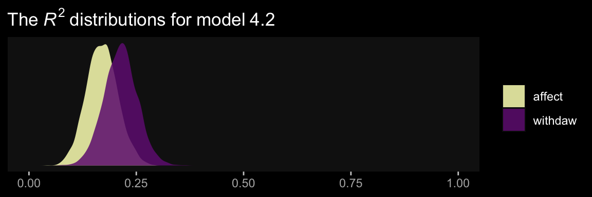
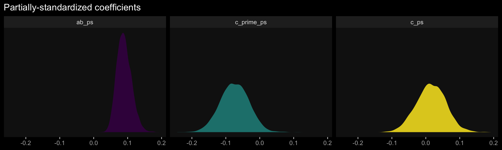

# Causal Steps, Confounding, and Causal Order


> Comfort with [the principles of the basic mediation model] allows you to conduct mediation analysis and use it to shed light on your research questions and hypotheses about causal processes. In this chapter, [we] take up a variety of complications, including testing and ruling out various alternative explanations for associations observed in a mediation analysis, effect size, and models with multiple causal agents and outcomes. [@hayesIntroductionMediationModeration2018, p. 113]

## What about Barron and Kenny?

> Complete and partial mediation are concepts that are deeply ingrained in the thinking of social and behavioral scientists. But I just don't see what they offer our understanding of a phenomenon. They are too sample-size-dependent and the distinction between them has no substantive or theoretical meaning or value of any consequence. I recommend avoiding expressing hypotheses about mediation or results of a mediation analysis using these terms. (p. 121)

Agreed.

## Confounding and causal order

> One of the beautiful features of experiments is the causal interpretations they afford about differences between groups. Good experimentation is tough and requires lots of careful planning and strict control over experimental procedures, construction of stimuli, treatment of participants, and so forth. But when done well, no research design gives a researcher more confidence in the claim that differences between groups defined by $X$ on some variable of interest is due to $X$ rather than something else. Given that a mediation model is a causal model, the ability to make unequivocal causal claims about the effect of $X$ on $M$ and the direct and total effects of $X$ on $Y$ gives experiments tremendous appeal.
>
> Absent random assignment to values of $X$, *all* of the associations in a mediation model are susceptible to confounding and epiphenomenal association, not just the association between $M$ and $Y$. Whether one’s design includes manipulation and random assignment of $X$ or not, it behooves the researcher to seriously ponder these potential threats to causal inference and, if possible, do something to reduce their plausibility as alternative explanations for associations observed. (pp. 121--122, *emphasis* in the original)

### Accounting for confounding and epiphenomenal association.

Here we load a couple necessary packages, load the data, and take a peek at them.


```r
library(tidyverse)

estress <- read_csv("data/estress/estress.csv")

glimpse(estress)
```

```
## Rows: 262
## Columns: 7
## $ tenure   <dbl> 1.67, 0.58, 0.58, 2.00, 5.00, 9.00, 0.00, 2.50, 0.50, 0.58, 9.00, 1.92, 2.00, 1.42, 0.92, 2…
## $ estress  <dbl> 6.0, 5.0, 5.5, 3.0, 4.5, 6.0, 5.5, 3.0, 5.5, 6.0, 5.5, 4.0, 3.0, 2.5, 3.5, 6.0, 4.0, 6.0, 3…
## $ affect   <dbl> 2.60, 1.00, 2.40, 1.16, 1.00, 1.50, 1.00, 1.16, 1.33, 3.00, 3.00, 2.00, 1.83, 1.16, 1.16, 1…
## $ withdraw <dbl> 3.00, 1.00, 3.66, 4.66, 4.33, 3.00, 1.00, 1.00, 2.00, 4.00, 4.33, 1.00, 5.00, 1.66, 4.00, 1…
## $ sex      <dbl> 1, 0, 1, 1, 1, 1, 0, 0, 1, 1, 1, 1, 1, 1, 1, 1, 1, 1, 0, 0, 0, 1, 1, 1, 0, 1, 0, 0, 0, 1, 0…
## $ age      <dbl> 51, 45, 42, 50, 48, 48, 51, 47, 40, 43, 57, 36, 33, 29, 33, 48, 40, 45, 37, 42, 54, 57, 37,…
## $ ese      <dbl> 5.33, 6.05, 5.26, 4.35, 4.86, 5.05, 3.66, 6.13, 5.26, 4.00, 2.53, 6.60, 5.20, 5.66, 5.66, 5…
```

As we learned in [Section 2.3][Alternative explanations for association], the `psych::lowerCor()` function makes it easy to estimate the lower triangle of a correlation matrix.


```r
psych::lowerCor(estress, digits = 3)
```

```
##          tenur  estrs  affct  wthdr  sex    age    ese   
## tenure    1.000                                          
## estress   0.068  1.000                                   
## affect   -0.065  0.340  1.000                            
## withdraw -0.035  0.064  0.417  1.000                     
## sex      -0.003  0.133  0.046  0.050  1.000              
## age       0.266  0.066 -0.018 -0.035  0.083  1.000       
## ese      -0.060 -0.158 -0.246 -0.243  0.028 -0.083  1.000
```

Let's open **brms**.


```r
library(brms)
```

Recall that if you want the correlations with Bayesian estimation and those sweet Bayesian credible intervals, you set up an intercept-only multivariate model.


```r
model4.1 <- 
  brm(data = estress, 
      family = gaussian,
      mvbind(ese, estress, affect, withdraw) ~ 1,
      cores = 4,
      file = "fits/model04.01")
```

Behold the summary.


```r
print(model4.1, digits = 3)
```

```
##  Family: MV(gaussian, gaussian, gaussian, gaussian) 
##   Links: mu = identity; sigma = identity
##          mu = identity; sigma = identity
##          mu = identity; sigma = identity
##          mu = identity; sigma = identity 
## Formula: ese ~ 1 
##          estress ~ 1 
##          affect ~ 1 
##          withdraw ~ 1 
##    Data: estress (Number of observations: 262) 
## Samples: 4 chains, each with iter = 2000; warmup = 1000; thin = 1;
##          total post-warmup samples = 4000
## 
## Population-Level Effects: 
##                    Estimate Est.Error l-95% CI u-95% CI  Rhat Bulk_ESS Tail_ESS
## ese_Intercept         5.606     0.059    5.489    5.721 1.000     6087     3218
## estress_Intercept     4.620     0.088    4.444    4.796 1.001     5433     2679
## affect_Intercept      1.599     0.044    1.513    1.683 1.000     4489     3143
## withdraw_Intercept    2.321     0.077    2.167    2.469 1.000     5598     3390
## 
## Family Specific Parameters: 
##                Estimate Est.Error l-95% CI u-95% CI  Rhat Bulk_ESS Tail_ESS
## sigma_ese         0.954     0.042    0.876    1.040 1.001     5494     3044
## sigma_estress     1.435     0.063    1.318    1.564 1.001     6330     3316
## sigma_affect      0.728     0.033    0.669    0.793 1.001     4932     2960
## sigma_withdraw    1.256     0.055    1.155    1.371 1.001     6103     3199
## 
## Residual Correlations: 
##                          Estimate Est.Error l-95% CI u-95% CI  Rhat Bulk_ESS Tail_ESS
## rescor(ese,estress)        -0.152     0.061   -0.267   -0.031 1.000     5891     2960
## rescor(ese,affect)         -0.238     0.058   -0.347   -0.120 1.001     4517     3361
## rescor(estress,affect)      0.334     0.055    0.221    0.439 1.000     4933     3637
## rescor(ese,withdraw)       -0.235     0.058   -0.346   -0.121 1.000     4695     2900
## rescor(estress,withdraw)    0.060     0.061   -0.060    0.179 1.000     5299     3310
## rescor(affect,withdraw)     0.410     0.050    0.307    0.503 1.002     4271     3132
## 
## Samples were drawn using sampling(NUTS). For each parameter, Bulk_ESS
## and Tail_ESS are effective sample size measures, and Rhat is the potential
## scale reduction factor on split chains (at convergence, Rhat = 1).
```

Since we have posteriors for the correlations, why not plot them? Here we take our base theme from the [**ggdark** package](https://CRAN.R-project.org/package=ggdark) [@R-ggdark] and our color scheme from the [**viridis** package](https://CRAN.R-project.org/package=viridis) [@R-viridis].


```r
library(ggdark)

posterior_samples(model4.1) %>% 
  pivot_longer(c(rescor__ese__estress, rescor__ese__affect, rescor__estress__withdraw)) %>% 
  
  ggplot(aes(x = value, fill = name)) +
  geom_density(alpha = .85, color = "transparent") +
  scale_fill_viridis_d(option = "D", direction = -1,
                       labels = c(expression(rho["ese, affect"]),
                                  expression(rho["ese, estress"]),
                                  expression(rho["estress, withdraw"])),
                       guide = guide_legend(label.hjust = 0,
                                            label.theme = element_text(size = 15, angle = 0, color = "white"),
                                            title.theme = element_blank())) +
  scale_x_continuous(NULL, limits = c(-1, 1)) +
  scale_y_continuous(NULL, breaks = NULL) +
  ggtitle("Our correlation density plot") +
  dark_theme_gray() +
  theme(panel.grid = element_blank())
```


In the last chapter, we said there were multiple ways to set up a multivariate model in **brms**. Our first approach was to externally define the submodels using the `bf()` function, save them as objects, and then include those objects within the `brm()` function. Another approach is to just define the separate `bf()` submodels directly in the `brm()` function, combining them with the `+` operator. That's the approach we will practice in this chapter. Here's what it looks like for our first mediation model.


```r
model4.2 <-
  brm(data = estress, 
      family = gaussian,
      bf(withdraw ~ 1 + estress + affect + ese + sex + tenure) +
        bf(affect ~ 1 + estress + ese + sex + tenure) +
        set_rescor(FALSE),
      cores = 4,
      file = "fits/model04.02")
```

Worked like a charm. Here's the summary.


```r
print(model4.2, digits = 3)
```

```
##  Family: MV(gaussian, gaussian) 
##   Links: mu = identity; sigma = identity
##          mu = identity; sigma = identity 
## Formula: withdraw ~ 1 + estress + affect + ese + sex + tenure 
##          affect ~ 1 + estress + ese + sex + tenure 
##    Data: estress (Number of observations: 262) 
## Samples: 4 chains, each with iter = 2000; warmup = 1000; thin = 1;
##          total post-warmup samples = 4000
## 
## Population-Level Effects: 
##                    Estimate Est.Error l-95% CI u-95% CI  Rhat Bulk_ESS Tail_ESS
## withdraw_Intercept    2.751     0.555    1.682    3.827 1.000     8821     3075
## affect_Intercept      1.787     0.307    1.184    2.405 1.001     8408     3091
## withdraw_estress     -0.094     0.052   -0.195    0.007 1.000     6796     3021
## withdraw_affect       0.706     0.105    0.497    0.905 1.002     8023     3389
## withdraw_ese         -0.212     0.076   -0.362   -0.067 1.000     8207     2875
## withdraw_sex          0.124     0.143   -0.151    0.407 1.002     7817     3372
## withdraw_tenure      -0.002     0.011   -0.023    0.019 1.002     8503     2670
## affect_estress        0.159     0.029    0.101    0.215 1.001     7860     2735
## affect_ese           -0.155     0.044   -0.242   -0.068 1.001     8602     3044
## affect_sex            0.014     0.087   -0.152    0.184 1.002     9100     2881
## affect_tenure        -0.011     0.006   -0.023    0.002 1.005     9255     2900
## 
## Family Specific Parameters: 
##                Estimate Est.Error l-95% CI u-95% CI  Rhat Bulk_ESS Tail_ESS
## sigma_withdraw    1.126     0.049    1.038    1.224 1.002     8534     3015
## sigma_affect      0.670     0.029    0.616    0.732 1.001     7602     3108
## 
## Samples were drawn using sampling(NUTS). For each parameter, Bulk_ESS
## and Tail_ESS are effective sample size measures, and Rhat is the potential
## scale reduction factor on split chains (at convergence, Rhat = 1).
```

In the printout, notice how first within intercepts and then with covariates and sigma, the coefficients are presented as for `withdraw` first and then `affect`. Also notice how the coefficients for the covariates are presented in the same order for each criterion variable. Hopefully that'll make it easier to sift through the printout. Happily, our coefficients are quite similar to those in Table 4.1.

Here are the $R^2$ summaries.


```r
bayes_R2(model4.2) %>% round(digits = 3)
```

```
##            Estimate Est.Error  Q2.5 Q97.5
## R2withdraw    0.212     0.038 0.137 0.286
## R2affect      0.170     0.036 0.100 0.240
```

These are also in the same ballpark, but a little higher. Why not glance at their densities?


```r
bayes_R2(model4.2, summary = F) %>% 
  data.frame() %>% 
  pivot_longer(everything()) %>% 
  
  ggplot(aes(x = value, fill = name)) +
  geom_density(color = "transparent", alpha = .85) +
  scale_fill_viridis_d(option = "A", begin = .33, direction = -1,
                       labels = c("affect", "withdaw"),
                       guide  = guide_legend(title.theme = element_blank())) +
  scale_x_continuous(NULL, limits = 0:1) +
  scale_y_continuous(NULL, breaks = NULL) +
  ggtitle(expression(The~italic(R)^2~distributions~"for"~model~4.2)) +
  dark_theme_gray() +
  theme(panel.grid = element_blank())
```



Here we retrieve the posterior samples, compute the indirect effect, and summarize the indirect effect with `quantile()`.


```r
post <-
  posterior_samples(model4.2) %>% 
  mutate(ab = b_affect_estress * b_withdraw_affect)

quantile(post$ab, probs = c(.5, .025, .975)) %>% 
  round(digits = 3)
```

```
##   50%  2.5% 97.5% 
## 0.111 0.065 0.168
```

The results are similar to those in the text (p. 127). Here's what it looks like.


```r
post %>% 
  ggplot(aes(x = ab)) +
  geom_density(aes(fill = factor(0)),
               color = "transparent", show.legend = F) +
  geom_vline(xintercept = quantile(post$ab, probs = c(.5, .025, .975)),
             color = "black", linetype = c(1, 3, 3)) +
  scale_fill_viridis_d(option = "A", begin = .6) +
  scale_y_continuous(NULL, breaks = NULL) +
  xlab(expression(italic(ab))) +
  dark_theme_gray() +
  theme(panel.grid = element_blank())
```


Once again, those sweet Bayesian credible intervals get the job done.

Here's a way to get both the direct effect, $c'$ (i.e., `b_withdraw_estress`), and the total effect, $c$ (i.e., $c'$ + $ab$) of `estress` on `withdraw`.


```r
post %>% 
  mutate(c       = b_withdraw_estress + ab,
         c_prime = b_withdraw_estress) %>% 
  pivot_longer(c(c_prime, c)) %>% 
  group_by(name) %>% 
  summarize(mean = mean(value), 
            ll   = quantile(value, probs = .025),
            ul   = quantile(value, probs = .975)) %>% 
  mutate_if(is_double, round, digits = 3)
```

```
## # A tibble: 2 x 4
##   name      mean     ll    ul
##   <chr>    <dbl>  <dbl> <dbl>
## 1 c        0.018 -0.084 0.121
## 2 c_prime -0.094 -0.195 0.007
```

Both appear pretty small. Which leads us to the next section...

## Effect size

> The quantification of effect size in mediation analysis is an evolving area of thought and research. [Hayes described] two measures of effect size that apply to the direct, indirect, and total effects in a mediation model.... For an excellent discussion of measures of effect size in mediation analysis, see Preacher and Kelley [-@preacherEffectSizeMeasures2011]. [We will] use their notation below. (p. 133)

### The partially standardized effect.

We get $SD$s using the `sd()` function. Here's the $SD$ for our $Y$ variable, `withdraw`.


```r
sd(estress$withdraw)
```

```
## [1] 1.24687
```

Here we compute the partially standardized effect sizes for $c'$ and $ab$ by dividing those vectors in our `post` object by `sd(estress$withdraw)`, which we saved as `sd_y`.


```r
sd_y <- sd(estress$withdraw)

post %>% 
  mutate(c_prime_ps = b_withdraw_estress / sd_y,
         ab_ps      = ab / sd_y) %>% 
  mutate(c_ps = c_prime_ps + ab_ps) %>% 
  pivot_longer(c(c_prime_ps, ab_ps, c_ps)) %>% 
  group_by(name) %>% 
  summarize(mean   = mean(value), 
            median = median(value),
            ll     = quantile(value, probs = .025),
            ul     = quantile(value, probs = .975)) %>% 
  mutate_if(is_double, round, digits = 3)
```

```
## # A tibble: 3 x 5
##   name         mean median     ll    ul
##   <chr>       <dbl>  <dbl>  <dbl> <dbl>
## 1 ab_ps       0.09   0.089  0.052 0.135
## 2 c_prime_ps -0.075 -0.075 -0.156 0.005
## 3 c_ps        0.015  0.015 -0.067 0.097
```

The results are similar, though not identical, to those in the text. Here we have both rounding error and estimation differences at play. The plots:


```r
post %>% 
  mutate(c_prime_ps = b_withdraw_estress / sd_y,
         ab_ps      = ab / sd_y) %>% 
  mutate(c_ps = c_prime_ps + ab_ps) %>% 
  pivot_longer(c(c_prime_ps, ab_ps, c_ps)) %>% 

  ggplot(aes(x = value, fill = name)) +
  geom_density(alpha = .85, color = "transparent") +
  scale_fill_viridis_d(option = "D", breaks = NULL) +
  scale_y_continuous(NULL, breaks = NULL) +
  labs(title = "Partially-standardized coefficients",
       x = NULL) +
  dark_theme_gray() +
  theme(panel.grid = element_blank()) +
  facet_wrap(~ name, ncol = 3)
```



On page 135, Hayes revisited the model from [Section 3.3][Example with dichotomous $X$: The influence of presumed media influence]. We'll have to reload the data and refit that model to follow along. First, load the data.


```r
pmi <- read_csv("data/pmi/pmi.csv")
```

Refit the model, this time with the `bf()` statements defined right within `brm()`.


```r
model4.3 <-
  brm(data = pmi, 
      family = gaussian,
       bf(reaction ~ 1 + pmi + cond) + 
        bf(pmi ~ 1 + cond) + 
        set_rescor(FALSE),
      cores = 4,
      file = "fits/model04.03")
```

The partially-standardized parameters require some `posterior_samples()` wrangling.


```r
post <- posterior_samples(model4.3)

sd_y <- sd(pmi$reaction)

post %>% 
  mutate(ab      = b_pmi_cond * b_reaction_pmi,
         c_prime = b_reaction_cond) %>% 
  mutate(ab_ps      = ab / sd_y,
         c_prime_ps = c_prime / sd_y) %>% 
  mutate(c_ps = c_prime_ps + ab_ps) %>% 
  pivot_longer(c(c_prime_ps, ab_ps, c_ps)) %>%
  group_by(name) %>% 
  summarize(mean   = mean(value), 
            median = median(value),
            ll     = quantile(value, probs = .025),
            ul     = quantile(value, probs = .975)) %>% 
  mutate_if(is_double, round, digits = 3)
```

```
## # A tibble: 3 x 5
##   name        mean median     ll    ul
##   <chr>      <dbl>  <dbl>  <dbl> <dbl>
## 1 ab_ps      0.154  0.148  0.007 0.331
## 2 c_prime_ps 0.161  0.16  -0.164 0.493
## 3 c_ps       0.315  0.317 -0.042 0.657
```

Happily, these results are closer to those in the text than with the previous example.

### The completely standardized effect.

**Note**. Hayes could have made this clearer in the text, but the `estress` model he referred to in this section was the one from way back in [Section 3.5][An example with continuous $X$: Economic stress among small-business owners], _not_ the one from earlier in this chapter.

One way to get a standardized solution is to standardize the variables in the data and then fit the model with those standardized variables. To do so, we'll revisit our custom `standardize()`, put it to work, and fit the standardized version of the model from Section 3.5, which we'll call `model4.4`.


```r
# make the function
sandardize <- function(x) {
  (x - mean(x)) / sd(x)
}

# use the function
estress <-
  estress %>% 
  mutate(withdraw_z = sandardize(withdraw), 
         estress_z  = sandardize(estress), 
         affect_z   = sandardize(affect))
```

Fit the model.


```r
model4.4 <-
  brm(data = estress, 
      family = gaussian,
      bf(withdraw_z ~ 1 + estress_z + affect_z) + 
        bf(affect_z ~ 1 + estress_z) + 
        set_rescor(FALSE),
      cores = 4,
      file = "fits/model04.04")
```

Here they are, our newly standardized coefficients.


```r
fixef(model4.4) %>% round(digits = 3)
```

```
##                     Estimate Est.Error   Q2.5 Q97.5
## withdrawz_Intercept    0.000     0.057 -0.115 0.117
## affectz_Intercept      0.000     0.059 -0.113 0.118
## withdrawz_estress_z   -0.088     0.059 -0.206 0.027
## withdrawz_affect_z     0.445     0.059  0.329 0.560
## affectz_estress_z      0.339     0.059  0.224 0.454
```

Here we do the wrangling necessary to spell out the standardized effects for $ab$, $c'$, and $c$.


```r
posterior_samples(model4.4) %>% 
  mutate(ab_s      = b_affectz_estress_z * b_withdrawz_affect_z,
         c_prime_s = b_withdrawz_estress_z) %>%
  mutate(c_s = ab_s + c_prime_s) %>% 
  pivot_longer(c(c_prime_s, ab_s, c_s)) %>%
  group_by(name) %>% 
  summarize(mean   = mean(value), 
            median = median(value),
            ll     = quantile(value, probs = .025),
            ul     = quantile(value, probs = .975)) %>% 
  mutate_if(is_double, round, digits = 3)
```

```
## # A tibble: 3 x 5
##   name        mean median     ll    ul
##   <chr>      <dbl>  <dbl>  <dbl> <dbl>
## 1 ab_s       0.151  0.149  0.091 0.22 
## 2 c_prime_s -0.088 -0.087 -0.206 0.027
## 3 c_s        0.063  0.063 -0.057 0.183
```

Let's confirm that we can recover these values by applying the formulas on page 135 to the unstandardized model, which we'll call `model4.5`. First, we'll have to fit that model since we haven't fit that one since Chapter 3.


```r
model4.5 <-
  brm(data = estress, 
      family = gaussian,
      bf(withdraw ~ 1 + estress + affect) + 
        bf(affect ~ 1 + estress) + 
        set_rescor(FALSE),
      cores = 4,
      file = "fits/model04.05")
```

Check the unstandardized coefficient summaries.


```r
fixef(model4.5) %>% round(digits = 3)
```

```
##                    Estimate Est.Error   Q2.5 Q97.5
## withdraw_Intercept    1.449     0.251  0.953 1.938
## affect_Intercept      0.800     0.146  0.511 1.080
## withdraw_estress     -0.077     0.054 -0.181 0.029
## withdraw_affect       0.770     0.103  0.572 0.969
## affect_estress        0.173     0.030  0.116 0.232
```

On pages 135--136, Hayes provided the formulas to compute the standardized effects, which are

\begin{align*}
c'_{cs} & = \frac{SD_X(c')}{SD_{Y}} = SD_{X}(c'_{ps}), \\
ab_{cs} & = \frac{SD_X(ab)}{SD_{Y}} = SD_{X}(ab_{ps}), \text{and} \\
c_{cs}  & = \frac{SD_X(c)}{SD_{Y}} = c'_{cs} + ab_{ps},
\end{align*}

where the $ps$ subscript indicates *partially standardized*. Here we put them in action to standardize the unstandardized results.


```r
sd_x <- sd(estress$estress)
sd_y <- sd(estress$withdraw)

posterior_samples(model4.5) %>% 
  mutate(ab      = b_affect_estress * b_withdraw_affect,
         c_prime = b_withdraw_estress) %>% 
  mutate(ab_s      = (sd_x * ab) / sd_y,
         c_prime_s = (sd_x * c_prime) / sd_y) %>% 
  mutate(c_s = ab_s + c_prime_s) %>% 
  pivot_longer(c(c_prime_s, ab_s, c_s)) %>%
  group_by(name) %>% 
  summarize(mean   = mean(value), 
            median = median(value),
            ll     = quantile(value, probs = .025),
            ul     = quantile(value, probs = .975)) %>% 
  mutate_if(is_double, round, digits = 3)
```

```
## # A tibble: 3 x 5
##   name        mean median     ll    ul
##   <chr>      <dbl>  <dbl>  <dbl> <dbl>
## 1 ab_s       0.152  0.15   0.092 0.224
## 2 c_prime_s -0.088 -0.089 -0.206 0.033
## 3 c_s        0.064  0.064 -0.063 0.189
```

Success!

### Some (problematic) measures only for indirect effects.

Hayes recommended against these, so I'm not going to bother working any examples.

## Statistical power

As Hayes discussed, power is an important but thorny issue within the frequentist paradigm. Given that we're not particularly interested in rejecting the point-null hypothesis as Bayesians and that we bring in priors (which we've largely avoided explicitly mentioning in his project but have been quietly using all along), the issue is even more difficult for Bayesians. To learn more on the topic, check out Chapter 13 in Kruschke's [-@kruschkeDoingBayesianData2015] [text](https://sites.google.com/site/doingbayesiandataanalysis/); Miočević, MacKinnon, and Levy's [-@miocevicPowerBayesianMediation2017] [paper](https://www.tandfonline.com/doi/abs/10.1080/10705511.2017.1312407?src=recsys&journalCode=hsem20) on power in small-sample Bayesian analyses; or Gelman and Carlin's [-@gelmanPowerCalculationsAssessing2014] [paper](http://journals.sagepub.com/doi/pdf/10.1177/1745691614551642) offering an alternative to the power paradigm. You might look at Matti Vuorre's [Sample size planning with brms](https://gitlab.com/vuorre/bayesplan) project. And finally, I have a series of blog posts on Bayesian power analyses. You can find the first post [here](https://solomonkurz.netlify.com/post/bayesian-power-analysis-part-i/).

## Multiple $X$s or $Y$s: Analyze separately or simultaneously?

"Researchers sometimes propose that several causal agents ($X$ variables simultaneously transmit their effects on the same outcome through the same mediator(s)" (p. 141).

### Multiple $X$ variables.

> The danger in including multiple $X$'s in a mediation model, as when including statistical controls, is the possibility that highly correlated $X$s will cancel out each other’s effects. This is a standard concern in linear models involving correlated predictors. Two $X$ variables (or an $X$ variable and a control variable) highly correlated with each other may also both be correlated with $M$ or $Y$, so when they are both included as predictors of $M$ or $Y$ in a mediation model, they compete against each other in their attempt to explain variation in $M$ and $Y$. Their regression coefficients quantify their unique association with the model's mediator and outcome variable(s). at the extreme, the two variables end up performing like two boxers in the ring simultaneously throwing a winning blow at the other at precisely the same time. Both get knocked out and neither goes away appearing worthy of a prize. The stronger the associations between the variables in the model, the greater the potential of such a problem. (pp. 143--144)

The same basic problems with multicollinearity applies to the Bayesian paradigm, too.

### Estimation of a model with multiple $X$ variables in ~~PROCESS~~ brms.

Hayes discussed the limitation that his PROCESS program may only handle a single $X$ variable in the `x=` part of the command line, for which he displayed a workaround. We don't have such a limitation in **brms**. Using Hayes's hypothetical data syntax for a model with three $X$s, the **brms** code would be like this.


```r
model4.6 <-
  brm(data = data, 
      family = gaussian,
      bf(dv ~ 1 + iv1 + iv2 + iv3 + med) + 
        bf(med ~ 1 + iv1 + iv2 + iv3) + 
        set_rescor(FALSE),
      cores = 4)
```

To show it in action, let's simulate some data.


```r
n <- 1e3

set.seed(4.5)
d <-
  tibble(iv1 = rnorm(n, mean = 0, sd = 1),
         iv2 = rnorm(n, mean = 0, sd = 1),
         iv3 = rnorm(n, mean = 0, sd = 1)) %>% 
  mutate(med = rnorm(n, mean = 0 + iv1 * -1 + iv2 * 0 + iv3 * 1, sd = 1),
         dv  = rnorm(n, mean = 0 + iv1 * 0 + iv2 * .5 + iv3 * 1 + med * .5, sd = 1))

head(d)
```

```
## # A tibble: 6 x 5
##      iv1    iv2     iv3    med     dv
##    <dbl>  <dbl>   <dbl>  <dbl>  <dbl>
## 1  0.217  0.177 -1.39   -0.755 -1.77 
## 2 -0.542  1.69   0.0513  0.721  0.402
## 3  0.891 -1.35   1.10    0.777 -0.132
## 4  0.596  1.08  -0.203  -0.955  1.02 
## 5  1.64  -0.456 -0.428  -2.89  -3.26 
## 6  0.689 -0.681 -0.429  -0.462 -2.38
```

Before we proceed, if data simulation is new to you, you might check out [Roger Peng](https://twitter.com/rdpeng)'s [helpful tutorial](https://www.youtube.com/watch?v=tvv4IA8PEzw) or [this great post](https://aosmith.rbind.io/2018/08/29/getting-started-simulating-data/) by [Ariel Muldoon](https://twitter.com/aosmith16).

Here we fit the model.


```r
model4.6 <-
  brm(data = d, 
      family = gaussian,
      bf(dv ~ 1 + iv1 + iv2 + iv3 + med) + 
        bf(med ~ 1 + iv1 + iv2 + iv3) + 
        set_rescor(FALSE),
      cores = 4,
      file = "fits/model04.06")
```

Behold the results.


```r
print(model4.6)
```

```
##  Family: MV(gaussian, gaussian) 
##   Links: mu = identity; sigma = identity
##          mu = identity; sigma = identity 
## Formula: dv ~ 1 + iv1 + iv2 + iv3 + med 
##          med ~ 1 + iv1 + iv2 + iv3 
##    Data: d (Number of observations: 1000) 
## Samples: 4 chains, each with iter = 2000; warmup = 1000; thin = 1;
##          total post-warmup samples = 4000
## 
## Population-Level Effects: 
##               Estimate Est.Error l-95% CI u-95% CI Rhat Bulk_ESS Tail_ESS
## dv_Intercept     -0.01      0.03    -0.07     0.05 1.00     5563     2948
## med_Intercept     0.00      0.03    -0.06     0.06 1.01     5932     2990
## dv_iv1            0.02      0.04    -0.06     0.11 1.00     2936     3181
## dv_iv2            0.56      0.03     0.50     0.62 1.00     5294     3120
## dv_iv3            1.01      0.05     0.92     1.10 1.00     2647     2918
## dv_med            0.46      0.03     0.40     0.53 1.00     2276     3057
## med_iv1          -0.93      0.03    -0.99    -0.87 1.00     5722     2991
## med_iv2           0.03      0.03    -0.03     0.09 1.00     6016     3358
## med_iv3           0.98      0.03     0.92     1.04 1.00     5080     3188
## 
## Family Specific Parameters: 
##           Estimate Est.Error l-95% CI u-95% CI Rhat Bulk_ESS Tail_ESS
## sigma_dv      1.00      0.02     0.96     1.05 1.00     6096     3420
## sigma_med     0.97      0.02     0.93     1.02 1.00     6141     2674
## 
## Samples were drawn using sampling(NUTS). For each parameter, Bulk_ESS
## and Tail_ESS are effective sample size measures, and Rhat is the potential
## scale reduction factor on split chains (at convergence, Rhat = 1).
```

Good old `brms::brm()` came through just fine. If you wanted to simulate data with a particular correlation structure for the `iv` variables, you might use the `mvnorm()` function from the [**MASS** package](https://CRAN.R-project.org/package=MASS) [@R-MASS], about which you might learn more [here](http://blog.revolutionanalytics.com/2016/02/multivariate_data_with_r.html).

### Multiple $Y$ variables.

We've already been using the multivariate syntax in **brms** for our simple mediation models. Fitting a mediation model with multiple $Y$ variables is a minor extension. To see, let's simulate more data.


```r
n <- 1e3

set.seed(4.5)
d <-
  tibble(iv = rnorm(n, mean = 0, sd = 1)) %>% 
  mutate(med = rnorm(n, mean = 0 + iv * .5, sd = 1)) %>% 
  mutate(dv1 = rnorm(n, mean = 0 + iv * -1 + med * 0,  sd = 1),
         dv2 = rnorm(n, mean = 0 + iv * 0  + med * .5, sd = 1),
         dv3 = rnorm(n, mean = 0 + iv * 1  + med * 1,  sd = 1))

head(d)
```

```
## # A tibble: 6 x 5
##       iv    med    dv1    dv2     dv3
##    <dbl>  <dbl>  <dbl>  <dbl>   <dbl>
## 1  0.217  0.285 -1.61   0.999  0.420 
## 2 -0.542  1.42   0.594  0.836  0.0208
## 3  0.891 -0.902  0.206  0.120 -0.954 
## 4  0.596  1.37  -0.799  0.530  3.13  
## 5  1.64   0.362 -2.06  -0.643  0.840 
## 6  0.689 -0.337 -1.12   0.487 -1.03
```

Fitting this model requires a slew of `bf()` statements.


```r
model4.7 <-
  brm(data = d, 
      family = gaussian,
      bf(dv1 ~ 1 + iv + med) + 
        bf(dv2 ~ 1 + iv + med) + 
        bf(dv3 ~ 1 + iv + med) + 
        bf(med ~ 1 + iv) + 
        set_rescor(FALSE),
      cores = 4,
      file = "fits/model04.07")
```


```r
print(model4.7)
```

```
##  Family: MV(gaussian, gaussian, gaussian, gaussian) 
##   Links: mu = identity; sigma = identity
##          mu = identity; sigma = identity
##          mu = identity; sigma = identity
##          mu = identity; sigma = identity 
## Formula: dv1 ~ 1 + iv + med 
##          dv2 ~ 1 + iv + med 
##          dv3 ~ 1 + iv + med 
##          med ~ 1 + iv 
##    Data: d (Number of observations: 1000) 
## Samples: 4 chains, each with iter = 2000; warmup = 1000; thin = 1;
##          total post-warmup samples = 4000
## 
## Population-Level Effects: 
##               Estimate Est.Error l-95% CI u-95% CI Rhat Bulk_ESS Tail_ESS
## dv1_Intercept     0.01      0.03    -0.05     0.07 1.00     7782     2950
## dv2_Intercept     0.00      0.03    -0.06     0.06 1.00     9468     2665
## dv3_Intercept    -0.01      0.03    -0.07     0.05 1.00     8215     3088
## med_Intercept     0.03      0.03    -0.04     0.09 1.00     8338     2614
## dv1_iv           -1.05      0.04    -1.12    -0.98 1.00     7263     3775
## dv1_med           0.05      0.03    -0.01     0.11 1.00     6496     3123
## dv2_iv            0.05      0.04    -0.01     0.12 1.00     7273     3579
## dv2_med           0.53      0.03     0.47     0.59 1.00     7052     3400
## dv3_iv            1.03      0.04     0.96     1.10 1.00     6657     3425
## dv3_med           1.06      0.03     1.00     1.12 1.00     7032     3216
## med_iv            0.53      0.03     0.46     0.59 1.00     9368     3051
## 
## Family Specific Parameters: 
##           Estimate Est.Error l-95% CI u-95% CI Rhat Bulk_ESS Tail_ESS
## sigma_dv1     0.98      0.02     0.93     1.02 1.00     9337     2811
## sigma_dv2     0.97      0.02     0.93     1.02 1.00     8831     2717
## sigma_dv3     1.00      0.02     0.96     1.05 1.00     9864     3125
## sigma_med     1.00      0.02     0.96     1.04 1.00     9883     2936
## 
## Samples were drawn using sampling(NUTS). For each parameter, Bulk_ESS
## and Tail_ESS are effective sample size measures, and Rhat is the potential
## scale reduction factor on split chains (at convergence, Rhat = 1).
```

Once again, **brms** to the rescue!

## Chapter summary

> Statistical mediation analysis has changed since the publication of Baron and Kenny [-@baronModeratorMediatorVariable1986]. The heyday of the causal steps "criteria to establish mediation" approach is over. Also disappearing in the 21 century is a concern about whether a process can be labeled as complete or partial mediation. Modern mediation analysis emphasizes an explicit estimation of the indirect effect, inferential tests of the indirect effect that don't make unnecessary assumptions, and an acknowledgement that evidence of a statistically significant association between $X$ and $Y$ is not necessary to talk about a model intervening variable process (in which case the concepts of complete and partial mediation simply don't make sense). (p. 146)

To this, I'll just point out Hayes is speaking from a frequentist hypothesis-testing orientation. If you would like to dwell on significance tests, you certainty can. But particularly from within the Bayesian paradigm, you just don't need to.

## Session info {-}


```r
sessionInfo()
```

```
## R version 4.0.4 (2021-02-15)
## Platform: x86_64-apple-darwin17.0 (64-bit)
## Running under: macOS Catalina 10.15.7
## 
## Matrix products: default
## BLAS:   /Library/Frameworks/R.framework/Versions/4.0/Resources/lib/libRblas.dylib
## LAPACK: /Library/Frameworks/R.framework/Versions/4.0/Resources/lib/libRlapack.dylib
## 
## locale:
## [1] en_US.UTF-8/en_US.UTF-8/en_US.UTF-8/C/en_US.UTF-8/en_US.UTF-8
## 
## attached base packages:
## [1] stats     graphics  grDevices utils     datasets  methods   base     
## 
## other attached packages:
##  [1] ggdark_0.2.1    brms_2.15.0     Rcpp_1.0.6      forcats_0.5.1   stringr_1.4.0   dplyr_1.0.6    
##  [7] purrr_0.3.4     readr_1.4.0     tidyr_1.1.3     tibble_3.1.2    ggplot2_3.3.5   tidyverse_1.3.1
## 
## loaded via a namespace (and not attached):
##   [1] readxl_1.3.1         backports_1.2.1      plyr_1.8.6           igraph_1.2.6         splines_4.0.4       
##   [6] crosstalk_1.1.0.1    TH.data_1.0-10       rstantools_2.1.1     inline_0.3.17        digest_0.6.27       
##  [11] htmltools_0.5.1.1    rsconnect_0.8.16     fansi_0.4.2          magrittr_2.0.1       modelr_0.1.8        
##  [16] RcppParallel_5.0.2   matrixStats_0.57.0   xts_0.12.1           sandwich_3.0-0       prettyunits_1.1.1   
##  [21] colorspace_2.0-0     rvest_1.0.1          haven_2.3.1          xfun_0.23            callr_3.7.0         
##  [26] crayon_1.4.1         jsonlite_1.7.2       lme4_1.1-25          survival_3.2-10      zoo_1.8-8           
##  [31] glue_1.4.2           gtable_0.3.0         emmeans_1.5.2-1      V8_3.4.0             pkgbuild_1.2.0      
##  [36] rstan_2.21.2         abind_1.4-5          scales_1.1.1         mvtnorm_1.1-1        DBI_1.1.0           
##  [41] miniUI_0.1.1.1       viridisLite_0.4.0    xtable_1.8-4         tmvnsim_1.0-2        stats4_4.0.4        
##  [46] StanHeaders_2.21.0-7 DT_0.16              htmlwidgets_1.5.3    httr_1.4.2           threejs_0.3.3       
##  [51] ellipsis_0.3.2       farver_2.1.0         pkgconfig_2.0.3      loo_2.4.1            sass_0.3.1          
##  [56] dbplyr_2.1.1         utf8_1.2.1           labeling_0.4.2       tidyselect_1.1.1     rlang_0.4.11        
##  [61] reshape2_1.4.4       later_1.2.0          munsell_0.5.0        cellranger_1.1.0     tools_4.0.4         
##  [66] cli_3.0.1            generics_0.1.0       broom_0.7.6          ggridges_0.5.3       evaluate_0.14       
##  [71] fastmap_1.1.0        processx_3.5.2       knitr_1.33           fs_1.5.0             nlme_3.1-152        
##  [76] mime_0.10            projpred_2.0.2       xml2_1.3.2           compiler_4.0.4       bayesplot_1.8.0     
##  [81] shinythemes_1.1.2    rstudioapi_0.13      gamm4_0.2-6          curl_4.3             reprex_2.0.0        
##  [86] statmod_1.4.35       bslib_0.2.4          stringi_1.6.2        highr_0.9            ps_1.6.0            
##  [91] Brobdingnag_1.2-6    lattice_0.20-41      Matrix_1.3-2         psych_2.1.3          nloptr_1.2.2.2      
##  [96] markdown_1.1         shinyjs_2.0.0        vctrs_0.3.8          pillar_1.6.1         lifecycle_1.0.0     
## [101] jquerylib_0.1.4      bridgesampling_1.0-0 estimability_1.3     httpuv_1.6.0         R6_2.5.0            
## [106] bookdown_0.22        promises_1.2.0.1     gridExtra_2.3        codetools_0.2-18     boot_1.3-26         
## [111] colourpicker_1.1.0   MASS_7.3-53          gtools_3.8.2         assertthat_0.2.1     withr_2.4.2         
## [116] shinystan_2.5.0      mnormt_2.0.2         multcomp_1.4-16      mgcv_1.8-33          parallel_4.0.4      
## [121] hms_1.1.0            grid_4.0.4           coda_0.19-4          minqa_1.2.4          rmarkdown_2.8       
## [126] shiny_1.6.0          lubridate_1.7.10     base64enc_0.1-3      dygraphs_1.1.1.6
```


