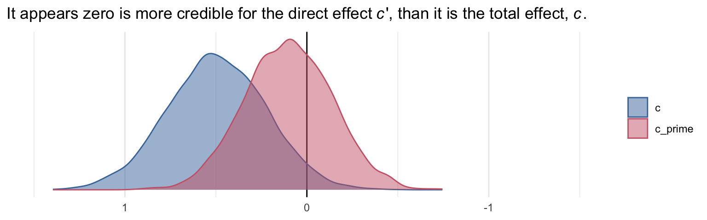
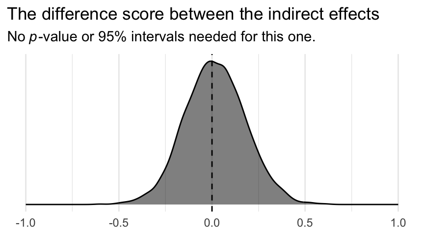

# More Than One Mediator


In this chapter we'll explore

> models with more than one mediator. [We will] focus on two forms of the multiple mediator model defined by whether the mediators are linked together in a causal chain (the *serial* multiple mediator model) or are merely allowed to correlate bot not causally influence another mediator in the model (the *parallel* multiple mediator model). [We'll] also discuss models that blend parallel and serial processes. [@hayesIntroductionMediationModeration2018, p. 149, *emphasis* in the original]

## The parallel multiple mediator model

Going from one to multiple mediators can be a big step up, conceptually. But from a model fitting perspective, it often isn't that big of a deal. We just have more parameters.

### Direct and indirect effects in a parallel multiple mediator model.

With multiple mediators, we use the language of *specific indirect effects*. We also add the notion of a total indirect effect, following the form

$$\text{Total indirect effect of } X \text{ on } Y = \sum_{i = 1}^k a_i b_i,$$

where $k$ is the number of mediator variables. Thus, the total effect of $X$ on $Y$ is

$$c = c' + \sum_{i = 1}^k a_i b_i.$$

## Example using the presumed media influence study

Here we load a couple necessary packages, load the data, and take a `glimpse()`.


```r
library(tidyverse)

pmi <- read_csv("data/pmi/pmi.csv")

glimpse(pmi)
```

```
## Rows: 123
## Columns: 6
## $ cond     <dbl> 1, 0, 1, 0, 0, 0, 0, 1, 0, 0, 1, 0, 1, 0, 1, 1, 0, 0, 1, 0, 1, 1, 1, 1, 1, 0, 1, 0, 1, 0, 0…
## $ pmi      <dbl> 7.0, 6.0, 5.5, 6.5, 6.0, 5.5, 3.5, 6.0, 4.5, 7.0, 1.0, 6.0, 5.0, 7.0, 7.0, 7.0, 4.5, 3.5, 7…
## $ import   <dbl> 6, 1, 6, 6, 5, 1, 1, 6, 6, 6, 3, 3, 4, 7, 1, 6, 3, 3, 2, 4, 4, 6, 7, 4, 5, 4, 6, 5, 5, 7, 4…
## $ reaction <dbl> 5.25, 1.25, 5.00, 2.75, 2.50, 1.25, 1.50, 4.75, 4.25, 6.25, 1.25, 2.75, 3.75, 5.00, 4.00, 5…
## $ gender   <dbl> 1, 1, 1, 0, 1, 1, 0, 1, 1, 1, 0, 0, 0, 0, 0, 0, 0, 0, 0, 1, 0, 0, 1, 1, 0, 1, 0, 0, 0, 1, 0…
## $ age      <dbl> 51.0, 40.0, 26.0, 21.0, 27.0, 25.0, 23.0, 25.0, 22.0, 24.0, 22.0, 21.0, 23.0, 21.0, 22.0, 2…
```

Now load **brms**.


```r
library(brms)
```

Bayesian correlations, recall, just take an intercepts-only multivariate model.


```r
model5.1 <- 
  brm(data = pmi, 
      family = gaussian,
      mvbind(pmi, import) ~ 1,
      cores = 4,
      file = "fits/model05.01")
```

A little indexing with the `posterior_summary()` function will get us the Bayesian correlation with its posterior $SD$ and intervals.


```r
posterior_summary(model5.1)["rescor__pmi__import", ] %>% round(digits = 3)
```

```
##  Estimate Est.Error      Q2.5     Q97.5 
##     0.274     0.085     0.100     0.432
```

As with single mediation models, the multiple mediation model requires we carefully construct the formula for each criterion. Here we'll use the multiple `bf()` approach from Chapter 3.


```r
m1_model <- bf(import   ~ 1 + cond)
m2_model <- bf(pmi      ~ 1 + cond)
y_model  <- bf(reaction ~ 1 + import + pmi + cond)
```

And now we fit the model.


```r
model5.2 <-
  brm(data = pmi, 
      family = gaussian,
      y_model + m1_model + m2_model + set_rescor(FALSE),
      cores = 4,
      file = "fits/model05.02")
```


```r
print(model5.2, digits = 3)
```

```
##  Family: MV(gaussian, gaussian, gaussian) 
##   Links: mu = identity; sigma = identity
##          mu = identity; sigma = identity
##          mu = identity; sigma = identity 
## Formula: reaction ~ 1 + import + pmi + cond 
##          import ~ 1 + cond 
##          pmi ~ 1 + cond 
##    Data: pmi (Number of observations: 123) 
## Samples: 4 chains, each with iter = 2000; warmup = 1000; thin = 1;
##          total post-warmup samples = 4000
## 
## Population-Level Effects: 
##                    Estimate Est.Error l-95% CI u-95% CI  Rhat Bulk_ESS Tail_ESS
## reaction_Intercept   -0.143     0.541   -1.172    0.904 1.002     7069     3209
## import_Intercept      3.907     0.213    3.500    4.322 1.001     7880     2875
## pmi_Intercept         5.378     0.166    5.057    5.697 1.001     9490     2980
## reaction_import       0.324     0.071    0.183    0.459 1.002     7690     3332
## reaction_pmi          0.396     0.095    0.206    0.583 1.000     6487     2884
## reaction_cond         0.100     0.241   -0.382    0.576 1.001     9043     2545
## import_cond           0.624     0.305    0.027    1.225 1.001     7996     3082
## pmi_cond              0.475     0.233    0.021    0.936 1.002    10060     2831
## 
## Family Specific Parameters: 
##                Estimate Est.Error l-95% CI u-95% CI  Rhat Bulk_ESS Tail_ESS
## sigma_reaction    1.302     0.085    1.144    1.482 1.000     8816     2803
## sigma_import      1.727     0.109    1.533    1.955 1.002     7617     2894
## sigma_pmi         1.318     0.089    1.155    1.505 1.000     8597     2332
## 
## Samples were drawn using sampling(NUTS). For each parameter, Bulk_ESS
## and Tail_ESS are effective sample size measures, and Rhat is the potential
## scale reduction factor on split chains (at convergence, Rhat = 1).
```

Because we have three criterion variables, we'll have three Bayesian $R^2$ posteriors.


```r
library(ggthemes)

bayes_R2(model5.2, summary = F) %>% 
  data.frame() %>% 
  pivot_longer(everything()) %>% 
  mutate(name = str_remove(name, "R2")) %>% 
  
  ggplot(aes(x = value, color = name, fill = name)) +
  geom_density(alpha = .5) +
  scale_color_ptol() +
  scale_fill_ptol() +
  scale_x_continuous(NULL, limits = 0:1) +
  scale_y_continuous(NULL, breaks = NULL) +
  labs(title = expression(Our~italic(R)^{2}~distributions),
       subtitle = "The densities for import and pmi are asymmetric, small, and largely overlapping.\nThe density for reaction is approximately Gaussian and more impressive in magnitude.") +
  theme_minimal() +
  theme(legend.title = element_blank())
```


It'll take a bit of data wrangling to rename our model parameters to the $a$, $b$... configuration. We'll compute the indirect effects and $c$, too.


```r
post <- posterior_samples(model5.2)

post <-
  post %>% 
  mutate(a1 = b_import_cond,
         a2 = b_pmi_cond,
         b1 = b_reaction_import,
         b2 = b_reaction_pmi,
         c_prime = b_reaction_cond) %>% 
  mutate(a1b1 = a1 * b1,
         a2b2 = a2 * b2) %>% 
  mutate(c = c_prime + a1b1 + a2b2)
```

Next we compute their summaries. Since Bayesians use means, medians, and sometimes the mode to describe the central tendencies of a parameter, this time we'll mix it up and just use the median.

We've been summarizing our posteriors within the `summarize()` function. This approach gives us a lot of control. It's also on the verbose side. Another approach is to use a family of functions from the [**tidybayes** package](https://mjskay.github.io/tidybayes/index.html). Here we'll use `median_qi()` to give us the posterior medians and quantile-based 95% intervals for our parameters of interest.


```r
library(tidybayes)

post %>% 
  pivot_longer(a1:c) %>% 
  group_by(name) %>% 
  median_qi(value)
```

```
## # A tibble: 8 x 7
##   name    value   .lower .upper .width .point .interval
##   <chr>   <dbl>    <dbl>  <dbl>  <dbl> <chr>  <chr>    
## 1 a1      0.625  0.0273   1.22    0.95 median qi       
## 2 a1b1    0.194  0.00720  0.435   0.95 median qi       
## 3 a2      0.474  0.0211   0.936   0.95 median qi       
## 4 a2b2    0.177  0.00824  0.418   0.95 median qi       
## 5 b1      0.325  0.183    0.459   0.95 median qi       
## 6 b2      0.395  0.206    0.583   0.95 median qi       
## 7 c       0.487 -0.0480   1.03    0.95 median qi       
## 8 c_prime 0.101 -0.382    0.576   0.95 median qi
```

In the `value` column, we have our measure of central tendency (i.e., median). The 95% intervals are in the next two columns. With **tidybayes**, we can ask for different kinds of intervals and different kinds of measures of central tendency, as indicated by the `.width` and `.point` columns, respectively. For example, here's the output for the same variables when we ask for posterior means and 80% intervals.


```r
post %>% 
  pivot_longer(a1:c) %>% 
  group_by(name) %>% 
  mean_qi(value, .width = .8) %>% 
  # for good measure
  mutate_if(is_double, round, digits = 3)
```

```
## # A tibble: 8 x 7
##   name    value .lower .upper .width .point .interval
##   <chr>   <dbl>  <dbl>  <dbl>  <dbl> <chr>  <chr>    
## 1 a1      0.624  0.235  1.01     0.8 mean   qi       
## 2 a1b1    0.203  0.069  0.347    0.8 mean   qi       
## 3 a2      0.475  0.178  0.778    0.8 mean   qi       
## 4 a2b2    0.188  0.061  0.325    0.8 mean   qi       
## 5 b1      0.324  0.231  0.414    0.8 mean   qi       
## 6 b2      0.396  0.277  0.516    0.8 mean   qi       
## 7 c       0.49   0.14   0.843    0.8 mean   qi       
## 8 c_prime 0.1   -0.204  0.406    0.8 mean   qi
```

For more in this family of **tidybayes** functions, check out the [*Point summaries and intervals*](https://mjskay.github.io/tidybayes/articles/tidy-brms.html#point-summaries-and-intervals) subsection of Kay's [-@kayExtractingVisualizingTidy2020] vignette, [*Extracting and visualizing tidy draws from brms models*](https://mjskay.github.io/tidybayes/articles/tidy-brms.html).

In the middle paragraph of page 158, Hayes showed how the mean difference in `imprt` between the two `cond` groups multiplied by `b1`, the coefficient of `import` predicting `reaction`, is equal to the `a1b1` indirect effect. He did that with simple algebra using the group means and the point estimates, following the formula 

$$a_1 b_1 = \left \{ \left [\overline M_1 | (X = 1) \right] - \left[\overline M_1 | (X = 0) \right ] \right \} b_1.$$

Let's follow along. First, we'll get those two group means and save them as numbers to arbitrary precision.


```r
(
  import_means <-
    pmi %>%
    group_by(cond) %>% 
    summarize(mean = mean(import))
 )
```

```
## # A tibble: 2 x 2
##    cond  mean
##   <dbl> <dbl>
## 1     0  3.91
## 2     1  4.53
```

```r
(cond_0_import_mean <- import_means[1, 2] %>% pull())
```

```
## [1] 3.907692
```

```r
(cond_1_import_mean <- import_means[2, 2] %>% pull())
```

```
## [1] 4.534483
```

Here we follow the formula in the last sentence of the paragraph and then compare the results to the posterior for `a1b1`.


```r
post %>% 
  # use Hayes's formula to make a new vector, `handmade a1b1` 
  mutate(`handmade a1b1` = (cond_1_import_mean - cond_0_import_mean) * b1) %>% 
  # wrangle as usual
  pivot_longer(c(a1b1, `handmade a1b1`)) %>% 
  group_by(name) %>% 
  mean_qi(value) %>% 
  mutate_if(is_double, round, digits = 3)
```

```
## # A tibble: 2 x 7
##   name          value .lower .upper .width .point .interval
##   <chr>         <dbl>  <dbl>  <dbl>  <dbl> <chr>  <chr>    
## 1 a1b1          0.203  0.007  0.435   0.95 mean   qi       
## 2 handmade a1b1 0.203  0.115  0.288   0.95 mean   qi
```

Yep, Hayes's formula is good at the mean. But the distributions are distinct with vastly different posterior intervals. I'm no mathematician, so take this with a grain of salt, but I suspect this has to do with how we used fixed values (i.e., the difference of the subsample means) to compute `handmade a1b1`, but all the components in `a1b1` were estimated.

Here we'll follow the same protocol for `a2b2`.


```r
(
  pmi_means <-
    pmi %>%
    group_by(cond) %>% 
    summarize(mean = mean(pmi))
 )
```

```
## # A tibble: 2 x 2
##    cond  mean
##   <dbl> <dbl>
## 1     0  5.38
## 2     1  5.85
```

```r
cond_0_pmi_mean <- pmi_means[1, 2] %>% pull()
cond_1_pmi_mean <- pmi_means[2, 2] %>% pull()
```


```r
post %>% 
  mutate(`handmade a2b2` = (cond_1_pmi_mean - cond_0_pmi_mean) * b2) %>% 
  pivot_longer(c(a2b2, `handmade a2b2`)) %>% 
  group_by(name) %>% 
  mean_qi(value) %>% 
  mutate_if(is_double, round, digits = 3)
```

```
## # A tibble: 2 x 7
##   name          value .lower .upper .width .point .interval
##   <chr>         <dbl>  <dbl>  <dbl>  <dbl> <chr>  <chr>    
## 1 a2b2          0.188  0.008  0.418   0.95 mean   qi       
## 2 handmade a2b2 0.189  0.098  0.278   0.95 mean   qi
```

To get the total indirect effect as discussed on page 160, we simply add the `a1b1` and `a2b2` columns.


```r
post <-
  post %>% 
  mutate(total_indirect_effect = a1b1 + a2b2) 

post %>% 
  mean_qi(total_indirect_effect) %>% 
  mutate_if(is_double, round, digits = 3)
```

```
## # A tibble: 1 x 6
##   total_indirect_effect .lower .upper .width .point .interval
##                   <dbl>  <dbl>  <dbl>  <dbl> <chr>  <chr>    
## 1                  0.39   0.12  0.695   0.95 mean   qi
```

To use the equations on the top of page 161, we'll just work directly with the original vectors in `post`.


```r
post %>% 
  mutate(Y_bar_given_X_1 = b_import_Intercept + b_reaction_cond * 1 + b_reaction_import * b_import_Intercept + b_reaction_pmi * b_pmi_Intercept,
         Y_bar_given_X_0 = b_import_Intercept + b_reaction_cond * 0 + b_reaction_import * b_import_Intercept + b_reaction_pmi * b_pmi_Intercept) %>% 
  mutate(`c_prime by hand` = Y_bar_given_X_1 - Y_bar_given_X_0) %>% 
  pivot_longer(c(c_prime, `c_prime by hand`)) %>% 
  group_by(name) %>% 
  mean_qi(value)
```

```
## # A tibble: 2 x 7
##   name             value .lower .upper .width .point .interval
##   <chr>            <dbl>  <dbl>  <dbl>  <dbl> <chr>  <chr>    
## 1 c_prime         0.0995 -0.382  0.576   0.95 mean   qi       
## 2 c_prime by hand 0.0995 -0.382  0.576   0.95 mean   qi
```

We computed `c` a while ago.


```r
post %>% 
  mean_qi(c)
```

```
## # A tibble: 1 x 6
##       c  .lower .upper .width .point .interval
##   <dbl>   <dbl>  <dbl>  <dbl> <chr>  <chr>    
## 1 0.490 -0.0480   1.03   0.95 mean   qi
```

And `c` minus `c_prime` is straight subtraction.


```r
post %>% 
  mutate(`c minus c_prime` = c - c_prime) %>% 
  mean_qi(`c minus c_prime`)
```

```
## # A tibble: 1 x 6
##   `c minus c_prime` .lower .upper .width .point .interval
##               <dbl>  <dbl>  <dbl>  <dbl> <chr>  <chr>    
## 1             0.390  0.120  0.695   0.95 mean   qi
```

## Statistical inference

We've been focusing on this all along with our posterior intervals.

### Inference about the direct and total effects.

We're not going to bother with $p$-values and we've already computed the 95% Bayesian credible intervals, above. But we can examine our parameters with a density plot.


```r
post %>% 
  pivot_longer(c(c, c_prime)) %>%
  
  ggplot(aes(x = value, fill = name, color = name)) +
  geom_vline(xintercept = 0, color = "black") +
  geom_density(alpha = .5) +
  scale_color_ptol(NULL) +
  scale_fill_ptol(NULL) +
  scale_y_continuous(NULL, breaks = NULL) +
  labs(title = expression("It appears zero is more credible for the direct effect"~italic(c)*"', than it is the total effect, "*italic(c)*"."),
       x = NULL) +
  coord_cartesian(xlim = -c(-1.5, 1.5)) +
  theme_minimal()
```



### Inference about specific indirect effects.

Again, no need to worry about bootstrapping within the Bayesian paradigm. We can compute high-quality percentile-based intervals with our HMC-based posterior samples.


```r
post %>%
  pivot_longer(c(a1b1, a2b2)) %>% 
  group_by(name) %>% 
  median_qi(value) %>% 
  mutate_if(is.double, round, digits = 3)
```

```
## # A tibble: 2 x 7
##   name  value .lower .upper .width .point .interval
##   <chr> <dbl>  <dbl>  <dbl>  <dbl> <chr>  <chr>    
## 1 a1b1  0.194  0.007  0.435   0.95 median qi       
## 2 a2b2  0.177  0.008  0.418   0.95 median qi
```

### Pairwise comparisons between specific indirect effects.

Within the Bayesian paradigm, it's straightforward to compare indirect effects. All one has to do is compute a difference score and summarize it somehow. Here it is, `a1b1` minus `a2b2`.


```r
post <-
  post %>% 
  mutate(difference = a1b1 - a2b2) 

post %>%
  mean_qi(difference) %>% 
  mutate_if(is.double, round, digits = 3)
```

```
## # A tibble: 1 x 6
##   difference .lower .upper .width .point .interval
##        <dbl>  <dbl>  <dbl>  <dbl> <chr>  <chr>    
## 1      0.015 -0.289  0.309   0.95 mean   qi
```

Why not plot?


```r
post %>% 
  ggplot(aes(x = difference)) +
  geom_vline(xintercept = 0, color = "black", linetype = 2) +
  geom_density(color = "black", fill = "black", alpha = .5) +
  scale_x_continuous(NULL, limits = c(-1, 1)) +
  scale_y_continuous(NULL, breaks = NULL) +
  labs(title = "The difference score between the indirect effects",
       subtitle = expression(No~italic(p)*"-value or 95% intervals needed for this one.")) +
  theme_minimal()
```



Although note well this does not mean their difference is exactly zero. The shape of the posterior distribution testifies our uncertainty in their difference. Our best bet is that the difference is approximately zero, but it could easily be plus or minus a quarter of a point or more.

### Inference about the total indirect effect.

Here's the plot.


```r
post %>% 
  ggplot(aes(x = total_indirect_effect, fill = factor(0), color = factor(0))) +
  geom_density(alpha = .5) +
  scale_color_ptol() +
  scale_fill_ptol() +
  scale_y_continuous(NULL, breaks = NULL) +
  labs(title = "The total indirect effect of condition on reaction",
       subtitle = expression("This is the sum of"~italic(a)[1]*italic(b)[1]~and~italic(a)[2]*italic(b)[2]*". It's wide and uncertain."),
       x = NULL) +
  theme_minimal() +
  theme(legend.position = "none")
```


## The serial multiple mediator model

> Examples of the parallel multiple mediator model like that described in the prior section are in abundance in the literature. A distinguishing feature of this model is the assumption that no mediator causally influences another. In practice, mediators will be correlated, but this model specified that they are not causally so. In the *serial* multiple mediator model, the assumption of no causal association between two or more mediators is not only relaxed, it is rejected outright a priori. The goal when an investigator estimates a serial multiple mediator model is to investigate the direct and indirect effects of $X$ on $Y$ while modeling a process in which $X$ causes $M_1$, which in turn causes $M_2$, and so forth, concluding with $Y$ as the final consequent. (p. 167, *emphasis* in the original)

### Direct and indirect effects in a serial multiple mediator model.

> In a serial multiple mediator model, the total effect of $X$ on $Y$ partitions into direct and indirect components, just as it does in the simple and parallel multiple mediator models. Regardless of the number of mediators in the model, the direct effect is $c'$ and interpreted as always--the estimated difference in $Y$ between two cases that differ by one unit on $X$ but that are equal on all mediators in the model. The indirect effects, of which there may be many depending on the number of mediators in the model, are all constructed by multiplying the regression weights corresponding to each step in an indirect pathway. And they are all interpreted as the estimated difference in $Y$ between two cases that differ by one unit on $X$ through the causal sequence from $X$ to mediator(s) to $Y$. Regardless of the number of mediators, the sum of all the specific indirect effects is the total indirect effect of $X$, and the direct and indirect effects sum to the total effect of $X$. (p. 170)

### Statistical inference.

"In principle, Monte Carlo confidence intervals can be constructed for all indirect effects in a serial multiple mediator model" (p. 172). I'm pretty sure Hayes didn't intend this to refer to Bayesian estimation, but I couldn't resist the quote.

### Example from the presumed media influence study.

The model syntax is similar to the earlier multiple mediator model. All we change is adding `import` to the list of predictors in the submodel for `m2_model`. But this time, let's take the approach from last chapter where we define our `bf()` formulas all within `brm()`.


```r
model5.3 <-
  brm(data = pmi, 
      family = gaussian,
      bf(import ~ 1 + cond) + 
        bf(pmi ~ 1 + import + cond) + 
        bf(reaction ~ 1 + import + pmi + cond) + 
        set_rescor(FALSE),
      cores = 4,
      file = "fits/model05.03")
```


```r
print(model5.3)
```

```
##  Family: MV(gaussian, gaussian, gaussian) 
##   Links: mu = identity; sigma = identity
##          mu = identity; sigma = identity
##          mu = identity; sigma = identity 
## Formula: import ~ 1 + cond 
##          pmi ~ 1 + import + cond 
##          reaction ~ 1 + import + pmi + cond 
##    Data: pmi (Number of observations: 123) 
## Samples: 4 chains, each with iter = 2000; warmup = 1000; thin = 1;
##          total post-warmup samples = 4000
## 
## Population-Level Effects: 
##                    Estimate Est.Error l-95% CI u-95% CI Rhat Bulk_ESS Tail_ESS
## import_Intercept       3.91      0.21     3.48     4.31 1.00     7870     3141
## pmi_Intercept          4.61      0.30     4.02     5.20 1.00     9337     3379
## reaction_Intercept    -0.15      0.53    -1.18     0.88 1.00     8941     3128
## import_cond            0.63      0.32     0.01     1.25 1.00     8737     2915
## pmi_import             0.20      0.07     0.07     0.32 1.00     8391     3166
## pmi_cond               0.35      0.24    -0.12     0.82 1.00     7458     2586
## reaction_import        0.32      0.07     0.18     0.46 1.00     7687     2925
## reaction_pmi           0.40      0.09     0.22     0.58 1.00     7203     2796
## reaction_cond          0.10      0.25    -0.39     0.58 1.00     7767     2802
## 
## Family Specific Parameters: 
##                Estimate Est.Error l-95% CI u-95% CI Rhat Bulk_ESS Tail_ESS
## sigma_import       1.73      0.11     1.52     1.98 1.00     8404     3197
## sigma_pmi          1.28      0.08     1.13     1.46 1.00     7656     2624
## sigma_reaction     1.30      0.09     1.14     1.49 1.00     8060     2984
## 
## Samples were drawn using sampling(NUTS). For each parameter, Bulk_ESS
## and Tail_ESS are effective sample size measures, and Rhat is the potential
## scale reduction factor on split chains (at convergence, Rhat = 1).
```

Behold the $R^2$ posterior densities.


```r
bayes_R2(model5.3, summary = F) %>% 
  data.frame() %>% 
  pivot_longer(everything()) %>% 
  mutate(name = str_remove(name, "R2")) %>% 
  
  ggplot(aes(x = value, color = name, fill = name)) +
  geom_density(alpha = .5) +
  scale_color_ptol() +
  scale_fill_ptol() +
  scale_x_continuous(NULL, limits = 0:1) +
  scale_y_continuous(NULL, breaks = NULL) +
  labs(title = expression(The~italic(R)^2*" distributions for model3, the serial multiple mediator model"),
       subtitle = "The density for reaction hasn't changed from model5.2. However, look how the pmi density separated from import.") +
  theme_minimal() +
  theme(legend.title = element_blank())
```


As before, here we'll save the posterior samples into a data frame and rename the parameters a bit to match Hayes's nomenclature.


```r
post <- 
  posterior_samples(model5.3) %>% 
  mutate(a1 = b_import_cond,
         a2 = b_pmi_cond,
         b1 = b_reaction_import,
         b2 = b_reaction_pmi,
         c_prime = b_reaction_cond,
         d21 = b_pmi_import)
```

Here are the parameter summaries for the pathways depicted in Figure 5.6.


```r
post %>% 
  pivot_longer(a1:d21) %>% 
  group_by(name) %>% 
  mean_qi(value) %>% 
  mutate_if(is_double, round, digits = 3)
```

```
## # A tibble: 6 x 7
##   name    value .lower .upper .width .point .interval
##   <chr>   <dbl>  <dbl>  <dbl>  <dbl> <chr>  <chr>    
## 1 a1      0.626  0.005  1.25    0.95 mean   qi       
## 2 a2      0.354 -0.124  0.82    0.95 mean   qi       
## 3 b1      0.323  0.183  0.463   0.95 mean   qi       
## 4 b2      0.398  0.22   0.583   0.95 mean   qi       
## 5 c_prime 0.104 -0.385  0.577   0.95 mean   qi       
## 6 d21     0.197  0.07   0.323   0.95 mean   qi
```

To get our version of the parameter summaries in Table 5.2, all you have to do is add the summaries for the intercepts to what we did above.


```r
post %>% 
  rename(im1 = b_import_Intercept,
         im2 = b_pmi_Intercept,
         iy  = b_reaction_Intercept) %>% 
  pivot_longer(c(a1:d21, starts_with("i"))) %>% 
  group_by(name) %>% 
  mean_qi(value) %>% 
  # simplify the output
  select(name:.upper) %>% 
  mutate_if(is_double, round, digits = 3)
```

```
## # A tibble: 9 x 4
##   name     value .lower .upper
##   <chr>    <dbl>  <dbl>  <dbl>
## 1 a1       0.626  0.005  1.25 
## 2 a2       0.354 -0.124  0.82 
## 3 b1       0.323  0.183  0.463
## 4 b2       0.398  0.22   0.583
## 5 c_prime  0.104 -0.385  0.577
## 6 d21      0.197  0.07   0.323
## 7 im1      3.91   3.48   4.31 
## 8 im2      4.61   4.02   5.20 
## 9 iy      -0.152 -1.18   0.884
```

Here we compute the four indirect effects.


```r
post <-
  post %>%  
  mutate(a1b1    = a1 * b1,
         a2b2    = a2 * b2,
         a1d21b2 = a1 * d21 * b2) %>% 
  mutate(total_indirect_effect = a1b1 + a2b2 + a1d21b2)
```

Anticipating the skew typical of indirect effects, we’ll summarize these posteriors with medians rather than means.


```r
post %>% 
  pivot_longer(a1b1:total_indirect_effect) %>% 
  group_by(name) %>% 
  median_qi(value) %>% 
  select(name:.upper) %>% 
  mutate_if(is_double, round, digits = 3)
```

```
## # A tibble: 4 x 4
##   name                  value .lower .upper
##   <chr>                 <dbl>  <dbl>  <dbl>
## 1 a1b1                  0.195  0.001  0.445
## 2 a1d21b2               0.043  0      0.132
## 3 a2b2                  0.136 -0.046  0.362
## 4 total_indirect_effect 0.385  0.073  0.758
```

To get the contrasts Hayes presented in page 179, we just do a little subtraction.


```r
post %>%  
  mutate(c1 = a1b1 - a2b2,
         c2 = a1b1 - a1d21b2,
         c3 = a2b2 - a1d21b2) %>% 
  pivot_longer(c1:c3) %>% 
  group_by(name) %>% 
  median_qi(value) %>% 
  select(name:.upper) %>% 
  mutate_if(is_double, round, digits = 3)
```

```
## # A tibble: 3 x 4
##   name  value .lower .upper
##   <chr> <dbl>  <dbl>  <dbl>
## 1 c1    0.059 -0.238  0.371
## 2 c2    0.141 -0.001  0.371
## 3 c3    0.089 -0.113  0.317
```

And just because it's fun, we may as well plot our indirect effects.


```r
# this will help us save a little space with the plot code
my_labels <- c(expression(italic(a)[1]*italic(b)[1]),
               expression(italic(a)[1]*italic(d)[21]*italic(b)[1]),
               expression(italic(a)[2]*italic(b)[2]),
               "total indirect effect")
# wrangle
post %>% 
  pivot_longer(a1b1:total_indirect_effect) %>% 

  # plot!
  ggplot(aes(x = value, fill = name, color = name)) +
  geom_density(alpha = .5) +
  scale_color_ptol(NULL, labels = my_labels,
                   guide = guide_legend(label.hjust = 0)) +
  scale_fill_ptol(NULL, labels = my_labels,
                   guide = guide_legend(label.hjust = 0)) +
  scale_y_continuous(NULL, breaks = NULL) +
  labs(title = "The four indirect effects of the serial multiple mediator model",
       x = NULL) +
  theme_minimal()
```


## Models with parallel and serial mediation properties

> In a model with two mediators, the only difference between a serial and a parallel multiple mediator model is the inclusion of a causal path from $M_1$ to $M_2$. The serial model estimates this effect, whereas the parallel model assumes it is zero, which is equivalent to leaving it out of the model entirely. With more than three mediators, a model can be a blend of parallel and serial mediation processes, depending on which paths between mediators are estimated and which are fixed to zero through their exclusion from the model. (p. 180)

## Complementarity and competition among mediators

> This chapter has been dedicated to mediation models containing more than one mediator. At this point, the benefits of estimating multiple mechanisms of influence in a single model are no doubt apparent. But the inclusion of more than one mediator in a model does entail certain risks as well, and at times the results of multiple mediator model may appear to contradict the results obtained when estimating a simpler model with a single mediator. Some of the risks, paradoxes, and contradictions that sometimes can occur are worth some acknowledgement and discussion. (p. 183)

Tread carefully, friends.

## Session info {-}


```r
sessionInfo()
```

```
## R version 4.0.4 (2021-02-15)
## Platform: x86_64-apple-darwin17.0 (64-bit)
## Running under: macOS Catalina 10.15.7
## 
## Matrix products: default
## BLAS:   /Library/Frameworks/R.framework/Versions/4.0/Resources/lib/libRblas.dylib
## LAPACK: /Library/Frameworks/R.framework/Versions/4.0/Resources/lib/libRlapack.dylib
## 
## locale:
## [1] en_US.UTF-8/en_US.UTF-8/en_US.UTF-8/C/en_US.UTF-8/en_US.UTF-8
## 
## attached base packages:
## [1] stats     graphics  grDevices utils     datasets  methods   base     
## 
## other attached packages:
##  [1] tidybayes_3.0.0 ggthemes_4.2.4  brms_2.15.0     Rcpp_1.0.6      forcats_0.5.1   stringr_1.4.0  
##  [7] dplyr_1.0.6     purrr_0.3.4     readr_1.4.0     tidyr_1.1.3     tibble_3.1.2    ggplot2_3.3.5  
## [13] tidyverse_1.3.1
## 
## loaded via a namespace (and not attached):
##   [1] readxl_1.3.1         backports_1.2.1      plyr_1.8.6           igraph_1.2.6         svUnit_1.0.3        
##   [6] splines_4.0.4        crosstalk_1.1.0.1    TH.data_1.0-10       rstantools_2.1.1     inline_0.3.17       
##  [11] digest_0.6.27        htmltools_0.5.1.1    rsconnect_0.8.16     fansi_0.4.2          checkmate_2.0.0     
##  [16] magrittr_2.0.1       modelr_0.1.8         RcppParallel_5.0.2   matrixStats_0.57.0   xts_0.12.1          
##  [21] sandwich_3.0-0       prettyunits_1.1.1    colorspace_2.0-0     rvest_1.0.1          ggdist_3.0.0        
##  [26] haven_2.3.1          xfun_0.23            callr_3.7.0          crayon_1.4.1         jsonlite_1.7.2      
##  [31] lme4_1.1-25          survival_3.2-10      zoo_1.8-8            glue_1.4.2           gtable_0.3.0        
##  [36] emmeans_1.5.2-1      V8_3.4.0             distributional_0.2.2 pkgbuild_1.2.0       rstan_2.21.2        
##  [41] abind_1.4-5          scales_1.1.1         mvtnorm_1.1-1        DBI_1.1.0            miniUI_0.1.1.1      
##  [46] xtable_1.8-4         stats4_4.0.4         StanHeaders_2.21.0-7 DT_0.16              htmlwidgets_1.5.3   
##  [51] httr_1.4.2           threejs_0.3.3        arrayhelpers_1.1-0   posterior_1.0.1      ellipsis_0.3.2      
##  [56] pkgconfig_2.0.3      loo_2.4.1            farver_2.1.0         sass_0.3.1           dbplyr_2.1.1        
##  [61] utf8_1.2.1           tidyselect_1.1.1     labeling_0.4.2       rlang_0.4.11         reshape2_1.4.4      
##  [66] later_1.2.0          munsell_0.5.0        cellranger_1.1.0     tools_4.0.4          cli_3.0.1           
##  [71] generics_0.1.0       broom_0.7.6          ggridges_0.5.3       evaluate_0.14        fastmap_1.1.0       
##  [76] processx_3.5.2       knitr_1.33           fs_1.5.0             nlme_3.1-152         mime_0.10           
##  [81] projpred_2.0.2       xml2_1.3.2           compiler_4.0.4       bayesplot_1.8.0      shinythemes_1.1.2   
##  [86] rstudioapi_0.13      gamm4_0.2-6          curl_4.3             reprex_2.0.0         statmod_1.4.35      
##  [91] bslib_0.2.4          stringi_1.6.2        highr_0.9            ps_1.6.0             Brobdingnag_1.2-6   
##  [96] lattice_0.20-41      Matrix_1.3-2         nloptr_1.2.2.2       markdown_1.1         tensorA_0.36.2      
## [101] shinyjs_2.0.0        vctrs_0.3.8          pillar_1.6.1         lifecycle_1.0.0      jquerylib_0.1.4     
## [106] bridgesampling_1.0-0 estimability_1.3     httpuv_1.6.0         R6_2.5.0             bookdown_0.22       
## [111] promises_1.2.0.1     gridExtra_2.3        codetools_0.2-18     boot_1.3-26          colourpicker_1.1.0  
## [116] MASS_7.3-53          gtools_3.8.2         assertthat_0.2.1     withr_2.4.2          shinystan_2.5.0     
## [121] multcomp_1.4-16      mgcv_1.8-33          parallel_4.0.4       hms_1.1.0            grid_4.0.4          
## [126] coda_0.19-4          minqa_1.2.4          rmarkdown_2.8        shiny_1.6.0          lubridate_1.7.10    
## [131] base64enc_0.1-3      dygraphs_1.1.1.6
```


