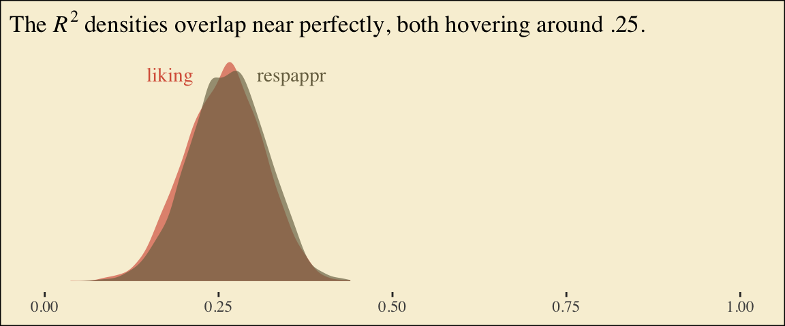
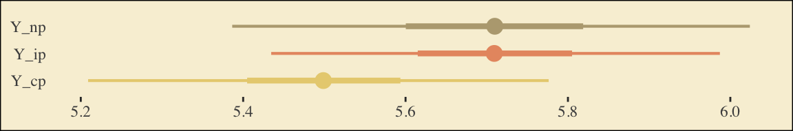

# Mediation Analysis with a Multicategorical Antecedent


## Relative total, direct, and indirect effects

## An example: Sex discrimination in the workplace

Here we load a couple necessary packages, load the data, and take a `glimpse()`.


```r
library(tidyverse)

protest <- read_csv("data/protest/protest.csv")

glimpse(protest)
```

```
## Observations: 129
## Variables: 6
## $ subnum   <int> 209, 44, 124, 232, 30, 140, 27, 64, 67, 182, 85, 109, 122, 69, 45, 28, 170, 66, 168, 97,...
## $ protest  <int> 2, 0, 2, 2, 2, 1, 2, 0, 0, 0, 2, 2, 0, 1, 1, 0, 1, 2, 2, 1, 2, 1, 1, 2, 2, 0, 1, 1, 0, 1...
## $ sexism   <dbl> 4.87, 4.25, 5.00, 5.50, 5.62, 5.75, 5.12, 6.62, 5.75, 4.62, 4.75, 6.12, 4.87, 5.87, 4.87...
## $ angry    <int> 2, 1, 3, 1, 1, 1, 2, 1, 6, 1, 2, 5, 2, 1, 1, 1, 2, 1, 3, 4, 1, 1, 1, 5, 1, 5, 1, 1, 2, 1...
## $ liking   <dbl> 4.83, 4.50, 5.50, 5.66, 6.16, 6.00, 4.66, 6.50, 1.00, 6.83, 5.00, 5.66, 5.83, 6.50, 4.50...
## $ respappr <dbl> 4.25, 5.75, 4.75, 7.00, 6.75, 5.50, 5.00, 6.25, 3.00, 5.75, 5.25, 7.00, 4.50, 6.25, 5.00...
```

Here are the ungrouped means and $SD$s for `respappr` and `liking` shown at the bottom of Table 6.1.


```r
protest %>%
  select(liking:respappr) %>% 
  gather(key, value) %>% 
  group_by(key) %>% 
  summarize(mean = mean(value),
            sd = sd(value)) %>% 
  mutate_if(is.double, round, digits = 3)
```

```
## # A tibble: 2 x 3
##   key       mean    sd
##   <chr>    <dbl> <dbl>
## 1 liking    5.64  1.05
## 2 respappr  4.87  1.35
```

We compute the summaries for `respappr` and `liking`, grouped by `protest`, like so.


```r
protest %>%
  select(protest, liking:respappr) %>% 
  gather(key, value, -protest) %>% 
  group_by(protest, key) %>% 
  summarize(mean = mean(value),
            sd = sd(value)) %>% 
  mutate_if(is.double, round, digits = 3)
```

```
## # A tibble: 6 x 4
## # Groups:   protest [3]
##   protest key       mean    sd
##     <int> <chr>    <dbl> <dbl>
## 1       0 liking    5.31 1.30 
## 2       0 respappr  3.88 1.46 
## 3       1 liking    5.83 0.819
## 4       1 respappr  5.14 1.08 
## 5       2 liking    5.75 0.936
## 6       2 respappr  5.49 0.936
```
 
It looks like Hayes has a typo in the $SD$ for `liking` when `protest == 0`. It seemed he accidentally entered the value for when `protest == 1` in that slot.

You'll have to wait a minute to see where the adjusted $Y$ values came.

With a little `ifelse()`, computing the dummies `D1` and `D2` is easy enough.


```r
protest <-
  protest %>% 
  mutate(D1 = ifelse(protest == 1, 1, 0),
         D2 = ifelse(protest == 2, 1, 0))
```

We're almost ready to fit the model. Let's load brms.


```r
library(brms)
```

This is the first time we've had a simple univariate regression model in a while. No special `cbind()` syntax or multiple `bf()` formulas. Just straight up `brm()`.


```r
model1 <-
  brm(data = protest, family = gaussian,
      liking ~ 1 + D1 + D2,
      chains = 4, cores = 4)
```


```r
fixef(model1)
```

```
##            Estimate Est.Error        Q2.5     Q97.5
## Intercept 5.3121491 0.1654625 4.984353592 5.6436028
## D1        0.5050451 0.2312916 0.051058290 0.9582424
## D2        0.4360147 0.2273677 0.002481348 0.8814708
```

Our $R^2$ differes a bit from the OLS version in the text. This shouldn't be surprising when it's near the boundary. 


```r
bayes_R2(model1)
```

```
##      Estimate  Est.Error        Q2.5     Q97.5
## R2 0.05693229 0.03528896 0.005512156 0.1378399
```

Here's its shape. For the plots in this chapter, we'll take a few formatting cues from [Edward Tufte](https://www.edwardtufte.com/tufte/books_vdqi), curtesy of the [ggthemes package](https://cran.r-project.org/web/packages/ggthemes/index.html). The `theme_tufte()` function will change the default font and remove some chart junk. We will take our color palette from [Pokemon](http://pokemonbyreview.blogspot.com/2017/02/311-312-plusle-minun.html) via the [palettetown package](https://cran.r-project.org/web/packages/palettetown/index.html).


```r
library(ggthemes)
library(palettetown)

bayes_R2(model1, summary = F) %>% 
  as_tibble() %>% 
  
  ggplot(aes(x = R2)) +
  geom_density(size = 0, fill = pokepal(pokemon = "plusle")[2]) +
  scale_y_continuous(NULL, breaks = NULL) +
  coord_cartesian(xlim = 0:1) +
  xlab(expression(italic(R)^{2})) +
  theme_tufte() +
  theme(legend.title = element_blank(),
        plot.background = element_rect(fill = pokepal(pokemon = "plusle")[8]))
```


To use the model-implied equations to compute the means for each group on the criterion, we'll extract the posterior samples.


```r
post <- posterior_samples(model1)

post %>% 
  transmute(Y_np = b_Intercept + b_D1*0 + b_D2*0,
            Y_ip = b_Intercept + b_D1*1 + b_D2*0,
            Y_cp = b_Intercept + b_D1*0 + b_D2*1) %>% 
  gather() %>%
  # this line will order our output the same way Hayes did in the text (p. 197)
  mutate(key = factor(key, levels = c("Y_np", "Y_ip", "Y_cp"))) %>% 
  group_by(key) %>% 
  summarize(mean = mean(value),
            sd = sd(value))
```

```
## # A tibble: 3 x 3
##   key    mean    sd
##   <fct> <dbl> <dbl>
## 1 Y_np   5.31 0.165
## 2 Y_ip   5.82 0.163
## 3 Y_cp   5.75 0.157
```

What Hayes called the "relative total effects" $c_{1}$ and $c_{2}$ are the `D1` and `D2` lines in our `fixef()` output, above.

Here are the sub-models for the mediation model.


```r
m_model <- bf(respappr ~ 1 + D1 + D2)
y_model <- bf(liking   ~ 1 + D1 + D2 + respappr)
```

We fit.


```r
model2 <-
  brm(data = protest, family = gaussian,
      m_model + y_model + set_rescor(FALSE),
      chains = 4, cores = 4)
```


```r
print(model2)
```

```
##  Family: MV(gaussian, gaussian) 
##   Links: mu = identity; sigma = identity
##          mu = identity; sigma = identity 
## Formula: respappr ~ 1 + D1 + D2 
##          liking ~ 1 + D1 + D2 + respappr 
##    Data: protest (Number of observations: 129) 
## Samples: 4 chains, each with iter = 2000; warmup = 1000; thin = 1;
##          total post-warmup samples = 4000
## 
## Population-Level Effects: 
##                    Estimate Est.Error l-95% CI u-95% CI Eff.Sample Rhat
## respappr_Intercept     3.88      0.18     3.51     4.23       4000 1.00
## liking_Intercept       3.71      0.31     3.08     4.30       4000 1.00
## respappr_D1            1.27      0.26     0.75     1.77       4000 1.00
## respappr_D2            1.61      0.25     1.14     2.11       4000 1.00
## liking_D1              0.00      0.22    -0.42     0.44       4000 1.00
## liking_D2             -0.21      0.23    -0.68     0.25       3382 1.00
## liking_respappr        0.41      0.07     0.27     0.55       4000 1.00
## 
## Family Specific Parameters: 
##                Estimate Est.Error l-95% CI u-95% CI Eff.Sample Rhat
## sigma_respappr     1.18      0.07     1.05     1.34       4000 1.00
## sigma_liking       0.93      0.06     0.82     1.05       4000 1.00
## 
## Samples were drawn using sampling(NUTS). For each parameter, Eff.Sample 
## is a crude measure of effective sample size, and Rhat is the potential 
## scale reduction factor on split chains (at convergence, Rhat = 1).
```

The Bayesian $R^2$ posteriors:


```r
bayes_R2(model2, summary = F) %>% 
  as_tibble() %>% 
  gather() %>% 
  
  ggplot(aes(x = value, fill = key)) +
  geom_density(size = 0, alpha = 2/3) +
  annotate("text", x = .18, y = 6.75, label = "liking", color = pokepal(pokemon = "plusle")[2], family = "Times") +
  annotate("text", x = .355, y = 6.75, label = "respappr", color = pokepal(pokemon = "plusle")[6], family = "Times") +
  scale_y_continuous(NULL, breaks = NULL) +
  scale_fill_manual(values = pokepal(pokemon = "plusle")[c(2, 6)]) +
  coord_cartesian(xlim = 0:1) +
  labs(title = expression(paste("The ", italic(R)^{2}, " densities overlap near perfectly, both hovering around .25.")),
       x = NULL) +
  theme_tufte() +
  theme(legend.position = "none",
        plot.background = element_rect(fill = pokepal(pokemon = "plusle")[8]))
```



To get the model summaries as presented in the second two columns in Table 6.2, we use `posterior_samples()`, rename a bit, and `summarize()` as usual.


```r
post <-
  posterior_samples(model2) %>% 
  mutate(a1 = b_respappr_D1,
         a2 = b_respappr_D2,
         b = b_liking_respappr,
         c1_prime = b_liking_D1,
         c2_prime = b_liking_D2,
         i_m = b_respappr_Intercept,
         i_y = b_liking_Intercept)

post %>% 
  select(a1:i_y) %>% 
  gather() %>%
  group_by(key) %>% 
  summarize(mean = mean(value),
            sd = sd(value),
            ll = quantile(value, probs = .025),
            ul = quantile(value, probs = .975)) %>% 
  mutate_if(is.double, round, digits = 3)
```

```
## # A tibble: 7 x 5
##   key        mean    sd     ll    ul
##   <chr>     <dbl> <dbl>  <dbl> <dbl>
## 1 a1        1.27  0.262  0.749 1.77 
## 2 a2        1.62  0.251  1.14  2.11 
## 3 b         0.411 0.072  0.273 0.554
## 4 c1_prime  0.001 0.222 -0.417 0.441
## 5 c2_prime -0.212 0.235 -0.677 0.25 
## 6 i_m       3.88  0.181  3.51  4.23 
## 7 i_y       3.71  0.311  3.08  4.30
```

Working with the $\overline{M}_{ij}$ formulas in page 199 is quite similar to what we did above.


```r
post %>% 
  transmute(M_np = b_respappr_Intercept + b_respappr_D1*0 + b_respappr_D2*0,
            M_ip = b_respappr_Intercept + b_respappr_D1*1 + b_respappr_D2*0,
            M_cp = b_respappr_Intercept + b_respappr_D1*0 + b_respappr_D2*1) %>% 
  gather() %>%
  # this line will order our output the same way Hayes did in the text (p. 199)
  mutate(key = factor(key, levels = c("M_np", "M_ip", "M_cp"))) %>% 
  group_by(key) %>% 
  summarize(mean = mean(value),
            sd = sd(value))
```

```
## # A tibble: 3 x 3
##   key    mean    sd
##   <fct> <dbl> <dbl>
## 1 M_np   3.88 0.181
## 2 M_ip   5.15 0.185
## 3 M_cp   5.49 0.178
```

The $\overline{Y}^*_{ij}$ formulas are more of the same.


```r
post <-
  post %>% 
  mutate(Y_np = b_liking_Intercept + b_liking_D1*0 + b_liking_D2*0 + b_liking_respappr*mean(protest$respappr),
         Y_ip = b_liking_Intercept + b_liking_D1*1 + b_liking_D2*0 + b_liking_respappr*mean(protest$respappr),
         Y_cp = b_liking_Intercept + b_liking_D1*0 + b_liking_D2*1 + b_liking_respappr*mean(protest$respappr))

post %>% 
  select(starts_with("Y_")) %>% 
  gather() %>%
  mutate(key = factor(key, levels = c("Y_np", "Y_ip", "Y_cp"))) %>% 
  group_by(key) %>% 
  summarize(mean = mean(value),
            sd = sd(value))
```

```
## # A tibble: 3 x 3
##   key    mean    sd
##   <fct> <dbl> <dbl>
## 1 Y_np   5.71 0.162
## 2 Y_ip   5.71 0.141
## 3 Y_cp   5.50 0.143
```

Note, these are where the adjusted $Y$ values came from in Table 6.1.

This is as fine a spot as any to introduce coefficient plots. Both brms and the [bayesplot package](https://github.com/stan-dev/bayesplot) offer convenience functions for coefficient plots. It's good to know how to make them by hand. Here's ours for those last three $\overline{Y}^*_{ij}$-values.


```r
post %>% 
  select(starts_with("Y_")) %>% 
  gather() %>% 
  
  ggplot(aes(x = key, y = value, color = key)) +
  stat_summary(geom = "pointrange",
               fun.y = median,
               fun.ymin = function(x){quantile(x, probs = .025)},
               fun.ymax = function(x){quantile(x, probs = .975)},
               size = .75) +
  stat_summary(geom = "linerange",
               fun.ymin = function(x){quantile(x, probs = .25)},
               fun.ymax = function(x){quantile(x, probs = .75)},
               size = 1.5) +
  scale_color_manual(values = pokepal(pokemon = "plusle")[c(3, 7, 9)]) +
  coord_flip() +
  theme_tufte() +
  labs(x = NULL, y = NULL) +
  theme(axis.ticks.y = element_blank(),
        legend.position = "none",
        plot.background = element_rect(fill = pokepal(pokemon = "plusle")[8]))
```



The points are the posterior medians, the thick inner lines the 50% intervals, and the thinner outer lines the 95% intervals. For kicks, we distinguished the three values by color.

If we want to examine $R^2$ change for dropping the dummy variables, we'll first fit a model that omits them.


```r
model3 <-
  brm(data = protest, family = gaussian,
      liking ~ 1 + respappr,
      chains = 4, cores = 4)
```

Here are the competing $R^2$ distributions.


```r
R2s <-
  bayes_R2(model2, resp = "liking", summary = F) %>%
  as_tibble() %>% 
  rename(R2 = R2_liking) %>% 
  bind_rows(
    bayes_R2(model3, summary = F) %>% 
      as_tibble()
  ) %>% 
  mutate(fit = rep(c("model2", "model3"), each = 4000))

R2s %>% 
  ggplot(aes(x = R2, fill = fit)) +
  geom_density(size = 0, alpha = 2/3) +
  scale_fill_manual(values = pokepal(pokemon = "plusle")[c(6, 7)]) +
  annotate("text", x = .15, y = 6.75, label = "model3", color = pokepal(pokemon = "plusle")[7], family = "Times") +
  annotate("text", x = .35, y = 6.75, label = "model2", color = pokepal(pokemon = "plusle")[6], family = "Times") +
  scale_y_continuous(NULL, breaks = NULL) +
  coord_cartesian(xlim = 0:1) +
  labs(title = expression(paste("The ", italic(R)^{2}, " densities for LIKING overlap a lot.")),
       x = NULL) +
  theme_tufte() +
  theme(legend.position = "none",
        plot.background = element_rect(fill = pokepal(pokemon = "plusle")[8]))
```


If you want to compare then with a change score, do something like this.


```r
R2s %>%
  mutate(iter = rep(1:4000, times = 2)) %>% 
  spread(key = fit, value = R2) %>% 
  mutate(difference = model2 - model3) %>% 
  
  ggplot(aes(x = difference)) +
  geom_density(size = 0, fill = pokepal(pokemon = "plusle")[4]) +
  geom_vline(xintercept = 0, color = pokepal(pokemon = "plusle")[8]) +
  scale_y_continuous(NULL, breaks = NULL) +
  labs(title = expression(paste("The ", Delta, italic(R)^{2}, " distribution")),
       subtitle = "Doesn't appear we have a lot of change.",
       x = NULL) +
  theme_tufte() +
  theme(legend.title = element_blank(),
        plot.background = element_rect(fill = pokepal(pokemon = "plusle")[8]))
```


Here's how to compute the summaries for $a_{1}b$ and $a_{2}b$, including the Bayesian HMC intervals.


```r
post %>% 
  mutate(a1b = a1*b,
         a2b = a2*b) %>%
  select(a1b:a2b) %>% 
  gather() %>%
  group_by(key) %>% 
  summarize(mean = mean(value),
            sd = sd(value),
            ll = quantile(value, probs = .025),
            ul = quantile(value, probs = .975)) %>% 
  mutate_if(is.double, round, digits = 3)
```

```
## # A tibble: 2 x 5
##   key    mean    sd    ll    ul
##   <chr> <dbl> <dbl> <dbl> <dbl>
## 1 a1b   0.52  0.142 0.263 0.822
## 2 a2b   0.664 0.157 0.381 0.991
```

## Using a different group coding system

Here we'll make our alternative dummies, what we'll call `D_1` and `D_2`, with orthogonal contrast coding.


```r
protest <-
  protest %>% 
  mutate(D_1 = ifelse(protest == 0, -2/3, 1/3),
         D_2 = ifelse(protest == 0, 0, 
                      ifelse(protest == 1, -1/2, 1/2)))
```

Here are the sub-models.


```r
m_model <- bf(respappr ~ 1 + D_1 + D_2)
y_model <- bf(liking   ~ 1 + D_1 + D_2 + respappr)
```

Now we fit.


```r
model4 <-
  brm(data = protest, family = gaussian,
      m_model + y_model + set_rescor(FALSE),
      chains = 4, cores = 4)
```

Here are our intercepts and regression coefficient summaries.


```r
fixef(model4)
```

```
##                      Estimate  Est.Error       Q2.5     Q97.5
## respappr_Intercept  4.8399962 0.10578752  4.6301115 5.0460324
## liking_Intercept    3.6303107 0.35919791  2.9137984 4.3166260
## respappr_D_1        1.4358633 0.21557632  1.0162848 1.8717145
## respappr_D_2        0.3497242 0.25111687 -0.1406033 0.8324690
## liking_D_1         -0.1146844 0.20498317 -0.5065575 0.2993028
## liking_D_2         -0.2168985 0.20270585 -0.6162726 0.1886207
## liking_respappr     0.4129279 0.07201573  0.2767746 0.5557400
```

It's important to note that these will not correspond to the "TOTAL EFFECT MODEL" section of the PROCESS output of Figure 6.3. Hayes's PROCESS has the `mcx=3` command which tells the program to reparametrize the orthogonal contrasts. brms doesn't have such a command.

For now, we'll have to jump to equation 6.8 towards the bottom of page 207. Those parameters are evident in our output.


```r
fixef(model4)[c(1, 3:4) , ] %>% round(digits = 3)
```

```
##                    Estimate Est.Error   Q2.5 Q97.5
## respappr_Intercept    4.840     0.106  4.630 5.046
## respappr_D_1          1.436     0.216  1.016 1.872
## respappr_D_2          0.350     0.251 -0.141 0.832
```

Thus it's easy to get the $\overline{M}_{ij}$ means with a little posterior manipulation.


```r
post <- posterior_samples(model4)

post <-
  post %>% 
  mutate(M_np = b_respappr_Intercept + b_respappr_D_1*-2/3 + b_respappr_D_2*0,
         M_ip = b_respappr_Intercept + b_respappr_D_1*1/3 + b_respappr_D_2*-1/2,
         M_cp = b_respappr_Intercept + b_respappr_D_1*1/3 + b_respappr_D_2*1/2)

post %>% 
  select(starts_with("M_")) %>% 
  gather() %>%
  mutate(key = factor(key, levels = c("M_np", "M_ip", "M_cp"))) %>% 
  group_by(key) %>% 
  summarize(mean = mean(value),
            sd = sd(value))
```

```
## # A tibble: 3 x 3
##   key    mean    sd
##   <fct> <dbl> <dbl>
## 1 M_np   3.88 0.182
## 2 M_ip   5.14 0.181
## 3 M_cp   5.49 0.173
```

With these in hand, we can compute $a_{1}$ and $a_{2}$.


```r
post <-
  post %>% 
  mutate(a1 = (M_ip + M_cp)/2 - M_np,
         a2 = M_cp - M_ip)

post %>% 
  select(a1:a2) %>% 
  gather() %>%
  group_by(key) %>% 
  summarize(mean = mean(value),
            sd = sd(value))
```

```
## # A tibble: 2 x 3
##   key    mean    sd
##   <chr> <dbl> <dbl>
## 1 a1    1.44  0.216
## 2 a2    0.350 0.251
```

Happily, our model output will allow us to work with Hayes's $\overline{Y}^*_{ij}$ equations in the middle of page 210.


```r
post <-
  post %>% 
  mutate(Y_np = b_liking_Intercept + b_liking_D_1*-2/3 + b_liking_D_2*0 + b_liking_respappr*mean(protest$respappr),
         Y_ip = b_liking_Intercept + b_liking_D_1*1/3 + b_liking_D_2*-1/2 + b_liking_respappr*mean(protest$respappr),
         Y_cp = b_liking_Intercept + b_liking_D_1*1/3 + b_liking_D_2*1/2 + b_liking_respappr*mean(protest$respappr))

post %>% 
  select(starts_with("Y_")) %>% 
  gather() %>%
  mutate(key = factor(key, levels = c("Y_np", "Y_ip", "Y_cp"))) %>% 
  group_by(key) %>% 
  summarize(mean = mean(value),
            sd = sd(value))
```

```
## # A tibble: 3 x 3
##   key    mean    sd
##   <fct> <dbl> <dbl>
## 1 Y_np   5.72 0.160
## 2 Y_ip   5.71 0.144
## 3 Y_cp   5.49 0.149
```

And with these in hand, we can compute $c'_{1}$ and $c'_{2}$.


```r
post <-
  post %>% 
  mutate(c1_prime = (Y_ip + Y_cp)/2 - Y_np,
         c2_prime = Y_cp - Y_ip)

post %>% 
  select(c1_prime:c2_prime) %>% 
  gather() %>%
  group_by(key) %>% 
  summarize(mean = mean(value),
            sd = sd(value))
```

```
## # A tibble: 2 x 3
##   key        mean    sd
##   <chr>     <dbl> <dbl>
## 1 c1_prime -0.115 0.205
## 2 c2_prime -0.217 0.203
```

It appears Hayes has a typo in the formula for $c'_{2}$ on page 211. The value he has down for $\overline{Y}^*_{IP}$, 5.145, is incorrect. It's not the one he displayed at the bottom of the previous page and it also contradicts the analyses herein. So it goes... These things happen.

We haven't spelled out, but the $b$ parameter is currently labeled `b_liking_respappr` in our `post` object. Here we'll make a `b` column to make things easier. While we're at it, we'll compute the indirect effects, too.


```r
post <-
  post %>%
  mutate(b = b_liking_respappr) %>% 
  mutate(a1b = a1*b,
         a2b = a2*b)

post %>% 
  select(a1b:a2b) %>% 
  gather() %>%
  group_by(key) %>% 
  summarize(mean = mean(value),
            sd = sd(value),
            ll = quantile(value, probs = .025),
            ul = quantile(value, probs = .975)) %>% 
  mutate_if(is.double, round, digits = 3)
```

```
## # A tibble: 2 x 5
##   key    mean    sd     ll    ul
##   <chr> <dbl> <dbl>  <dbl> <dbl>
## 1 a1b   0.593 0.137  0.345 0.882
## 2 a2b   0.144 0.108 -0.061 0.366
```

Now we can compute and `summarize()` our $c_{1}$ and $c_{1}$.


```r
post <-
  post %>% 
  mutate(c1 = c1_prime + a1b,
         c2 = c2_prime + a2b)

post %>% 
  select(c1:c2) %>% 
  gather() %>%
  group_by(key) %>% 
  summarize(mean = mean(value),
            sd = sd(value))
```

```
## # A tibble: 2 x 3
##   key      mean    sd
##   <chr>   <dbl> <dbl>
## 1 c1     0.478  0.199
## 2 c2    -0.0726 0.225
```

## References {-}

[Hayes, A. F. (2018). *Introduction to mediation, moderation, and conditional process analysis: A regression-based approach.* (2nd ed.). New York, NY, US: The Guilford Press.](http://afhayes.com/introduction-to-mediation-moderation-and-conditional-process-analysis.html)

## Session info {-}


```r
sessionInfo()
```

```
## R version 3.5.1 (2018-07-02)
## Platform: x86_64-apple-darwin15.6.0 (64-bit)
## Running under: macOS High Sierra 10.13.4
## 
## Matrix products: default
## BLAS: /Library/Frameworks/R.framework/Versions/3.5/Resources/lib/libRblas.0.dylib
## LAPACK: /Library/Frameworks/R.framework/Versions/3.5/Resources/lib/libRlapack.dylib
## 
## locale:
## [1] en_US.UTF-8/en_US.UTF-8/en_US.UTF-8/C/en_US.UTF-8/en_US.UTF-8
## 
## attached base packages:
## [1] stats     graphics  grDevices utils     datasets  methods   base     
## 
## other attached packages:
##  [1] palettetown_0.1.1 ggthemes_3.5.0    brms_2.3.4        Rcpp_0.12.17      bindrcpp_0.2.2   
##  [6] forcats_0.3.0     stringr_1.3.1     dplyr_0.7.6       purrr_0.2.5       readr_1.1.1      
## [11] tidyr_0.8.1       tibble_1.4.2      ggplot2_3.0.0     tidyverse_1.2.1  
## 
## loaded via a namespace (and not attached):
##  [1] nlme_3.1-137         matrixStats_0.53.1   xts_0.10-2           lubridate_1.7.4      threejs_0.3.1       
##  [6] httr_1.3.1           rprojroot_1.3-2      rstan_2.17.3         tools_3.5.1          backports_1.1.2     
## [11] utf8_1.1.4           R6_2.2.2             DT_0.4               lazyeval_0.2.1       colorspace_1.3-2    
## [16] withr_2.1.2          tidyselect_0.2.4     gridExtra_2.3        mnormt_1.5-5         Brobdingnag_1.2-5   
## [21] compiler_3.5.1       cli_1.0.0            rvest_0.3.2          shinyjs_1.0          xml2_1.2.0          
## [26] labeling_0.3         colourpicker_1.0     bookdown_0.7         scales_0.5.0         dygraphs_1.1.1.5    
## [31] mvtnorm_1.0-8        psych_1.8.4          ggridges_0.5.0       digest_0.6.15        StanHeaders_2.17.2  
## [36] foreign_0.8-70       rmarkdown_1.10       base64enc_0.1-3      pkgconfig_2.0.1      htmltools_0.3.6     
## [41] htmlwidgets_1.2      rlang_0.2.1          readxl_1.1.0         rstudioapi_0.7       shiny_1.1.0         
## [46] bindr_0.1.1          zoo_1.8-2            jsonlite_1.5         gtools_3.8.1         crosstalk_1.0.0     
## [51] inline_0.3.15        magrittr_1.5         loo_2.0.0            bayesplot_1.5.0      Matrix_1.2-14       
## [56] munsell_0.5.0        abind_1.4-5          stringi_1.2.3        yaml_2.1.19          plyr_1.8.4          
## [61] grid_3.5.1           parallel_3.5.1       promises_1.0.1       crayon_1.3.4         miniUI_0.1.1.1      
## [66] lattice_0.20-35      haven_1.1.2          hms_0.4.2            knitr_1.20           pillar_1.2.3        
## [71] igraph_1.2.1         markdown_0.8         shinystan_2.5.0      reshape2_1.4.3       stats4_3.5.1        
## [76] rstantools_1.5.0     glue_1.2.0           evaluate_0.10.1      modelr_0.1.2         httpuv_1.4.4.2      
## [81] cellranger_1.1.0     gtable_0.2.0         assertthat_0.2.0     xfun_0.3             mime_0.5            
## [86] xtable_1.8-2         broom_0.4.5          coda_0.19-1          later_0.7.3          rsconnect_0.8.8     
## [91] shinythemes_1.1.1    bridgesampling_0.4-0
```

    
