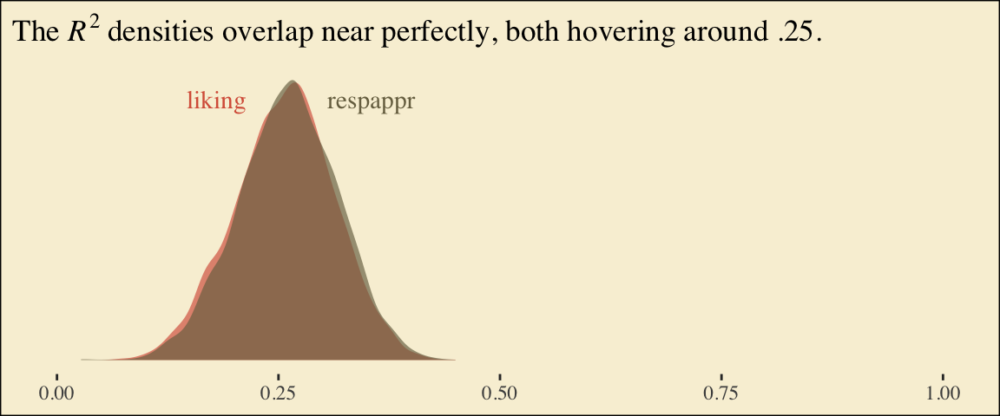

# Mediation Analysis with a Multicategorical Antecedent


"Historically, investigators interested in doing a mediation analysis with a multicategorical antecedents $X$ have resorted to some less optimal strategies than the one [Hayes] discuss[ed] in this chapter (p. 188)." Happily, the approach outlined in this chapter avoids such gaffs. Hayes's procedure "does not require discarding any data; the entire sample is analyzed simultaneously. Furthermore, the multicategorical nature of $X$ is respected and retained (p. 189)."

## Relative total, direct, and indirect effects

> In review of regression analysis in Chapter 2, we saw that a multicategorical antecedent variable with $g$ categories can be used as an antecedent variable in a regression model if it is represented by $g - 1$ variables using some kind of group coding system (see section 2.7). [Hayes] described indicator or dummy coding as one such system, where groups are represented with $g - 1$ variables set to either zero or one (see Table 2.1). With indicator coding, one of the $g$ groups is chosen as the *reference group*. Cases in the reference group receive a zero on all $g - 1$ variables coding $X$. Each of the remaining $g - 1$ groups gets its own indicator variable that is set to 1 for cases in that group, with all other cases set to zero. Using such a system, which of the $g$ groups a case is in is represented by its pattern of zeros and ones on the $g - 1$ indicator variables. These $g - 1$ indicator variables are then used as antecedent variables in a regression model as a stand-in for $X$. (pp. 189--190, *emphasis* in the original)

### Relative indirect effects.

When our $X$ is multicategorical, we end up with $g - 1$ $a$ coefficients. Presuming the $M$ variable is continuous or binary, this will yield $g - 1$ *relative indirect effects*, $a_j b$.

### Relative direct effects.

Similar to above, when our $X$ is multicategorical, we end up with $g - 1$ $c'$ coefficients, each of which is a *relative direct effects*.

### Relative total effects.

With the two prior subsections in mind, when our $X$ is multicategorical, we end up with $g - 1$ $c$ coefficients, each of which is a *relative total effect*. These follow the form

$$c_j = c_j' + a_j b,$$

where $j$ indexes a given group.

## An example: Sex discrimination in the workplace

Here we load a couple necessary packages, load the data, and take a `glimpse()`.


```r
library(tidyverse)

protest <- read_csv("data/protest/protest.csv")

glimpse(protest)
```

```
## Observations: 129
## Variables: 6
## $ subnum   <dbl> 209, 44, 124, 232, 30, 140, 27, 64, 67, 182, 85, 109, 122, 69, 45, 28, 170, 66, 168, 97, 7…
## $ protest  <dbl> 2, 0, 2, 2, 2, 1, 2, 0, 0, 0, 2, 2, 0, 1, 1, 0, 1, 2, 2, 1, 2, 1, 1, 2, 2, 0, 1, 1, 0, 1, …
## $ sexism   <dbl> 4.87, 4.25, 5.00, 5.50, 5.62, 5.75, 5.12, 6.62, 5.75, 4.62, 4.75, 6.12, 4.87, 5.87, 4.87, …
## $ angry    <dbl> 2, 1, 3, 1, 1, 1, 2, 1, 6, 1, 2, 5, 2, 1, 1, 1, 2, 1, 3, 4, 1, 1, 1, 5, 1, 5, 1, 1, 2, 1, …
## $ liking   <dbl> 4.83, 4.50, 5.50, 5.66, 6.16, 6.00, 4.66, 6.50, 1.00, 6.83, 5.00, 5.66, 5.83, 6.50, 4.50, …
## $ respappr <dbl> 4.25, 5.75, 4.75, 7.00, 6.75, 5.50, 5.00, 6.25, 3.00, 5.75, 5.25, 7.00, 4.50, 6.25, 5.00, …
```

Here are the ungrouped means and $SD$s for `respappr` and `liking` shown at the bottom of Table 6.1.


```r
protest %>%
  pivot_longer(liking:respappr) %>% 
  group_by(name) %>% 
  summarize(mean = mean(value),
            sd   = sd(value)) %>% 
  mutate_if(is.double, round, digits = 3)
```

```
## # A tibble: 2 x 3
##   name      mean    sd
##   <chr>    <dbl> <dbl>
## 1 liking    5.64  1.05
## 2 respappr  4.87  1.35
```

We compute the summaries for `respappr` and `liking`, grouped by `protest`, like so.


```r
protest %>%
  pivot_longer(liking:respappr) %>% 
  group_by(protest, name) %>% 
  summarize(mean = mean(value),
            sd   = sd(value)) %>% 
  mutate_if(is.double, round, digits = 3)
```

```
## # A tibble: 6 x 4
## # Groups:   protest [3]
##   protest name      mean    sd
##     <dbl> <chr>    <dbl> <dbl>
## 1       0 liking    5.31 1.30 
## 2       0 respappr  3.88 1.46 
## 3       1 liking    5.83 0.819
## 4       1 respappr  5.14 1.08 
## 5       2 liking    5.75 0.936
## 6       2 respappr  5.49 0.936
```
 
It looks like Hayes has a typo in the $SD$ for `liking` when `protest == 0`. It seems he accidentally entered the value for when `protest == 1` in that slot.

You'll have to wait a minute to see where the adjusted $Y$ values came from.

With a little `if_else()`, computing the dummies `d1` and `d2` is easy enough.


```r
protest <-
  protest %>% 
  mutate(d1 = if_else(protest == 1, 1, 0),
         d2 = if_else(protest == 2, 1, 0))
```

We're almost ready to fit the model. Let's load **brms**.


```r
library(brms)
```

This is the first time we've had a simple univariate regression model in a while--no special `mvbind()` syntax or multiple `bf()` formulas, just straight up `brms::brm()`.


```r
model6.1 <-
  brm(data = protest, 
      family = gaussian,
      liking ~ 1 + d1 + d2,
      cores = 4)
```

Check the coefficient summaries.


```r
fixef(model6.1)
```

```
##            Estimate Est.Error         Q2.5     Q97.5
## Intercept 5.3065586 0.1644651  4.987521552 5.6321918
## d1        0.5187973 0.2313537  0.066754379 0.9659453
## d2        0.4483320 0.2250177 -0.004960553 0.8860026
```

Our $R^2$ differences a bit from the OLS version in the text. This shouldn't be surprising when it's near the boundary. 


```r
bayes_R2(model6.1)
```

```
##      Estimate  Est.Error        Q2.5     Q97.5
## R2 0.05882954 0.03580924 0.005361728 0.1404927
```

Here's its shape. For the plots in this chapter, we'll take a few formatting cues from [Edward Tufte](https://www.edwardtufte.com/tufte/books_vdqi), curtesy of the [**ggthemes** package](https://cran.r-project.org/web/packages/ggthemes/index.html). The `theme_tufte()` function will change the default font and remove some chart junk. We will take our color palette from [Pokemon](http://pokemonbyreview.blogspot.com/2017/02/311-312-plusle-minun.html) via the [**palettetown** package](https://cran.r-project.org/web/packages/palettetown/index.html).


```r
library(ggthemes)
library(palettetown)

bayes_R2(model6.1, summary = F) %>% 
  data.frame() %>% 
  
  ggplot(aes(x = R2)) +
  geom_density(size = 0, fill = pokepal(pokemon = "plusle")[2]) +
  scale_y_continuous(NULL, breaks = NULL) +
  coord_cartesian(xlim = 0:1) +
  xlab(expression(italic(R)^{2})) +
  theme_tufte() +
  theme(legend.title    = element_blank(),
        plot.background = element_rect(fill = pokepal(pokemon = "plusle")[8]))
```


To use the model-implied equations to compute the means for each group on the criterion, we'll extract the posterior samples.


```r
post <- posterior_samples(model6.1)

post %>% 
  mutate(Y_np = b_Intercept + b_d1 * 0 + b_d2 * 0,
         Y_ip = b_Intercept + b_d1 * 1 + b_d2 * 0,
         Y_cp = b_Intercept + b_d1 * 0 + b_d2 * 1) %>% 
  pivot_longer(contains("Y_")) %>%
  # this line will order our output the same way Hayes did in the text (p. 197)
  mutate(name = factor(name, levels = c("Y_np", "Y_ip", "Y_cp"))) %>% 
  group_by(name) %>% 
  summarize(mean = mean(value),
            sd   = sd(value))
```

```
## # A tibble: 3 x 3
##   name   mean    sd
##   <fct> <dbl> <dbl>
## 1 Y_np   5.31 0.164
## 2 Y_ip   5.83 0.157
## 3 Y_cp   5.75 0.152
```

What Hayes called the "relative total effects" $c_1$ and $c_2$ are the `d1` and `d2` lines in our `fixef()` output, above.

Here are the sub-models for the mediation model.


```r
m_model <- bf(respappr ~ 1 + d1 + d2)
y_model <- bf(liking   ~ 1 + d1 + d2 + respappr)
```

There's a third way to fit multivariate models in **brms**. It uses either the `mvbrmsformula()` function, or its abbreviated version, `mvbf()`. With these, we first define our submodels in `br()` statements like before. We then combine them within `mvbf()`, separated with a comma. If we'd like to avoid estimating a residual correlation, which we do in this project--, we then set `rescore = FALSE`. Here's how it looks like for our second model.


```r
model6.2 <-
  brm(data = protest, 
      family = gaussian,
      mvbf(m_model, y_model, rescor = FALSE),
      cores = 4)
```


```r
print(model6.2)
```

```
##  Family: MV(gaussian, gaussian) 
##   Links: mu = identity; sigma = identity
##          mu = identity; sigma = identity 
## Formula: respappr ~ 1 + d1 + d2 
##          liking ~ 1 + d1 + d2 + respappr 
##    Data: protest (Number of observations: 129) 
## Samples: 4 chains, each with iter = 2000; warmup = 1000; thin = 1;
##          total post-warmup samples = 4000
## 
## Population-Level Effects: 
##                    Estimate Est.Error l-95% CI u-95% CI Rhat Bulk_ESS Tail_ESS
## respappr_Intercept     3.89      0.19     3.53     4.25 1.00     5389     2814
## liking_Intercept       3.72      0.31     3.09     4.33 1.00     7012     3330
## respappr_d1            1.26      0.25     0.76     1.75 1.00     4860     3084
## respappr_d2            1.60      0.25     1.10     2.11 1.00     4966     3327
## liking_d1              0.00      0.23    -0.44     0.45 1.00     3736     3297
## liking_d2             -0.22      0.23    -0.66     0.23 1.00     3326     2936
## liking_respappr        0.41      0.07     0.27     0.55 1.00     4364     3188
## 
## Family Specific Parameters: 
##                Estimate Est.Error l-95% CI u-95% CI Rhat Bulk_ESS Tail_ESS
## sigma_respappr     1.18      0.08     1.04     1.34 1.00     6479     2945
## sigma_liking       0.93      0.06     0.82     1.06 1.01     5449     2523
## 
## Samples were drawn using sampling(NUTS). For each parameter, Eff.Sample 
## is a crude measure of effective sample size, and Rhat is the potential 
## scale reduction factor on split chains (at convergence, Rhat = 1).
```

Behold the Bayesian $R^2$ posteriors.


```r
bayes_R2(model6.2, summary = F) %>% 
  data.frame() %>% 
  pivot_longer(everything()) %>% 
  
  ggplot(aes(x = value, fill = name)) +
  geom_density(size = 0, alpha = 2/3) +
  annotate("text", x = .18, y = 6.75, label = "liking", color = pokepal(pokemon = "plusle")[2], family = "Times") +
  annotate("text", x = .355, y = 6.75, label = "respappr", color = pokepal(pokemon = "plusle")[6], family = "Times") +
  scale_y_continuous(NULL, breaks = NULL) +
  scale_fill_manual(values = pokepal(pokemon = "plusle")[c(2, 6)]) +
  coord_cartesian(xlim = 0:1) +
  labs(title = expression(paste("The ", italic(R)^{2}, " densities overlap near perfectly, both hovering around .25.")),
       x = NULL) +
  theme_tufte() +
  theme(legend.position = "none",
        plot.background = element_rect(fill = pokepal(pokemon = "plusle")[8]))
```



To get the model summaries as presented in the second two columns in Table 6.2, we use `posterior_samples()`, rename a bit, and summarize. Like in the last chapter, here we'll do so with a little help from **tidybayes**.


```r
library(tidybayes)

post <-
  posterior_samples(model6.2) %>% 
  mutate(a1       = b_respappr_d1,
         a2       = b_respappr_d2,
         b        = b_liking_respappr,
         c1_prime = b_liking_d1,
         c2_prime = b_liking_d2,
         i_m      = b_respappr_Intercept,
         i_y      = b_liking_Intercept)

post %>% 
  pivot_longer(a1:i_y) %>% 
  group_by(name) %>% 
  mean_qi(value) %>% 
  mutate_if(is.double, round, digits = 3)
```

```
## # A tibble: 7 x 7
##   name      value .lower .upper .width .point .interval
##   <chr>     <dbl>  <dbl>  <dbl>  <dbl> <chr>  <chr>    
## 1 a1        1.26   0.762  1.76    0.95 mean   qi       
## 2 a2        1.60   1.10   2.11    0.95 mean   qi       
## 3 b         0.41   0.27   0.547   0.95 mean   qi       
## 4 c1_prime  0.003 -0.44   0.449   0.95 mean   qi       
## 5 c2_prime -0.215 -0.657  0.23    0.95 mean   qi       
## 6 i_m       3.88   3.53   4.25    0.95 mean   qi       
## 7 i_y       3.72   3.09   4.33    0.95 mean   qi
```

Working with the $\overline M_{ij}$ formulas in page 199 is quite similar to what we did above.


```r
post %>% 
  mutate(M_np = b_respappr_Intercept + b_respappr_d1 * 0 + b_respappr_d2 * 0,
         M_ip = b_respappr_Intercept + b_respappr_d1 * 1 + b_respappr_d2 * 0,
         M_cp = b_respappr_Intercept + b_respappr_d1 * 0 + b_respappr_d2 * 1) %>% 
  pivot_longer(starts_with("M_")) %>%
  # this line will order our output the same way Hayes did in the text (p. 199)
  mutate(name = factor(name, levels = c("M_np", "M_ip", "M_cp"))) %>% 
  group_by(name) %>% 
  summarize(mean = mean(value),
            sd   = sd(value))
```

```
## # A tibble: 3 x 3
##   name   mean    sd
##   <fct> <dbl> <dbl>
## 1 M_np   3.89 0.188
## 2 M_ip   5.14 0.177
## 3 M_cp   5.49 0.175
```

The $\overline Y^*_{ij}$ formulas are more of the same.


```r
post <-
  post %>% 
  mutate(Y_np = b_liking_Intercept + b_liking_d1 * 0 + b_liking_d2 * 0 + b_liking_respappr * mean(protest$respappr),
         Y_ip = b_liking_Intercept + b_liking_d1 * 1 + b_liking_d2 * 0 + b_liking_respappr * mean(protest$respappr),
         Y_cp = b_liking_Intercept + b_liking_d1 * 0 + b_liking_d2 * 1 + b_liking_respappr * mean(protest$respappr))

post %>% 
  pivot_longer(starts_with("Y_")) %>% 
  mutate(name = factor(name, levels = c("Y_np", "Y_ip", "Y_cp"))) %>% 
  group_by(name) %>% 
  summarize(mean = mean(value),
            sd   = sd(value))
```

```
## # A tibble: 3 x 3
##   name   mean    sd
##   <fct> <dbl> <dbl>
## 1 Y_np   5.71 0.163
## 2 Y_ip   5.72 0.143
## 3 Y_cp   5.50 0.142
```

Note, these are where the adjusted $Y$ values came from in Table 6.1.

This is as fine a spot as any to introduce coefficient plots. **brms**, **tidybayes**, and the [**bayesplot** package](https://github.com/stan-dev/bayesplot) all offer convenience functions for coefficient plots. Before we get all lazy using convenience functions, it's good to know how to make coefficient plots by hand. Here's ours for those last three $\overline Y^*_{ij}$-values.


```r
post %>% 
  pivot_longer(starts_with("Y_")) %>% 
  
  ggplot(aes(x = name, y = value, color = name)) +
  stat_summary(geom = "pointrange",
               fun.y = median,
               fun.ymin = function(x){quantile(x, probs = .025)},
               fun.ymax = function(x){quantile(x, probs = .975)},
               size = .75) +
  stat_summary(geom = "linerange",
               fun.ymin = function(x){quantile(x, probs = .25)},
               fun.ymax = function(x){quantile(x, probs = .75)},
               size = 1.5) +
  scale_color_manual(values = pokepal(pokemon = "plusle")[c(3, 7, 9)]) +
  coord_flip() +
  theme_tufte() +
  labs(x = NULL, y = NULL) +
  theme(axis.ticks.y    = element_blank(),
        legend.position = "none",
        plot.background = element_rect(fill = pokepal(pokemon = "plusle")[8]))
```


The points are the posterior medians, the thick inner lines the 50% intervals, and the thinner outer lines the 95% intervals. For kicks, we distinguished the three values by color.

If we want to examine $R^2$ change for dropping the dummy variables, we'll first fit a model that omits them.


```r
model6.3 <-
  brm(data = protest, 
      family = gaussian,
      liking ~ 1 + respappr,
      cores = 4)
```

Here are the competing $R^2$ distributions.


```r
# get the R2 draws and wrangle
r2 <-
  bayes_R2(model6.2, resp = "liking", summary = F) %>%
  data.frame() %>% 
  set_names("R2") %>% 
  bind_rows(
    bayes_R2(model6.3, summary = F) %>% 
      data.frame()
  ) %>% 
  mutate(fit = rep(c("model6.2", "model6.3"), each = 4000))

# plot!
r2 %>% 
  ggplot(aes(x = R2, fill = fit)) +
  geom_density(size = 0, alpha = 2/3) +
  scale_fill_manual(values = pokepal(pokemon = "plusle")[c(6, 7)]) +
  annotate("text", x = .15, y = 6.75, label = "model3", color = pokepal(pokemon = "plusle")[7], family = "Times") +
  annotate("text", x = .35, y = 6.75, label = "model2", color = pokepal(pokemon = "plusle")[6], family = "Times") +
  scale_y_continuous(NULL, breaks = NULL) +
  coord_cartesian(xlim = 0:1) +
  labs(title = expression(paste("The ", italic(R)^{2}, " densities for LIKING overlap a lot.")),
       x     = NULL) +
  theme_tufte() +
  theme(legend.position = "none",
        plot.background = element_rect(fill = pokepal(pokemon = "plusle")[8]))
```


If you want to compare then with a change score, do something like this.


```r
r2 %>%
  mutate(iter = rep(1:4000, times = 2)) %>% 
  pivot_wider(names_from = fit, values_from = R2) %>% 
  mutate(difference = model6.2 - model6.3) %>% 
  
  ggplot(aes(x = difference)) +
  geom_density(size = 0, fill = pokepal(pokemon = "plusle")[4]) +
  geom_vline(xintercept = 0, color = pokepal(pokemon = "plusle")[8]) +
  scale_y_continuous(NULL, breaks = NULL) +
  labs(title = expression(paste("The ", Delta, italic(R)^{2}, " distribution")),
       subtitle = "Doesn't appear we have a lot of change.",
       x = NULL) +
  theme_tufte() +
  theme(legend.title    = element_blank(),
        plot.background = element_rect(fill = pokepal(pokemon = "plusle")[8]))
```


Now compute the posterior means and 95% intervals for $a_1 b$ and $a_2 b$, the conditional indirect effects.


```r
post %>% 
  mutate(a1b = a1 * b,
         a2b = a2 * b) %>%
  pivot_longer(a1b:a2b) %>% 
  group_by(name) %>% 
  mean_qi(value) %>% 
  mutate_if(is.double, round, digits = 3)
```

```
## # A tibble: 2 x 7
##   name  value .lower .upper .width .point .interval
##   <chr> <dbl>  <dbl>  <dbl>  <dbl> <chr>  <chr>    
## 1 a1b   0.516  0.268  0.812   0.95 mean   qi       
## 2 a2b   0.658  0.38   0.984   0.95 mean   qi
```

## Using a different group coding system

Here we'll make our alternative dummies, what we'll call `d_1` and `d_2`, with orthogonal contrast coding.


```r
protest <-
  protest %>% 
  mutate(d_1 = if_else(protest == 0, -2/3, 1/3),
         d_2 = if_else(protest == 0, 0, 
                       if_else(protest == 1, -1/2, 1/2)))
```

Here are the sub-models.


```r
m_model <- bf(respappr ~ 1 + d_1 + d_2)
y_model <- bf(liking   ~ 1 + d_1 + d_2 + respappr)
```

Now we fit using the `mvbf()` approach.


```r
model6.4 <-
  brm(data = protest, 
      family = gaussian,
      mvbf(m_model, y_model, rescor = FALSE),
      cores = 4)
```

Here are our intercepts and regression coefficient summaries.


```r
fixef(model6.4)
```

```
##                      Estimate  Est.Error       Q2.5     Q97.5
## respappr_Intercept  4.8421202 0.10233999  4.6374197 5.0488520
## liking_Intercept    3.6295030 0.35531407  2.9201509 4.3177206
## respappr_d_1        1.4362663 0.21736835  1.0058359 1.8627144
## respappr_d_2        0.3516122 0.25351866 -0.1578317 0.8447912
## liking_d_1         -0.1150324 0.20358287 -0.5087575 0.2845606
## liking_d_2         -0.2177093 0.20456106 -0.6275818 0.1862900
## liking_respappr     0.4132765 0.07107282  0.2747422 0.5561193
```

It's important to note that these will not correspond to the "TOTAL EFFECT MODEL" section of the PROCESS output of Figure 6.3. Hayes's PROCESS has the `mcx=3` command which tells the program to reparametrize the orthogonal contrasts. **brms** doesn't have such a command.

For now, we'll have to jump to Equation 6.8 towards the bottom of page 207. Those parameters are evident in our output. For good measure, here we'll practice with `posterior_summary()`.


```r
posterior_summary(model6.4) %>% 
  data.frame() %>% 
  rownames_to_column("parameter") %>% 
  filter(str_detect(parameter, "b_respappr"))
```

```
##              parameter  Estimate Est.Error       Q2.5     Q97.5
## 1 b_respappr_Intercept 4.8421202 0.1023400  4.6374197 5.0488520
## 2       b_respappr_d_1 1.4362663 0.2173683  1.0058359 1.8627144
## 3       b_respappr_d_2 0.3516122 0.2535187 -0.1578317 0.8447912
```

Thus it's easy to get the $\overline M_{ij}$ means with a little posterior manipulation.


```r
post <-
  posterior_samples(model6.4) %>% 
  mutate(M_np = b_respappr_Intercept + b_respappr_d_1 * -2/3 + b_respappr_d_2 *    0,
         M_ip = b_respappr_Intercept + b_respappr_d_1 *  1/3 + b_respappr_d_2 * -1/2,
         M_cp = b_respappr_Intercept + b_respappr_d_1 *  1/3 + b_respappr_d_2 *  1/2)

post %>% 
  pivot_longer(starts_with("M_")) %>% 
  mutate(name = factor(name, levels = c("M_np", "M_ip", "M_cp"))) %>% 
  group_by(name) %>% 
  summarize(mean = mean(value),
            sd   = sd(value))
```

```
## # A tibble: 3 x 3
##   name   mean    sd
##   <fct> <dbl> <dbl>
## 1 M_np   3.88 0.181
## 2 M_ip   5.15 0.176
## 3 M_cp   5.50 0.177
```

With these in hand, we can compute $a_1$ and $a_2$.


```r
post <-
  post %>% 
  mutate(a1 = (M_ip + M_cp)/2 - M_np,
         a2 = M_cp - M_ip)

post %>% 
  pivot_longer(a1:a2) %>% 
  group_by(name) %>% 
  summarize(mean = mean(value),
            sd   = sd(value))
```

```
## # A tibble: 2 x 3
##   name   mean    sd
##   <chr> <dbl> <dbl>
## 1 a1    1.44  0.217
## 2 a2    0.352 0.254
```

Happily, our model output will allow us to work with Hayes's $\overline Y^*_{ij}$ equations in the middle of page 210.


```r
post <-
  post %>% 
  mutate(Y_np = b_liking_Intercept + b_liking_d_1 * -2/3 + b_liking_d_2 *    0 + b_liking_respappr * mean(protest$respappr),
         Y_ip = b_liking_Intercept + b_liking_d_1 *  1/3 + b_liking_d_2 * -1/2 + b_liking_respappr * mean(protest$respappr),
         Y_cp = b_liking_Intercept + b_liking_d_1 *  1/3 + b_liking_d_2 *  1/2 + b_liking_respappr * mean(protest$respappr))

post %>% 
  pivot_longer(starts_with("Y_")) %>% 
  mutate(name = factor(name, levels = c("Y_np", "Y_ip", "Y_cp"))) %>% 
  group_by(name) %>%
  summarize(mean = mean(value),
            sd   = sd(value))
```

```
## # A tibble: 3 x 3
##   name   mean    sd
##   <fct> <dbl> <dbl>
## 1 Y_np   5.72 0.161
## 2 Y_ip   5.71 0.145
## 3 Y_cp   5.49 0.147
```

And with these in hand, we can compute $c'_1$ and $c'_2$.


```r
post <-
  post %>% 
  mutate(c1_prime = (Y_ip + Y_cp) / 2 - Y_np,
         c2_prime = Y_cp - Y_ip)

post %>% 
  pivot_longer(c1_prime:c2_prime) %>% 
  group_by(name) %>% 
  summarize(mean = mean(value),
            sd   = sd(value))
```

```
## # A tibble: 2 x 3
##   name       mean    sd
##   <chr>     <dbl> <dbl>
## 1 c1_prime -0.115 0.204
## 2 c2_prime -0.218 0.205
```

It appears Hayes has a typo in the formula for $c'_2$ on page 211. The value he has down for $\overline Y^*_{IP}$, 5.145, is incorrect. It's not the one he displayed at the bottom of the previous page and it also contradicts the analyses herein. So it goes... These things happen.

We haven't spelled it out, but the $b$ parameter is currently labeled `b_liking_respappr` in our `post` object. Here we'll make a `b` column to make things easier. While we're at it, we'll compute the indirect effects, too.


```r
post <-
  post %>%
  mutate(b   = b_liking_respappr) %>% 
  mutate(a1b = a1 * b,
         a2b = a2 * b)

post %>% 
  pivot_longer(a1b:a2b) %>% 
  group_by(name) %>% 
  mean_qi(value) %>% 
  mutate_if(is.double, round, digits = 3)
```

```
## # A tibble: 2 x 7
##   name  value .lower .upper .width .point .interval
##   <chr> <dbl>  <dbl>  <dbl>  <dbl> <chr>  <chr>    
## 1 a1b   0.593  0.35   0.882   0.95 mean   qi       
## 2 a2b   0.145 -0.065  0.368   0.95 mean   qi
```

Now we can compute and `summarize()` our $c_1$ and $c_2$.


```r
post <-
  post %>% 
  mutate(c1 = c1_prime + a1b,
         c2 = c2_prime + a2b)

post %>% 
  pivot_longer(c1:c2) %>% 
  group_by(name) %>% 
  summarize(mean = mean(value),
            sd   = sd(value))
```

```
## # A tibble: 2 x 3
##   name     mean    sd
##   <chr>   <dbl> <dbl>
## 1 c1     0.478  0.197
## 2 c2    -0.0724 0.235
```

## Some miscellaneous issues [unrelated to those Hayes covered in the text]

Do you recall how way back in Chapter 2 we covered an alternative way to fit models with multicategorical grouping variables? Well, we did. The basic strategy is to save our grouping variable as a factor and then enter it into the model with the special `0 +` syntax, which removes the typical intercept. Since this chapter is all about multicategorical variables, it might make sense to explore what happens when we use this approach. For our first step, well prepare the data.


```r
protest <-
  protest %>% 
  mutate(group = factor(protest,
                        levels = 0:2,
                        labels = c("none", "individual", "collective")))

protest %>% 
  select(protest, group)
```

```
## # A tibble: 129 x 2
##    protest group     
##      <dbl> <fct>     
##  1       2 collective
##  2       0 none      
##  3       2 collective
##  4       2 collective
##  5       2 collective
##  6       1 individual
##  7       2 collective
##  8       0 none      
##  9       0 none      
## 10       0 none      
## # … with 119 more rows
```

Before we fit a full mediation model, we should warm up. Here we fit a univariable model for `liking`. This is an alternative to what we did way back with `model6.1`.


```r
model6.5 <-
  brm(data = protest, 
      family = gaussian,
      liking ~ 0 + group,
      cores = 4)
```

Check the summary.


```r
print(model6.5)
```

```
##  Family: gaussian 
##   Links: mu = identity; sigma = identity 
## Formula: liking ~ 0 + group 
##    Data: protest (Number of observations: 129) 
## Samples: 4 chains, each with iter = 2000; warmup = 1000; thin = 1;
##          total post-warmup samples = 4000
## 
## Population-Level Effects: 
##                 Estimate Est.Error l-95% CI u-95% CI Rhat Bulk_ESS Tail_ESS
## groupnone           5.31      0.17     4.99     5.63 1.00     4481     2742
## groupindividual     5.82      0.16     5.51     6.14 1.00     4041     2890
## groupcollective     5.75      0.15     5.46     6.05 1.00     4286     3122
## 
## Family Specific Parameters: 
##       Estimate Est.Error l-95% CI u-95% CI Rhat Bulk_ESS Tail_ESS
## sigma     1.04      0.07     0.92     1.18 1.00     3820     3058
## 
## Samples were drawn using sampling(NUTS). For each parameter, Eff.Sample 
## is a crude measure of effective sample size, and Rhat is the potential 
## scale reduction factor on split chains (at convergence, Rhat = 1).
```

There's no conventional intercept parameter. Rather, each of the each of the levels of `group` get its own conditional intercept. To get a sense of what this model is, let's practice our coefficient plotting skills. This time we'll compute the necessary values before plugging them into **ggplot2**.


```r
# compute the means for `liking` by `group`
group_means <-
  protest %>% 
  group_by(group) %>% 
  summarize(mu_liking = mean(liking))

# pull the posterior summaries and wrangle
fixef(model6.5) %>% 
  data.frame() %>% 
  rownames_to_column("parameter") %>% 
  mutate(group = str_remove(parameter, "group")) %>% 
  
  # plot!
  ggplot(aes(x = group)) +
  # this is the main function for our coefficient plots
  geom_pointrange(aes(y = Estimate, ymin = Q2.5, ymax = Q97.5,
                      color = group),
                  size = 3/4) +
  geom_point(data = group_means,
             aes(y = mu_liking)) +
  scale_color_manual(values = pokepal(pokemon = "plusle")[c(3, 7, 9)]) +
  coord_flip() +
  labs(x = NULL, y = NULL) +
  theme_tufte() +
  theme(axis.text.y     = element_text(hjust = 0),
        axis.ticks.y    = element_blank(),
        legend.position = "none",
        plot.background = element_rect(fill = pokepal(pokemon = "plusle")[8]))
```


The results from the model are in colored point ranges. The black dots in the foreground are the empirical means. It looks like our model did a good job estimating the group means for `liking`.

Let's see how this coding approach works when you fit a full mediation model. First, define the sub-models with two `bf()` lines.


```r
m_model <- bf(respappr ~ 0 + group)
y_model <- bf(liking   ~ 0 + group + respappr)
```

Now fit `model6` using the `mvbf()` approach.


```r
model6.6 <-
  brm(data = protest, 
      family = gaussian,
      mvbf(m_model, y_model, rescor = FALSE),
      cores = 4)
```

What will the summary hold?


```r
print(model6.6)
```

```
##  Family: MV(gaussian, gaussian) 
##   Links: mu = identity; sigma = identity
##          mu = identity; sigma = identity 
## Formula: respappr ~ 0 + group 
##          liking ~ 0 + group + respappr 
##    Data: protest (Number of observations: 129) 
## Samples: 4 chains, each with iter = 2000; warmup = 1000; thin = 1;
##          total post-warmup samples = 4000
## 
## Population-Level Effects: 
##                          Estimate Est.Error l-95% CI u-95% CI Rhat Bulk_ESS Tail_ESS
## respappr_groupnone           3.88      0.18     3.53     4.25 1.00     4047     2935
## respappr_groupindividual     5.14      0.18     4.80     5.50 1.00     4292     2872
## respappr_groupcollective     5.49      0.18     5.14     5.84 1.00     4163     3112
## liking_groupnone             3.69      0.31     3.07     4.31 1.00     1809     2305
## liking_groupindividual       3.69      0.39     2.91     4.44 1.00     1791     2306
## liking_groupcollective       3.47      0.41     2.65     4.29 1.00     1722     1948
## liking_respappr              0.42      0.07     0.28     0.56 1.00     1667     2197
## 
## Family Specific Parameters: 
##                Estimate Est.Error l-95% CI u-95% CI Rhat Bulk_ESS Tail_ESS
## sigma_respappr     1.18      0.07     1.05     1.34 1.00     4186     2680
## sigma_liking       0.93      0.06     0.82     1.05 1.00     3887     2790
## 
## Samples were drawn using sampling(NUTS). For each parameter, Eff.Sample 
## is a crude measure of effective sample size, and Rhat is the potential 
## scale reduction factor on split chains (at convergence, Rhat = 1).
```

If you flip back to page 199, you'll notice the posterior mean in the first three rows (i.e., `respappr_groupnone` through `respappr_groupcollective`) correspond to the estimates for $\overline M_{NP}$, $\overline M_{IP}$, and $\overline M_{CP}$, respectively.

Let's get to the $a_j b$ estimates.


```r
post <- 
  posterior_samples(model6.6) %>% 
  mutate(a1 = b_respappr_groupnone,
         a2 = b_respappr_groupindividual,
         a3 = b_respappr_groupcollective,
         b  = b_liking_respappr) %>% 
  mutate(a1b = a1 * b,
         a2b = a2 * b,
         a3b = a3 * b)

post %>% 
  pivot_longer(a1b:a3b) %>% 
  group_by(name) %>% 
  mean_qi(value) %>% 
  mutate_if(is.double, round, digits = 3)
```

```
## # A tibble: 3 x 7
##   name  value .lower .upper .width .point .interval
##   <chr> <dbl>  <dbl>  <dbl>  <dbl> <chr>  <chr>    
## 1 a1b    1.61   1.06   2.19   0.95 mean   qi       
## 2 a2b    2.14   1.42   2.87   0.95 mean   qi       
## 3 a3b    2.28   1.52   3.07   0.95 mean   qi
```

With this parameterization, it's a little difficult to the $a_j b$ estimates. None of them are in comparison to anything. However, this approach is quite useful once you compute their various difference scores.


```r
# compute the difference scores
post <- 
  post %>% 
  mutate(diff_individual_minus_none       = a2b - a1b,
         diff_collective_minus_none       = a3b - a1b,
         diff_collective_minus_individual = a3b - a2b)

# summarize
post %>% 
  pivot_longer(contains("diff")) %>% 
  group_by(name) %>% 
  mean_qi(value) %>% 
  mutate_if(is.double, round, digits = 3)
```

```
## # A tibble: 3 x 7
##   name                             value .lower .upper .width .point .interval
##   <chr>                            <dbl>  <dbl>  <dbl>  <dbl> <chr>  <chr>    
## 1 diff_collective_minus_individual 0.144 -0.055  0.364   0.95 mean   qi       
## 2 diff_collective_minus_none       0.669  0.381  0.992   0.95 mean   qi       
## 3 diff_individual_minus_none       0.524  0.274  0.826   0.95 mean   qi
```

If you look back to our results from `model6.2`, you'll see that `diff_individual_minus_none` and `diff_collective_minus_none` correspond to `a1b` and `a2b`, respectively. But with our `model6.6` approach, we get the additional information of what kind of indirect effect we might have yielded had we used a different coding scheme for our original set of dummy variables. That is, we get `diff_collective_minus_individual`.

## References {-}

[Hayes, A. F. (2018). *Introduction to mediation, moderation, and conditional process analysis: A regression-based approach.* (2nd ed.). New York, NY, US: The Guilford Press.](http://afhayes.com/introduction-to-mediation-moderation-and-conditional-process-analysis.html)

## Session info {-}


```r
sessionInfo()
```

```
## R version 3.6.0 (2019-04-26)
## Platform: x86_64-apple-darwin15.6.0 (64-bit)
## Running under: macOS High Sierra 10.13.6
## 
## Matrix products: default
## BLAS:   /Library/Frameworks/R.framework/Versions/3.6/Resources/lib/libRblas.0.dylib
## LAPACK: /Library/Frameworks/R.framework/Versions/3.6/Resources/lib/libRlapack.dylib
## 
## locale:
## [1] en_US.UTF-8/en_US.UTF-8/en_US.UTF-8/C/en_US.UTF-8/en_US.UTF-8
## 
## attached base packages:
## [1] stats     graphics  grDevices utils     datasets  methods   base     
## 
## other attached packages:
##  [1] tidybayes_1.1.0   palettetown_0.1.1 ggthemes_4.2.0    brms_2.10.3       Rcpp_1.0.2       
##  [6] forcats_0.4.0     stringr_1.4.0     dplyr_0.8.3       purrr_0.3.3       readr_1.3.1      
## [11] tidyr_1.0.0       tibble_2.1.3      ggplot2_3.2.1     tidyverse_1.2.1  
## 
## loaded via a namespace (and not attached):
##  [1] colorspace_1.4-1          ggridges_0.5.1            rsconnect_0.8.15          ggstance_0.3.2           
##  [5] markdown_1.1              base64enc_0.1-3           rstudioapi_0.10           rstan_2.19.2             
##  [9] svUnit_0.7-12             DT_0.9                    fansi_0.4.0               lubridate_1.7.4          
## [13] xml2_1.2.0                bridgesampling_0.7-2      knitr_1.23                shinythemes_1.1.2        
## [17] zeallot_0.1.0             bayesplot_1.7.0           jsonlite_1.6              broom_0.5.2              
## [21] shiny_1.3.2               compiler_3.6.0            httr_1.4.0                backports_1.1.5          
## [25] assertthat_0.2.1          Matrix_1.2-17             lazyeval_0.2.2            cli_1.1.0                
## [29] later_1.0.0               htmltools_0.4.0           prettyunits_1.0.2         tools_3.6.0              
## [33] igraph_1.2.4.1            coda_0.19-3               gtable_0.3.0              glue_1.3.1.9000          
## [37] reshape2_1.4.3            cellranger_1.1.0          vctrs_0.2.0               nlme_3.1-139             
## [41] crosstalk_1.0.0           xfun_0.10                 ps_1.3.0                  rvest_0.3.4              
## [45] mime_0.7                  miniUI_0.1.1.1            lifecycle_0.1.0           gtools_3.8.1             
## [49] zoo_1.8-6                 scales_1.0.0              colourpicker_1.0          hms_0.4.2                
## [53] promises_1.1.0            Brobdingnag_1.2-6         parallel_3.6.0            inline_0.3.15            
## [57] shinystan_2.5.0           gridExtra_2.3             loo_2.1.0                 StanHeaders_2.19.0       
## [61] stringi_1.4.3             dygraphs_1.1.1.6          pkgbuild_1.0.5            rlang_0.4.1              
## [65] pkgconfig_2.0.3           matrixStats_0.55.0        evaluate_0.14             lattice_0.20-38          
## [69] rstantools_2.0.0          htmlwidgets_1.5           labeling_0.3              tidyselect_0.2.5         
## [73] processx_3.4.1            plyr_1.8.4                magrittr_1.5              R6_2.4.0                 
## [77] generics_0.0.2            pillar_1.4.2              haven_2.1.0               withr_2.1.2              
## [81] xts_0.11-2                abind_1.4-5               modelr_0.1.4              crayon_1.3.4             
## [85] arrayhelpers_1.0-20160527 utf8_1.1.4                rmarkdown_1.13            grid_3.6.0               
## [89] readxl_1.3.1              callr_3.3.2               threejs_0.3.1             digest_0.6.21            
## [93] xtable_1.8-4              httpuv_1.5.2              stats4_3.6.0              munsell_0.5.0            
## [97] shinyjs_1.0
```

