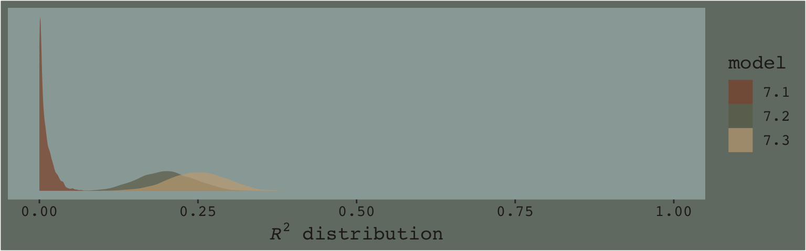
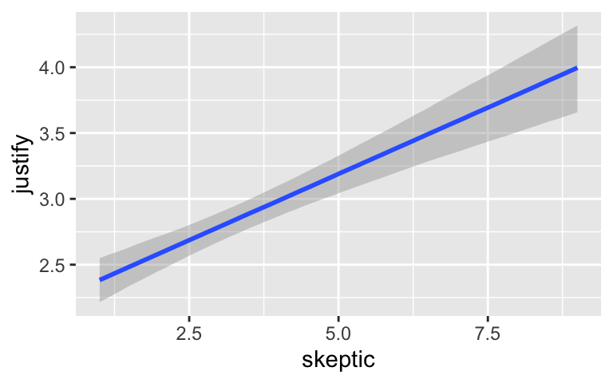
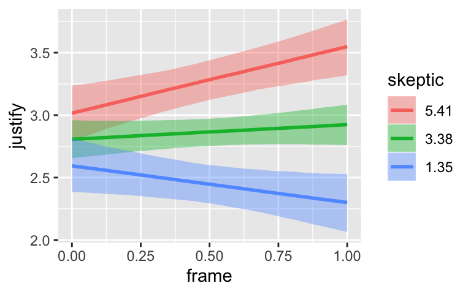
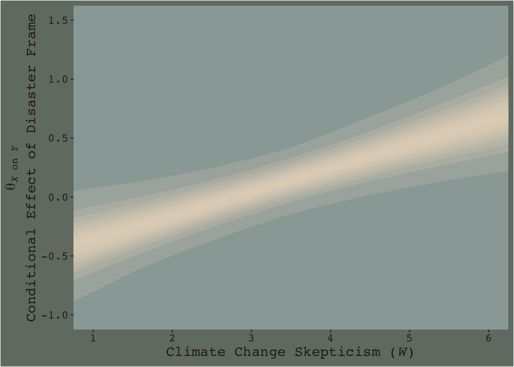
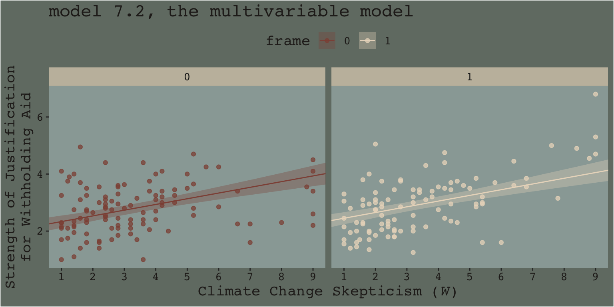

# (PART) MODERATION ANALYSIS {-}

# Fundamentals of Moderation Analysis


> The effect of $X$ on some variable $Y$ is moderated by $W$ if its size, sign, or strength depends on or can be predicted by $W$. In that case, $W$ is said to be a *moderator* of $X$’s effect on $Y$, or that $W$ and $X$ interact in their influence on $Y$. Identifying a moderator of an effect helps to establish the boundary conditions of that effect or the circumstances, stimuli, or type of people for which the effect is large versus small, present versus absent, positive versus negative, and so forth. (p. 220, *emphasis* in the original)

## Conditional and unconditional effects

> If $X$'s effect on $Y$ is moderated by another variable in the model, that means $X$'s effect depends on that other variable. But this model constrains $X$'s effect to be unconditional on $W$, meaning that it is invariant across all values of $W$. (p. 224)

Hayes's Table 7.1 and the related Figure 7.2 showcase this well. You might reproduce the data for both like this.


```r
library(tidyverse)

d <-
  crossing(x = -1:2,
           w = 0:2) %>% 
  mutate(A   = 4 + 1 * x + 2 * w,
         B   = 4 + 1 * x + 2 * w + 1.5 * x * w)

d
```

```
## # A tibble: 12 x 4
##        x     w     A     B
##    <int> <int> <dbl> <dbl>
##  1    -1     0     3   3  
##  2    -1     1     5   3.5
##  3    -1     2     7   4  
##  4     0     0     4   4  
##  5     0     1     6   6  
##  6     0     2     8   8  
##  7     1     0     5   5  
##  8     1     1     7   8.5
##  9     1     2     9  12  
## 10     2     0     6   6  
## 11     2     1     8  11  
## 12     2     2    10  16
```

In previous chapters, we alteried our plot themes using either built-in settings from **ggplot2** or extra themes from the **ggthemes** package. When we wanted to change them further, we did so with extra `theme()` arguments. One, it's nice to be know how to make one's own custom theme and, two, it'd be handy to condense our code a bit. Here we'll take a few cues from the [Building a New Theme](https://bookdown.org/rdpeng/RProgDA/building-a-new-theme.html) section from Peng, Kross, and Anderson's [*Mastering Software Development in R*](https://bookdown.org/rdpeng/RProgDA/). We'll make our own theme, `theme_07`, by saving a handful of augmentations from the default `theme_gray()` theme.


```r
library(dutchmasters)

theme_07 <- 
  theme_gray() + 
  theme(plot.background  = element_rect(fill = dutchmasters$little_street[7]),
        panel.background = element_rect(fill = dutchmasters$little_street[2]),
        strip.background = element_rect(fill = alpha(dutchmasters$little_street[5], 2/3),
                                        color = "transparent"),
        legend.background = element_rect(fill = "transparent"),
        legend.key = element_rect(fill = "transparent", color = "transparent"),
        panel.grid = element_blank(),
        text = element_text(family = "Courier",
                            color = dutchmasters$little_street[6],
                            size = 14),
        axis.text = element_text(color = dutchmasters$little_street[6]))
```

This chapter's color palette comes from the [**dutchmasters** package](https://github.com/EdwinTh/dutchmasters), which was itself based of [Vermeer's *The Little Street*](https://en.wikipedia.org/wiki/The_Little_Street). To get a quick glance at the full palette, we'll also use `viz_palette()`, a convenience function from the [**ochRe** package](https://github.com/ropenscilabs/ochRe).


```r
# devtools::install_github("ropenscilabs/ochRe")
library(ochRe)

viz_palette(dutchmasters$little_street)
```


With our new `theme_07` in hand, we're ready to make our version of Figure 7.2.


```r
library(directlabels)

d %>% 
  pivot_longer(A:B,
               values_to = "y") %>% 
  mutate(label = str_c("W = ", w),
         w     = factor(w),
         strip = if_else(name == "A",
                         "A: where W is a covariate",
                         "B: where W is a moderator")) %>% 
  
  ggplot(aes(x = x, y = y, group = w, size = w, label = label)) +
  geom_line(color = dutchmasters$little_street[9]) +
  geom_dl(method = list(dl.trans(x = x + 0.2),
                        "last.points", cex = 1,
                        color = dutchmasters$little_street[9],
                        fontfamily = "Courier")) +
  scale_size_manual(values = c(.5, .75, 1)) +
  coord_cartesian(xlim = c(-1, 2.6),
                  ylim = 0:16) +
  labs(x = expression(italic(X)),
       y = expression(hat(italic(Y)))) +
  facet_wrap(~strip) +
  theme_07 +
  # because we didn't alter the `legend.position` argument in our `theme_07`, 
  # we need to use `theme()` to remove it
  theme(legend.position = "none")
```


We borrowed `geom_dl()` form the [**directlabels** package](https://cran.r-project.org/web/packages/directlabels/index.html), which made it easy to insert the "W = $i$" labels to the right of the lines.

I played around with the annotation in Figure 7.4 for a while and it was just way more trouble than it was worth. If you're ever inspired to work it out, [please share your code](https://github.com/ASKurz/recoding_Introduction_to_Mediation_Moderation_and_Conditional_Process_Analysis/issues). I'm moving on.

### Eliminating the constraint of unconditionality.

We can write the generic moderation model as

$$Y = i_Y + f(W) X + b_2 W + e_Y,$$

> where $f(W)$ is a function of $W$. Consider a simple function of the form $f(W) = b_1 + b_3 W$. This function of $W$ looks like a simple linear regression model where $b_1$ is the constant and $b_3$ is the regression coefficient for $W$, except that rather than estimating some consequent variable from $W$, it is a model of the effect of $X$ on $Y$. (p. 226)

If we use that definition of $f(W)$, we can update our equation to

\begin{align*}
Y & = i_Y + (b_1 + b_3 W) X + b_2 W + e_Y, \text{or} \\
Y & = i_Y + b_1 X + b_2 W + b_3 XW + e_Y.
\end{align*}

Hayes called this the *simple linear moderation model*. Out of this equation we can extract $\theta_{X \rightarrow Y}$, the *conditional effect of* $X$ *on* $Y$, which takes the form

$$\theta_{X \rightarrow Y} = b_1 + b_3 W.$$

This is what Figure 7.2 was all about.

### Symmetry in moderation.

It turns out that, mathematically, there’s no difference in speaking about $X$ moderating $W$ than speaking about $W$ moderating $X$. These are all just capital letters standing in for variables and perhaps you’ll recall from grade school that $a + b + ab$ is just the same as $b + a + ba$. Thus we can rearrange the simple moderation equations above to

$$Y = i_Y + b_1 X + (b_2 + b_3 X) W + e_Y$$

and speak instead about the *conditional effect of* $W$ *on* $Y$,

$$\theta_{w \rightarrow Y} = b_2 + b_3 X.$$

### Interpretation of the regression coefficients.

With all this wacky stuff going on, we should clarify some of our terms.

* $i_Y$ is still the expected value for $Y$ with both $X = 0$ and $W = 0$. 
* $b_1$ is the conditional effect of $X$ on $Y$ when $W = 0$.
* $b_2$ is the conditional effect of $W$ on $Y$ when $X = 0$.

It turns out $b_3$ requires more words, which we'll provide in the next subsection.

### The importance of $b_3$ wen asking about mediation.

> The simple moderation model allows $X$'s effect on $Y$ to be a linear function of $W$. Of course, allowing that effect to depend on $W$ doesn't mean that it actually does in reality. In most any sample of data, [the point estimate (i.e., posterior mean or median) for] $b_3$ will be different from zero even when $X$'s effect on $Y$ is independent of $W$. Of interest when [modeling] a moderation hypothesis is not just allowing $X$'s effect to be contingent on $W$, but also determining whether $b_3$ deviates too far from zero than would be expected given that $b_3$, like any statistic, is subject to sampling variance. (p. 231)

## An example: Climate change disasters and humanitarianism

Here we load a couple necessary packages, load [Chapman and Lickel (2016)](https://static1.squarespace.com/static/5ba3a7e39772aef68a375870/t/5ba5256dc83025bd88601afe/1537549679439/Chapman+and+Lickel%2C+2016+-+Print+Edition.pdf) data, and take a `glimpse()`.


```r
disaster <- read_csv("data/disaster/disaster.csv")

glimpse(disaster)
```

```
## Observations: 211
## Variables: 5
## $ id      <dbl> 1, 2, 3, 4, 5, 6, 7, 8, 9, 10, 11, 12, 13, 14, 15, 16, 17, 18, 19, 20, 21, 22, 23, 24, 25, …
## $ frame   <dbl> 1, 1, 1, 1, 1, 0, 0, 1, 0, 0, 1, 1, 0, 0, 1, 1, 1, 1, 0, 0, 1, 0, 1, 0, 1, 1, 0, 0, 0, 1, 0…
## $ donate  <dbl> 5.6, 4.2, 4.2, 4.6, 3.0, 5.0, 4.8, 6.0, 4.2, 4.4, 5.8, 6.2, 6.0, 4.2, 4.4, 5.8, 5.4, 3.4, 7…
## $ justify <dbl> 2.95, 2.85, 3.00, 3.30, 5.00, 3.20, 2.90, 1.40, 3.25, 3.55, 1.55, 1.60, 1.65, 2.65, 3.15, 2…
## $ skeptic <dbl> 1.8, 5.2, 3.2, 1.0, 7.6, 4.2, 4.2, 1.2, 1.8, 8.8, 1.0, 5.4, 2.2, 3.6, 7.8, 1.6, 1.0, 6.4, 3…
```

Here is how to get the ungrouped mean and $SD$ values for `justify` and `skeptic`, as presented in Table 7.3.


```r
disaster %>% 
  pivot_longer(justify:skeptic) %>% 
  group_by(name) %>% 
  summarise(mean = mean(value),
            sd   = sd(value)) %>% 
  mutate_if(is.double, round, digits = 3)
```

```
## # A tibble: 2 x 3
##   name     mean    sd
##   <chr>   <dbl> <dbl>
## 1 justify  2.87  0.93
## 2 skeptic  3.38  2.03
```

And here we get the same summary values, this time grouped by `frame`.


```r
disaster %>% 
  pivot_longer(justify:skeptic) %>% 
  group_by(frame, name) %>% 
  summarise(mean = mean(value),
            sd   = sd(value)) %>% 
  mutate_if(is.double, round, digits = 3)
```

```
## # A tibble: 4 x 4
## # Groups:   frame [2]
##   frame name     mean    sd
##   <dbl> <chr>   <dbl> <dbl>
## 1     0 justify  2.80 0.849
## 2     0 skeptic  3.34 2.04 
## 3     1 justify  2.94 1.01 
## 4     1 skeptic  3.42 2.03
```

Let's open **brms**.


```r
library(brms)
```

Now fit the simple univariable model.


```r
model7.1 <-
  brm(data = disaster, 
      family = gaussian,
      justify ~ 1 + frame,
      cores = 4)
```


```r
print(model7.1)
```

```
##  Family: gaussian 
##   Links: mu = identity; sigma = identity 
## Formula: justify ~ 1 + frame 
##    Data: disaster (Number of observations: 211) 
## Samples: 4 chains, each with iter = 2000; warmup = 1000; thin = 1;
##          total post-warmup samples = 4000
## 
## Population-Level Effects: 
##           Estimate Est.Error l-95% CI u-95% CI Rhat Bulk_ESS Tail_ESS
## Intercept     2.80      0.09     2.62     2.97 1.00     3844     2857
## frame         0.14      0.13    -0.11     0.38 1.00     3709     2972
## 
## Family Specific Parameters: 
##       Estimate Est.Error l-95% CI u-95% CI Rhat Bulk_ESS Tail_ESS
## sigma     0.94      0.05     0.85     1.03 1.00     3908     2827
## 
## Samples were drawn using sampling(NUTS). For each parameter, Eff.Sample 
## is a crude measure of effective sample size, and Rhat is the potential 
## scale reduction factor on split chains (at convergence, Rhat = 1).
```

The 'Estimate' (i.e., posterior mean) of the model intercept is the expected `justify` value for when `frame` is 0. The 'Estimate' for `frame` is the expected difference when `frame` is a 1. If all you care about is the posterior mean, you could execute


```r
fixef(model7.1)["Intercept", 1] + fixef(model7.1)["frame", 1]
```

```
## [1] 2.937405
```

which matches up nicely with the equation on page 233. But this wouldn't be very Bayesian of us. It'd be more satisfying if we had an expression of the uncertainty in the value. For that, we'll follow our usual practice of extracting the posterior samples, making nicely-named vectors, and summarizing a bit.


```r
post <-
  posterior_samples(model7.1) %>% 
  mutate(when_x_is_0 = b_Intercept,
         when_x_is_1 = b_Intercept + b_frame)

post %>%
  pivot_longer(when_x_is_0:when_x_is_1) %>% 
  group_by(name) %>% 
  summarize(mean = mean(value),
            sd   = sd(value)) %>% 
  mutate_if(is.double, round, digits = 3)  
```

```
## # A tibble: 2 x 3
##   name         mean    sd
##   <chr>       <dbl> <dbl>
## 1 when_x_is_0  2.8  0.089
## 2 when_x_is_1  2.94 0.094
```

Hayes referenced a $t$-test and accompanying $p$-value in the lower part of page 233. We, of course, aren't going to do that. But we do have the 95% intervals in our `print()` output, above, which we can also look at with the `brms::posterior_interval()` function.


```r
posterior_interval(model7.1)["b_frame", ]
```

```
##       2.5%      97.5% 
## -0.1104055  0.3802928
```

And we can always plot.


```r
post %>% 
  ggplot(aes(x = b_frame)) +
  geom_density(size = 0, fill = dutchmasters$little_street[1]) +
  geom_vline(xintercept = 0, color = dutchmasters$little_street[11]) +
  scale_x_continuous(breaks = c(-.3, 0, .6)) +
  scale_y_continuous(NULL, breaks = NULL) +
  theme_07 +
  theme(legend.position = "none")
```


We'll use the `update()` function to hastily fit `model7.2` and `model7.3`.


```r
model7.2 <-
  update(model7.1, 
         newdata = disaster,
         formula = justify ~ 1 + frame + skeptic,
         cores = 4)

model7.3 <-
  update(model7.1, 
         newdata = disaster,
         formula = justify ~ 1 + frame + skeptic + frame:skeptic,
         cores = 4)
```

Note our use of the `frame:skeptic` syntax in `model7.3`. With that syntax we didn't need to make an interaction variable in the data by hand. The **brms** package just handled it for us. An alternative syntax would have been `frame*skeptic`. But if you really wanted to make the interaction variable by hand, you'd do this.


```r
disaster <-
  disaster %>% 
  mutate(interaction_variable = frame * skeptic)
```

Once you have `interaction_variable` in the data, you'd specify a model formula within the `brm()` function like `formula = justify ~ 1 + frame + skeptic + interaction_variable`. I'm not going to do that, here, but you can play around yourself if so inclined.

Here are the quick and dirty coefficient summaries for our two new models.


```r
posterior_summary(model7.2)
```

```
##                 Estimate  Est.Error         Q2.5        Q97.5
## b_Intercept    2.1329427 0.12666520    1.8795620    2.3857316
## b_frame        0.1178844 0.11820458   -0.1143265    0.3487719
## b_skeptic      0.2001487 0.02888595    0.1435666    0.2564288
## sigma          0.8409529 0.04104724    0.7653761    0.9274223
## lp__        -268.3636435 1.46962043 -272.1776486 -266.5660614
```

```r
posterior_summary(model7.3)
```

```
##                     Estimate  Est.Error          Q2.5        Q97.5
## b_Intercept        2.4554199 0.14742452    2.16468057    2.7530935
## b_frame           -0.5698758 0.21855069   -1.00621926   -0.1555456
## b_skeptic          0.1037442 0.03795116    0.02815453    0.1750698
## b_frame:skeptic    0.2033168 0.05493597    0.09793366    0.3130835
## sigma              0.8165278 0.04032698    0.73925992    0.9000036
## lp__            -262.3327179 1.55614763 -266.24420581 -260.2590010
```

Just focusing on our primary model, `model7.3`, here's another way to look at the coefficients. 


```r
stanplot(model7.3) +
  theme_07
```


By default, the `brms::stanplot()` function returns coefficient plots which depict the parameters of a model by their posterior means (i.e., dots), 50% intervals (i.e., thick horizontal lines), and 95% intervals (i.e., thin horizontal lines). As `stanplot()` returns a **ggplot2** object, one can customize the theme and so on.

We'll extract the $R^2$ iterations in the usual way once for each model, and then combine them for a plot.


```r
# for each of the three models, we create a separare R2 tibble
r2_1 <- 
  bayes_R2(model7.1,
           summary = F) %>% 
  data.frame()

r2_2 <- 
  bayes_R2(model7.2,
           summary = F) %>% 
  data.frame()

r2_3 <- 
  bayes_R2(model7.3,
           summary = F) %>% 
  data.frame()

# here we combine them into one tibble, indexed by `model`
r2 <-
  r2_1 %>% 
  bind_rows(r2_2) %>% 
  bind_rows(r2_3) %>% 
  mutate(model = rep(str_c("7.", 1:3), each = 4000))

# now we plot
r2 %>% 
  ggplot(aes(x = R2)) +
  geom_density(aes(fill = model), size = 0, alpha = 2/3) +
  scale_fill_manual(values = dutchmasters$little_street[c(3, 4, 8)] %>% as.character()) +
  scale_y_continuous(NULL, breaks = NULL) +
  xlab(expression(paste(italic(R)^2, " distribution"))) +
  coord_cartesian(xlim = 0:1) +
  theme_07
```



Here's the $\Delta R^2$ distribution for `model7.3` minus `model7.2`.


```r
r2_2 %>% 
  bind_cols(r2_3) %>% 
  set_names(str_c("model7.", 2:3)) %>% 
  mutate(dif = model7.3 - model7.2) %>% 
  
  ggplot(aes(x = dif)) +
  geom_density(color = "transparent",
               fill = dutchmasters$little_street[9]) +
  scale_y_continuous(NULL, breaks = NULL) +
  labs(title = expression(paste("The ", Delta, italic(R)^2)),
       subtitle = "Like in the text, the posterior\nmean is about 0.05.",
       x = NULL) +
  theme_07
```


In addition to the $R^2$, one can use information criteria to compare the models. Here we'll use the LOO to compare all three.


```r
model7.1 <- add_criterion(model7.1, "loo")
model7.2 <- add_criterion(model7.2, "loo")
model7.3 <- add_criterion(model7.3, "loo")

loo_compare(model7.1, model7.2, model7.3) %>% 
  print(simplify = F)
```

```
##          elpd_diff se_diff elpd_loo se_elpd_loo p_loo  se_p_loo looic  se_looic
## model7.3    0.0       0.0  -259.1     10.9         5.5    0.9    518.1   21.7  
## model7.2   -5.7       4.2  -264.7     11.2         4.7    0.9    529.4   22.4  
## model7.1  -27.1       9.5  -286.2     12.0         3.3    0.8    572.4   24.0
```

The LOO point estimate for both multivariable models were clearly lower than that for `model7.1`. The point estimate for the moderation model, `model7.3`, was within the double-digit range lower than that for `model7.2`, which typically suggests better fit. But notice how wide the standard error was. There's a lot of uncertainty, there. Hopefully this isn't surprising. Our $R^2$ difference was small and uncertain, too. We can also compare them with AIC-type model weighting, which you can learn more about [starting at this point in this lecture](https://www.youtube.com/watch?v=t0pRuy1_190) or [this related vignette for the **loo** package](https://cran.r-project.org/web/packages/loo/vignettes/loo2-weights.html). Here we'll keep things simple and weight with the LOO.


```r
model_weights(model7.1, model7.2, model7.3,
              weights = "loo") %>% 
  round(digits = 3)
```

```
## model7.1 model7.2 model7.3 
##    0.000    0.003    0.997
```

The `model_weights()` results put almost all the relative weight on `model7.3`. This doesn't mean `model7.3` is the "true model" or anything like that. It just suggests that it's the better of the three with respect to the data.

Here are the results of the equations in the second half of page 237.


```r
post <- posterior_samples(model7.3)

post %>% 
  mutate(if_2   = b_frame + `b_frame:skeptic` * 2,
         if_3.5 = b_frame + `b_frame:skeptic` * 3.5,
         if_5   = b_frame + `b_frame:skeptic` * 5) %>% 
  pivot_longer(starts_with("if_")) %>% 
  group_by(name) %>% 
  summarise(mean = mean(value),
            sd   = sd(value)) %>% 
  mutate_if(is.double, round, digits = 3) %>% 
  mutate(name = str_remove(name, "if_")) %>% 
  rename(`conditional effect of X on Y when W =` = name)
```

```
## # A tibble: 3 x 3
##   `conditional effect of X on Y when W =`   mean    sd
##   <chr>                                    <dbl> <dbl>
## 1 2                                       -0.163 0.137
## 2 3.5                                      0.142 0.113
## 3 5                                        0.447 0.143
```

### Estimation using ~~PROCESS~~ brms.

Similar to what Hayes advertised with PROCESS, with our `formula = justify ~ 1 + frame + skeptic + frame:skeptic` code in `model7.3`, we didn't need to hard code an interaction variable into the data. **brms** handled that for us.

### Interpreting the regression coefficients.

When you add an interaction term into a model, such as $x_1 \cdot x_2$, this is sometimes called a *higher order term*. The terms that made up the higher order term--$x_1$ and $x_2$, in this case--are correspondingly called the *lower order terms*. As Hayes pointed out, these lower order terms are conditional effects. Interpret them with care.

### Variable scaling and the interpretation of $b_1$ and $b_3$.

Making the mean-centered version of our $W$ variable, `skeptic`, is a simple `mutate()` operation. We'll just call it `skeptic_c`.


```r
disaster <-
  disaster %>% 
  mutate(skeptic_c = skeptic - mean(skeptic))
```

And here's how we might fit the model.


```r
model7.4 <-
  update(model7.3, 
         newdata = disaster,
         formula = justify ~ 1 + frame + skeptic_c + frame:skeptic_c,
         cores = 4)
```

Here are the summaries of our fixed effects.


```r
fixef(model7.4)
```

```
##                  Estimate  Est.Error        Q2.5     Q97.5
## Intercept       2.8074617 0.07751648  2.65887008 2.9642447
## frame           0.1161191 0.11043112 -0.11107219 0.3235638
## skeptic_c       0.1056709 0.03772872  0.03261492 0.1803278
## frame:skeptic_c 0.1995691 0.05509437  0.09086664 0.3101503
```

To practice, `frame` and `skeptic_c` are lower order terms and, as such, they are conditional effects. The higher order term is `frame:skeptic_c`. Anyway, here are the $R^2$ distributions for `model7.3` and `model7.4`. They're the same within simulation variance.


```r
bayes_R2(model7.3) %>% round(digits = 3)
```

```
##    Estimate Est.Error  Q2.5 Q97.5
## R2    0.249     0.045 0.159 0.332
```

```r
bayes_R2(model7.4) %>% round(digits = 3)
```

```
##    Estimate Est.Error  Q2.5 Q97.5
## R2    0.248     0.045 0.159 0.336
```

If you're bothered by the differences resulting from sampling variation, you might increase the number of HMC iterations from the 2000-per-chain default. Doing so might look something like this.


```r
model7.3 <-
  update(model7.3,
         chains = 4, cores = 4, warmup = 1000, iter = 10000)

model7.4 <-
  update(model7.4,
         chains = 4, cores = 4, warmup = 1000, iter = 10000)
```

Before we fit `model7.5`, we'll recode `frame` to a -.5/.5 metric and name it `frame_.5`.


```r
disaster <-
  disaster %>% 
  mutate(frame_.5 = ifelse(frame == 0, -.5, .5))
```

Time to fit `model5`.


```r
model7.5 <-
  update(model7.4, 
         newdata = disaster,
         formula = justify ~ 1 + frame_.5 + skeptic_c + frame_.5:skeptic_c,
         cores = 4)
```

Our posterior summaries match up nicely with the output in Hayes's Table 7.4.


```r
fixef(model7.5)
```

```
##                     Estimate  Est.Error        Q2.5     Q97.5
## Intercept          2.8652210 0.05594018  2.75503579 2.9742392
## frame_.5           0.1197490 0.11139462 -0.09630588 0.3354997
## skeptic_c          0.2049131 0.02754867  0.15055341 0.2584152
## frame_.5:skeptic_c 0.2009519 0.05572345  0.08998898 0.3118033
```

Here's a summary of the Bayesian $R^2$.


```r
bayes_R2(model7.5)
```

```
##    Estimate  Est.Error     Q2.5     Q97.5
## R2 0.248159 0.04337085 0.159787 0.3294168
```

## Visualizing moderation

> A regression model with the product to two antecedent variables in an abstract mathematical representation of one’s data that can be harder to interpret than a model without such a produce. As described earlier, the coefficients for $X$ and $W$ are conditional effects that may not have any substantive interpretation, and the coefficient for $XW$ is interpreted as a difference between differences that can be hard to make sense of without more information. (pp. 223--224)

This is why we plot. To get quick plots for the interaction effect in **brms**, you might use the `conditional_effects()` function.


```r
conditional_effects(model7.3)
```



By default, `conditional_effects()` will show three levels of the variable on the right side of the interaction term. The formula in `model7.3` was `justify ~ frame + skeptic + frame:skeptic `, with `frame:skeptic` as the interaction term and `skeptic` making up the right hand side of the term. The three levels of `skeptic` in the plot, above, are the mean $\pm 1$ standard deviation. See the **brms** [reference manual](https://cran.r-project.org/web/packages/brms/brms.pdf) for details on the `conditional_effects()` function.

On page 244, Hayes discussed using the 16th, 50th, and 84th percentiles for the moderator variable. We can compute those with `quantile()`.


```r
quantile(disaster$skeptic, probs = c(.16, .5, .84))
```

```
## 16% 50% 84% 
## 1.6 2.8 5.2
```

The first two columns in Hayes's Table 7.5 contain the values he combined with the point estimates of his model to get the $\hat Y$ column. The way we'll push those values through `model7.3`'s posterior is with `brms::fitted()`. As a preparatory step, we'll put the predictor values in a data object, `nd`.


```r
(
  nd <-
  crossing(frame = 0:1,
         skeptic = quantile(disaster$skeptic, 
                            probs = c(.16, .5, .84)))
)
```

```
## # A tibble: 6 x 2
##   frame skeptic
##   <int>   <dbl>
## 1     0     1.6
## 2     0     2.8
## 3     0     5.2
## 4     1     1.6
## 5     1     2.8
## 6     1     5.2
```

Now we've go our `nd`, we'll get our posterior estimates for $Y$ with `fitted()`.


```r
fitted(model7.3, newdata = nd)
```

```
##      Estimate  Est.Error     Q2.5    Q97.5
## [1,] 2.621411 0.10111061 2.421408 2.825915
## [2,] 2.745904 0.08018575 2.587693 2.903098
## [3,] 2.994890 0.10623870 2.785234 3.202648
## [4,] 2.376842 0.11046776 2.156588 2.590565
## [5,] 2.745315 0.08474800 2.573896 2.912143
## [6,] 3.482262 0.10738886 3.266337 3.690769
```

When using the default `summary = TRUE` settings in `fitted()`, the function returns posterior means, $SD$s and 95% intervals for $Y$ based on each row in the `nd` data we specified in the `newdata = nd` argument. You don't have to name your newdata `nd` or anything like that; it's just my convention.

Here' a quick plot of what those values imply.


```r
fitted(model7.3, newdata = nd) %>% 
  data.frame() %>% 
  bind_cols(nd) %>% 
  
  ggplot(aes(x = skeptic)) +
  geom_ribbon(aes(ymin = Q2.5, ymax = Q97.5, fill = frame %>% as.character()),
              alpha = 1/3) +
  geom_line(aes(y = Estimate, color = frame %>% as.character())) +
  scale_fill_manual("frame",
                    values = dutchmasters$little_street[c(10, 5)] %>% as.character()) +
  scale_color_manual("frame",
                     values = dutchmasters$little_street[c(10, 5)] %>% as.character()) +
  theme_07
```


That plot is okay, but we can do better.

In order to plot the model-implied effects across the full range of `skeptic` values presented in Figure 7.7, you need to change the range of those values in the `nd` data. Also, although the effect is subtle in the above example, 95% intervals often follow a bowtie shape. In order to insure the contours of that shape are smooth, it's often helpful to specify 30 or so evenly-spaced values in the variable on the x-axis, `skeptic` in this case. We'll employ the `seq()` function for that and specify `length.out = 30`. In addition, we add a few other flourishes to make our plot more closely resemble the one in the text.

Here's our Figure 7.7.


```r
nd <- 
  crossing(frame   = 0:1,
           skeptic = seq(from = 0, to = 7, length.out = 30))

fitted(model7.3, newdata = nd) %>% 
  as_tibble() %>% 
  bind_cols(nd) %>% 
  
  ggplot(aes(x = skeptic)) +
  geom_ribbon(aes(ymin = Q2.5, ymax = Q97.5, fill = frame %>% as.character()),
              alpha = 1/3) +
  geom_line(aes(y = Estimate, color = frame %>% as.character())) +
  scale_fill_manual("frame",
                    values = dutchmasters$little_street[c(10, 5)] %>% as.character()) +
  scale_color_manual("frame",
                     values = dutchmasters$little_street[c(10, 5)] %>% as.character()) +
  scale_x_continuous(breaks = 1:6) +
  coord_cartesian(xlim = 1:6,
                  ylim = 2:4) +
  labs(x = expression(paste("Climate Change Skepticism (", italic("W"), ")")),
       y = "Strength of Justification\nfor Withholding Aid") +
  theme_07 +
  theme(legend.position = "top")
```


Do you see that subtle bowtie shape?

## Probing an interaction

As with other modeling contexts, there the results from our moderation models, like depicted in the last plot, carry uncertainty with them. 

> To deal with the uncertainty, it is common to follow up a test of interaction with a set of additional inferential tests to establish where in the distribution of the moderator $X$ has an effect on $Y$ that is different from zero and where it does not. This exercise is commonly known as "probing" an interaction, like you might squeeze an avocado or a mango in the produce section of the grocery store to assess its ripeness. The goal is to ascertain where in the distribution of the moderator $X$ is related to $Y$ and where it is not in an attempt to better discern the substantive interpretation of the interaction. In this section [we will cover] two approaches to probing an interaction. (p. 249)

As in earlier sections and chapters, our approach will largely follow Hayes's, but we will not be emphasizing statistical tests, $p$-values, and so on. You'll see.

### The pick-a-point approach.

> The pick-a-point approach ([Rogosa, 1980](http://statweb.stanford.edu/~rag/ed257/cnrl.pdf); [Bauer & Curran, 2005](https://www.tandfonline.com/doi/pdf/10.1207/s15327906mbr4003_5)), sometimes called an *analysis of simple slopes* or a *spotlight analysis*, is perhaps the most popular approach to probing an interaction and is described in most discussions of multiple regression with interactions (e.g., [Aiken & West, 1991](http://us.sagepub.com/en-us/nam/multiple-regression/book3045); [Cohen et al., 2003](https://www.taylorfrancis.com/books/9780203774441); [Darlington & Hayes, 2017](https://www.guilford.com/books/Regression-Analysis-and-Linear-Models/Darlington-Hayes/9781462521135/reviews); [Hayes, 2005](http://afhayes.com/statistical-methods-for-communication-science.html); [Jaccard & Turrisi, 2003](https://methods.sagepub.com/book/interaction-effects-in-multiple-regression); [Spiller, Fitzsimons, Lynch, & McClelland, 2013](https://www.researchgate.net/profile/John_Lynch6/publication/255947445_Spiller_et_al_jmr120420-web-appendixdocx/links/00463520e21cc21a0f000000/Spiller-et-al-jmr120420-web-appendixdocx.pdf)). This procedure involves selecting a value or values of the moderator $W$, calculating the conditional effect of $X$ on $Y (\theta_{X \rightarrow Y})$ at that value or values, and then conducting an inferential test or generating a confidence interval. (p. 249, *emphasis* in the original)

Though we will not be using inferential tests, we will use various ways of expressing the uncertainty in our Bayesian models, such as with 95% credible intervals and other ways of summarizing the posterior.

#### The pick-a-point approach ~~implimented by regression centering~~ working directly with the posterior. 

Yes, if you wanted to use the regression centering approach, you could do that in **brms**. Just center the necessary variables in the way Hayes described in the text, refit the model, and `summarize()`. I suspect this would be particularly approachable for someone new to **R** and to the ins and outs of data wrangling. But I'm going leave that as an exercise for the interested reader.

Now that we've already got a posterior for our model, we can just either algebraically manipulate the vectors yielded by `posterior_samples()` or push predictions through `fitted()`. To give a sense, we'll start off with the 16^th^ percentile for `skeptic`. Recall we can get that with the `quantile()` function.


```r
 quantile(disaster$skeptic, probs = .16)
```

```
## 16% 
## 1.6
```

Now we just need to feed that value and different values of `frame` into the posterior samples of the model coefficients. We then create a `difference` score for the model-implied estimates given `frame` is either 0 or 1 and then plot that `difference`.


```r
post %>% 
  # use the model formula
  mutate(y_given_frame_0_skeptic_1.6 = b_Intercept + b_frame * 0 + b_skeptic * 1.6 + `b_frame:skeptic` * 0 * 1.6,
         y_given_frame_1_skeptic_1.6 = b_Intercept + b_frame * 1 + b_skeptic * 1.6 + `b_frame:skeptic` * 1 * 1.6) %>% 
  # compute the difference
  mutate(difference = y_given_frame_1_skeptic_1.6 - y_given_frame_0_skeptic_1.6) %>% 
  
  # plot!
  ggplot(aes(x = difference)) +
  geom_density(color = "transparent",
               fill = dutchmasters$little_street[9]) +
  geom_vline(xintercept = 0, color = dutchmasters$little_street[7], linetype = 2) +
  scale_y_continuous(NULL, breaks = NULL) +
  labs(subtitle = "The effect of frame on justify\ngiven skeptic = 1.6",
       x = NULL) +
  theme_07
```


Note how nicely that distribution corresponds to the output in the lower left corner of Hayes's Figure 7.8. If we wanted the values for other values of `skeptic` (e.g., 2.8 and 5.2 as in the text), we'd just rinse, wash, and repeat. A nice quality of this method is it requires you to work explicitly with the model formula. But it's also clunky if you want to do this over many values. The `fitted()` function offers an alternative approach.

Recall how the default `fitted()` settings are to return summaries of a model's $Y$-variable given values of the predictor variables. In the previous section we put our preferred `frame` and `skeptic` values into a data object named `nd` and used the `newdata` argument to push those values through `fitted()`. Buy default, this yielded the typical posterior means, $SD$s, and 95% intervals for the predictions. However, if one sets `summary = F`, the output will differ. First. Let's revisit what `nd` looks like.


```r
(
  nd <-
  crossing(frame   = 0:1,
           skeptic = quantile(disaster$skeptic, 
                              probs = c(.16, .5, .84)))
  )
```

```
## # A tibble: 6 x 2
##   frame skeptic
##   <int>   <dbl>
## 1     0     1.6
## 2     0     2.8
## 3     0     5.2
## 4     1     1.6
## 5     1     2.8
## 6     1     5.2
```

Here's what happens when we use `summary = F`.


```r
f <-
  fitted(model7.3, newdata = nd, summary = F)

f %>% str()
```

```
##  num [1:4000, 1:6] 2.79 2.67 2.67 2.72 2.62 ...
```

```r
f %>% head()
```

```
##          [,1]     [,2]     [,3]     [,4]     [,5]     [,6]
## [1,] 2.786198 2.844305 2.960519 2.248915 2.664708 3.496295
## [2,] 2.673565 2.773401 2.973074 2.307611 2.749349 3.632825
## [3,] 2.666410 2.816476 3.116607 2.328586 2.719344 3.500860
## [4,] 2.719128 2.866154 3.160204 2.309730 2.658833 3.357040
## [5,] 2.617568 2.781539 3.109481 2.379756 2.731071 3.433701
## [6,] 2.707056 2.792687 2.963949 2.410383 2.784270 3.532045
```

With `summary = F`, `fitted()` returned a matrix of 4000 rows (i.e., one for each posterior draw) and 6 vectors (i.e., one for each row in our `nd` data). So now instead of summary information, we have a full expression of the uncertainty in terms of 4000 draws. If you prefer working within the **tidyverse** and plotting with **ggplot2**, matrices aren't the most useful data type. Let's wrangle a bit.


```r
f <-
  f %>% 
  data.frame() %>% 
  gather() %>% 
  select(-key) %>% 
  bind_cols(
    nd %>% 
      expand(nesting(frame, skeptic),
             iter = 1:4000)
  ) %>%
  pivot_wider(names_from = frame, values_from = value) %>% 
  mutate(difference = `1` - `0`,
         # this isn't necessary, but will help with the facet labels
         skeptic = str_c("skeptic = ", skeptic)) 

f %>% 
  head()
```

```
## # A tibble: 6 x 5
##   skeptic        iter   `0`   `1` difference
##   <chr>         <int> <dbl> <dbl>      <dbl>
## 1 skeptic = 1.6     1  2.79  2.25     -0.537
## 2 skeptic = 1.6     2  2.67  2.31     -0.366
## 3 skeptic = 1.6     3  2.67  2.33     -0.338
## 4 skeptic = 1.6     4  2.72  2.31     -0.409
## 5 skeptic = 1.6     5  2.62  2.38     -0.238
## 6 skeptic = 1.6     6  2.71  2.41     -0.297
```

Now we have our draws in a nice structure, we're ready to plot.


```r
f %>% 
  ggplot(aes(x = difference)) +
  geom_density(color = "transparent",
               fill = dutchmasters$little_street[9]) +
  geom_vline(xintercept = 0, color = dutchmasters$little_street[7], linetype = 2) +
  scale_y_continuous(NULL, breaks = NULL) +
  labs(subtitle = "The effect of frame on justify given three different values of skeptic",
       x = NULL) +
  theme_07 +
  facet_wrap(~skeptic)
```


And if you prefered summary information instead of plots, you might just use `tidybayes::median_qi()`.


```r
library(tidybayes)

f  %>% 
  group_by(skeptic) %>% 
  median_qi(difference) %>% 
  mutate_if(is.double, round, digits = 3)
```

```
## # A tibble: 3 x 7
##   skeptic       difference .lower .upper .width .point .interval
##   <chr>              <dbl>  <dbl>  <dbl>  <dbl> <chr>  <chr>    
## 1 skeptic = 1.6     -0.246 -0.546  0.042   0.95 median qi       
## 2 skeptic = 2.8      0     -0.23   0.224   0.95 median qi       
## 3 skeptic = 5.2      0.483  0.199  0.78    0.95 median qi
```

### The Johnson-Neyman technique.

The JN technique generalizes this approach over many values of $W$ (i.e., `skeptic` in this example) in order to get a sense of the trend and summarize regions of the trend in terms of $p$-value thresholds. Since we're emphasizing modeling and deemphasizing null-hypothesis testing in this project, I'll show a Bayesian version of the approach without the $p$-values.

#### Implementation in ~~PROCESS~~ brms.

Since Figure 7.9 had `skeptic` values ranging from 1 to 6 with ticks on the 0.5s, we'll use a similar approach for our version. We will display posterior samples with `fitted()` for `skeptic` values ranging from .5 to 6.5, one for each 0.5—13 in total. But since we have two levels of `frame` (i.e., 0 and 1), that really gives us 26. And we don't just want 26 summaries; we want full posterior distributions for each of those 26. 

We've got a lot of moving parts in the code, below. To help make sure everything adds up, we'll save several important values as **R** objects.


```r
iter             <- 4000  # this number comes from the total number of post-warmup posterior iterations from `brm()`
n_skeptic_values <- 13    # we're choosing 13 in this example to follow some of the sensibilities in Figure 7.9. You'll see.

# as before, we'll make `nd` to feed in to `fitted()`
nd <-
  crossing(frame   = 0:1,
           skeptic = seq(from = .5, to = 6.5, length.out = n_skeptic_values))


# after the initial `fitted()` action, we need a few steps to wrangle the data into a useful format
f <-
  fitted(model7.3, newdata = nd, summary = F) %>% 
  data.frame() %>% 
  gather() %>% 
  bind_cols(
    nd %>% 
      expand(nesting(frame, skeptic),
             iter = 1:iter)
  ) %>% 
  select(-key) %>% 
  rename(estimate = value) %>% 
  pivot_wider(names_from = frame, values_from = estimate) %>% 
  mutate(difference = `1` - `0`)

# finally, here's the plot
f %>% 
  ggplot(aes(x = skeptic %>% as.character, y = difference)) +
  geom_hline(yintercept = 0, color = dutchmasters$little_street[7]) +
  geom_violin(size = 0, fill = dutchmasters$little_street[6]) +
  stat_summary(fun.y = median,
               fun.ymin = function(x){quantile(x, probs = .025)},
               fun.ymax = function(x){quantile(x, probs = .975)},
               color = dutchmasters$little_street[5]) +
  labs(x = expression(paste("Climate Change Skepticism (", italic(W), ")")),
       y = expression(atop(theta[paste(italic(X), " on ", italic(Y))], paste("Conditional Effect of Disaster Frame")))) +
  theme_07
```


[Note. I got the `atop()` trick for the label for the y-axis from [Drew Steen's answer to this stackoverflow question](https://stackoverflow.com/questions/13223846/ggplot2-two-line-label-with-expression?utm_medium=organic&utm_source=google_rich_qa&utm_campaign=google_rich_qa).]

This isn't quite our version of Figure 7.9, but I'm hoping it'll add some pedagogical value for what we're doing. Since we specified `summary = F` within `fitted()`, we got full posterior distributions for each of our 26 conditions. *Because Figure 7.9 is all about differences between each `frame` pair across the various values of `skeptic`*, we needed to make a `difference` score for each pair; this is what we did with the last `mutate()` line before the plot code. This initial version of the plot shows the full posterior distribution for each `difference` score. The posteriors are depicted with violin plots, which are density plots set on their side and symmetrically reflected as if by a mirror to give a pleasing leaf- or violin-like shape (though [beware](https://twitter.com/naomicaselli/status/973601256609599488?lang=en)). The light dots and vertical lines are the posterior medians and 95% intervals for each. 

Going from left to right, it appears we have a clearly emerging trend. We can more simply express the trend by summarizing each posterior with medians and 95% intervals.


```r
f %>% 
  group_by(skeptic) %>% 
  median_qi(difference) %>% 
  
  ggplot(aes(x = skeptic)) +
  geom_hline(yintercept = 0, color = dutchmasters$little_street[7]) +
  geom_vline(xintercept = c(1.171, 3.934), color = dutchmasters$little_street[7]) +
  geom_ribbon(aes(ymin = .lower, ymax = .upper),
              fill = dutchmasters$little_street[5],
              alpha = 1/2) +
  geom_line(aes(y = difference),
          color = dutchmasters$little_street[5], size = 1) +
  scale_x_continuous(breaks = 1:6) +
  coord_cartesian(xlim = c(1, 6),
                  ylim = c(-1, 1.5)) +
  labs(x = expression(paste("Climate Change Skepticism (", italic(W), ")")),
       y = expression(atop(theta[paste(italic(X), " on ", italic(Y))], paste("Conditional Effect of Disaster Frame")))) +
  theme_07
```



Notice how the contour boundaries of the 95% intervals are a little clunky. That's because our bowtie-shape is based on only 13 x-axis values. If you wanted a smoother shape, you'd specify more `skeptic` values in the data object you feed into `fitted()`'s `newdata` argument. For linear effects, 30 or so usually does it.

Anyway, I got the values for the two vertical lines directly out of the text. It's not clear to me how one might elegantly determine those values within the paradigm we've been using. But that leads to an important digression. The two vertical lines are quite $p$-value centric. They are an attempt to separate the x-axis into areas where the `difference` trend either is or is not statistically-significantly different from zero. That is, we're dichotomizing--or "trichotomizing", depending on how you look at it--a continuous phenomenon. This is somewhat at odds with the sensibilities of the Bayesians associated with Stan and **brms** (e.g., [here](https://github.com/paul-buerkner/brms/issues/309)).

On page 259, Hayes wrote:

> Although the JN technique eliminates the need to select arbitrary values of $W$ when probing an interaction, it does not eliminate your need to keep your brain turned into the task and thinking critically about the answer the method gives you.

I think this is valuable advice, particularly when working within the Bayesian paradigm. Our version of Figure 7.9 gives some interesting insights into the moderation model, `model7.3`. I'm just not so sure I’d want to encourage people to interpret a continuous phenomenon by heuristically dividing it into discrete regions.

## The difference between testing for moderation and probing it

This is another section where the NHST-type paradigm contrasts with many within the contemporary Bayesian paradigm. E.g., Hayes opened the section with: "We test for evidence of moderation when we want to know whether the relationship between $X$ and $Y$ varies systematically as a function of a proposed moderator $W$". His use of "whether" suggests we are talking about a binary answer--either there is an effect or there isn't. But, as [Gelman argued](http://www.stat.columbia.edu/~gelman/research/published/bayes_management.pdf), the default presumption in social science [and warning, I'm a psychologist and thus biased towards thinking in terms of social science] is that treatment effects--and more generally, causal effects--vary across contexts [^7.1] . As such, asking "whether" there's a difference or an interaction effect isn't really the right question. Rather, we should presume variation at the outset and ask instead what the magnitude of that variation is and how much accounting for it matters for our given purposes. If the variation--read *interaction effect*--is tiny and of little theoretical interest, perhaps we might just ignore it and not include it in the model. Alternatively, if the variation is large or of theoretical interest, we might should include it in the model regardless of statistical significance.

Another way into this topic is posterior predictive checking. We've already done a bit of this in previous chapters. The basic idea, recall, is that better models should give us a better sense of the patterns in the data. In the plot below, we continue to show the interaction effect with two regression lines, but this time we separate them into their own panels by `frame`. In addition, we add the original data which we also separate and color code by `frame`.


```r
nd <-
  crossing(frame   = 0:1,
           skeptic = seq(from = 0, to = 10, length.out = 30))

fitted(model7.3, newdata = nd) %>% 
  data.frame() %>% 
  bind_cols(nd) %>% 
  mutate(frame = frame %>% as.character()) %>% 
  
  ggplot(aes(x = skeptic)) +
  geom_ribbon(aes(ymin = Q2.5, ymax = Q97.5, fill = frame),
              alpha = 1/3) +
  geom_line(aes(y = Estimate, color = frame)) +
  geom_point(data = disaster %>% mutate(frame = frame %>% as.character()),
             aes(y = justify, color = frame),
             alpha = 3/4) +
  scale_fill_manual("frame",
                    values = dutchmasters$little_street[c(10, 5)] %>% as.character()) +
  scale_color_manual("frame",
                     values = dutchmasters$little_street[c(10, 5)] %>% as.character()) +
  scale_x_continuous(breaks = 1:9) +
  coord_cartesian(xlim = 1:9) +
  labs(title = "model 7.3, the interaction model",
       x     = expression(paste("Climate Change Skepticism (", italic("W"), ")")),
       y     = "Strength of Justification\nfor Withholding Aid") +
  theme_07 +
  theme(legend.position = "top") +
  facet_wrap(~frame)
```


When we separate out the data this way, it really does appear that when `frame == 1`, the `justify` values do increase as the `skeptic` values increase, but not so much when `frame == 0`. We can use the same plotting approach, but this time with the results from the non-interaction multivariable model, `model7.2`.


```r
fitted(model7.2, newdata = nd) %>% 
  data.frame() %>% 
  bind_cols(nd) %>% 
  mutate(frame = frame %>% as.character()) %>% 
  
  ggplot(aes(x = skeptic)) +
  geom_ribbon(aes(ymin = Q2.5, ymax = Q97.5, fill = frame),
              alpha = 1/3) +
  geom_line(aes(y = Estimate, color = frame %>% as.character())) +
  geom_point(data = disaster %>% mutate(frame = frame %>% as.character()),
             aes(y = justify, color = frame),
             alpha = 3/4) +
  scale_fill_manual("frame",
                    values = dutchmasters$little_street[c(10, 5)] %>% as.character()) +
  scale_color_manual("frame",
                     values = dutchmasters$little_street[c(10, 5)] %>% as.character()) +
  scale_x_continuous(breaks = 1:9) +
  coord_cartesian(xlim = 1:9) +
  labs(title = "model 7.2, the multivariable model",
       x     = expression(paste("Climate Change Skepticism (", italic("W"), ")")),
       y     = "Strength of Justification\nfor Withholding Aid") +
  theme_07 +
  theme(legend.position = "top") +
  facet_wrap(~frame)
```



This time when we allowed the intercept but not the slope to vary by `frame`, it appears the regression lines are missing part of the story. They look okay, but it appears that the red line on the left is sloping up to quickly and that the cream line on the right isn't sloping steeply enough. We have missed an insight. 

Now imagine scenarios in which the differences by `frame` are more or less pronounced. Imagine those scenarios fall along a continuum. It's not so much that you can say with certainty where on such a continuous an interaction effect would exist or not, but rather, such a continuum suggests it would appear more or less important, of greater or smaller magnitude. It's not that the effect exists or is non-zero. It's that it is orderly enough and of a large enough magnitude, and perhaps of theoretical interest, that it appears to matter in terms of explaining the data.

**And none of this is to serve as a harsh criticism of Andrew Hayes**. His text is a fine effort to teach mediation and moderation from a frequentist OLS perspective. I have benefited tremendously from his work. Yet I'd also like to connect his work to some other sensibilities.

Building further, consider this sentence from the text:

> Rather, probing moderation involves ascertaining whether the conditional effect of $X$ on $Y$ is different from zero at certain specified values of $W$ (if using the pick-a-point approach) or exploring where in the distribution of $W$ the conditional effect of $X$ on $Y$ transitions between statistically significant and non-significant (if using the Johnson-Neyman technique). (pp. 259--260)

From an NHST/frequentist perspective, this makes clear sense. But we're dealing with an entire posterior distribution. Consider again a figure from above.


```r
nd <-
  crossing(frame   = 0:1,
           skeptic = quantile(disaster$skeptic,
                              probs = c(.16, .5, .84)))

fitted(model7.3, 
       newdata = nd, 
       summary = F) %>% 
  data.frame() %>% 
  gather() %>% 
  select(-key) %>% 
  bind_cols(
    nd %>% 
      expand(nesting(frame, skeptic),
             iter = 1:4000)
              ) %>% 
  pivot_wider(names_from = frame, values_from = value) %>% 
  mutate(difference = `1` - `0`,
         skeptic    = str_c("skeptic = ", skeptic)) %>% 

  ggplot(aes(x = difference)) +
  geom_density(color = "transparent",
               fill = dutchmasters$little_street[9]) +
  scale_y_continuous(NULL, breaks = NULL) +
  labs(subtitle = "The effect of frame on justify given three different values of skeptic",
       x = NULL) +
  theme_07 +
  facet_wrap(~skeptic)
```


With the pick pick-a-point approach one could fixate on whether zero was a credible value within the posterior, given a particular `skeptic` value. And yet zero is just one point in the parameter space. One might also focus on the whole shapes of the posteriors of these three `skeptic` values. You could focus on where the most credible values (i.e., those at and around their peaks) are on the number line (i.e., the effect sizes) and you could also focus on the relative widths of the distributions (i.e., the precision with which the effect sizes are estimated). These sensibilities can apply to the JN technique, as well. Sure, we might be interested in how credible zero is. But there's a lot more to notice, too.

Now consider a modified version of our JN technique plot, from above.


```r
f %>% 
  ggplot(aes(x = skeptic, y = difference)) +
  # the main action is in `tidybayes::stat_lineribbon()`
  stat_lineribbon(.width = c(.1, .2, .3, .4, .5, .6, .7, .8, .9, .99),
                  fill = dutchmasters$little_street[5],
                  alpha = 1/5, size = 0) +
  scale_x_continuous(breaks = 1:6) +
  coord_cartesian(xlim = c(1, 6),
                  ylim = c(-1, 1.5)) +
  labs(x = expression(paste("Climate Change Skepticism (", italic(W), ")")),
       y = expression(atop(theta[paste(italic(X), " on ", italic(Y))], paste("Conditional Effect of Disaster Frame")))) +
  theme_07
```


This time we emphasized the shape of the posterior with stacked semitransparent 10, 20, 30, 40, 50, 60, 70, 80, 90, and 99% intervals. We also deemphasized the central tendency--our analogue to the OLS point estimate--by removing the median line. Yes, one could focus on where the 95% intervals cross zero. And yes one could request we emphasize central tendency. But such focuses miss a lot of information about the shape--the entire smooth, seamless distribution of credible values.

I suppose you could consider this our version of Figure 7.10.

## Artificial categorization and subgroups

There are multiple ways to dichotomize the data by `skeptic`. A quick simple way is to use `if_else()` to make a `skeptic_hi` dummy.


```r
disaster <-
  disaster %>% 
  mutate(skeptic_hi = if_else(skeptic >= mean(skeptic), 1, 0))
```

With our dummy in hand, we're ready to fit the two models.


```r
model7.6 <-
  brm(data = disaster %>% filter(skeptic_hi == 0), 
      family = gaussian,
      justify ~ 1 + frame,
      cores = 4)

model7.7 <-
  update(model7.6, newdata = disaster %>% filter(skeptic_hi == 1),
         cores = 4)
```

Behold the coefficient summaries.


```r
fixef(model7.6) %>% round(digits = 3)
```

```
##           Estimate Est.Error   Q2.5 Q97.5
## Intercept    2.624     0.100  2.426 2.820
## frame       -0.106     0.141 -0.381 0.171
```

```r
fixef(model7.7) %>% round(digits = 3)
```

```
##           Estimate Est.Error  Q2.5 Q97.5
## Intercept    3.071     0.140 2.793 3.351
## frame        0.478     0.209 0.075 0.886
```

You can use `fitted()` to get the posterior means and other summaries for the two `frame` groups, by model.


```r
fitted(model7.6, 
       newdata = tibble(frame = 0:1)) %>% 
  round(digits = 3)
```

```
##      Estimate Est.Error  Q2.5 Q97.5
## [1,]    2.624     0.100 2.426 2.820
## [2,]    2.518     0.101 2.325 2.719
```

```r
fitted(model7.7, 
       newdata = tibble(frame = 0:1)) %>% 
  round(digits = 3)
```

```
##      Estimate Est.Error  Q2.5 Q97.5
## [1,]    3.071     0.140 2.793 3.351
## [2,]    3.549     0.149 3.263 3.848
```

Do note that though **brms** 'Est.Error' is the posterior $SD$ for the coefficient, it is not the same thing as descriptive statistic $SD$ of a subset of the data. Thus, although our 'Estimates' correspond nicely to the mean values Hayes reported in the middle of page 264, his $SD$s will not match up with our 'Est.Error' values, and nor should they.

Anyway, our results don't yield $t$-tests. But you don't need those anyway. We're working within the Bayesian regression paradigm! But if you're really interested in the sub-model-implied differences between the two levels of `frame` by `skeptic_hi` subgroup, all you need is the `frame` coefficient of `model7.6` and `model7.7`. Here we'll use `bind_rows()` to combine their posterior samples and then plot.


```r
posterior_samples(model7.6) %>% 
  select(b_frame) %>% 
  bind_rows(
    posterior_samples(model7.7) %>%
      select(b_frame)
  ) %>% 
  mutate(model = rep(c("model7.6", "model7.7"), each = 4000)) %>% 
    
  ggplot(aes(x = b_frame, fill = model)) +
  geom_density(size = 0, alpha = .8) +
  scale_fill_manual(NULL, 
                    values = dutchmasters$little_street[c(1, 9)] %>% as.character()) +
  scale_y_continuous(NULL, breaks = NULL) +
  labs(subtitle = "The difference score distributions between frame\nlevels, color coded by mean-split skeptic",
       x = NULL) +
  theme_07
```


As within the frequentist paradigm, please don't mean split as a Bayesian. When possible, use all available data and use the regression formula to model theoretically-meaningful variables in your analyses.

## References {-}

[Hayes, A. F. (2018). *Introduction to mediation, moderation, and conditional process analysis: A regression-based approach.* (2nd ed.). New York, NY, US: The Guilford Press.](http://afhayes.com/introduction-to-mediation-moderation-and-conditional-process-analysis.html)

## Session info {-}


```r
sessionInfo()
```

```
## R version 3.6.0 (2019-04-26)
## Platform: x86_64-apple-darwin15.6.0 (64-bit)
## Running under: macOS High Sierra 10.13.6
## 
## Matrix products: default
## BLAS:   /Library/Frameworks/R.framework/Versions/3.6/Resources/lib/libRblas.0.dylib
## LAPACK: /Library/Frameworks/R.framework/Versions/3.6/Resources/lib/libRlapack.dylib
## 
## locale:
## [1] en_US.UTF-8/en_US.UTF-8/en_US.UTF-8/C/en_US.UTF-8/en_US.UTF-8
## 
## attached base packages:
## [1] stats     graphics  grDevices utils     datasets  methods   base     
## 
## other attached packages:
##  [1] tidybayes_1.1.0         brms_2.10.3             Rcpp_1.0.2              directlabels_2018.05.22
##  [5] ochRe_1.0.0             dutchmasters_0.1.0      forcats_0.4.0           stringr_1.4.0          
##  [9] dplyr_0.8.3             purrr_0.3.3             readr_1.3.1             tidyr_1.0.0            
## [13] tibble_2.1.3            ggplot2_3.2.1           tidyverse_1.2.1        
## 
## loaded via a namespace (and not attached):
##   [1] colorspace_1.4-1          ellipsis_0.3.0            ggridges_0.5.1            rsconnect_0.8.15         
##   [5] ggstance_0.3.2            markdown_1.1              base64enc_0.1-3           rstudioapi_0.10          
##   [9] rstan_2.19.2              svUnit_0.7-12             DT_0.9                    fansi_0.4.0              
##  [13] lubridate_1.7.4           xml2_1.2.0                bridgesampling_0.7-2      codetools_0.2-16         
##  [17] knitr_1.23                shinythemes_1.1.2         zeallot_0.1.0             bayesplot_1.7.0          
##  [21] jsonlite_1.6              broom_0.5.2               shiny_1.3.2               compiler_3.6.0           
##  [25] httr_1.4.0                backports_1.1.5           assertthat_0.2.1          Matrix_1.2-17            
##  [29] lazyeval_0.2.2            cli_1.1.0                 later_1.0.0               htmltools_0.4.0          
##  [33] prettyunits_1.0.2         tools_3.6.0               igraph_1.2.4.1            coda_0.19-3              
##  [37] gtable_0.3.0              glue_1.3.1.9000           reshape2_1.4.3            cellranger_1.1.0         
##  [41] raster_2.9-5              vctrs_0.2.0               nlme_3.1-139              crosstalk_1.0.0          
##  [45] xfun_0.10                 ps_1.3.0                  rvest_0.3.4               mime_0.7                 
##  [49] miniUI_0.1.1.1            lifecycle_0.1.0           gtools_3.8.1              zoo_1.8-6                
##  [53] scales_1.0.0              colourpicker_1.0          hms_0.4.2                 promises_1.1.0           
##  [57] Brobdingnag_1.2-6         parallel_3.6.0            inline_0.3.15             shinystan_2.5.0          
##  [61] gridExtra_2.3             loo_2.1.0                 StanHeaders_2.19.0        stringi_1.4.3            
##  [65] dygraphs_1.1.1.6          pkgbuild_1.0.5            rlang_0.4.1               pkgconfig_2.0.3          
##  [69] matrixStats_0.55.0        evaluate_0.14             lattice_0.20-38           rstantools_2.0.0         
##  [73] htmlwidgets_1.5           labeling_0.3              tidyselect_0.2.5          processx_3.4.1           
##  [77] plyr_1.8.4                magrittr_1.5              R6_2.4.0                  generics_0.0.2           
##  [81] pillar_1.4.2              haven_2.1.0               withr_2.1.2               xts_0.11-2               
##  [85] abind_1.4-5               sp_1.3-1                  modelr_0.1.4              crayon_1.3.4             
##  [89] arrayhelpers_1.0-20160527 utf8_1.1.4                rmarkdown_1.13            grid_3.6.0               
##  [93] readxl_1.3.1              callr_3.3.2               threejs_0.3.1             digest_0.6.21            
##  [97] xtable_1.8-4              httpuv_1.5.2              stats4_3.6.0              munsell_0.5.0            
## [101] viridisLite_0.3.0         quadprog_1.5-7            shinyjs_1.0
```

## Footnote {-}

[^7.1]: If you're an experimental psychologist, check out the [great paper](https://www.researchgate.net/profile/Niall_Bolger/publication/332358948_Causal_processes_in_psychology_are_heterogeneous/links/5cd9b471a6fdccc9ddaa7879/Causal-processes-in-psychology-are-heterogeneous.pdf) by Bolger, Zee, Rossignac-Milon, and Hassin, *Causal processes in psychology are heterogeneous*. The rest of you social scientists aren't off the hook. Check out Ellen Hamaker's excellent book chapter, [*Why researchers should think "within-person": A paradigmatic rationale*](https://www.researchgate.net/publication/266896375_Why_researchers_should_think_within-person_A_paradigmatic_rationale?fbclid=IwAR2Zw3DEI3QDVSYyw2yj0LiioGi-IOUkh0xWalE9aFqjX8k50s6Vyfgm5bg). Both works suggest researchers might do well to switch out their fixed-effects models for multilevel models. Does this mean the methods we've been covering are of no use? No. But don't stop here, friends. Keep learning!

