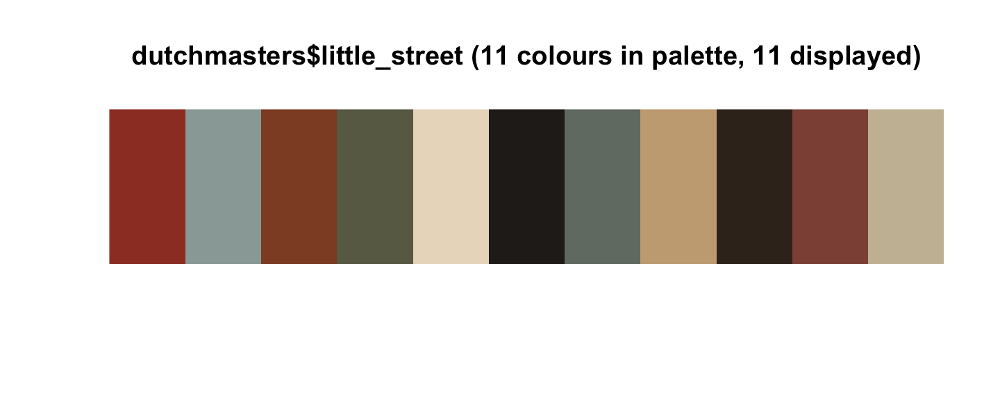
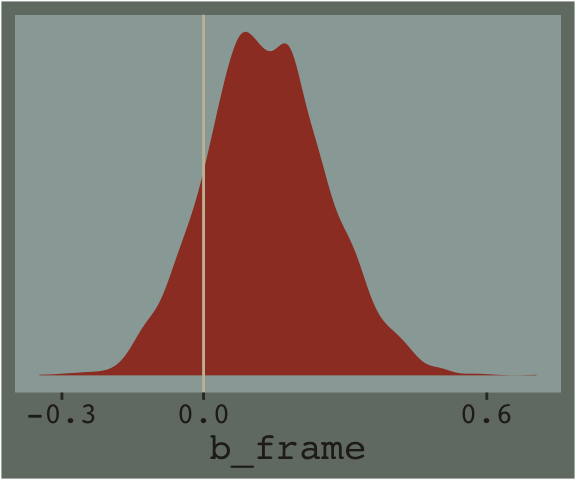
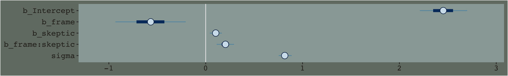
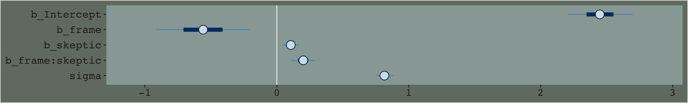
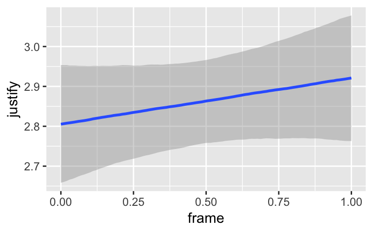
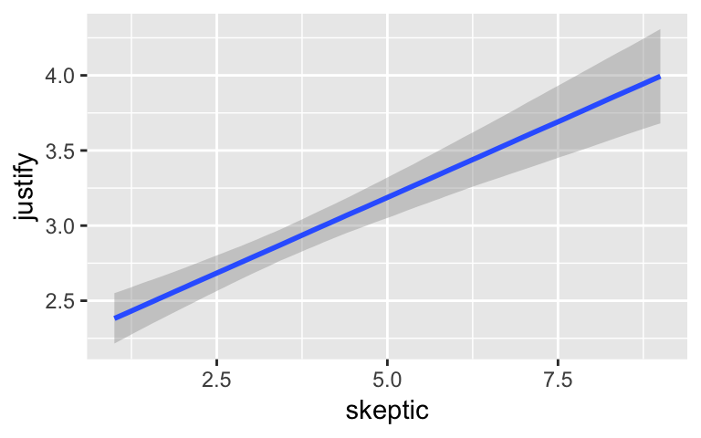
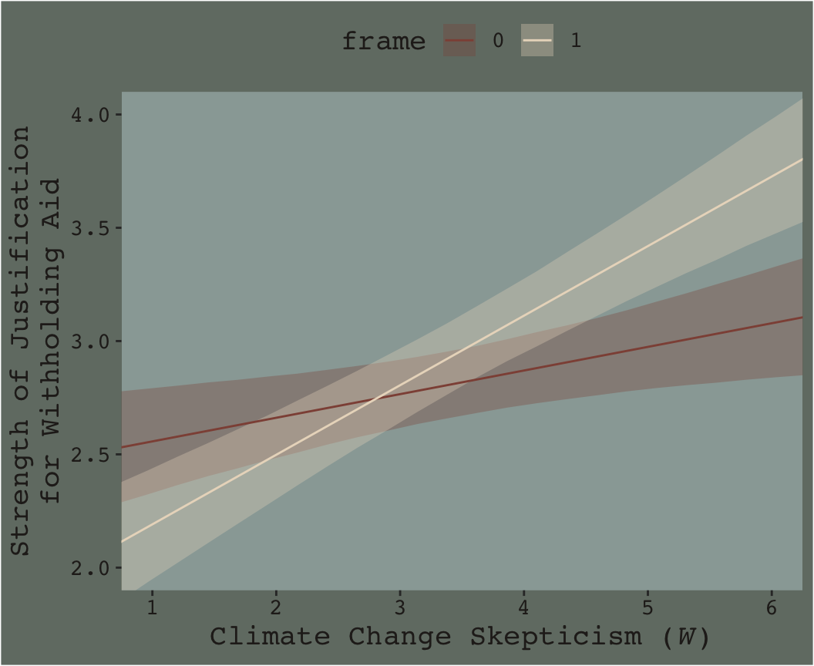

# (PART) MODERATION ANALYSIS {-}

# Fundamentals of Moderation Analysis


## Conditional and unconditional effects

You might reproduce Hayes's Table 7.1 data like this.


```r
library(tidyverse)

d <-
  tibble(x = rep(-1:2, each = 3),
         w = rep(0:2, times = 4)) %>% 
  mutate(A = 4 + 1*x + 2*w,
         B = 4 + 1*x + 2*w + 1.5*x*w)
```

In previous chapters, we alteried our plot themes using either built-in settings from ggplot2 or extra themes from the ggthemes package. When we wanted to change them further, we did so with extra `theme()` arguments. One, it's nice to be know how to make one's own custom theme and, two, it'd be handy to condense our code a bit. Here we'll take a few cues from the [Building a New Theme](https://bookdown.org/rdpeng/RProgDA/building-a-new-theme.html) and from Peng, Kross, and Anderson's [*Mastering Software Development in R*](https://bookdown.org/rdpeng/RProgDA/). We'll make our own theme, `theme_07` by saving a handful of augmentations from the default `theme_gray()` theme.


```r
library(dutchmasters)

theme_07 <- 
  theme_gray() + 
  theme(plot.background = element_rect(fill = dutchmasters$little_street[7]),
        panel.background = element_rect(fill = dutchmasters$little_street[2]),
        strip.background = element_rect(fill = alpha(dutchmasters$little_street[5], 2/3),
                                        color = "transparent"),
        legend.background = element_rect(fill = "transparent"),
        legend.key = element_rect(fill = "transparent", color = "transparent"),
        panel.grid = element_blank(),
        text = element_text(family = "Courier",
                            color = dutchmasters$little_street[6],
                            size = 14),
        axis.text = element_text(color = dutchmasters$little_street[6]))
```

This chapter's color palette comes from the [dutchmasters package](https://github.com/EdwinTh/dutchmasters), which was itself based of [Vermeer's *The Little Street*](https://en.wikipedia.org/wiki/The_Little_Street). To get a quick glance at the full palette, we'll also use `viz_palette()`, a convenience function from the [ochRe package](https://github.com/ropenscilabs/ochRe).


```r
library(ochRe)

viz_palette(dutchmasters$little_street)
```



With our new `theme_07` in hand, we're ready for our version of Figure 7.2.


```r
library(directlabels)

d %>% 
  gather(key, value, -x, -w) %>% 
  rename(y = value) %>% 
  mutate(label = str_c("W = ", w)) %>% 
  
  ggplot(aes(x = x, y = y, group = w, size = w %>% as.factor(), label = label)) +
  geom_line(color = dutchmasters$little_street[9]) +
  geom_dl(method = list(dl.trans(x = x + 0.2),
                        "last.points", cex = 1,
                        color = dutchmasters$little_street[9],
                        fontfamily = "Courier")) +
  scale_size_manual(values = c(.5, .75, 1)) +
  coord_cartesian(xlim = c(-1, 2.6),
                  ylim = 0:16) +
  labs(x = expression(italic("X")),
       y = expression(italic("Y"))) +
  facet_wrap(~key) +
  theme_07 +
  # because we didn't alter the `legend.position` argument in our `theme_07`, we need to use `theme()` to remove it
  theme(legend.position = "none")
```


We borrowed `geom_dl()` form the [directlabels package](https://cran.r-project.org/web/packages/directlabels/index.html), which made it easy to insert the "W = $i$" labels to the right of the lines.

I played around with the annotation in Figure 7.4 for a while and it was just way more trouble than it was worth. If you're ever inspired to work it out, [please share your code](https://github.com/ASKurz/recoding_Introduction_to_Mediation_Moderation_and_Conditional_Process_Analysis/issues).

## An example: Climate change disasters and humanitarianism

Here we load a couple necessary packages, load the data, and take a `glimpse()`.


```r
disaster <- read_csv("data/disaster/disaster.csv")

glimpse(disaster)
```

```
## Observations: 211
## Variables: 5
## $ id      <int> 1, 2, 3, 4, 5, 6, 7, 8, 9, 10, 11, 12, 13, 14, 15, 16, 17, 18, 19, 20, 21, 22, 23, 24, 25...
## $ frame   <int> 1, 1, 1, 1, 1, 0, 0, 1, 0, 0, 1, 1, 0, 0, 1, 1, 1, 1, 0, 0, 1, 0, 1, 0, 1, 1, 0, 0, 0, 1,...
## $ donate  <dbl> 5.6, 4.2, 4.2, 4.6, 3.0, 5.0, 4.8, 6.0, 4.2, 4.4, 5.8, 6.2, 6.0, 4.2, 4.4, 5.8, 5.4, 3.4,...
## $ justify <dbl> 2.95, 2.85, 3.00, 3.30, 5.00, 3.20, 2.90, 1.40, 3.25, 3.55, 1.55, 1.60, 1.65, 2.65, 3.15,...
## $ skeptic <dbl> 1.8, 5.2, 3.2, 1.0, 7.6, 4.2, 4.2, 1.2, 1.8, 8.8, 1.0, 5.4, 2.2, 3.6, 7.8, 1.6, 1.0, 6.4,...
```

Here is how to get the ungrouped mean and $SD$ values for `justify` and `skeptic`, as presented in Table 7.3.


```r
disaster %>% 
  select(justify, skeptic) %>% 
  gather() %>% 
  group_by(key) %>% 
  summarise(mean = mean(value),
            sd = sd(value)) %>% 
  mutate_if(is.double, round, digits = 3)
```

```
## # A tibble: 2 x 3
##   key      mean    sd
##   <chr>   <dbl> <dbl>
## 1 justify  2.87  0.93
## 2 skeptic  3.38  2.03
```

And here we get the same summary values, this time grouped by `frame`.


```r
disaster %>% 
  select(frame, justify, skeptic) %>% 
  gather(key, value, -frame) %>% 
  group_by(frame, key) %>% 
  summarise(mean = mean(value),
            sd = sd(value)) %>% 
  mutate_if(is.double, round, digits = 3)
```

```
## # A tibble: 4 x 4
## # Groups:   frame [2]
##   frame key      mean    sd
##   <int> <chr>   <dbl> <dbl>
## 1     0 justify  2.80 0.849
## 2     0 skeptic  3.34 2.04 
## 3     1 justify  2.94 1.01 
## 4     1 skeptic  3.42 2.03
```

Let's open brms.


```r
library(brms)
```

Anticipating Table 7.4 on page 234, we'll name this first model `model1`.


```r
model1 <-
  brm(data = disaster, family = gaussian,
      justify ~ 1 + frame,
      chains = 4, cores = 4)
```


```r
print(model1)
```

```
##  Family: gaussian 
##   Links: mu = identity; sigma = identity 
## Formula: justify ~ 1 + frame 
##    Data: disaster (Number of observations: 211) 
## Samples: 4 chains, each with iter = 2000; warmup = 1000; thin = 1;
##          total post-warmup samples = 4000
## 
## Population-Level Effects: 
##           Estimate Est.Error l-95% CI u-95% CI Eff.Sample Rhat
## Intercept     2.80      0.09     2.63     2.97       3083 1.00
## frame         0.13      0.13    -0.11     0.39       3342 1.00
## 
## Family Specific Parameters: 
##       Estimate Est.Error l-95% CI u-95% CI Eff.Sample Rhat
## sigma     0.94      0.05     0.85     1.03       4000 1.00
## 
## Samples were drawn using sampling(NUTS). For each parameter, Eff.Sample 
## is a crude measure of effective sample size, and Rhat is the potential 
## scale reduction factor on split chains (at convergence, Rhat = 1).
```

The 'Estimate' (i.e., posterior mean) of the model intercept is the expected `justify` value for when `frame` is 0. The 'Estimate' for `frame` is the expected difference when `frame` is a 1. If all you care about is the posterior mean, you could do


```r
fixef(model1)["Intercept", 1] + fixef(model1)["frame", 1]
```

```
## [1] 2.935378
```

which matches up nicely with the equation on page 233. But this wouldn't be very Bayesian of us. It'd be more satisfying if we had an expression of the uncertainty in the value. For that, we'll follow our usual practice of extracting the posterior samples, making nicely-named vectors, and summarizing a bit.


```r
post <-
  posterior_samples(model1) %>% 
  mutate(when_x_is_0 = b_Intercept,
         when_x_is_1 = b_Intercept + b_frame)

post %>% 
  select(when_x_is_0, when_x_is_1) %>% 
  gather() %>% 
  group_by(key) %>% 
  summarize(mean = mean(value),
            sd = sd(value)) %>% 
  mutate_if(is.double, round, digits = 3)  
```

```
## # A tibble: 2 x 3
##   key          mean    sd
##   <chr>       <dbl> <dbl>
## 1 when_x_is_0  2.80 0.089
## 2 when_x_is_1  2.94 0.092
```

Hayes referenced a $t$-test and accompanying $p$-value in the lower part of page 233. We, of course, aren't going to do that. But we do have the 95% intervals in our `print()` output, above, which we can also look at like so.


```r
posterior_interval(model1)["b_frame", ]
```

```
##       2.5%      97.5% 
## -0.1143789  0.3934074
```

And we can always plot.


```r
post %>% 
  ggplot(aes(x = b_frame)) +
  geom_density(size = 0, fill = dutchmasters$little_street[1]) +
  geom_vline(xintercept = 0, color = dutchmasters$little_street[11]) +
  scale_x_continuous(breaks = c(-.3, 0, .6)) +
  scale_y_continuous(NULL, breaks = NULL) +
  theme_07 +
  theme(legend.position = "none")
```



We'll use the `update()` function to hastily fit `model2` and `model3`.


```r
model2 <-
  update(model1, newdata = disaster,
         formula = justify ~ 1 + frame + skeptic,
         chains = 4, cores = 4)

model3 <-
  update(model1, newdata = disaster,
         formula = justify ~ 1 + frame + skeptic + frame:skeptic,
         chains = 4, cores = 4)
```

Note our use of the `frame:skeptic` syntax in `model3`. With that syntax we didn't need to make an interaction variable in the data by hand. The brms package just handled it for us. An alternative syntax would have been `frame*skeptic`. But if you really wanted to make the interaction variable by hand, you'd do this.


```r
disaster <-
  disaster %>% 
  mutate(interaction_variable = frame*skeptic)
```

Once you have `interaction_variable` in the data, you'd specify a model formula within the `brm()` function like `formula = justify ~ 1 + frame + skeptic + interaction_variable`. I'm not going to do that, here, but you can play around yourself if so inclined. 

Here are the quick and dirty coefficient summaries for our two new models.


```r
posterior_summary(model2)
```

```
##                 Estimate  Est.Error         Q2.5        Q97.5
## b_Intercept    2.1307082 0.12777249    1.8829093    2.3891387
## b_frame        0.1169393 0.11481339   -0.1048338    0.3386479
## b_skeptic      0.2011168 0.02921602    0.1444075    0.2557176
## sigma          0.8422032 0.04201156    0.7664790    0.9304656
## lp__        -268.3729553 1.41272791 -271.8371388 -266.5718957
```

```r
posterior_summary(model3)
```

```
##                     Estimate  Est.Error         Q2.5        Q97.5
## b_Intercept        2.4528494 0.14887569    2.1677181    2.7432500
## b_frame           -0.5687102 0.21703257   -0.9937620   -0.1406217
## b_skeptic          0.1042967 0.03788573    0.0320306    0.1788565
## b_frame:skeptic    0.2027146 0.05483136    0.0927857    0.3061208
## sigma              0.8176487 0.04040054    0.7433312    0.8996959
## lp__            -262.2631690 1.53602416 -266.1279187 -260.2129900
```

Just focusing on our primary model, `model3`, here's another way to look at the coefficients. 


```r
stanplot(model3) +
  theme_07
```



By default, `brms::stanplot()` makes coefficient plots which depict the parameters of a model by their posterior means (i.e., dots), 50% intervals (i.e., thick horizontal lines), and 95% intervals (i.e., thin horizontal lines). As `stanplot()` returns a ggplot2 object, one can customize the theme and so forth.

We'll extract the $R^2$ iterations in the usual way once for each model, and then combine them for a plot.


```r
# for each of the three models, we create a separare R2 tibble
R2_model1 <- 
  bayes_R2(model1,
           summary = F) %>% 
  as_tibble()

R2_model2 <- 
  bayes_R2(model2,
           summary = F) %>% 
  as_tibble()

R2_model3 <- 
  bayes_R2(model3,
           summary = F) %>% 
  as_tibble()

# here we combine them into one tibble, indexed by `model`
R2s <-
  R2_model1 %>% 
  bind_rows(R2_model2) %>% 
  bind_rows(R2_model3) %>% 
  mutate(model = rep(c("model1", "model2", "model3"), each = 4000))

# now we plot
R2s %>% 
  ggplot(aes(x = R2)) +
  geom_density(aes(fill = model), size = 0, alpha = 2/3) +
  scale_fill_manual(NULL, 
                    values = dutchmasters$little_street[c(3, 4, 8)] %>% as.character()) +
  scale_y_continuous(NULL, breaks = NULL) +
  xlab(expression(paste(italic(R)^2, " distribution"))) +
  coord_cartesian(xlim = 0:1) +
  theme_07
```



Here's the $\Delta R^2$ distribution for `model3` minus `model2`.


```r
R2_model2 %>% 
  rename(model2 = R2) %>% 
  bind_cols(R2_model3) %>% 
  rename(model3 = R2) %>% 
  mutate(dif = model3 - model2) %>% 
  
  ggplot(aes(x = dif)) +
  geom_density(color = "transparent",
               fill = dutchmasters$little_street[9]) +
  scale_y_continuous(NULL, breaks = NULL) +
  labs(title = expression(paste("The ", Delta, italic(R)^2)),
       subtitle = "Like in the text, the posterior\nmean is about 0.05.",
       x = NULL) +
  theme_07
```


In addition to the $R^2$, one can use information criteria to compare the models. Here we'll use the LOO to compare all three.


```r
loo(model1, model2, model3)
```

```
##                  LOOIC    SE
## model1          572.28 24.03
## model2          529.46 22.37
## model3          517.87 21.69
## model1 - model2  42.82 16.14
## model1 - model3  54.41 18.93
## model2 - model3  11.59  8.29
```

The point estimate for both multivariable models were clearly lower than that for `model1`. The point estimate for the moderation model, `model3`, was within the double-digit range lower than that for `model2`, which typically suggests better fit. But notice how wide the standard error was. There's a lot of uncertainty, there. Hopefully this isn't surprising. Our $R^2$ difference was small and uncertain, too. We can also compare them with AIC-type model weighting, which you can learn more about [starting at this point in this lecture](https://www.youtube.com/watch?v=t0pRuy1_190) or [this related vignette for the loo package](https://cran.r-project.org/web/packages/loo/vignettes/loo2-weights.html). Here we'll keep things simple and weight with the LOO.


```r
model_weights(model1, model2, model3,
              weights = "loo")
```

```
##       model1       model2       model3 
## 1.526031e-12 3.029832e-03 9.969702e-01
```

The `model_weights()` results put almost all the relative weight on `model3`. This doesn't mean `model3` is the "true model" or anything like that. It just suggests that it's the better of the three with respect to the data.

Here are the results of the equations in the second half of page 237.


```r
post <- posterior_samples(model3)

post %>% 
  transmute(if_2   = b_frame + `b_frame:skeptic`*2,
            if_3.5 = b_frame + `b_frame:skeptic`*3.5,
            if_5   = b_frame + `b_frame:skeptic`*5) %>% 
  gather() %>% 
  group_by(key) %>% 
  summarise(mean = mean(value),
            sd = sd(value)) %>% 
  mutate_if(is.double, round, digits = 3)
```

```
## # A tibble: 3 x 3
##   key      mean    sd
##   <chr>   <dbl> <dbl>
## 1 if_2   -0.163 0.135
## 2 if_3.5  0.141 0.112
## 3 if_5    0.445 0.142
```

### Estimation using ~~PROCESS~~ brms.

Similar to what Hayes advertised with PROCESS, with our `formula = justify ~ 1 + frame + skeptic + frame:skeptic` code in `model3`, we didn't need to hard code an interaction variable into the data. brms handled that for us.

### Interpreting the regression coefficients.

### Variable scaling and the interpretation of $b_{1}$ and $b_{3}$.

Making the mean-centered version of our $W$ variable, `skeptic`, is a simple `mutate()` operation. We'll just call it `skeptic_c`.


```r
disaster <-
  disaster %>% 
  mutate(skeptic_c = skeptic - mean(skeptic))
```

And here's how we might fit the model.


```r
model4 <-
  update(model3, newdata = disaster,
         formula = justify ~ 1 + frame + skeptic_c + frame:skeptic_c,
         chains = 4, cores = 4)
```

Here are the summaries of our fixed effects.


```r
fixef(model4)
```

```
##                  Estimate  Est.Error        Q2.5     Q97.5
## Intercept       2.8053071 0.07760306  2.65492192 2.9598509
## frame           0.1183069 0.11189621 -0.10400167 0.3375879
## skeptic_c       0.1054818 0.03774031  0.03023059 0.1791417
## frame:skeptic_c 0.2013565 0.05505230  0.09431049 0.3095814
```

Here are the $R^2$ distributions for `model3` and `model4`. They're the same within simulaiton variance.


```r
bayes_R2(model3) %>% round(digits = 3)
```

```
##    Estimate Est.Error  Q2.5 Q97.5
## R2    0.249     0.043 0.162 0.331
```

```r
bayes_R2(model4) %>% round(digits = 3)
```

```
##    Estimate Est.Error Q2.5 Q97.5
## R2     0.25     0.044 0.16 0.335
```

If you're bothered by the differences resulting from sampling variation, you might increase the number of HMC iterations from the 2000-per-chain default. Doing so might look something like this:


```r
model3 <-
  update(model3,
         chains = 4, cores = 4, warmup = 1000, iter = 10000)

model4 <-
  update(model4,
         chains = 4, cores = 4, warmup = 1000, iter = 10000)
```

Before we fit `model5`, we'll recode `frame` to a -.5/.5 metric and name it `frame_.5`.


```r
disaster <-
  disaster %>% 
  mutate(frame_.5 = ifelse(frame == 0, -.5, .5))
```

Time to fit `model5`.


```r
model5 <-
  update(model4, newdata = disaster,
         formula = justify ~ 1 + frame_.5 + skeptic_c + frame_.5:skeptic_c,
         chains = 4, cores = 4)
```

Our posterior summaries match up nicely with the output in Hayes's Table 7.4.


```r
fixef(model5)
```

```
##                     Estimate  Est.Error        Q2.5     Q97.5
## Intercept          2.8657962 0.05735938  2.75379721 2.9757871
## frame_.5           0.1158725 0.10926503 -0.09908657 0.3282183
## skeptic_c          0.2053597 0.02800294  0.14900726 0.2593083
## frame_.5:skeptic_c 0.2011685 0.05637500  0.08829815 0.3169702
```

## Visualizing moderation

To get quick plots for the interaction effect in brms, you might use the `marginal_effects()` function.


```r
marginal_effects(model3)
```



By default, `margional_effects()` will show three levels of the variable on the right side of the interaction term. The formula in `model3` was `justify ~ frame + skeptic + frame:skeptic `, with `frame:skeptic` as the interaction term and `skeptic` making up the right hand side of the term. The three levels of `skeptic` in the plot, above, are the mean $\pm$ 1 $SD$. See the brms [reference manual](https://cran.r-project.org/web/packages/brms/brms.pdf) for details on `marginal_effects()`. 

On page 244, Hayes discussed using the 16th, 50th, and 84th percentiles for the moderator variable. We can compute those with `quantile()`.


```r
quantile(disaster$skeptic, probs = c(.16, .5, .84))
```

```
## 16% 50% 84% 
## 1.6 2.8 5.2
```

The first two columns in Hayes’s Table 7.5 contain the values he combined with the point estimates of his model to get the $\hat{Y}$ column. The way we’ll push those values through `model3`’s posterior is with `brms::fitted()`. As a preparatory step, we'll put the predictor values in a data object, `nd`.


```r
(
  nd <-
  tibble(frame = rep(0:1, times = 3),
         skeptic = rep(quantile(disaster$skeptic, 
                                probs = c(.16, .5, .84)),
                       each = 2))
  )
```

```
## # A tibble: 6 x 2
##   frame skeptic
##   <int>   <dbl>
## 1     0     1.6
## 2     1     1.6
## 3     0     2.8
## 4     1     2.8
## 5     0     5.2
## 6     1     5.2
```

Now we've go our `nd`, we'll get our posterior estimates for $Y$ with `fitted()`.


```r
fitted(model3, newdata = nd)
```

```
##      Estimate  Est.Error     Q2.5    Q97.5
## [1,] 2.619724 0.10157731 2.425936 2.825434
## [2,] 2.375357 0.10853064 2.160738 2.588415
## [3,] 2.744880 0.07909575 2.591680 2.902951
## [4,] 2.743771 0.08389303 2.576498 2.910688
## [5,] 2.995192 0.10263407 2.799500 3.194292
## [6,] 3.480598 0.10513794 3.271800 3.689514
```

When using the default `summary = TRUE` settings in `fitted()`, the function returns posterior means, $SD$s and 95% intervals for $Y$ based on each row in the `nd` data we specified in the `newdata = nd` argument. You don't have to name your newdata `nd` or anything like that; it's just my convention.

Here' a quick plot of what those values imply.


```r
fitted(model3, newdata = nd) %>% 
  as_tibble() %>% 
  bind_cols(nd) %>% 
  
  ggplot(aes(x = skeptic, y = Estimate)) +
  geom_ribbon(aes(ymin = Q2.5, ymax = Q97.5, fill = frame %>% as.character()),
              alpha = 1/3) +
  geom_line(aes(color = frame %>% as.character())) +
  scale_fill_manual("frame",
                    values = dutchmasters$little_street[c(10, 5)] %>% as.character()) +
  scale_color_manual("frame",
                     values = dutchmasters$little_street[c(10, 5)] %>% as.character()) +
  theme_07
```


That plot is okay, but we can do better.

In order to plot the model-implied effects across the full range of `skeptic` values presented in Figure 7.7, you need to change the range of those values in the `nd` data. Also, although the effect is subtle in the above example, 95% intervals often follow a bowtie shape. In order to insure the contours of that shape are smooth, it's often helpful to specify 30 or so evenly-spaced values in the variable on the x-axis, `skeptic` in this case. We'll employ the `seq()` function for that and specify `length.out = 30`. And in order to use those 30 values for both levels of `frame`, we'll nest the `seq()` function within `rep()`. In addition, we add a few other flourishes to make our plot more closely resemble the one in the text.

Here's our Figure 7.7.


```r
nd <-
  tibble(frame = rep(0:1, times = 30),
         skeptic = rep(seq(from = 0, to = 7, length.out = 30),
                       each = 2))

fitted(model3, newdata = nd) %>% 
  as_tibble() %>% 
  bind_cols(nd) %>% 
  
  ggplot(aes(x = skeptic, y = Estimate)) +
  geom_ribbon(aes(ymin = Q2.5, ymax = Q97.5, fill = frame %>% as.character()),
              alpha = 1/3) +
  geom_line(aes(color = frame %>% as.character())) +
  scale_fill_manual("frame",
                    values = dutchmasters$little_street[c(10, 5)] %>% as.character()) +
  scale_color_manual("frame",
                     values = dutchmasters$little_street[c(10, 5)] %>% as.character()) +
  scale_x_continuous(breaks = 1:6) +
  coord_cartesian(xlim = 1:6,
                  ylim = 2:4) +
  labs(x = expression(paste("Climate Change Skepticism (", italic("W"), ")")),
       y = "Strength of Justification\nfor Withholding Aid") +
  theme_07 +
  theme(legend.position = "top")
```



## Probing an interaction

### The pick-a-point approach.

#### The pick-a-point approach ~~implimented by regression centering~~ working directly with the posterior. 

Yes, if you wanted to use the regression centering approach, you could do that in brms. Just center the necessary variables in the way Hayes described in the text, refit the model, and `summarize()`. I suspect this would be particularly approachable for someone new to R and to the ins and outs of data wrangling. But I'm going leave that as an exercise for the interested reader.

Now that we've already got a posterior for our model, we can just either algebraically manipulate the vectors yielded by `posterior_samples()` or push predictions through `fitted()`. To give a sense, we'll start off with the 16th percentile for `skeptic`. Recall we can get that with the `quantile()` function.


```r
 quantile(disaster$skeptic, probs = .16)
```

```
## 16% 
## 1.6
```

Now we just need to feed that value and different values of `frame` into the posterior samples of the model coefficients. We then create a `difference` score for the model-implied estimates given `frame` is either 0 or 1 and then plot that `difference`.


```r
post %>% 
  mutate(Y_given_frame_0_skeptic_1.6 = b_Intercept + b_frame*0 + b_skeptic*1.6 + `b_frame:skeptic`*0*1.6,
         Y_given_frame_1_skeptic_1.6 = b_Intercept + b_frame*1 + b_skeptic*1.6 + `b_frame:skeptic`*1*1.6) %>% 
  mutate(difference = Y_given_frame_1_skeptic_1.6 - Y_given_frame_0_skeptic_1.6) %>% 
  
  ggplot(aes(x = difference)) +
  geom_density(color = "transparent",
               fill = dutchmasters$little_street[9]) +
  geom_vline(xintercept = 0, color = dutchmasters$little_street[7], linetype = 2) +
  scale_y_continuous(NULL, breaks = NULL) +
  labs(subtitle = "The effect of frame on justify\ngiven skeptic = 1.6",
       x = NULL) +
  theme_07
```


Note how nicely that distribution corresponds to the output in the lower left corner of Hayes's Figure 7.8. If we wanted the values for other values of `skeptic` (e.g., 2.8 and 5.2 as in the text), we'd just rinse, wash, and repeat. A nice quality of this method is it requires you to work explicitly with the model formula. But it's also clunky if you want to do this over many values. The `fitted()` function offers an alternative.

Recall how the default `fitted()` settings are to return summaries of a model's $Y$-variable given values of the predictor variables. In the previous section we put our prefered `frame` and `skeptic` values into a data object named `nd` and used the `newdata` argument to push those values through `fitted()`. Buy default, this yielded the typical posterior means, $SD$s, and 95% intervals for the predictions. However, if one sets `summary = F`, the output will differ. First. Let's revisit what `nd` looks like.


```r
(
  nd <-
  tibble(frame = rep(0:1, times = 3),
         skeptic = rep(quantile(disaster$skeptic, 
                                probs = c(.16, .5, .84)),
                       each = 2)) %>% 
    # This will make our lives easier in just a bit
    arrange(frame)
  )
```

```
## # A tibble: 6 x 2
##   frame skeptic
##   <int>   <dbl>
## 1     0     1.6
## 2     0     2.8
## 3     0     5.2
## 4     1     1.6
## 5     1     2.8
## 6     1     5.2
```

Here's what happens when we use `summary = F`.


```r
f_model3 <-
  fitted(model3, newdata = nd, summary = F)

f_model3 %>% str()
```

```
##  num [1:4000, 1:6] 2.63 2.74 2.75 2.75 2.49 ...
```

```r
f_model3 %>% head()
```

```
##          [,1]     [,2]     [,3]     [,4]     [,5]     [,6]
## [1,] 2.633868 2.755445 2.998599 2.402675 2.733944 3.396481
## [2,] 2.736530 2.798106 2.921260 2.332534 2.750577 3.586663
## [3,] 2.753872 2.818162 2.946742 2.288811 2.716716 3.572527
## [4,] 2.745839 2.836755 3.018588 2.318846 2.668332 3.367305
## [5,] 2.493795 2.651769 2.967716 2.421827 2.791521 3.530908
## [6,] 2.522040 2.637816 2.869368 2.381670 2.768278 3.541495
```

With `summary = F`, `fitted()` returned a matrix of 4000 rows (i.e., one for each posterior iteration) and 6 vectors (i.e., one for each row in our `nd` data). So now instead of summary information, we have a full expression of the uncertainty in terms of 4000 draws. If you prefer working within the tidyverse and plotting with ggplot2, matrices aren't the most useful data type. Let's wrangle a bit.


```r
f_model3 <-
  f_model3 %>% 
  as_tibble() %>% 
  gather() %>% 
  select(-key) %>% 
  # We multiply 4000 (i.e., the # of iterations) by 3 because there are 3 distinct `skeptic` values
  mutate(frame = rep(0:1, each = 4000*3),
         # Note how we have `rep()` nested within `rep()`.
         skeptic = rep(rep(quantile(disaster$skeptic, probs = c(.16, .5, .84)),
                           each = 4000),
                       # We repeate the first `rep()` output 2 times because ther are 2 values of `frame` we'd like them for
                       times = 2),
         # We need an iteration index, `iter`, in order to help with `spread()`, below.
         iter = rep(1:4000, times = 6)) %>% 
  spread(key = frame, value = value) %>% 
  mutate(difference = `1` - `0`,
         # This isnt' necessary, but will help with the facet labels
         skeptic = str_c("skeptic = ", skeptic)) 

f_model3 %>% head()
```

```
## # A tibble: 6 x 5
##   skeptic        iter   `0`   `1` difference
##   <chr>         <int> <dbl> <dbl>      <dbl>
## 1 skeptic = 1.6     1  2.63  2.40    -0.231 
## 2 skeptic = 1.6     2  2.74  2.33    -0.404 
## 3 skeptic = 1.6     3  2.75  2.29    -0.465 
## 4 skeptic = 1.6     4  2.75  2.32    -0.427 
## 5 skeptic = 1.6     5  2.49  2.42    -0.0720
## 6 skeptic = 1.6     6  2.52  2.38    -0.140
```

And here's a plot of what we've done.


```r
f_model3 %>% 
  ggplot(aes(x = difference)) +
  geom_density(color = "transparent",
               fill = dutchmasters$little_street[9]) +
  geom_vline(xintercept = 0, color = dutchmasters$little_street[7], linetype = 2) +
  scale_y_continuous(NULL, breaks = NULL) +
  labs(subtitle = "The effect of frame on justify given three different values of skeptic",
       x = NULL) +
  theme_07 +
  facet_wrap(~skeptic)
```


And if you prefered summary information instead of plots, you'd use `summarize()` as usual.


```r
f_model3  %>% 
  group_by(skeptic) %>% 
  summarize(median = median(difference),
            ll = quantile(difference, probs = .025),
            ul = quantile(difference, probs = .975)) %>% 
  mutate_if(is.double, round, digits = 3)
```

```
## # A tibble: 3 x 4
##   skeptic       median     ll    ul
##   <chr>          <dbl>  <dbl> <dbl>
## 1 skeptic = 1.6 -0.243 -0.537 0.052
## 2 skeptic = 2.8 -0.001 -0.23  0.23 
## 3 skeptic = 5.2  0.488  0.191 0.779
```

### The Johnson-Neyman technique.

The JN technique generalizes this approach over many values of $W$ (i.e., `skeptic` in this example) in order to get a sense of the trend and summarize regions of the trend in terms of $p$-value thresholds. Since we're emphasizing modeling and deemphasizing null-hypothesis testing in this project, I'll show a Bayesian version of the approach without the $p$-values.

#### Implementation in ~~PROCESS~~ brms.

Since Figure 7.9 had `skeptic` values ranging from 1 to 6 with ticks on the 0.5s, we’ll use a similar approach for our version. We’ll estimate posterior samples with `fitted()` for `skeptic` values ranging from .5 to 6.5, one for each 0.5—13 in total. But since we have two levels of `frame` (i.e., 0 and 1), that really gives us 26. And we don’t just want 26 summaries; we want full posterior distributions for each of those 26. 

We've got a lot of moving parts in the code, below. To help make sure everything adds up, we'll save several important values as R objects.


```r
iter             <- 4000  # this number comes from the total number of post-warmup posterior iterations from the `brm()` function
n_frame_values   <- 2     # there are 2 levels of `frame`, 0 and 1
n_skeptic_values <- 13    # we're choosing 13 in this example to follow some of the sensibilities in Figure 7.9. You'll see.

# as before, we'll make `nd` to feed in to `fitted()`
nd <-
  tibble(frame = rep(0:1, each = n_skeptic_values),
         skeptic = rep(seq(from = .5, to = 6.5, length.out = n_skeptic_values), 
                       times = n_frame_values))

# after the initial `fitted()` action, we need a few steps to wrangle the data into a useful format
f_model3 <-
  fitted(model3, newdata = nd, summary = F) %>% 
  as_tibble() %>% 
  gather() %>% 
  mutate(frame = rep(0:1, each = iter*n_skeptic_values),
         skeptic = rep(rep(seq(from = .5, to = 6.5, length.out = n_skeptic_values), 
                           each = iter),
                       times = n_frame_values)) %>% 
  select(-key) %>% 
  rename(estimate = value) %>% 
  mutate(iter = rep(1:iter, times = n_frame_values*n_skeptic_values)) %>% 
  spread(key = frame, value = estimate) %>% 
  mutate(difference = `1` - `0`)

# finally, here's the plot
f_model3 %>% 
  ggplot(aes(x = skeptic %>% as.character, y = difference)) +
  geom_hline(yintercept = 0, color = dutchmasters$little_street[7]) +
  geom_violin(size = 0, fill = dutchmasters$little_street[6]) +
  stat_summary(fun.y = median,
               fun.ymin = function(x){quantile(x, probs = .025)},
               fun.ymax = function(x){quantile(x, probs = .975)},
               color = dutchmasters$little_street[5]) +
  labs(x = expression(paste("Climate Change Skepticism (", italic(W), ")")),
       y = expression(atop(theta[paste(italic(X), " on ", italic(Y))], paste("Conditional Effect of Disaster Frame")))) +
  theme_07
```


[Note. I got the `atop()` trick for the label for the y-axis from [Drew Steen's answer to this stackoverflow question](https://stackoverflow.com/questions/13223846/ggplot2-two-line-label-with-expression?utm_medium=organic&utm_source=google_rich_qa&utm_campaign=google_rich_qa).]

This isn’t quite our version of Figure 7.9, but I’m hoping it’ll add some pedagogical value for what we’re doing. Since we used `summary = F` in `fitted()`, we got full posterior distributions for each of our 26 conditions. *Because Figure 7.9 is all about differences between each `frame` pair across the various values of `skeptic`*, we needed to make a `difference` score for each pair; this is what we did with the last `mutate()` line before the plot code. This initial version of the plot shows the full posterior distribution for each `difference` score. The posteriors are depicted with violin plots, which are density plots set on their side and symmetrically reflected as if by a mirror to give a pleasing leaf- or violin-like shape (though [beware](https://twitter.com/naomicaselli/status/973601256609599488?lang=en)). The light dots and vertical lines are the posterior medians and 95% intervals for each. 

Going from left to right, it appears we have a clearly emerging trend. We can more simply express the trend by summarizing each posterior with medians and 95% intervals.


```r
f_model3 %>% 
  group_by(skeptic) %>% 
  summarize(median = median(difference),
            ll = quantile(difference, probs = .025),
            ul = quantile(difference, probs = .975)) %>% 
  
  ggplot(aes(x = skeptic)) +
  geom_hline(yintercept = 0, color = dutchmasters$little_street[7]) +
  geom_vline(xintercept = c(1.171, 3.934), color = dutchmasters$little_street[7]) +
  geom_ribbon(aes(ymin = ll, ymax = ul),
              fill = dutchmasters$little_street[5],
              alpha = 1/2) +
  geom_line(aes(y = median),
          color = dutchmasters$little_street[5], size = 1) +
  scale_x_continuous(breaks = 1:6) +
  coord_cartesian(xlim = c(1, 6),
                  ylim = c(-1, 1.5)) +
  labs(x = expression(paste("Climate Change Skepticism (", italic(W), ")")),
       y = expression(atop(theta[paste(italic(X), " on ", italic(Y))], paste("Conditional Effect of Disaster Frame")))) +
  theme_07
```


Notice how the contour boundaries of the 95% intervals are a little clunky. That's because our bowtie-shape is based on only 13 x-axis values. If you wanted a smoother shape, you'd specify more `skeptic` values in the data object you feed into `fitted()`'s `newdata` argument. For linear effects, 30 or so usually does it.

Anyway, I got the values for the two vertical lines directly out of the text. It's not clear to me how one might elegantly determine those values within the paradigm we've been using. But that leads to an important digression. The two vertical lines are quite $p$-value centric. They are an attempt to separate the x-axis into areas where the `difference` trend either is or is not statistically-significantly different from zero. That is, we’re dichotomizing—or "trichotomizing", depending on how you look at it—a continuous phenomenon. This is somewhat at odds with the sensibilities of the Bayesians associated with Stan and brms (e.g., [here](https://github.com/paul-buerkner/brms/issues/309)).

On page 259, Hayes wrote:

>Although the JN technique eliminates the need to select arbitrary values of $W$ when probing an interaction, it does not eliminate your need to keep your brain turned into the task and thinking critically about the answer the method gives you.

I think this is valuable advice, particularly when working within the Bayesian paradigm. Our version of Figure 7.9 gives some interesting insights into the moderation model, `model3`. I’m just not so sure I’d want to encourage people to interpret a continuous phenomenon by heuristically dividing it into discrete regions.

## The difference between testing for moderation and probing it

This is another section where the NHST-type paradigm contrasts with many within the contemporary Bayesian paradigm. E.g., Hayes opened the section with: "We test for evidence of moderation when we want to know whether the relationship between $X$ and $Y$ varies systematically as a function of a proposed moderator $W$". His use of "whether" suggests we are talking about a binary answer--either there is an effect or there isn't. But, as [Gelman argued](http://www.stat.columbia.edu/~gelman/research/published/bayes_management.pdf), the default presumption in social science [and warning, I'm a psychologist and thus biased towards thinking in terms of social science] is that treatment effects--and more generally, causal effects--vary across contexts. As such, asking "whether" there's a difference or an interaction effect isn't really the right question. Rather, we should presume variation at the outset and ask instead what the magnitude of that variation is and how much accounting for it matters for our given purposes. If the variation--read *interaction effect*--is tiny and of little theoretical interest, perhaps we might just ignore it and not include it in the model. Alternatively, if the variation is large or of theoretical interest, we might should include it in the model regardless of statistical significance. 

Another way into this topic is posterior predictive checking. We've already done a bit of this in previous chapters. The basic idea, recall, is that better models should give us a better sense of the patterns in the data. In the plot below, we continue to show the interaction effect with two regression lines, but this time we separate them into their own panels by `frame`. In addition, we add the original data which we also separate and color code by `frame`. 


```r
nd <-
  tibble(frame = rep(0:1, times = 30),
         skeptic = rep(seq(from = 0, to = 10, length.out = 30),
                       each = 2))

fitted(model3, newdata = nd) %>% 
  as_tibble() %>% 
  bind_cols(nd) %>% 
  
  ggplot(aes(x = skeptic, y = Estimate)) +
  geom_ribbon(aes(ymin = Q2.5, ymax = Q97.5, fill = frame %>% as.character()),
              alpha = 1/3) +
  geom_line(aes(color = frame %>% as.character())) +
  geom_point(data = disaster,
             aes(x = skeptic, y = justify, color = frame %>% as.character()),
             alpha = 3/4) +
  scale_fill_manual("frame",
                    values = dutchmasters$little_street[c(10, 5)] %>% as.character()) +
  scale_color_manual("frame",
                     values = dutchmasters$little_street[c(10, 5)] %>% as.character()) +
  scale_x_continuous(breaks = 1:9) +
  coord_cartesian(xlim = 1:9) +
  labs(title = "model3, the interaction model",
       x = expression(paste("Climate Change Skepticism (", italic("W"), ")")),
       y = "Strength of Justification\nfor Withholding Aid") +
  theme_07 +
  theme(legend.position = "top") +
  facet_wrap(~frame)
```


When we separate out the data this way, it really does appear that when `frame == 1`, the `justify` values do increase as the `skeptic` values increase, but not so much when `frame == 0`.  We can use the same plotting approach, but this time with the results from the non-interaction multivariable model, `model2`.


```r
fitted(model2, newdata = nd) %>% 
  as_tibble() %>% 
  bind_cols(nd) %>% 
  
  ggplot(aes(x = skeptic, y = Estimate)) +
  geom_ribbon(aes(ymin = Q2.5, ymax = Q97.5, fill = frame %>% as.character()),
              alpha = 1/3) +
  geom_line(aes(color = frame %>% as.character())) +
  geom_point(data = disaster,
             aes(x = skeptic, y = justify, color = frame %>% as.character()),
             alpha = 3/4) +
  scale_fill_manual("frame",
                    values = dutchmasters$little_street[c(10, 5)] %>% as.character()) +
  scale_color_manual("frame",
                     values = dutchmasters$little_street[c(10, 5)] %>% as.character()) +
  scale_x_continuous(breaks = 1:9) +
  coord_cartesian(xlim = 1:9) +
  labs(title = "model2, the multivariable model",
       x = expression(paste("Climate Change Skepticism (", italic("W"), ")")),
       y = "Strength of Justification\nfor Withholding Aid") +
  theme_07 +
  theme(legend.position = "top") +
  facet_wrap(~frame)
```


This time when we allow the intercept but not the slope to vary by `frame`, it appears the regression lines are missing part of the story. They look okay, but it appears that the red line on the left is sloping up to quickly and that the cream line on the right isn’t sloping steeply enough. We have missed an insight. 

Now imagine scenarios in which the differences by `frame` are more or less pronounced. Imagine those scenarios fall along a continuum. It’s not so much that you can say with certainty where on such a continuous an interaction effect would exist or not, but rather, such a continuum suggests it would appear more or less important, of greater or smaller magnitude. It’s not that the effect exists or is non-zero. It’s that it’s orderly enough and of a large enough magnitude, and perhaps of theoretical interest, that it appears to matter in terms of explaining the data.

**And none of this is to serve as a harsh criticism of Andrew Hayes**. His text is a fine effort to teach mediation and moderation from a frequentist OLS perspective. I’ve benefited tremendously from his work. Yet I’d also like to connect his work to some other sensibilities.

Building further, consider this sentence from the text (pp. 259--260):

>Rather, probing moderation involves ascertaining whether the conditional effect of $X$ on $Y$ is different from zero at certain specified values of $W$ (if using the pick-a-point approach) or exploring where in the distribution of $W$ the conditional effect of $X$ on $Y$ transitions between statistically significant and non-significant (if using the Johnson-Neyman technique).

From an NHST/frequentist perspective, this makes clear sense. But we're dealing with an entire posterior distribution. Consider again a figure from above.


```r
nd <-
  tibble(frame = rep(0:1, times = 3),
         skeptic = rep(quantile(disaster$skeptic, 
                                probs = c(.16, .5, .84)),
                       each = 2)) %>% 
  arrange(frame)

fitted(model3, newdata = nd, summary = F) %>% 
  as_tibble() %>% 
  gather() %>% 
  select(-key) %>% 
  mutate(frame = rep(0:1, each = 4000*3),
         skeptic = rep(rep(quantile(disaster$skeptic, probs = c(.16, .5, .84)),
                           each = 4000),
                       times = 2),
         iter = rep(1:4000, times = 6)) %>% 
  spread(key = frame, value = value) %>% 
  mutate(difference = `1` - `0`,
         skeptic = str_c("skeptic = ", skeptic)) %>% 

  ggplot(aes(x = difference)) +
  geom_density(color = "transparent",
               fill = dutchmasters$little_street[9]) +
  scale_y_continuous(NULL, breaks = NULL) +
  labs(subtitle = "The effect of frame on justify given three different values of skeptic",
       x = NULL) +
  theme_07 +
  facet_wrap(~skeptic)
```


With the pick pick-a-point approach one could fixate on whether zero was a credible value within the posterior, given a particular `skeptic` value. And yet zero is just one point in the parameter space. One might also focus on the whole shapes of the posteriors of these three `skeptic` values. You could focus on where the most credible values (i.e., those at and around their peaks) are on the number line (i.e., the effect sizes) and you could also focus on the relative widths of the distributions (i.e., the precision with which the effect sizes are estimated). These sensibilities can apply to the JN technique, as well. Sure, we might be interested in how credible zero is. But there's a lot more to notice, too.

Now consider a modified version of our JN technique plot, from above.


```r
f_model3 %>% 
  group_by(skeptic) %>% 
  # There are more elegant ways to do this. Hopefully this gives some pedagogical insights
  summarize(median = median(difference),
            ll_10 = quantile(difference, probs = .45),
            ul_10 = quantile(difference, probs = .55),
            ll_20 = quantile(difference, probs = .40),
            ul_20 = quantile(difference, probs = .60),
            ll_30 = quantile(difference, probs = .35),
            ul_30 = quantile(difference, probs = .65),
            ll_40 = quantile(difference, probs = .30),
            ul_40 = quantile(difference, probs = .70),
            ll_50 = quantile(difference, probs = .25),
            ul_50 = quantile(difference, probs = .75),
            ll_60 = quantile(difference, probs = .20),
            ul_60 = quantile(difference, probs = .80),
            ll_70 = quantile(difference, probs = .15),
            ul_70 = quantile(difference, probs = .85),
            ll_80 = quantile(difference, probs = .10),
            ul_80 = quantile(difference, probs = .90),
            ll_90 = quantile(difference, probs = .05),
            ul_90 = quantile(difference, probs = .95),
            ll_99 = quantile(difference, probs = .005),
            ul_99 = quantile(difference, probs = .995)) %>% 
  
  ggplot(aes(x = skeptic)) +
  geom_ribbon(aes(ymin = ll_10, ymax = ul_10),
              fill = dutchmasters$little_street[5],
              alpha = 1/4) +
  geom_ribbon(aes(ymin = ll_20, ymax = ul_20),
              fill = dutchmasters$little_street[5],
              alpha = 1/4) +
  geom_ribbon(aes(ymin = ll_30, ymax = ul_30),
              fill = dutchmasters$little_street[5],
              alpha = 1/4) +
  geom_ribbon(aes(ymin = ll_40, ymax = ul_40),
              fill = dutchmasters$little_street[5],
              alpha = 1/4) +
  geom_ribbon(aes(ymin = ll_50, ymax = ul_50),
              fill = dutchmasters$little_street[5],
              alpha = 1/4) +
  geom_ribbon(aes(ymin = ll_60, ymax = ul_60),
              fill = dutchmasters$little_street[5],
              alpha = 1/4) +
  geom_ribbon(aes(ymin = ll_70, ymax = ul_70),
              fill = dutchmasters$little_street[5],
              alpha = 1/4) +
  geom_ribbon(aes(ymin = ll_80, ymax = ul_80),
              fill = dutchmasters$little_street[5],
              alpha = 1/4) +
  geom_ribbon(aes(ymin = ll_90, ymax = ul_90),
              fill = dutchmasters$little_street[5],
              alpha = 1/4) +
  geom_ribbon(aes(ymin = ll_99, ymax = ul_99),
              fill = dutchmasters$little_street[5],
              alpha = 1/4) +
  scale_x_continuous(breaks = 1:6) +
  coord_cartesian(xlim = c(1, 6),
                  ylim = c(-1, 1.5)) +
  labs(x = expression(paste("Climate Change Skepticism (", italic(W), ")")),
       y = expression(atop(theta[paste(italic(X), " on ", italic(Y))], paste("Conditional Effect of Disaster Frame")))) +
  theme_07
```


This time we emphasized the shape of the posterior with stacked semitransparent 10, 20, 30, 40, 50, 60, 70, 80, 90, and 99% intervals. We also deemphasized the central tendency--our analogue to the OLS point estimate--by removing the median line. Yes, one could focus on where the 95% intervals cross zero. And yes one could request we emphasize central tendency. But such focuses miss a lot of information about the shape--the entire smooth, seamless distribution of credible values.

I suppose you could consider this our version of Figure 7.10.

## Artificial categorization and subgroups

There are multiple ways to dichotomize the data by `skeptic`. A quick simple way is to use `ifelse()` to make a `skeptic_hi` dummy.


```r
disaster <-
  disaster %>% 
  mutate(skeptic_hi = ifelse(skeptic >= mean(skeptic), 1, 0))
```

With our dummy in hand, we're ready to fit the two models.


```r
model6_low <-
  brm(data = disaster %>% filter(skeptic_hi == 0), 
      family = gaussian,
      justify ~ 1 + frame,
      chains = 4, cores = 4)

model6_high <-
  update(model6_low, newdata = disaster %>% filter(skeptic_hi == 1),
         chains = 4, cores = 4)
```

The coefficient summaries:


```r
fixef(model6_low) %>% round(digits = 3)
```

```
##           Estimate Est.Error   Q2.5 Q97.5
## Intercept    2.626     0.099  2.431 2.824
## frame       -0.108     0.145 -0.390 0.173
```

```r
fixef(model6_high) %>% round(digits = 3)
```

```
##           Estimate Est.Error  Q2.5 Q97.5
## Intercept    3.070     0.144 2.786 3.348
## frame        0.477     0.209 0.071 0.891
```

You can use `fitted()` to get the posterior means and other summaries for the two `frame` groups, by model.


```r
fitted(model6_low, 
       newdata = tibble(frame = 0:1)) %>% 
  round(digits = 3)
```

```
##      Estimate Est.Error  Q2.5 Q97.5
## [1,]    2.626     0.099 2.431 2.824
## [2,]    2.518     0.105 2.309 2.724
```

```r
fitted(model6_high, 
       newdata = tibble(frame = 0:1)) %>% 
  round(digits = 3)
```

```
##      Estimate Est.Error  Q2.5 Q97.5
## [1,]    3.070     0.144 2.786 3.348
## [2,]    3.548     0.149 3.256 3.836
```

Do note that though brms 'Est.Error' is the posterior $SD$ for the coefficient, it is not the same thing as descriptive statistic $SD$ of a subset of the data. Thus, although our 'Estimates' correspond nicely to the mean values Hayes reported in the middle of page 264, his $SD$s will not match up with our 'Est.Error' values, and nor should they.

Anyway, our results don't yield $t$-tests. But you don't need those anyway. We're working within the regression paradigm! But if you're really interested in the sub-model-implied differences between the two levels of `frame` by `skeptic_hi` subgroup, all you need is the `frame` coefficient of `model6_low` and `model6_high`. Here we'll use `bind_rows()` to combine their posterior samples and then plot.


```r
posterior_samples(model6_low) %>% 
  select(b_frame) %>% 
  bind_rows(
    posterior_samples(model6_high) %>%
      select(b_frame)
  ) %>% 
  mutate(model = rep(c("model6_low", "model6_high"), each = 4000)) %>% 
    
  ggplot(aes(x = b_frame, fill = model)) +
  geom_density(size = 0, alpha = .8) +
  scale_fill_manual(NULL, 
                    values = dutchmasters$little_street[c(1, 9)] %>% as.character()) +
  scale_y_continuous(NULL, breaks = NULL) +
  labs(subtitle = "The difference score distributions between frame levels,\ncolor coded by mean-split skeptic",
       x = NULL) +
  theme_07
```


As within the frequentist paradigm, please don't mean split as a Bayesian. When possible, use all available data and use the regression formula to model theoretically-meaningful variables in your analyses.

## References {-}

[Hayes, A. F. (2018). *Introduction to mediation, moderation, and conditional process analysis: A regression-based approach.* (2nd ed.). New York, NY, US: The Guilford Press.](http://afhayes.com/introduction-to-mediation-moderation-and-conditional-process-analysis.html)

## Session info {-}


```r
sessionInfo()
```

```
## R version 3.5.1 (2018-07-02)
## Platform: x86_64-apple-darwin15.6.0 (64-bit)
## Running under: macOS High Sierra 10.13.4
## 
## Matrix products: default
## BLAS: /Library/Frameworks/R.framework/Versions/3.5/Resources/lib/libRblas.0.dylib
## LAPACK: /Library/Frameworks/R.framework/Versions/3.5/Resources/lib/libRlapack.dylib
## 
## locale:
## [1] en_US.UTF-8/en_US.UTF-8/en_US.UTF-8/C/en_US.UTF-8/en_US.UTF-8
## 
## attached base packages:
## [1] stats     graphics  grDevices utils     datasets  methods   base     
## 
## other attached packages:
##  [1] brms_2.3.1              Rcpp_0.12.17            directlabels_2018.05.22 ochRe_1.0.0            
##  [5] dutchmasters_0.1.0      bindrcpp_0.2.2          forcats_0.3.0           stringr_1.3.1          
##  [9] dplyr_0.7.6             purrr_0.2.5             readr_1.1.1             tidyr_0.8.1            
## [13] tibble_1.4.2            ggplot2_3.0.0           tidyverse_1.2.1        
## 
## loaded via a namespace (and not attached):
##  [1] nlme_3.1-137         matrixStats_0.53.1   xts_0.10-2           lubridate_1.7.4      threejs_0.3.1       
##  [6] httr_1.3.1           rprojroot_1.3-2      rstan_2.17.3         tools_3.5.1          backports_1.1.2     
## [11] DT_0.4               utf8_1.1.4           R6_2.2.2             lazyeval_0.2.1       colorspace_1.3-2    
## [16] withr_2.1.2          tidyselect_0.2.4     gridExtra_2.3        mnormt_1.5-5         Brobdingnag_1.2-5   
## [21] compiler_3.5.1       cli_1.0.0            rvest_0.3.2          shinyjs_1.0          xml2_1.2.0          
## [26] colourpicker_1.0     labeling_0.3         bookdown_0.7         scales_0.5.0         dygraphs_1.1.1.5    
## [31] mvtnorm_1.0-8        psych_1.8.4          quadprog_1.5-5       ggridges_0.5.0       digest_0.6.15       
## [36] StanHeaders_2.17.2   foreign_0.8-70       rmarkdown_1.10       base64enc_0.1-3      pkgconfig_2.0.1     
## [41] htmltools_0.3.6      htmlwidgets_1.2      rlang_0.2.1          readxl_1.1.0         rstudioapi_0.7      
## [46] shiny_1.1.0          bindr_0.1.1          zoo_1.8-2            jsonlite_1.5         gtools_3.8.1        
## [51] crosstalk_1.0.0      inline_0.3.15        magrittr_1.5         loo_2.0.0            bayesplot_1.5.0     
## [56] Matrix_1.2-14        munsell_0.5.0        abind_1.4-5          stringi_1.2.3        yaml_2.1.19         
## [61] plyr_1.8.4           grid_3.5.1           parallel_3.5.1       promises_1.0.1       crayon_1.3.4        
## [66] miniUI_0.1.1.1       lattice_0.20-35      haven_1.1.2          hms_0.4.2            knitr_1.20          
## [71] pillar_1.2.3         igraph_1.2.1         markdown_0.8         shinystan_2.5.0      reshape2_1.4.3      
## [76] stats4_3.5.1         rstantools_1.5.0     glue_1.2.0           evaluate_0.10.1      modelr_0.1.2        
## [81] httpuv_1.4.4.2       cellranger_1.1.0     gtable_0.2.0         assertthat_0.2.0     xfun_0.3            
## [86] mime_0.5             xtable_1.8-2         broom_0.4.5          coda_0.19-1          later_0.7.3         
## [91] rsconnect_0.8.8      shinythemes_1.1.1    bridgesampling_0.4-0
```
