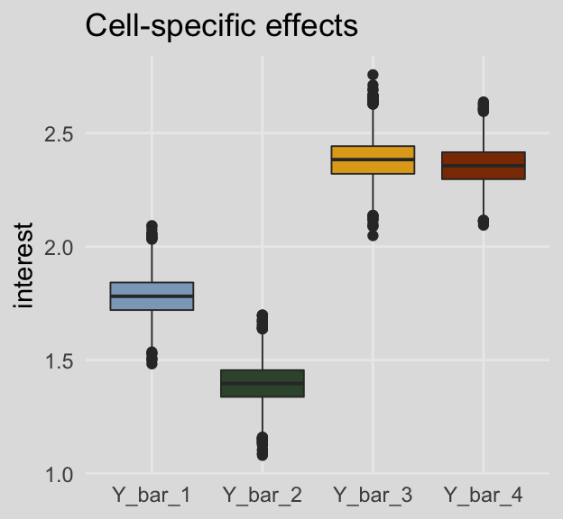

# Extending the Fundamental Principles of Moderation Analysis


"In this chapter, [we'll see] how [the] principles of moderation analysis are applied when the moderator is dichotomous (rather than a continuum, as in the previous chapter) as well as when both focal antecedent and moderator are continuous" [@hayesIntroductionMediationModeration2018, p. 267].

## Moderation with a dichotomous moderator

Here we load a couple necessary packages, load the data, and take a `glimpse()`.


```r
library(tidyverse)
library(brms)

disaster <- read_csv("data/disaster/disaster.csv")

glimpse(disaster)
```

```
## Rows: 211
## Columns: 5
## $ id      <dbl> 1, 2, 3, 4, 5, 6, 7, 8, 9, 10, 11, 12, 13, 14, 15, 16, 17, 18, 19, 20, 21, 22, 23,…
## $ frame   <dbl> 1, 1, 1, 1, 1, 0, 0, 1, 0, 0, 1, 1, 0, 0, 1, 1, 1, 1, 0, 0, 1, 0, 1, 0, 1, 1, 0, 0…
## $ donate  <dbl> 5.6, 4.2, 4.2, 4.6, 3.0, 5.0, 4.8, 6.0, 4.2, 4.4, 5.8, 6.2, 6.0, 4.2, 4.4, 5.8, 5.…
## $ justify <dbl> 2.95, 2.85, 3.00, 3.30, 5.00, 3.20, 2.90, 1.40, 3.25, 3.55, 1.55, 1.60, 1.65, 2.65…
## $ skeptic <dbl> 1.8, 5.2, 3.2, 1.0, 7.6, 4.2, 4.2, 1.2, 1.8, 8.8, 1.0, 5.4, 2.2, 3.6, 7.8, 1.6, 1.…
```

Regardless of whether the antecedent variables are continuous or binary, the equation for the simple moderation is still

$$Y = i_Y + b_1 X + b_2 W + b_3 XW + e_Y.$$

We can use that equation to fit our first moderation model with a binary $W$ (i.e., `frame`) like so.


```r
model8.1 <-
  brm(data = disaster, 
      family = gaussian,
      justify ~ 1 + skeptic + frame + frame:skeptic,
      cores = 4,
      file = "fits/model08.01")
```

Check the summary.


```r
print(model8.1, digits = 3)
```

```
##  Family: gaussian 
##   Links: mu = identity; sigma = identity 
## Formula: justify ~ 1 + skeptic + frame + frame:skeptic 
##    Data: disaster (Number of observations: 211) 
## Samples: 4 chains, each with iter = 2000; warmup = 1000; thin = 1;
##          total post-warmup samples = 4000
## 
## Population-Level Effects: 
##               Estimate Est.Error l-95% CI u-95% CI  Rhat Bulk_ESS Tail_ESS
## Intercept        2.448     0.150    2.163    2.747 1.000     2108     2214
## skeptic          0.106     0.038    0.030    0.181 1.002     2064     2256
## frame           -0.559     0.217   -0.983   -0.134 1.001     1817     2204
## skeptic:frame    0.200     0.055    0.095    0.307 1.001     1813     2406
## 
## Family Specific Parameters: 
##       Estimate Est.Error l-95% CI u-95% CI  Rhat Bulk_ESS Tail_ESS
## sigma    0.817     0.040    0.742    0.899 1.001     3416     2673
## 
## Samples were drawn using sampling(NUTS). For each parameter, Bulk_ESS
## and Tail_ESS are effective sample size measures, and Rhat is the potential
## scale reduction factor on split chains (at convergence, Rhat = 1).
```

We'll compute our Bayesian $R^2$ in the typical way.


```r
bayes_R2(model8.1) %>% round(digits = 3)
```

```
##    Estimate Est.Error  Q2.5 Q97.5
## R2     0.25     0.044 0.163 0.332
```

> This model should look familiar to you because it is exactly the same model estimated in the analysis presented in Chapter 7 (see Table 7.4, model 3). The only differences between these two analyses are how the corresponding question is framed, meaning which variable is deemed the focal antecedent and which is the moderator, and how these variables are symbolically labeled as $X$ and $W$. In the analysis in Chapter 7, the focal antecedent variable was a dichotomous variable coding the framing of the cause of the disaster (labeled $X$ then, but $W$ now), whereas in this analysis, the focal antecedent is a continuous variable placing each person on a continuum of climate change skepticism (labeled $W$ then, but $X$ now), with the moderator being a dichotomous variable coding experimental condition.
>
> So this example illustrates the symmetry property of interactions introduced in [section 7.1][Conditional and unconditional effects]. (p. 272)

### Visualizing and probing the interaction.

For the plots in this chapter, we'll take our color palette from the [**ochRe** package](https://github.com/ropenscilabs/ochRe), which provides Australia-inspired colors. We'll also use a few theme settings from good-old [**ggthemes**](https://CRAN.R-project.org/package=ggthemes). As in the last chapter, we'll save our adjusted theme settings as an object, `theme_08`.


```r
library(ggthemes)
library(ochRe)

theme_08 <-
  theme_minimal() +
  theme(panel.grid.minor = element_blank(),
        plot.background = element_rect(fill = ochre_palettes[["olsen_seq"]][8],
                                       color = "transparent"))
```

Happily, the **ochRe** package has a handy convenience function, `viz_palette()`, that makes it easy to preview the colors available in a given palette. We'll be using "olsen_qual" and "olsen_seq".


```r
viz_palette(ochre_palettes[["olsen_qual"]])
```


```r
viz_palette(ochre_palettes[["olsen_seq"]])
```


Behold our Figure 8.3.


```r
# these will come in handy with `geom_text()`, below
green_slope <- (fixef(model8.1)["skeptic", 1] + fixef(model8.1)[4, 1]) %>% round(digits = 3)
blue_slope  <-  fixef(model8.1)["skeptic", 1] %>% round(digits = 3)

# define the new data
nd <-
  crossing(frame   = 0:1,
           skeptic = c(0, 7))

# extract the `fitted()` draws
fitted(model8.1, 
       newdata = nd, 
       summary = F) %>% 
  # wrangle
  data.frame() %>% 
  set_names(mutate(nd, name = str_c(frame, "_", skeptic)) %>% pull(name)) %>% 
  mutate(iter = 1:n()) %>% 
  pivot_longer(-iter) %>% 
  separate(name, into = c("frame", "skeptic"), sep = "_") %>% 
  mutate(skeptic = as.double(skeptic)) %>% 
  
  # plot!
  ggplot(aes(x = skeptic, y = value, 
             group = interaction(frame, iter))) +
  geom_line(aes(color = frame),
            size = 1/6, alpha = 1/25) +
  annotate(geom = "text",
           x = c(4, 4.6), y = c(3.5, 2.6),
           label = c(paste("the slope when frame = 1 is about", green_slope),
                     paste("the slope when frame = 0 is about", blue_slope)),
           angle = c(28, 5), color = "black") +
  scale_color_manual(NULL, values = ochre_palettes[["olsen_qual"]][(5:6)]) +
  scale_x_continuous(breaks = 1:6) +
  coord_cartesian(xlim = c(1, 6),
                  ylim = c(2, 4)) +
  labs(title = "The moderation effect in a spaghetti plot",
       subtitle = "Using brms defaults, we have 4,000 posterior draws. Much like we have\n4,000 draws for each model parameter, when we combine those draws\nacross parameters, we end up with 4,000 model equations. The\nconsequence is we can also express the line plot as 4,000\nsemitransparent lines, one for each level of our moderator, frame.",
       x = expression("Climate Change Skepticism "*(italic(X))),
       y = "Strength of Justification for Withholding Aid") +
  theme_08 +
  theme(legend.position = "none")
```


In addition to our fancy Australia-inspired colors, we'll also play around a bit with spaghetti plots in this chapter. To my knowledge, this use of spaghetti plots is uniquely Bayesian. If you're trying to wrap your head around what on earth we just did, take a look at the first few rows from `posterior_samples()` object, `post`.


```r
post <- posterior_samples(model8.1)

head(post)
```

```
##   b_Intercept  b_skeptic    b_frame b_skeptic:frame     sigma      lp__
## 1    2.659889 0.08101323 -0.7538862       0.2130312 0.7587044 -259.8373
## 2    2.424039 0.11030638 -0.5627005       0.1673621 0.7754237 -259.0716
## 3    2.751647 0.03041706 -0.9541742       0.3288508 0.8225988 -260.7233
## 4    2.436618 0.08367410 -0.5994825       0.2287817 0.8560998 -258.5940
## 5    2.251451 0.16676260 -0.5518940       0.1795620 0.8297583 -259.2091
## 6    2.183603 0.15387596 -0.4489734       0.1568658 0.7498314 -262.0821
```

The `head()` function returned six rows, each one corresponding to the credible parameter values from a given posterior draw. The `lp__` is uniquely Bayesian and beyond the scope of this project. You might think of `sigma` as the Bayesian analogue to what the OLS folks often refer to as error or the residual variance. Hayes doesn't tend to emphasize it in this text, but it's something you'll want to pay increasing attention to as you move along in your Bayesian career. All the columns starting with `b_` are the regression parameters, the model coefficients or the fixed effects. But anyways, notice that those `b_` columns correspond to the four parameter values in Formula 8.2 on page 270. Here they are, but reformatted to more closely mimic the text:

1. $\hat{Y}$ = 2.66 + 0.081$X$ + -0.754$W$ + 0.213*XW*
2. $\hat{Y}$ = 2.424 + 0.11$X$ + -0.563$W$ + 0.167*XW*
3. $\hat{Y}$ = 2.752 + 0.03$X$ + -0.954$W$ + 0.329*XW*
4. $\hat{Y}$ = 2.437 + 0.084$X$ + -0.599$W$ + 0.229*XW*
5. $\hat{Y}$ = 2.251 + 0.167$X$ + -0.552$W$ + 0.18*XW*
6. $\hat{Y}$ = 2.184 + 0.154$X$ + -0.449$W$ + 0.157*XW*

Each row of `post`, each iteration or posterior draw, yields a full model equation that is a credible description of the data--or at least as credible as we can get within the limits of the model we have specified, our priors (which we typically cop out on and just use defaults in this project), and how well those fit when applied to the data at hand. So when we use **brms** convenience functions like `fitted()`, we pass specific predictor values through those 4,000 unique model equations, which returns 4,000 similar but distinct expected $Y$-values. So although a nice way to summarize those 4,000 values is with summaries such as the posterior mean/median and 95% intervals, another way is to just plot an individual regression line for each of the iterations. That is what's going on when we depict out models with a spaghetti plot.

The thing I like about spaghetti plots is that they give a three-dimensional sense of the posterior. Note that each individual line is very skinny and semitransparent. When you pile a whole bunch of them atop each other, the peaked or most credible regions of the posterior are the most saturated in color. Less credible posterior regions almost seamlessly merge into the background. Also, note how the combination of many similar but distinct straight lines results in a bowtie shape. Hopefully this clarifies where that shape's been coming from when we use `geom_ribbon()` to plot the 95% intervals.

Back to the text, on the bottom of page 274, Hayes pointed out the conditional effect of `skeptic` when `frame == 1` is $b_1 + b_3 = 0.306$. We can show that with a little arithmetic followed up with `tidybayes::mean_qi()`.


```r
library(tidybayes)

post <-
  post %>% 
  mutate(`b1 + b3` = b_skeptic + `b_skeptic:frame`)

post %>% 
  mean_qi(`b1 + b3`) %>% 
  mutate_if(is.double, round, digits = 3)
```

```
## # A tibble: 1 x 6
##   `b1 + b3` .lower .upper .width .point .interval
##       <dbl>  <dbl>  <dbl>  <dbl> <chr>  <chr>    
## 1     0.306  0.229  0.384   0.95 mean   qi
```

But anyways, you could recode `frame` in a number of ways, including `if_else()` or, in this case, by simple arithmetic.


```r
disaster <-
  disaster %>% 
  mutate(frame_ep = 1 - frame)
```

With `frame_ep` in hand, we're ready to refit the model.


```r
model8.2 <-
  update(model8.1, 
         newdata = disaster,
         formula = justify ~ 1 + skeptic + frame_ep + frame_ep:skeptic,
         cores = 4,
         file = "fits/model08.02")
```


```r
print(model8.2)
```

```
##  Family: gaussian 
##   Links: mu = identity; sigma = identity 
## Formula: justify ~ skeptic + frame_ep + skeptic:frame_ep 
##    Data: disaster (Number of observations: 211) 
## Samples: 4 chains, each with iter = 2000; warmup = 1000; thin = 1;
##          total post-warmup samples = 4000
## 
## Population-Level Effects: 
##                  Estimate Est.Error l-95% CI u-95% CI Rhat Bulk_ESS Tail_ESS
## Intercept            1.89      0.16     1.58     2.23 1.00     1717     2312
## skeptic              0.31      0.04     0.22     0.38 1.00     1572     2225
## frame_ep             0.56      0.23     0.12     0.99 1.00     1463     2174
## skeptic:frame_ep    -0.20      0.06    -0.31    -0.09 1.01     1428     1998
## 
## Family Specific Parameters: 
##       Estimate Est.Error l-95% CI u-95% CI Rhat Bulk_ESS Tail_ESS
## sigma     0.82      0.04     0.75     0.90 1.00     3258     2832
## 
## Samples were drawn using sampling(NUTS). For each parameter, Bulk_ESS
## and Tail_ESS are effective sample size measures, and Rhat is the potential
## scale reduction factor on split chains (at convergence, Rhat = 1).
```

Our results match nicely with the formula on page 275.

If you want to follow along with Hayes on page 276 and isolate the 95% credible intervals for the `skeptic` parameter, you can use the `posterior_interval()` function.


```r
posterior_interval(model8.2)["b_skeptic", ] %>% round(digits = 3)
```

```
##  2.5% 97.5% 
## 0.224 0.385
```

## Interaction between two quantitative variables

Here's the `glbwarm` data.


```r
glbwarm <- read_csv("data/glbwarm/glbwarm.csv")

glimpse(glbwarm)
```

```
## Rows: 815
## Columns: 7
## $ govact   <dbl> 3.6, 5.0, 6.6, 1.0, 4.0, 7.0, 6.8, 5.6, 6.0, 2.6, 1.4, 5.6, 7.0, 3.8, 3.4, 4.2, 1…
## $ posemot  <dbl> 3.67, 2.00, 2.33, 5.00, 2.33, 1.00, 2.33, 4.00, 5.00, 5.00, 1.00, 4.00, 1.00, 5.6…
## $ negemot  <dbl> 4.67, 2.33, 3.67, 5.00, 1.67, 6.00, 4.00, 5.33, 6.00, 2.00, 1.00, 4.00, 5.00, 4.6…
## $ ideology <dbl> 6, 2, 1, 1, 4, 3, 4, 5, 4, 7, 6, 4, 2, 4, 5, 2, 6, 4, 2, 4, 4, 2, 6, 4, 4, 3, 4, …
## $ age      <dbl> 61, 55, 85, 59, 22, 34, 47, 65, 50, 60, 71, 60, 71, 59, 32, 36, 69, 70, 41, 48, 3…
## $ sex      <dbl> 0, 0, 1, 0, 1, 0, 1, 1, 1, 1, 1, 0, 1, 0, 1, 1, 1, 0, 0, 0, 0, 1, 1, 1, 1, 1, 1, …
## $ partyid  <dbl> 2, 1, 1, 1, 1, 2, 1, 1, 2, 3, 2, 1, 1, 1, 1, 1, 2, 3, 1, 3, 2, 1, 3, 2, 1, 1, 1, …
```

In this section we add three covariates (i.e., $C$ variables) to the basic moderation model. Although Hayes made a distinction between the $X$, $M$, and $C$ variables in the text, that distinction is conceptual and doesn't impact the way we enter them into `brm()`. Rather, the `brm()` formula clarifies they're all just predictors.


```r
model8.3 <- 
  brm(data = glbwarm, 
      family = gaussian,
      govact ~ 1 + negemot + age + negemot:age + posemot + ideology + sex,
      cores = 4,
      file = "fits/model08.03")
```

Our results cohere nicely with the Hayes's formula in the middle of page 278 or with the results he displayed in Table 8.2.


```r
print(model8.3, digits = 3)
```

```
##  Family: gaussian 
##   Links: mu = identity; sigma = identity 
## Formula: govact ~ 1 + negemot + age + negemot:age + posemot + ideology + sex 
##    Data: glbwarm (Number of observations: 815) 
## Samples: 4 chains, each with iter = 2000; warmup = 1000; thin = 1;
##          total post-warmup samples = 4000
## 
## Population-Level Effects: 
##             Estimate Est.Error l-95% CI u-95% CI  Rhat Bulk_ESS Tail_ESS
## Intercept      5.180     0.333    4.537    5.851 1.000     2430     2573
## negemot        0.119     0.081   -0.039    0.274 1.000     2177     2390
## age           -0.024     0.006   -0.036   -0.012 1.001     2117     2799
## posemot       -0.022     0.028   -0.076    0.034 1.002     3774     2556
## ideology      -0.212     0.027   -0.264   -0.159 1.001     3661     2911
## sex           -0.013     0.075   -0.160    0.135 1.003     3452     2448
## negemot:age    0.006     0.002    0.003    0.009 1.000     2129     2421
## 
## Family Specific Parameters: 
##       Estimate Est.Error l-95% CI u-95% CI  Rhat Bulk_ESS Tail_ESS
## sigma    1.059     0.026    1.009    1.110 1.001     3806     2635
## 
## Samples were drawn using sampling(NUTS). For each parameter, Bulk_ESS
## and Tail_ESS are effective sample size measures, and Rhat is the potential
## scale reduction factor on split chains (at convergence, Rhat = 1).
```

Here's the $R^2$ summary.


```r
bayes_R2(model8.3) %>% round(digits = 3)
```

```
##    Estimate Est.Error  Q2.5 Q97.5
## R2    0.401      0.02 0.362 0.437
```

As the $R^2$ is a good bit away from the boundaries, it's nicely Gaussian.


```r
bayes_R2(model8.3, summary = F) %>% 
  as_tibble() %>% 

  ggplot(aes(x = R2)) +
  geom_density(size = 0, fill = ochre_palettes[["olsen_qual"]][(1)]) +
  scale_x_continuous(NULL, limits = 0:1) +
  scale_y_continuous(NULL, breaks = NULL) +
  labs(title = expression("Loot at how Gaussian our "*italic(R)^2*" is!"),
       subtitle = expression("No need to put a "*italic(p)*"-value on that sucker.")) +
  theme_08
```


### Visualizing and probing the interaction.

For our version of Figure 8.5, we'll need to adjust our `nd` data for `fitted()`.


```r
(
  nd <-
  crossing(negemot = c(1, 6),
           age     = c(30, 50, 70)) %>% 
  mutate(posemot  = mean(glbwarm$posemot),
         ideology = mean(glbwarm$ideology),
         sex      = mean(glbwarm$sex))
)
```

```
## # A tibble: 6 x 5
##   negemot   age posemot ideology   sex
##     <dbl> <dbl>   <dbl>    <dbl> <dbl>
## 1       1    30    3.13     4.08 0.488
## 2       1    50    3.13     4.08 0.488
## 3       1    70    3.13     4.08 0.488
## 4       6    30    3.13     4.08 0.488
## 5       6    50    3.13     4.08 0.488
## 6       6    70    3.13     4.08 0.488
```

Our `fitted()` and **ggplot2** code will be quite similar to the last spaghetti plot. Only this time we'll use `filter()` to reduce the number of posterior draws we show in the plot.


```r
# these will come in handy with `geom_text()`, below
slope_30 <- (fixef(model8.3)["negemot", 1] + fixef(model8.3)["negemot:age", 1] * 30) %>% round(digits = 3)
slope_50 <- (fixef(model8.3)["negemot", 1] + fixef(model8.3)["negemot:age", 1] * 50) %>% round(digits = 3)
slope_70 <- (fixef(model8.3)["negemot", 1] + fixef(model8.3)["negemot:age", 1] * 70) %>% round(digits = 3)

# annotation
text <-
  tibble(negemot = 6.1,
         value   = c(5.4, 5.7, 6),
         age     = as.character(c(30, 50, 70)),
         iter    = 0,
         label   = c(str_c("the slope for 30 year olds is about ", slope_30),
                     str_c("the slope for 50 year olds is about ", slope_50),
                     str_c("the slope for 70 year olds is about ", slope_70)))

# get the fitted draws and wrangle
fitted(model8.3, 
       newdata = nd, 
       summary = F) %>% 
  data.frame() %>% 
  set_names(mutate(nd, name = str_c(negemot, "_", age)) %>% pull(name)) %>% 
  mutate(iter = 1:n()) %>% 
  pivot_longer(-iter) %>% 
  separate(name, into = c("negemot", "age"), sep = "_") %>% 
  mutate(negemot = as.double(negemot)) %>% 
  filter(iter <= 100) %>% 
  
  # plot!
  ggplot(aes(x = negemot, y = value, 
             group = interaction(age, iter),
             color = age)) +
  geom_line(size = 3/4, alpha = 1/8) +
  geom_text(data = text,
            aes(label = label),
            hjust = 0) +
  scale_color_manual(NULL, values = ochre_palettes[["olsen_qual"]][c(4, 1, 3)]) +
  scale_x_continuous(breaks = 1:6, limits = c(1, 9)) +
  scale_y_continuous("Support for Government Action", limits = c(2.9, 6.1)) +
  labs(title = "The moderation effect of age on negemot",
       x = expression("Negative Emotions about Climate Change "*(italic(X)))) +
  theme_08 +
  theme(legend.position = "none")
```


When we reduce the number of lines depicted in the plot, we lose some of the three-dimensional illusion. It's nice, however, to get a closer look to each individual line. To each their own.

We'll continue with our spaghetti plot approach for Figure 8.7. Again, when we made the JN technique plot for Chapter 7, we computed values for the posterior mean and the 95% intervals. Because the intervals follow a bowtie shape, we had to compute the $Y$-values for many values across the $x$-axis in order to make the curve look smooth. But as long as we stick with the spaghetti plot approach, all we need are the values at the endpoints of each iteration. Although each line is straight, the combination of many lines is what produces the bowtie effect.


```r
# here is our primary data object
post <-
  posterior_samples(model8.3) %>% 
  transmute(at_15 = b_negemot + `b_negemot:age` * 15,
            at_90 = b_negemot + `b_negemot:age` * 90,
            iter  = 1:n()) %>% 
  pivot_longer(-iter, names_to = "age") %>% 
  mutate(age = str_remove(age, "at_") %>% as.double())

# here we compute the points for the posterior mean
post_means <-
  post %>% 
  group_by(age) %>% 
  summarize(value = mean(value)) %>% 
  mutate(iter = 0)

# plot!
post %>% 
  filter(iter < 501) %>% 

  ggplot(aes(x = age, y = value, group = iter)) +
  geom_line(color = ochre_palettes[["olsen_qual"]][1],
            alpha = 1/12) +
  geom_line(data = post_means,
            color = ochre_palettes[["olsen_qual"]][3],
            size = 1.1) +
  scale_y_continuous(breaks = seq(from = -.25, to = 1, by = .25)) +
  coord_cartesian(xlim = c(20, 85),
                  ylim = c(-.25, 1)) +
  labs(subtitle = "Each orange line is the consequence of one of 1,000 posterior draws. All are\ncredible regression lines for the data, but because they are semitransparent,\nthe most credible regions are the ones with the darkest color. The line\ncorresponding to the posterior mean is in red-orange.",
       x = expression(Age~(italic(W))),
       y = "Conditional Effects of Negative Emotions on\nSupport for Government Action") +
  theme_08
```


In other words, each of those orange lines is a credible expression of $\theta_{X \rightarrow Y}$ (i.e., $b_1 + b_3 W$) across a continuous range of $W$ values.

## Hierarchical versus simultaneous entry

> Many investigators test a moderation hypothesis in regression analysis using a method that on the surface seems different than the procedure described thus far. This alternative approach is to build a regression model by adding the product of $X$ and $W$ to a model already containing $X$ and $W$. This procedure is sometimes called *hierarchical regression* or *hierarchical variable entry* (and easily confused by name with *hierarchical linear modeling*, which is an entirely different thing). The goal using this method is to determine whether allowing $X$'s effect to be contingent on $W$ produces a better fitting model than one in which the effect of $X$ is constrained to be unconditional on $W$. According to the logic of hierarchical entry, if the contingent model accounts for more of the variation in Y than the model that forces $X$'s effect to be independent of $W$, then the better model is one in which $W$ is allowed to moderate $X$'s effect. Although this approach works, it is a widely believed myth that it is *necessary* to use this approach in order to test a moderation hypothesis. (p. 289, *emphasis* in the original)

Although this method is not necessary, it can be handy to slowly build your model. This method can also serve nice rhetorical purposes in a paper. Anyway, here's our multivariable but non-moderation model, `model8.4`.


```r
model8.4 <-
  update(model8.1,
         formula = justify ~ 1 + skeptic + frame,
         cores = 4,
         file = "fits/model08.04")
```

Here we'll compute the corresponding $R^2$ and compare it with the one for the original interaction model with a difference score.


```r
r2 <-
  tibble(moderation_model    = bayes_R2(model8.1, summary = F)[, 1],
         multivariable_model = bayes_R2(model8.4, summary = F)[, 1]) %>% 
  # we'll need a difference score
  mutate(difference = moderation_model - multivariable_model) %>% 
  # putting the data in the long format and grouping will make summarizing easier
  pivot_longer(everything(), names_to = "R2")

r2 %>% 
  group_by(R2) %>% 
  median_qi(value) %>% 
  mutate_if(is.double, round, digits = 3)
```

```
## # A tibble: 3 x 7
##   R2                  value .lower .upper .width .point .interval
##   <chr>               <dbl>  <dbl>  <dbl>  <dbl> <chr>  <chr>    
## 1 difference          0.05  -0.072  0.166   0.95 median qi       
## 2 moderation_model    0.25   0.163  0.332   0.95 median qi       
## 3 multivariable_model 0.201  0.113  0.283   0.95 median qi
```

Note that the Bayesian $R^2$ performed differently than the $F$-test in the text.


```r
r2 %>% 
  filter(R2 == "difference") %>% 

  ggplot(aes(x = value, fill = model)) +
  geom_density(size = 0, fill = ochre_palettes[["olsen_seq"]][14]) +
  scale_x_continuous(NULL, limits = c(-.4, .4)) +
  scale_y_continuous(NULL, breaks = NULL) +
  labs(title = expression(paste("The Bayesian ", Delta, italic(R)^2, " distribution")),
       subtitle = "Although most of the posterior mass is positive--suggesting the moderation model accounted for more variance than\nthe simple multivariable model--, a substantial portion of the postrior is within the negative parameter space. Sure,\nif we had to bet, the safer bet is on the moderation model. But that bet wouled be quite uncertain and we might well\nloose our shirts. Also, note the width of the distribution; credible values range from -0.1 to nearly 0.2.") +
  theme_08
```


We can also compare these with the LOO, which, as is typical of information criteria, corrects for model complexity. First, we compute them and attach the results to the model fit objects.


```r
model8.1 <- add_criterion(model8.1, "loo")
model8.4 <- add_criterion(model8.4, "loo")
```

Now use the `loo_compare()` function to compare them directly.


```r
loo_compare(model8.1, model8.4) %>% 
  print(simplify = F)
```

```
##          elpd_diff se_diff elpd_loo se_elpd_loo p_loo  se_p_loo looic  se_looic
## model8.1    0.0       0.0  -259.0     10.8         5.4    0.9    518.0   21.7  
## model8.4   -5.7       4.1  -264.7     11.2         4.7    0.9    529.5   22.4
```

As a reminder, we generally prefer models with lower information criteria, which in this case is clearly the moderation model (i.e., `model8.1`). However, the standard error value (i.e., `se_diff`) for the difference (i.e., `elpd_diff`) is quite large, which suggests that the model with the lowest value isn't the clear winner. Happily, these results match nicely with the Bayesian $R^2$ difference score. The moderation model appears somewhat better than the multivariable model, but its superiority is hardly decisive.

## The equivalence between moderated regression analysis and a 2 X 2 factorial analysis of variance

I'm just not going to encourage ANOVA $F$-testing methodology. However, I will show the Bayesian regression model. First, here are the data.


```r
caskets <- read_csv("data/caskets/caskets.csv")

glimpse(caskets)
```

```
## Rows: 541
## Columns: 7
## $ policy   <dbl> 1, 0, 1, 1, 1, 0, 1, 1, 0, 1, 1, 1, 0, 1, 0, 1, 0, 0, 1, 1, 0, 1, 0, 1, 0, 1, 0, …
## $ interest <dbl> 4.0, 2.0, 3.0, 1.0, 1.0, 2.0, 1.0, 2.5, 3.0, 1.0, 2.0, 3.5, 1.0, 1.0, 1.5, 3.0, 1…
## $ age      <dbl> 39, 57, 63, 56, 50, 87, 33, 64, 82, 28, 18, 52, 42, 39, 64, 72, 54, 84, 55, 27, 4…
## $ educ     <dbl> 3, 3, 2, 5, 3, 2, 7, 2, 3, 3, 1, 1, 5, 4, 3, 2, 3, 4, 7, 2, 3, 5, 4, 5, 5, 3, 3, …
## $ male     <dbl> 1, 1, 0, 1, 0, 1, 0, 1, 0, 0, 1, 0, 0, 1, 0, 0, 0, 0, 1, 1, 1, 0, 1, 1, 1, 1, 1, …
## $ conserv  <dbl> 4, 3, 6, 3, 3, 5, 6, 3, 6, 7, 4, 2, 7, 6, 5, 6, 6, 3, 7, 6, 5, 5, 3, 4, 6, 2, 7, …
## $ kerry    <dbl> 1, 1, 1, 1, 1, 0, 0, 1, 0, 0, 0, 1, 1, 0, 1, 1, 1, 1, 0, 0, 0, 0, 1, 0, 0, 0, 0, …
```

Fit the moderation model.


```r
model8.5 <-
  brm(data = caskets, 
      family = gaussian,
      interest ~ 1 + policy + kerry + policy:kerry,
      cores = 4,
      file = "fits/model08.05")
```


```r
print(model8.5)
```

```
##  Family: gaussian 
##   Links: mu = identity; sigma = identity 
## Formula: interest ~ 1 + policy + kerry + policy:kerry 
##    Data: caskets (Number of observations: 541) 
## Samples: 4 chains, each with iter = 2000; warmup = 1000; thin = 1;
##          total post-warmup samples = 4000
## 
## Population-Level Effects: 
##              Estimate Est.Error l-95% CI u-95% CI Rhat Bulk_ESS Tail_ESS
## Intercept        1.78      0.09     1.61     1.96 1.00     2253     2963
## policy          -0.38      0.13    -0.63    -0.14 1.00     2107     2781
## kerry            0.60      0.13     0.34     0.85 1.00     1801     2596
## policy:kerry     0.36      0.18     0.02     0.70 1.00     1976     2575
## 
## Family Specific Parameters: 
##       Estimate Est.Error l-95% CI u-95% CI Rhat Bulk_ESS Tail_ESS
## sigma     1.04      0.03     0.98     1.10 1.00     3851     2563
## 
## Samples were drawn using sampling(NUTS). For each parameter, Bulk_ESS
## and Tail_ESS are effective sample size measures, and Rhat is the potential
## scale reduction factor on split chains (at convergence, Rhat = 1).
```

Those results don't look anything like what Hayes reported in Tables 8.3 or 8.4. However, a little deft manipulation of the posterior samples can yield equivalent results to Hayes's Table 8.3.


```r
post <- 
  posterior_samples(model8.5) %>% 
  mutate(Y_bar_1 = b_Intercept + b_policy * 0 + b_kerry * 0 + `b_policy:kerry` * 0 * 0,
         Y_bar_3 = b_Intercept + b_policy * 0 + b_kerry * 1 + `b_policy:kerry` * 0 * 1,
         Y_bar_2 = b_Intercept + b_policy * 1 + b_kerry * 0 + `b_policy:kerry` * 1 * 0,
         Y_bar_4 = b_Intercept + b_policy * 1 + b_kerry * 1 + `b_policy:kerry` * 1 * 1,
         
         Y_bar_12 = b_Intercept + b_policy * .5 + b_kerry * 0  + `b_policy:kerry` * .5 * 0,
         Y_bar_34 = b_Intercept + b_policy * .5 + b_kerry * 1  + `b_policy:kerry` * .5 * 1,
         Y_bar_13 = b_Intercept + b_policy * 0  + b_kerry * .5 + `b_policy:kerry` * 0  * .5,
         Y_bar_24 = b_Intercept + b_policy * 1  + b_kerry * .5 + `b_policy:kerry` * 1  * .5)
```

Here are the cell-specific means in Table 8.3.


```r
post %>% 
  pivot_longer(Y_bar_1:Y_bar_4) %>% 
  group_by(name) %>% 
  median_qi(value) %>% 
  mutate_if(is.double, round, digits = 3)
```

```
## # A tibble: 4 x 7
##   name    value .lower .upper .width .point .interval
##   <chr>   <dbl>  <dbl>  <dbl>  <dbl> <chr>  <chr>    
## 1 Y_bar_1  1.78   1.61   1.96   0.95 median qi       
## 2 Y_bar_2  1.40   1.22   1.57   0.95 median qi       
## 3 Y_bar_3  2.38   2.21   2.57   0.95 median qi       
## 4 Y_bar_4  2.36   2.19   2.53   0.95 median qi
```

And here are the marginal means from Table 8.3.


```r
post %>% 
  pivot_longer(Y_bar_12:Y_bar_24) %>% 
  group_by(name) %>% 
  median_qi(value) %>% 
  mutate_if(is.double, round, digits = 3)
```

```
## # A tibble: 4 x 7
##   name     value .lower .upper .width .point .interval
##   <chr>    <dbl>  <dbl>  <dbl>  <dbl> <chr>  <chr>    
## 1 Y_bar_12  1.59   1.47   1.71   0.95 median qi       
## 2 Y_bar_13  2.08   1.96   2.21   0.95 median qi       
## 3 Y_bar_24  1.88   1.75   2.00   0.95 median qi       
## 4 Y_bar_34  2.37   2.25   2.49   0.95 median qi
```

For kicks and giggles, here are what the cell-specific means look like in box plots.


```r
post %>% 
  pivot_longer(Y_bar_1:Y_bar_4) %>% 

  ggplot(aes(x = name, y = value, fill = name)) +
  geom_boxplot(size = 1/3) +
  scale_fill_manual(values = ochre_palettes[["olsen_qual"]][c(5, 6, 4, 3)]) +
  labs(title = "Cell-specific effects",
       x = NULL, 
       y = "interest") +
  theme_08 +
  theme(legend.position = "none")
```


         
And here are the same for the marginal means. This time we'll show the shapes of the posteriors with violin plots with horizontal lines depicting the median and interquartile ranges.


```r
post %>% 
  pivot_longer(Y_bar_12:Y_bar_24) %>% 

  ggplot(aes(x = name, y = value, fill = name)) +
  geom_violin(draw_quantiles = c(.25, .5, .75),
              color = ochre_palettes[["olsen_seq"]][8]) +
  scale_fill_manual(values = ochre_palettes[["olsen_qual"]][c(5, 6, 4, 3)]) +
  labs(title = "Marginal means",
       x = NULL, 
       y = "interest") +
  theme_08 +
  theme(legend.position = "none")
```


On page 294, Hayes used point estimates to compute the *simple effect* of policy information among Kerry supporters and then the same thing among Bush supporters. Here's how we'd do that when working with the full vector of posterior draws.


```r
post %>% 
  mutate(simple_effect_Kerry = Y_bar_4 - Y_bar_3,
         simple_effect_Bush  = Y_bar_2 - Y_bar_1) %>% 
  pivot_longer(contains("simple")) %>% 
  group_by(name) %>% 
  mean_qi(value) %>% 
  mutate_if(is.double, round, digits = 3)
```

```
## # A tibble: 2 x 7
##   name                 value .lower .upper .width .point .interval
##   <chr>                <dbl>  <dbl>  <dbl>  <dbl> <chr>  <chr>    
## 1 simple_effect_Bush  -0.385 -0.631 -0.138   0.95 mean   qi       
## 2 simple_effect_Kerry -0.026 -0.268  0.221   0.95 mean   qi
```

So then computing the main effect for policy information using the simple effects is little more than an extension of those steps.


```r
post %>% 
  transmute(main_effect = ((Y_bar_4 - Y_bar_3) + (Y_bar_2 - Y_bar_1)) / 2) %>% 
  mean_qi(main_effect) %>% 
  mutate_if(is.double, round, digits = 3)
```

```
## # A tibble: 1 x 6
##   main_effect .lower .upper .width .point .interval
##         <dbl>  <dbl>  <dbl>  <dbl> <chr>  <chr>    
## 1      -0.206 -0.387 -0.022   0.95 mean   qi
```

And we get the same results by strategically subtracting the marginal means.


```r
post %>% 
  transmute(main_effect = Y_bar_24 - Y_bar_13) %>% 
  mean_qi(main_effect) %>% 
  mutate_if(is.double, round, digits = 3)
```

```
## # A tibble: 1 x 6
##   main_effect .lower .upper .width .point .interval
##         <dbl>  <dbl>  <dbl>  <dbl> <chr>  <chr>    
## 1      -0.206 -0.387 -0.022   0.95 mean   qi
```

The main effect of for candidate is similarly computed using either approach.


```r
post %>% 
  transmute(main_effect = ((Y_bar_4 - Y_bar_2) + (Y_bar_3 - Y_bar_1)) / 2) %>% 
  mean_qi(main_effect) %>% 
  mutate_if(is.double, round, digits = 3)
```

```
## # A tibble: 1 x 6
##   main_effect .lower .upper .width .point .interval
##         <dbl>  <dbl>  <dbl>  <dbl> <chr>  <chr>    
## 1        0.78  0.602   0.96   0.95 mean   qi
```

```r
post %>% 
  transmute(main_effect = Y_bar_34 - Y_bar_12) %>% 
  mean_qi(main_effect) %>% 
  mutate_if(is.double, round, digits = 3)
```

```
## # A tibble: 1 x 6
##   main_effect .lower .upper .width .point .interval
##         <dbl>  <dbl>  <dbl>  <dbl> <chr>  <chr>    
## 1        0.78  0.602   0.96   0.95 mean   qi
```

We don't have an $F$-test for our Bayesian moderation model. But we do have an interaction term. Here's its distribution.


```r
post %>% 
  ggplot(aes(x = `b_policy:kerry`)) +
  geom_density(size = 0, fill = ochre_palettes[["olsen_qual"]][2]) +
  geom_vline(xintercept = fixef(model8.5)["policy:kerry", c(1, 3, 4)],
             color = ochre_palettes[["olsen_seq"]][8], linetype = c(1, 2, 2)) +
  scale_x_continuous(NULL,
                     breaks = fixef(model8.5)["policy:kerry", c(1, 3, 4)],
                     labels = fixef(model8.5)["policy:kerry", c(1, 3, 4)] %>% round(digits = 2)) +
  scale_y_continuous(NULL, breaks = NULL) +
  labs(title = "The interaction term, `policy:kerry`",
       subtitle = "The solid vertical line is the posterior mean\nand the dashed lines to either end denote the\npercentile-based 95% intervals.") +
  theme_08 +
  theme(legend.position = "none")
```


Following Hayes's work on the bottom of page 295, here's how you'd reproduce that by manipulating our $\overline Y$ vectors.


```r
post %>% 
  transmute(reproduced_interaction_term = (Y_bar_4 - Y_bar_3) - (Y_bar_2 - Y_bar_1)) %>% 
  mean_qi(reproduced_interaction_term) %>% 
  mutate_if(is.double, round, digits = 2)
```

```
## # A tibble: 1 x 6
##   reproduced_interaction_term .lower .upper .width .point .interval
##                         <dbl>  <dbl>  <dbl>  <dbl> <chr>  <chr>    
## 1                        0.36   0.02    0.7   0.95 mean   qi
```

Extending that logic, we also get the answer this way.


```r
post %>% 
  transmute(reproduced_interaction_term = (Y_bar_4 - Y_bar_2) - (Y_bar_3 - Y_bar_1)) %>% 
  mean_qi(reproduced_interaction_term) %>% 
  mutate_if(is.double, round, digits = 2)
```

```
## # A tibble: 1 x 6
##   reproduced_interaction_term .lower .upper .width .point .interval
##                         <dbl>  <dbl>  <dbl>  <dbl> <chr>  <chr>    
## 1                        0.36   0.02    0.7   0.95 mean   qi
```

### Simple effects parameterization.

We might reacquaint ourselves with the `formula` from `model8.5`.


```r
model8.5$formula
```

```
## interest ~ 1 + policy + kerry + policy:kerry
```

The results cohere nicely with the "Model 1" results at the top of Table 8.5.


```r
fixef(model8.5) %>% round(digits = 3)
```

```
##              Estimate Est.Error   Q2.5  Q97.5
## Intercept       1.782     0.089  1.608  1.959
## policy         -0.385     0.127 -0.631 -0.138
## kerry           0.601     0.129  0.337  0.848
## policy:kerry    0.359     0.176  0.018  0.703
```

The Bayesian $R^2$ portion looks on point, too.


```r
bayes_R2(model8.5) %>% round(digits = 3)
```

```
##    Estimate Est.Error  Q2.5 Q97.5
## R2     0.14     0.026 0.092 0.192
```

Our various `Y_bar` transformations from before continue to cohere with the coefficients, above, just like in the text. E.g., the `policy` coefficient may be returned like so.


```r
post %>% 
  transmute(b1                  = b_policy,
            `Y_bar_2 - Y_bar_1` = Y_bar_2 - Y_bar_1) %>% 
  pivot_longer(everything()) %>% 
  group_by(name) %>% 
  summarize(mean = mean(value),
            sd   = sd(value)) %>% 
  mutate_if(is.double, round, digits = 3)
```

```
## # A tibble: 2 x 3
##   name                mean    sd
##   <chr>              <dbl> <dbl>
## 1 b1                -0.385 0.127
## 2 Y_bar_2 - Y_bar_1 -0.385 0.127
```

We can continue to use Hayes's `Y_bar` transformations to return the `kerry` coefficient, too.


```r
post %>% 
  transmute(b2                  = b_kerry,
            `Y_bar_3 - Y_bar_1` = Y_bar_3 - Y_bar_1) %>% 
  pivot_longer(everything()) %>% 
  group_by(name) %>% 
  summarize(mean = mean(value),
            sd   = sd(value)) %>% 
  mutate_if(is.double, round, digits = 3)
```

```
## # A tibble: 2 x 3
##   name               mean    sd
##   <chr>             <dbl> <dbl>
## 1 b2                0.601 0.129
## 2 Y_bar_3 - Y_bar_1 0.601 0.129
```

Here we compute $b_3$ with the difference between the simple effects of $X$ at levels of $W$.


```r
post %>% 
  transmute(b3                                          = `b_policy:kerry`,
            `(Y_bar_4 - Y_bar_3) - (Y_bar_2 - Y_bar_1)` = (Y_bar_4 - Y_bar_3) - (Y_bar_2 - Y_bar_1)) %>% 
  pivot_longer(everything()) %>% 
  group_by(name) %>% 
  summarize(mean = mean(value),
            sd   = sd(value)) %>% 
  mutate_if(is.double, round, digits = 3)
```

```
## # A tibble: 2 x 3
##   name                                       mean    sd
##   <chr>                                     <dbl> <dbl>
## 1 (Y_bar_4 - Y_bar_3) - (Y_bar_2 - Y_bar_1) 0.359 0.176
## 2 b3                                        0.359 0.176
```

And now $b_{3}$ with the difference between the simple effects of $W$ at levels of $X$.


```r
post %>% 
  transmute(b3                                          = `b_policy:kerry`,
            `(Y_bar_4 - Y_bar_2) - (Y_bar_3 - Y_bar_1)` = (Y_bar_4 - Y_bar_2) - (Y_bar_3 - Y_bar_1)) %>% 
  pivot_longer(everything()) %>% 
  group_by(name) %>% 
  summarize(mean = mean(value),
            sd   = sd(value)) %>% 
  mutate_if(is.double, round, digits = 3)
```

```
## # A tibble: 2 x 3
##   name                                       mean    sd
##   <chr>                                     <dbl> <dbl>
## 1 (Y_bar_4 - Y_bar_2) - (Y_bar_3 - Y_bar_1) 0.359 0.176
## 2 b3                                        0.359 0.176
```

### Main effects parameterization.

A nice feature of **brms** is you can transform your data right within the `brm()` or `update()` functions. Here we'll make our two new main-effects-coded variables, `policy_me` and `kerry_me`, with the `mutate()` function right within `update()`.


```r
model8.6 <-
  update(model8.5,
         newdata = caskets %>%
           mutate(policy_me = policy - .5,
                  kerry_me  = kerry  - .5), 
         family = gaussian,
         interest ~ 1 + policy_me + kerry_me + policy_me:kerry_me,
         cores = 4,
         file = "fits/model08.06")
```

Transforming your data within the **brms** functions won't change the original data structure. However, **brms** will save the data used to fit the model within the `brm()` object. You can access that data like so.


```r
model8.6$data %>%
  head()
```

```
##   interest policy_me kerry_me
## 1        4       0.5      0.5
## 2        2      -0.5      0.5
## 3        3       0.5      0.5
## 4        1       0.5      0.5
## 5        1       0.5      0.5
## 6        2      -0.5     -0.5
```

But we digress. Here's our analogue to the "Model 2" portion of Table 8.5.


```r
rbind(
  fixef(model8.6) %>% round(digits = 3),
  bayes_R2(model8.6) %>% round(digits = 3)
)
```

```
##                    Estimate Est.Error   Q2.5  Q97.5
## Intercept             1.980     0.044  1.895  2.067
## policy_me            -0.210     0.089 -0.384 -0.038
## kerry_me              0.780     0.092  0.601  0.963
## policy_me:kerry_me    0.365     0.178  0.013  0.729
## R2                    0.141     0.026  0.091  0.193
```

Like with `model8.6`, above, we'll need a bit of algebra to compute our $\overline Y_i$ vectors.


```r
post <- 
  posterior_samples(model8.6) %>% 
  mutate(Y_bar_1 = b_Intercept + b_policy_me * -.5 + b_kerry_me * -.5 + `b_policy_me:kerry_me` * -.5 * -.5,
         Y_bar_3 = b_Intercept + b_policy_me * -.5 + b_kerry_me *  .5 + `b_policy_me:kerry_me` * -.5 *  .5,
         Y_bar_2 = b_Intercept + b_policy_me *  .5 + b_kerry_me * -.5 + `b_policy_me:kerry_me` *  .5 * -.5,
         Y_bar_4 = b_Intercept + b_policy_me *  .5 + b_kerry_me *  .5 + `b_policy_me:kerry_me` *  .5 *  .5)
```

With our `post` for `fit5` in hand, we'll follow the formulas at the top of page 298 to compute our $b_1$ and $b_2$ distributions.


```r
post %>% 
  transmute(b1 = ((Y_bar_4 - Y_bar_3) + (Y_bar_2 - Y_bar_1)) / 2,
            b2 = ((Y_bar_4 - Y_bar_2) + (Y_bar_3 - Y_bar_1)) / 2) %>% 
  pivot_longer(b1:b2) %>% 
  group_by(name) %>% 
  summarize(mean = mean(value),
            sd   = sd(value)) %>% 
  mutate_if(is.double, round, digits = 3)
```

```
## # A tibble: 2 x 3
##   name   mean    sd
##   <chr> <dbl> <dbl>
## 1 b1    -0.21 0.089
## 2 b2     0.78 0.092
```

Hayes pointed out that the interaction effect, $b_3$, is the same across models his OLS Models 1 and 2. This is largely true for our Bayesian HMC `model8.5` and `model8.6` models.


```r
fixef(model8.5)[4, ] %>% round(digits = 3)
```

```
##  Estimate Est.Error      Q2.5     Q97.5 
##     0.359     0.176     0.018     0.703
```

```r
fixef(model8.6)[4, ] %>% round(digits = 3)
```

```
##  Estimate Est.Error      Q2.5     Q97.5 
##     0.365     0.178     0.013     0.729
```

However, the results aren't exactly the same because of simulation error. If you were working on a project requiring high precision, increase the number of posterior iterations. To demonstrate, here we'll increase each chain's post-warmup iteration count by an order of magnitude, resulting in 80,000 post-warmup iterations rather than the default 4,000.


```r
model8.7 <-
  update(model8.5,
         chains = 4, cores = 4, warmup = 1000, iter = 21000,
         file = "fits/model08.07")

model8.8 <-
  update(model8.6,
         chains = 4, cores = 4, warmup = 1000, iter = 21000,
         file = "fits/model08.08")
```

Now they're quite a bit closer. 


```r
fixef(model8.7)[4, ] %>% round(digits = 3)
```

```
##  Estimate Est.Error      Q2.5     Q97.5 
##     0.361     0.179     0.011     0.714
```

```r
fixef(model8.8)[4, ] %>% round(digits = 3)
```

```
##  Estimate Est.Error      Q2.5     Q97.5 
##     0.360     0.179     0.010     0.711
```

And before you get fixate on how there are still differences after 80,000 iterations, each, consider comparing the two density plots.


```r
posterior_samples(model8.7) %>% 
  transmute(iteraction = `b_policy:kerry`) %>% 
  bind_rows(
    posterior_samples(model8.8) %>% 
      transmute(iteraction = `b_policy_me:kerry_me`)
  ) %>% 
  mutate(model = rep(str_c("8.", 7:8), times = n() / 2)) %>% 
  
  ggplot(aes(x = iteraction, fill = model)) +
  geom_density(size = 0, alpha = 1/2) +
  scale_fill_manual(values = ochre_palettes[["olsen_qual"]][c(3, 6)]) +
  scale_y_continuous(NULL, breaks = NULL) +
  labs(title = "The interaction densities, by model",
       subtitle = "Yes, they are indeed different. And yet that difference is so\ntrivial that we'd expect greater variability from measurement\nerror than we still have from simulation error.",
       x = NULL) +
  theme_08 
```


### Conducting ~~a $2 \times 2$ between-participants factorial ANOVA using PROCESS~~ another regression model with brms.

Since we're square in single-level regression land with our **brms** approach, there's no direct analogue for us, here. However, notice the post-ANOVA $t$-tests Hayes presented on page 300. If we just want to consider the $2 \times 2$ structure of our two dummy variables as indicative of four groups, we have one more coding system available for the job. With the handy `str_c()` function, we'll concatenate the `policy` and `kerry` values into a nominal variable, `policy_kerry`. Here's what that looks like:


```r
caskets <-
  caskets %>% 
  mutate(policy_kerry = str_c(policy, kerry))

head(caskets)
```

```
## # A tibble: 6 x 8
##   policy interest   age  educ  male conserv kerry policy_kerry
##    <dbl>    <dbl> <dbl> <dbl> <dbl>   <dbl> <dbl> <chr>       
## 1      1        4    39     3     1       4     1 11          
## 2      0        2    57     3     1       3     1 01          
## 3      1        3    63     2     0       6     1 11          
## 4      1        1    56     5     1       3     1 11          
## 5      1        1    50     3     0       3     1 11          
## 6      0        2    87     2     1       5     0 00
```

Now check out what happens if we reformat our formula to `interest ~ 0 + policy_kerry`.


```r
model8.9 <-
  brm(data = caskets, 
      family = gaussian,
      interest ~ 0 + policy_kerry,
      cores = 4,
      file = "fits/model08.09")
```

The `brm()` function recognized `policy_kerry` as a character vector and treated it as a nominal variable. The `0 + ` part of the function removed the model intercept. Here's how that effects the output.


```r
print(model8.9)
```

```
##  Family: gaussian 
##   Links: mu = identity; sigma = identity 
## Formula: interest ~ 0 + policy_kerry 
##    Data: caskets (Number of observations: 541) 
## Samples: 4 chains, each with iter = 2000; warmup = 1000; thin = 1;
##          total post-warmup samples = 4000
## 
## Population-Level Effects: 
##                Estimate Est.Error l-95% CI u-95% CI Rhat Bulk_ESS Tail_ESS
## policy_kerry00     1.78      0.09     1.60     1.96 1.00     5690     3226
## policy_kerry01     2.38      0.09     2.21     2.56 1.00     5278     2946
## policy_kerry10     1.40      0.09     1.21     1.58 1.00     5857     3076
## policy_kerry11     2.36      0.09     2.19     2.53 1.00     5214     3359
## 
## Family Specific Parameters: 
##       Estimate Est.Error l-95% CI u-95% CI Rhat Bulk_ESS Tail_ESS
## sigma     1.04      0.03     0.98     1.10 1.00     4439     2872
## 
## Samples were drawn using sampling(NUTS). For each parameter, Bulk_ESS
## and Tail_ESS are effective sample size measures, and Rhat is the potential
## scale reduction factor on split chains (at convergence, Rhat = 1).
```

Without the typical intercept, `brm()` estimated the means for each of the four `policy_kerry` groups. It's kinda like an intercept-only model, but with four intercepts. Here's what their densities look like.


```r
post <- posterior_samples(model8.9)

post %>% 
  pivot_longer(b_policy_kerry00:b_policy_kerry11) %>% 
  mutate(name = str_remove(name, "b_")) %>% 
  
  ggplot(aes(x = value, fill = name)) +
  geom_density(color = "transparent", alpha = 2/3) +
  scale_fill_manual(NULL,
                    values = ochre_palettes[["olsen_qual"]][c(5, 6, 4, 3)]) +
  scale_y_continuous(NULL, breaks = NULL) +
  labs(title = "Group means",
       x = NULL) +
  theme_08
```


Since each of the four primary vectors in our `post` object is of a group mean, it's trivial to compute difference scores. To compute the difference score analogous to Hayes's two $t$-tests, we'd do the following.


```r
post %>% 
  mutate(difference_1 = b_policy_kerry10 - b_policy_kerry00,
         difference_2 = b_policy_kerry11 - b_policy_kerry01) %>% 
  pivot_longer(starts_with("difference_")) %>% 
  group_by(name) %>% 
  median_qi(value) %>% 
  mutate_if(is.double, round, digits = 3)
```

```
## # A tibble: 2 x 7
##   name          value .lower .upper .width .point .interval
##   <chr>         <dbl>  <dbl>  <dbl>  <dbl> <chr>  <chr>    
## 1 difference_1 -0.384 -0.637 -0.137   0.95 median qi       
## 2 difference_2 -0.026 -0.268  0.219   0.95 median qi
```

## Session info {-}


```r
sessionInfo()
```

```
## R version 4.0.4 (2021-02-15)
## Platform: x86_64-apple-darwin17.0 (64-bit)
## Running under: macOS Catalina 10.15.7
## 
## Matrix products: default
## BLAS:   /Library/Frameworks/R.framework/Versions/4.0/Resources/lib/libRblas.dylib
## LAPACK: /Library/Frameworks/R.framework/Versions/4.0/Resources/lib/libRlapack.dylib
## 
## locale:
## [1] en_US.UTF-8/en_US.UTF-8/en_US.UTF-8/C/en_US.UTF-8/en_US.UTF-8
## 
## attached base packages:
## [1] stats     graphics  grDevices utils     datasets  methods   base     
## 
## other attached packages:
##  [1] tidybayes_3.0.0 ochRe_1.0.0     ggthemes_4.2.4  brms_2.15.0     Rcpp_1.0.6      forcats_0.5.1  
##  [7] stringr_1.4.0   dplyr_1.0.6     purrr_0.3.4     readr_1.4.0     tidyr_1.1.3     tibble_3.1.2   
## [13] ggplot2_3.3.5   tidyverse_1.3.1
## 
## loaded via a namespace (and not attached):
##   [1] readxl_1.3.1         backports_1.2.1      plyr_1.8.6           igraph_1.2.6        
##   [5] svUnit_1.0.3         sp_1.4-4             splines_4.0.4        crosstalk_1.1.0.1   
##   [9] TH.data_1.0-10       rstantools_2.1.1     inline_0.3.17        digest_0.6.27       
##  [13] htmltools_0.5.1.1    rsconnect_0.8.16     fansi_0.4.2          checkmate_2.0.0     
##  [17] magrittr_2.0.1       modelr_0.1.8         RcppParallel_5.0.2   matrixStats_0.57.0  
##  [21] xts_0.12.1           sandwich_3.0-0       prettyunits_1.1.1    colorspace_2.0-0    
##  [25] rvest_1.0.1          ggdist_3.0.0         haven_2.3.1          xfun_0.23           
##  [29] callr_3.7.0          crayon_1.4.1         jsonlite_1.7.2       lme4_1.1-25         
##  [33] survival_3.2-10      zoo_1.8-8            glue_1.4.2           gtable_0.3.0        
##  [37] emmeans_1.5.2-1      V8_3.4.0             distributional_0.2.2 pkgbuild_1.2.0      
##  [41] rstan_2.21.2         abind_1.4-5          scales_1.1.1         mvtnorm_1.1-1       
##  [45] DBI_1.1.0            miniUI_0.1.1.1       xtable_1.8-4         stats4_4.0.4        
##  [49] StanHeaders_2.21.0-7 DT_0.16              htmlwidgets_1.5.3    httr_1.4.2          
##  [53] threejs_0.3.3        arrayhelpers_1.1-0   posterior_1.0.1      ellipsis_0.3.2      
##  [57] farver_2.1.0         pkgconfig_2.0.3      loo_2.4.1            sass_0.3.1          
##  [61] dbplyr_2.1.1         utf8_1.2.1           labeling_0.4.2       tidyselect_1.1.1    
##  [65] rlang_0.4.11         reshape2_1.4.4       later_1.2.0          munsell_0.5.0       
##  [69] cellranger_1.1.0     tools_4.0.4          cli_3.0.1            generics_0.1.0      
##  [73] broom_0.7.6          ggridges_0.5.3       evaluate_0.14        fastmap_1.1.0       
##  [77] processx_3.5.2       knitr_1.33           fs_1.5.0             nlme_3.1-152        
##  [81] mime_0.10            projpred_2.0.2       xml2_1.3.2           compiler_4.0.4      
##  [85] bayesplot_1.8.0      shinythemes_1.1.2    rstudioapi_0.13      gamm4_0.2-6         
##  [89] curl_4.3             reprex_2.0.0         statmod_1.4.35       bslib_0.2.4         
##  [93] stringi_1.6.2        highr_0.9            ps_1.6.0             Brobdingnag_1.2-6   
##  [97] lattice_0.20-41      Matrix_1.3-2         nloptr_1.2.2.2       markdown_1.1        
## [101] tensorA_0.36.2       shinyjs_2.0.0        vctrs_0.3.8          pillar_1.6.1        
## [105] lifecycle_1.0.0      jquerylib_0.1.4      bridgesampling_1.0-0 estimability_1.3    
## [109] raster_3.4-5         httpuv_1.6.0         R6_2.5.0             bookdown_0.22       
## [113] promises_1.2.0.1     gridExtra_2.3        codetools_0.2-18     boot_1.3-26         
## [117] colourpicker_1.1.0   MASS_7.3-53          gtools_3.8.2         assertthat_0.2.1    
## [121] withr_2.4.2          shinystan_2.5.0      multcomp_1.4-16      mgcv_1.8-33         
## [125] parallel_4.0.4       hms_1.1.0            grid_4.0.4           coda_0.19-4         
## [129] minqa_1.2.4          rmarkdown_2.8        shiny_1.6.0          lubridate_1.7.10    
## [133] base64enc_0.1-3      dygraphs_1.1.1.6
```


