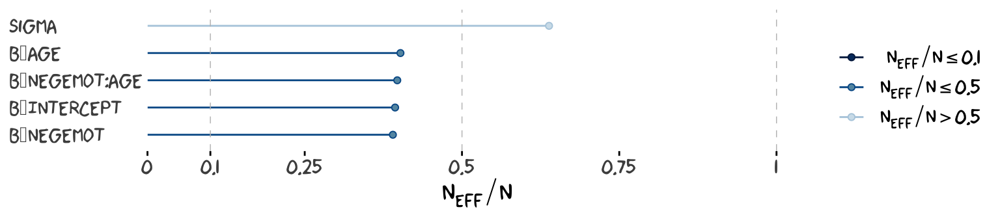
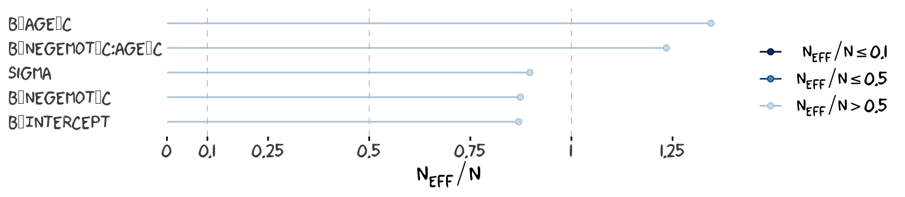
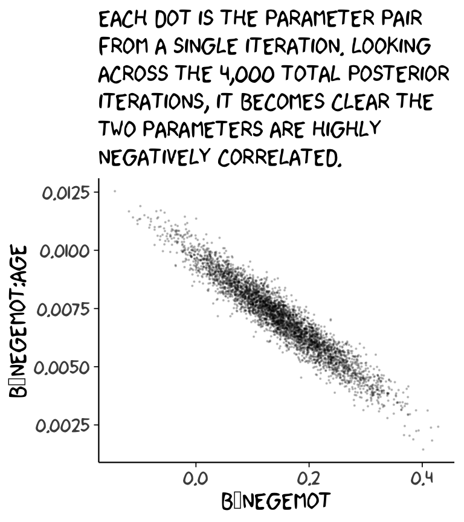
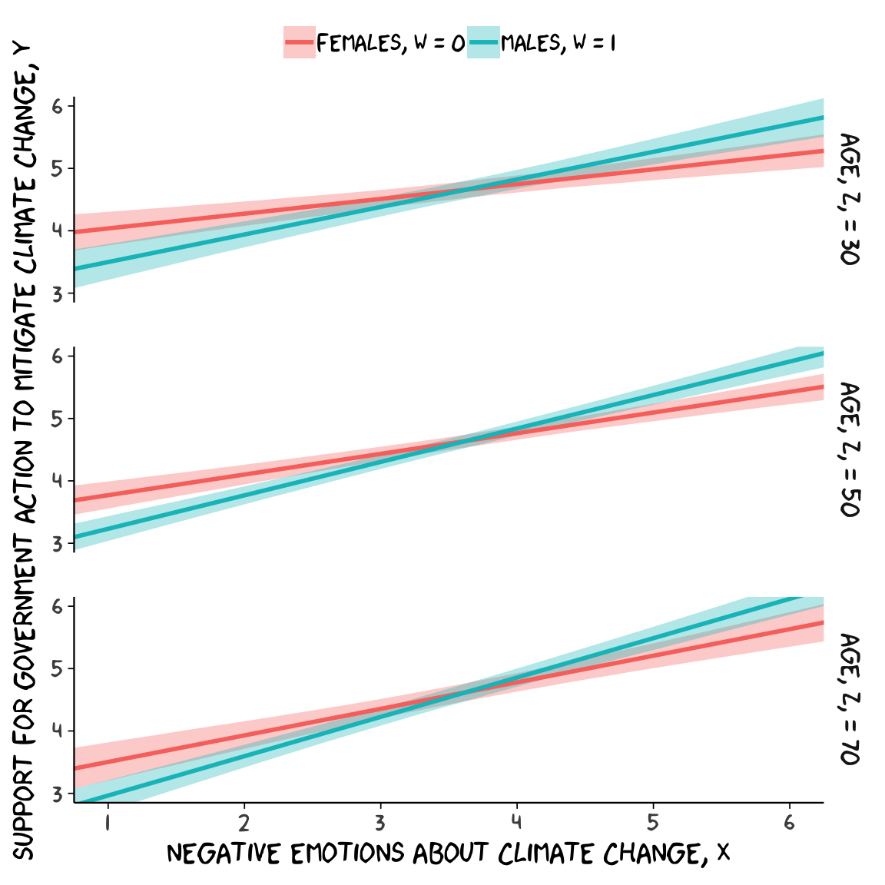
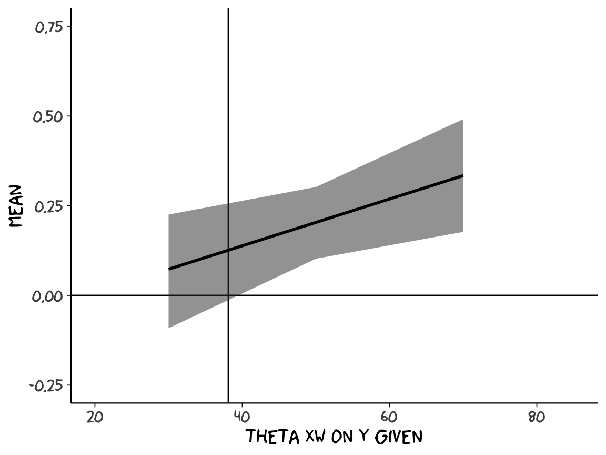
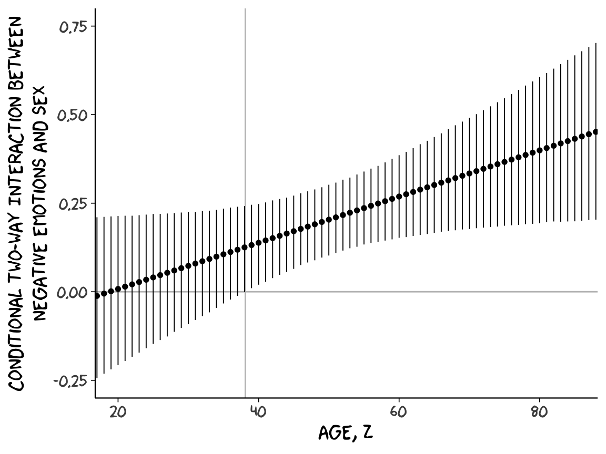

# Some Myths and Additional Extensions of Moderation Analysis


## Truths and myths about mean-centering

Here we load a couple necessary packages, load the data, and take a `glimpse()`.


```r
library(tidyverse)

glbwarm <- read_csv("data/glbwarm/glbwarm.csv")

glimpse(glbwarm)
#> Observations: 815
#> Variables: 7
#> $ govact   <dbl> 3.6, 5.0, 6.6, 1.0, 4.0, 7.0, 6.8, 5.6, 6.0, 2.6, 1.4, 5.6, 7.0, 3.8, 3.4, 4.2, 1.0...
#> $ posemot  <dbl> 3.67, 2.00, 2.33, 5.00, 2.33, 1.00, 2.33, 4.00, 5.00, 5.00, 1.00, 4.00, 1.00, 5.67,...
#> $ negemot  <dbl> 4.67, 2.33, 3.67, 5.00, 1.67, 6.00, 4.00, 5.33, 6.00, 2.00, 1.00, 4.00, 5.00, 4.67,...
#> $ ideology <int> 6, 2, 1, 1, 4, 3, 4, 5, 4, 7, 6, 4, 2, 4, 5, 2, 6, 4, 2, 4, 4, 2, 6, 4, 4, 3, 4, 5,...
#> $ age      <int> 61, 55, 85, 59, 22, 34, 47, 65, 50, 60, 71, 60, 71, 59, 32, 36, 69, 70, 41, 48, 38,...
#> $ sex      <int> 0, 0, 1, 0, 1, 0, 1, 1, 1, 1, 1, 0, 1, 0, 1, 1, 1, 0, 0, 0, 0, 1, 1, 1, 1, 1, 1, 0,...
#> $ partyid  <int> 2, 1, 1, 1, 1, 2, 1, 1, 2, 3, 2, 1, 1, 1, 1, 1, 2, 3, 1, 3, 2, 1, 3, 2, 1, 1, 1, 3,...
```

Before we fit our models, we'll go ahead and make our mean-centered predictors, `negemot_c` and `age_c`.


```r
glbwarm <-
  glbwarm %>% 
  mutate(negemot_c = negemot - mean(negemot),
         age_c = age - mean(age))
```

Now we're ready to fit Models 1 and 2. But before we do, it's worth repeating part of the text:

>Mean-centering has been recommended in a few highly regarded books on regression analysis (e.g., [Aiken & West, 1991](https://books.google.com/books/about/Multiple_Regression.html?id=LcWLUyXcmnkC); [Cohen et al., 2003](https://books.google.com/books/about/Applied_Multiple_Regression_Correlation.html?id=fAnSOgbdFXIC)), and several explanations have been offered for why mean-centering should be undertaken prior to computation of the product and model estimation. The explanation that seems to have resulted in the most misunderstanding is that $X$ and $W$ are likely to be highly correlated with $XW$ and this will produce estimation problems caused by collinearity and result in poor or "strange" estimates of regression coefficients, large standard errors, and reduced power of the statistical test of the interaction. But his is, in large part, simply a myth. (p. 304)

Let's load brms.


```r
library(brms)
```

As we'll see in just a bit, there are some important reasons for Bayesians using HMC to mean center that wouldn't pop up within the OLS paradigm. First let's fit `model1` and `model2`.


```r
model1 <- 
  brm(data = glbwarm, family = gaussian,
      govact ~ 1 + negemot + age + negemot:age,
      chains = 4, cores = 4)

model2 <- 
  update(model1, newdata = glbwarm,
         govact ~ 1 + negemot_c + age_c + negemot_c:age_c,
         chains = 4, cores = 4)
```

As with Hayes's OLS models, our HMC models yield the same Bayesian $R^2$ distributions, within simulation error.


```r
bayes_R2(model1) %>% round(digits = 3)
#>    Estimate Est.Error Q2.5 Q97.5
#> R2    0.354     0.021 0.31 0.393
bayes_R2(model2) %>% round(digits = 3)
#>    Estimate Est.Error  Q2.5 Q97.5
#> R2    0.353     0.022 0.308 0.394
```

Our model summaries also correspond nicely with those in Table 9.1.


```r
print(model1, digits = 3)
#>  Family: gaussian 
#>   Links: mu = identity; sigma = identity 
#> Formula: govact ~ 1 + negemot + age + negemot:age 
#>    Data: glbwarm (Number of observations: 815) 
#> Samples: 4 chains, each with iter = 2000; warmup = 1000; thin = 1;
#>          total post-warmup samples = 4000
#> 
#> Population-Level Effects: 
#>             Estimate Est.Error l-95% CI u-95% CI Eff.Sample  Rhat
#> Intercept      4.325     0.333    3.681    4.962       1535 1.007
#> negemot        0.149     0.085   -0.017    0.321       1504 1.006
#> age           -0.030     0.006   -0.042   -0.018       1511 1.006
#> negemot:age    0.007     0.002    0.004    0.010       1513 1.006
#> 
#> Family Specific Parameters: 
#>       Estimate Est.Error l-95% CI u-95% CI Eff.Sample  Rhat
#> sigma    1.097     0.028    1.042    1.153       2272 1.002
#> 
#> Samples were drawn using sampling(NUTS). For each parameter, Eff.Sample 
#> is a crude measure of effective sample size, and Rhat is the potential 
#> scale reduction factor on split chains (at convergence, Rhat = 1).
print(model2, digits = 3)
#>  Family: gaussian 
#>   Links: mu = identity; sigma = identity 
#> Formula: govact ~ negemot_c + age_c + negemot_c:age_c 
#>    Data: glbwarm (Number of observations: 815) 
#> Samples: 4 chains, each with iter = 2000; warmup = 1000; thin = 1;
#>          total post-warmup samples = 4000
#> 
#> Population-Level Effects: 
#>                 Estimate Est.Error l-95% CI u-95% CI Eff.Sample  Rhat
#> Intercept          4.597     0.039    4.522    4.672       3628 1.000
#> negemot_c          0.500     0.025    0.450    0.549       3603 1.000
#> age_c             -0.005     0.002   -0.010   -0.001       4000 1.000
#> negemot_c:age_c    0.007     0.002    0.004    0.010       4000 1.000
#> 
#> Family Specific Parameters: 
#>       Estimate Est.Error l-95% CI u-95% CI Eff.Sample  Rhat
#> sigma    1.097     0.028    1.046    1.152       2918 1.002
#> 
#> Samples were drawn using sampling(NUTS). For each parameter, Eff.Sample 
#> is a crude measure of effective sample size, and Rhat is the potential 
#> scale reduction factor on split chains (at convergence, Rhat = 1).
```

However, notice the 'Eff.Sample' columns. The values for `model2` were substantially larger than those for `model1`. 'Eff.Sample' is Bürkner's term for the number of effective samples. Recall that because we've been using brms defaults, we have 4 HMC chains, each of which contains 2000 draws (iterations), the first 1000 of which are warmup values. After we discard the warmup values, that leaves 1000 draws from each chain--4000 total. As it turns out, Markov chains, and thus HMC chains, are typically *autocorrelated*, which means that each draw is partially dependent on the previous draw. Ideally, the autocorrelations are near zero. That's often not the case. 

The [bayesplot package](https://github.com/stan-dev/bayesplot) offers a variety of [diagnostic plots](https://cran.r-project.org/web/packages/bayesplot/vignettes/visual-mcmc-diagnostics.html#effective-sample-size). Here we'll use the `mcmc_acf()` function to make autocorrelation plots for all model parameters. Note that when we add `add_chain = T` to `brms::posterior_samples()`, we add an index to the data that allows us to keep track of which iteration comes from which chain. That index will come in handy for our `mcmc_acf()` plots.

But before we get there, we'll be using an [xkcd](https://xkcd.com)-inspired theme with help from the [xkcd package](https://cran.r-project.org/web/packages/xkcd/index.html) for our plots in this chapter.


```r
# install.packages("xkcd", dependencies = T)

library(xkcd)
```

If you haven't used the xkcd package, before, you might also need to take a few extra steps outlined [here](https://cran.r-project.org/web/packages/xkcd/vignettes/xkcd-intro.pdf), part of which requires help from the [extrafont package](https://cran.r-project.org/web/packages/extrafont/README.html),


```r
library(extrafont)

download.file("http://simonsoftware.se/other/xkcd.ttf",
              dest = "xkcd.ttf", mode = "wb")
 
system("mkdir ~/.fonts")
system("cp xkcd.ttf  ~/.fonts")
# This line of code returned an error message
# font_import(pattern = "[X/x]kcd", prompt = FALSE)

# This line from (https://stackoverflow.com/questions/49221040/error-in-font-import-while-installing-xkcd-font) fixed the problem
font_import(path = "~/.fonts", pattern = "[X/x]kcd", prompt=FALSE)
fonts()
fonttable()
 if(.Platform$OS.type != "unix") {
   ## Register fonts for Windows bitmap output
   loadfonts(device="win")
 } else {
   loadfonts()
 }
```


After installing, I still experienced error messages, which were alleviated after I followed [these steps outlined by Remi.b](https://stackoverflow.com/questions/48553545/polygon-edge-not-found-with-the-xkcd-package). You may or may not need them.

But anyways, here are our `mcmc_acf()` plots.


```r
library(bayesplot)

post1 <- posterior_samples(model1, add_chain = T)
mcmc_acf(post1, 
         pars = c("b_Intercept", "b_negemot", "b_age", "b_negemot:age", "sigma"),
         lags = 4) +
  theme_xkcd()
```


```r

post2 <- posterior_samples(model2, add_chain = T)
mcmc_acf(post2, 
         pars = c("b_Intercept", "b_negemot_c", "b_age_c", "b_negemot_c:age_c", "sigma"),
         lags = 4) +
  theme_xkcd() 
```


As it turns out, `theme_xkcd()` can't handle special characters like "_", so it returns rectangles instead. So it goes...

But again, high autocorrelations in the HMC chains have consequences for the effective sample size. In the [Visual MCMC diagnostics using the bayesplot package](https://cran.r-project.org/web/packages/bayesplot/vignettes/visual-mcmc-diagnostics.html#effective-sample-size) vignette, Gabry wrote:

>The effective sample size is an estimate of the number of independent draws from the posterior distribution of the estimand of interest. Because the draws within a Markov chain are *not* independent if there is autocorrelation, the effective sample size, $n_{eff}$, will be smaller than the total sample size, $N$. The larger the ratio of $n_{eff}$ to $N$ the better.

The 'Eff.Sample' values were all close to 4000 with `model2` and the autocorrelations were very low, too. The reverse was true for `model1`. The upshot is that even though we have 4000 samples for each parameter, those samples don't necessarily give us the same quality of information fully independent samples would. 'Eff.Sample' helps you determine how concerned you should be. And, as it turns out, things like centering can help increase a models 'Eff.Sample' values.

Wading in further, we can use the `neff_ratio()` function to collect the $n_{eff}$ to $N$ ratio for each model parameter and then use `mcmc_neff()` to make a visual diagnostic. Here we do so for `model1` and `model2`.


```r
ratios_model1 <- 
  neff_ratio(model1, 
             pars = c("b_Intercept", "b_negemot", "b_age", "b_negemot:age", "sigma"))
ratios_model2 <- 
  neff_ratio(model2,
             pars = c("b_Intercept", "b_negemot_c", "b_age_c", "b_negemot_c:age_c", "sigma"))

mcmc_neff(ratios_model1) + 
  yaxis_text(hjust = 0) +
  theme_xkcd()
```


```r

mcmc_neff(ratios_model2) + 
  yaxis_text(hjust = 0) +
  theme_xkcd()
```


Although none of the $n_{eff}$ to $N$ ratios were in the shockingly-low range for either model, there were substantially closer to 1 for `model2`.

In addition to autocorrelations and $n_{eff}$ to $N$ ratios, there is also the issue that the parameters in the model can themselves be correlated. If you like a visual approach, you can use `brms::pairs()` to retrieve histograms for each parameter along with scatter plots showing the shape of their correlations. Here we'll use the `off_diag_args` argument to customize some of the plot settings.


```r
pairs(model1,
      off_diag_args = list(size = 1/10,
                           alpha = 1/5))
```



```r

pairs(model2,
      off_diag_args = list(size = 1/10,
                           alpha = 1/5))
```



When fitting models with HMC, centering can make a difference for the parameter correlations. If you prefer a more numeric approach, `vcov()` will yield the variance/covariance matrix--or correlation matrix when using `correlation = T`--for the parameters in a model.


```r
vcov(model1, correlation = T) %>% round(digits = 2)
#>             Intercept negemot   age negemot:age
#> Intercept        1.00   -0.93 -0.96        0.88
#> negemot         -0.93    1.00  0.89       -0.96
#> age             -0.96    0.89  1.00       -0.93
#> negemot:age      0.88   -0.96 -0.93        1.00
vcov(model2, correlation = T) %>% round(digits = 2)
#>                 Intercept negemot_c age_c negemot_c:age_c
#> Intercept            1.00     -0.03  0.03            0.05
#> negemot_c           -0.03      1.00  0.05           -0.09
#> age_c                0.03      0.05  1.00            0.01
#> negemot_c:age_c      0.05     -0.09  0.01            1.00
```

*And so wait, what does that even mean for a parameter to correlate with another parameter?* you might ask. Fair enough. Let's compute a correlation step by step. First, `posterior_samples()`:


```r
post <- posterior_samples(model1)

head(post)
#>   b_Intercept b_negemot   b_age b_negemot:age sigma  lp__
#> 1        3.90     0.267 -0.0266       0.00602  1.13 -1239
#> 2        4.23     0.199 -0.0317       0.00708  1.08 -1237
#> 3        3.86     0.256 -0.0197       0.00453  1.07 -1237
#> 4        3.97     0.248 -0.0236       0.00514  1.07 -1236
#> 5        3.95     0.239 -0.0224       0.00514  1.06 -1236
#> 6        4.07     0.228 -0.0257       0.00575  1.14 -1237
```

Now we've put our posterior iterations into a data object, `post`, we can make a scatter plot of two parameters. Here we'll choose `b_negemot` and the interaction coefficient, `b_negemot:age`.


```r
post %>% 
  ggplot(aes(x = b_negemot, y = `b_negemot:age`)) +
  geom_point(size = 1/10, alpha = 1/5) +
  labs(subtitle = "Each dot is the parameter pair\nfrom a single iteration. Looking\nacross the 4,000 total posterior\niterations, it becomes clear the\ntwo parameters are highly\nnegatively correlated.") +
  theme_xkcd()
```



And indeed, the Pearson's correlation is:


```r
cor(post$b_negemot, post$`b_negemot:age`)
#> [1] -0.955
```

And what was that part from the `vcov()` output, again?


```r
vcov(model1, correlation = T)["negemot", "negemot:age"]
#> [1] -0.955
```

Boom! That's where the correlations come from.

This entire topic of HMC diagnostics can seem baffling, especially when compared to the simplicity of OLS. If this is your first introduction, you might want to watch lectures [10](https://www.youtube.com/watch?v=BWEtS3HuU5A&list=PLDcUM9US4XdM9_N6XUUFrhghGJ4K25bFc) and [11](https://www.youtube.com/watch?v=13mEekRdOcQ&list=PLDcUM9US4XdM9_N6XUUFrhghGJ4K25bFc) from McElreath's [Statistical Rethinking Fall 2017 lecture series](https://www.youtube.com/playlist?list=PLDcUM9US4XdM9_N6XUUFrhghGJ4K25bFc). Accordingly, you might check out chapter 8 of his [*Statistical Rethinking* text](https://xcelab.net/rm/statistical-rethinking/) and [my project explaining how to reproduce the analyses in that chapter in brms](https://github.com/ASKurz/Statistical_Rethinking_with_brms_ggplot2_and_the_tidyverse/blob/master/Ch._08_Markov_Chain_Monte_Carlo.md).

### The effect of mean-centering on multicollinearity and the standard error of $b_{3}$.

This can be difficult to keep track of, but what we just looked at were the correlations among **model parameters**. These are *not* the same as correlations among **variables**. As such, those correlations are not the same as those in Table 9.2. But we can get those, too. First we'll have to do a little more data processing to get all the necessary mean-centered variables and standardized variables.


```r
glbwarm <-
  glbwarm %>% 
  mutate(negemot_x_age     = negemot*age,
         negemot_c_x_age_c = negemot_c*age_c,
         negemot_z         = (negemot - mean(negemot))/sd(negemot),
         age_z             = (age     - mean(age)    )/sd(age)) %>% 
  mutate(negemot_z_x_age_z = negemot_z*age_z)
```

And recall that to get our sweet Bayesian correlations, we use the multivariate `cbind()` syntax to fit an intercepts-only model. Here we do that for all three of the Table 9.2 sections.


```r
correlations1 <- 
  brm(data = glbwarm, family = gaussian,
      cbind(negemot, age, negemot_x_age) ~ 1,
      chains = 4, cores = 4)

correlations2 <- 
  brm(data = glbwarm, family = gaussian,
      cbind(negemot_c, age_c, negemot_c_x_age_c) ~ 1,
      chains = 4, cores = 4)

correlations3 <- 
  brm(data = glbwarm, family = gaussian,
      cbind(negemot_z, age_z, negemot_z_x_age_z) ~ 1,
      chains = 4, cores = 4)
```

Their summaries:


```r
print(correlations1, digits = 3)
#>  Family: MV(gaussian, gaussian, gaussian) 
#>   Links: mu = identity; sigma = identity
#>          mu = identity; sigma = identity
#>          mu = identity; sigma = identity 
#> Formula: negemot ~ 1 
#>          age ~ 1 
#>          negemot_x_age ~ 1 
#>    Data: glbwarm (Number of observations: 815) 
#> Samples: 4 chains, each with iter = 2000; warmup = 1000; thin = 1;
#>          total post-warmup samples = 4000
#> 
#> Population-Level Effects: 
#>                       Estimate Est.Error l-95% CI u-95% CI Eff.Sample  Rhat
#> negemot_Intercept        3.556     0.051    3.455    3.657       3301 1.000
#> age_Intercept           49.541     0.586   48.405   50.709       3610 1.002
#> negemotxage_Intercept  174.758     3.361  168.213  181.396       2871 1.001
#> 
#> Family Specific Parameters: 
#>                             Estimate Est.Error l-95% CI u-95% CI Eff.Sample  Rhat
#> sigma_negemot                  1.531     0.038    1.459    1.607       2662 1.000
#> sigma_age                     16.362     0.402   15.605   17.174       3120 1.000
#> sigma_negemotxage             97.525     2.419   92.870  102.556       2257 1.001
#> rescor(negemot,age)           -0.058     0.036   -0.127    0.012       2914 1.000
#> rescor(negemot,negemotxage)    0.766     0.015    0.736    0.793       2155 1.000
#> rescor(age,negemotxage)        0.547     0.025    0.497    0.594       4000 1.000
#> 
#> Samples were drawn using sampling(NUTS). For each parameter, Eff.Sample 
#> is a crude measure of effective sample size, and Rhat is the potential 
#> scale reduction factor on split chains (at convergence, Rhat = 1).
print(correlations2, digits = 3)
#>  Family: MV(gaussian, gaussian, gaussian) 
#>   Links: mu = identity; sigma = identity
#>          mu = identity; sigma = identity
#>          mu = identity; sigma = identity 
#> Formula: negemot_c ~ 1 
#>          age_c ~ 1 
#>          negemot_c_x_age_c ~ 1 
#>    Data: glbwarm (Number of observations: 815) 
#> Samples: 4 chains, each with iter = 2000; warmup = 1000; thin = 1;
#>          total post-warmup samples = 4000
#> 
#> Population-Level Effects: 
#>                         Estimate Est.Error l-95% CI u-95% CI Eff.Sample  Rhat
#> negemotc_Intercept         0.000     0.054   -0.108    0.108       4000 1.000
#> agec_Intercept            -0.002     0.569   -1.146    1.094       4000 1.000
#> negemotcxagec_Intercept   -1.425     0.835   -3.059    0.172       4000 0.999
#> 
#> Family Specific Parameters: 
#>                                Estimate Est.Error l-95% CI u-95% CI Eff.Sample  Rhat
#> sigma_negemotc                    1.533     0.040    1.456    1.614       4000 1.000
#> sigma_agec                       16.364     0.408   15.594   17.182       4000 0.999
#> sigma_negemotcxagec              24.233     0.592   23.121   25.426       4000 0.999
#> rescor(negemotc,agec)            -0.057     0.035   -0.126    0.012       4000 0.999
#> rescor(negemotc,negemotcxagec)    0.092     0.034    0.024    0.157       4000 1.000
#> rescor(agec,negemotcxagec)       -0.015     0.035   -0.084    0.053       4000 1.000
#> 
#> Samples were drawn using sampling(NUTS). For each parameter, Eff.Sample 
#> is a crude measure of effective sample size, and Rhat is the potential 
#> scale reduction factor on split chains (at convergence, Rhat = 1).
print(correlations3, digits = 3)
#>  Family: MV(gaussian, gaussian, gaussian) 
#>   Links: mu = identity; sigma = identity
#>          mu = identity; sigma = identity
#>          mu = identity; sigma = identity 
#> Formula: negemot_z ~ 1 
#>          age_z ~ 1 
#>          negemot_z_x_age_z ~ 1 
#>    Data: glbwarm (Number of observations: 815) 
#> Samples: 4 chains, each with iter = 2000; warmup = 1000; thin = 1;
#>          total post-warmup samples = 4000
#> 
#> Population-Level Effects: 
#>                         Estimate Est.Error l-95% CI u-95% CI Eff.Sample  Rhat
#> negemotz_Intercept         0.000     0.034   -0.066    0.068       4000 0.999
#> agez_Intercept            -0.000     0.035   -0.068    0.068       4000 0.999
#> negemotzxagez_Intercept   -0.057     0.034   -0.124    0.010       4000 0.999
#> 
#> Family Specific Parameters: 
#>                                Estimate Est.Error l-95% CI u-95% CI Eff.Sample  Rhat
#> sigma_negemotz                    1.003     0.025    0.956    1.053       4000 1.000
#> sigma_agez                        1.003     0.025    0.956    1.053       4000 0.999
#> sigma_negemotzxagez               0.971     0.023    0.928    1.017       4000 1.000
#> rescor(negemotz,agez)            -0.056     0.035   -0.126    0.013       4000 0.999
#> rescor(negemotz,negemotzxagez)    0.092     0.035    0.022    0.161       4000 0.999
#> rescor(agez,negemotzxagez)       -0.014     0.035   -0.083    0.053       4000 1.000
#> 
#> Samples were drawn using sampling(NUTS). For each parameter, Eff.Sample 
#> is a crude measure of effective sample size, and Rhat is the potential 
#> scale reduction factor on split chains (at convergence, Rhat = 1).
```

A more condensed way to get that information might be with the `VarCorr()` function. Just make sure to tack `$residual__$cor` onto the end.


```r
VarCorr(correlations1)$residual__$cor %>% 
  round(digits = 3)
#> , , negemot
#> 
#>             Estimate Est.Error   Q2.5 Q97.5
#> negemot        1.000     0.000  1.000 1.000
#> age           -0.058     0.036 -0.127 0.012
#> negemotxage    0.766     0.015  0.736 0.793
#> 
#> , , age
#> 
#>             Estimate Est.Error   Q2.5 Q97.5
#> negemot       -0.058     0.036 -0.127 0.012
#> age            1.000     0.000  1.000 1.000
#> negemotxage    0.547     0.025  0.497 0.594
#> 
#> , , negemotxage
#> 
#>             Estimate Est.Error  Q2.5 Q97.5
#> negemot        0.766     0.015 0.736 0.793
#> age            0.547     0.025 0.497 0.594
#> negemotxage    1.000     0.000 1.000 1.000
```

For the sake of space, I'll let you check that out for `correlations2` and `correlations3`. If you're tricky with your `VarCorr()` indexing, you can also get the model-implied variances.


```r
VarCorr(correlations1)$residual__$cov[1, , "negemot"] %>% round(digits = 3)
#>  Estimate Est.Error      Q2.5     Q97.5 
#>     2.346     0.116     2.128     2.584
VarCorr(correlations1)$residual__$cov[2, , "age"] %>% round(digits = 3)
#>  Estimate Est.Error      Q2.5     Q97.5 
#>     267.9      13.2     243.5     294.9
VarCorr(correlations1)$residual__$cov[3, , "negemotxage"] %>% round(digits = 3)
#>  Estimate Est.Error      Q2.5     Q97.5 
#>      9517       473      8625     10518
```

And if you're like totally lost with all this indexing, you might code `VarCorr(correlations1) %>% str()` and spend a little time looking at what `VarCorr()` produces.

On page 309, Hayes explained why the OLS variance for $b_{3}$ is unaffected by mean centering. The story was similar for our HMC model, too:


```r
fixef(model1)["negemot:age", "Est.Error"]
#> [1] 0.00159
fixef(model2)["negemot_c:age_c", "Est.Error"]
#> [1] 0.00162
```

For more details, you might also see the [28.11. Standardizing Predictors and Outputs subsection of the Stan Modeling Language User’s Guide and Reference Manual, 2.17.0](http://mc-stan.org/users/documentation/)--[Stan](http://mc-stan.org), of course, being the computational engine underneath our brms hood.

### The effect of mean-centering on $b_{1}$, $b_{2}$, and their ~~standard errors~~ posterior $SD$s.

If you only care about posterior means, you can reproduce the results at the bottom of page 310 like:


```r
fixef(model1)["negemot", 1] + 
  fixef(model1)["negemot:age", 1]*mean(glbwarm$age)
#> [1] 0.501
```

But we're proper Bayesians and like a summary of the spread in the posterior. So we'll evoke `posterior_samples()` and the other usual steps.


```r
post <- posterior_samples(model1)

post %>% 
  transmute(our_contidional_effect_given_W_bar = b_negemot + `b_negemot:age`*mean(glbwarm$age)) %>%
  summarize(mean = mean(our_contidional_effect_given_W_bar),
            sd = sd(our_contidional_effect_given_W_bar)) %>% 
  round(digits = 3)
#>    mean    sd
#> 1 0.501 0.025
```

And note how the standard error Hayes computed at the top of page 311 corresponds nicely with the posterior $SD$ we just computed. Hayes employed a fancy formula; we just used `sd()`.

### The ~~centering option in PROCESS~~.

I'm not aware of a similar function in brms. You'll have to use your data wrangling skills.

## The estimation and interpretation of standardized regression coefficients in a moderation analysis

### Variant 1.

We've already computed standardized predictors. Now we just need to standardize the criterion, `govact`.


```r
glbwarm <-
  glbwarm %>% 
  mutate(govact_z = (govact - mean(govact))/sd(govact))
```

Fit:


```r
model3 <- 
  update(model1, newdata = glbwarm,
         govact_z ~ 1 + negemot_z + age_z + negemot_z:age_z,
         chains = 4, cores = 4)
```


```r
bayes_R2(model3) %>% round(digits = 3)
#>    Estimate Est.Error  Q2.5 Q97.5
#> R2    0.354     0.021 0.311 0.395
```


```r
print(model3, digits = 3)
#>  Family: gaussian 
#>   Links: mu = identity; sigma = identity 
#> Formula: govact_z ~ negemot_z + age_z + negemot_z:age_z 
#>    Data: glbwarm (Number of observations: 815) 
#> Samples: 4 chains, each with iter = 2000; warmup = 1000; thin = 1;
#>          total post-warmup samples = 4000
#> 
#> Population-Level Effects: 
#>                 Estimate Est.Error l-95% CI u-95% CI Eff.Sample  Rhat
#> Intercept          0.008     0.028   -0.046    0.061       4000 1.000
#> negemot_z          0.563     0.028    0.507    0.617       4000 0.999
#> age_z             -0.063     0.029   -0.119   -0.008       4000 1.000
#> negemot_z:age_z    0.130     0.029    0.073    0.188       4000 0.999
#> 
#> Family Specific Parameters: 
#>       Estimate Est.Error l-95% CI u-95% CI Eff.Sample  Rhat
#> sigma    0.806     0.020    0.768    0.847       4000 0.999
#> 
#> Samples were drawn using sampling(NUTS). For each parameter, Eff.Sample 
#> is a crude measure of effective sample size, and Rhat is the potential 
#> scale reduction factor on split chains (at convergence, Rhat = 1).
```

### Variant 2.

This time we need to standardize our interaction term, `negemot_x_age_z`, by hand.


```r
glbwarm <-
  glbwarm %>% 
  mutate(negemot_x_age_z = (negemot_x_age - mean(negemot_x_age))/sd(negemot_x_age))
```

Now we're ready to fit.


```r
model4 <- 
  update(model1, newdata = glbwarm,
         govact_z ~ 1 + negemot_z + age_z + negemot_x_age_z,
         chains = 4, cores = 4)
```


```r
bayes_R2(model4) %>% round(digits = 3)
#>    Estimate Est.Error Q2.5 Q97.5
#> R2    0.354     0.022 0.31 0.396
```


```r
print(model4, digits = 3)
#>  Family: gaussian 
#>   Links: mu = identity; sigma = identity 
#> Formula: govact_z ~ negemot_z + age_z + negemot_x_age_z 
#>    Data: glbwarm (Number of observations: 815) 
#> Samples: 4 chains, each with iter = 2000; warmup = 1000; thin = 1;
#>          total post-warmup samples = 4000
#> 
#> Population-Level Effects: 
#>                 Estimate Est.Error l-95% CI u-95% CI Eff.Sample  Rhat
#> Intercept         -0.000     0.028   -0.055    0.054       2814 1.002
#> negemot_z          0.169     0.094   -0.019    0.358       1377 1.002
#> age_z             -0.365     0.072   -0.509   -0.222       1397 1.003
#> negemot_x_age_z    0.506     0.113    0.284    0.728       1371 1.002
#> 
#> Family Specific Parameters: 
#>       Estimate Est.Error l-95% CI u-95% CI Eff.Sample  Rhat
#> sigma    0.806     0.020    0.768    0.848       2705 1.001
#> 
#> Samples were drawn using sampling(NUTS). For each parameter, Eff.Sample 
#> is a crude measure of effective sample size, and Rhat is the potential 
#> scale reduction factor on split chains (at convergence, Rhat = 1).
```

The results correspond nicely to those in Table 9.1. 

## A caution on manual centering and standardization

It's worthwhile considering the issue of listwise deletion when data are partially missing. The brms default is to delete rows with missingness, "NA" in R, for the predictors. However, [brms allows users to perform one-step Bayesian imputation for missing values using the `mi()` syntax](https://cran.r-project.org/web/packages/brms/vignettes/brms_missings.html). First we'll fit see what happens when you fit a model in brms when some of the `negemot_z` values are missing, but without using the `mi()` syntax. And of course before we do that, we'll make a `negemot_z_missing` variable, which is identical to `negemot_z`, but about 10% of the values are missing.


```r
set.seed(815)
glbwarm <-
  glbwarm %>% 
  mutate(missing = rbinom(n = 815, size = 1, prob = .1)) %>% 
  mutate(negemot_z_missing = ifelse(missing == 1, NA, negemot_z))
```

If you've never used `rbinom()` before, code `?rbinom` or look it up in your favorite web search engine. Here's our listwise deletion model, which corresponds to what you'd get from a typical OLS-based program.


```r
model5 <- 
  update(model3, newdata = glbwarm,
         govact_z ~ 1 + negemot_z_missing + age_z + negemot_z_missing:age_z,
         chains = 4, cores = 4)
```

Let's compare the listwise deletion results with the model based on all the data.


```r
print(model3)
#>  Family: gaussian 
#>   Links: mu = identity; sigma = identity 
#> Formula: govact_z ~ negemot_z + age_z + negemot_z:age_z 
#>    Data: glbwarm (Number of observations: 815) 
#> Samples: 4 chains, each with iter = 2000; warmup = 1000; thin = 1;
#>          total post-warmup samples = 4000
#> 
#> Population-Level Effects: 
#>                 Estimate Est.Error l-95% CI u-95% CI Eff.Sample Rhat
#> Intercept           0.01      0.03    -0.05     0.06       4000 1.00
#> negemot_z           0.56      0.03     0.51     0.62       4000 1.00
#> age_z              -0.06      0.03    -0.12    -0.01       4000 1.00
#> negemot_z:age_z     0.13      0.03     0.07     0.19       4000 1.00
#> 
#> Family Specific Parameters: 
#>       Estimate Est.Error l-95% CI u-95% CI Eff.Sample Rhat
#> sigma     0.81      0.02     0.77     0.85       4000 1.00
#> 
#> Samples were drawn using sampling(NUTS). For each parameter, Eff.Sample 
#> is a crude measure of effective sample size, and Rhat is the potential 
#> scale reduction factor on split chains (at convergence, Rhat = 1).
print(model5)
#>  Family: gaussian 
#>   Links: mu = identity; sigma = identity 
#> Formula: govact_z ~ negemot_z_missing + age_z + negemot_z_missing:age_z 
#>    Data: glbwarm (Number of observations: 719) 
#> Samples: 4 chains, each with iter = 2000; warmup = 1000; thin = 1;
#>          total post-warmup samples = 4000
#> 
#> Population-Level Effects: 
#>                         Estimate Est.Error l-95% CI u-95% CI Eff.Sample Rhat
#> Intercept                   0.00      0.03    -0.06     0.06       4000 1.00
#> negemot_z_missing           0.56      0.03     0.51     0.62       4000 1.00
#> age_z                      -0.05      0.03    -0.11     0.01       4000 1.00
#> negemot_z_missing:age_z     0.12      0.03     0.06     0.18       4000 1.00
#> 
#> Family Specific Parameters: 
#>       Estimate Est.Error l-95% CI u-95% CI Eff.Sample Rhat
#> sigma     0.81      0.02     0.77     0.86       4000 1.00
#> 
#> Samples were drawn using sampling(NUTS). For each parameter, Eff.Sample 
#> is a crude measure of effective sample size, and Rhat is the potential 
#> scale reduction factor on split chains (at convergence, Rhat = 1).
```

In this case, the model results were similar to those based on all the data because we used `rbinom()` to delete the predictor values completely at random. With real data and real-live missing data mechanisms, the situation isn't often so rosy. But anyway, the real story, here, is the `Data: glbwarm (Number of observations: n)` line at the top of the `print()` outputs. The number, $n$, was 815 in the model using all the data and 719 for the one based on listwise deletion. That's a lot of missing information.

The `mi()` syntax will allow us to use all the rows in a model, even if one or more of the predictors contain missing values. The syntax makes the model a multivariate model in that now we'll be modeling both `govact_z` *and* `negemot_z_missing`. There are multiple ways to write a [multivariate model in brms](https://cran.r-project.org/web/packages/brms/vignettes/brms_multivariate.html). One nice way is to write the model for each criterion separately in a `bf()` statement. You combine the `bf()` statements together with the `+` operator. And for models like the ones in Hayes's text, you'll also want to tack on `set_rescor(FALSE)`. You can do this within the `brm()` function, as usual. But I find that this clutters the code up more than I like. So another approach is to save the combination of `bf()` statements as an object.


```r
my_model <- 
  bf(govact_z  ~ 1 + mi(negemot_z_missing) + age_z + mi(negemot_z_missing):age_z) + 
  bf(negemot_z_missing | mi() ~ 1) + 
  set_rescor(FALSE)
```

With our multivariate formula saved as `my_model`, we're ready to plug it into `brm()` and fit.


```r
model6 <- 
  brm(data = glbwarm,
      family = gaussian,
      my_model,
      chains = 4, cores = 4)
```

Let's see what we've done.


```r
print(model6)
#>  Family: MV(gaussian, gaussian) 
#>   Links: mu = identity; sigma = identity
#>          mu = identity; sigma = identity 
#> Formula: govact_z ~ 1 + mi(negemot_z_missing) + age_z + mi(negemot_z_missing):age_z 
#>          negemot_z_missing | mi() ~ 1 
#>    Data: glbwarm (Number of observations: 815) 
#> Samples: 4 chains, each with iter = 2000; warmup = 1000; thin = 1;
#>          total post-warmup samples = 4000
#> 
#> Population-Level Effects: 
#>                                   Estimate Est.Error l-95% CI u-95% CI Eff.Sample Rhat
#> govactz_Intercept                     0.00      0.03    -0.05     0.06       4000 1.00
#> negemotzmissing_Intercept             0.00      0.04    -0.07     0.07       4000 1.00
#> govactz_age_z                        -0.07      0.03    -0.12    -0.01       4000 1.00
#> govactz_minegemot_z_missing           0.56      0.03     0.50     0.62       4000 1.00
#> govactz_minegemot_z_missing:age_z     0.13      0.03     0.07     0.19       4000 1.00
#> 
#> Family Specific Parameters: 
#>                       Estimate Est.Error l-95% CI u-95% CI Eff.Sample Rhat
#> sigma_govactz             0.81      0.02     0.77     0.85       4000 1.00
#> sigma_negemotzmissing     1.00      0.03     0.95     1.05       4000 1.00
#> 
#> Samples were drawn using sampling(NUTS). For each parameter, Eff.Sample 
#> is a crude measure of effective sample size, and Rhat is the potential 
#> scale reduction factor on split chains (at convergence, Rhat = 1).
```

When using the multivariate `mi()` syntax, your `print()` output becomes more complicated. Now we have a regression model for both `govact_z` and `negemot_z_missing`. At a minimum, each has its own intercept and residual variance (i.e., sigma). In the 'Population-Level Effects' section, the first part of the names for each regression coefficient clarifies which $Y$-variable it corresponds to (e.g., `govactz_Intercept` is the intercept for our primary $Y$-variable, `govact_z`). In the 'Family Specific Parameters' section, the sigmas are similarly labeled. 

Perhaps most importantly, we see "Data: glbwarm (Number of observations: 815)" at the top of the output. The multivariate `mi()` syntax used all the available data. No listwise deletion necessary.

The `print()` output for our model obscured some of the results. To clarify what the `mi()` syntax did, let's peek at the first columns returned by `posterior_samples()`.


```r
post <- posterior_samples(model6)

post[, 1:20] %>% 
  glimpse()
#> Observations: 4,000
#> Variables: 20
#> $ b_govactz_Intercept                     <dbl> 0.04989, 0.00791, -0.01523, -0.06286, -0.05566, 0.04...
#> $ b_negemotzmissing_Intercept             <dbl> 0.00996, 0.01728, 0.04135, -0.03303, -0.03438, 0.067...
#> $ b_govactz_age_z                         <dbl> -0.1068, -0.0486, -0.0882, -0.0837, -0.1047, -0.0329...
#> $ bsp_govactz_minegemot_z_missing         <dbl> 0.532, 0.556, 0.509, 0.515, 0.534, 0.560, 0.600, 0.5...
#> $ `bsp_govactz_minegemot_z_missing:age_z` <dbl> 0.1363, 0.0955, 0.1696, 0.1018, 0.1027, 0.1357, 0.07...
#> $ sigma_govactz                           <dbl> 0.818, 0.840, 0.785, 0.823, 0.835, 0.804, 0.812, 0.8...
#> $ sigma_negemotzmissing                   <dbl> 1.025, 1.004, 0.984, 1.031, 1.025, 0.969, 1.010, 1.0...
#> $ `Ymi_negemotzmissing[7]`                <dbl> -0.732, 2.007, 1.397, 1.716, 1.563, 0.284, 0.783, 1....
#> $ `Ymi_negemotzmissing[22]`               <dbl> 0.6030, -0.7665, 0.5277, 1.1402, 1.1237, -0.3344, 0....
#> $ `Ymi_negemotzmissing[31]`               <dbl> 0.29320, -2.25086, 0.11291, 0.31718, 0.64534, -0.735...
#> $ `Ymi_negemotzmissing[55]`               <dbl> 0.0732, 0.7305, 0.6328, 0.0807, -0.2962, -0.1087, -1...
#> $ `Ymi_negemotzmissing[60]`               <dbl> 0.7151, -0.2980, 2.9397, 2.0080, 2.0664, -0.9437, 1....
#> $ `Ymi_negemotzmissing[66]`               <dbl> -0.77131, -0.38676, 0.00424, 0.04842, 0.15883, -0.56...
#> $ `Ymi_negemotzmissing[72]`               <dbl> 0.2910, 0.6595, -0.3722, 0.8790, 1.3735, -0.6493, 1....
#> $ `Ymi_negemotzmissing[86]`               <dbl> 0.7676, 0.2360, 0.4749, -0.2269, 0.0454, -0.8055, 1....
#> $ `Ymi_negemotzmissing[87]`               <dbl> -0.9997, 0.7594, -1.6664, -0.1146, -0.4297, -0.9470,...
#> $ `Ymi_negemotzmissing[98]`               <dbl> -0.2878, -0.3807, 0.7597, -0.1947, -0.3714, 0.0536, ...
#> $ `Ymi_negemotzmissing[103]`              <dbl> 1.8292, 0.0277, 1.7674, 0.5286, 0.2319, 0.9420, 1.18...
#> $ `Ymi_negemotzmissing[107]`              <dbl> 0.7279, -2.7320, 0.0811, -2.2104, -1.7479, 0.6883, -...
#> $ `Ymi_negemotzmissing[131]`              <dbl> -1.2702, -1.0011, -0.5789, -0.9845, -1.4775, 0.3450,...
```

Columns `b_govactz_Intercept` through `sigma_negemotzmissing` were business as usual. But notice all the `Ymi_negemotzmissing[i]` columns. In each of these we see 4,000 posterior draws for the missing `negemot_z_missing` values. The `[i]` part of the column names indexes which row number the iterations correspond to. Since we made a lot of missing values in the data, I won't go through them all. But we can focus on a few to get a sense of the results.


```r
post %>% 
  select(`Ymi_negemotzmissing[7]`:`Ymi_negemotzmissing[131]`) %>% 
  gather(row, value) %>% 
  group_by(row) %>% 
  # Yep, that's right, we're summarizing as usual
  summarize(mean = mean(value),
            sd = sd(value),
            ll = quantile(value, probs = .025),
            ul = quantile(value, probs = .975)) %>% 
  mutate_if(is.double, round, digits = 2) %>%
  mutate(row = str_extract(row, "\\d+") %>% as.integer())  # this line just makes the row names easier to read
#> # A tibble: 13 x 5
#>     row   mean    sd    ll    ul
#>   <int>  <dbl> <dbl> <dbl> <dbl>
#> 1   103  0.65   0.83 -0.93  2.32
#> 2   107 -0.580  0.77 -2.07  0.9 
#> 3   131 -0.48   0.74 -1.88  1   
#> 4    22  0.38   0.79 -1.11  1.95
#> 5    31 -0.13   0.76 -1.62  1.34
#> 6    55 -0.26   0.83 -1.9   1.38
#> # ... with 7 more rows
```

In conventional mean-imputation, you just plug the sample mean into the missing value slot (which is a sin against data; don't do this). With multiple imputation, you create a small number of alternative data sets, typically 5, into which you impute plausible values into the missing value slots. With one-step Bayesian imputation using the `mi()` syntax, you get an entire posterior distribution for each missing value. And if you have variables in the data set that might help predict what those missing values are, you’d just plug that into the model. For more on the topic, see Bürkner’s [vignette](https://cran.r-project.org/web/packages/brms/vignettes/brms_missings.html), McElreath’s [lecture on the topic](https://www.youtube.com/watch?v=Yi0EqAu043A), or my [effort to translate the chapter 14 code in McElreath’s text into brms](https://github.com/ASKurz/Statistical_Rethinking_with_brms_ggplot2_and_the_tidyverse/blob/master/Ch._14_Missing_Data_and_Other_Opportunities.md).

The take home message is there is no need to ignore missing data or use outdated procedures like listwise deletion. Be a champion and model your missing data with brms.

## More than one moderator

None of this is a problem for brms. But instead of using the `model=i` syntax in Hayes's PROCESS, you just have to specify your model formula in `brm()`.

### Additive multiple moderation.

It's trivial to add `sex`, its interaction with `negemot`, and the two covariates (i.e., `posemot` and `ideology`) to the model. We can even do it within `update()`.


```r
model7 <- 
  update(model1, newdata = glbwarm,
         govact ~ 1 + negemot + sex + age + posemot + ideology + negemot:sex + negemot:age,
         chains = 4, cores = 4)
```

Our output matches nicely with the formula at the bottom of page 232 and the PROCESS output in Figure 9.2. 


```r
print(model7, digits = 3)
#>  Family: gaussian 
#>   Links: mu = identity; sigma = identity 
#> Formula: govact ~ negemot + sex + age + posemot + ideology + negemot:sex + negemot:age 
#>    Data: glbwarm (Number of observations: 815) 
#> Samples: 4 chains, each with iter = 2000; warmup = 1000; thin = 1;
#>          total post-warmup samples = 4000
#> 
#> Population-Level Effects: 
#>             Estimate Est.Error l-95% CI u-95% CI Eff.Sample  Rhat
#> Intercept      5.261     0.334    4.597    5.909       2354 1.000
#> negemot        0.095     0.080   -0.057    0.258       2207 1.001
#> sex           -0.744     0.196   -1.121   -0.365       2267 1.002
#> age           -0.018     0.006   -0.030   -0.006       2111 1.002
#> posemot       -0.025     0.028   -0.078    0.031       4000 1.001
#> ideology      -0.206     0.026   -0.258   -0.155       3548 1.000
#> negemot:sex    0.205     0.051    0.109    0.304       2301 1.002
#> negemot:age    0.005     0.002    0.002    0.008       2190 1.002
#> 
#> Family Specific Parameters: 
#>       Estimate Est.Error l-95% CI u-95% CI Eff.Sample  Rhat
#> sigma    1.048     0.026    0.997    1.101       3640 1.001
#> 
#> Samples were drawn using sampling(NUTS). For each parameter, Eff.Sample 
#> is a crude measure of effective sample size, and Rhat is the potential 
#> scale reduction factor on split chains (at convergence, Rhat = 1).
```

On page 325, Hayes discussed the unique variance each of the two moderation terms accounted for after controlling for the other covariates. In order to get our Bayesian version of these, we'll have to fit two additional models, one after removing each of the interaction terms.


```r
model8 <- 
  update(model7, newdata = glbwarm,
         govact ~ 1 + negemot + sex + age + posemot + ideology + negemot:sex,
         chains = 4, cores = 4)

model9 <- 
  update(model7, newdata = glbwarm,
         govact ~ 1 + negemot + sex + age + posemot + ideology + negemot:age,
         chains = 4, cores = 4)
```

Here we'll extract the `bayes_R2()` iterations for each of the three models, place them all in a single tibble, and then do a little arithmetic to get the difference scores. After all that data wrangling, we'll `summarize()` as usual.


```r
r2_without_age_interaction <- bayes_R2(model8, summary = F) %>% as_tibble()
r2_without_sex_interaction <- bayes_R2(model9, summary = F) %>% as_tibble()
r2_with_both_interactions  <- bayes_R2(model7, summary = F) %>% as_tibble()

r2s <-
  tibble(r2_without_age_interaction = r2_without_age_interaction$R2,
         r2_without_sex_interaction = r2_without_sex_interaction$R2,
         r2_with_both_interactions  = r2_with_both_interactions$R2) %>% 
  mutate(`delta R2 due to age interaction` = r2_with_both_interactions - r2_without_age_interaction,
         `delta R2 due to sex interaction` = r2_with_both_interactions - r2_without_sex_interaction)

r2s %>% 
  select(`delta R2 due to age interaction`:`delta R2 due to sex interaction`) %>% 
  gather() %>% 
  group_by(key) %>% 
  summarize(mean = mean(value),
            ll = quantile(value, probs = .025),
            ul = quantile(value, probs = .975)) %>% 
  mutate_if(is.double, round, digits = 3)
#> # A tibble: 2 x 4
#>   key                              mean     ll    ul
#>   <chr>                           <dbl>  <dbl> <dbl>
#> 1 delta R2 due to age interaction 0.007 -0.049 0.064
#> 2 delta R2 due to sex interaction 0.012 -0.044 0.07
```

Recall that $R^2$ is in a 0-to-1 metric. It's a proportion. If you want to convert that to a percentage, as in percent of variance explained, you'd just multiply by 100. To make it explicit, let's do that.


```r
r2s %>% 
  select(`delta R2 due to age interaction`:`delta R2 due to sex interaction`) %>% 
  gather() %>% 
  group_by(key) %>%
  summarize(mean = mean(value)*100,
            ll = quantile(value, probs = .025)*100,
            ul = quantile(value, probs = .975)*100) %>% 
  mutate_if(is.double, round, digits = 3)
#> # A tibble: 2 x 4
#>   key                              mean    ll    ul
#>   <chr>                           <dbl> <dbl> <dbl>
#> 1 delta R2 due to age interaction 0.691 -4.86  6.43
#> 2 delta R2 due to sex interaction 1.23  -4.40  6.96
```

Hopefully it's clear how our proportions turned percentages correspond to the figures on page 325. However, note how our 95% credible intervals do not cohere with the $p$-values from Hayes's $F$-tests. 

If we want to prep for our version of Figure 9.3, we'll need to carefully specify the predictor values we'll pass through the `fitted()` function. Here we do so and save them in `nd`.


```r
nd <-
  tibble(negemot = rep(seq(from = .5, to = 6.5, length.out = 30),
                       times = 6),
         sex = rep(rep(0:1, each = 30),
                   times = 3),
         age = rep(c(30, 50, 70), each = 60),
         posemot = mean(glbwarm$posemot),
         ideology = mean(glbwarm$ideology))

head(nd)
#> # A tibble: 6 x 5
#>   negemot   sex   age posemot ideology
#>     <dbl> <int> <dbl>   <dbl>    <dbl>
#> 1   0.5       0    30    3.13     4.08
#> 2   0.707     0    30    3.13     4.08
#> 3   0.914     0    30    3.13     4.08
#> 4   1.12      0    30    3.13     4.08
#> 5   1.33      0    30    3.13     4.08
#> 6   1.53      0    30    3.13     4.08
```

With our `nd` values in hand, we're ready to make our version of Figure 9.3.


```r
fitted(model7, newdata = nd) %>% 
  as_tibble() %>% 
  bind_cols(nd) %>% 
  # These lines will make the strip text match with those with Hayes's Figure
  mutate(sex = ifelse(sex == 0, str_c("Females, W = ", sex),
                      str_c("Males, W = ", sex)),
         age = str_c("Age, Z, = ", age)) %>% 

  # finally, the plot!
  ggplot(aes(x = negemot, group = sex)) +
  geom_ribbon(aes(ymin = Q2.5, ymax = Q97.5, fill = sex),
              alpha = 1/3, color = "transparent") +
  geom_line(aes(y = Estimate, color = sex),
            size = 1) +
  scale_x_continuous(breaks = 1:6) +
  coord_cartesian(xlim = 1:6,
                  ylim = 3:6) +
  labs(x = expression(paste("Negative Emotions about Climate Change, ", italic(X))),
       y = expression(paste("Support for Government Action to Mitigate Climate Change, ", italic(Y)))) +
  theme_xkcd() +
  theme(legend.position = "top",
        legend.title = element_blank()) +
  facet_grid(age ~ .)
```



### Moderated moderation.

To fit the moderated moderation model in brms, just add to two new interaction terms to the `formula`.


```r
model10 <- 
  update(model7, newdata = glbwarm,
         govact ~ 1 + negemot + sex + age + posemot + ideology + 
           negemot:sex + negemot:age + sex:age + 
           negemot:sex:age,
         chains = 4, cores = 4)
```


```r
print(model10, digits = 3)
#>  Family: gaussian 
#>   Links: mu = identity; sigma = identity 
#> Formula: govact ~ negemot + sex + age + posemot + ideology + negemot:sex + negemot:age + sex:age + negemot:sex:age 
#>    Data: glbwarm (Number of observations: 815) 
#> Samples: 4 chains, each with iter = 2000; warmup = 1000; thin = 1;
#>          total post-warmup samples = 4000
#> 
#> Population-Level Effects: 
#>                 Estimate Est.Error l-95% CI u-95% CI Eff.Sample  Rhat
#> Intercept          4.581     0.476    3.640    5.495       1179 1.001
#> negemot            0.268     0.116    0.044    0.496       1181 1.002
#> sex                0.502     0.626   -0.689    1.759       1038 1.002
#> age               -0.004     0.009   -0.022    0.014       1191 1.002
#> posemot           -0.021     0.028   -0.075    0.033       3109 1.000
#> ideology          -0.206     0.027   -0.259   -0.155       3245 1.001
#> negemot:sex       -0.123     0.164   -0.451    0.196       1073 1.002
#> negemot:age        0.001     0.002   -0.004    0.006       1201 1.003
#> sex:age           -0.025     0.012   -0.049   -0.002       1028 1.002
#> negemot:sex:age    0.007     0.003    0.001    0.013       1060 1.003
#> 
#> Family Specific Parameters: 
#>       Estimate Est.Error l-95% CI u-95% CI Eff.Sample  Rhat
#> sigma    1.047     0.026    0.998    1.102       3099 1.000
#> 
#> Samples were drawn using sampling(NUTS). For each parameter, Eff.Sample 
#> is a crude measure of effective sample size, and Rhat is the potential 
#> scale reduction factor on split chains (at convergence, Rhat = 1).
```

Our `print()` output matches fairly well with the OLS results on pages 332 and 333. Our new Bayesian $R^2$ is:


```r
bayes_R2(model10) %>% round(digits = 3)
#>    Estimate Est.Error  Q2.5 Q97.5
#> R2    0.417      0.02 0.376 0.454
```

Because we haven't changed the predictor variables in the model--just added interactions among them--there's no need to redo our `nd` values. Rather, all we need to do is pass them through `fitted()` based on our new `model10` and plot. Without further ado, here our Figure 9.6.


```r
fitted(model10, newdata = nd) %>% 
  as_tibble() %>% 
  bind_cols(nd) %>% 
  # These lines will make the strip text match with those with Hayes's Figure
  mutate(sex = ifelse(sex == 0, str_c("Females, W = ", sex),
                      str_c("Males, W = ", sex)),
         age = str_c("Age, Z, = ", age)) %>% 
  
  # behold, Figure 9.6!
  ggplot(aes(x = negemot, group = sex)) +
  geom_ribbon(aes(ymin = Q2.5, ymax = Q97.5, fill = sex),
              alpha = 1/3, color = "transparent") +
  geom_line(aes(y = Estimate, color = sex),
            size = 1) +
  scale_x_continuous(breaks = 1:6) +
  coord_cartesian(xlim = 1:6,
                  ylim = 3:6) +
  labs(x = expression(paste("Negative Emotions about Climate Change, ", italic(X))),
       y = expression(paste("Support for Government Action to Mitigate Climate Change, ", italic(Y)))) +
  theme_xkcd() +
  theme(legend.position = "top",
        legend.title = element_blank()) +
  facet_grid(age ~ .)
```


For the pick-a-point values Hayes covered on page 338, recall that when using `posterior_sample()`, our $b_{4}$ is `b_negemot:sex` and our $b_{7}$ is `b_negemot:sex:age`.


```r
post <- posterior_samples(model10)

post %>% 
  transmute(`age = 30` = `b_negemot:sex` + `b_negemot:sex:age`*30, 
            `age = 50` = `b_negemot:sex` + `b_negemot:sex:age`*50, 
            `age = 70` = `b_negemot:sex` + `b_negemot:sex:age`*70) %>% 
  gather(theta_XW_on_Y_given, value) %>%
  group_by(theta_XW_on_Y_given) %>%
  summarize(mean = mean(value),
            ll = quantile(value, probs = .025),
            ul = quantile(value, probs = .975)) %>% 
  mutate_if(is.double, round, digits = 3)
#> # A tibble: 3 x 4
#>   theta_XW_on_Y_given  mean     ll    ul
#>   <chr>               <dbl>  <dbl> <dbl>
#> 1 age = 30            0.073 -0.091 0.225
#> 2 age = 50            0.204  0.102 0.302
#> 3 age = 70            0.334  0.177 0.491
```

The way we made a JN technique plot with `fitted()` way back in chapter 7 isn't going to work, here. At least not as far as I can see. Rather, we're going to have to skillfully manipulate our `post` object. For those new to R, this might be a little confusing at first. So I'm going to make a crude attempt first and then get more sophisticated.

Crude attempt:


```r
post %>% 
  transmute(`age = 30` = `b_negemot:sex` + `b_negemot:sex:age`*30, 
            `age = 50` = `b_negemot:sex` + `b_negemot:sex:age`*50, 
            `age = 70` = `b_negemot:sex` + `b_negemot:sex:age`*70) %>% 
  gather(theta_XW_on_Y_given, value) %>%
  mutate(`theta XW on Y given` = str_extract(theta_XW_on_Y_given, "\\d+") %>% as.double()) %>% 
  group_by(`theta XW on Y given`) %>%
  summarize(mean = mean(value),
            ll = quantile(value, probs = .025),
            ul = quantile(value, probs = .975)) %>%
  
  # the plot
  ggplot(aes(x = `theta XW on Y given`)) +
  geom_hline(yintercept = 0) +
  geom_vline(xintercept = 38.114) +
  geom_ribbon(aes(ymin = ll, ymax = ul),
              alpha = 1/2) +
  geom_line(aes(y = mean), 
            size = 1) +
  coord_cartesian(xlim = 20:85,
                  ylim = c(-.25, .75)) +
  theme_xkcd()
```



Notice how we just took the code from our pick-a-point analysis, left out the `mutate_if()` rounding part, and dumped it into a plot. So one obvious approach would be to pick like 30 or 50 `age` values to plug into `transmute()` and just do the same thing. If you're super afraid of coding, that'd be one intuitive but extremely verbose attempt. And I've done stuff like that earlier in my R career. There's no shame in being extremely verbose and redundant if that's what makes sense. Another way is to think in terms of functions. When we made `age = 30` within `transmute()`, we took a specific `age` value (i.e., 30) and plugged it into the formula `b_negemot:sex + b_negemot:sex:age*i` where $i$ = 30. And when we made `age = 50` we did exactly the same thing but switched out the 30 for a 50. So what we need is a function that will take a range of values for $i$, plug them into our `b_negemot:sex + b_negemot:sex:age*i` formula, and then neatly return the output. A nice base R function for that is `sapply()`.


```r
sapply(15:90, function(i){
  post$`b_negemot:sex` + post$`b_negemot:sex:age`*i
}) %>% 
  as_tibble() %>% 
  str()
#> Classes 'tbl_df', 'tbl' and 'data.frame':	4000 obs. of  76 variables:
#>  $ V1 : num  -0.15182 -0.075 -0.10869 -0.05951 0.00328 ...
#>  $ V2 : num  -0.14322 -0.06816 -0.10258 -0.0527 0.00684 ...
#>  $ V3 : num  -0.1346 -0.0613 -0.0965 -0.0459 0.0104 ...
#>  $ V4 : num  -0.126 -0.0545 -0.0904 -0.0391 0.0139 ...
#>  $ V5 : num  -0.1174 -0.0477 -0.0843 -0.0323 0.0175 ...
#>  $ V6 : num  -0.1088 -0.0408 -0.0782 -0.0255 0.0211 ...
#>  $ V7 : num  -0.1002 -0.034 -0.0721 -0.0187 0.0246 ...
#>  $ V8 : num  -0.0916 -0.0272 -0.066 -0.0119 0.0282 ...
#>  $ V9 : num  -0.08304 -0.02032 -0.05987 -0.00508 0.03172 ...
#>  $ V10: num  -0.07445 -0.01348 -0.05377 0.00173 0.03527 ...
#>  $ V11: num  -0.06585 -0.00665 -0.04767 0.00853 0.03883 ...
#>  $ V12: num  -0.057253 0.000185 -0.041568 0.015336 0.042384 ...
#>  $ V13: num  -0.04866 0.00702 -0.03547 0.02214 0.04594 ...
#>  $ V14: num  -0.0401 0.0139 -0.0294 0.0289 0.0495 ...
#>  $ V15: num  -0.0315 0.0207 -0.0233 0.0357 0.053 ...
#>  $ V16: num  -0.0229 0.0275 -0.0172 0.0426 0.0566 ...
#>  $ V17: num  -0.0143 0.0344 -0.0111 0.0494 0.0602 ...
#>  $ V18: num  -0.00567 0.04119 -0.00496 0.05616 0.06371 ...
#>  $ V19: num  0.00293 0.04803 0.00114 0.06296 0.06727 ...
#>  $ V20: num  0.01152 0.05486 0.00724 0.06977 0.07082 ...
#>  $ V21: num  0.0201 0.0617 0.0133 0.0766 0.0744 ...
#>  $ V22: num  0.0287 0.0685 0.0194 0.0834 0.0779 ...
#>  $ V23: num  0.0373 0.0754 0.0255 0.0902 0.0815 ...
#>  $ V24: num  0.0459 0.0822 0.0317 0.097 0.085 ...
#>  $ V25: num  0.0545 0.089 0.0378 0.1038 0.0886 ...
#>  $ V26: num  0.0631 0.0959 0.0439 0.1106 0.0922 ...
#>  $ V27: num  0.0717 0.1027 0.05 0.1174 0.0957 ...
#>  $ V28: num  0.0803 0.1095 0.0561 0.1242 0.0993 ...
#>  $ V29: num  0.0889 0.1164 0.0622 0.131 0.1028 ...
#>  $ V30: num  0.0975 0.1232 0.0683 0.1378 0.1064 ...
#>  $ V31: num  0.1061 0.13 0.0744 0.1446 0.1099 ...
#>  $ V32: num  0.1147 0.1369 0.0805 0.1514 0.1135 ...
#>  $ V33: num  0.1233 0.1437 0.0866 0.1582 0.117 ...
#>  $ V34: num  0.1319 0.1505 0.0927 0.165 0.1206 ...
#>  $ V35: num  0.1405 0.1574 0.0988 0.1718 0.1241 ...
#>  $ V36: num  0.149 0.164 0.105 0.179 0.128 ...
#>  $ V37: num  0.158 0.171 0.111 0.185 0.131 ...
#>  $ V38: num  0.166 0.178 0.117 0.192 0.135 ...
#>  $ V39: num  0.175 0.185 0.123 0.199 0.138 ...
#>  $ V40: num  0.183 0.192 0.129 0.206 0.142 ...
#>  $ V41: num  0.192 0.198 0.135 0.213 0.145 ...
#>  $ V42: num  0.201 0.205 0.141 0.219 0.149 ...
#>  $ V43: num  0.209 0.212 0.148 0.226 0.153 ...
#>  $ V44: num  0.218 0.219 0.154 0.233 0.156 ...
#>  $ V45: num  0.226 0.226 0.16 0.24 0.16 ...
#>  $ V46: num  0.235 0.233 0.166 0.247 0.163 ...
#>  $ V47: num  0.244 0.239 0.172 0.253 0.167 ...
#>  $ V48: num  0.252 0.246 0.178 0.26 0.17 ...
#>  $ V49: num  0.261 0.253 0.184 0.267 0.174 ...
#>  $ V50: num  0.269 0.26 0.19 0.274 0.177 ...
#>  $ V51: num  0.278 0.267 0.196 0.281 0.181 ...
#>  $ V52: num  0.287 0.274 0.202 0.287 0.185 ...
#>  $ V53: num  0.295 0.28 0.209 0.294 0.188 ...
#>  $ V54: num  0.304 0.287 0.215 0.301 0.192 ...
#>  $ V55: num  0.312 0.294 0.221 0.308 0.195 ...
#>  $ V56: num  0.321 0.301 0.227 0.315 0.199 ...
#>  $ V57: num  0.33 0.308 0.233 0.322 0.202 ...
#>  $ V58: num  0.338 0.315 0.239 0.328 0.206 ...
#>  $ V59: num  0.347 0.321 0.245 0.335 0.209 ...
#>  $ V60: num  0.355 0.328 0.251 0.342 0.213 ...
#>  $ V61: num  0.364 0.335 0.257 0.349 0.217 ...
#>  $ V62: num  0.373 0.342 0.264 0.356 0.22 ...
#>  $ V63: num  0.381 0.349 0.27 0.362 0.224 ...
#>  $ V64: num  0.39 0.356 0.276 0.369 0.227 ...
#>  $ V65: num  0.398 0.362 0.282 0.376 0.231 ...
#>  $ V66: num  0.407 0.369 0.288 0.383 0.234 ...
#>  $ V67: num  0.416 0.376 0.294 0.39 0.238 ...
#>  $ V68: num  0.424 0.383 0.3 0.396 0.241 ...
#>  $ V69: num  0.433 0.39 0.306 0.403 0.245 ...
#>  $ V70: num  0.441 0.397 0.312 0.41 0.249 ...
#>  $ V71: num  0.45 0.403 0.318 0.417 0.252 ...
#>  $ V72: num  0.459 0.41 0.325 0.424 0.256 ...
#>  $ V73: num  0.467 0.417 0.331 0.43 0.259 ...
#>  $ V74: num  0.476 0.424 0.337 0.437 0.263 ...
#>  $ V75: num  0.484 0.431 0.343 0.444 0.266 ...
#>  $ V76: num  0.493 0.438 0.349 0.451 0.27 ...
```

Okay, to that looks a little monstrous. But what we did in the first argument in `sapply()` was tell the function which values we'd like to use in some function. We chose each integer ranging from 15 to 90--which, if you do the math, is 76 values. We then told `sapply()` to plug those values into a custom function, which we defined as `function(i){post$b_negemot:sex + post$b_negemot:sex:age*i}`. In our custom function, `i` was a placeholder for each of those 76 integers. But remember that `post` has 4000 rows, each one corresponding to one of the 4000 posterior iterations. Thus, for each of our 76 `i`-values, we got 4000 results. The `sapply()` function returns a matrix. Since we like to work within the tidyverse and use ggplot2, we just went ahead and put those results in a tibble.

Anyway, with our `sapply()` output in hand, all we need to do is a little more indexing and summarizing and we're ready to plot. The result is our very own version of Figure 9.7.


```r
sapply(15:90, function(i){
  post$`b_negemot:sex` + post$`b_negemot:sex:age`*i
}) %>% 
  as_tibble() %>% 
  gather() %>% 
  mutate(age = rep(15:90, each = 4000)) %>% 
  group_by(age) %>% 
  summarize(mean = mean(value),
            ll = quantile(value, probs = .025),
            ul = quantile(value, probs = .975)) %>% 
  
  ggplot(aes(x = age)) +
  geom_hline(yintercept = 0, color = "grey75") +
  geom_vline(xintercept = 38.114, color = "grey75") +
  geom_ribbon(aes(ymin = ll, ymax = ul),
              alpha = 1/2) +
  geom_line(aes(y = mean), 
            size = 1) +
  coord_cartesian(xlim = 20:85,
                  ylim = c(-.25, .75)) +
  labs(x = expression(paste("Age, ", italic(Z))),
       y = "Conditional Two-way Interaction Between\nNegative Emotions and Sex") +
  theme_xkcd()
```


Or for kicks and giggles, another way to get a clearer sense of how our data informed the shape of the plot, here we replace our `geom_ribbon() + geom_line()` code with `geom_pointrange()`.


```r
sapply(15:90, function(i){
  post$`b_negemot:sex` + post$`b_negemot:sex:age`*i
}) %>% 
  as_tibble() %>% 
  gather() %>% 
  mutate(age = rep(15:90, each = 4000)) %>% 
  group_by(age) %>% 
  summarize(mean = mean(value),
            ll = quantile(value, probs = .025),
            ul = quantile(value, probs = .975)) %>% 
  
  ggplot(aes(x = age)) +
  geom_hline(yintercept = 0, color = "grey75") +
  geom_vline(xintercept = 38.114, color = "grey75") +
  geom_pointrange(aes(y = mean, ymin = ll, ymax = ul),
                  shape = 16, size = 1/3) +
  coord_cartesian(xlim = 20:85,
                  ylim = c(-.25, .75)) +
  labs(x = expression(paste("Age, ", italic(Z))),
       y = "Conditional Two-way Interaction Between\nNegative Emotions and Sex") +
  theme_xkcd()
```



Although I probably wouldn’t try to use a plot like this in a manuscript, I hope it makes clear how the way we’ve been implementing the JN technique is just the pick-a-point approach in bulk. No magic. 

For all you tidyverse fanatics out there, don't worry. There are more tidyverse-centric ways to get the plot values than with `sapply()`. We'll get to them soon enough. It's advantageous to have good old base R `sapply()` up your sleeve, too. And new R users, it's helpful to know that `sapply()` is one part of the `apply()` family of base R functions, which you might learn more about [here](https://www.r-{bloggers.com}r-tutorial-on-the-apply-family-of-functions/) or [here](http://www.dummies.com/programming/r/how-to-use-the-apply-family-of-functions-in-r/) or [here](https://nsaunders.wordpress.com/2010/08/20/a-brief-introduction-to-apply-in-r/).

## Comparing conditional effects

### Comparing conditional effects in the additive multiple moderation model.

### Comparing conditional effects in the moderated moderation model.

### Implementation in ~~PROCESS~~ brms.

Since we don't have the `contrast` feature automated like in PROCESS, we'll have to carefully follow the equations at the bottom of page 344 to specify the values properly in R.


```r
post %>% 
  transmute(`30-year-old men`   = b_negemot + `b_negemot:sex`*1 + `b_negemot:age`*30 + `b_negemot:sex:age`*1*30, 
            `50-year-old women` = b_negemot + `b_negemot:sex`*0 + `b_negemot:age`*50 + `b_negemot:sex:age`*0*30) %>%
  mutate(contrast = `30-year-old men` - `50-year-old women`) %>% 
  gather() %>%
  group_by(key) %>%
  summarize(mean = mean(value),
            sd = sd(value),
            ll = quantile(value, probs = .025),
            ul = quantile(value, probs = .975)) %>% 
  mutate_if(is.double, round, digits = 3)
#> # A tibble: 3 x 5
#>   key                mean    sd     ll    ul
#>   <chr>             <dbl> <dbl>  <dbl> <dbl>
#> 1 30-year-old men   0.371 0.062  0.245 0.492
#> 2 50-year-old women 0.318 0.037  0.246 0.391
#> 3 contrast          0.053 0.072 -0.089 0.186
```

Notice how our posterior $SD$ corresponded nicely to the standard error in Hayes's contrast test. And we didn't even have to worry about using the frightening formula 9.21 on page 345. That information was contained in the posterior distribution all along. All we had to do was combine the parameter iterations with a little algebra and then `summarize()`.

## References {-}

[Hayes, A. F. (2018). *Introduction to mediation, moderation, and conditional process analysis: A regression-based approach.* (2nd ed.). New York, NY, US: The Guilford Press.](http://afhayes.com/introduction-to-mediation-moderation-and-conditional-process-analysis.html)

## Session info {-}


```r
sessionInfo()
#> R version 3.5.1 (2018-07-02)
#> Platform: x86_64-apple-darwin15.6.0 (64-bit)
#> Running under: macOS High Sierra 10.13.4
#> 
#> Matrix products: default
#> BLAS: /Library/Frameworks/R.framework/Versions/3.5/Resources/lib/libRblas.0.dylib
#> LAPACK: /Library/Frameworks/R.framework/Versions/3.5/Resources/lib/libRlapack.dylib
#> 
#> locale:
#> [1] en_US.UTF-8/en_US.UTF-8/en_US.UTF-8/C/en_US.UTF-8/en_US.UTF-8
#> 
#> attached base packages:
#> [1] stats     graphics  grDevices utils     datasets  methods   base     
#> 
#> other attached packages:
#>  [1] bayesplot_1.5.0 xkcd_0.0.6      extrafont_0.17  brms_2.3.4      Rcpp_0.12.17    bindrcpp_0.2.2 
#>  [7] forcats_0.3.0   stringr_1.3.1   dplyr_0.7.6     purrr_0.2.5     readr_1.1.1     tidyr_0.8.1    
#> [13] tibble_1.4.2    ggplot2_3.0.0   tidyverse_1.2.1
#> 
#> loaded via a namespace (and not attached):
#>   [1] colorspace_1.3-2     ggridges_0.5.0       rsconnect_0.8.8      rprojroot_1.3-2     
#>   [5] htmlTable_1.12       markdown_0.8         base64enc_0.1-3      rstudioapi_0.7      
#>   [9] rstan_2.17.3         DT_0.4               mvtnorm_1.0-8        lubridate_1.7.4     
#>  [13] xml2_1.2.0           codetools_0.2-15     bridgesampling_0.4-0 splines_3.5.1       
#>  [17] mnormt_1.5-5         knitr_1.20           shinythemes_1.1.1    Formula_1.2-3       
#>  [21] jsonlite_1.5         broom_0.4.5          Rttf2pt1_1.3.7       cluster_2.0.7-1     
#>  [25] shiny_1.1.0          compiler_3.5.1       httr_1.3.1           backports_1.1.2     
#>  [29] assertthat_0.2.0     Matrix_1.2-14        lazyeval_0.2.1       cli_1.0.0           
#>  [33] later_0.7.3          acepack_1.4.1        htmltools_0.3.6      tools_3.5.1         
#>  [37] igraph_1.2.1         coda_0.19-1          gtable_0.2.0         glue_1.2.0          
#>  [41] reshape2_1.4.3       cellranger_1.1.0     nlme_3.1-137         extrafontdb_1.0     
#>  [45] crosstalk_1.0.0      psych_1.8.4          xfun_0.3             rvest_0.3.2         
#>  [49] mime_0.5             miniUI_0.1.1.1       gtools_3.8.1         zoo_1.8-2           
#>  [53] scales_0.5.0         colourpicker_1.0     hms_0.4.2            promises_1.0.1      
#>  [57] Brobdingnag_1.2-5    parallel_3.5.1       inline_0.3.15        shinystan_2.5.0     
#>  [61] RColorBrewer_1.1-2   yaml_2.1.19          gridExtra_2.3        loo_2.0.0           
#>  [65] StanHeaders_2.17.2   rpart_4.1-13         latticeExtra_0.6-28  stringi_1.2.3       
#>  [69] dygraphs_1.1.1.5     checkmate_1.8.5      rlang_0.2.1          pkgconfig_2.0.1     
#>  [73] matrixStats_0.53.1   evaluate_0.10.1      lattice_0.20-35      bindr_0.1.1         
#>  [77] labeling_0.3         rstantools_1.5.0     htmlwidgets_1.2      tidyselect_0.2.4    
#>  [81] plyr_1.8.4           magrittr_1.5         bookdown_0.7         R6_2.2.2            
#>  [85] Hmisc_4.1-1          pillar_1.2.3         haven_1.1.2          foreign_0.8-70      
#>  [89] withr_2.1.2          xts_0.10-2           nnet_7.3-12          survival_2.42-3     
#>  [93] abind_1.4-5          modelr_0.1.2         crayon_1.3.4         utf8_1.1.4          
#>  [97] rmarkdown_1.10       grid_3.5.1           readxl_1.1.0         data.table_1.11.4   
#> [101] threejs_0.3.1        digest_0.6.15        xtable_1.8-2         httpuv_1.4.4.2      
#> [105] stats4_3.5.1         munsell_0.5.0        shinyjs_1.0
```
