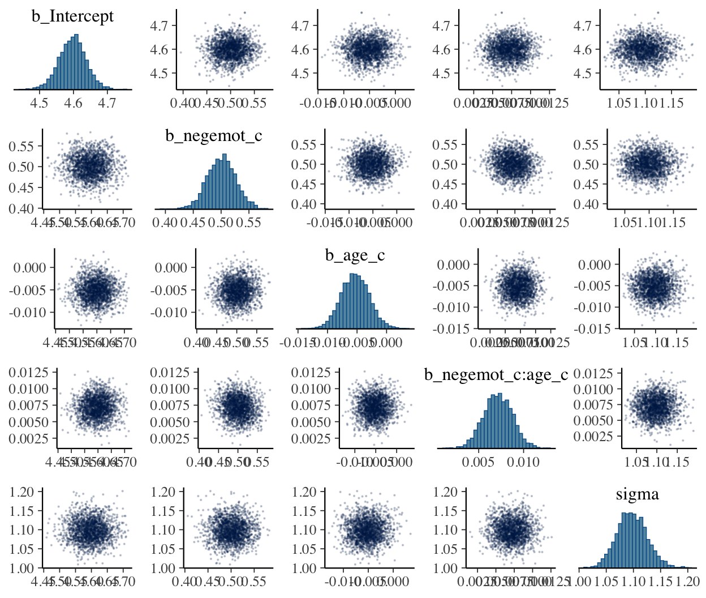
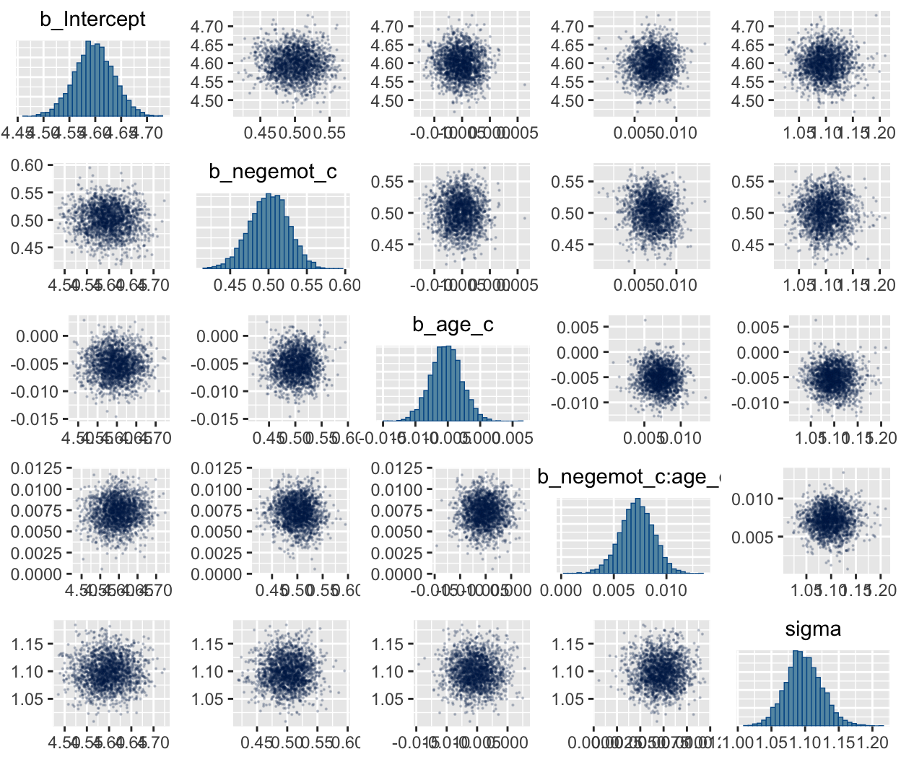
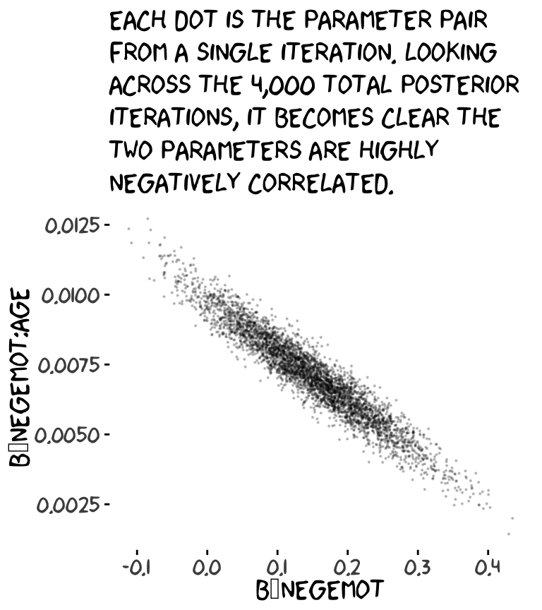
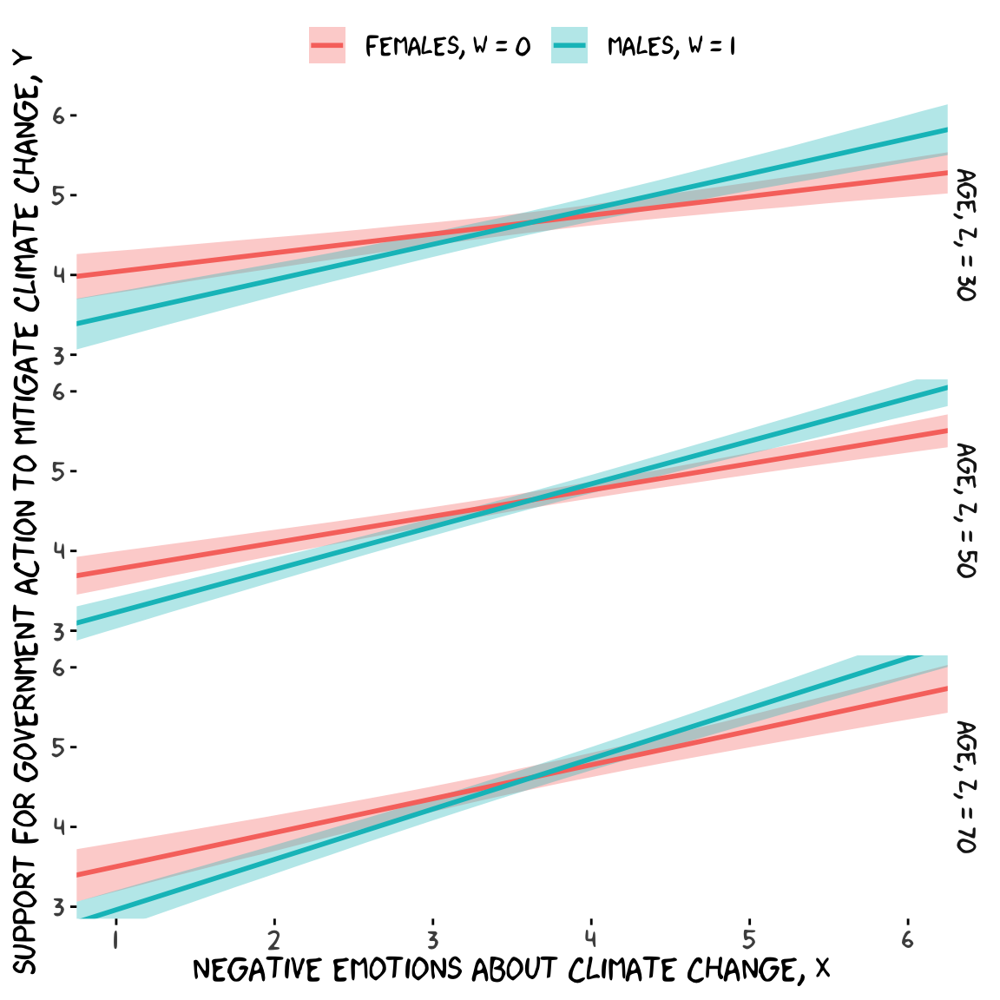

# Some Myths and Additional Extensions of Moderation Analysis


In this chapter, our Bayesian approach complicates some of Hayes's flow. We'll see how Bayesian HMC estimation can make us reconsider the value in mean centering and we'll also slip in some missing data talk.

## Truths and myths about mean-centering

> Mean-centering has been recommended in a few highly regarded books on regression analysis (e.g., [Aiken & West, 1991](http://us.sagepub.com/en-us/nam/multiple-regression/book3045); [Cohen et al., 2003](https://www.taylorfrancis.com/books/9780203774441)), and several explanations have been offered for why mean-centering should be undertaken prior to computation of the product and model estimation. The explanation that seems to have resulted in the most misunderstanding is that $X$ and $W$ are likely to be highly correlated with $XW$ and this will produce estimation problems caused by collinearity and result in poor or "strange" estimates of regression coefficients, large standard errors, and reduced power of the statistical test of the interaction. But this is, in large part, simply a myth. As I describe later, there are some reasons that mean- centering the focal antecedent or moderator variables can be a beneficial thing to do, which is why it has been *recommended* by some. However, it is incorrect to claim that it is *necessary*, that a failure to do so will lead one to incorrect inferences about moderation, or that the resulting regression coefficients are somehow strange or inherently uninterpretable. (pp. 304--305, *emphasis* in the original)

Here we load a couple necessary packages, load the data, and take a `glimpse()`.


```r
library(tidyverse)

glbwarm <- read_csv("data/glbwarm/glbwarm.csv")

glimpse(glbwarm)
```

```
## Observations: 815
## Variables: 7
## $ govact   <dbl> 3.6, 5.0, 6.6, 1.0, 4.0, 7.0, 6.8, 5.6, 6.0, 2.6, 1.4, 5.6, 7.0, 3.8, 3.4, 4.2, 1.0, …
## $ posemot  <dbl> 3.67, 2.00, 2.33, 5.00, 2.33, 1.00, 2.33, 4.00, 5.00, 5.00, 1.00, 4.00, 1.00, 5.67, 3…
## $ negemot  <dbl> 4.67, 2.33, 3.67, 5.00, 1.67, 6.00, 4.00, 5.33, 6.00, 2.00, 1.00, 4.00, 5.00, 4.67, 2…
## $ ideology <dbl> 6, 2, 1, 1, 4, 3, 4, 5, 4, 7, 6, 4, 2, 4, 5, 2, 6, 4, 2, 4, 4, 2, 6, 4, 4, 3, 4, 5, 4…
## $ age      <dbl> 61, 55, 85, 59, 22, 34, 47, 65, 50, 60, 71, 60, 71, 59, 32, 36, 69, 70, 41, 48, 38, 6…
## $ sex      <dbl> 0, 0, 1, 0, 1, 0, 1, 1, 1, 1, 1, 0, 1, 0, 1, 1, 1, 0, 0, 0, 0, 1, 1, 1, 1, 1, 1, 0, 0…
## $ partyid  <dbl> 2, 1, 1, 1, 1, 2, 1, 1, 2, 3, 2, 1, 1, 1, 1, 1, 2, 3, 1, 3, 2, 1, 3, 2, 1, 1, 1, 3, 1…
```

Before we fit our models, we'll go ahead and make our mean-centered predictors, `negemot_c` and `age_c`.


```r
glbwarm <-
  glbwarm %>% 
  mutate(negemot_c = negemot - mean(negemot),
         age_c     = age     - mean(age))
```

Now we're ready to fit Models 1 and 2. But before we do, it's worth repeating part of the text:

Let's load **brms**.


```r
library(brms)
```

As we'll see in just a bit, there are some important reasons for Bayesians using HMC to mean center that wouldn't pop up within the OLS paradigm. First let's fit `model9.1` and `model9.2`. `model9.1` follows the conventional moderation equation

$$Y = i_Y + b_1 X + b_2 W + b_3 XW + e_Y.$$

`model9.2` is our mean-centered model, which we can express formally as

\begin{align*}
Y & = i_Y + b_1 (X - \overline X) + b_2 (W - \overline W) + b_3 (X - \overline X)(W - \overline W) + e_Y, \; \text{or more simply} \\
& = i_Y + b_1 X' + b_2 W' + b_3 X'W' + e_Y,
\end{align*}

where $X' = (X - \overline X)$ and so on.


```r
model9.1 <- 
  brm(data = glbwarm, 
      family = gaussian,
      govact ~ 1 + negemot + age + negemot:age,
      cores = 4)

model9.2 <- 
  update(model9.1, 
         newdata = glbwarm,
         govact ~ 1 + negemot_c + age_c + negemot_c:age_c,
         cores = 4)
```

As with Hayes's OLS models, our HMC models yield the same Bayesian $R^2$ distributions, within simulation error.


```r
bayes_R2(model9.1) %>% round(digits = 3)
```

```
##    Estimate Est.Error  Q2.5 Q97.5
## R2    0.354     0.022 0.311 0.393
```

```r
bayes_R2(model9.2) %>% round(digits = 3)
```

```
##    Estimate Est.Error  Q2.5 Q97.5
## R2    0.354     0.022 0.308 0.394
```

Our model summaries also correspond nicely with those at the top of Table 9.1.


```r
print(model9.1, digits = 3)
```

```
##  Family: gaussian 
##   Links: mu = identity; sigma = identity 
## Formula: govact ~ 1 + negemot + age + negemot:age 
##    Data: glbwarm (Number of observations: 815) 
## Samples: 4 chains, each with iter = 2000; warmup = 1000; thin = 1;
##          total post-warmup samples = 4000
## 
## Population-Level Effects: 
##             Estimate Est.Error l-95% CI u-95% CI  Rhat Bulk_ESS Tail_ESS
## Intercept      4.334     0.322    3.698    4.969 1.001     1579     2082
## negemot        0.148     0.084   -0.016    0.311 1.001     1561     2132
## age           -0.031     0.006   -0.042   -0.019 1.001     1616     1948
## negemot:age    0.007     0.002    0.004    0.010 1.001     1595     2195
## 
## Family Specific Parameters: 
##       Estimate Est.Error l-95% CI u-95% CI  Rhat Bulk_ESS Tail_ESS
## sigma    1.098     0.027    1.046    1.154 1.001     2605     2416
## 
## Samples were drawn using sampling(NUTS). For each parameter, Eff.Sample 
## is a crude measure of effective sample size, and Rhat is the potential 
## scale reduction factor on split chains (at convergence, Rhat = 1).
```

```r
print(model9.2, digits = 3)
```

```
##  Family: gaussian 
##   Links: mu = identity; sigma = identity 
## Formula: govact ~ negemot_c + age_c + negemot_c:age_c 
##    Data: glbwarm (Number of observations: 815) 
## Samples: 4 chains, each with iter = 2000; warmup = 1000; thin = 1;
##          total post-warmup samples = 4000
## 
## Population-Level Effects: 
##                 Estimate Est.Error l-95% CI u-95% CI  Rhat Bulk_ESS Tail_ESS
## Intercept          4.598     0.038    4.523    4.672 1.001     3504     3131
## negemot_c          0.501     0.025    0.449    0.548 1.001     3474     3003
## age_c             -0.005     0.002   -0.010   -0.001 1.000     5349     3012
## negemot_c:age_c    0.007     0.002    0.004    0.010 1.001     4970     3218
## 
## Family Specific Parameters: 
##       Estimate Est.Error l-95% CI u-95% CI  Rhat Bulk_ESS Tail_ESS
## sigma    1.098     0.027    1.048    1.152 1.001     3608     2751
## 
## Samples were drawn using sampling(NUTS). For each parameter, Eff.Sample 
## is a crude measure of effective sample size, and Rhat is the potential 
## scale reduction factor on split chains (at convergence, Rhat = 1).
```

However, notice the 'Bulk_ESS' and 'Tail_ESS' columns. The values for `model9.2` were substantially larger than those for `model9.1`. These columns denote the number of effective samples (a.k.a. the effective sample size). Versions of **brms** before 2.10.0 returned a single effective sample size (ESS) value per parameter. We will cover where the change came from in a bit. But first, recall that we've been using **brms** defaults, which results in 4 HMC chains, each of which contains 2000 draws (iterations), the first 1000 of which are warmup values. After we discard the warmup values, that leaves 1000 draws from each chain--4000 total. As it turns out, Markov chains, and thus HMC chains, are typically *autocorrelated*, which means that each draw is partially dependent on the previous draw. Ideally, the autocorrelations are near zero. That's often not the case. 

The [**bayesplot** package](https://github.com/stan-dev/bayesplot) offers a variety of [diagnostic plots](https://cran.r-project.org/web/packages/bayesplot/vignettes/visual-mcmc-diagnostics.html#effective-sample-size). Here we'll use the `mcmc_acf()` function to make autocorrelation plots for all model parameters. Note that when we add `add_chain = T` to `brms::posterior_samples()`, we add an index to the data that allows us to keep track of which iteration comes from which chain. That index will come in handy for our `mcmc_acf()` plots.

But before we get there, we'll be using an [xkcd](https://xkcd.com)-inspired theme with help from the [**xkcd** package](https://cran.r-project.org/web/packages/xkcd/index.html) for our plots in this chapter.


```r
# install.packages("xkcd", dependencies = T)

library(xkcd)
```

If you haven't used the **xkcd** package, before, you might also need to take a few extra steps outlined [here](https://cran.r-project.org/web/packages/xkcd/vignettes/xkcd-intro.pdf), part of which requires help from the [**extrafont** package](https://cran.r-project.org/web/packages/extrafont/README.html),


```r
library(extrafont)

download.file("http://simonsoftware.se/other/xkcd.ttf",
              dest = "xkcd.ttf", mode = "wb")
 
system("mkdir ~/.fonts")
system("cp xkcd.ttf  ~/.fonts")
# this line of code returned an error message
# font_import(pattern = "[X/x]kcd", prompt = FALSE)

# this line from (https://stackoverflow.com/questions/49221040/error-in-font-import-while-installing-xkcd-font) fixed the problem
font_import(path = "~/.fonts", pattern = "[X/x]kcd", prompt=FALSE)
fonts()
fonttable()
 if(.Platform$OS.type != "unix") {
   ## Register fonts for Windows bitmap output
   loadfonts(device="win")
 } else {
   loadfonts()
 }
```

After installing, I still experienced error messages, which were alleviated after I followed [these steps outlined by Remi.b](https://stackoverflow.com/questions/48553545/polygon-edge-not-found-with-the-xkcd-package). You may or may not need them.

But anyways, here are our `mcmc_acf()` plots.


```r
library(bayesplot)

post1 <- posterior_samples(model9.1, add_chain = T)
mcmc_acf(post1, 
         pars = c("b_Intercept", "b_negemot", "b_age", "b_negemot:age", "sigma"),
         lags = 4) +
  theme_xkcd()
```


```r
post2 <- posterior_samples(model9.2, add_chain = T)
mcmc_acf(post2, 
         pars = c("b_Intercept", "b_negemot_c", "b_age_c", "b_negemot_c:age_c", "sigma"),
         lags = 4) +
  theme_xkcd() 
```


As it turns out, `theme_xkcd()` can't handle special characters like "_", so it returns rectangles instead. So it goes...

But again, high autocorrelations in the HMC chains have consequences for the effective sample size. In the [Visual MCMC diagnostics using the bayesplot package](https://cran.r-project.org/web/packages/bayesplot/vignettes/visual-mcmc-diagnostics.html#effective-sample-size) vignette, Gabry wrote:

> The effective sample size is an estimate of the number of independent draws from the posterior distribution of the estimand of interest. Because the draws within a Markov chain are *not* independent if there is autocorrelation, the effective sample size, $n_{eff}$, will be smaller than the total sample size, $N$. The larger the ratio of $n_{eff}$ to $N$ the better.

In that quote, Gabry spoke as if there was only one measure of ESS. Though this has been the case for some time, times have changed. In a [2019 paper](https://arxiv.org/pdf/1903.08008.pdf), Stan-team allstars Vehtari, Gelman, Simpson, Carpenter, and Bürkner proposed two measures of ESS: "bulk-ESS" and "tail-ESS." From their paper, we read:

>  if you plan to report quantile estimates or posterior intervals, we strongly suggest assessing the
convergence of the chains for these quantiles. In Section 4.3 we show that convergence of Markov chains is
not uniform across the parameter space and propose diagnostics and effective sample sizes specifically for
extreme quantiles. This is *different* from the standard ESS estimate (which we refer to as the "bulk-ESS"),
which mainly assesses how well the centre of the distribution is resolved. Instead, these "tail-ESS" measures
allow the user to estimate the MCSE for interval estimates. (p. 5, *emphasis* in the original)

You can read the paper for technical details. In short, the `Bulk_ESS` in the output of **brms** 2.10.0 and up is what was previously referred to as `Eff.Sample`, the effective sample size. This indexed the number of effective samples in "the centre of the" posterior distribution (i.e., the posterior mean or median). But since we also care about uncertainty in our models, we also care about how well we have characterized the tails of the posterior distribution in 95% intervals and such. The new `Tail_ESS` in **brms** output allows us to gauge the effective sample size for those intervals.

The `Bulk_ESS` and `Tail_ESS` values were all well above 2,000 with `model9.2` and the autocorrelations were very low, too. `model9.1` had higher autocorrelations and lower ESS values. The upshot is that even though we have 4,000 samples for each parameter, those samples don't necessarily give us the same quality of information fully independent samples would. `Bulk_ESS` and `Tail_ESS` values help you determine how concerned you should be. And, as it turns out, things like centering can help increase a models `Bulk_ESS` and `Tail_ESS` values.

Wading in further, we can use the `neff_ratio()` function to collect the $n_{eff}$ to $N$ ratio for each model parameter and then use `mcmc_neff()` to make a visual diagnostic. Here we do so for `model9.1` and `model9.2`.


```r
ratios_model9.1 <- 
  neff_ratio(model9.1, 
             pars = c("b_Intercept", "b_negemot", "b_age", "b_negemot:age", "sigma"))
ratios_model9.2 <- 
  neff_ratio(model9.2,
             pars = c("b_Intercept", "b_negemot_c", "b_age_c", "b_negemot_c:age_c", "sigma"))

mcmc_neff(ratios_model9.1) + 
  yaxis_text(hjust = 0) +
  theme_xkcd()
```


```r
mcmc_neff(ratios_model9.2) + 
  yaxis_text(hjust = 0) +
  theme_xkcd()
```



Although none of the $n_{eff}$ to $N$ ratios were in the shockingly-low range for either model, there were substantially higher for `model9.2`.

In addition to autocorrelations and $n_{eff}$ to $N$ ratios, there is also the issue that the parameters in the model can themselves be correlated. If you like a visual approach, you can use `brms::pairs()` to retrieve histograms for each parameter along with scatter plots showing the shape of their correlations. Here we'll use the `off_diag_args` argument to customize some of the plot settings.


```r
pairs(model9.1,
      off_diag_args = list(size = 1/10,
                           alpha = 1/5))
```


```r
pairs(model9.2,
      off_diag_args = list(size = 1/10,
                           alpha = 1/5))
```



When fitting models with HMC, centering can make a difference for the parameter correlations. If you prefer a more numeric approach, `vcov()` will yield the variance/covariance matrix--or correlation matrix when using `correlation = T`--for the parameters in a model.


```r
vcov(model9.1, correlation = T) %>% round(digits = 2)
```

```
##             Intercept negemot   age negemot:age
## Intercept        1.00   -0.93 -0.95        0.88
## negemot         -0.93    1.00  0.88       -0.95
## age             -0.95    0.88  1.00       -0.92
## negemot:age      0.88   -0.95 -0.92        1.00
```

```r
vcov(model9.2, correlation = T) %>% round(digits = 2)
```

```
##                 Intercept negemot_c age_c negemot_c:age_c
## Intercept            1.00     -0.05 -0.03            0.07
## negemot_c           -0.05      1.00  0.02           -0.09
## age_c               -0.03      0.02  1.00           -0.02
## negemot_c:age_c      0.07     -0.09 -0.02            1.00
```

*And so wait, what does that even mean for a parameter to correlate with another parameter?* you might ask. Fair enough. Let's compute a parameter correlation step by step. The first step requires `posterior_samples()`.


```r
post <- posterior_samples(model9.1)

head(post)
```

```
##   b_Intercept  b_negemot       b_age b_negemot:age    sigma      lp__
## 1    4.784589 0.09051007 -0.03736229   0.007524971 1.043218 -1240.427
## 2    4.535839 0.10386142 -0.03432908   0.008052277 1.140911 -1236.445
## 3    4.624798 0.11578574 -0.03397618   0.007172857 1.116228 -1236.578
## 4    4.604103 0.06094752 -0.03593282   0.008872074 1.097935 -1235.321
## 5    4.496733 0.10233315 -0.03130703   0.007536339 1.072701 -1236.124
## 6    4.773596 0.05192045 -0.03672549   0.008539841 1.082068 -1236.373
```

Now we've put our posterior iterations into a data object, `post`, we can make a scatter plot of two parameters. Here we'll choose `b_negemot` and the interaction coefficient, `b_negemot:age`.


```r
post %>% 
  ggplot(aes(x = b_negemot, y = `b_negemot:age`)) +
  geom_point(size = 1/10, alpha = 1/5) +
  labs(subtitle = "Each dot is the parameter pair\nfrom a single iteration. Looking\nacross the 4,000 total posterior\niterations, it becomes clear the\ntwo parameters are highly\nnegatively correlated.") +
  theme_xkcd()
```



And indeed, the Pearson's correlation coefficient is strong.


```r
cor(post$b_negemot, post$`b_negemot:age`)
```

```
## [1] -0.9547416
```

And what was that part from the `vcov()` output, again?


```r
vcov(model9.1, correlation = T)["negemot", "negemot:age"]
```

```
## [1] -0.9547416
```

Boom! That's where those correlations come from.

This entire topic of HMC diagnostics can seem baffling, especially when compared to the simplicity of OLS. If this is your first introduction, you might want to watch lectures [10](https://www.youtube.com/watch?v=BWEtS3HuU5A&list=PLDcUM9US4XdM9_N6XUUFrhghGJ4K25bFc) and [11](https://www.youtube.com/watch?v=13mEekRdOcQ&list=PLDcUM9US4XdM9_N6XUUFrhghGJ4K25bFc) from McElreath's [Statistical Rethinking Fall 2017 lecture series](https://www.youtube.com/playlist?list=PLDcUM9US4XdM9_N6XUUFrhghGJ4K25bFc). Accordingly, you might check out Chapter 8 of his [*Statistical Rethinking* text](https://xcelab.net/rm/statistical-rethinking/) and [my project explaining how to reproduce the analyses in that chapter in **brms**](https://bookdown.org/content/1850/markov-chain-monte-carlo.html).

### The effect of mean-centering on multicollinearity and the standard error of $b_3$.

This can be difficult to keep track of, but what we just looked at were the correlations among **model parameters**. These are *not* the same as correlations among **variables**. As such, those correlations are not the same as those in Table 9.2. But we can get those, too. First we'll have to do a little more data processing to get all the necessary mean-centered variables and standardized variables.


```r
glbwarm <-
  glbwarm %>% 
  mutate(negemot_x_age     = negemot   * age,
         negemot_c_x_age_c = negemot_c * age_c,
         negemot_z         = (negemot - mean(negemot)) / sd(negemot),
         age_z             = (age     - mean(age)    ) / sd(age)) %>% 
  mutate(negemot_z_x_age_z = negemot_z * age_z)
```

And recall that to get our sweet Bayesian correlations, we use the multivariate `mvbind()` syntax to fit an intercepts-only model. Here we do that for all three of the Table 9.2 sections.


```r
model9.3 <- 
  brm(data = glbwarm, 
      family = gaussian,
      mvbind(negemot, age, negemot_x_age) ~ 1,
      cores = 4)

model9.4 <- 
  brm(data = glbwarm, 
      family = gaussian,
      mvbind(negemot_c, age_c, negemot_c_x_age_c) ~ 1,
      cores = 4)

model9.5 <- 
  brm(data = glbwarm, 
      family = gaussian,
      mvbind(negemot_z, age_z, negemot_z_x_age_z) ~ 1,
      cores = 4)
```

Here are their summaries.


```r
print(model9.3, digits = 3)
```

```
##  Family: MV(gaussian, gaussian, gaussian) 
##   Links: mu = identity; sigma = identity
##          mu = identity; sigma = identity
##          mu = identity; sigma = identity 
## Formula: negemot ~ 1 
##          age ~ 1 
##          negemot_x_age ~ 1 
##    Data: glbwarm (Number of observations: 815) 
## Samples: 4 chains, each with iter = 2000; warmup = 1000; thin = 1;
##          total post-warmup samples = 4000
## 
## Population-Level Effects: 
##                       Estimate Est.Error l-95% CI u-95% CI  Rhat Bulk_ESS Tail_ESS
## negemot_Intercept        3.557     0.054    3.450    3.664 1.000     3573     2647
## age_Intercept           49.535     0.574   48.414   50.645 1.001     3746     2439
## negemotxage_Intercept  174.768     3.466  167.909  181.452 1.001     3307     2656
## 
## Family Specific Parameters: 
##                   Estimate Est.Error l-95% CI u-95% CI  Rhat Bulk_ESS Tail_ESS
## sigma_negemot        1.529     0.038    1.454    1.604 1.002     3435     2714
## sigma_age           16.361     0.409   15.581   17.191 1.000     3023     2544
## sigma_negemotxage   97.421     2.380   92.865  102.158 1.002     2626     2300
## 
## Residual Correlations: 
##                             Estimate Est.Error l-95% CI u-95% CI  Rhat Bulk_ESS Tail_ESS
## rescor(negemot,age)           -0.058     0.035   -0.127    0.009 1.000     2437     1846
## rescor(negemot,negemotxage)    0.765     0.015    0.735    0.793 1.002     2363     2442
## rescor(age,negemotxage)        0.548     0.025    0.498    0.594 1.001     3230     2750
## 
## Samples were drawn using sampling(NUTS). For each parameter, Eff.Sample 
## is a crude measure of effective sample size, and Rhat is the potential 
## scale reduction factor on split chains (at convergence, Rhat = 1).
```

```r
print(model9.4, digits = 3)
```

```
##  Family: MV(gaussian, gaussian, gaussian) 
##   Links: mu = identity; sigma = identity
##          mu = identity; sigma = identity
##          mu = identity; sigma = identity 
## Formula: negemot_c ~ 1 
##          age_c ~ 1 
##          negemot_c_x_age_c ~ 1 
##    Data: glbwarm (Number of observations: 815) 
## Samples: 4 chains, each with iter = 2000; warmup = 1000; thin = 1;
##          total post-warmup samples = 4000
## 
## Population-Level Effects: 
##                         Estimate Est.Error l-95% CI u-95% CI  Rhat Bulk_ESS Tail_ESS
## negemotc_Intercept        -0.001     0.054   -0.106    0.106 1.002     6244     3061
## agec_Intercept            -0.004     0.568   -1.092    1.064 1.002     6529     2913
## negemotcxagec_Intercept   -1.411     0.862   -3.090    0.303 1.001     7503     3141
## 
## Family Specific Parameters: 
##                     Estimate Est.Error l-95% CI u-95% CI  Rhat Bulk_ESS Tail_ESS
## sigma_negemotc         1.533     0.036    1.461    1.607 1.002     6919     3187
## sigma_agec            16.362     0.419   15.577   17.169 1.000     7966     3130
## sigma_negemotcxagec   24.236     0.608   23.075   25.463 1.001     6427     3062
## 
## Residual Correlations: 
##                                Estimate Est.Error l-95% CI u-95% CI  Rhat Bulk_ESS Tail_ESS
## rescor(negemotc,agec)            -0.057     0.034   -0.121    0.013 1.004     6669     2937
## rescor(negemotc,negemotcxagec)    0.092     0.035    0.023    0.159 1.002     7534     2911
## rescor(agec,negemotcxagec)       -0.014     0.035   -0.083    0.054 1.001     7142     2690
## 
## Samples were drawn using sampling(NUTS). For each parameter, Eff.Sample 
## is a crude measure of effective sample size, and Rhat is the potential 
## scale reduction factor on split chains (at convergence, Rhat = 1).
```

```r
print(model9.5, digits = 3)
```

```
##  Family: MV(gaussian, gaussian, gaussian) 
##   Links: mu = identity; sigma = identity
##          mu = identity; sigma = identity
##          mu = identity; sigma = identity 
## Formula: negemot_z ~ 1 
##          age_z ~ 1 
##          negemot_z_x_age_z ~ 1 
##    Data: glbwarm (Number of observations: 815) 
## Samples: 4 chains, each with iter = 2000; warmup = 1000; thin = 1;
##          total post-warmup samples = 4000
## 
## Population-Level Effects: 
##                         Estimate Est.Error l-95% CI u-95% CI  Rhat Bulk_ESS Tail_ESS
## negemotz_Intercept         0.000     0.036   -0.071    0.069 1.003     7595     3150
## agez_Intercept            -0.001     0.035   -0.070    0.069 1.000     6965     2835
## negemotzxagez_Intercept   -0.057     0.034   -0.122    0.011 1.001     7735     2581
## 
## Family Specific Parameters: 
##                     Estimate Est.Error l-95% CI u-95% CI  Rhat Bulk_ESS Tail_ESS
## sigma_negemotz         1.003     0.025    0.956    1.053 1.003     7990     2943
## sigma_agez             1.002     0.025    0.953    1.053 1.000     7529     2834
## sigma_negemotzxagez    0.972     0.025    0.925    1.022 1.001     7272     2969
## 
## Residual Correlations: 
##                                Estimate Est.Error l-95% CI u-95% CI  Rhat Bulk_ESS Tail_ESS
## rescor(negemotz,agez)            -0.057     0.035   -0.127    0.012 1.006     7927     2851
## rescor(negemotz,negemotzxagez)    0.092     0.034    0.026    0.158 1.000     6929     2379
## rescor(agez,negemotzxagez)       -0.015     0.035   -0.086    0.053 1.000     7536     2978
## 
## Samples were drawn using sampling(NUTS). For each parameter, Eff.Sample 
## is a crude measure of effective sample size, and Rhat is the potential 
## scale reduction factor on split chains (at convergence, Rhat = 1).
```

A more condensed way to get that information might be with the `brms::VarCorr()` function. Just make sure to tack `$residual__$cor` onto the end.


```r
VarCorr(model9.3)$residual__$cor %>% 
  round(digits = 3)
```

```
## , , negemot
## 
##             Estimate Est.Error   Q2.5 Q97.5
## negemot        1.000     0.000  1.000 1.000
## age           -0.058     0.035 -0.127 0.009
## negemotxage    0.765     0.015  0.735 0.793
## 
## , , age
## 
##             Estimate Est.Error   Q2.5 Q97.5
## negemot       -0.058     0.035 -0.127 0.009
## age            1.000     0.000  1.000 1.000
## negemotxage    0.548     0.025  0.498 0.594
## 
## , , negemotxage
## 
##             Estimate Est.Error  Q2.5 Q97.5
## negemot        0.765     0.015 0.735 0.793
## age            0.548     0.025 0.498 0.594
## negemotxage    1.000     0.000 1.000 1.000
```

For the sake of space, I'll let you check that out for `model9.4` and `model9.5`. If you're tricky with your `VarCorr()` indexing, you can also get the model-implied variances.


```r
VarCorr(model9.3)$residual__$cov[1, , "negemot"] %>% round(digits = 3)
```

```
##  Estimate Est.Error      Q2.5     Q97.5 
##     2.340     0.118     2.115     2.574
```

```r
VarCorr(model9.3)$residual__$cov[2, , "age"] %>% round(digits = 3)
```

```
##  Estimate Est.Error      Q2.5     Q97.5 
##   267.848    13.402   242.758   295.519
```

```r
VarCorr(model9.3)$residual__$cov[3, , "negemotxage"] %>% round(digits = 3)
```

```
##  Estimate Est.Error      Q2.5     Q97.5 
##  9496.434   464.569  8623.939 10436.186
```

And if you're like totally lost with all this indexing, you might execute `VarCorr(correlations1) %>% str()` and spend a little time looking at what `VarCorr()` returns.

On page 309, Hayes explained why the OLS variance for $b_3$ is unaffected by mean centering. The story was similar for our HMC model, too.


```r
fixef(model9.1)["negemot:age", "Est.Error"]
```

```
## [1] 0.00157804
```

```r
fixef(model9.2)["negemot_c:age_c", "Est.Error"]
```

```
## [1] 0.001577989
```

For more details, you might also see the [22.12. Standardizing Predictors and Outputs subsection of the Stan User's Guide, Version 2.21](https://mc-stan.org/docs/2_21/stan-users-guide/standardizing-predictors-and-outputs.html)--[Stan](http://mc-stan.org), of course, being the computational engine underneath our **brms** hood.

### The effect of mean-centering on $b_1$, $b_2$, and their ~~standard errors~~ posterior $SD$s.

> A second explanation given for why mean-centering is preferred is that it makes $b_1$ and $b_2$, the regression coefficients for $X$ and $W$, more meaningful. This is generally true and thus not a myth, although it is not necessarily true in all circumstances... 
>
> Mean-centering $X$ and $W$ prior to computation of the product and estimation of the model will produce $b_1$ and $b_2$ that are always meaningful, rather than meaningful only when $X$ and/or $W$ are meaningful when equal to zero... [After mean centering,] $b_1$ estimates the difference in $Y$ between two cases that differ by one unit on $X$ among cases that are *average* on $W$. Similarly, $b_2$ estimates the difference in $Y$ between two cases that differ by one unit on $W$ among cases that are *average* on $X$. These will always estimate conditional effects of $X$ on $Yv within the range of the data, and they can always be interpreted. (p. 310. *emphasis* in the original)

If you only care about posterior means, you can use `model9.1` to reproduce the results at the bottom of page 310 like this.


```r
fixef(model9.1)["negemot", 1] + 
  fixef(model9.1)["negemot:age", 1] * mean(glbwarm$age)
```

```
## [1] 0.5003564
```

Here's the same computation using `model9.2`.


```r
fixef(model9.2)["negemot_c", 1] + 
  fixef(model9.2)["negemot_c:age_c", 1] * mean(glbwarm$age_c)
```

```
## [1] 0.5005431
```

But we're proper Bayesians and like a summary of the spread in the posterior. So we'll evoke `posterior_samples()` and the other usual steps, this time just focusing on `model9.1`.


```r
post <- posterior_samples(model9.1)

post %>% 
  transmute(our_contidional_effect_given_W_bar = b_negemot + `b_negemot:age` * mean(glbwarm$age)) %>%
  summarize(mean = mean(our_contidional_effect_given_W_bar),
            sd   = sd(our_contidional_effect_given_W_bar)) %>% 
  round(digits = 3)
```

```
##   mean    sd
## 1  0.5 0.025
```

And note how the standard error Hayes computed at the top of page 311 corresponds nicely with the posterior $SD$ we just computed. Hayes employed a fancy formula; we just used `sd()`. At any rate, the main message is centering did not effect our estimate of the conditional effect of $X$. It turns out $(\theta_{X \rightarrow Y} | W) = (\theta_{\overline X \rightarrow Y} | \overline W)$.

### The ~~centering option in PROCESS~~.

I'm not aware of a similar function in **brms**. You'll have to use your data wrangling skills.

## The estimation and interpretation of standardized regression coefficients in a moderation analysis

> Mean-centering does nothing to change the scaling of regression coefficients. Whether or not mean-centering is used when estimating a model of the form $\hat Y = i_Y + b_1 X + b_2 W + b_3 XW$, $b_1$, $b_2$, and $b_3$ are interpreted with respect to the measured metrics of $X$, $W$, and $Y$ (i.e., in *unstandardized* form). Although [Hayes] generally prefer[s] to report and interpret regression analyses based on unstandardized coefficients, it is possible to generate regression coefficients that are analogous to standardized regression coefficients in regression models without a product term as a predictor. However, one must be careful when doing so. (p. 313, *emphasis* in the original)

### Variant 1.

We've already computed standardized predictors. Now we just need to standardize the criterion, `govact`.


```r
glbwarm <-
  glbwarm %>% 
  mutate(govact_z = (govact - mean(govact)) / sd(govact))
```

Fit the model.


```r
model9.6 <- 
  update(model9.1, 
         newdata = glbwarm,
         govact_z ~ 1 + negemot_z + age_z + negemot_z:age_z,
         cores = 4)
```

Check the Bayesian $R^2$.


```r
bayes_R2(model9.6) %>% round(digits = 3)
```

```
##    Estimate Est.Error  Q2.5 Q97.5
## R2    0.355     0.022 0.311 0.397
```

Check the parameter summaries.


```r
print(model9.6, digits = 3)
```

```
##  Family: gaussian 
##   Links: mu = identity; sigma = identity 
## Formula: govact_z ~ negemot_z + age_z + negemot_z:age_z 
##    Data: glbwarm (Number of observations: 815) 
## Samples: 4 chains, each with iter = 2000; warmup = 1000; thin = 1;
##          total post-warmup samples = 4000
## 
## Population-Level Effects: 
##                 Estimate Est.Error l-95% CI u-95% CI  Rhat Bulk_ESS Tail_ESS
## Intercept          0.007     0.028   -0.048    0.064 1.000     4443     2985
## negemot_z          0.563     0.028    0.507    0.619 1.001     4793     3216
## age_z             -0.063     0.029   -0.120   -0.004 1.002     4304     2918
## negemot_z:age_z    0.131     0.029    0.073    0.189 1.003     4767     3267
## 
## Family Specific Parameters: 
##       Estimate Est.Error l-95% CI u-95% CI  Rhat Bulk_ESS Tail_ESS
## sigma    0.807     0.020    0.769    0.845 1.001     4648     3263
## 
## Samples were drawn using sampling(NUTS). For each parameter, Eff.Sample 
## is a crude measure of effective sample size, and Rhat is the potential 
## scale reduction factor on split chains (at convergence, Rhat = 1).
```

If you go all the way up back to Table 9.1, you'll see our results are pretty similar to those in the text.

### Variant 2.

This time we need to standardize our interaction term, `negemot_x_age_z`, by hand.


```r
glbwarm <-
  glbwarm %>% 
  mutate(negemot_x_age_z = (negemot_x_age - mean(negemot_x_age)) / sd(negemot_x_age))
```

Now we're ready to `update()`


```r
model9.7 <- 
  update(model9.1, 
         newdata = glbwarm,
         govact_z ~ 1 + negemot_z + age_z + negemot_x_age_z,
         cores = 4)
```


```r
bayes_R2(model9.7) %>% round(digits = 3)
```

```
##    Estimate Est.Error  Q2.5 Q97.5
## R2    0.354     0.022 0.309 0.395
```


```r
print(model9.7, digits = 3)
```

```
##  Family: gaussian 
##   Links: mu = identity; sigma = identity 
## Formula: govact_z ~ negemot_z + age_z + negemot_x_age_z 
##    Data: glbwarm (Number of observations: 815) 
## Samples: 4 chains, each with iter = 2000; warmup = 1000; thin = 1;
##          total post-warmup samples = 4000
## 
## Population-Level Effects: 
##                 Estimate Est.Error l-95% CI u-95% CI  Rhat Bulk_ESS Tail_ESS
## Intercept          0.000     0.029   -0.058    0.056 1.003     2832     2558
## negemot_z          0.170     0.093   -0.013    0.349 1.001     1316     1784
## age_z             -0.365     0.071   -0.507   -0.228 1.001     1334     1559
## negemot_x_age_z    0.506     0.111    0.291    0.728 1.002     1290     1772
## 
## Family Specific Parameters: 
##       Estimate Est.Error l-95% CI u-95% CI  Rhat Bulk_ESS Tail_ESS
## sigma    0.806     0.021    0.767    0.848 1.000     2728     2048
## 
## Samples were drawn using sampling(NUTS). For each parameter, Eff.Sample 
## is a crude measure of effective sample size, and Rhat is the potential 
## scale reduction factor on split chains (at convergence, Rhat = 1).
```

The results correspond nicely to those in Table 9.1, too.

## A caution on manual centering and standardization [because of missing data]

It's worthwhile considering the issue of listwise deletion when data are partially missing. The **brms** default is to delete rows with missingness, `NA` in **R**, for the predictors. However, [**brms** allows users to perform one-step Bayesian imputation for missing values using the `mi()` syntax](https://cran.r-project.org/web/packages/brms/vignettes/brms_missings.html). First we'll fit see what happens when you fit a model in **brms** when some of the `negemot_z` values are missing, but without using the `mi()` syntax. And of course before we do that, we'll make a `negemot_z_missing` variable, which is identical to `negemot_z`, but about 10% of the values are missing.


```r
set.seed(9)

glbwarm <-
  glbwarm %>% 
  mutate(missing           = rbinom(n = n(), size = 1, prob = .1)) %>% 
  mutate(negemot_z_missing = ifelse(missing == 1, NA, negemot_z))
```

If you've never used `rbinom()` before, execute `?rbinom` or look it up in your favorite web search engine. Here's our listwise deletion model, which corresponds to what you'd get from a typical OLS-based program.


```r
model9.8 <- 
  update(model9.6, 
         newdata = glbwarm,
         govact_z ~ 1 + negemot_z_missing + age_z + negemot_z_missing:age_z,
         cores = 4)
```

Let's compare the listwise deletion results with the model based on all the data.


```r
print(model9.6)
```

```
##  Family: gaussian 
##   Links: mu = identity; sigma = identity 
## Formula: govact_z ~ negemot_z + age_z + negemot_z:age_z 
##    Data: glbwarm (Number of observations: 815) 
## Samples: 4 chains, each with iter = 2000; warmup = 1000; thin = 1;
##          total post-warmup samples = 4000
## 
## Population-Level Effects: 
##                 Estimate Est.Error l-95% CI u-95% CI Rhat Bulk_ESS Tail_ESS
## Intercept           0.01      0.03    -0.05     0.06 1.00     4443     2985
## negemot_z           0.56      0.03     0.51     0.62 1.00     4793     3216
## age_z              -0.06      0.03    -0.12    -0.00 1.00     4304     2918
## negemot_z:age_z     0.13      0.03     0.07     0.19 1.00     4767     3267
## 
## Family Specific Parameters: 
##       Estimate Est.Error l-95% CI u-95% CI Rhat Bulk_ESS Tail_ESS
## sigma     0.81      0.02     0.77     0.85 1.00     4648     3263
## 
## Samples were drawn using sampling(NUTS). For each parameter, Eff.Sample 
## is a crude measure of effective sample size, and Rhat is the potential 
## scale reduction factor on split chains (at convergence, Rhat = 1).
```

```r
print(model9.8)
```

```
##  Family: gaussian 
##   Links: mu = identity; sigma = identity 
## Formula: govact_z ~ negemot_z_missing + age_z + negemot_z_missing:age_z 
##    Data: glbwarm (Number of observations: 731) 
## Samples: 4 chains, each with iter = 2000; warmup = 1000; thin = 1;
##          total post-warmup samples = 4000
## 
## Population-Level Effects: 
##                         Estimate Est.Error l-95% CI u-95% CI Rhat Bulk_ESS Tail_ESS
## Intercept                   0.00      0.03    -0.05     0.06 1.00     4803     2808
## negemot_z_missing           0.57      0.03     0.51     0.63 1.00     4543     2599
## age_z                      -0.05      0.03    -0.10     0.01 1.00     4839     2868
## negemot_z_missing:age_z     0.12      0.03     0.06     0.18 1.00     4989     3234
## 
## Family Specific Parameters: 
##       Estimate Est.Error l-95% CI u-95% CI Rhat Bulk_ESS Tail_ESS
## sigma     0.81      0.02     0.77     0.85 1.00     5280     2741
## 
## Samples were drawn using sampling(NUTS). For each parameter, Eff.Sample 
## is a crude measure of effective sample size, and Rhat is the potential 
## scale reduction factor on split chains (at convergence, Rhat = 1).
```

In this case, the model results were similar to those based on all the data because we used `rbinom()` to delete the predictor values completely at random. With real data and real-live missing data mechanisms, the situation isn't often so rosy. But anyway, the real story, here, is the `Data: glbwarm (Number of observations: n)` line at the top of the `print()` outputs. The number, $n$, was 815 in the model using all the data and 731 for the one based on listwise deletion. That's a lot of missing information.

The `mi()` syntax will allow us to use all the rows in a model, even if one or more of the predictors contain missing values. The syntax makes the model a multivariate model in that now we'll be modeling both `govact_z` *and* `negemot_z_missing`. As we've covered in prior chapters, there are multiple ways to write a [multivariate model in **brms**](https://cran.r-project.org/web/packages/brms/vignettes/brms_multivariate.html). One nice way is to write the model for each criterion separately in a `bf()` statement. You combine the `bf()` statements together with the `+` operator. And for models like the ones in Hayes's text, you'll also want to tack on `set_rescor(FALSE)`. You can do this within the `brm()` function, as usual. But I find that this clutters the code up more than I like. So another approach is to save the combination of `bf()` statements as an object.


```r
my_model <- 
  bf(govact_z  ~ 1 + mi(negemot_z_missing) + age_z + mi(negemot_z_missing):age_z) + 
  bf(negemot_z_missing | mi() ~ 1) + 
  set_rescor(FALSE)
```

With our multivariate formula saved as `my_model`, we're ready to plug it into `brm()` and fit.


```r
model9.9 <- 
  brm(data = glbwarm,
      family = gaussian,
      my_model,
      cores = 4)
```

Let's see what we've done.


```r
print(model9.9)
```

```
##  Family: MV(gaussian, gaussian) 
##   Links: mu = identity; sigma = identity
##          mu = identity; sigma = identity 
## Formula: govact_z ~ 1 + mi(negemot_z_missing) + age_z + mi(negemot_z_missing):age_z 
##          negemot_z_missing | mi() ~ 1 
##    Data: glbwarm (Number of observations: 815) 
## Samples: 4 chains, each with iter = 2000; warmup = 1000; thin = 1;
##          total post-warmup samples = 4000
## 
## Population-Level Effects: 
##                                   Estimate Est.Error l-95% CI u-95% CI Rhat Bulk_ESS Tail_ESS
## govactz_Intercept                     0.01      0.03    -0.05     0.06 1.00     4695     2818
## negemotzmissing_Intercept            -0.00      0.04    -0.07     0.07 1.00     4876     2901
## govactz_age_z                        -0.06      0.03    -0.12    -0.00 1.00     5861     2603
## govactz_minegemot_z_missing           0.57      0.03     0.51     0.63 1.00     4487     2647
## govactz_minegemot_z_missing:age_z     0.13      0.03     0.07     0.19 1.00     4358     2582
## 
## Family Specific Parameters: 
##                       Estimate Est.Error l-95% CI u-95% CI Rhat Bulk_ESS Tail_ESS
## sigma_govactz             0.80      0.02     0.77     0.85 1.00     5546     3135
## sigma_negemotzmissing     1.00      0.03     0.95     1.05 1.00     4226     3234
## 
## Samples were drawn using sampling(NUTS). For each parameter, Eff.Sample 
## is a crude measure of effective sample size, and Rhat is the potential 
## scale reduction factor on split chains (at convergence, Rhat = 1).
```

When using the multivariate `mi()` syntax, your `print()` output becomes more complicated. We got regression sub-models for both `govact_z` and `negemot_z_missing`. But look at the line at the top of the output that reads "Data: glbwarm (Number of observations: 815)". The multivariate `mi()` syntax used all the available data. No listwise deletion necessary.

The `print()` output for our model obscured some of the results. To clarify what the `mi()` syntax did, let's peek at the first columns returned by `posterior_samples()`.


```r
post <- posterior_samples(model9.9)

post[, 1:20] %>% 
  glimpse()
```

```
## Observations: 4,000
## Variables: 20
## $ b_govactz_Intercept                     <dbl> 0.0511836815, 0.0128788162, 0.0009209448, -0.047046148…
## $ b_negemotzmissing_Intercept             <dbl> 0.0667552821, -0.0348313048, 0.0196244734, 0.072896235…
## $ b_govactz_age_z                         <dbl> -0.013879975, -0.116291294, -0.039856620, -0.098567649…
## $ bsp_govactz_minegemot_z_missing         <dbl> 0.5746923, 0.5591172, 0.5578617, 0.5481572, 0.5918545,…
## $ `bsp_govactz_minegemot_z_missing:age_z` <dbl> 0.13033787, 0.15948055, 0.07389118, 0.13219047, 0.1316…
## $ sigma_govactz                           <dbl> 0.7762248, 0.8187004, 0.8044304, 0.8035145, 0.7992377,…
## $ sigma_negemotzmissing                   <dbl> 0.9884742, 1.0044714, 0.9758054, 0.9892599, 0.9898388,…
## $ `Ymi_negemotzmissing[10]`               <dbl> -1.32620629, -1.48806393, -0.45006561, -0.45126959, -1…
## $ `Ymi_negemotzmissing[18]`               <dbl> -1.11552232, -1.42524665, 0.33196970, -0.14569350, -1.…
## $ `Ymi_negemotzmissing[26]`               <dbl> 0.985209590, 0.685942447, 0.731777668, 0.783938990, 0.…
## $ `Ymi_negemotzmissing[29]`               <dbl> 0.641768757, 0.803036790, -0.081791642, -0.554251229, …
## $ `Ymi_negemotzmissing[32]`               <dbl> -0.54750557, -0.68269765, -0.79909703, -0.04961853, -0…
## $ `Ymi_negemotzmissing[34]`               <dbl> 0.765672301, 0.606357262, -0.434451999, 0.311854581, 0…
## $ `Ymi_negemotzmissing[38]`               <dbl> -1.8536319, -1.8540774, -1.2281257, -2.2368816, -0.865…
## $ `Ymi_negemotzmissing[41]`               <dbl> 2.20891904, -0.92963476, 1.71167671, -0.73501717, 2.01…
## $ `Ymi_negemotzmissing[50]`               <dbl> -1.09947044, 1.46852537, -0.88236811, 0.34262669, -0.8…
## $ `Ymi_negemotzmissing[51]`               <dbl> 0.18231797, -1.48490397, 0.59038786, -0.05293762, -0.9…
## $ `Ymi_negemotzmissing[56]`               <dbl> -2.35724416, 1.23301199, -1.26320544, -0.63057085, 0.5…
## $ `Ymi_negemotzmissing[78]`               <dbl> -0.554938052, 0.246140168, -0.909169616, -0.970796887,…
## $ `Ymi_negemotzmissing[89]`               <dbl> -0.5441625, -1.6380123, 0.2389384, -0.8950995, -0.6292…
```

Columns `b_govactz_Intercept` through `sigma_negemotzmissing` were business as usual. But notice all the `Ymi_negemotzmissing[i]` columns. In each of these we see 4,000 posterior draws for the missing `negemot_z_missing` values. The `[i]` part of the column names indexes which row number the iterations correspond to. Summarizing these columns might help us get a sense of the results.


```r
library(tidybayes)

post %>% 
  pivot_longer(starts_with("Ymi"),
               names_to = "row") %>% 
  group_by(row) %>% 
  # yep, that's right, we're summarizing as usual
  mean_qi(value) %>% 
  mutate_if(is.double, round, digits = 2) %>%
  select(row:.upper)
```

```
## # A tibble: 84 x 4
##    row                       value .lower .upper
##    <chr>                     <dbl>  <dbl>  <dbl>
##  1 Ymi_negemotzmissing[10]  -0.85   -2.36   0.68
##  2 Ymi_negemotzmissing[101]  0.13   -1.52   1.76
##  3 Ymi_negemotzmissing[117] -0.18   -1.89   1.55
##  4 Ymi_negemotzmissing[135]  0.28   -1.36   1.89
##  5 Ymi_negemotzmissing[139] -0.34   -1.94   1.24
##  6 Ymi_negemotzmissing[148] -1.39   -2.85   0.08
##  7 Ymi_negemotzmissing[150] -0.3    -1.68   1.11
##  8 Ymi_negemotzmissing[152]  0.01   -1.6    1.59
##  9 Ymi_negemotzmissing[153] -1.57   -3.08  -0.06
## 10 Ymi_negemotzmissing[154]  0.59   -0.88   2.06
## 11 Ymi_negemotzmissing[162]  0.09   -1.52   1.64
## 12 Ymi_negemotzmissing[164]  0.37   -1.14   1.91
## 13 Ymi_negemotzmissing[166] -0.07   -1.59   1.46
## 14 Ymi_negemotzmissing[167] -0.15   -1.7    1.32
## 15 Ymi_negemotzmissing[178] -0.49   -1.93   0.95
## 16 Ymi_negemotzmissing[18]  -0.85   -2.25   0.55
## 17 Ymi_negemotzmissing[186]  0.12   -1.4    1.63
## 18 Ymi_negemotzmissing[214]  0.96   -0.56   2.41
## 19 Ymi_negemotzmissing[230] -0.18   -1.89   1.55
## 20 Ymi_negemotzmissing[246]  0.61   -1.07   2.32
## 21 Ymi_negemotzmissing[259] -0.99   -2.73   0.76
## 22 Ymi_negemotzmissing[26]   0.62   -0.82   2.07
## 23 Ymi_negemotzmissing[260]  0.49   -1.05   1.99
## 24 Ymi_negemotzmissing[266]  0.24   -1.15   1.63
## 25 Ymi_negemotzmissing[284]  0.2    -1.67   2.05
## 26 Ymi_negemotzmissing[29]   0.3    -1.21   1.77
## 27 Ymi_negemotzmissing[32]  -0.48   -2.14   1.25
## 28 Ymi_negemotzmissing[329]  0.21   -1.6    1.94
## 29 Ymi_negemotzmissing[337]  0.24   -1.51   2   
## 30 Ymi_negemotzmissing[338]  0.15   -1.61   1.96
## 31 Ymi_negemotzmissing[34]   0.27   -1.29   1.84
## 32 Ymi_negemotzmissing[350] -0.91   -2.59   0.74
## 33 Ymi_negemotzmissing[358]  0.98   -0.68   2.61
## 34 Ymi_negemotzmissing[371]  0.15   -1.27   1.59
## 35 Ymi_negemotzmissing[38]  -1.58   -3.02  -0.18
## 36 Ymi_negemotzmissing[383]  0.45   -1.12   2.05
## 37 Ymi_negemotzmissing[394]  0.74   -0.92   2.39
## 38 Ymi_negemotzmissing[397]  0.33   -1.39   2.04
## 39 Ymi_negemotzmissing[398]  0.570  -1.04   2.18
## 40 Ymi_negemotzmissing[401] -0.28   -2.02   1.42
## 41 Ymi_negemotzmissing[406]  0.62   -0.96   2.17
## 42 Ymi_negemotzmissing[41]   0.6    -1.1    2.25
## 43 Ymi_negemotzmissing[424]  0.69   -1.05   2.43
## 44 Ymi_negemotzmissing[435] -0.11   -1.85   1.61
## 45 Ymi_negemotzmissing[440]  0.36   -1.27   1.93
## 46 Ymi_negemotzmissing[447] -0.15   -1.78   1.4 
## 47 Ymi_negemotzmissing[469] -0.04   -1.83   1.7 
## 48 Ymi_negemotzmissing[472]  0.39   -1.06   1.84
## 49 Ymi_negemotzmissing[476]  0.64   -0.85   2.18
## 50 Ymi_negemotzmissing[484] -1.4    -2.95   0.15
## 51 Ymi_negemotzmissing[50]  -0.21   -1.62   1.19
## 52 Ymi_negemotzmissing[507] -0.16   -1.66   1.37
## 53 Ymi_negemotzmissing[51]  -0.51   -2.02   1.02
## 54 Ymi_negemotzmissing[515]  0.2    -1.37   1.7 
## 55 Ymi_negemotzmissing[519] -0.05   -1.55   1.51
## 56 Ymi_negemotzmissing[524] -0.32   -1.79   1.16
## 57 Ymi_negemotzmissing[540]  0.5    -1.18   2.14
## 58 Ymi_negemotzmissing[555]  0.45   -1.15   2.07
## 59 Ymi_negemotzmissing[56]  -0.01   -1.64   1.64
## 60 Ymi_negemotzmissing[585]  0.05   -1.35   1.45
## 61 Ymi_negemotzmissing[593]  0.09   -1.67   1.85
## 62 Ymi_negemotzmissing[602] -0.6    -2.03   0.83
## 63 Ymi_negemotzmissing[605]  0.76   -0.85   2.36
## 64 Ymi_negemotzmissing[612]  0.15   -1.52   1.88
## 65 Ymi_negemotzmissing[613]  0.73   -0.94   2.42
## 66 Ymi_negemotzmissing[621] -0.76   -2.21   0.66
## 67 Ymi_negemotzmissing[629]  0.11   -1.36   1.57
## 68 Ymi_negemotzmissing[630]  0.38   -1.1    1.85
## 69 Ymi_negemotzmissing[643]  0.88   -0.84   2.66
## 70 Ymi_negemotzmissing[653] -0.61   -2.34   1.15
## 71 Ymi_negemotzmissing[679] -0.92   -2.57   0.71
## 72 Ymi_negemotzmissing[701] -0.18   -1.73   1.37
## 73 Ymi_negemotzmissing[742]  0.23   -1.46   1.91
## 74 Ymi_negemotzmissing[751]  0.3    -1.42   1.98
## 75 Ymi_negemotzmissing[752] -0.87   -2.35   0.59
## 76 Ymi_negemotzmissing[760]  0.43   -1.29   2.15
## 77 Ymi_negemotzmissing[774]  0.79   -1      2.56
## 78 Ymi_negemotzmissing[779] -0.05   -1.77   1.7 
## 79 Ymi_negemotzmissing[78]   0.13   -1.55   1.82
## 80 Ymi_negemotzmissing[792] -0.1    -1.86   1.69
## 81 Ymi_negemotzmissing[794]  0.3    -1.41   1.98
## 82 Ymi_negemotzmissing[799] -0.19   -1.92   1.53
## 83 Ymi_negemotzmissing[89]  -0.79   -2.34   0.73
## 84 Ymi_negemotzmissing[94]   0.27   -1.28   1.9
```

That's a lot of output. Here's what those summaries look like in a coefficient plot.


```r
# summarize just like before
post %>% 
   pivot_longer(starts_with("Ymi"),
               names_to = "row") %>% 
  group_by(row) %>% 
  mean_qi(value) %>% 
  
  # plot!
  ggplot(aes(x = row, y = value, ymin = .lower, ymax = .upper)) +
  geom_hline(yintercept = 0, color = "grey75") +
  geom_pointinterval(size = 1/3) +
  scale_x_discrete("rank-ordered row number", breaks = NULL) +
  ylab("imputed value") +
  theme_xkcd()
```



Each missing `negemot_z` value got an entire posterior distribution. And just as the model is uncertain about what those values might have been, that uncertainty was baked right into the primary submodel predicting `govact_z`. That's a good thing. We want our Bayesian models to use as much information as they can and yield results with as much certainty as possible. But we don't want our models to be more certain than the data--and priors--allow. When you use listwise deletion methods, you leave information on the table, which we don't want. But when you use old fashioned ad hock methods like mean imputation, you underestimate the uncertainty in the model, which we also don't want. We want the middle path.

Here's a focused look at two other important new parameters.


```r
posterior_summary(model9.9)[c("b_negemotzmissing_Intercept", "sigma_negemotzmissing"),] %>% 
  round(digits = 3)
```

```
##                             Estimate Est.Error   Q2.5 Q97.5
## b_negemotzmissing_Intercept   -0.001     0.036 -0.071 0.069
## sigma_negemotzmissing          0.997     0.026  0.947 1.051
```

Our model has estimated the mean and standard deviations for our `negemot_z_missing` variable. Hopefully that isn't a surprise. This is exactly what we asked **brms** to do with the `negemot_z_missing | mi() ~ 1` part of the model formula. Since that submodel had no predictors, the intercept was just the mean. Correspondingly, the residual variance was the entire variance--but expressed in the usual $\sigma$ metric since we're using **brms**. And since our `negemot_z_missing` variable is a subset of the standardized `negemot_z` variable, naturally the estimates for the mean and standard deviation are about 0 and 1, respectively.

Another method we could have used is multiple imputation. With multiple imputation, you create a small number of alternative data sets, typically 5, into which you impute plausible values into the missing value slots. You then fit the model separately for each of the imputed data sets. Because the imputed values will vary across the data sets, that uncertainty will get appropriately transmitted to the model. I know this might sound crazy, but it typically leads to much lower model bias when compared to mean imputation or listwise deletion.

But we didn't quite use multiple imputation. With one-step Bayesian imputation using the `mi()` syntax, you get an entire posterior distribution for each missing value. And if you have variables in the data set that might help predict what those missing values are, you'd just plug that into the missing data submodel. Improving the imputation model can improve the subsequent substantive model.

For more on the `mi()` approach, see Bürkner’s [vignette](https://cran.r-project.org/web/packages/brms/vignettes/brms_missings.html). McElreath [lectured on this topic](https://www.youtube.com/watch?v=Yi0EqAu043A) within the context of his [*Statistical Rethinking* text](https://xcelab.net/rm/statistical-rethinking/) and you can find my effort to translate the Capter 14 code in McElreath’s text into **brms** [here](https://bookdown.org/content/1850/missing-data-and-other-opportunities.html#missing-data). For a more general introduction to missing data theory, check out van Burren's [**bookdown**](https://bookdown.org) book [*Flexible Imputation of Missing Data. Second Edition*](https://stefvanbuuren.name/fimd/) or Enders' great [*Applied Missing Data Analysis*](http://www.appliedmissingdata.com). You can also find Enders lecturing on missing data [here](https://vimeo.com/147353266).

The take home message is there is no need to ignore missing data or use outdated procedures like listwise deletion. Be a champion and model your missing data with **brms**.

## More than one moderator

None of this is a problem for **brms**. But instead of using the `model=i` syntax in Hayes's PROCESS, you just have to specify your model formula in `brm()`.

### Additive multiple moderation.

It's trivial to add `sex`, its interaction with `negemot`, and the two covariates (i.e., `posemot` and `ideology`) to the model. We can even do it within `update()`.


```r
model9.10 <- 
  update(model9.1, 
         newdata = glbwarm,
         govact ~ 1 + negemot + sex + age + posemot + ideology + negemot:sex + negemot:age,
         cores = 4)
```

Our output matches nicely with the formula at the bottom of page 232 and the PROCESS output in Figure 9.2. 


```r
print(model9.10, digits = 3)
```

```
##  Family: gaussian 
##   Links: mu = identity; sigma = identity 
## Formula: govact ~ negemot + sex + age + posemot + ideology + negemot:sex + negemot:age 
##    Data: glbwarm (Number of observations: 815) 
## Samples: 4 chains, each with iter = 2000; warmup = 1000; thin = 1;
##          total post-warmup samples = 4000
## 
## Population-Level Effects: 
##             Estimate Est.Error l-95% CI u-95% CI  Rhat Bulk_ESS Tail_ESS
## Intercept      5.271     0.329    4.640    5.917 1.000     2684     2923
## negemot        0.094     0.082   -0.063    0.254 1.001     2319     2620
## sex           -0.749     0.194   -1.133   -0.377 1.000     2022     2489
## age           -0.018     0.006   -0.030   -0.006 1.000     2415     2391
## posemot       -0.023     0.027   -0.076    0.030 1.002     4245     2890
## ideology      -0.207     0.026   -0.259   -0.155 1.000     3926     3024
## negemot:sex    0.206     0.050    0.110    0.306 1.000     2013     1998
## negemot:age    0.005     0.002    0.002    0.008 1.001     2269     2566
## 
## Family Specific Parameters: 
##       Estimate Est.Error l-95% CI u-95% CI  Rhat Bulk_ESS Tail_ESS
## sigma    1.049     0.026    0.997    1.100 1.001     4068     2708
## 
## Samples were drawn using sampling(NUTS). For each parameter, Eff.Sample 
## is a crude measure of effective sample size, and Rhat is the potential 
## scale reduction factor on split chains (at convergence, Rhat = 1).
```

On page 325, Hayes discussed the unique variance each of the two moderation terms accounted for after controlling for the other covariates. In order to get our Bayesian version of these, we'll have to fit two additional models, one after removing each of the interaction terms.


```r
model9.11 <- 
  update(model9.10, 
         newdata = glbwarm,
         govact ~ 1 + negemot + sex + age + posemot + ideology + negemot:sex,
         cores = 4)

model9.12 <- 
  update(model9.10, 
         newdata = glbwarm,
         govact ~ 1 + negemot + sex + age + posemot + ideology + negemot:age,
         cores = 4)
```

Here we'll extract the `bayes_R2()` iterations for each of the three models, place them all in a single tibble, and then do a little arithmetic to get the difference scores. After all that data wrangling, we'll `summarize()` as usual.


```r
r2_without_age_interaction <- bayes_R2(model9.11, summary = F) %>% data.frame()
r2_without_sex_interaction <- bayes_R2(model9.12, summary = F) %>% data.frame()
r2_with_both_interactions  <- bayes_R2(model9.10, summary = F) %>% data.frame()

r2 <-
  tibble(r2_without_age_interaction = r2_without_age_interaction$R2,
         r2_without_sex_interaction = r2_without_sex_interaction$R2,
         r2_with_both_interactions  = r2_with_both_interactions$R2) %>% 
  mutate(`delta R2 due to age interaction` = r2_with_both_interactions - r2_without_age_interaction,
         `delta R2 due to sex interaction` = r2_with_both_interactions - r2_without_sex_interaction)

r2 %>% 
  pivot_longer(`delta R2 due to age interaction`:`delta R2 due to sex interaction`) %>% 
  group_by(name) %>% 
  mean_qi(value) %>% 
  mutate_if(is.double, round, digits = 3)
```

```
## # A tibble: 2 x 7
##   name                            value .lower .upper .width .point .interval
##   <chr>                           <dbl>  <dbl>  <dbl>  <dbl> <chr>  <chr>    
## 1 delta R2 due to age interaction 0.007 -0.049  0.064   0.95 mean   qi       
## 2 delta R2 due to sex interaction 0.011 -0.044  0.068   0.95 mean   qi
```

Recall that $R^2$ is in a 0-to-1 metric. It's a proportion. If you want to convert that to a percentage, as in percent of variance explained, you'd just multiply by 100. To make it explicit, let's do that.


```r
r2 %>% 
  pivot_longer(`delta R2 due to age interaction`:`delta R2 due to sex interaction`) %>% 
  group_by(name) %>%
  mutate(percent = value * 100) %>% 
  mean_qi(percent) %>% 
  mutate_if(is.double, round, digits = 3)
```

```
## # A tibble: 2 x 7
##   name                            percent .lower .upper .width .point .interval
##   <chr>                             <dbl>  <dbl>  <dbl>  <dbl> <chr>  <chr>    
## 1 delta R2 due to age interaction   0.655  -4.91   6.42   0.95 mean   qi       
## 2 delta R2 due to sex interaction   1.13   -4.38   6.8    0.95 mean   qi
```

Hopefully it's clear how our proportions turned percentages correspond to the numbers on page 325. However, note how our 95% credible intervals do not cohere with the $p$-values from Hayes's $F$-tests. 

If we want to prep for our version of Figure 9.3, we'll need to carefully specify the predictor values we'll pass through the `fitted()` function. Here we do so and save them in `nd`.


```r
nd <-
  crossing(negemot = seq(from = .5, to = 6.5, length.out = 30),
           sex     = 0:1) %>% 
  expand(nesting(negemot, sex),
         age = c(30, 50, 70)) %>% 
  mutate(posemot  = mean(glbwarm$posemot),
         ideology = mean(glbwarm$ideology))

str(nd)
```

```
## Classes 'tbl_df', 'tbl' and 'data.frame':	180 obs. of  5 variables:
##  $ negemot : num  0.5 0.5 0.5 0.5 0.5 ...
##  $ sex     : int  0 0 0 1 1 1 0 0 0 1 ...
##  $ age     : num  30 50 70 30 50 70 30 50 70 30 ...
##  $ posemot : num  3.13 3.13 3.13 3.13 3.13 ...
##  $ ideology: num  4.08 4.08 4.08 4.08 4.08 ...
```

With our `nd` values in hand, we're ready to make our version of Figure 9.3.


```r
fitted(model9.10, newdata = nd) %>% 
  data.frame() %>% 
  bind_cols(nd) %>% 
  # these lines will make the strip text match with those with Hayes's Figure
  mutate(sex = if_else(sex == 0, str_c("Females, W = ", sex),
                       str_c("Males, W = ", sex)),
         age = str_c("Age, Z, = ", age)) %>% 

  # finally, we plot!
  ggplot(aes(x = negemot, group = sex)) +
  geom_ribbon(aes(ymin = Q2.5, ymax = Q97.5, fill = sex),
              alpha = 1/3, color = "transparent") +
  geom_line(aes(y = Estimate, color = sex),
            size = 1) +
  scale_x_continuous(breaks = 1:6) +
  coord_cartesian(xlim = 1:6,
                  ylim = 3:6) +
  labs(x = expression(paste("Negative Emotions about Climate Change, ", italic(X))),
       y = expression(paste("Support for Government Action to Mitigate Climate Change, ", italic(Y)))) +
  theme_xkcd() +
  theme(legend.position = "top",
        legend.title    = element_blank()) +
  facet_grid(age ~ .)
```


Recall that the conditional effect of $X$ for various values of $W$ and $Z$ is

$$\theta_{X \rightarrow Y} = b_1 + b_4 W + b_5 Z.$$

In the terms of `model9.10` where `sex` = $W$ and `age` = $Z$, we can restate that as

$$
\theta_{\text{negemot} \rightarrow \text{govact}} = 
b_\text{negemot} + 
b_{\text{negemot} \times \text{sex}} \text{sex} + 
b_{\text{negemot} \times \text{age}} \text{age}.
$$

This is easiest to show with `posterior_samples()` and a little algebra. As in the middle of page 329, here we solve for both sexes and `age == 50`.


```r
post <- posterior_samples(model9.10)

post %>% 
  # algebra
  mutate(men   = b_negemot + `b_negemot:sex` * 1 + `b_negemot:age` * 50,
         women = b_negemot + `b_negemot:sex` * 0 + `b_negemot:age` * 50) %>% 
  # more algebra
  mutate(`men - women` = men - women) %>% 
  pivot_longer(men:`men - women`) %>% 
  # this just orders the output
  mutate(name = factor(name, levels = c("men", "women", "men - women"))) %>% 
  group_by(name) %>% 
  mean_qi(value) %>% 
  mutate_if(is.double, round, digits = 3)
```

```
## # A tibble: 3 x 7
##   name        value .lower .upper .width .point .interval
##   <fct>       <dbl>  <dbl>  <dbl>  <dbl> <chr>  <chr>    
## 1 men         0.535  0.466  0.605   0.95 mean   qi       
## 2 women       0.329  0.257  0.401   0.95 mean   qi       
## 3 men - women 0.206  0.11   0.306   0.95 mean   qi
```

Switching our discussion to $b_5$ (i.e., $b_{\text{negemot} \times \text{age}}$), Hayes showed its value for two groups 10 years apart. Here it is for `model9.10`.


```r
post %>% 
  # algebra
  transmute(`10 * b_5`   = `b_negemot:age` * 10) %>% 
  mean_qi() %>% 
  mutate_if(is.double, round, digits = 3)
```

```
## # A tibble: 1 x 6
##   `10 * b_5` .lower .upper .width .point .interval
##        <dbl>  <dbl>  <dbl>  <dbl> <chr>  <chr>    
## 1      0.047  0.016  0.077   0.95 mean   qi
```

Further down on page 329, Hayes solved for the conditional effect of `negemot` for women at 50 versus 30.


```r
post %>% 
  mutate(women_50 = b_negemot + `b_negemot:sex` * 0 + `b_negemot:age` * 50,
         women_30 = b_negemot + `b_negemot:sex` * 0 + `b_negemot:age` * 30) %>% 
  mutate(`women_50 - women_30` = women_50 - women_30) %>% 
  pivot_longer(women_50:`women_50 - women_30`) %>% 
  mutate(name = factor(name, levels = c("women_50", "women_30", "women_50 - women_30"))) %>% 
  group_by(name) %>% 
  mean_qi(value) %>% 
  mutate_if(is.double, round, digits = 3)
```

```
## # A tibble: 3 x 7
##   name                value .lower .upper .width .point .interval
##   <fct>               <dbl>  <dbl>  <dbl>  <dbl> <chr>  <chr>    
## 1 women_50            0.329  0.257  0.401   0.95 mean   qi       
## 2 women_30            0.235  0.15   0.323   0.95 mean   qi       
## 3 women_50 - women_30 0.094  0.032  0.154   0.95 mean   qi
```

Here it is for men.


```r
post %>% 
  mutate(men_50 = b_negemot + `b_negemot:sex` * 1 + `b_negemot:age` * 50,
         men_30 = b_negemot + `b_negemot:sex` * 1 + `b_negemot:age` * 30) %>% 
  mutate(`men_50 - men_30` = men_50 - men_30) %>% 
  pivot_longer(men_50:`men_50 - men_30`) %>% 
  mutate(name = factor(name, levels = c("men_50", "men_30", "men_50 - men_30"))) %>% 
  group_by(name) %>% 
  mean_qi(value) %>% 
  mutate_if(is.double, round, digits = 3)
```

```
## # A tibble: 3 x 7
##   name            value .lower .upper .width .point .interval
##   <fct>           <dbl>  <dbl>  <dbl>  <dbl> <chr>  <chr>    
## 1 men_50          0.535  0.466  0.605   0.95 mean   qi       
## 2 men_30          0.441  0.342  0.541   0.95 mean   qi       
## 3 men_50 - men_30 0.094  0.032  0.154   0.95 mean   qi
```

If you look closely, you'll see `women_50 - women_30` is the same as `men_50 - men_30`.

### Moderated moderation.

To fit the moderated moderation model in **brms**, just add to two new interaction terms to the `formula`.


```r
model9.13 <- 
  update(model9.10, 
         newdata = glbwarm,
         govact ~ 1 + negemot + sex + age + posemot + ideology + 
           negemot:sex + negemot:age + sex:age + 
           negemot:sex:age,
         cores = 4)
```

Check the summary.


```r
print(model9.13, digits = 3)
```

```
##  Family: gaussian 
##   Links: mu = identity; sigma = identity 
## Formula: govact ~ negemot + sex + age + posemot + ideology + negemot:sex + negemot:age + sex:age + negemot:sex:age 
##    Data: glbwarm (Number of observations: 815) 
## Samples: 4 chains, each with iter = 2000; warmup = 1000; thin = 1;
##          total post-warmup samples = 4000
## 
## Population-Level Effects: 
##                 Estimate Est.Error l-95% CI u-95% CI  Rhat Bulk_ESS Tail_ESS
## Intercept          4.557     0.491    3.595    5.502 1.002     1157     1574
## negemot            0.273     0.118    0.042    0.501 1.002     1038     1464
## sex                0.536     0.654   -0.739    1.798 1.003      906     1353
## age               -0.003     0.010   -0.022    0.015 1.002     1079     1674
## posemot           -0.020     0.028   -0.074    0.036 1.000     3677     2622
## ideology          -0.205     0.027   -0.259   -0.151 1.000     3395     2239
## negemot:sex       -0.133     0.168   -0.459    0.203 1.003      887     1267
## negemot:age        0.001     0.002   -0.004    0.006 1.002     1024     1655
## sex:age           -0.025     0.012   -0.049   -0.001 1.002      869     1274
## negemot:sex:age    0.007     0.003    0.000    0.013 1.003      852     1233
## 
## Family Specific Parameters: 
##       Estimate Est.Error l-95% CI u-95% CI  Rhat Bulk_ESS Tail_ESS
## sigma    1.047     0.026    0.998    1.100 1.002     3545     2935
## 
## Samples were drawn using sampling(NUTS). For each parameter, Eff.Sample 
## is a crude measure of effective sample size, and Rhat is the potential 
## scale reduction factor on split chains (at convergence, Rhat = 1).
```

Our `print()` output matches fairly well with the OLS results on pages 332 and 333. Here's our new Bayesian $R^2$.


```r
bayes_R2(model9.13) %>% round(digits = 3)
```

```
##    Estimate Est.Error  Q2.5 Q97.5
## R2    0.416      0.02 0.376 0.455
```

Because we haven't changed the predictor variables in the model--just added interactions among them--there's no need to redo our `nd` values. Rather, all we need to do is pass them through `fitted()` based on our new `model9.13` and plot. Without further ado, here's our Figure 9.6.


```r
fitted(model9.13, newdata = nd) %>% 
  data.frame() %>% 
  bind_cols(nd) %>% 
  # these lines will make the strip text match with those with Hayes's Figure
  mutate(sex = if_else(sex == 0, str_c("Females, W = ", sex),
                       str_c("Males, W = ", sex)),
         age = str_c("Age, Z, = ", age)) %>% 
  
  # behold, Figure 9.6!
  ggplot(aes(x = negemot, group = sex)) +
  geom_ribbon(aes(ymin = Q2.5, ymax = Q97.5, fill = sex),
              alpha = 1/3, color = "transparent") +
  geom_line(aes(y = Estimate, color = sex),
            size = 1) +
  scale_x_continuous(breaks = 1:6) +
  coord_cartesian(xlim = 1:6,
                  ylim = 3:6) +
  labs(x = expression(paste("Negative Emotions about Climate Change, ", italic(X))),
       y = expression(paste("Support for Government Action to Mitigate Climate Change, ", italic(Y)))) +
  theme_xkcd() +
  theme(legend.position = "top",
        legend.title    = element_blank()) +
  facet_grid(age ~ .)
```


For the pick-a-point values Hayes covered on page 338, recall that when using `posterior_sample()`, our $b_4$ is `b_negemot:sex` and our $b_7$ is `b_negemot:sex:age`.


```r
post <- posterior_samples(model9.13)

post %>% 
  mutate(`age = 30` = `b_negemot:sex` + `b_negemot:sex:age` * 30, 
         `age = 50` = `b_negemot:sex` + `b_negemot:sex:age` * 50, 
         `age = 70` = `b_negemot:sex` + `b_negemot:sex:age` * 70) %>% 
  pivot_longer(contains("="),
               names_to = "theta_XW_on_Y_given") %>%
  group_by(theta_XW_on_Y_given) %>%
  mean_qi(value) %>% 
  mutate_if(is.double, round, digits = 3)
```

```
## # A tibble: 3 x 7
##   theta_XW_on_Y_given value .lower .upper .width .point .interval
##   <chr>               <dbl>  <dbl>  <dbl>  <dbl> <chr>  <chr>    
## 1 age = 30            0.069 -0.088  0.231   0.95 mean   qi       
## 2 age = 50            0.204  0.104  0.3     0.95 mean   qi       
## 3 age = 70            0.338  0.181  0.496   0.95 mean   qi
```

Our method for making a JN technique plot with `fitted()` way back in Chapter 7 isn't going to work, here. At least not as far as I can see. Rather, we're going to have to skillfully manipulate our `post` object. For those new to **R**, this might be a little confusing at first. So I'm going to make a crude attempt first and then get more sophisticated.

Crude attempt:


```r
post %>% 
  mutate(`age = 30` = `b_negemot:sex` + `b_negemot:sex:age` * 30, 
         `age = 50` = `b_negemot:sex` + `b_negemot:sex:age` * 50, 
         `age = 70` = `b_negemot:sex` + `b_negemot:sex:age` * 70) %>% 
  pivot_longer(contains("="),
               names_to = "theta_XW_on_Y_given") %>%
  mutate(`theta XW on Y given` = str_extract(theta_XW_on_Y_given, "\\d+") %>% as.double()) %>% 
  group_by(`theta XW on Y given`) %>%
  mean_qi(value) %>%
  
  # the plot
  ggplot(aes(x = `theta XW on Y given`)) +
  geom_hline(yintercept = 0) +
  geom_vline(xintercept = 38.114) +
  geom_ribbon(aes(ymin = .lower, ymax = .upper),
              alpha = 1/2) +
  geom_line(aes(y = value), 
            size = 1) +
  coord_cartesian(xlim = 20:85,
                  ylim = c(-.25, .75)) +
  theme_xkcd()
```


Notice how we just took the code from our pick-a-point analysis and dumped it into a plot. So one obvious approach would be to pick like 30 or 50 `age` values to plug into `transmute()` and just do the same thing. If you're super afraid of coding, that'd be one intuitive but extremely verbose attempt. I have done stuff like that earlier in my **R** career. There's no shame in being extremely verbose and redundant if that's what 

makes sense. Another way is to think in terms of functions. When we made `age = 30` within `transmute()`, we took a specific `age` value (i.e., 30) and plugged it into the formula `b_negemot:sex + b_negemot:sex:age * i` where $i$ = 30. And when we made `age = 50` we did exactly the same thing but switched out the 30 for a 50. So what we need is a function that will take a range of values for $i$, plug them into our `b_negemot:sex + b_negemot:sex:age * i` formula, and then neatly return the output. A nice base **R** function for that is `sapply()`.


```r
sapply(15:90, function(i) {
  post$`b_negemot:sex` + post$`b_negemot:sex:age` * i
}
) %>% 
  data.frame() %>% 
  str()
```

```
## 'data.frame':	4000 obs. of  76 variables:
##  $ X1 : num  -0.12839 0.00543 0.13117 0.00424 -0.0081 ...
##  $ X2 : num  -0.12 0.0113 0.1354 0.0075 -0.0028 ...
##  $ X3 : num  -0.1117 0.0171 0.1397 0.0108 0.0025 ...
##  $ X4 : num  -0.10331 0.02294 0.14396 0.01403 0.00781 ...
##  $ X5 : num  -0.0949 0.0288 0.1482 0.0173 0.0131 ...
##  $ X6 : num  -0.0866 0.0346 0.1525 0.0206 0.0184 ...
##  $ X7 : num  -0.0782 0.0405 0.1567 0.0238 0.0237 ...
##  $ X8 : num  -0.0699 0.0463 0.161 0.0271 0.029 ...
##  $ X9 : num  -0.0615 0.0521 0.1653 0.0303 0.0343 ...
##  $ X10: num  -0.0531 0.058 0.1695 0.0336 0.0396 ...
##  $ X11: num  -0.0448 0.0638 0.1738 0.0369 0.0449 ...
##  $ X12: num  -0.0364 0.0696 0.1781 0.0401 0.0502 ...
##  $ X13: num  -0.0281 0.0755 0.1823 0.0434 0.0555 ...
##  $ X14: num  -0.0197 0.0813 0.1866 0.0467 0.0608 ...
##  $ X15: num  -0.0113 0.0872 0.1909 0.0499 0.0661 ...
##  $ X16: num  -0.00298 0.09299 0.19512 0.05318 0.07142 ...
##  $ X17: num  0.00538 0.09883 0.19938 0.05645 0.07672 ...
##  $ X18: num  0.0137 0.1047 0.2036 0.0597 0.082 ...
##  $ X19: num  0.0221 0.1105 0.2079 0.063 0.0873 ...
##  $ X20: num  0.0305 0.1163 0.2122 0.0662 0.0926 ...
##  $ X21: num  0.0388 0.1222 0.2164 0.0695 0.0979 ...
##  $ X22: num  0.0472 0.128 0.2207 0.0728 0.1032 ...
##  $ X23: num  0.0555 0.1339 0.225 0.076 0.1085 ...
##  $ X24: num  0.0639 0.1397 0.2292 0.0793 0.1138 ...
##  $ X25: num  0.0723 0.1455 0.2335 0.0825 0.1191 ...
##  $ X26: num  0.0806 0.1514 0.2378 0.0858 0.1244 ...
##  $ X27: num  0.089 0.1572 0.242 0.0891 0.1297 ...
##  $ X28: num  0.0973 0.163 0.2463 0.0923 0.135 ...
##  $ X29: num  0.1057 0.1689 0.2505 0.0956 0.1403 ...
##  $ X30: num  0.1141 0.1747 0.2548 0.0989 0.1456 ...
##  $ X31: num  0.122 0.181 0.259 0.102 0.151 ...
##  $ X32: num  0.131 0.186 0.263 0.105 0.156 ...
##  $ X33: num  0.139 0.192 0.268 0.109 0.162 ...
##  $ X34: num  0.148 0.198 0.272 0.112 0.167 ...
##  $ X35: num  0.156 0.204 0.276 0.115 0.172 ...
##  $ X36: num  0.164 0.21 0.28 0.118 0.177 ...
##  $ X37: num  0.173 0.216 0.285 0.122 0.183 ...
##  $ X38: num  0.181 0.221 0.289 0.125 0.188 ...
##  $ X39: num  0.189 0.227 0.293 0.128 0.193 ...
##  $ X40: num  0.198 0.233 0.297 0.131 0.199 ...
##  $ X41: num  0.206 0.239 0.302 0.135 0.204 ...
##  $ X42: num  0.214 0.245 0.306 0.138 0.209 ...
##  $ X43: num  0.223 0.251 0.31 0.141 0.215 ...
##  $ X44: num  0.231 0.256 0.314 0.145 0.22 ...
##  $ X45: num  0.239 0.262 0.319 0.148 0.225 ...
##  $ X46: num  0.248 0.268 0.323 0.151 0.23 ...
##  $ X47: num  0.256 0.274 0.327 0.154 0.236 ...
##  $ X48: num  0.265 0.28 0.332 0.158 0.241 ...
##  $ X49: num  0.273 0.286 0.336 0.161 0.246 ...
##  $ X50: num  0.281 0.291 0.34 0.164 0.252 ...
##  $ X51: num  0.29 0.297 0.344 0.167 0.257 ...
##  $ X52: num  0.298 0.303 0.349 0.171 0.262 ...
##  $ X53: num  0.306 0.309 0.353 0.174 0.268 ...
##  $ X54: num  0.315 0.315 0.357 0.177 0.273 ...
##  $ X55: num  0.323 0.321 0.361 0.18 0.278 ...
##  $ X56: num  0.331 0.327 0.366 0.184 0.283 ...
##  $ X57: num  0.34 0.332 0.37 0.187 0.289 ...
##  $ X58: num  0.348 0.338 0.374 0.19 0.294 ...
##  $ X59: num  0.357 0.344 0.378 0.193 0.299 ...
##  $ X60: num  0.365 0.35 0.383 0.197 0.305 ...
##  $ X61: num  0.373 0.356 0.387 0.2 0.31 ...
##  $ X62: num  0.382 0.362 0.391 0.203 0.315 ...
##  $ X63: num  0.39 0.367 0.396 0.207 0.321 ...
##  $ X64: num  0.398 0.373 0.4 0.21 0.326 ...
##  $ X65: num  0.407 0.379 0.404 0.213 0.331 ...
##  $ X66: num  0.415 0.385 0.408 0.216 0.336 ...
##  $ X67: num  0.423 0.391 0.413 0.22 0.342 ...
##  $ X68: num  0.432 0.397 0.417 0.223 0.347 ...
##  $ X69: num  0.44 0.402 0.421 0.226 0.352 ...
##  $ X70: num  0.448 0.408 0.425 0.229 0.358 ...
##  $ X71: num  0.457 0.414 0.43 0.233 0.363 ...
##  $ X72: num  0.465 0.42 0.434 0.236 0.368 ...
##  $ X73: num  0.474 0.426 0.438 0.239 0.374 ...
##  $ X74: num  0.482 0.432 0.442 0.242 0.379 ...
##  $ X75: num  0.49 0.437 0.447 0.246 0.384 ...
##  $ X76: num  0.499 0.443 0.451 0.249 0.389 ...
```

Okay, so that looks a little monstrous. What we did in the first argument was tell `sapply()` which values we'd like to use in some function. We chose each integer ranging from 15 to 90--which, if you do the math, is 76 values. We then told `sapply()` to plug those values into a custom function, which we defined as `function(i) {post$b_negemot:sex + post$b_negemot:sex:age * i}`. In our custom function, `i` was a placeholder for each of those 76 integers. But remember that `post` has 4,000 rows, each one corresponding to one of the 4,000 posterior iterations. Thus, for each of our 76 `i`-values, we got 4,000 results. After all that `sapply()` returned a matrix. Since we like to work within the **tidyverse** and use **ggplot2**, we just went ahead and put those results in a tibble.

With our `sapply()` output in hand, all we need to do is a little more indexing and summarizing and we're ready to plot. The result is our very own version of Figure 9.7.


```r
sapply(15:90, function(i) {
  post$`b_negemot:sex` + post$`b_negemot:sex:age` * i
}) %>% 
  data.frame() %>% 
  set_names(15:90) %>% 
  pivot_longer(everything()) %>% 
  mutate(age = as.double(name)) %>% 
  group_by(age) %>% 
  mean_qi(value) %>% 
  
  ggplot(aes(x = age)) +
  geom_hline(yintercept = 0, color = "grey75") +
  geom_vline(xintercept = 38.114, color = "grey75") +
  geom_ribbon(aes(ymin = .lower, ymax = .upper),
              alpha = 1/2) +
  geom_line(aes(y = value), 
            size = 1) +
  coord_cartesian(xlim = 20:85,
                  ylim = c(-.25, .75)) +
  labs(x = expression(paste("Age, ", italic(Z))),
       y = "Conditional Two-way Interaction Between\nNegative Emotions and Sex") +
  theme_xkcd()
```


Or for kicks and giggles, another way to get a clearer sense of how our data informed the shape of the plot, here we replace our `geom_ribbon() + geom_line()` code with `geom_pointrange()`.


```r
sapply(15:90, function(i) {
  post$`b_negemot:sex` + post$`b_negemot:sex:age` * i
}) %>% 
  data.frame() %>% 
  set_names(15:90) %>% 
  pivot_longer(everything()) %>% 
  mutate(age = as.double(name)) %>% 
  group_by(age) %>% 
  mean_qi(value) %>% 
  
  ggplot(aes(x = age)) +
  geom_hline(yintercept = 0, color = "grey75") +
  geom_vline(xintercept = 38.114, color = "grey75") +
  geom_pointrange(aes(y = value, ymin = .lower, ymax = .upper),
                  shape = 16, size = 1/3) +
  coord_cartesian(xlim = 20:85,
                  ylim = c(-.25, .75)) +
  labs(x = expression(paste("Age, ", italic(Z))),
       y = "Conditional Two-way Interaction Between\nNegative Emotions and Sex") +
  theme_xkcd()
```


Although I probably wouldn't try to use a plot like this in a manuscript, I hope it makes clear how the way we've been implementing the JN technique is just the pick-a-point approach in bulk. No magic, here. 

For all you **tidyverse** fanatics out there, don't worry. There are more **tidyverse**-centric ways to get the plot values than with `sapply()`. We'll get to them soon enough. It's advantageous to have good old base **R** `sapply()` up your sleeve, too. And new **R** users, it's helpful to know that `sapply()` is one part of the `apply()` family of base **R** functions, which you might learn more about [here](https://www.r-{bloggers.com}r-tutorial-on-the-apply-family-of-functions/) or [here](http://www.dummies.com/programming/r/how-to-use-the-apply-family-of-functions-in-r/) or [here](https://nsaunders.wordpress.com/2010/08/20/a-brief-introduction-to-apply-in-r/).

Now the conditional effect of $X$ on $Y$ given $W$ and $Z$ is

$$\theta_{X \rightarrow Y} = b_1 + b_4 W + b_5 Z + b_7 WZ.$$

In the terms of `model9.13` where `sex` = $W$ and `age` = $Z$, we can restate that as

$$
\theta_{\text{negemot} \rightarrow \text{govact}} = 
b_\text{negemot} + 
b_{\text{negemot} \times \text{sex}} \text{sex} + 
b_{\text{negemot} \times \text{age}} \text{age} + 
b_{\text{negemot} \times \text{sex} \times \text{age}} \text{sex} \times \text{age}.
$$

Following Hayes at the bottom of page 341, here is the difference in the effect of negative emotions between men and women among 30 year olds (i.e., $\theta_{XW \rightarrow Y} | (Z = 30)$).


```r
post %>% 
  # algebra
  mutate(men   = b_negemot + `b_negemot:sex` * 1 + `b_negemot:age` * 30 + `b_negemot:sex:age` * 1 * 30,
         women = b_negemot + `b_negemot:sex` * 0 + `b_negemot:age` * 30 + `b_negemot:sex:age` * 0 * 30) %>% 
  # more algebra
  mutate(`men - women` = men - women) %>% 
  pivot_longer(men:`men - women`) %>% 
  # this just orders the output
  mutate(name = factor(name, levels = c("men", "women", "men - women"))) %>% 
  group_by(name) %>% 
  mean_qi(value) %>% 
  mutate_if(is.double, round, digits = 3)
```

```
## # A tibble: 3 x 7
##   name        value .lower .upper .width .point .interval
##   <fct>       <dbl>  <dbl>  <dbl>  <dbl> <chr>  <chr>    
## 1 men         0.369  0.245  0.49    0.95 mean   qi       
## 2 women       0.3    0.192  0.404   0.95 mean   qi       
## 3 men - women 0.069 -0.088  0.231   0.95 mean   qi
```

In contrast, here is $\theta_{XW \rightarrow Y} | (Z = 50)$.


```r
post %>% 
  mutate(men   = b_negemot + `b_negemot:sex` * 1 + `b_negemot:age` * 50 + `b_negemot:sex:age` * 1 * 50,
         women = b_negemot + `b_negemot:sex` * 0 + `b_negemot:age` * 50 + `b_negemot:sex:age` * 0 * 50) %>% 
  mutate(`men - women` = men - women) %>% 
  pivot_longer(men:`men - women`) %>% 
  mutate(name = factor(name, levels = c("men", "women", "men - women"))) %>% 
  group_by(name) %>% 
  mean_qi(value) %>% 
  mutate_if(is.double, round, digits = 3)
```

```
## # A tibble: 3 x 7
##   name        value .lower .upper .width .point .interval
##   <fct>       <dbl>  <dbl>  <dbl>  <dbl> <chr>  <chr>    
## 1 men         0.521  0.452  0.588   0.95 mean   qi       
## 2 women       0.318  0.245  0.392   0.95 mean   qi       
## 3 men - women 0.204  0.104  0.3     0.95 mean   qi
```

Finally, here we compute $\theta_{XW \rightarrow Y} | (Z = 70)$.


```r
post %>% 
  transmute(men   = b_negemot + `b_negemot:sex` * 1 + `b_negemot:age` * 70 + `b_negemot:sex:age` * 1 * 70,
            women = b_negemot + `b_negemot:sex` * 0 + `b_negemot:age` * 70 + `b_negemot:sex:age` * 0 * 70) %>% 
  mutate(`men - women` = men - women) %>% 
  pivot_longer(men:`men - women`) %>% 
  mutate(name = factor(name, levels = c("men", "women", "men - women"))) %>% 
  group_by(name) %>% 
  mean_qi(value) %>% 
  mutate_if(is.double, round, digits = 3)
```

```
## # A tibble: 3 x 7
##   name        value .lower .upper .width .point .interval
##   <fct>       <dbl>  <dbl>  <dbl>  <dbl> <chr>  <chr>    
## 1 men         0.674  0.580  0.77    0.95 mean   qi       
## 2 women       0.336  0.206  0.468   0.95 mean   qi       
## 3 men - women 0.338  0.181  0.496   0.95 mean   qi
```

## Comparing conditional effects

> In this section, [Hayes discussed] a test of the difference between two conditional effects in a moderation model. The method [Hayes described] is called a "slope difference test" by Dawson ([Dawson, 2014](http://eprints.whiterose.ac.uk/114588/1/Dawson%20(2014)%20(post-print).pdf); [Dawson & Richter, 2006](https://www.researchgate.net/publication/6950125_Probing_Three-Way_Interactions_in_Moderated_Multiple_Regression_Development_and_Application_of_a_Slope_Difference_Test)), who offers some guidelines on how to conduct this test for the moderated moderation model. (p. 342)

As usual, we will follow along, but with alternative methods to the statistical testing paradigm. We will steadfastly continue summarizing and plotting the posterior distribution from various vantage points.

### Comparing conditional effects in the additive multiple moderation model.

When we're interested in estimating the difference in the conditional effec of $X$ on $Y$ (i.e., $\theta_{X \rightarrow Y}$) for $W = w_1$ and $Z = z_1$ versus when $W = w_2$ and $Z = z_2$, that follows the formula

\begin{align*}
\Delta \theta_{X \rightarrow Y} & = (b_1 + b_4 w_1 + b_5 z_1) - (b_1 + b_4 w_2 + b_5 z_2) \\
                                & = b_4 (w_1 - w_2) + b_5 (z_1 - z_2).
\end{align*}

As in other cases, we don't have to worry about special considerations for computing the standard errors for out Bayesian models. All we need to do is follow the simple algebraic manipulations of the posterior distribution. Because of the correlation structure within the parameters, the uncertainty in the conditional distribution will work itself out.

### Comparing conditional effects in the moderated moderation model.

We'll update our formula from last section to

\begin{align*}
\Delta \theta_{X \rightarrow Y} & = (b_1 + b_4 w_1 + b_5 z_1 + b_7 w_1 z_1) - (b_1 + b_4 w_2 + b_5 z_2 + b_7 w_2 z_2) \\
                                & = b_4 (w_1 - w_2) + b_5 (z_1 - z_2) + b_7 (w_1 z_1 - w_2 z_2).
\end{align*}

### Implementation in ~~PROCESS~~ brms.

Since we don't have the `contrast` feature automated like in PROCESS, we'll have to carefully follow the equations above to specify the values properly in **R**. Here we'll use the equation in the first line,

$$\Delta \theta_{X \rightarrow Y} = (b_1 + b_4 w_1 + b_5 z_1 + b_7 w_1 z_1) - (b_1 + b_4 w_2 + b_5 z_2 + b_7 w_2 z_2).$$


```r
w1 <- 1
z1 <- 30
w2 <- 0
z2 <- 50

post %>% 
  mutate(`30-year-old men`   = b_negemot + `b_negemot:sex` * w1 + `b_negemot:age` * z1 + `b_negemot:sex:age` * w1 * z1, 
         `50-year-old women` = b_negemot + `b_negemot:sex` * w2 + `b_negemot:age` * z2 + `b_negemot:sex:age` * w2 * z2) %>%
  mutate(contrast = `30-year-old men` - `50-year-old women`) %>% 
  pivot_longer(`30-year-old men`:contrast) %>%
  group_by(name) %>%
  summarize(mean = mean(value),
            sd   = sd(value),
            ll   = quantile(value, .025),
            ul   = quantile(value, .975)) %>% 
  mutate_if(is.double, round, digits = 4)
```

```
## # A tibble: 3 x 5
##   name                mean     sd     ll    ul
##   <chr>              <dbl>  <dbl>  <dbl> <dbl>
## 1 30-year-old men   0.369  0.0622  0.245 0.490
## 2 50-year-old women 0.318  0.0374  0.245 0.392
## 3 contrast          0.0507 0.0718 -0.092 0.189
```

Notice how our posterior $SD$ corresponded nicely to the standard error in Hayes's contrast test. And we didn't even have to worry about using the frightening Formula 9.21 on page 345. That information was contained in the posterior distribution all along. All we had to do was combine the parameter iterations with a little algebra and then `summarize()`.

For good measure, we'll compute using the equation in the second line,

$$\Delta \theta_{X \rightarrow Y} = b_4 (w_1 - w_2) + b_5 (z_1 - z_2) + b_7 (w_1 z_1 - w_2 z_2).$$


```r
post %>% 
  mutate(contrast = `b_negemot:sex` * (w1 - w2) + `b_negemot:age` * (z1 - z2) + `b_negemot:sex:age` * (w1 * z1 - w2 * z2)) %>% 
  pivot_longer(contrast) %>%
  group_by(name) %>%
  summarize(mean = mean(value),
            sd   = sd(value),
            ll   = quantile(value, .025),
            ul   = quantile(value, .975)) %>% 
  mutate_if(is.double, round, digits = 4)
```

```
## # A tibble: 1 x 5
##   name       mean     sd     ll    ul
##   <chr>     <dbl>  <dbl>  <dbl> <dbl>
## 1 contrast 0.0507 0.0718 -0.092 0.189
```

Same results.

## References {-}

[Hayes, A. F. (2018). *Introduction to mediation, moderation, and conditional process analysis: A regression-based approach.* (2nd ed.). New York, NY, US: The Guilford Press.](http://afhayes.com/introduction-to-mediation-moderation-and-conditional-process-analysis.html)

## Session info {-}


```r
sessionInfo()
```

```
## R version 3.6.0 (2019-04-26)
## Platform: x86_64-apple-darwin15.6.0 (64-bit)
## Running under: macOS High Sierra 10.13.6
## 
## Matrix products: default
## BLAS:   /Library/Frameworks/R.framework/Versions/3.6/Resources/lib/libRblas.0.dylib
## LAPACK: /Library/Frameworks/R.framework/Versions/3.6/Resources/lib/libRlapack.dylib
## 
## locale:
## [1] en_US.UTF-8/en_US.UTF-8/en_US.UTF-8/C/en_US.UTF-8/en_US.UTF-8
## 
## attached base packages:
## [1] stats     graphics  grDevices utils     datasets  methods   base     
## 
## other attached packages:
##  [1] tidybayes_1.1.0 bayesplot_1.7.0 xkcd_0.0.6      extrafont_0.17  brms_2.10.3     Rcpp_1.0.2     
##  [7] forcats_0.4.0   stringr_1.4.0   dplyr_0.8.3     purrr_0.3.3     readr_1.3.1     tidyr_1.0.0    
## [13] tibble_2.1.3    ggplot2_3.2.1   tidyverse_1.2.1
## 
## loaded via a namespace (and not attached):
##   [1] colorspace_1.4-1          ggridges_0.5.1            rsconnect_0.8.15         
##   [4] ggstance_0.3.2            htmlTable_1.13.1          markdown_1.1             
##   [7] base64enc_0.1-3           rstudioapi_0.10           rstan_2.19.2             
##  [10] svUnit_0.7-12             DT_0.9                    fansi_0.4.0              
##  [13] lubridate_1.7.4           xml2_1.2.0                splines_3.6.0            
##  [16] bridgesampling_0.7-2      knitr_1.23                shinythemes_1.1.2        
##  [19] zeallot_0.1.0             Formula_1.2-3             jsonlite_1.6             
##  [22] broom_0.5.2               Rttf2pt1_1.3.7            cluster_2.0.8            
##  [25] shiny_1.3.2               compiler_3.6.0            httr_1.4.0               
##  [28] backports_1.1.5           assertthat_0.2.1          Matrix_1.2-17            
##  [31] lazyeval_0.2.2            cli_1.1.0                 later_1.0.0              
##  [34] acepack_1.4.1             htmltools_0.4.0           prettyunits_1.0.2        
##  [37] tools_3.6.0               igraph_1.2.4.1            coda_0.19-3              
##  [40] gtable_0.3.0              glue_1.3.1.9000           reshape2_1.4.3           
##  [43] cellranger_1.1.0          vctrs_0.2.0               nlme_3.1-139             
##  [46] extrafontdb_1.0           crosstalk_1.0.0           xfun_0.10                
##  [49] ps_1.3.0                  rvest_0.3.4               mime_0.7                 
##  [52] miniUI_0.1.1.1            lifecycle_0.1.0           gtools_3.8.1             
##  [55] zoo_1.8-6                 scales_1.0.0              colourpicker_1.0         
##  [58] hms_0.4.2                 promises_1.1.0            Brobdingnag_1.2-6        
##  [61] parallel_3.6.0            inline_0.3.15             RColorBrewer_1.1-2       
##  [64] shinystan_2.5.0           gridExtra_2.3             loo_2.1.0                
##  [67] StanHeaders_2.19.0        rpart_4.1-15              latticeExtra_0.6-28      
##  [70] stringi_1.4.3             dygraphs_1.1.1.6          checkmate_1.9.4          
##  [73] pkgbuild_1.0.5            rlang_0.4.1               pkgconfig_2.0.3          
##  [76] matrixStats_0.55.0        evaluate_0.14             lattice_0.20-38          
##  [79] labeling_0.3              rstantools_2.0.0          htmlwidgets_1.5          
##  [82] tidyselect_0.2.5          processx_3.4.1            plyr_1.8.4               
##  [85] magrittr_1.5              R6_2.4.0                  generics_0.0.2           
##  [88] Hmisc_4.3-0               foreign_0.8-71            pillar_1.4.2             
##  [91] haven_2.1.0               withr_2.1.2               xts_0.11-2               
##  [94] nnet_7.3-12               survival_3.1-8            abind_1.4-5              
##  [97] modelr_0.1.4              crayon_1.3.4              arrayhelpers_1.0-20160527
## [100] utf8_1.1.4                rmarkdown_1.13            grid_3.6.0               
## [103] readxl_1.3.1              data.table_1.12.2         callr_3.3.2              
## [106] threejs_0.3.1             digest_0.6.21             xtable_1.8-4             
## [109] httpuv_1.5.2              stats4_3.6.0              munsell_0.5.0            
## [112] shinyjs_1.0
```

