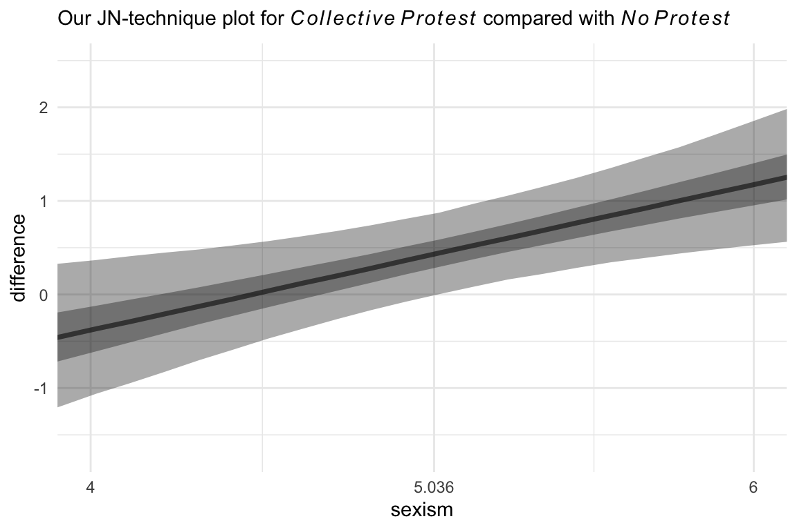
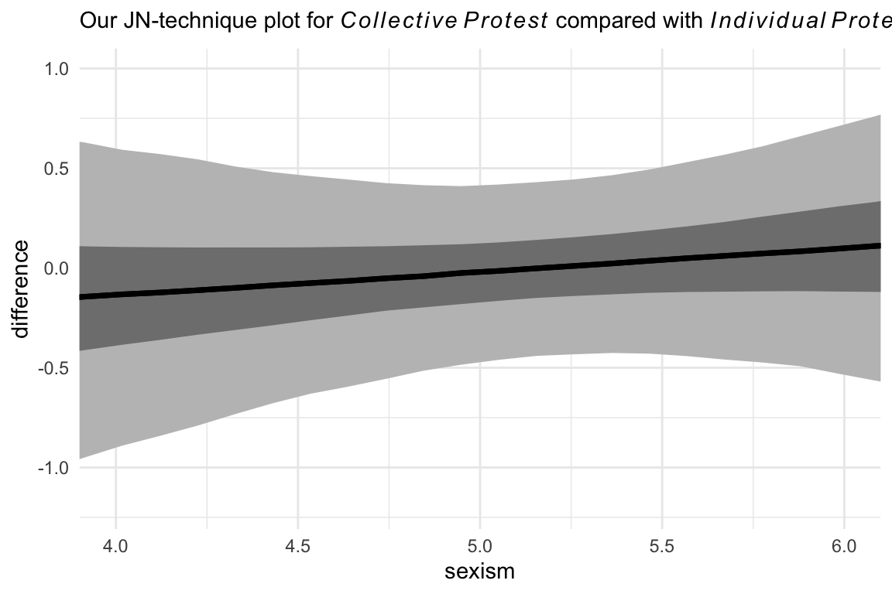

# Multicategorical Focal Antecedents and Moderators


> In this chapter, [Hayes] extend[ed] the principles of moderation analysis described in Chapters 7 and 8 to testing interaction involving a multicategorical focal antecedent variable or moderator. As you will see, the principles discussed in those chapters generalize quite readily, although the model necessarily requires more than one product to capture an interaction between two variables. This makes the formulas a bit more complex, and the visualizing and probing process a bit more involved. But with comfort with the fundamentals described so far, you should not find it difficult to master this extension of multiple regression analysis. [@hayesIntroductionMediationModeration2018, p. 350]

## Moderation of the effect of a multicategorical antecedent variable

Take the case of a continuous or dichotomous moderator $W$ and a multicategorical $X$ "with $g$ groups, include $g − 1$ variables coding membership in the groups, the moderator variable $W$, and $g − 1$ products between the $g − 1$ group codes and moderator $W$ in a regression model" (p. 351) following the form

$$
Y = i_Y + \sum_{i = 1}^{g - 1} b_i D_i + b_g W + \sum_{j = g + 1}^{2g - 1} b_j D_{j - g} W + e_Y,
$$

where $D_i$ denotes the $i$^th^ dummy variable. Given the case where $g = 4$, that formula can be re-expressed as

\begin{align*}
Y & = i_Y + b_1 D_1 + b_2 D_2 + b_3 D_3 + b_4 W + 
b_5 D_1 W + b_6 D_2 W + b_7 D_3 W + e_Y, \;\;\;\text{or} \\ 
& = i_Y + (b_1 + b_5 W) D_1 + (b_2 + b_6 W) D_2 + (b_3 + b_7 W) D_3 + b_4 W + e_Y.
\end{align*}

## An example from the sex disrimination in the workplace study

Here we load a couple necessary packages, load the data, and take a `glimpse()`.


```r
library(tidyverse)

protest <- read_csv("data/protest/protest.csv")

glimpse(protest)
```

```
## Rows: 129
## Columns: 6
## $ subnum   <dbl> 209, 44, 124, 232, 30, 140, 27, 64, 67, 182, 85, 109, 122, 69, 45, 28, 170, 66, 1…
## $ protest  <dbl> 2, 0, 2, 2, 2, 1, 2, 0, 0, 0, 2, 2, 0, 1, 1, 0, 1, 2, 2, 1, 2, 1, 1, 2, 2, 0, 1, …
## $ sexism   <dbl> 4.87, 4.25, 5.00, 5.50, 5.62, 5.75, 5.12, 6.62, 5.75, 4.62, 4.75, 6.12, 4.87, 5.8…
## $ angry    <dbl> 2, 1, 3, 1, 1, 1, 2, 1, 6, 1, 2, 5, 2, 1, 1, 1, 2, 1, 3, 4, 1, 1, 1, 5, 1, 5, 1, …
## $ liking   <dbl> 4.83, 4.50, 5.50, 5.66, 6.16, 6.00, 4.66, 6.50, 1.00, 6.83, 5.00, 5.66, 5.83, 6.5…
## $ respappr <dbl> 4.25, 5.75, 4.75, 7.00, 6.75, 5.50, 5.00, 6.25, 3.00, 5.75, 5.25, 7.00, 4.50, 6.2…
```

With a little `if_else()`, computing the dummies `d1` and `d2` is easy enough.


```r
protest <-
  protest %>% 
  mutate(d1 = if_else(protest == 1, 1, 0),
         d2 = if_else(protest == 2, 1, 0))
```

Load **brms**.


```r
library(brms)
```

With `model10.1` and `model10.2` we fit the multicategorical multivariable model and the multicategorical moderation models, respectively.


```r
model10.1 <-
  brm(data = protest, 
      family = gaussian,
      liking ~ 1 + d1 + d2 + sexism,
      cores = 4,
      file = "fits/model10.01")

model10.2 <-
  update(model10.1,
         newdata = protest,
         liking ~ 1 + d1 + d2 + sexism + d1:sexism + d2:sexism,
         cores = 4,
         file = "fits/model10.02")
```

Behold the $R^2$ summaries.


```r
r2 <-
  tibble(`Model 10.1` = bayes_R2(model10.1, summary = F)[, 1],
         `Model 10.2` = bayes_R2(model10.2, summary = F)[, 1]) %>% 
  mutate(`The R2 difference` = `Model 10.2` - `Model 10.1`)
  
r2 %>% 
  pivot_longer(everything())  %>% 
  # this line isn't necessary, but it sets the order the summaries appear in
  mutate(name = factor(name, levels = c("Model 10.1", "Model 10.2", "The R2 difference"))) %>% 
  group_by(name) %>% 
  summarize(mean   = mean(value),
            median = median(value),
            ll     = quantile(value, probs = .025),
            ul     = quantile(value,  probs = .975)) %>% 
  mutate_if(is.double, round, digits = 3)
```

```
## # A tibble: 3 x 5
##   name               mean median     ll    ul
##   <fct>             <dbl>  <dbl>  <dbl> <dbl>
## 1 Model 10.1        0.071  0.066  0.012 0.156
## 2 Model 10.2        0.156  0.154  0.065 0.26 
## 3 The R2 difference 0.085  0.086 -0.033 0.21
```

Interestingly, even though our posterior means and medians for the model-specific $R^2$ values differed some from the OLS estimates in the text, their difference corresponded quite nicely to the one in the text. Let's take a look at their distributions.


```r
r2 %>% 
  pivot_longer(everything()) %>% 
  ggplot(aes(x = value)) +
  geom_density(size = 0, fill = "grey33") +
  scale_y_continuous(NULL, breaks = NULL) +
  facet_wrap(~ name, scales = "free_y") +
  theme_minimal()
```


The model coefficient summaries cohere well with those in Table 10.1.


```r
print(model10.1, digits = 3)
```

```
##  Family: gaussian 
##   Links: mu = identity; sigma = identity 
## Formula: liking ~ 1 + d1 + d2 + sexism 
##    Data: protest (Number of observations: 129) 
## Samples: 4 chains, each with iter = 2000; warmup = 1000; thin = 1;
##          total post-warmup samples = 4000
## 
## Population-Level Effects: 
##           Estimate Est.Error l-95% CI u-95% CI  Rhat Bulk_ESS Tail_ESS
## Intercept    4.771     0.616    3.589    6.010 1.002     5284     3301
## d1           0.500     0.233    0.057    0.969 1.000     3991     3092
## d2           0.450     0.226    0.009    0.891 1.000     4294     3079
## sexism       0.106     0.117   -0.127    0.333 1.001     5157     3186
## 
## Family Specific Parameters: 
##       Estimate Est.Error l-95% CI u-95% CI  Rhat Bulk_ESS Tail_ESS
## sigma    1.043     0.066    0.923    1.175 1.001     4272     3009
## 
## Samples were drawn using sampling(NUTS). For each parameter, Bulk_ESS
## and Tail_ESS are effective sample size measures, and Rhat is the potential
## scale reduction factor on split chains (at convergence, Rhat = 1).
```

```r
print(model10.2, digits = 3)
```

```
##  Family: gaussian 
##   Links: mu = identity; sigma = identity 
## Formula: liking ~ d1 + d2 + sexism + d1:sexism + d2:sexism 
##    Data: protest (Number of observations: 129) 
## Samples: 4 chains, each with iter = 2000; warmup = 1000; thin = 1;
##          total post-warmup samples = 4000
## 
## Population-Level Effects: 
##           Estimate Est.Error l-95% CI u-95% CI  Rhat Bulk_ESS Tail_ESS
## Intercept    7.694     1.070    5.638    9.815 1.000     1499     1833
## d1          -4.091     1.530   -7.090   -1.051 1.000     1467     1701
## d2          -3.477     1.408   -6.179   -0.709 1.000     1451     1949
## sexism      -0.470     0.208   -0.883   -0.072 1.000     1492     1809
## d1:sexism    0.894     0.294    0.316    1.477 1.000     1454     1764
## d2:sexism    0.776     0.275    0.248    1.309 1.000     1460     1870
## 
## Family Specific Parameters: 
##       Estimate Est.Error l-95% CI u-95% CI  Rhat Bulk_ESS Tail_ESS
## sigma    1.006     0.066    0.888    1.151 1.000     2613     2471
## 
## Samples were drawn using sampling(NUTS). For each parameter, Bulk_ESS
## and Tail_ESS are effective sample size measures, and Rhat is the potential
## scale reduction factor on split chains (at convergence, Rhat = 1).
```

## Visualizing the model

To get our version of the values in Table 10.2, we'll first recreate columns for $d_1$ through $W$ (SEXISM) and save then as a tibble, `nd`.


```r
(
  nd <-
  tibble(d1 = c(0, 1, 0),
         d2 = c(0, 0, 1)) %>% 
    expand(nesting(d1, d2),
           sexism = quantile(protest$sexism, probs = c(.16, .5, .84)))
  )
```

```
## # A tibble: 9 x 3
##      d1    d2 sexism
##   <dbl> <dbl>  <dbl>
## 1     0     0   4.31
## 2     0     0   5.12
## 3     0     0   5.87
## 4     0     1   4.31
## 5     0     1   5.12
## 6     0     1   5.87
## 7     1     0   4.31
## 8     1     0   5.12
## 9     1     0   5.87
```

With `nd` in hand, we'll feed the predictor values into `fitted()` for the typical posterior summaries.


```r
fitted(model10.2, newdata = nd) %>% round(digits = 3)
```

```
##       Estimate Est.Error  Q2.5 Q97.5
##  [1,]    5.671     0.225 5.225 6.104
##  [2,]    5.290     0.156 4.988 5.601
##  [3,]    4.938     0.226 4.489 5.391
##  [4,]    5.537     0.203 5.133 5.930
##  [5,]    5.785     0.152 5.486 6.091
##  [6,]    6.015     0.219 5.578 6.445
##  [7,]    5.432     0.249 4.940 5.928
##  [8,]    5.776     0.160 5.459 6.088
##  [9,]    6.095     0.203 5.697 6.492
```

The values in our `Estimate` column correspond to those in the $\hat Y$ column in the table. We, of course, add summaries of uncertainty to the point estimates.

If we want to make a decent line plot for our version of Figure 10.3, we'll need many more values for `sexism`, which will appear on the $x$-axis.


```r
nd <-
  tibble(d1 = c(0, 1, 0),
         d2 = c(0, 0, 1)) %>% 
  expand(nesting(d1, d2),
         sexism = seq(from = 3.5, to = 6.5, length.out = 30))
```

This time we'll save the results from `fitted()` as a tlbble and wrangle a bit to get ready for the plot.


```r
f <- 
  fitted(model10.2, 
         newdata = nd, 
         probs = c(.025, .25, .75, .975)) %>% 
  data.frame() %>% 
  bind_cols(nd) %>% 
  mutate(condition = if_else(d1 == 1, "Individual Protest",
                             if_else(d2 == 1, "Collective Protest", "No Protest"))) %>% 
  # this line is not necessary, but it will help order the facets of the plot
  mutate(condition = factor(condition, levels = c("No Protest", "Individual Protest", "Collective Protest"))) 

glimpse(f)
```

```
## Rows: 90
## Columns: 10
## $ Estimate  <dbl> 6.050493, 6.001914, 5.953336, 5.904758, 5.856180, 5.807601, 5.759023, 5.710445, …
## $ Est.Error <dbl> 0.3653449, 0.3460231, 0.3269753, 0.3082520, 0.2899163, 0.2720464, 0.2547406, 0.2…
## $ Q2.5      <dbl> 5.328209, 5.324293, 5.314224, 5.300169, 5.284162, 5.264836, 5.250654, 5.240870, …
## $ Q25       <dbl> 5.798930, 5.762295, 5.726087, 5.689122, 5.653504, 5.618733, 5.581046, 5.546334, …
## $ Q75       <dbl> 6.302794, 6.238915, 6.179077, 6.116206, 6.054327, 5.992865, 5.930719, 5.872689, …
## $ Q97.5     <dbl> 6.769590, 6.683770, 6.596054, 6.504766, 6.422166, 6.338107, 6.256257, 6.169473, …
## $ d1        <dbl> 0, 0, 0, 0, 0, 0, 0, 0, 0, 0, 0, 0, 0, 0, 0, 0, 0, 0, 0, 0, 0, 0, 0, 0, 0, 0, 0,…
## $ d2        <dbl> 0, 0, 0, 0, 0, 0, 0, 0, 0, 0, 0, 0, 0, 0, 0, 0, 0, 0, 0, 0, 0, 0, 0, 0, 0, 0, 0,…
## $ sexism    <dbl> 3.500000, 3.603448, 3.706897, 3.810345, 3.913793, 4.017241, 4.120690, 4.224138, …
## $ condition <fct> No Protest, No Protest, No Protest, No Protest, No Protest, No Protest, No Prote…
```

For Figure 10.3 and many to follow for this chapter, we'll superimpose 50% intervals on top of 95% intervals.


```r
# this will help us add the original data points to the plot
protest <-
  protest %>% 
  mutate(condition = ifelse(protest == 0, "No Protest",
                            ifelse(protest == 1, "Individual Protest", 
                                   "Collective Protest"))) %>% 
  mutate(condition = factor(condition, levels = c("No Protest", "Individual Protest", "Collective Protest"))) 
  

# this will help us with the x-axis
breaks <-
  tibble(values = quantile(protest$sexism, probs = c(.16, .5, .84))) %>% 
  mutate(labels = values %>% round(digits = 2) %>% as.character())

# Here we plot
f %>% 
  ggplot(aes(x = sexism)) +
  geom_ribbon(aes(ymin = Q2.5, ymax = Q97.5),
              alpha = 1/3) +
  geom_ribbon(aes(ymin = Q25, ymax = Q75),
              alpha = 1/3) +
  geom_line(aes(y = Estimate)) +
  geom_point(data = protest,
             aes(y = liking),
             size = 2/3) +
  scale_x_continuous(breaks = breaks$values,
                     labels = breaks$labels) +
  coord_cartesian(xlim = c(4, 6),
                  ylim = c(2.5, 7.2)) +
  labs(x = expression(paste("Perceived Pervasiveness of Sex Discrimination in Society (", italic(W), ")")),
       y = "Evaluation of the Attorney") +
  theme_minimal() +
  facet_wrap(~ condition)
```


By adding the data to the plots, they are both more informative and now serve as a posterior predictive check.

## Probing the interaction

These will involve both omnibus tests and pairwise comparisons.

### The pick-a-point approach.

"The pick-a-point approach requires you to choose values of the moderator $W$ and then estimate the conditional effect of $X$ on $Y$ at those values and ~~conduct an inferential test~~" [evaluate the posterior distribution] (p. 368).

#### Omnibus inference.

Hayes used the omnibus testing framework to assess how important coefficients $b_1$ and $b_2$ were to our interaction model, `model1`. Before fitting the models, he discussed why he preferred to fit models after centering `sexism` (i.e., $W$) to 4.25. Here we'll call our centered variable `sexism_p`, where `_p` stands in for "prime".


```r
protest <-
  protest %>% 
  mutate(sexism_p = sexism - 4.25)
```

From here on, `model10.3` is the moderation model without the lower-order `d1` and `d2` terms; `model10.4` is the full moderation model. But we're going to be fitting both these models three different ways, based on how we center` sexism`. So for this first set where we centered `sexism` on 4.25, we'll give them the suffix `a`.


```r
# the model without d1 + d2
model10.3a <-
  update(model10.2,
         newdata = protest,
         liking ~ 1 + sexism_p + d1:sexism_p + d2:sexism_p,
         cores = 4,
         file = "fits/model10.03a")

# the full model with d1 + d2
model10.4a <-
  update(model10.2,
         newdata = protest,
         liking ~ 1 + d1 + d2 + sexism_p + d1:sexism_p + d2:sexism_p,
         cores = 4,
         file = "fits/model10.04a")
```

The coefficient summaries for `model10.4a` correspond to the top section of Table 10.3 (p. 373).


```r
fixef(model10.4a) %>% round(digits = 3)
```

```
##             Estimate Est.Error   Q2.5  Q97.5
## Intercept      5.706     0.237  5.243  6.164
## d1            -0.301     0.345 -0.988  0.366
## d2            -0.191     0.315 -0.822  0.424
## sexism_p      -0.481     0.208 -0.892 -0.059
## d1:sexism_p    0.907     0.295  0.341  1.485
## d2:sexism_p    0.787     0.277  0.240  1.310
```

We can compare their Bayesian $R^2$ distributions like we usually do.


```r
library(tidybayes)

r2 <-
  tibble(`Model without d1 + d2` = bayes_R2(model10.3a, summary = F)[, 1],
         `Model with d1 + d2`    = bayes_R2(model10.4a, summary = F)[, 1]) %>% 
  mutate(`The R2 difference` = `Model with d1 + d2` - `Model without d1 + d2`)
  
r2 %>% 
  gather() %>% 
  mutate(key = factor(key, levels = c("Model without d1 + d2", "Model with d1 + d2", "The R2 difference"))) %>% 
  group_by(key) %>% 
  median_qi(value) %>% 
  mutate_if(is.double, round, digits = 3)
```

```
## # A tibble: 3 x 7
##   key                   value .lower .upper .width .point .interval
##   <fct>                 <dbl>  <dbl>  <dbl>  <dbl> <chr>  <chr>    
## 1 Model without d1 + d2 0.141  0.049  0.24    0.95 median qi       
## 2 Model with d1 + d2    0.156  0.063  0.258   0.95 median qi       
## 3 The R2 difference     0.015 -0.127  0.152   0.95 median qi
```

Our results differ a bit from those in the text (p. 370), but the substantive interpretation is the same. The `d1` and `d2` parameters added little predictive power to the model in terms of $R^2$. We can also use information criteria to compare the models. Here are the results from using the LOO-CV.


```r
model10.3a <- add_criterion(model10.3a, "loo")
model10.4a <- add_criterion(model10.4a, "loo")

loo_compare(model10.3a, model10.4a) %>% 
  print(simplify = F)
```

```
##            elpd_diff se_diff elpd_loo se_elpd_loo p_loo  se_p_loo looic  se_looic
## model10.3a    0.0       0.0  -185.9     11.0         6.5    1.9    371.9   22.0  
## model10.4a   -1.5       0.8  -187.4     10.9         8.0    2.0    374.8   21.8
```

The LOO-CV difference between the two models was pretty small. Thus, the LOO-CV gives the same general message as the $R^2$. The `d1` and `d2` parameters were sufficiently small and uncertain enough that constraining them to zero did little in terms of reducing the explanatory power of the statistical model.

Here's the same thing all over again, but this time after centering `sexism` on 5.120.


```r
protest <-
  protest %>% 
  mutate(sexism_p = sexism - 5.120)
```

Now fit the models.


```r
# the model without d1 + d2
model10.3b <-
  update(model10.2,
         newdata = protest,
         liking ~ 1 + sexism_p + d1:sexism_p + d2:sexism_p,
         cores = 4,
         file = "fits/model10.03b")

# the full model with d1 + d2
model10.4b <-
  update(model10.2,
         newdata = protest,
         liking ~ 1 + d1 + d2 + sexism_p + d1:sexism_p + d2:sexism_p,
         cores = 4,
         file = "fits/model10.04b")
```

These coefficient summaries correspond to the middle section of Table 10.3 (p. 373).


```r
fixef(model10.4b) %>% round(digits = 3)
```

```
##             Estimate Est.Error   Q2.5  Q97.5
## Intercept      5.286     0.156  4.974  5.592
## d1             0.486     0.220  0.055  0.926
## d2             0.495     0.222  0.060  0.934
## sexism_p      -0.470     0.202 -0.867 -0.082
## d1:sexism_p    0.898     0.289  0.340  1.456
## d2:sexism_p    0.777     0.269  0.246  1.290
```

Here are the Bayesian $R^2$ summaries and the summary for their difference.


```r
r2 <-
  tibble(`Model without d1 + d2` = bayes_R2(model10.3b, summary = F)[, 1],
         `Model with d1 + d2`    = bayes_R2(model10.4b, summary = F)[, 1]) %>%
  mutate(`The R2 difference` = `Model with d1 + d2` - `Model without d1 + d2`)

r2 %>% 
  pivot_longer(everything()) %>% 
  mutate(name = factor(name, levels = c("Model without d1 + d2", "Model with d1 + d2", "The R2 difference"))) %>% 
  group_by(name) %>% 
  median_qi(value) %>% 
  mutate_if(is.double, round, digits = 3)
```

```
## # A tibble: 3 x 7
##   name                  value .lower .upper .width .point .interval
##   <fct>                 <dbl>  <dbl>  <dbl>  <dbl> <chr>  <chr>    
## 1 Model without d1 + d2 0.1    0.028  0.194   0.95 median qi       
## 2 Model with d1 + d2    0.155  0.065  0.253   0.95 median qi       
## 3 The R2 difference     0.055 -0.078  0.178   0.95 median qi
```

This time, our $\Delta R^2$ distribution was more similar to the results Hayes reported in the text (p. 370, toward the bottom).

Here's the updated LOO-CV.


```r
model10.3b <- add_criterion(model10.3b, "loo")
model10.4b <- add_criterion(model10.4b, "loo")

loo_compare(model10.3b, model10.4b) %>% 
  print(simplify = F)
```

```
##            elpd_diff se_diff elpd_loo se_elpd_loo p_loo  se_p_loo looic  se_looic
## model10.4b    0.0       0.0  -187.2     10.9         7.7    1.9    374.3   21.7  
## model10.3b   -1.6       3.1  -188.8     11.9         6.2    2.0    377.6   23.9
```

Here again our Bayesian $R^2$ and `loo()` results cohere, both suggesting the `d1` and `d2` parameters were of little predictive utility. Note how this differs a little from the second $F$-test on page 370.

Here's what happens when we center `sexism` on 5.896. First center.


```r
protest <-
  protest %>% 
  mutate(sexism_p = sexism - 5.896)
```

Fit the models.


```r
# the model without d1 + d2
model10.3c <-
  update(model10.2,
         newdata = protest,
         liking ~ 1 + sexism_p + d1:sexism_p + d2:sexism_p,
         cores = 4,
         file = "fits/model10.03c")

# the full model with d1 + d2
model10.4c <-
  update(model10.2,
         newdata = protest,
         liking ~ 1 + d1 + d2 + sexism_p + d1:sexism_p + d2:sexism_p,
         cores = 4,
         file = "fits/model10.04c")
```

These coefficient summaries correspond to the lower section of Table 10.3 (p. 373).


```r
fixef(model10.4c) %>% round(digits = 3)
```

```
##             Estimate Est.Error   Q2.5  Q97.5
## Intercept      4.917     0.231  4.469  5.374
## d1             1.188     0.307  0.593  1.781
## d2             1.104     0.317  0.492  1.736
## sexism_p      -0.479     0.208 -0.892 -0.076
## d1:sexism_p    0.908     0.292  0.323  1.490
## d2:sexism_p    0.787     0.278  0.262  1.365
```

Again, compute the $R^2$ distributions and their difference-score distribution.


```r
r2 <-
  tibble(`Model without d1 + d2` = bayes_R2(model10.3c, summary = F)[, 1],
         `Model with d1 + d2`    = bayes_R2(model10.4c, summary = F)[, 1]) %>%
  mutate(`The R2 difference` = `Model with d1 + d2` - `Model without d1 + d2`)

r2 %>% 
  pivot_longer(everything()) %>% 
  mutate(name = factor(name, levels = c("Model without d1 + d2", "Model with d1 + d2", "The R2 difference"))) %>% 
  group_by(name) %>% 
  median_qi(value) %>% 
  mutate_if(is.double, round, digits = 3)
```

```
## # A tibble: 3 x 7
##   name                  value .lower .upper .width .point .interval
##   <fct>                 <dbl>  <dbl>  <dbl>  <dbl> <chr>  <chr>    
## 1 Model without d1 + d2 0.027  0.002  0.094   0.95 median qi       
## 2 Model with d1 + d2    0.156  0.064  0.257   0.95 median qi       
## 3 The R2 difference     0.125  0.013  0.231   0.95 median qi
```

That $\Delta R^2$ distribution matches up nicely with the one Hayes reported at the bottom of page 370. Now compare the models with the LOO.


```r
model10.3c <- add_criterion(model10.3c, "loo")
model10.4c <- add_criterion(model10.4c, "loo")

loo_compare(model10.3c, model10.4c) %>% 
  print(simplify = F)
```

```
##            elpd_diff se_diff elpd_loo se_elpd_loo p_loo  se_p_loo looic  se_looic
## model10.4c    0.0       0.0  -187.3     10.9         7.9    1.9    374.7   21.8  
## model10.3c   -6.5       5.6  -193.8     13.4         5.8    1.9    387.6   26.7
```

Although our Bayesian $R^2$ difference is now predominantly positive, the LOO-CV difference for the two models remains uncertain. Here's a look at the two parameters in question using a handmade coefficient plot.


```r
posterior_samples(model10.4c) %>% 
  pivot_longer(b_d1:b_d2) %>% 
  mutate(name = str_remove(name, "b_")) %>% 
  
  ggplot(aes(x = value, y = name)) +
  stat_summary(fun = median,
               fun.min = function(i) quantile(i, probs = .025),
               fun.max = function(i) quantile(i, probs = .975),
               color = "grey33") +
  stat_summary(geom = "linerange",
               fun.min = function(i) quantile(i, probs = .25),
               fun.max = function(i) quantile(i, probs = .75),
               color = "grey33",
               size = 1.25) +
  ylab(NULL) +
  coord_cartesian(xlim = c(0, 2)) +
  theme_minimal()
```


For Figure 10.4, we'll drop our faceting approach and just make one big plot. Heads up: I'm going to drop the 50% intervals from this plot. They'd just make it too busy.


```r
f %>% 
  ggplot(aes(x = sexism, y = Estimate, ymin = Q2.5, ymax = Q97.5, alpha = condition)) +
  geom_ribbon() +
  geom_line() +
  scale_alpha_manual(values = c(.2, .5, .8)) +
  scale_x_continuous(breaks = breaks$values,
                     labels = breaks$labels) +
  coord_cartesian(xlim = c(4, 6),
                  ylim = c(4.5, 6.7)) +
  labs(x = expression("Perceived Pervasiveness of Sex Discrimination in Society "*(italic(W))),
       y = "Evaluation of the Attorney") +
  theme_minimal() +
  theme(legend.direction = "vertical",
        legend.position = "top",
        legend.title = element_blank())
```


#### Pairwise inference.

Hayes continues to reference Table 10.3. In the last subsection, we reproduced those results one model at a time. Why not practice doing it altogether? There are a lot of ways you could do this. A good first try is to extend the `fixef()` approach from before with a little help from `bind_rows()`.


```r
bind_rows(
  # start with `model4a`
  fixef(model10.4a) %>% 
    data.frame() %>% 
    rownames_to_column("parameter"),
  # add `model4b`
  fixef(model10.4b) %>% 
    data.frame() %>% 
    rownames_to_column("parameter"),
  # add `model4c`
  fixef(model10.4c) %>% 
    data.frame() %>% 
    rownames_to_column("parameter")
) %>% 
  # wrangle a bit
  mutate(`w'` = str_c("w - ", c(4.25, 5.12, 5.896)) %>% rep(., each = 6)) %>% 
  select(`w'`, everything()) %>% 
  mutate_if(is.double, round, digits = 3)
```

```
##           w'   parameter Estimate Est.Error   Q2.5  Q97.5
## 1   w - 4.25   Intercept    5.706     0.237  5.243  6.164
## 2   w - 4.25          d1   -0.301     0.345 -0.988  0.366
## 3   w - 4.25          d2   -0.191     0.315 -0.822  0.424
## 4   w - 4.25    sexism_p   -0.481     0.208 -0.892 -0.059
## 5   w - 4.25 d1:sexism_p    0.907     0.295  0.341  1.485
## 6   w - 4.25 d2:sexism_p    0.787     0.277  0.240  1.310
## 7   w - 5.12   Intercept    5.286     0.156  4.974  5.592
## 8   w - 5.12          d1    0.486     0.220  0.055  0.926
## 9   w - 5.12          d2    0.495     0.222  0.060  0.934
## 10  w - 5.12    sexism_p   -0.470     0.202 -0.867 -0.082
## 11  w - 5.12 d1:sexism_p    0.898     0.289  0.340  1.456
## 12  w - 5.12 d2:sexism_p    0.777     0.269  0.246  1.290
## 13 w - 5.896   Intercept    4.917     0.231  4.469  5.374
## 14 w - 5.896          d1    1.188     0.307  0.593  1.781
## 15 w - 5.896          d2    1.104     0.317  0.492  1.736
## 16 w - 5.896    sexism_p   -0.479     0.208 -0.892 -0.076
## 17 w - 5.896 d1:sexism_p    0.908     0.292  0.323  1.490
## 18 w - 5.896 d2:sexism_p    0.787     0.278  0.262  1.365
```

This code works okay, but it's redundant. Here's a streamlined approach where we use a combination of nested tibbles and the `purrr::map()` function to work with our three model fits--`model10.4a`, `model10.4b`, and `model10.4c`--in bulk.


```r
t <-
  tibble(`w'` = str_c("w - ", c(4.25, 5.12, 5.896)),
         name = str_c("model10.4", letters[1:3])) %>% 
  mutate(fit = map(name, get)) %>% 
  mutate(s = map(fit, ~fixef(.) %>% 
                   data.frame() %>% 
                   rownames_to_column("parameter"))) %>% 
  unnest(s) %>% 
  select(`w'`, parameter:Q97.5)

t %>% 
  mutate_if(is.double, round, digits = 3)
```

```
## # A tibble: 18 x 6
##    `w'`      parameter   Estimate Est.Error   Q2.5  Q97.5
##    <chr>     <chr>          <dbl>     <dbl>  <dbl>  <dbl>
##  1 w - 4.25  Intercept      5.71      0.237  5.24   6.16 
##  2 w - 4.25  d1            -0.301     0.345 -0.988  0.366
##  3 w - 4.25  d2            -0.191     0.315 -0.822  0.424
##  4 w - 4.25  sexism_p      -0.481     0.208 -0.892 -0.059
##  5 w - 4.25  d1:sexism_p    0.907     0.295  0.341  1.48 
##  6 w - 4.25  d2:sexism_p    0.787     0.277  0.24   1.31 
##  7 w - 5.12  Intercept      5.29      0.156  4.97   5.59 
##  8 w - 5.12  d1             0.486     0.22   0.055  0.926
##  9 w - 5.12  d2             0.495     0.222  0.06   0.934
## 10 w - 5.12  sexism_p      -0.47      0.202 -0.867 -0.082
## 11 w - 5.12  d1:sexism_p    0.898     0.289  0.34   1.46 
## 12 w - 5.12  d2:sexism_p    0.777     0.269  0.246  1.29 
## 13 w - 5.896 Intercept      4.92      0.231  4.47   5.37 
## 14 w - 5.896 d1             1.19      0.307  0.593  1.78 
## 15 w - 5.896 d2             1.10      0.317  0.492  1.74 
## 16 w - 5.896 sexism_p      -0.479     0.208 -0.892 -0.076
## 17 w - 5.896 d1:sexism_p    0.908     0.292  0.323  1.49 
## 18 w - 5.896 d2:sexism_p    0.787     0.278  0.262  1.36
```

Summary tables like this are precise and very common in the literature. But you can get lost in all those numbers. A coefficient plot can be better. This first version is pretty close to the Table 10.3 format.


```r
t %>% 
  # this will help us order our y-axis
  mutate(parameter = factor(parameter,
                            levels = c("d2:sexism_p", "d1:sexism_p", 
                                       "sexism_p", "d2", "d1", "Intercept")),
         # this is just for aesthetics
         `w'` = str_c("w' = ", `w'`)) %>% 
  
  # plot!
  ggplot(aes(x = Estimate, xmin = Q2.5, xmax = Q97.5, y = parameter)) +
  geom_pointrange() +
  labs(x = NULL,
       y = NULL) +
  theme_minimal() +
  theme(axis.text.y = element_text(hjust = 0)) +
  facet_wrap(~ `w'`, nrow = 1)
```


Notice how this arrangement makes it easiest to compare coefficients within models. If we wanted to make it easier to compare coefficients across models, we might arrange the plot like so.


```r
t %>% 
  # this will help us order our y-axis
  mutate(parameter = factor(parameter,
                            levels = c("Intercept", "d1", "d2", "sexism_p", "d1:sexism_p", "d2:sexism_p"))) %>% 
  
  # plot!
  ggplot(aes(x = Estimate, xmin = Q2.5, xmax = Q97.5, y = `w'`)) +
  geom_pointrange() +
  labs(x = NULL,
       y = NULL) +
  theme_minimal() +
  theme(axis.text.y = element_text(hjust = 0)) +
  facet_wrap(~ parameter, ncol = 1)
```


Oh man--with sweet plots like these, who needs tables! This makes it much easier to see what happened as we changed values we centered `sexism` on. In the middle paragraph on page 374, Hayes pointed out "that $b_1$ and $b_2$ differ in these analyses, but $b_3$, $b_4$, and $b_5$ are unaffected by the centering". Our coefficient plot clarified that in a way I don't think a table ever could. But before we move on, let's back up a little in the text.

"To make this more concrete, consider the effect of Catherine's behavior on how she is perceived among people who are relatively high in their perceptions of the pervasiveness of sex discrimination in society" (p. 372). For this, Hayes defined "relatively high" as $W = 5.896$. To get those estimates for each condition, we'll use `fitted()`. Since the number of unique predictor values is small for this example, we'll just plug them directly into the `newdata` argument rather than first saving them as a `nd` object.


```r
fitted(model10.2,
       newdata = tibble(d1 = c(0, 1, 0),
                        d2 = c(0, 0, 1),
                        sexism = 5.896)) %>% 
  round(digits = 3)
```

```
##      Estimate Est.Error  Q2.5 Q97.5
## [1,]    4.925     0.230 4.472 5.387
## [2,]    6.106     0.206 5.704 6.513
## [3,]    6.023     0.223 5.580 6.462
```

Those posterior summaries match up nicely with the point estimates Hayes presented at the bottom of page 372. Hayes further expounded:

> So by using the regression centering strategy described earlier in the context of an omnibus test of equality of values of $\hat Y$, the regression coefficients $b_1$ and $b_2$ provide pairwise inferences consistent with the coding system used to represent the three groups, conditioned on the value that $W$ is centered around.

In the next few sentences, he focused on what happened when $W = 4.250$ (i.e., in `model4a`). Recall that the two coefficients in question, $b_1$ and $b_2$, are named `d1` and `d2` when we pull their summaries with `fixef()`.


```r
fixef(model10.4a)[c("d1", "d2"), ] %>% 
  round(digits = 3)
```

```
##    Estimate Est.Error   Q2.5 Q97.5
## d1   -0.301     0.345 -0.988 0.366
## d2   -0.191     0.315 -0.822 0.424
```

Hayes then clarified that in this model

\begin{align*}
b_1 & = \theta_{D_1 \rightarrow Y} | (W = 4.250) = 5.400 - 5.698 = -0.299 \;\;\; \text{ and} \\
b_2 & = \theta_{D_2 \rightarrow Y} | (W = 4.250) = 5.513 - 5.698 = -0.185.
\end{align*}

That is, it is the same as a difference score of each of the experimental conditions minus the "No protest" condition. To further show the difference-score quality of these coefficients, we can continue using `fitted()` in conjunction with the original `model10.2` to get the group comparisons for when $W = 4.250$. Since these involve computing difference scores, we'll have to use `summary = F` and do some wrangling.


```r
fitted(model10.2,
       newdata = tibble(d1     = c(0, 1, 0),
                        d2     = c(0, 0, 1),
                        sexism = 4.25),
       summary = F) %>% 
  data.frame() %>% 
  set_names("No Protest", "Individual Protest", "Collective Protest") %>% 
  mutate(difference_a = `Individual Protest` - `No Protest`,
         difference_b = `Collective Protest` - `No Protest`) %>% 
  pivot_longer(everything()) %>% 
  mutate(name = factor(name, levels = c("No Protest", "Individual Protest", "Collective Protest", 
                                        "difference_a", "difference_b"))) %>% 
  group_by(name) %>% 
  mean_qi(value) %>%
  select(name:.upper) %>% 
  mutate_if(is.double, round, digits = 3)
```

```
## # A tibble: 5 x 4
##   name                value .lower .upper
##   <fct>               <dbl>  <dbl>  <dbl>
## 1 No Protest          5.70   5.23   6.15 
## 2 Individual Protest  5.41   4.89   5.92 
## 3 Collective Protest  5.52   5.10   5.93 
## 4 difference_a       -0.291 -0.96   0.39 
## 5 difference_b       -0.179 -0.795  0.454
```

Within simulation variance, `difference_a` is the same as $b_{1 | \text{model10.4a}}$ and `difference_b` is the same as $b_{2 | \text{model10.4a}}$. Here's the same thing for when $W = 5.120$.


```r
fitted(model10.2,
       newdata = tibble(d1     = c(0, 1, 0),
                        d2     = c(0, 0, 1),
                        sexism = 5.120),
       summary = F) %>% 
  data.frame() %>% 
  set_names("No Protest", "Individual Protest", "Collective Protest") %>% 
  mutate(difference_a = `Individual Protest` - `No Protest`,
         difference_b = `Collective Protest` - `No Protest`) %>% 
  pivot_longer(everything()) %>% 
  mutate(name = factor(name, levels = c("No Protest", "Individual Protest", "Collective Protest",
                                        "difference_a", "difference_b"))) %>% 
  group_by(name) %>% 
  mean_qi(value) %>%
  select(name:.upper) %>% 
  mutate_if(is.double, round, digits = 3)
```

```
## # A tibble: 5 x 4
##   name               value .lower .upper
##   <fct>              <dbl>  <dbl>  <dbl>
## 1 No Protest         5.29   4.99   5.60 
## 2 Individual Protest 5.78   5.46   6.09 
## 3 Collective Protest 5.78   5.49   6.09 
## 4 difference_a       0.487  0.034  0.919
## 5 difference_b       0.496  0.058  0.932
```

Finally, here it is for when $W = 5.986$.


```r
fitted(model10.2,
       newdata = tibble(d1     = c(0, 1, 0),
                        d2     = c(0, 0, 1),
                        sexism = 5.986),
       summary = F) %>% 
  data.frame() %>% 
  set_names("No Protest", "Individual Protest", "Collective Protest") %>% 
  mutate(difference_a = `Individual Protest` - `No Protest`,
         difference_b = `Collective Protest` - `No Protest`) %>% 
  pivot_longer(everything()) %>% 
  mutate(name = factor(name, levels = c("No Protest", "Individual Protest", "Collective Protest", 
                                        "difference_a", "difference_b"))) %>% 
  group_by(name) %>% 
  mean_qi(value) %>%
  select(name:.upper) %>% 
  mutate_if(is.double, round, digits = 3)
```

```
## # A tibble: 5 x 4
##   name               value .lower .upper
##   <fct>              <dbl>  <dbl>  <dbl>
## 1 No Protest          4.88  4.4     5.37
## 2 Individual Protest  6.14  5.72    6.58
## 3 Collective Protest  6.05  5.58    6.52
## 4 difference_a        1.26  0.625   1.93
## 5 difference_b        1.17  0.522   1.84
```

### The Johnson-Neyman technique.

> As discussed in section 7.4, a problem with the pick-a-point approach to probing an interaction is having to choose values of the moderator. When the moderator is a continuum, you may not have any basis for choosing some values rather than others, and the choice you make will certainly influence the results of the probing exercise to some extent... Actively choosing a different system or con- vention, such as using the sample mean of $W$, a standard deviation below the mean, and a standard deviation above the mean also does not eliminate the problem. But the Johnson–Neyman (JN) technique avoids this problem entirely. (p. 376)

#### Omnibus inference.

Consider the first sentence of the section:

> Applied to probing an interaction between a multicategorical $X$ and a continuous $W$, an omnibus version of the JM technique involves finding the value or values of $W$ where their $F$-ratio comparing the $g$ estimated values of $Y$ is just statistically significant. (p. 376)

Since we're not using $F$-tests with our approach to Bayesian modeling, the closest we might have is a series of $R^2$ difference tests, which would require refitting the model multiple times over many ways of centering the $W$-variable, `sexism`. I suppose you could do this if you wanted, but it just seems silly, to me. I'll leave this one up to the interested reader.

#### Pairwise inference.

Hayes didn't make plots for this section, but if you're careful constructing your `nd` and with the subsequent wrangling, you can make the usual plots. Since we have two conditions we'd like to compare with *No Protest*, we'll make two plots. Here's the comparison using *Individual Protest*, first.


```r
nd <-
  tibble(d1 = 0:1,
         d2 = 0) %>% 
  expand(nesting(d1, d2),
         sexism = seq(from = 3.5, to = 6.5, length.out = 30))
```


```r
# the transition value Hayes identified in the text
Hayes_value <- 5.065

# we need some new data
nd <-
  tibble(d1 = 0:1,
         d2 = 0) %>% 
  expand(nesting(d1, d2),
         sexism = seq(from = 3.5, to = 6.5, length.out = 30))

# plug those data into `fitted()`
fitted(model10.2,
       newdata = nd,
       summary = F) %>% 
  # wrangle
  data.frame() %>% 
  gather(key, estimate) %>% 
  bind_cols(
    nd %>% 
      expand(nesting(d1, d2, sexism),
             iter = 1:4000)
  ) %>% 
  mutate(condition = if_else(d1 == 0, "No Protest", "Individual Protest")) %>% 
  select(-c(key, d1:d2)) %>% 
  spread(key = condition, value = estimate) %>% 
  mutate(difference = `Individual Protest` - `No Protest`) %>% 
  
  # plot!
  ggplot(aes(x = sexism, y = difference)) +
  stat_summary(geom = "ribbon",
               fun.min = function(i) quantile(i, probs = .025),
               fun.max = function(i) quantile(i, probs = .975),
               alpha = 1/3) +
  stat_summary(geom = "ribbon",
               fun.min = function(i) quantile(i, probs = .25),
               fun.max = function(i) quantile(i, probs = .75),
               alpha = 1/3) +
  stat_summary(geom = "line",
               fun = median) +
  scale_x_continuous(breaks = c(4, Hayes_value, 6),
                     labels = c("4", Hayes_value, "6")) +
  coord_cartesian(xlim = c(4, 6)) +
  labs(subtitle = expression("Our JN-technique plot for "*italic(Individual~Protest)*" compared with "*italic(No~Protest))) +
  theme_minimal()
```


Now we're ready to compare *No Protest* to *Collective Protest*. The main data difference is which values we assigned to the `d1` and `d2` columns in `nd`. For kicks, we should practice another way to get the median line and interval ribbons. The `stat_summary()` approach from above works great, but it's verbose. The `tidybayes::stat_lineribbon()` function will give us the same results with fewer lines of code.


```r
# the transition value Hayes identified in the text
Hayes_value <- 5.036

# new data
nd <-
  tibble(d1 = 0,
         d2 = 0:1) %>%
  expand(nesting(d1, d2),
         sexism = seq(from = 3.5, to = 6.5, length.out = 30))

# this part is the same as before
fitted(model10.2,
       newdata = nd,
       summary = F) %>% 
  data.frame() %>% 
  mutate(iter = 1:n()) %>% 
  pivot_longer(-iter) %>% 
  mutate(name = str_remove(name, "X") %>% as.double()) %>% 
  arrange(name, iter) %>% 
  bind_cols(expand(nd, nesting(d1, d2, sexism), iter = 1:4000)) %>% 
  # there are some mild differences, here
  mutate(condition = if_else(d2 == 0, "No Protest", "Collective Protest")) %>% 
  select(-c(name, d1:d2)) %>% 
  pivot_wider(names_from = condition, values_from = value) %>% 
  mutate(difference = `Collective Protest` - `No Protest`) %>% 

  # plot!
  ggplot(aes(x = sexism, y = difference)) +
  # look how compact this is!
  stat_lineribbon(.width = c(0.5, 0.95),
                  alpha = 1/3, fill = "black") +
  scale_x_continuous(breaks = c(4, Hayes_value, 6),
                     labels = c("4", Hayes_value, "6")) +
  coord_cartesian(xlim = c(4, 6)) +
  labs(subtitle = expression("Our JN-technique plot for "*italic(Collective~Protest)*" compared with "*italic(No~Protest))) +
  theme_minimal()
```



And here we do it one last time between the two active protest conditions. For good measure, we will continue experimenting with different ways of plotting the results. This time well first summarize the posterior median and intervals with `tidybayes::median_qi()` before plotting. We'll then feed those results into our plot with the aid of `tidybayes::geom_lineribbon()` and a follow-up `scale_fill_manual()` line.


```r
nd <-
  tibble(d1 = 1:0,
         d2 = 0:1) %>%
  expand(nesting(d1, d2),
         sexism = seq(from = 3.5, to = 6.5, length.out = 30))

fitted(model10.2,
       newdata = nd,
       summary = F) %>% 
  data.frame() %>% 
  mutate(iter = 1:n()) %>% 
  pivot_longer(-iter) %>% 
  mutate(name = str_remove(name, "X") %>% as.double()) %>% 
  arrange(name, iter) %>% 
  bind_cols(expand(nd, nesting(d1, d2, sexism), iter = 1:4000)) %>% 
  # there are some mild differences, here
  mutate(condition = if_else(d1 == 0, "Individual Protest", "Collective Protest")) %>% 
  select(-c(name, d1:d2)) %>% 
  pivot_wider(names_from = condition, values_from = value) %>% 
  mutate(difference = `Collective Protest` - `Individual Protest`) %>% 
  # group and summarise, here
  group_by(sexism) %>%
  median_qi(difference, .width = c(.5, .95)) %>% 
  
  # plot!
  ggplot(aes(x = sexism, y = difference, ymin = .lower, ymax = .upper)) +
  # look how simple these two lines are
  geom_lineribbon(show.legend = F) +
  scale_fill_manual(values = c("grey75", "grey50")) +
  coord_cartesian(xlim = c(4, 6)) +
  labs(subtitle = expression("Our JN-technique plot for "*italic(Collective~Protest)*" compared with "*italic(Individual~Protest))) +
  theme_minimal()
```



Little difference between those conditions.

## When the moderator is multicategorical

From a substantive standpoint the combination of

* a multicategorical variable $X$ and a dichotomous or continuous moderator $W$ versus
* a dichotomous or continuous variable $X$ and a multicategorical moderator $W$

might seem different. From a modeling perspective, the difference is trivial. As Hayes pointed out, "when we claim from a statistical test of moderation that $X$'s effect is moderated by $W$, then it is also true that $W$'s effect is moderated by $X$. This is the symmetry property of interactions" (p. 381). This symmetry holds when we're not using the hypothesis-testing framework, too.

### An example.

Just as a refresher, here's the `print()` output for `model2`.


```r
print(model10.2, digits = 3)
```

```
##  Family: gaussian 
##   Links: mu = identity; sigma = identity 
## Formula: liking ~ d1 + d2 + sexism + d1:sexism + d2:sexism 
##    Data: protest (Number of observations: 129) 
## Samples: 4 chains, each with iter = 2000; warmup = 1000; thin = 1;
##          total post-warmup samples = 4000
## 
## Population-Level Effects: 
##           Estimate Est.Error l-95% CI u-95% CI  Rhat Bulk_ESS Tail_ESS
## Intercept    7.694     1.070    5.638    9.815 1.000     1499     1833
## d1          -4.091     1.530   -7.090   -1.051 1.000     1467     1701
## d2          -3.477     1.408   -6.179   -0.709 1.000     1451     1949
## sexism      -0.470     0.208   -0.883   -0.072 1.000     1492     1809
## d1:sexism    0.894     0.294    0.316    1.477 1.000     1454     1764
## d2:sexism    0.776     0.275    0.248    1.309 1.000     1460     1870
## 
## Family Specific Parameters: 
##       Estimate Est.Error l-95% CI u-95% CI  Rhat Bulk_ESS Tail_ESS
## sigma    1.006     0.066    0.888    1.151 1.000     2613     2471
## 
## Samples were drawn using sampling(NUTS). For each parameter, Bulk_ESS
## and Tail_ESS are effective sample size measures, and Rhat is the potential
## scale reduction factor on split chains (at convergence, Rhat = 1).
```

The Bayesian $R^2$:


```r
bayes_R2(model10.2) %>% round(digits = 3)
```

```
##    Estimate Est.Error  Q2.5 Q97.5
## R2    0.156      0.05 0.065  0.26
```

And the $R^2$ difference between this and the model excluding the interaction terms:


```r
tibble(`Model 10.1` = bayes_R2(model10.1, summary = F)[, 1],
       `Model 10.2` = bayes_R2(model10.2, summary = F)[, 1])  %>% 
  transmute(difference = `Model 10.2` - `Model 10.1`) %>% 
  mean_qi(difference) %>% 
  mutate_if(is.double, round, digits = 3)
```

```
## # A tibble: 1 x 6
##   difference .lower .upper .width .point .interval
##        <dbl>  <dbl>  <dbl>  <dbl> <chr>  <chr>    
## 1      0.085 -0.033   0.21   0.95 mean   qi
```

Much like in the text, our Figure 10.7 is just a little different from what we did with Figure 10.3.


```r
# this will help us with the `geom_text()` annotation
slopes <-
  tibble(slope = c(fixef(model10.2)["sexism", "Estimate"] + fixef(model10.2)["d1:sexism", "Estimate"],
                   fixef(model10.2)["sexism", "Estimate"] + fixef(model10.2)["d2:sexism", "Estimate"],
                   fixef(model10.2)["sexism", "Estimate"]),
         x = c(4.8, 4.6, 5),
         y = c(6.37, 6.25, 4.5),
         condition = factor(c("Individual Protest", "Collective Protest", "No Protest"),
                            levels = c("No Protest", "Individual Protest", "Collective Protest"))) %>% 
  mutate(label = str_c("This slope is about ", slope %>% round(digits = 3)))

# now we plot
f %>% 
  ggplot(aes(x = sexism)) +
  geom_ribbon(aes(ymin = Q2.5, ymax = Q97.5),
              alpha = 1/3) +
  geom_ribbon(aes(ymin = Q25, ymax = Q75),
              alpha = 1/3) +
  geom_line(aes(y = Estimate)) +
  geom_text(data = slopes,
            aes(x = x, y = y, label = label)) +
  coord_cartesian(xlim = c(4, 6)) +
  labs(x = expression(paste("Perceived Pervasiveness of Sex Discrimination in Society (", italic(X), ")")),
       y = "Evaluation of the Attorney") +
  facet_wrap(~ condition) +
  theme_minimal()
```


### Probing the interaction and interpreting the regression coefficients.

We computed the posterior means for the slopes when prepping for the figure, above. Here's how we might get more complete posterior summaries. Much like in the text, our Figure 10.7 is just a little different from what we did with Figure 10.3.


```r
post <- 
  posterior_samples(model10.2) %>% 
  transmute(`No Protest`         = b_sexism + `b_d1:sexism` * 0 + `b_d2:sexism` * 0,
            `Individual Protest` = b_sexism + `b_d1:sexism` * 1 + `b_d2:sexism` * 0,
            `Collective Protest` = b_sexism + `b_d1:sexism` * 0 + `b_d2:sexism` * 1)

post %>% 
  pivot_longer(everything()) %>% 
  mutate(name = factor(name, levels = c("No Protest", "Individual Protest", "Collective Protest"))) %>% 
  group_by(name) %>% 
  mean_qi(value) %>% 
  mutate_if(is.double, round, digits = 3)
```

```
## # A tibble: 3 x 7
##   name                value .lower .upper .width .point .interval
##   <fct>               <dbl>  <dbl>  <dbl>  <dbl> <chr>  <chr>    
## 1 No Protest         -0.47  -0.883 -0.072   0.95 mean   qi       
## 2 Individual Protest  0.425  0.028  0.846   0.95 mean   qi       
## 3 Collective Protest  0.306 -0.072  0.674   0.95 mean   qi
```

Here are the differences among the three protest groups.


```r
post %>% 
  transmute(`Individual Protest - No Protest`         = `Individual Protest` - `No Protest`,
            `Collective Protest - No Protest`         = `Collective Protest` - `No Protest`,
            `Individual Protest - Collective Protest` = `Individual Protest` - `Collective Protest`) %>% 
  pivot_longer(everything()) %>% 
  # again, not necessary, but useful for reordering the summaries
  mutate(name = factor(name, levels = c("Individual Protest - No Protest", "Collective Protest - No Protest", "Individual Protest - Collective Protest"))) %>% 
  group_by(name) %>% 
  mean_qi(value) %>% 
  mutate_if(is.double, round, digits = 3)
```

```
## # A tibble: 3 x 7
##   name                                    value .lower .upper .width .point .interval
##   <fct>                                   <dbl>  <dbl>  <dbl>  <dbl> <chr>  <chr>    
## 1 Individual Protest - No Protest         0.894  0.316  1.48    0.95 mean   qi       
## 2 Collective Protest - No Protest         0.776  0.248  1.31    0.95 mean   qi       
## 3 Individual Protest - Collective Protest 0.118 -0.419  0.661   0.95 mean   qi
```

## Session info {-}


```r
sessionInfo()
```

```
## R version 4.0.4 (2021-02-15)
## Platform: x86_64-apple-darwin17.0 (64-bit)
## Running under: macOS Catalina 10.15.7
## 
## Matrix products: default
## BLAS:   /Library/Frameworks/R.framework/Versions/4.0/Resources/lib/libRblas.dylib
## LAPACK: /Library/Frameworks/R.framework/Versions/4.0/Resources/lib/libRlapack.dylib
## 
## locale:
## [1] en_US.UTF-8/en_US.UTF-8/en_US.UTF-8/C/en_US.UTF-8/en_US.UTF-8
## 
## attached base packages:
## [1] stats     graphics  grDevices utils     datasets  methods   base     
## 
## other attached packages:
##  [1] tidybayes_3.0.0 brms_2.15.0     Rcpp_1.0.6      forcats_0.5.1   stringr_1.4.0   dplyr_1.0.6    
##  [7] purrr_0.3.4     readr_1.4.0     tidyr_1.1.3     tibble_3.1.2    ggplot2_3.3.5   tidyverse_1.3.1
## 
## loaded via a namespace (and not attached):
##   [1] readxl_1.3.1         backports_1.2.1      plyr_1.8.6           igraph_1.2.6        
##   [5] svUnit_1.0.3         sp_1.4-4             splines_4.0.4        crosstalk_1.1.0.1   
##   [9] TH.data_1.0-10       rstantools_2.1.1     inline_0.3.17        digest_0.6.27       
##  [13] htmltools_0.5.1.1    rsconnect_0.8.16     fansi_0.4.2          checkmate_2.0.0     
##  [17] magrittr_2.0.1       modelr_0.1.8         RcppParallel_5.0.2   matrixStats_0.57.0  
##  [21] xts_0.12.1           sandwich_3.0-0       prettyunits_1.1.1    colorspace_2.0-0    
##  [25] rvest_1.0.1          ggdist_3.0.0         haven_2.3.1          xfun_0.23           
##  [29] callr_3.7.0          crayon_1.4.1         jsonlite_1.7.2       lme4_1.1-25         
##  [33] survival_3.2-10      zoo_1.8-8            glue_1.4.2           gtable_0.3.0        
##  [37] emmeans_1.5.2-1      V8_3.4.0             distributional_0.2.2 pkgbuild_1.2.0      
##  [41] rstan_2.21.2         abind_1.4-5          scales_1.1.1         mvtnorm_1.1-1       
##  [45] DBI_1.1.0            miniUI_0.1.1.1       viridisLite_0.4.0    xtable_1.8-4        
##  [49] stats4_4.0.4         StanHeaders_2.21.0-7 DT_0.16              htmlwidgets_1.5.3   
##  [53] httr_1.4.2           threejs_0.3.3        arrayhelpers_1.1-0   posterior_1.0.1     
##  [57] ellipsis_0.3.2       farver_2.1.0         pkgconfig_2.0.3      loo_2.4.1           
##  [61] sass_0.3.1           dbplyr_2.1.1         utf8_1.2.1           tidyselect_1.1.1    
##  [65] labeling_0.4.2       rlang_0.4.11         reshape2_1.4.4       later_1.2.0         
##  [69] munsell_0.5.0        cellranger_1.1.0     tools_4.0.4          cli_3.0.1           
##  [73] generics_0.1.0       broom_0.7.6          ggridges_0.5.3       evaluate_0.14       
##  [77] fastmap_1.1.0        processx_3.5.2       knitr_1.33           fs_1.5.0            
##  [81] nlme_3.1-152         mime_0.10            projpred_2.0.2       xml2_1.3.2          
##  [85] compiler_4.0.4       bayesplot_1.8.0      shinythemes_1.1.2    rstudioapi_0.13     
##  [89] gamm4_0.2-6          curl_4.3             reprex_2.0.0         statmod_1.4.35      
##  [93] bslib_0.2.4          stringi_1.6.2        highr_0.9            ps_1.6.0            
##  [97] Brobdingnag_1.2-6    lattice_0.20-41      Matrix_1.3-2         nloptr_1.2.2.2      
## [101] markdown_1.1         tensorA_0.36.2       shinyjs_2.0.0        vctrs_0.3.8         
## [105] pillar_1.6.1         lifecycle_1.0.0      jquerylib_0.1.4      bridgesampling_1.0-0
## [109] estimability_1.3     raster_3.4-5         httpuv_1.6.0         R6_2.5.0            
## [113] bookdown_0.22        promises_1.2.0.1     gridExtra_2.3        codetools_0.2-18    
## [117] boot_1.3-26          colourpicker_1.1.0   MASS_7.3-53          gtools_3.8.2        
## [121] assertthat_0.2.1     withr_2.4.2          shinystan_2.5.0      multcomp_1.4-16     
## [125] mgcv_1.8-33          parallel_4.0.4       hms_1.1.0            grid_4.0.4          
## [129] coda_0.19-4          minqa_1.2.4          rmarkdown_2.8        shiny_1.6.0         
## [133] lubridate_1.7.10     base64enc_0.1-3      dygraphs_1.1.1.6
```


