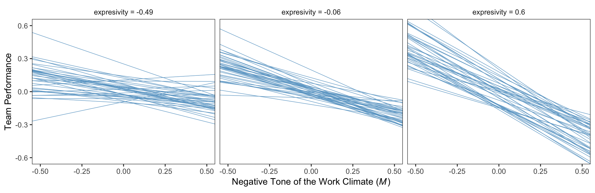
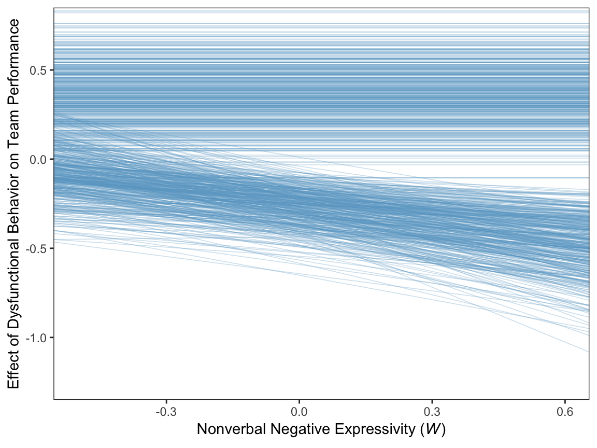
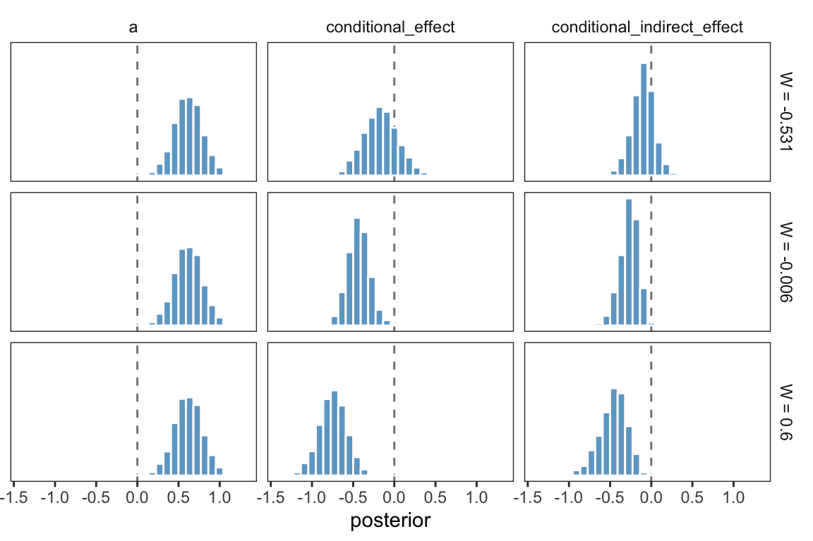
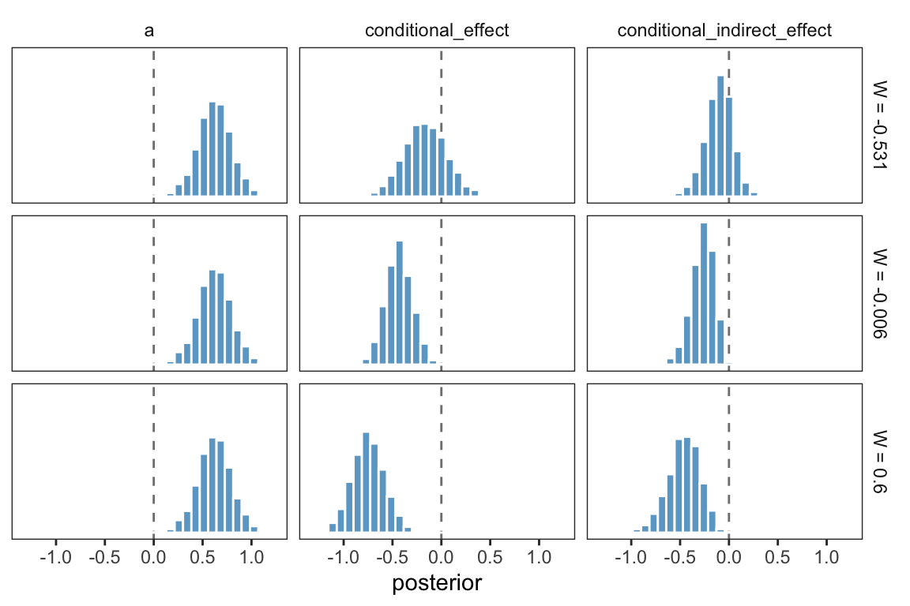
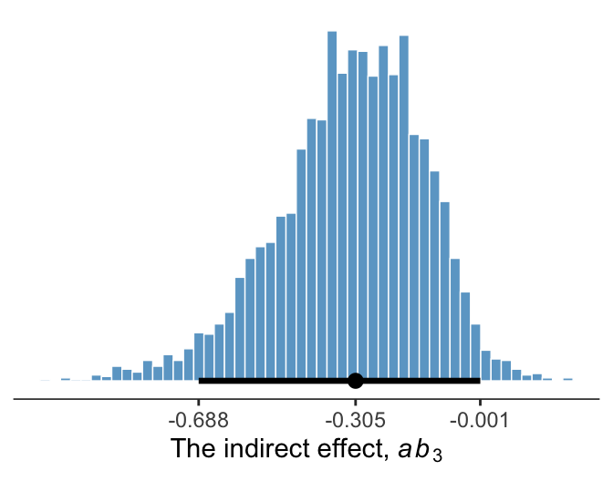

# (PART) CONDITIONAL PROCESS ANALYSIS {-}

# Fundamentals of Conditional Process Analysis


## Examples of conditional process models in the literature

## Conditional direct and indirect effects

## Example: Hiding your feelings from your work team

Here we load a couple necessary packages, load the data, and take a `glimpse()`.


```r
library(tidyverse)

teams <- read_csv("data/teams/teams.csv")

glimpse(teams)
```

```
## Observations: 60
## Variables: 4
## $ dysfunc <dbl> -0.23, -0.13, 0.00, -0.33, 0.39, 1.02, -0.35, -0.23, 0.39, -0.08, -0.23, 0.09, -0.29, -0....
## $ negtone <dbl> -0.51, 0.22, -0.08, -0.11, -0.48, 0.72, -0.18, -0.13, 0.52, -0.26, 1.08, 0.53, -0.19, 0.1...
## $ negexp  <dbl> -0.49, -0.49, 0.84, 0.84, 0.17, -0.82, -0.66, -0.16, -0.16, -0.16, -0.16, 0.50, 0.84, 0.5...
## $ perform <dbl> 0.12, 0.52, -0.08, -0.08, 0.12, 1.12, -0.28, 0.32, -1.08, -0.28, -1.08, -0.28, -0.28, -0....
```

Load the brms package.


```r
library(brms)
```

Recall that we fit mediation models in brms using multivariate syntax. In previous attempts, we've defined and saved the model components outside of the `brm()` function and then plugged then into `brm()` using their identifier. Just to shake things up a bit, we'll just do all the steps right in `brm()`, this time.


```r
model1 <-
  brm(data = teams, family = gaussian,
      bf(negtone ~ 1 + dysfunc) +
        bf(perform ~ 1 + dysfunc + negtone + negexp + negtone:negexp) + 
        set_rescor(FALSE),
      chains = 4, cores = 4)
```


```r
print(model1, digits = 3)
```

```
##  Family: MV(gaussian, gaussian) 
##   Links: mu = identity; sigma = identity
##          mu = identity; sigma = identity 
## Formula: negtone ~ 1 + dysfunc 
##          perform ~ 1 + dysfunc + negtone + negexp + negtone:negexp 
##    Data: teams (Number of observations: 60) 
## Samples: 4 chains, each with iter = 2000; warmup = 1000; thin = 1;
##          total post-warmup samples = 4000
## 
## Population-Level Effects: 
##                        Estimate Est.Error l-95% CI u-95% CI Eff.Sample  Rhat
## negtone_Intercept         0.026     0.062   -0.099    0.147       4000 1.000
## perform_Intercept        -0.011     0.060   -0.131    0.104       4000 1.000
## negtone_dysfunc           0.619     0.166    0.290    0.951       4000 0.999
## perform_dysfunc           0.369     0.184    0.006    0.730       4000 1.000
## perform_negtone          -0.440     0.134   -0.707   -0.178       4000 1.000
## perform_negexp           -0.022     0.120   -0.260    0.213       4000 1.000
## perform_negtone:negexp   -0.512     0.246   -0.992   -0.035       4000 1.000
## 
## Family Specific Parameters: 
##               Estimate Est.Error l-95% CI u-95% CI Eff.Sample  Rhat
## sigma_negtone    0.487     0.048    0.403    0.592       4000 1.000
## sigma_perform    0.460     0.045    0.383    0.557       4000 0.999
## 
## Samples were drawn using sampling(NUTS). For each parameter, Eff.Sample 
## is a crude measure of effective sample size, and Rhat is the potential 
## scale reduction factor on split chains (at convergence, Rhat = 1).
```

Our model summary coheres nicely with Table 11.1 and the formulas on page 409. Here are the $R^2$ distribution summaries.


```r
bayes_R2(model1) %>% round(digits = 3)
```

```
##            Estimate Est.Error  Q2.5 Q97.5
## R2_negtone    0.192     0.077 0.047 0.344
## R2_perform    0.322     0.077 0.166 0.461
```

On page 410 we get two sample means. Here they are:


```r
mean(teams$negexp) %>% round(digits = 3)
```

```
## [1] -0.008
```

```r
mean(teams$perform) %>% round(digits = 3)
```

```
## [1] -0.032
```

For our Figure 11.4 and other similar figures in this chapter, we'll use spaghetti plots. Recall that with a spaghetti plots for linear models, we only need two values for the variable on the x-axis, rather than the typical 30+.


```r
nd <-
  tibble(dysfunc = mean(teams$dysfunc),
         negtone = rep(c(-.8, .8), times = 3),
         negexp = rep(quantile(teams$negexp, probs = c(.16, .50, .84)),
                      each = 2))
```

Here's our Figure 11.4, which uses only the first 40 HMC iterations for the spaghetti-plot lines.


```r
fitted(model1, 
       newdata = nd,
       resp = "perform", 
       summary = F) %>% 
  as_tibble() %>% 
  gather() %>% 
  mutate(iter = rep(1:4000, times = 2*3),
         negtone = rep(rep(c(-.8, .8), times = 3),
                       each = 4000),
         negexp = rep(rep(quantile(teams$negexp, probs = c(.16, .50, .84)),
                          each = 2),
                      each = 4000)) %>% 
  mutate(negexp = str_c("expresivity = ", negexp)) %>%
  mutate(negexp = factor(negexp, levels = c("expresivity = -0.49", "expresivity = -0.06", "expresivity = 0.6"))) %>% 
  filter(iter < 41) %>% 
  
  ggplot(aes(x = negtone, y = value, group = iter)) +
  geom_line(color = "skyblue3",
            size = 1/4) +
  coord_cartesian(xlim = c(-.5, .5),
                  ylim = c(-.6, .6)) +
  labs(x = expression(paste("Negative Tone of the Work Climate (", italic(M), ")")),
       y = "Team Performance") +
  theme_bw() +
  theme(panel.grid = element_blank(),
        strip.background = element_rect(color = "transparent", fill = "transparent")) +
  facet_wrap(~negexp)
```



Also, the plot theme in this chapter is a nod to [John Kruschke](http://www.indiana.edu/~kruschke/DoingBayesianDataAnalysis/).

## ~~Estimation of a conditional process model using PROCESS~~ 

We just fit the model, above.

## Quantifying and visualizing (conditional) indirect and direct effects.

#### The conditional indirect effect of $X$.

Here's how to get the posterior summaries corresponding to the last two columns in Table 11.2. 


```r
post <-
  posterior_samples(model1) %>% 
  mutate(`Conditional effect of M when W is -0.531` = b_perform_negtone + `b_perform_negtone:negexp`*-0.531,
            `Conditional effect of M when W is -0.006` = b_perform_negtone + `b_perform_negtone:negexp`*-0.060,
            `Conditional effect of M when W is 0.600` = b_perform_negtone + `b_perform_negtone:negexp`*0.600,
            
            `Conditional indirect effect when W is -0.531` = b_negtone_dysfunc*(b_perform_negtone + `b_perform_negtone:negexp`*-0.531),
            `Conditional indirect effect when W is -0.006` = b_negtone_dysfunc*(b_perform_negtone + `b_perform_negtone:negexp`*-0.060),
            `Conditional indirect effect when W is 0.600` = b_negtone_dysfunc*(b_perform_negtone + `b_perform_negtone:negexp`*0.600)) 

post %>% 
  select(starts_with("Conditional")) %>% 
  gather() %>% 
  mutate(key = factor(key, levels = c("Conditional effect of M when W is -0.531",
                                      "Conditional effect of M when W is -0.006",
                                      "Conditional effect of M when W is 0.600",
                                      
                                      "Conditional indirect effect when W is -0.531", 
                                      "Conditional indirect effect when W is -0.006",
                                      "Conditional indirect effect when W is 0.600"))) %>% 
  group_by(key) %>% 
  summarize(mean = mean(value),
            sd = sd(value),
            ll = quantile(value, probs = .025),
            ul = quantile(value, probs = .975)) %>% 
  mutate_if(is.double, round, digits = 3)
```

```
## # A tibble: 6 x 5
##   key                                            mean    sd     ll     ul
##   <fct>                                         <dbl> <dbl>  <dbl>  <dbl>
## 1 Conditional effect of M when W is -0.531     -0.168 0.212 -0.573  0.26 
## 2 Conditional effect of M when W is -0.006     -0.409 0.139 -0.687 -0.14 
## 3 Conditional effect of M when W is 0.600      -0.747 0.169 -1.08  -0.429
## 4 Conditional indirect effect when W is -0.531 -0.104 0.141 -0.407  0.165
## 5 Conditional indirect effect when W is -0.006 -0.254 0.114 -0.51  -0.066
## 6 Conditional indirect effect when W is 0.600  -0.464 0.167 -0.824 -0.177
```

#### The direct effect.

The direct effect for his model is `b_perform_dysfunc` in brms. Here's how to get it's summary values from `posterior_summary()`.


```r
posterior_summary(model1)["b_perform_dysfunc", ] %>% round(digits = 3)
```

```
##  Estimate Est.Error      Q2.5     Q97.5 
##     0.369     0.184     0.006     0.730
```

### Visualizing the direct and indirect effects.

For Figure 11.7 we'll use the first 400 HMC iterations.


```r
post <-
  post %>% 
  mutate(`-0.7` = b_negtone_dysfunc*(b_perform_negtone + `b_perform_negtone:negexp`*-0.7),
         `0.7` = b_negtone_dysfunc*(b_perform_negtone + `b_perform_negtone:negexp`*0.7))
  
post %>% 
  select(b_perform_dysfunc, `-0.7`:`0.7`) %>% 
  gather(key, value, -b_perform_dysfunc) %>% 
  mutate(negexp = key %>% as.double(),
         iter = rep(1:4000, times = 2)) %>% 
  filter(iter < 401) %>% 
  
  ggplot(aes(x = negexp, group = iter)) +
  geom_hline(aes(yintercept = b_perform_dysfunc),
             color = "skyblue3",
             size = .3, alpha = .3) +
  geom_line(aes(y = value),
            color = "skyblue3",
            size = .3, alpha = .3) +
  coord_cartesian(xlim = c(-.5, .6),
                  ylim = c(-1.25, .75)) +
  labs(x = expression(paste("Nonverbal Negative Expressivity (", italic(W), ")")),
       y = "Effect of Dysfunctional Behavior on Team Performance") +
  theme_bw() +
  theme(panel.grid = element_blank())
```



Since the `b_perform_dysfunc` values are constant across $W$, the individual HMC iterations end up perfectly parallel in the spaghetti plot. This is an example of a visualization I'd avoid making with a spaghetti plot for a professional presentation. But hopefully it has some pedagogical value, here.

## Statistical inference

### Inference about the direct effect.

We've already seen the 95% percentile-based crecible intervals for the direct effect, `b_perform_dysfunc`, which we can get with `print()`, `posterior_summary()`, or even `fixef()`. Here we'll go beyond summaries and plot using `geom_histogram()`.


```r
library(tidybayes)

post %>% 
  ggplot(aes(x = b_perform_dysfunc)) +
  geom_histogram(binwidth = .025, boundary = 0, 
                 color = "white", fill = "skyblue3", size = 1/4) +
  stat_pointintervalh(aes(y = 0), 
                      point_interval = mode_hdi, .prob = .95) +
  scale_x_continuous(breaks = mode_hdi(post$b_perform_dysfunc, .prob = .95)[1, 1:3],
                     labels = mode_hdi(post$b_perform_dysfunc, .prob = .95)[1, 1:3] %>% round(3)) +
  scale_y_continuous(NULL, breaks = NULL) +
  xlab("The direct effect (i.e., b_perform_dysfunc)") +
  theme_bw() +
  theme(panel.grid = element_blank(),
        panel.border = element_blank(),
        axis.line.x = element_line(size = 1/4))
```



Since we're plotting in a style similar to Kruschke, we switched from emphasizing the posterior mean or median to marking off the posterior mode, which is Kruschkes' preferred metric of central tendency. We also ditched our typical percentile-based 95% intervals for highest posterior density intervals. The `stat_pointintervalh()` function from the Matthew Kay's [tidybayes package](https://github.com/mjskay/tidybayes) made it easy to compute those values with the `point_interval = mode_hdi` argument. Note how we also used `tidybayes::mode_hdi()` to compute those values and plug them into `scale_x_continuous()`.

### Inference about the indirect effect.

Much like above, we can make a plot of the conditional indirect effect $ab_{3}$.


```r
post <-
  post %>% 
  mutate(ab_3 = b_negtone_dysfunc*`b_perform_negtone:negexp`)

post %>% 
  ggplot(aes(x = ab_3)) +
  geom_histogram(binwidth = .025, boundary = 0, 
                 color = "white", fill = "skyblue3", size = 1/4) +
  stat_pointintervalh(aes(y = 0), 
                      point_interval = mode_hdi, .prob = .95) +
  scale_x_continuous(breaks = mode_hdi(post$ab_3, .prob = .95)[1, 1:3],
                     labels = mode_hdi(post$ab_3, .prob = .95)[1, 1:3] %>% round(3)) +
  scale_y_continuous(NULL, breaks = NULL) +
  xlab(expression(paste("The indirect effect, ", italic(ab)[3]))) +
  theme_bw() +
  theme(panel.grid = element_blank(),
        panel.border = element_blank(),
        axis.line.x = element_line(size = 1/4))
```



### Probing moderation of mediation.

#### Normal theory approach.

As we're square within the Bayesian modeling paradigm, we have no need to appeal to normal theory for the posterior $SD$s or 95% intervals. 

#### ~~Bootstrap confidence intervals~~ Percentile-based Bayesian credible intervals.

We produced the summary values corresponding to those in Table 11.3 some time ago. Here they are, again.


```r
post %>% 
  select(starts_with("Conditional indirect")) %>% 
  gather() %>% 
  mutate(key = factor(key, levels = c("Conditional indirect effect when W is -0.531", 
                                      "Conditional indirect effect when W is -0.006",
                                      "Conditional indirect effect when W is 0.600"))) %>% 
  group_by(key) %>% 
  summarize(mean = mean(value),
            sd = sd(value),
            ll = quantile(value, probs = .025),
            ul = quantile(value, probs = .975)) %>% 
  mutate_if(is.double, round, digits = 3)
```

```
## # A tibble: 3 x 5
##   key                                            mean    sd     ll     ul
##   <fct>                                         <dbl> <dbl>  <dbl>  <dbl>
## 1 Conditional indirect effect when W is -0.531 -0.104 0.141 -0.407  0.165
## 2 Conditional indirect effect when W is -0.006 -0.254 0.114 -0.51  -0.066
## 3 Conditional indirect effect when W is 0.600  -0.464 0.167 -0.824 -0.177
```

And if we wanted to summarize those same effects with posterior modes and 95% highest posterior density intervals, instead, we’d replace our `summarize()` code with a `mode_hdi()` statement.


```r
post %>% 
  select(starts_with("Conditional indirect")) %>% 
  gather() %>% 
  mutate(key = factor(key, levels = c("Conditional indirect effect when W is -0.531", 
                                      "Conditional indirect effect when W is -0.006",
                                      "Conditional indirect effect when W is 0.600"))) %>% 
  group_by(key) %>% 
  mode_hdi(value, .prob = .95) %>% 
  mutate_if(is.double, round, digits = 3)
```

```
## # A tibble: 3 x 5
## # Groups:   key [3]
##   key                                           value conf.low conf.high .prob
##   <fct>                                         <dbl>    <dbl>     <dbl> <dbl>
## 1 Conditional indirect effect when W is -0.531 -0.063   -0.409     0.162  0.95
## 2 Conditional indirect effect when W is -0.006 -0.203   -0.493    -0.052  0.95
## 3 Conditional indirect effect when W is 0.600  -0.431   -0.802    -0.164  0.95
```

And we might plot these with something like:


```r
post %>% 
  select(starts_with("Conditional indirect")) %>% 
  gather() %>% 
  mutate(key = str_remove(key, "Conditional indirect effect when W is ") %>% as.double()) %>% 
  
  ggplot(aes(x = key, y = value, group = key)) +
  stat_pointinterval(point_interval = mode_hdi, .prob = c(.95, .5),
                     color = "skyblue3") +
  scale_x_continuous(breaks = c(-.531, -.006, .6)) +
  coord_cartesian(xlim = c(-.5, .6),
                  ylim = c(-1.25, .75)) +
  labs(x = expression(italic(W)),
       y = "The conditional indirect effect") +
  theme_bw() +
  theme(panel.grid = element_blank())
```



This time we used the `prob = c(.95, .5)` argument within `stat_pointinterval()` to return both 95% and 50% highest posterior density intervals—which are the outer and inner lines, respectively.

This, of course, leads us right into

#### A Johnson-Neyman approach.

On page 429, Hayes discussed how Preacher et al. (2007)'s attempt to apply the JN technique in this context presumed

>the sampling distribution of the conditional indirect effect is normal. Given that the sampling distribution of the conditional indirect effect is not normal, the approach they describe yields, at best, an approximate solution. To [Hayes's] knowledge, no one has ever proposed a bootstrapping-based analogue of the Johnson-Neyman method for probing the moderation of an indirect effect.

However, our Bayesian HMC approach makes no such assumption. All we need to do is manipulate the posterior as usual. Here it is, this time using all 4000 iterations:


```r
post %>% 
  transmute(`-0.8` = b_perform_negtone + `b_perform_negtone:negexp`*-0.8,
            `0.8` = b_perform_negtone + `b_perform_negtone:negexp`*0.8) %>% 
  gather() %>% 
  mutate(key = key %>% as.double,
         iter = rep(1:4000, times = 2)) %>% 
  
  ggplot(aes(x = key, y = value, group = iter)) +
  geom_line(color = "skyblue3",
            size = 1/6, alpha = 1/15) +
  coord_cartesian(xlim = c(-.5, .6),
                  ylim = c(-1.25, .75)) +
  labs(x = expression(italic(W)),
       y = "The conditional indirect effect") +
  theme_bw() +
  theme(panel.grid = element_blank())
```


## References {-}

[Hayes, A. F. (2018). *Introduction to mediation, moderation, and conditional process analysis: A regression-based approach.* (2nd ed.). New York, NY, US: The Guilford Press.](http://afhayes.com/introduction-to-mediation-moderation-and-conditional-process-analysis.html)

## Session info {-}


```r
sessionInfo()
```

```
## R version 3.5.1 (2018-07-02)
## Platform: x86_64-apple-darwin15.6.0 (64-bit)
## Running under: macOS High Sierra 10.13.4
## 
## Matrix products: default
## BLAS: /Library/Frameworks/R.framework/Versions/3.5/Resources/lib/libRblas.0.dylib
## LAPACK: /Library/Frameworks/R.framework/Versions/3.5/Resources/lib/libRlapack.dylib
## 
## locale:
## [1] en_US.UTF-8/en_US.UTF-8/en_US.UTF-8/C/en_US.UTF-8/en_US.UTF-8
## 
## attached base packages:
## [1] stats     graphics  grDevices utils     datasets  methods   base     
## 
## other attached packages:
##  [1] tidybayes_0.12.1.9000 bindrcpp_0.2.2        brms_2.3.1            Rcpp_0.12.17         
##  [5] forcats_0.3.0         stringr_1.3.1         dplyr_0.7.6           purrr_0.2.5          
##  [9] readr_1.1.1           tidyr_0.8.1           tibble_1.4.2          ggplot2_3.0.0        
## [13] tidyverse_1.2.1      
## 
## loaded via a namespace (and not attached):
##  [1] nlme_3.1-137              matrixStats_0.53.1        xts_0.10-2                lubridate_1.7.4          
##  [5] threejs_0.3.1             httr_1.3.1                LaplacesDemon_16.1.1      rprojroot_1.3-2          
##  [9] rstan_2.17.3              tools_3.5.1               backports_1.1.2           utf8_1.1.4               
## [13] R6_2.2.2                  DT_0.4                    lazyeval_0.2.1            colorspace_1.3-2         
## [17] withr_2.1.2               tidyselect_0.2.4          gridExtra_2.3             mnormt_1.5-5             
## [21] Brobdingnag_1.2-5         compiler_3.5.1            cli_1.0.0                 rvest_0.3.2              
## [25] HDInterval_0.2.0          arrayhelpers_1.0-20160527 shinyjs_1.0               xml2_1.2.0               
## [29] labeling_0.3              colourpicker_1.0          bookdown_0.7              scales_0.5.0             
## [33] dygraphs_1.1.1.5          mvtnorm_1.0-8             psych_1.8.4               ggridges_0.5.0           
## [37] digest_0.6.15             StanHeaders_2.17.2        foreign_0.8-70            rmarkdown_1.10           
## [41] base64enc_0.1-3           pkgconfig_2.0.1           htmltools_0.3.6           htmlwidgets_1.2          
## [45] rlang_0.2.1               readxl_1.1.0              rstudioapi_0.7            shiny_1.1.0              
## [49] svUnit_0.7-12             bindr_0.1.1               zoo_1.8-2                 jsonlite_1.5             
## [53] gtools_3.8.1              crosstalk_1.0.0           inline_0.3.15             magrittr_1.5             
## [57] loo_2.0.0                 bayesplot_1.5.0           Matrix_1.2-14             munsell_0.5.0            
## [61] abind_1.4-5               stringi_1.2.3             yaml_2.1.19               MASS_7.3-50              
## [65] ggstance_0.3              plyr_1.8.4                grid_3.5.1                parallel_3.5.1           
## [69] promises_1.0.1            crayon_1.3.4              miniUI_0.1.1.1            lattice_0.20-35          
## [73] haven_1.1.2               hms_0.4.2                 knitr_1.20                pillar_1.2.3             
## [77] igraph_1.2.1              markdown_0.8              shinystan_2.5.0           reshape2_1.4.3           
## [81] stats4_3.5.1              rstantools_1.5.0          glue_1.2.0                evaluate_0.10.1          
## [85] modelr_0.1.2              httpuv_1.4.4.2            cellranger_1.1.0          gtable_0.2.0             
## [89] assertthat_0.2.0          xfun_0.3                  mime_0.5                  xtable_1.8-2             
## [93] broom_0.4.5               coda_0.19-1               later_0.7.3               rsconnect_0.8.8          
## [97] shinythemes_1.1.1         bridgesampling_0.4-0
```
