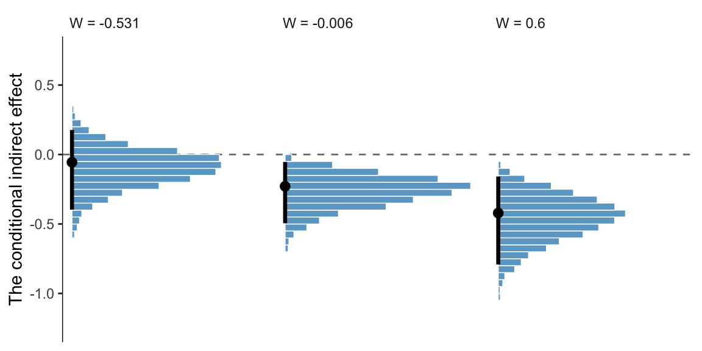

# (PART) CONDITIONAL PROCESS ANALYSIS {-}

# Fundamentals of Conditional Process Analysis


> Thus far in this book, mediation and moderation have been treated as distinct, separate, and independent concepts with different analytical procedures and interpretations. Yet processes modeled with mediation analysis likely are contingent and hence moderated, in that they operate differently for different people or in different contexts or circumstances. A more complete analysis, therefore, should attempt to model the mechanisms at work linking $X$ to $Y$ while simultaneously allowing those effects to be contingent on context, circumstance, or individual differences. [@hayesIntroductionMediationModeration2018, p. 395]

## Examples of conditional process models in the literature

You can look up the various examples in the literature on your own. The main point is

> moderation can be combined with mediation in a number of different ways. But these examples [we skipped for the sake of brevity] only scratch the surface of what is possible. Think about the number of possibilities when you increase the number of mediators, distinguish between moderation of paths in a parallel versus serial multiple mediator model, or allow for multiple moderators of different paths or the same path, and so forth. The possibilities are nearly endless. But regardless of the configuration of moderated paths or complexity of the model, conditional process analysis involves the estimation and interpretation of direct and indirect effects, just as in a simple mediation analysis. However, when causal effects in a mediation model are moderated, they will be conditional on those moderators. Thus, an understanding of the concepts of the *conditional direct effect* and the *conditional indirect effect* is required before one should attempt to undertake a conditional process analysis. (p. 401, *emphasis* in the original)

## Conditional direct and indirect effects

> When a direct or indirect effect is conditional, analysis and interpretation of the results of the modeling process should be based on a formal estimate of and inference about conditional direct and/or conditional in- direct effects. In this section, [Hayes illustrated] the computation of conditional direct and indirect effects for example models that combine moderation and mediation. (p. 403)

## Example: Hiding your feelings from your work team

Here we load a couple necessary packages, load the data, and take a `glimpse()`.


```r
library(tidyverse)

teams <- read_csv("data/teams/teams.csv")

glimpse(teams)
```

```
## Rows: 60
## Columns: 4
## $ dysfunc <dbl> -0.23, -0.13, 0.00, -0.33, 0.39, 1.02, -0.35, -0.23, 0.39, -0.08, -0.23, 0.09, -0.29, -0.06,…
## $ negtone <dbl> -0.51, 0.22, -0.08, -0.11, -0.48, 0.72, -0.18, -0.13, 0.52, -0.26, 1.08, 0.53, -0.19, 0.15, …
## $ negexp  <dbl> -0.49, -0.49, 0.84, 0.84, 0.17, -0.82, -0.66, -0.16, -0.16, -0.16, -0.16, 0.50, 0.84, 0.50, …
## $ perform <dbl> 0.12, 0.52, -0.08, -0.08, 0.12, 1.12, -0.28, 0.32, -1.08, -0.28, -1.08, -0.28, -0.28, -0.88,…
```

Load the **brms** package.


```r
library(brms)
```

Recall that we fit mediation models with **brms** using multivariate syntax. In previous attempts, we've defined and saved the model components outside of the `brm()` function and then plugged then into `brm()` using their identifier. Just to shake things up a bit, we'll just do all the steps right in `brm()`, this time.


```r
model11.1 <-
  brm(data = teams, family = gaussian,
      bf(negtone ~ 1 + dysfunc) +
        bf(perform ~ 1 + dysfunc + negtone + negexp + negtone:negexp) + 
        set_rescor(FALSE),
      chains = 4, cores = 4,
      file = "fits/model11.01")
```

Check the model summary.


```r
print(model11.1, digits = 3)
```

```
##  Family: MV(gaussian, gaussian) 
##   Links: mu = identity; sigma = identity
##          mu = identity; sigma = identity 
## Formula: negtone ~ 1 + dysfunc 
##          perform ~ 1 + dysfunc + negtone + negexp + negtone:negexp 
##    Data: teams (Number of observations: 60) 
## Samples: 4 chains, each with iter = 2000; warmup = 1000; thin = 1;
##          total post-warmup samples = 4000
## 
## Population-Level Effects: 
##                        Estimate Est.Error l-95% CI u-95% CI  Rhat Bulk_ESS Tail_ESS
## negtone_Intercept         0.026     0.064   -0.098    0.153 1.001     7013     2793
## perform_Intercept        -0.011     0.059   -0.129    0.105 1.000     7375     3089
## negtone_dysfunc           0.620     0.171    0.285    0.953 1.006     7462     3022
## perform_dysfunc           0.362     0.185   -0.001    0.718 1.001     5560     3232
## perform_negtone          -0.434     0.136   -0.694   -0.166 1.000     5335     3117
## perform_negexp           -0.020     0.124   -0.259    0.225 1.000     6662     3159
## perform_negtone:negexp   -0.514     0.246   -1.006   -0.037 1.000     4799     3216
## 
## Family Specific Parameters: 
##               Estimate Est.Error l-95% CI u-95% CI  Rhat Bulk_ESS Tail_ESS
## sigma_negtone    0.487     0.048    0.409    0.589 1.001     5627     3135
## sigma_perform    0.459     0.043    0.383    0.550 1.001     5628     3051
## 
## Samples were drawn using sampling(NUTS). For each parameter, Bulk_ESS
## and Tail_ESS are effective sample size measures, and Rhat is the potential
## scale reduction factor on split chains (at convergence, Rhat = 1).
```

Our model summary coheres nicely with Table 11.1 and the formulas on page 409. Here are the $R^2$ distribution summaries.


```r
bayes_R2(model11.1) %>% round(digits = 3)
```

```
##           Estimate Est.Error  Q2.5 Q97.5
## R2negtone    0.193     0.079 0.045 0.345
## R2perform    0.319     0.078 0.157 0.458
```

On page 410 Hayes reported two sample means. Compute them like so.


```r
mean(teams$negexp) %>% round(digits = 3)   # w_bar
```

```
## [1] -0.008
```

```r
mean(teams$perform) %>% round(digits = 3)  # m_bar
```

```
## [1] -0.032
```

For our Figure 11.4 and other similar figures in this chapter, we'll use spaghetti plots. Recall that with a spaghetti plots for linear models, we only need two values for the variable on the $x$-axis, rather than the typical 30+.


```r
nd <-
  crossing(negtone = c(-.8, .8),
           negexp  = quantile(teams$negexp, probs = c(.16, .50, .84))) %>% 
  mutate(dysfunc = mean(teams$dysfunc))
```

Here's our Figure 11.4, which uses only the first 40 HMC iterations for the spaghetti-plot lines.


```r
# `fitted()`
fitted(model11.1, 
       newdata = nd,
       resp = "perform", 
       summary = F) %>% 
  # wrangle
  as_tibble() %>% 
  mutate(iter = 1:n()) %>% 
  pivot_longer(-iter) %>% 
  arrange(name, iter) %>% 
  select(-iter) %>% 
  bind_cols(expand(nd, nesting(negtone, negexp), iter = 1:4000)) %>% 
  mutate(negexp = factor(str_c("expresivity = ", negexp), 
                         levels = c("expresivity = -0.49", "expresivity = -0.06", "expresivity = 0.6"))) %>% 
  filter(iter < 41) %>% 
  
  # plot
  ggplot(aes(x = negtone, y = value, group = iter)) +
  geom_line(color = "skyblue3",
            size = 1/4) +
  coord_cartesian(xlim = c(-.5, .5),
                  ylim = c(-.6, .6)) +
  labs(x = expression(paste("Negative Tone of the Work Climate (", italic(M), ")")),
       y = "Team Performance") +
  theme_bw() +
  theme(panel.grid = element_blank(),
        strip.background = element_rect(color = "transparent", fill = "transparent")) +
  facet_wrap(~ negexp)
```


Also, the plot theme in this chapter is a nod to the style [John Kruschke](http://www.indiana.edu/~kruschke/DoingBayesianDataAnalysis/) frequently uses in his papers and texts [e.g., @kruschkeDoingBayesianData2015].

Using Hayes's notation from the top of page 412, we can express $M$'s conditional effect on $Y$ as

$$\theta_{M \rightarrow Y} = b_1 + b_3 W,$$

where $M$ is `negtone`, $Y$ is `perform`, and $W$ is `negexp`. We can extract our posterior summaries for $b_1$ and $b_3$ like so.


```r
fixef(model11.1)[c("perform_negtone", "perform_negtone:negexp"), ]
```

```
##                          Estimate Est.Error       Q2.5       Q97.5
## perform_negtone        -0.4335440 0.1357573 -0.6944009 -0.16598288
## perform_negtone:negexp -0.5141659 0.2458267 -1.0064484 -0.03698026
```

## ~~Estimation of a conditional process model using PROCESS~~

We just fit the model in the last section. No need to repeat.

## Quantifying and visualizing (conditional) indirect and direct effects.

> The analysis presented thus far has been piecemeal, in that [Hayes] addressed how to estimate the regression coefficients for each equation in this conditional process model and how to interpret them using standard principles of regression analysis, moderation analysis, and so forth. But a complete analysis goes further by integrating the estimates of each of the effects in the model (i.e., $X \rightarrow M, \theta_{M \rightarrow Y}$) to yield the direct and indirect effects of $X$ on $Y$. That is, the individual effects as quantified with the regression coefficients (conditional or otherwise) in equations 11.10 and 11.11 are not necessarily of immediate interest or relevance. Estimating them is a means to an end. What matters is the estimation of the direct and indirect effects, for they convey information about how $X$ influences $Y$ directly or through a mediator and how those effects are contingent on a moderator. (pp. 417--418)

#### The conditional indirect effect of $X$.

One way to make a version of Table 11.2 is to work with the `posterior_samples()`, simply summarizing the distributions with means.


```r
post <-
  posterior_samples(model11.1)

post %>% 
  mutate(a  = b_negtone_dysfunc,
         b1 = b_perform_negtone,
         b3 = `b_perform_negtone:negexp`) %>% 
  expand(nesting(a, b1, b3),
         w = c(-0.531, -0.006, 0.600)) %>% 
  mutate(conditional_effect          =      b1 + b3 * w,
         conditional_indirect_effect = a * (b1 + b3 * w)) %>% 
  select(-(b1:b3)) %>% 
  pivot_longer(-w) %>% 
  group_by(w, name) %>% 
  summarise(mean = mean(value) %>% round(digits = 3)) %>% 
  pivot_wider(names_from = name, values_from = mean)
```

```
## # A tibble: 3 x 4
## # Groups:   w [3]
##        w     a conditional_effect conditional_indirect_effect
##    <dbl> <dbl>              <dbl>                       <dbl>
## 1 -0.531  0.62             -0.161                      -0.1  
## 2 -0.006  0.62             -0.431                      -0.267
## 3  0.6    0.62             -0.742                      -0.46
```

That kind of summary isn't the most Bayesian of us. Why not plot, instead?


```r
post %>% 
  mutate(a  = b_negtone_dysfunc,
         b1 = b_perform_negtone,
         b3 = `b_perform_negtone:negexp`) %>% 
  expand(nesting(a, b1, b3),
         w = c(-0.531, -0.006, 0.600)) %>% 
  mutate(conditional_effect          =      b1 + b3 * w,
         conditional_indirect_effect = a * (b1 + b3 * w)) %>% 
  select(-(b1:b3)) %>% 
  pivot_longer(-w) %>% 
  mutate(label = str_c("W = ", w),
         w     = fct_reorder(label, w)) %>% 
  
  ggplot(aes(x = value)) +
  geom_vline(xintercept = 0, color = "grey50", linetype = 2) +
  geom_histogram(color = "white", fill = "skyblue3") +
  scale_y_continuous(NULL, breaks = NULL) +
  xlab("posterior") +
  theme_bw() +
  theme(panel.grid = element_blank(),
        strip.background = element_rect(color = "transparent", fill = "transparent")) +
  facet_grid(w ~ name)
```


Now the posterior distribution for each is on full display.

#### The direct effect.

The direct effect of $X$ on $Y$ (i.e., `dysfunc` on `perform`) for this model is `b_perform_dysfunc` in **brms**. Here's how to get its summary values from `posterior_summary()`.


```r
posterior_summary(model11.1)["b_perform_dysfunc", ] %>% round(digits = 3)
```

```
##  Estimate Est.Error      Q2.5     Q97.5 
##     0.362     0.185    -0.001     0.718
```

### Visualizing the direct and indirect effects.

For Figure 11.7 we'll use the first 400 HMC iterations.


```r
post <-
  post %>% 
  mutate(`-0.7` = b_negtone_dysfunc * (b_perform_negtone + `b_perform_negtone:negexp` * -0.7),
         `0.7`  = b_negtone_dysfunc * (b_perform_negtone + `b_perform_negtone:negexp` * 0.7))
  
post %>% 
  select(b_perform_dysfunc, `-0.7`:`0.7`) %>% 
  pivot_longer(-b_perform_dysfunc) %>% 
  mutate(negexp = name %>% as.double(),
         iter   = rep(1:4000, times = 2)) %>% 
  filter(iter < 401) %>% 
  
  ggplot(aes(x = negexp, group = iter)) +
  geom_hline(aes(yintercept = b_perform_dysfunc),
             color = "skyblue3",
             size = .3, alpha = .3) +
  geom_line(aes(y = value),
            color = "skyblue3",
            size = .3, alpha = .3) +
  coord_cartesian(xlim = c(-.5, .6),
                  ylim = c(-1.25, .75)) +
  labs(x = expression(paste("Nonverbal Negative Expressivity (", italic(W), ")")),
       y = "Effect of Dysfunctional Behavior on Team Performance") +
  theme_bw() +
  theme(panel.grid = element_blank())
```


Since the `b_perform_dysfunc` values are constant across $W$, the individual HMC iterations end up perfectly parallel in the spaghetti plot. This is an example of a visualization I'd avoid making with a spaghetti plot for a professional presentation. But hopefully it has some pedagogical value, here.

## Statistical inference

### Inference about the direct effect.

We've already been expressing uncertainty in terms of percentile-based 95% intervals and histograms. Here's a plot of the direct effect, `b_perform_dysfunc`.


```r
library(tidybayes)

# breaks
breaks <- 
  mode_hdi(post$b_perform_dysfunc, .width = .95) %>% 
  pivot_longer(starts_with("y")) %>% 
  pull(value)

post %>% 
  ggplot(aes(x = b_perform_dysfunc)) +
  geom_histogram(binwidth = .025, boundary = 0, 
                 color = "white", fill = "skyblue3", size = 1/4) +
  stat_pointinterval(aes(y = 0), 
                     point_interval = mode_hdi, .width = .95) +
  scale_x_continuous("The direct effect (i.e., b_perform_dysfunc)", 
                     breaks = breaks, labels = round(breaks, digits = 3)) +
  scale_y_continuous(NULL, breaks = NULL) +
  theme_bw() +
  theme(axis.line.x = element_line(size = 1/4),
        panel.border = element_blank(),
        panel.grid = element_blank())
```


Since we're plotting in a style similar to Kruschke, we switched from emphasizing the posterior mean or median to marking off the posterior mode, which is Kruschkes' preferred measure of central tendency. We also ditched our typical percentile-based 95% intervals for highest posterior density intervals. The `stat_pointinterval()` function from the Matthew Kay's [**tidybayes** package](https://github.com/mjskay/tidybayes) made it easy to compute those values with the `point_interval = mode_hdi` argument. Note how we also used `tidybayes::mode_hdi()` to compute those values and plug them into `scale_x_continuous()`.

### Inference about the indirect effect.

Much like above, we can make a plot of the conditional indirect effect $ab_3$.


```r
post <-
  post %>% 
  mutate(ab_3 = b_negtone_dysfunc * `b_perform_negtone:negexp`)

# breaks
breaks <- 
  mode_hdi(post$ab_3, .width = .95) %>% 
  pivot_longer(starts_with("y")) %>% 
  pull(value)

post %>% 
  ggplot(aes(x = ab_3)) +
  geom_histogram(binwidth = .025, boundary = 0, 
                 color = "white", fill = "skyblue3", size = 1/4) +
  stat_pointinterval(aes(y = 0), 
                     point_interval = mode_hdi, .width = .95) +
  scale_x_continuous(expression(paste("The indirect effect, ", italic(ab)[3])),
                     breaks = breaks, labels = round(breaks, digits = 3)) +
  scale_y_continuous(NULL, breaks = NULL) +
  theme_bw() +
  theme(axis.line.x = element_line(size = 1/4),
        panel.border = element_blank(),
        panel.grid = element_blank())
```


### Probing moderation of mediation.

> One of the contributions of @preacherAddressingModeratedMediation2007 to the literature on moderated mediation analysis was their discussion of inference for conditional indirect effects. They suggested two approaches, one a normal theory-based approach that is an analogue of the Sobel test in unmoderated mediation analysis, and another based on bootstrapping. (p. 426)

One of the contributions of this project is moving away from NHST in favor of Bayesian modeling. Since we’ve already been referencing him with our plot themes, you might check out Kruschke's [-@kruschkeDoingBayesianData2015] [textbook](https://sites.google.com/site/doingbayesiandataanalysis/) for more discussion on Bayes versus NHST.

#### Normal theory approach.

As we're square within the Bayesian modeling paradigm, we have no need to appeal to normal theory for the posterior $SD$s or 95% intervals.

#### ~~Bootstrap confidence intervals~~ Two types of Bayesian credible intervals.

We produced the posterior means corresponding to those in Table 11.3 some time ago. Here they are, again, with percentile-based 95% intervals via `tidybayes::mean_qi()`.


```r
post %>% 
  mutate(a  = b_negtone_dysfunc,
         b1 = b_perform_negtone,
         b3 = `b_perform_negtone:negexp`) %>% 
  expand(nesting(a, b1, b3),
         w = c(-0.531, -0.006, 0.600)) %>% 
  mutate(`a(b1 + b3w)` = a * (b1 + b3 * w)) %>% 
  group_by(w) %>% 
  mean_qi(`a(b1 + b3w)`) %>% 
  select(w:.upper) %>% 
  mutate_if(is.double, round, digits = 3)
```

```
## # A tibble: 3 x 4
##        w `a(b1 + b3w)` .lower .upper
##    <dbl>         <dbl>  <dbl>  <dbl>
## 1 -0.531        -0.1   -0.408  0.171
## 2 -0.006        -0.267 -0.525 -0.073
## 3  0.6          -0.46  -0.813 -0.177
```

If we wanted to summarize those same effects with posterior modes and 95% highest posterior density intervals, instead, we'd replace our `mean_qi()` lnie with `mode_hdi()`.


```r
post %>% 
  mutate(a  = b_negtone_dysfunc,
         b1 = b_perform_negtone,
         b3 = `b_perform_negtone:negexp`) %>% 
  expand(nesting(a, b1, b3),
         w = c(-0.531, -0.006, 0.600)) %>% 
  mutate(`a(b1 + b3w)` = a * (b1 + b3 * w)) %>% 
  group_by(w) %>% 
  mode_hdi(`a(b1 + b3w)`) %>% 
  select(w:.upper) %>% 
  mutate_if(is.double, round, digits = 3)
```

```
## # A tibble: 3 x 4
##        w `a(b1 + b3w)` .lower .upper
##    <dbl>         <dbl>  <dbl>  <dbl>
## 1 -0.531        -0.056 -0.397  0.177
## 2 -0.006        -0.229 -0.495 -0.054
## 3  0.6          -0.421 -0.792 -0.158
```

And we might plot these with something like this.


```r
post %>% 
  mutate(a  = b_negtone_dysfunc,
         b1 = b_perform_negtone,
         b3 = `b_perform_negtone:negexp`) %>% 
  expand(nesting(a, b1, b3),
         w = c(-0.531, -0.006, 0.600)) %>% 
  mutate(`a(b1 + b3w)` = a * (b1 + b3 * w)) %>% 
  select(w:`a(b1 + b3w)`) %>% 
  mutate(label = str_c("W = ", w),
         w = fct_reorder(label, w)) %>% 

  ggplot(aes(y = `a(b1 + b3w)`)) +
  geom_hline(yintercept = 0, color = "grey50", linetype = 2) +
  geom_histogram(binwidth = .05, boundary = 0, 
                 color = "white", fill = "skyblue3", size = 1/4) +
  stat_pointinterval(aes(x = 0),
                     point_interval = mode_hdi, .width = .95) +
  scale_x_continuous(NULL, breaks = NULL) +
  scale_y_continuous("The conditional indirect effect", limits = c(-1.25, .75)) +
  theme_bw() +
  theme(axis.line.y = element_line(size = 1/4),
        panel.border = element_blank(),
        panel.grid = element_blank(),
        strip.background = element_rect(color = "transparent", fill = "transparent"),
        strip.text = element_text(hjust = 0)) +
  facet_wrap(~ w, nrow = 1)
```



This, of course, leads us right into the next section.

#### A Johnson-Neyman approach.

On page 429, Hayes discussed how @preacherAddressingModeratedMediation2007's attempt to apply the JN technique in this context presumed

> the sampling distribution of the conditional indirect effect is normal. Given that the sampling distribution of the conditional indirect effect is not normal, the approach they describe yields, at best, an approximate solution. To [Hayes's] knowledge, no one has ever proposed a bootstrapping-based analogue of the Johnson-Neyman method for probing the moderation of an indirect effect.

However, our Bayesian HMC approach makes no such assumption. All we need to do is manipulate the posterior as usual. Here it is, this time using all 4,000 iterations.


```r
post %>% 
  transmute(iter   = 1:n(),
            `-0.8` = b_perform_negtone + `b_perform_negtone:negexp` * -0.8,
            `0.8`  = b_perform_negtone + `b_perform_negtone:negexp` * 0.8) %>% 
  pivot_longer(-iter) %>% 
  mutate(name = name %>% as.double()) %>% 
  
  ggplot(aes(x = name, y = value, group = iter)) +
  geom_line(color = "skyblue3",
            size = 1/6, alpha = 1/15) +
  coord_cartesian(xlim = c(-.5, .6),
                  ylim = c(-1.25, .75)) +
  labs(x = expression(italic(W)),
       y = "The conditional indirect effect") +
  theme_bw() +
  theme(panel.grid = element_blank())
```


Glorious.

## Session info {-}


```r
sessionInfo()
```

```
## R version 4.0.4 (2021-02-15)
## Platform: x86_64-apple-darwin17.0 (64-bit)
## Running under: macOS Catalina 10.15.7
## 
## Matrix products: default
## BLAS:   /Library/Frameworks/R.framework/Versions/4.0/Resources/lib/libRblas.dylib
## LAPACK: /Library/Frameworks/R.framework/Versions/4.0/Resources/lib/libRlapack.dylib
## 
## locale:
## [1] en_US.UTF-8/en_US.UTF-8/en_US.UTF-8/C/en_US.UTF-8/en_US.UTF-8
## 
## attached base packages:
## [1] stats     graphics  grDevices utils     datasets  methods   base     
## 
## other attached packages:
##  [1] tidybayes_3.0.0 brms_2.15.0     Rcpp_1.0.6      forcats_0.5.1   stringr_1.4.0   dplyr_1.0.6    
##  [7] purrr_0.3.4     readr_1.4.0     tidyr_1.1.3     tibble_3.1.2    ggplot2_3.3.5   tidyverse_1.3.1
## 
## loaded via a namespace (and not attached):
##   [1] readxl_1.3.1         backports_1.2.1      plyr_1.8.6           igraph_1.2.6         svUnit_1.0.3        
##   [6] sp_1.4-4             splines_4.0.4        crosstalk_1.1.0.1    TH.data_1.0-10       rstantools_2.1.1    
##  [11] inline_0.3.17        digest_0.6.27        htmltools_0.5.1.1    rsconnect_0.8.16     fansi_0.4.2         
##  [16] checkmate_2.0.0      magrittr_2.0.1       modelr_0.1.8         RcppParallel_5.0.2   matrixStats_0.57.0  
##  [21] xts_0.12.1           sandwich_3.0-0       prettyunits_1.1.1    colorspace_2.0-0     rvest_1.0.1         
##  [26] ggdist_3.0.0         haven_2.3.1          xfun_0.23            callr_3.7.0          crayon_1.4.1        
##  [31] jsonlite_1.7.2       lme4_1.1-25          survival_3.2-10      zoo_1.8-8            glue_1.4.2          
##  [36] gtable_0.3.0         emmeans_1.5.2-1      V8_3.4.0             distributional_0.2.2 pkgbuild_1.2.0      
##  [41] rstan_2.21.2         abind_1.4-5          scales_1.1.1         mvtnorm_1.1-1        DBI_1.1.0           
##  [46] miniUI_0.1.1.1       xtable_1.8-4         HDInterval_0.2.2     stats4_4.0.4         StanHeaders_2.21.0-7
##  [51] DT_0.16              htmlwidgets_1.5.3    httr_1.4.2           threejs_0.3.3        arrayhelpers_1.1-0  
##  [56] posterior_1.0.1      ellipsis_0.3.2       farver_2.1.0         pkgconfig_2.0.3      loo_2.4.1           
##  [61] sass_0.3.1           dbplyr_2.1.1         utf8_1.2.1           tidyselect_1.1.1     labeling_0.4.2      
##  [66] rlang_0.4.11         reshape2_1.4.4       later_1.2.0          munsell_0.5.0        cellranger_1.1.0    
##  [71] tools_4.0.4          cli_3.0.1            generics_0.1.0       broom_0.7.6          ggridges_0.5.3      
##  [76] evaluate_0.14        fastmap_1.1.0        processx_3.5.2       knitr_1.33           fs_1.5.0            
##  [81] nlme_3.1-152         mime_0.10            projpred_2.0.2       xml2_1.3.2           compiler_4.0.4      
##  [86] bayesplot_1.8.0      shinythemes_1.1.2    rstudioapi_0.13      gamm4_0.2-6          curl_4.3            
##  [91] reprex_2.0.0         statmod_1.4.35       bslib_0.2.4          stringi_1.6.2        highr_0.9           
##  [96] ps_1.6.0             Brobdingnag_1.2-6    lattice_0.20-41      Matrix_1.3-2         nloptr_1.2.2.2      
## [101] markdown_1.1         tensorA_0.36.2       shinyjs_2.0.0        vctrs_0.3.8          pillar_1.6.1        
## [106] lifecycle_1.0.0      jquerylib_0.1.4      bridgesampling_1.0-0 estimability_1.3     raster_3.4-5        
## [111] httpuv_1.6.0         R6_2.5.0             bookdown_0.22        promises_1.2.0.1     gridExtra_2.3       
## [116] codetools_0.2-18     boot_1.3-26          colourpicker_1.1.0   MASS_7.3-53          gtools_3.8.2        
## [121] assertthat_0.2.1     withr_2.4.2          shinystan_2.5.0      multcomp_1.4-16      mgcv_1.8-33         
## [126] parallel_4.0.4       hms_1.1.0            grid_4.0.4           coda_0.19-4          minqa_1.2.4         
## [131] rmarkdown_2.8        shiny_1.6.0          lubridate_1.7.10     base64enc_0.1-3      dygraphs_1.1.1.6
```


