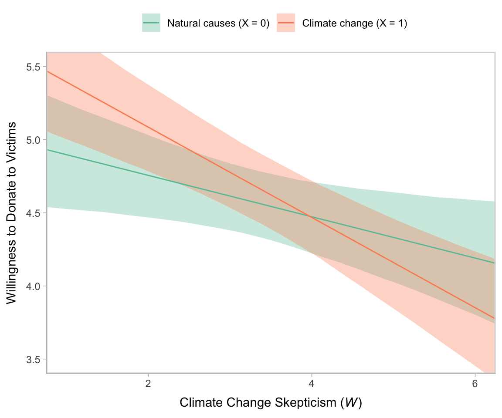
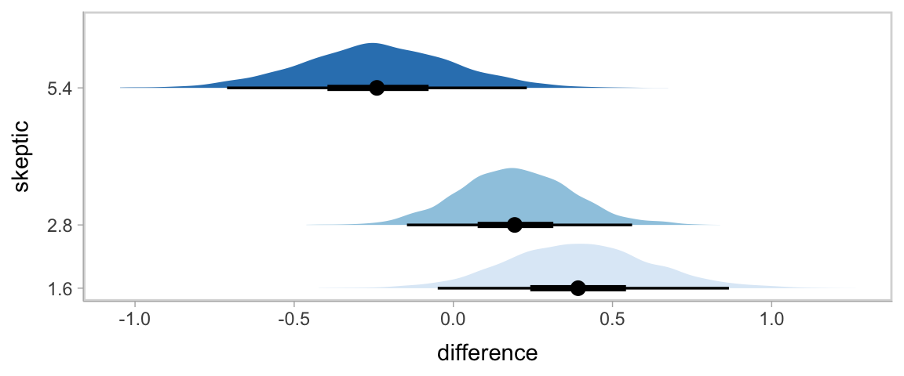
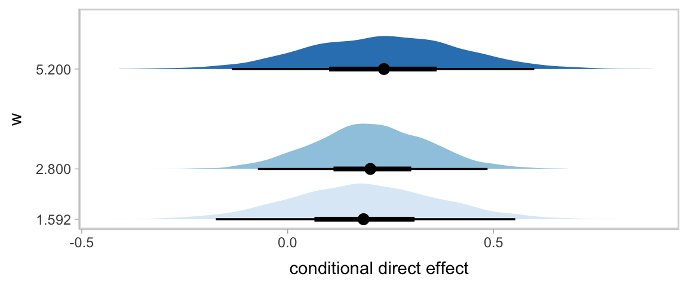
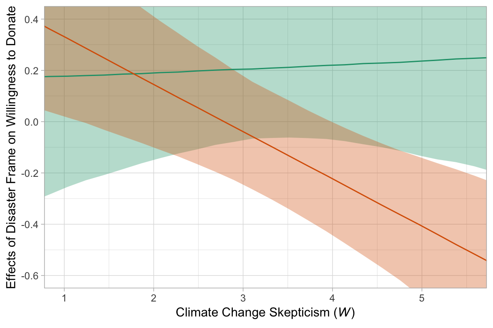
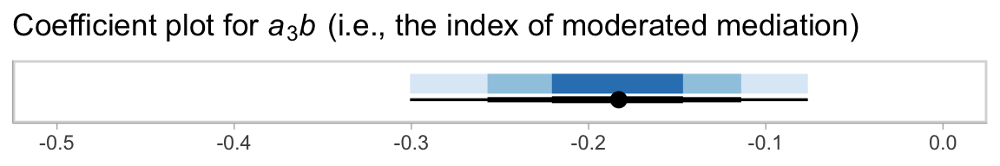

# Further Examples of Conditional Process Analysis


> In this chapter [Hayes built] on the foundation laid by stepping through an analysis of a more complicated conditional process model that include[d] moderation of both the indirect effects in a simple mediation model. [He did] so by first using a piecemeal approach that focuse[d] on each pathway in the model. With some understanding gained by this examination of the components in the process, [he brought] the pieces together into an integrated conditional process analysis...
>
> When an indirect effect of $X$ on $Y$ through $M$ is moderated, we call this phenomenon *moderated mediation*. In such a scenario, the mechanism represented by the $X \rightarrow M \rightarrow Y$ chain of events operates to varying degrees (or not at all) for certain people or in certain contexts. A similar-sounding phenomenon is *mediated moderation*, which refers to the scenario in which an interaction between X and some moderator $W$ on $Y$ is carried through a mediator $M$. [We'll see] in this chapter that a mediated moderation analysis is really nothing other than a mediation analysis with the product of two variables serving as the causal agent of focus. [@hayesIntroductionMediationModeration2018, p. 432]

## Revisiting the disaster framing study

Here we load a couple necessary packages, load the data, and take a `glimpse()`.


```r
library(tidyverse)

disaster <- read_csv("data/disaster/disaster.csv")

glimpse(disaster)
```

```
## Rows: 211
## Columns: 5
## $ id      <dbl> 1, 2, 3, 4, 5, 6, 7, 8, 9, 10, 11, 12, 13, 14, 15, 16, 17, 18, 19, 20, 21, 22, 23, 24, 25, 2…
## $ frame   <dbl> 1, 1, 1, 1, 1, 0, 0, 1, 0, 0, 1, 1, 0, 0, 1, 1, 1, 1, 0, 0, 1, 0, 1, 0, 1, 1, 0, 0, 0, 1, 0,…
## $ donate  <dbl> 5.6, 4.2, 4.2, 4.6, 3.0, 5.0, 4.8, 6.0, 4.2, 4.4, 5.8, 6.2, 6.0, 4.2, 4.4, 5.8, 5.4, 3.4, 7.…
## $ justify <dbl> 2.95, 2.85, 3.00, 3.30, 5.00, 3.20, 2.90, 1.40, 3.25, 3.55, 1.55, 1.60, 1.65, 2.65, 3.15, 2.…
## $ skeptic <dbl> 1.8, 5.2, 3.2, 1.0, 7.6, 4.2, 4.2, 1.2, 1.8, 8.8, 1.0, 5.4, 2.2, 3.6, 7.8, 1.6, 1.0, 6.4, 3.…
```

Load **brms**.


```r
library(brms)
```

At the top of page 433, Hayes fit a simple univariable model

$$Y = b_0 + b_1 X + e_Y,$$

where the $X$ is `frame` the $Y$ is `donate`. Here's the model.


```r
model12.1 <-
  brm(data = disaster, 
      family = gaussian,
      donate ~ 1 + frame,
      chains = 4, cores = 4,
      file = "fits/model12.01")
```

Check the summary.


```r
print(model12.1, digits = 3)
```

```
##  Family: gaussian 
##   Links: mu = identity; sigma = identity 
## Formula: donate ~ 1 + frame 
##    Data: disaster (Number of observations: 211) 
## Samples: 4 chains, each with iter = 2000; warmup = 1000; thin = 1;
##          total post-warmup samples = 4000
## 
## Population-Level Effects: 
##           Estimate Est.Error l-95% CI u-95% CI  Rhat Bulk_ESS Tail_ESS
## Intercept    4.567     0.123    4.327    4.816 1.000     4051     2922
## frame        0.084     0.179   -0.271    0.432 1.001     3974     2963
## 
## Family Specific Parameters: 
##       Estimate Est.Error l-95% CI u-95% CI  Rhat Bulk_ESS Tail_ESS
## sigma    1.325     0.068    1.200    1.466 1.001     3665     2843
## 
## Samples were drawn using sampling(NUTS). For each parameter, Bulk_ESS
## and Tail_ESS are effective sample size measures, and Rhat is the potential
## scale reduction factor on split chains (at convergence, Rhat = 1).
```

Hayes interpreted the coefficient for `frame` through the lens of a $t$ statistic and accompanying $p$-value. We'll just plot the posterior. For the figures in this chapter, we'll take theme cues from the vignettes from Matthew Kay's [**tidybayes** package](https://mjskay.github.io/tidybayes/).


```r
library(tidybayes)
theme_set(theme_tidybayes() + cowplot::panel_border())

posterior_samples(model12.1) %>% 
  ggplot(aes(x = b_frame, y = 0)) +
  stat_halfeye() +
  geom_vline(xintercept = 0, linetype = 2) +
  scale_y_continuous(NULL, breaks = NULL)
```


Now we fit the moderation model

$$Y = b_0 + b_1 X + b_2 W + b_3 XW + e_Y,$$

where `skeptic` is the $W$ variable.


```r
model12.2 <-
  brm(data = disaster, 
      family = gaussian,
      donate ~ 1 + frame + skeptic + frame:skeptic,
      chains = 4, cores = 4,
      file = "fits/model12.02")
```

Our `model12.2` summary matches nicely with the text.


```r
print(model12.2, digits = 3)
```

```
##  Family: gaussian 
##   Links: mu = identity; sigma = identity 
## Formula: donate ~ 1 + frame + skeptic + frame:skeptic 
##    Data: disaster (Number of observations: 211) 
## Samples: 4 chains, each with iter = 2000; warmup = 1000; thin = 1;
##          total post-warmup samples = 4000
## 
## Population-Level Effects: 
##               Estimate Est.Error l-95% CI u-95% CI  Rhat Bulk_ESS Tail_ESS
## Intercept        5.038     0.232    4.578    5.481 1.001     2103     2525
## frame            0.664     0.335    0.006    1.348 1.002     1976     2325
## skeptic         -0.141     0.060   -0.259   -0.024 1.002     2124     2471
## frame:skeptic   -0.167     0.085   -0.341   -0.002 1.003     1902     2239
## 
## Family Specific Parameters: 
##       Estimate Est.Error l-95% CI u-95% CI  Rhat Bulk_ESS Tail_ESS
## sigma    1.242     0.062    1.127    1.370 1.001     3030     2623
## 
## Samples were drawn using sampling(NUTS). For each parameter, Bulk_ESS
## and Tail_ESS are effective sample size measures, and Rhat is the potential
## scale reduction factor on split chains (at convergence, Rhat = 1).
```

Here's our Figure 12.2.


```r
nd <-
  crossing(frame   = 0:1,
           skeptic = seq(from = 0, to = 7, length.out = 30))

fitted(model12.2, newdata = nd) %>% 
  as_tibble() %>% 
  bind_cols(nd) %>% 
  mutate(frame = ifelse(frame == 0, str_c("Natural causes (X = ", frame, ")"),
                        str_c("Climate change (X = ", frame, ")"))) %>% 
  mutate(frame = factor(frame,
                        levels = c("Natural causes (X = 0)",
                                   "Climate change (X = 1)"))) %>% 
  
  ggplot(aes(x = skeptic, y = Estimate)) +
  geom_ribbon(aes(ymin = Q2.5, ymax = Q97.5, fill = frame),
              alpha = 1/3) +
  geom_line(aes(color = frame)) +
  scale_fill_brewer(palette = "Set2") +
  scale_color_brewer(palette = "Set2") +
  coord_cartesian(xlim = c(1, 6),
                  ylim = c(3.5, 5.5)) +
  labs(x = expression(paste("Climate Change Skepticism (", italic(W), ")")),
       y = "Willingness to Donate to Victims") +
  theme(legend.direction = "horizontal",
        legend.position = "top",
        legend.title = element_blank())
```



In Hayes's Figure 12.2, he emphasized the differences at the three levels of `skeptic`. If you want the full difference score distributions in a pick-a-point-approach sort of way, you might plot the densities with `tidybayes::geom_stat_halfeye()`, which places coefficient plots at the base of the densities. In this case, we show the posterior medians with the dots, the 50% intervals with the thick horizontal lines, and the 95% intervals with the thinner horizontal lines.


```r
nd <-
  crossing(frame   = 0:1,
           skeptic = quantile(disaster$skeptic, probs = c(.16, .5, .86)))

fitted(model12.2, summary = F,
       newdata = nd) %>% 
  as_tibble() %>% 
  set_names(mutate(nd, label = str_c(frame, "_", skeptic)) %>% pull(label)) %>% 
  mutate(iter = 1:n()) %>% 
  pivot_longer(-iter) %>% 
  separate(name, into = c("frame", "skeptic"), sep = "_", convert = T) %>% 
  pivot_wider(names_from = frame, values_from = value) %>% 
  mutate(difference = `1` - `0`) %>% 
  
  ggplot(aes(x = difference, y = skeptic, fill = skeptic %>% as.character())) +
  stat_halfeye(point_interval = median_qi, .width = c(0.95, 0.5)) +
  scale_fill_brewer() +
  scale_y_continuous(breaks = quantile(disaster$skeptic, probs = c(.16, .5, .86)),
                     labels = quantile(disaster$skeptic, probs = c(.16, .5, .86)) %>% round(2)) +
  theme(legend.position = "none")
```



Here's our simple mediation model, `model12.3`, using the multivariate syntax right in the `brm()` function.


```r
model12.3 <-
  brm(data = disaster, 
      family = gaussian,
      bf(justify ~ 1 + frame) +
        bf(donate ~ 1 + frame + justify) +
        set_rescor(FALSE),
      chains = 4, cores = 4,
      file = "fits/model12.03")
```


```r
print(model12.3, digits = 3)
```

```
##  Family: MV(gaussian, gaussian) 
##   Links: mu = identity; sigma = identity
##          mu = identity; sigma = identity 
## Formula: justify ~ 1 + frame 
##          donate ~ 1 + frame + justify 
##    Data: disaster (Number of observations: 211) 
## Samples: 4 chains, each with iter = 2000; warmup = 1000; thin = 1;
##          total post-warmup samples = 4000
## 
## Population-Level Effects: 
##                   Estimate Est.Error l-95% CI u-95% CI  Rhat Bulk_ESS Tail_ESS
## justify_Intercept    2.803     0.090    2.625    2.980 1.001     6359     2928
## donate_Intercept     7.236     0.224    6.804    7.678 1.002     6456     3156
## justify_frame        0.135     0.131   -0.117    0.390 1.001     6033     2511
## donate_frame         0.210     0.136   -0.050    0.474 1.000     6888     3106
## donate_justify      -0.953     0.073   -1.096   -0.814 1.001     6255     2972
## 
## Family Specific Parameters: 
##               Estimate Est.Error l-95% CI u-95% CI  Rhat Bulk_ESS Tail_ESS
## sigma_justify    0.935     0.046    0.849    1.029 1.003     6125     2969
## sigma_donate     0.986     0.050    0.891    1.090 1.000     6034     3067
## 
## Samples were drawn using sampling(NUTS). For each parameter, Bulk_ESS
## and Tail_ESS are effective sample size measures, and Rhat is the potential
## scale reduction factor on split chains (at convergence, Rhat = 1).
```

Consider the Bayesian $R^2$ summaries.


```r
bayes_R2(model12.3) %>% round(digits = 3)
```

```
##           Estimate Est.Error  Q2.5 Q97.5
## R2justify    0.010     0.012 0.000 0.042
## R2donate     0.449     0.038 0.371 0.516
```

If you want the indirect effect with its intervals, you use `posterior_samples()` and data wrangle, as usual.


```r
posterior_samples(model12.3) %>% 
  mutate(ab = b_justify_frame * b_donate_justify) %>% 
  mean_qi(ab)
```

```
## # A tibble: 1 x 6
##       ab .lower .upper .width .point .interval
##    <dbl>  <dbl>  <dbl>  <dbl> <chr>  <chr>    
## 1 -0.128 -0.379  0.113   0.95 mean   qi
```

## Moderation of the direct and indirect effects in a conditional process model

Our conditional process model follows the form

\begin{align*}
M & = i_M + a_1 X + a_2 W + a_3 XW + e_M \\
Y & = i_Y + c_1' X + c_2' W + c_3' XW + b M + e_Y.
\end{align*}

We don't need to do anything particularly special to fit a model like this with **brms**. It just requires we do a careful job specifying the formulas in our `bf()` arguments. If you find this syntax a little too cumbersome, you can always specify the formulas outside of `brm()`, save them as one or multiple objects, and plug those objects into `brm()`.


```r
model12.4 <-
  brm(data = disaster, 
      family = gaussian,
      bf(justify ~ 1 + frame + skeptic + frame:skeptic) +
        bf(donate ~ 1 + frame + justify + skeptic + frame:skeptic) +
        set_rescor(FALSE),
      chains = 4, cores = 4,
      file = "fits/model12.04")
```

Check the model summary.


```r
print(model12.4, digits = 3)
```

```
##  Family: MV(gaussian, gaussian) 
##   Links: mu = identity; sigma = identity
##          mu = identity; sigma = identity 
## Formula: justify ~ 1 + frame + skeptic + frame:skeptic 
##          donate ~ 1 + frame + justify + skeptic + frame:skeptic 
##    Data: disaster (Number of observations: 211) 
## Samples: 4 chains, each with iter = 2000; warmup = 1000; thin = 1;
##          total post-warmup samples = 4000
## 
## Population-Level Effects: 
##                       Estimate Est.Error l-95% CI u-95% CI  Rhat Bulk_ESS Tail_ESS
## justify_Intercept        2.454     0.154    2.152    2.742 1.002     3271     2983
## donate_Intercept         7.296     0.268    6.773    7.826 1.001     4620     3639
## justify_frame           -0.568     0.225   -1.007   -0.126 1.001     3136     2793
## justify_skeptic          0.104     0.039    0.030    0.182 1.002     3128     2573
## justify_frame:skeptic    0.202     0.057    0.092    0.311 1.001     3104     2850
## donate_frame             0.157     0.261   -0.361    0.666 1.000     3480     3064
## donate_justify          -0.923     0.085   -1.098   -0.761 1.003     6462     3011
## donate_skeptic          -0.043     0.046   -0.132    0.046 1.001     4004     3082
## donate_frame:skeptic     0.015     0.066   -0.112    0.149 1.001     3395     2645
## 
## Family Specific Parameters: 
##               Estimate Est.Error l-95% CI u-95% CI  Rhat Bulk_ESS Tail_ESS
## sigma_justify    0.817     0.040    0.741    0.902 1.001     7142     3058
## sigma_donate     0.988     0.048    0.896    1.087 1.002     6083     2865
## 
## Samples were drawn using sampling(NUTS). For each parameter, Bulk_ESS
## and Tail_ESS are effective sample size measures, and Rhat is the potential
## scale reduction factor on split chains (at convergence, Rhat = 1).
```

Here are the Bayesian $R^2$ summaries.


```r
bayes_R2(model12.4)
```

```
##            Estimate  Est.Error      Q2.5     Q97.5
## R2justify 0.2492172 0.04521637 0.1579519 0.3363650
## R2donate  0.4527362 0.03695286 0.3771514 0.5196714
```

### ~~Estimation using PROCESS~~.

We just fit that model. Next!

### Quantifying direct and indirect effects.

Here are summaries for $a_1$ through $a_3$.


```r
fixef(model12.4)[c(3:5), ] %>% round(digits = 3)
```

```
##                       Estimate Est.Error   Q2.5  Q97.5
## justify_frame           -0.568     0.225 -1.007 -0.126
## justify_skeptic          0.104     0.039  0.030  0.182
## justify_frame:skeptic    0.202     0.057  0.092  0.311
```

This is $b$.


```r
fixef(model12.4)["donate_justify", ] %>% round(digits = 3)
```

```
##  Estimate Est.Error      Q2.5     Q97.5 
##    -0.923     0.085    -1.098    -0.761
```

We'll need to employ `posterior_samples()` to compute $(a_1 + a_3 W)b$, as shown in Table 12.2.


```r
post <- 
  posterior_samples(model12.4) %>% 
  mutate(`indirect effect when W is 1.592` = (b_justify_frame + `b_justify_frame:skeptic` * 1.592) * b_donate_justify,
         `indirect effect when W is 2.800` = (b_justify_frame + `b_justify_frame:skeptic` * 2.800) * b_donate_justify,
         `indirect effect when W is 5.200` = (b_justify_frame + `b_justify_frame:skeptic` * 5.200) * b_donate_justify)

post %>% 
  pivot_longer(starts_with("indirect")) %>% 
  group_by(name) %>% 
  median_qi(value, .prob = .95) %>% 
  mutate_if(is.double, round, digits = 3)
```

```
## # A tibble: 3 x 7
##   name                             value .lower .upper .width .point .interval
##   <chr>                            <dbl>  <dbl>  <dbl>  <dbl> <chr>  <chr>    
## 1 indirect effect when W is 1.592  0.227 -0.049  0.509   0.95 median qi       
## 2 indirect effect when W is 2.800  0.003 -0.223  0.22    0.95 median qi       
## 3 indirect effect when W is 5.200 -0.443 -0.752 -0.161   0.95 median qi
```

And if you really want that full-on Table 12.2 layout, try this.


```r
post %>% 
  mutate(a1 = b_justify_frame,
         a3 = `b_justify_frame:skeptic`,
         b  = b_donate_justify,
         c1 = b_donate_frame,
         c3 = `b_donate_frame:skeptic`) %>% 
  expand(nesting(a1, a3, b, c1, c3),
         w = c(1.592, 2.800, 5.200)) %>% 
  mutate(`a1 + a3w`      = a1 + a3 * w,
         `(a1 + a3w)b`   = (a1 + a3 * w) * b,
         `direct effect` = c1 + c3 * w) %>% 
  select(-(a1:a3), -(c1:c3)) %>% 
  pivot_longer(-w) %>% 
  group_by(w, name) %>% 
  summarise(mean = mean(value) %>% round(digits = 3)) %>% 
  pivot_wider(names_from = name, 
              values_from = mean) %>% 
  select(w, `a1 + a3w`, b, everything())
```

```
## # A tibble: 3 x 5
## # Groups:   w [3]
##       w `a1 + a3w`      b `(a1 + a3w)b` `direct effect`
##   <dbl>      <dbl>  <dbl>         <dbl>           <dbl>
## 1  1.59     -0.246 -0.923         0.227           0.181
## 2  2.8      -0.002 -0.923         0.001           0.199
## 3  5.2       0.484 -0.923        -0.446           0.235
```

#### The conditional direct effect of $X$.

We already computed this in the last code block, above. But since we just focused on the posterior means, here's a summary of their medians and 95% intervals.


```r
post <- 
  post %>% 
  mutate(`direct effect when W is 1.592` = b_donate_frame + `b_donate_frame:skeptic` * 1.592,
         `direct effect when W is 2.800` = b_donate_frame + `b_donate_frame:skeptic` * 2.800,
         `direct effect when W is 5.200` = b_donate_frame + `b_donate_frame:skeptic` * 5.200)

post %>% 
  pivot_longer(starts_with("direct")) %>% 
  group_by(name) %>% 
  median_qi(value, .width = .95) %>% 
  mutate_if(is.double, round, digits = 3) %>% 
  select(name:.upper)
```

```
## # A tibble: 3 x 4
##   name                          value .lower .upper
##   <chr>                         <dbl>  <dbl>  <dbl>
## 1 direct effect when W is 1.592 0.183 -0.176  0.531
## 2 direct effect when W is 2.800 0.202 -0.074  0.467
## 3 direct effect when W is 5.200 0.235 -0.123  0.594
```

We can always plot, too.


```r
w <- c(1.592, 2.800, 5.200)

post %>% 
  expand(nesting(b_donate_frame, `b_donate_frame:skeptic`),
         w = w) %>% 
  mutate(`conditional direct effect` = b_donate_frame + `b_donate_frame:skeptic` * w) %>% 

  ggplot(aes(x = `conditional direct effect`, y = w, fill = w %>% as.character())) +
  stat_halfeye(point_interval = median_qi, .width = c(0.95, 0.5)) +
  scale_y_continuous(breaks = w) +
  scale_fill_brewer() +
  theme(legend.position = "none")
```



### Visualizing the direct and indirect effects.

We'll need to do some `post` wrangling before we're ready to make our Figure 12.7. We'll save the results as `effects`.


```r
effects <-
  post %>% 
  expand(nesting(b_justify_frame, `b_justify_frame:skeptic`, b_donate_justify, b_donate_frame, `b_donate_frame:skeptic`),
         w = seq(from = 0, to = 6, length.out = 30)) %>% 
  mutate(`direct effect`   = b_donate_frame + `b_donate_frame:skeptic` * w,
         `indirect effect` = (b_justify_frame + `b_justify_frame:skeptic` * w) * b_donate_justify) %>% 
  pivot_longer(c(`direct effect`, `indirect effect`)) %>% 
  mutate(name = factor(name, levels = c("direct effect", "indirect effect"))) %>% 
  select(w:value)

head(effects)
```

```
## # A tibble: 6 x 3
##       w name            value
##   <dbl> <fct>           <dbl>
## 1 0     direct effect   0.540
## 2 0     indirect effect 1.58 
## 3 0.207 direct effect   0.517
## 4 0.207 indirect effect 1.50 
## 5 0.414 direct effect   0.494
## 6 0.414 indirect effect 1.42
```

Now we plot.


```r
# we'll need this for `geom_text()`
text <-
  tibble(x     = c(4.2, 4.7),
         y     = c(.28, -.28),
         angle = c(3.6, 335),
         name  = factor(c("direct effect", "indirect effect"),
                        levels = c("direct effect", "indirect effect")))

# plot!
effects %>% 
  ggplot(aes(x = w, color = name, fill = name)) +
  stat_lineribbon(aes(y = value),
                  .width = .95, alpha = 1/3) +
  geom_text(data = text,
            aes(x = x, y = y,
                angle = angle, 
                label = name),
            size = 5) +
  scale_fill_brewer(type = "qual") +
  scale_color_brewer(type = "qual") +
  coord_cartesian(xlim = c(1, 5.5),
                  ylim = c(-.6, .4)) +
  labs(x = expression(Climate~Change~Skepticism~(italic(W))),
       y = "Effects of Disaster Frame on Willingness to Donate") +
  theme(legend.position = "none")
```


Note how wide those 95% intervals are relative to the scale of the y-axis, which I specifically kept within the same range as Figure 12.7 in the text. To me the message is clear: include credible-interval ribbons in your regression slope plots. They help depict how uncertain the posterior is in a way a simple line slopes just don't.

## Statistical inference

### Inference about the direct effect.

We've already computed the 95% intervals for the direct effect, $\theta_{X \rightarrow Y}$, conditional on the three levels of $W$. Here's a different look at those intervals, superimposed on the 80% and 50% intervals, using the `tidybayes::stat_interval()` function.


```r
post %>% 
  pivot_longer(starts_with("direct")) %>% 
  mutate(name = str_remove(name, "direct effect when W is ") %>% as.double()) %>% 
  
  ggplot(aes(x = name, y = value, group = name)) +
  stat_interval(.width = c(.95, .80, .5)) +
  scale_color_brewer("Interval") +
  coord_cartesian(xlim = c(1, 5.5)) +
  labs(x = expression(paste("Climate Change Skepticism (", italic(W), ")")),
       y = "Conditional Direct Effect of Disaster Frame on\nWillingness to Donate")
```



### Inference about the indirect effect.

#### A statistical test of moderated mediation.

To get a sense of $a_3 b$, we just:


```r
post <- 
  post %>% 
  mutate(a3b = `b_justify_frame:skeptic` * b_donate_justify) 

post %>% 
  select(a3b) %>% 
  median_qi(a3b) %>% 
  mutate_if(is.double, round, digits = 3)
```

```
## # A tibble: 1 x 6
##      a3b .lower .upper .width .point .interval
##    <dbl>  <dbl>  <dbl>  <dbl> <chr>  <chr>    
## 1 -0.185 -0.296 -0.082   0.95 median qi
```

Here we'll combine `stat_intervalh()` and `stat_pointintervalh()` to visualize $a_3 b$ with a coefficient plot.


```r
post %>% 
  ggplot(aes(x = a3b, y = 1)) +
  stat_interval(.width = c(.95, .8, .5)) +
  stat_pointinterval(point_interval = median_qi, .width = c(.95, .8, .5),
                     position = position_nudge(y = -.75)) +
  scale_color_brewer("Interval") +
  scale_y_discrete(NULL, breaks = NULL) +
  coord_cartesian(xlim = c(-.5, 0)) +
  labs(title = expression(paste("Coefficient plot for ", italic(a)[3], italic(b), " (i.e., the index of moderated mediation)")),
       x = NULL) +
  theme(legend.position = "none")
```



#### Probing moderation of mediation.

As we discussed in Chapter 11, our Bayesian version of the JN technique should be fine because HMC does not impose the normality assumption on the parameter posteriors. In this instance, I'll leave the JN technique plot as an exercise for the interested reader. Here we'll just follow along with the text and pick a few points.

We computed and inspected these 95% intervals, above. Here's another way we might `stat_halfeye()` to look at their entire densities.


```r
post %>% 
  pivot_longer(starts_with("indirect")) %>% 
  rename(`conditional indirect effect` = value) %>% 
  mutate(W = str_remove(name, "indirect effect when W is ") %>% as.double()) %>% 
  
  ggplot(aes(x = W, y = `conditional indirect effect`, fill = W %>% as.character())) +
  geom_hline(yintercept = 0, linetype = 2) +
  stat_halfeye(point_interval = median_qi, .width = 0.95) +
  scale_fill_brewer() +
  scale_x_continuous(breaks = c(1.592, 2.8, 5.2),
                     labels = c(1.6, 2.8, 5.2)) +
  coord_cartesian(ylim = c(-1, 1)) +
  theme(legend.position = "none",
        panel.grid.minor.y = element_blank())
```


### Pruning the model.

Fitting the model without the interaction term is just a small change to one of our `formula` arguments.


```r
model12.5 <-
  brm(data = disaster, 
      family = gaussian,
      bf(justify ~ 1 + frame + skeptic + frame:skeptic) +
        bf(donate ~ 1 + frame + justify + skeptic) +
        set_rescor(FALSE),
      chains = 4, cores = 4,
      file = "fits/model12.05")
```

Here are the results.


```r
print(model12.5, digits = 3)
```

```
##  Family: MV(gaussian, gaussian) 
##   Links: mu = identity; sigma = identity
##          mu = identity; sigma = identity 
## Formula: justify ~ 1 + frame + skeptic + frame:skeptic 
##          donate ~ 1 + frame + justify + skeptic 
##    Data: disaster (Number of observations: 211) 
## Samples: 4 chains, each with iter = 2000; warmup = 1000; thin = 1;
##          total post-warmup samples = 4000
## 
## Population-Level Effects: 
##                       Estimate Est.Error l-95% CI u-95% CI  Rhat Bulk_ESS Tail_ESS
## justify_Intercept        2.454     0.152    2.151    2.753 1.000     2727     2650
## donate_Intercept         7.257     0.231    6.804    7.706 1.001     5477     3236
## justify_frame           -0.568     0.224   -0.997   -0.139 1.001     2557     2577
## justify_skeptic          0.105     0.039    0.027    0.180 1.000     2934     3360
## justify_frame:skeptic    0.203     0.057    0.091    0.314 1.000     2587     2660
## donate_frame             0.210     0.133   -0.043    0.469 1.001     4797     2875
## donate_justify          -0.920     0.082   -1.082   -0.758 1.000     3982     2771
## donate_skeptic          -0.035     0.038   -0.110    0.039 1.000     4103     2747
## 
## Family Specific Parameters: 
##               Estimate Est.Error l-95% CI u-95% CI  Rhat Bulk_ESS Tail_ESS
## sigma_justify    0.818     0.040    0.744    0.901 1.002     4986     2934
## sigma_donate     0.987     0.050    0.894    1.090 1.000     4864     3073
## 
## Samples were drawn using sampling(NUTS). For each parameter, Bulk_ESS
## and Tail_ESS are effective sample size measures, and Rhat is the potential
## scale reduction factor on split chains (at convergence, Rhat = 1).
```

Since we're altering the model, we may as well use information criteria to compare the two versions.


```r
model12.4 <- add_criterion(model12.4, "loo")
model12.5 <- add_criterion(model12.5, "loo")

loo_compare(model12.4, model12.5) %>% 
  print(simplify = F)
```

```
##           elpd_diff se_diff elpd_loo se_elpd_loo p_loo  se_p_loo looic  se_looic
## model12.5    0.0       0.0  -557.7     16.6        11.0    1.4   1115.4   33.1  
## model12.4   -1.0       0.3  -558.7     16.6        12.0    1.5   1117.5   33.3
```

The difference in LOO-CV values for the two models was modest. There's little predictive reason to choose one over the other. You could argue in favor of `model12.5` because it's simpler than `model12.4`. Since we've got a complex model either way, one might also consider which one was of primary theoretical interest.

## Mediated moderation

> Mediation is moderated if the indirect effect of $X$ on $Y$ through one or more mediators is contingent on a moderator. With evidence of moderated mediation, one can claim that the $X \rightarrow M \rightarrow Y$ chain of events functions differently or to varying degrees for different people, in different contexts or conditions, or whatever the moderator variable represents. Although similar in name and pronunciation to moderated mediation, the term *mediated moderation* refers to the phenomenon in which an interaction between $X$ and a moderator $W$ in a model of $Y$ is carried through a mediator. (p. 459, *emphasis* in the original)

Hayes later opined:

> Although there is an abundance of published examples of mediated moderation analysis, their frequency of occurrence in the literature should not be confused with meaningfulness of the procedure itself. I will argue toward the end of this section that rarely is the phenomenon of mediated moderation interesting when interpreted as such. It is almost always substantively more meaningful to conceptualize a mediated moderation process in terms of moderated mediation. But before doing this, I will describe how a mediated moderation analysis is undertaken. (p. 460)

### Mediated moderation as the indirect effect of a product.

Hayes explains this in the next subsection, but we've already fit this model presented in this subsection. We called it `model12.4`. Here's the summary.


```r
print(model12.4, digits = 3)
```

```
##  Family: MV(gaussian, gaussian) 
##   Links: mu = identity; sigma = identity
##          mu = identity; sigma = identity 
## Formula: justify ~ 1 + frame + skeptic + frame:skeptic 
##          donate ~ 1 + frame + justify + skeptic + frame:skeptic 
##    Data: disaster (Number of observations: 211) 
## Samples: 4 chains, each with iter = 2000; warmup = 1000; thin = 1;
##          total post-warmup samples = 4000
## 
## Population-Level Effects: 
##                       Estimate Est.Error l-95% CI u-95% CI  Rhat Bulk_ESS Tail_ESS
## justify_Intercept        2.454     0.154    2.152    2.742 1.002     3271     2983
## donate_Intercept         7.296     0.268    6.773    7.826 1.001     4620     3639
## justify_frame           -0.568     0.225   -1.007   -0.126 1.001     3136     2793
## justify_skeptic          0.104     0.039    0.030    0.182 1.002     3128     2573
## justify_frame:skeptic    0.202     0.057    0.092    0.311 1.001     3104     2850
## donate_frame             0.157     0.261   -0.361    0.666 1.000     3480     3064
## donate_justify          -0.923     0.085   -1.098   -0.761 1.003     6462     3011
## donate_skeptic          -0.043     0.046   -0.132    0.046 1.001     4004     3082
## donate_frame:skeptic     0.015     0.066   -0.112    0.149 1.001     3395     2645
## 
## Family Specific Parameters: 
##               Estimate Est.Error l-95% CI u-95% CI  Rhat Bulk_ESS Tail_ESS
## sigma_justify    0.817     0.040    0.741    0.902 1.001     7142     3058
## sigma_donate     0.988     0.048    0.896    1.087 1.002     6083     2865
## 
## Samples were drawn using sampling(NUTS). For each parameter, Bulk_ESS
## and Tail_ESS are effective sample size measures, and Rhat is the potential
## scale reduction factor on split chains (at convergence, Rhat = 1).
```

### Why mediated moderation is neither interesting nor meaningful.

Mediated moderation and moderated mediation are statistically the same.

> The only difference between them is how they are interpreted, and on what part of the model your attention is focused.
>
> Moderated mediation focuses on the conditional nature of an indirect effect--how an indirect effect is moderated. If you think of the terms "mediation" and "indirect effect" as essentially synonymous conceptually, then moderated mediation means a moderated indirect effect. Interpretive focus in a moderated mediation analysis is directed at estimating the indirect effect and how that effect varies as a function of a moderator. Mediated moderation, by contrast, asks about the mechanism through which an interaction between $X$ and a moderator $W$ operates, where the product of $X$ and $W$ is construed as the causal agent sending its effect to $Y$ through $M$. Focus in mediated moderation is the estimation of the indirect effect of the product of $X$ and $W$. (p. 465)

Hayes later concluded that we should avoid

> the articulation of hypotheses or research questions in terms of the mediation of the effect of a product, abandoning the term *mediated moderation* entirely, and instead [reframe] such hypotheses and research questions in terms of the contingencies of an indirect effect--moderated mediation. (p. 467, *emphasis* in the original)

## Session info {-}


```r
sessionInfo()
```

```
## R version 4.0.4 (2021-02-15)
## Platform: x86_64-apple-darwin17.0 (64-bit)
## Running under: macOS Catalina 10.15.7
## 
## Matrix products: default
## BLAS:   /Library/Frameworks/R.framework/Versions/4.0/Resources/lib/libRblas.dylib
## LAPACK: /Library/Frameworks/R.framework/Versions/4.0/Resources/lib/libRlapack.dylib
## 
## locale:
## [1] en_US.UTF-8/en_US.UTF-8/en_US.UTF-8/C/en_US.UTF-8/en_US.UTF-8
## 
## attached base packages:
## [1] stats     graphics  grDevices utils     datasets  methods   base     
## 
## other attached packages:
##  [1] tidybayes_3.0.0 brms_2.15.0     Rcpp_1.0.6      forcats_0.5.1   stringr_1.4.0   dplyr_1.0.6    
##  [7] purrr_0.3.4     readr_1.4.0     tidyr_1.1.3     tibble_3.1.2    ggplot2_3.3.5   tidyverse_1.3.1
## 
## loaded via a namespace (and not attached):
##   [1] readxl_1.3.1         backports_1.2.1      plyr_1.8.6           igraph_1.2.6         splines_4.0.4       
##   [6] svUnit_1.0.3         crosstalk_1.1.0.1    TH.data_1.0-10       rstantools_2.1.1     inline_0.3.17       
##  [11] digest_0.6.27        htmltools_0.5.1.1    rsconnect_0.8.16     fansi_0.4.2          checkmate_2.0.0     
##  [16] magrittr_2.0.1       modelr_0.1.8         RcppParallel_5.0.2   matrixStats_0.57.0   xts_0.12.1          
##  [21] sandwich_3.0-0       prettyunits_1.1.1    colorspace_2.0-0     rvest_1.0.1          ggdist_3.0.0        
##  [26] haven_2.3.1          xfun_0.23            callr_3.7.0          crayon_1.4.1         jsonlite_1.7.2      
##  [31] lme4_1.1-25          survival_3.2-10      zoo_1.8-8            glue_1.4.2           gtable_0.3.0        
##  [36] emmeans_1.5.2-1      V8_3.4.0             distributional_0.2.2 pkgbuild_1.2.0       rstan_2.21.2        
##  [41] abind_1.4-5          scales_1.1.1         mvtnorm_1.1-1        DBI_1.1.0            miniUI_0.1.1.1      
##  [46] xtable_1.8-4         stats4_4.0.4         StanHeaders_2.21.0-7 DT_0.16              htmlwidgets_1.5.3   
##  [51] httr_1.4.2           threejs_0.3.3        RColorBrewer_1.1-2   arrayhelpers_1.1-0   posterior_1.0.1     
##  [56] ellipsis_0.3.2       farver_2.1.0         pkgconfig_2.0.3      loo_2.4.1            sass_0.3.1          
##  [61] dbplyr_2.1.1         utf8_1.2.1           labeling_0.4.2       tidyselect_1.1.1     rlang_0.4.11        
##  [66] reshape2_1.4.4       later_1.2.0          munsell_0.5.0        cellranger_1.1.0     tools_4.0.4         
##  [71] cli_3.0.1            generics_0.1.0       broom_0.7.6          ggridges_0.5.3       evaluate_0.14       
##  [76] fastmap_1.1.0        processx_3.5.2       knitr_1.33           fs_1.5.0             nlme_3.1-152        
##  [81] mime_0.10            projpred_2.0.2       xml2_1.3.2           compiler_4.0.4       bayesplot_1.8.0     
##  [86] shinythemes_1.1.2    rstudioapi_0.13      gamm4_0.2-6          curl_4.3             reprex_2.0.0        
##  [91] statmod_1.4.35       bslib_0.2.4          stringi_1.6.2        highr_0.9            ps_1.6.0            
##  [96] Brobdingnag_1.2-6    lattice_0.20-41      Matrix_1.3-2         nloptr_1.2.2.2       markdown_1.1        
## [101] tensorA_0.36.2       shinyjs_2.0.0        vctrs_0.3.8          pillar_1.6.1         lifecycle_1.0.0     
## [106] jquerylib_0.1.4      bridgesampling_1.0-0 estimability_1.3     cowplot_1.1.1        httpuv_1.6.0        
## [111] R6_2.5.0             bookdown_0.22        promises_1.2.0.1     gridExtra_2.3        codetools_0.2-18    
## [116] boot_1.3-26          colourpicker_1.1.0   MASS_7.3-53          gtools_3.8.2         assertthat_0.2.1    
## [121] withr_2.4.2          shinystan_2.5.0      multcomp_1.4-16      mgcv_1.8-33          parallel_4.0.4      
## [126] hms_1.1.0            grid_4.0.4           coda_0.19-4          minqa_1.2.4          rmarkdown_2.8       
## [131] shiny_1.6.0          lubridate_1.7.10     base64enc_0.1-3      dygraphs_1.1.1.6
```


