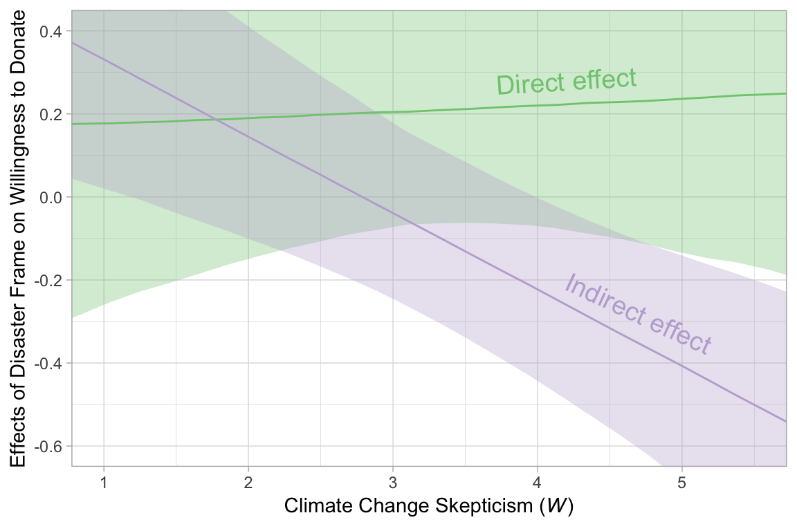

# Further Examples of Conditional Process Analysis


## Revisiting the disaster framing study

Here we load a couple necessary packages, load the data, and take a `glimpse()`.


```r
library(tidyverse)

disaster <- read_csv("data/disaster/disaster.csv")

glimpse(disaster)
#> Observations: 211
#> Variables: 5
#> $ id      <int> 1, 2, 3, 4, 5, 6, 7, 8, 9, 10, 11, 12, 13, 14, 15, 16,...
#> $ frame   <int> 1, 1, 1, 1, 1, 0, 0, 1, 0, 0, 1, 1, 0, 0, 1, 1, 1, 1, ...
#> $ donate  <dbl> 5.6, 4.2, 4.2, 4.6, 3.0, 5.0, 4.8, 6.0, 4.2, 4.4, 5.8,...
#> $ justify <dbl> 2.95, 2.85, 3.00, 3.30, 5.00, 3.20, 2.90, 1.40, 3.25, ...
#> $ skeptic <dbl> 1.8, 5.2, 3.2, 1.0, 7.6, 4.2, 4.2, 1.2, 1.8, 8.8, 1.0,...
```

Load brms.


```r
library(brms)
```

Our `model1` is the simple moderation model.


```r
model1 <-
  brm(data = disaster, family = gaussian,
      donate ~ 1 + frame + skeptic + frame:skeptic,
      chains = 4, cores = 4)
```

Our `model1` summary matches nicely with the text.


```r
print(model1, digits = 3)
#>  Family: gaussian 
#>   Links: mu = identity; sigma = identity 
#> Formula: donate ~ 1 + frame + skeptic + frame:skeptic 
#>    Data: disaster (Number of observations: 211) 
#> Samples: 4 chains, each with iter = 2000; warmup = 1000; thin = 1;
#>          total post-warmup samples = 4000
#> 
#> Population-Level Effects: 
#>               Estimate Est.Error l-95% CI u-95% CI Eff.Sample  Rhat
#> Intercept        5.027     0.228    4.586    5.471       2471 1.000
#> frame            0.679     0.328    0.027    1.322       2088 1.001
#> skeptic         -0.139     0.059   -0.255   -0.027       2367 1.000
#> frame:skeptic   -0.170     0.085   -0.334   -0.009       1969 1.001
#> 
#> Family Specific Parameters: 
#>       Estimate Est.Error l-95% CI u-95% CI Eff.Sample  Rhat
#> sigma    1.241     0.062    1.127    1.369       3014 1.000
#> 
#> Samples were drawn using sampling(NUTS). For each parameter, Eff.Sample 
#> is a crude measure of effective sample size, and Rhat is the potential 
#> scale reduction factor on split chains (at convergence, Rhat = 1).
```

For the figures in this chapter, we'll take theme cues from Matthew Kay's [tidybayes package](https://github.com/mjskay/tidybayes). Otherwise, our Figure 12.2 is business as usual at this point.


```r
theme_set(theme_light())

nd <-
  tibble(frame = rep(0:1, each = 30),
         skeptic = rep(seq(from = 0, to = 7, length.out = 30),
                       times = 2))

fitted(model1, newdata = nd) %>% 
  as_tibble() %>% 
  bind_cols(nd) %>% 
  mutate(frame = ifelse(frame == 0, str_c("Natural causes (X = ", frame, ")"),
                        str_c("Climate change (X = ", frame, ")"))) %>% 
  
  ggplot(aes(x = skeptic, y = Estimate)) +
  geom_ribbon(aes(ymin = Q2.5, ymax = Q97.5, fill = frame),
              alpha = 1/3) +
  geom_line(aes(color = frame)) +
  scale_fill_brewer(type = "qual") +
  scale_color_brewer(type = "qual") +
  coord_cartesian(xlim = 1:6,
                  ylim = c(3.5, 5.5)) +
  labs(x = expression(paste("Climate Change Skepticism (", italic(W), ")")),
       y = "Willingness to Donate to Victims") +
  theme(legend.position = "top",
        legend.direction = "horizontal",
        legend.title = element_blank())
```


In Hayes's Figure 12.2, he emphasized the differences at the three levels of `skeptic`. If you want the full difference score distributions in a pick-a-point-approach sort of way, you might plot the densities with `tidybayes::geom_halfeyeh()`, which places coefficient plots at the base of the densities. In this case, we show the posterior medians with the dots, the 50% intervals with the thick horizontal lines, and the 95% intervals with the thinner horizontal lines.


```r
library(tidybayes)
nd <-
  tibble(frame = rep(0:1, times = 3),
         skeptic = rep(quantile(disaster$skeptic, probs = c(.16, .5, .86)),
                                times = 2))

fitted(model1, summary = F,
       newdata = nd) %>% 
  as_tibble() %>% 
  gather() %>% 
  mutate(frame = rep(rep(0:1, times = 3),
                     each = 4000),
         skeptic = rep(rep(quantile(disaster$skeptic, probs = c(.16, .5, .86)),
                                times = 2),
                       each = 4000),
         iter = rep(1:4000, times = 6)) %>% 
  select(-key) %>% 
  spread(key = frame, value = value) %>% 
  mutate(difference = `1` - `0`) %>% 
  
  ggplot(aes(x = difference, y = skeptic, group = skeptic, fill = skeptic %>% as.character())) +
  geom_halfeyeh(point_interval = median_qi, .prob = c(0.95, 0.5)) +
  scale_fill_brewer() +
  scale_y_continuous(breaks = quantile(disaster$skeptic, probs = c(.16, .5, .86)),
                     labels = quantile(disaster$skeptic, probs = c(.16, .5, .86)) %>% round(2)) +
  theme(legend.position = "none",
        panel.grid.minor.y = element_blank())
```


Here's our simple mediation model, `model2`, using the multivariate syntax right in the `brm()` function.


```r
model2 <-
  brm(data = disaster, family = gaussian,
      bf(justify ~ 1 + frame) +
        bf(donate ~ 1 + frame + justify) +
        set_rescor(FALSE),
      chains = 4, cores = 4)
```


```r
print(model2, digits = 3)
#>  Family: MV(gaussian, gaussian) 
#>   Links: mu = identity; sigma = identity
#>          mu = identity; sigma = identity 
#> Formula: justify ~ 1 + frame 
#>          donate ~ 1 + frame + justify 
#>    Data: disaster (Number of observations: 211) 
#> Samples: 4 chains, each with iter = 2000; warmup = 1000; thin = 1;
#>          total post-warmup samples = 4000
#> 
#> Population-Level Effects: 
#>                   Estimate Est.Error l-95% CI u-95% CI Eff.Sample  Rhat
#> justify_Intercept    2.802     0.087    2.632    2.972       4000 1.000
#> donate_Intercept     7.236     0.232    6.777    7.684       4000 1.000
#> justify_frame        0.134     0.132   -0.124    0.394       4000 0.999
#> donate_frame         0.215     0.138   -0.055    0.486       4000 1.000
#> donate_justify      -0.954     0.075   -1.097   -0.809       4000 1.000
#> 
#> Family Specific Parameters: 
#>               Estimate Est.Error l-95% CI u-95% CI Eff.Sample  Rhat
#> sigma_justify    0.935     0.046    0.850    1.029       4000 0.999
#> sigma_donate     0.986     0.049    0.898    1.088       4000 0.999
#> 
#> Samples were drawn using sampling(NUTS). For each parameter, Eff.Sample 
#> is a crude measure of effective sample size, and Rhat is the potential 
#> scale reduction factor on split chains (at convergence, Rhat = 1).
```

The Bayesian $R^2$


```r
bayes_R2(model2) %>% round(digits = 3)
#>            Estimate Est.Error Q2.5 Q97.5
#> R2_justify     0.01     0.012 0.00 0.043
#> R2_donate      0.45     0.039 0.37 0.517
```

If you want the indirect effect with its intervals, you use `posterior_samples()` and data wrangle, as usual.


```r
posterior_samples(model2) %>% 
  mutate(ab = b_justify_frame*b_donate_justify) %>% 
  summarize(mean = mean(ab),
            ll = quantile(ab, probs = .025),
            ul = quantile(ab, probs = .975)) %>% 
  mutate_if(is.double, round, digits = 3)
#>     mean     ll    ul
#> 1 -0.128 -0.386 0.119
```

We might also streamline our code a touch using `tidybayes::mean_qi()` in place of `tidyverse::summarize()`.
  

```r
posterior_samples(model2) %>% 
  mutate(ab = b_justify_frame*b_donate_justify) %>% 
  mean_qi(ab, .prob = .95) %>% 
  mutate_if(is.double, round, digits = 3)
#> # A tibble: 1 x 4
#>       ab conf.low conf.high .prob
#>    <dbl>    <dbl>     <dbl> <dbl>
#> 1 -0.128   -0.386     0.119  0.95
```

Note that the last column explicates what interval level we used.

## Moderation of the direct and indirect effects in a conditional process model

We don't need to do anything particularly special to fit a model like this in brms. It just requires we do a careful job specifying the formulas in our `bf()` arguments. If you find this syntax a little too cumbersome, you can always specify the formulas outside of `brm()`, save them as one or multiple objects, and plug those objects into `brm()`.


```r
model3 <-
  brm(data = disaster, family = gaussian,
      bf(justify ~ 1 + frame + skeptic + frame:skeptic) +
        bf(donate ~ 1 + frame + justify + skeptic + frame:skeptic) +
        set_rescor(FALSE),
      chains = 4, cores = 4)
```

The model summary:


```r
print(model3, digits = 3)
#>  Family: MV(gaussian, gaussian) 
#>   Links: mu = identity; sigma = identity
#>          mu = identity; sigma = identity 
#> Formula: justify ~ 1 + frame + skeptic + frame:skeptic 
#>          donate ~ 1 + frame + justify + skeptic + frame:skeptic 
#>    Data: disaster (Number of observations: 211) 
#> Samples: 4 chains, each with iter = 2000; warmup = 1000; thin = 1;
#>          total post-warmup samples = 4000
#> 
#> Population-Level Effects: 
#>                       Estimate Est.Error l-95% CI u-95% CI Eff.Sample
#> justify_Intercept        2.454     0.150    2.157    2.747       3295
#> donate_Intercept         7.289     0.277    6.746    7.846       4000
#> justify_frame           -0.563     0.223   -1.007   -0.134       3092
#> justify_skeptic          0.104     0.039    0.030    0.180       3051
#> justify_frame:skeptic    0.201     0.056    0.094    0.311       2932
#> donate_frame             0.156     0.276   -0.400    0.691       3265
#> donate_justify          -0.921     0.083   -1.080   -0.759       4000
#> donate_skeptic          -0.043     0.048   -0.137    0.051       4000
#> donate_frame:skeptic     0.016     0.072   -0.123    0.159       3111
#>                        Rhat
#> justify_Intercept     1.000
#> donate_Intercept      1.000
#> justify_frame         0.999
#> justify_skeptic       1.000
#> justify_frame:skeptic 1.000
#> donate_frame          1.000
#> donate_justify        1.000
#> donate_skeptic        1.000
#> donate_frame:skeptic  1.001
#> 
#> Family Specific Parameters: 
#>               Estimate Est.Error l-95% CI u-95% CI Eff.Sample  Rhat
#> sigma_justify    0.819     0.041    0.745    0.905       4000 0.999
#> sigma_donate     0.988     0.048    0.901    1.086       4000 1.000
#> 
#> Samples were drawn using sampling(NUTS). For each parameter, Eff.Sample 
#> is a crude measure of effective sample size, and Rhat is the potential 
#> scale reduction factor on split chains (at convergence, Rhat = 1).
```

### ~~Estimation using PROCESS~~.

We just fit the model. Next.

### Quantifying direct and indirect effects.

Here are $a_{1}$ through $a_{3}$.


```r
fixef(model3)[c(3:5), ] %>% round(digits = 3)
#>                       Estimate Est.Error   Q2.5  Q97.5
#> justify_frame           -0.563     0.223 -1.007 -0.134
#> justify_skeptic          0.104     0.039  0.030  0.180
#> justify_frame:skeptic    0.201     0.056  0.094  0.311
```

This is $b$.


```r
fixef(model3)[7, ] %>% round(digits = 3)
#>  Estimate Est.Error      Q2.5     Q97.5 
#>    -0.921     0.083    -1.080    -0.759
```

We'll need to employ `posterior_samples()` to compute $(a_{1} + a_{3}W)b$.


```r
post <- 
  posterior_samples(model3) %>% 
  mutate(`indirect effect when W is 1.592` = (b_justify_frame + `b_justify_frame:skeptic`*1.592)*b_donate_justify,
         `indirect effect when W is 2.800` = (b_justify_frame + `b_justify_frame:skeptic`*2.800)*b_donate_justify,
         `indirect effect when W is 5.200` = (b_justify_frame + `b_justify_frame:skeptic`*5.200)*b_donate_justify) 

post %>% 
  select(starts_with("indirect")) %>% 
  gather() %>% 
  group_by(key) %>% 
  median_qi(value, .prob = .95) %>% 
  mutate_if(is.double, round, digits = 3)
#> # A tibble: 3 x 5
#> # Groups:   key [3]
#>   key                              value conf.low conf.high .prob
#>   <chr>                            <dbl>    <dbl>     <dbl> <dbl>
#> 1 indirect effect when W is 1.592  0.221   -0.047     0.515  0.95
#> 2 indirect effect when W is 2.800 -0.002   -0.214     0.224  0.95
#> 3 indirect effect when W is 5.200 -0.445   -0.736    -0.166  0.95
```

#### The conditional direct effect of $X$.

This process is very similar.


```r
post <- 
  post %>% 
  mutate(`direct effect when W is 1.592` = b_donate_frame + `b_donate_frame:skeptic`*1.592,
         `direct effect when W is 2.800` = b_donate_frame + `b_donate_frame:skeptic`*2.800,
         `direct effect when W is 5.200` = b_donate_frame + `b_donate_frame:skeptic`*5.200)

post %>% 
  select(starts_with("direct")) %>% 
  gather() %>% 
  group_by(key) %>% 
  median_qi(value, .prob = .95) %>% 
  mutate_if(is.double, round, digits = 3)
#> # A tibble: 3 x 5
#> # Groups:   key [3]
#>   key                           value conf.low conf.high .prob
#>   <chr>                         <dbl>    <dbl>     <dbl> <dbl>
#> 1 direct effect when W is 1.592 0.184   -0.191     0.542  0.95
#> 2 direct effect when W is 2.800 0.203   -0.085     0.478  0.95
#> 3 direct effect when W is 5.200 0.24    -0.15      0.614  0.95
```

### Visualizing the direct and indirect effects.

In order to make Figure 12.7, we'll use `sapply()` to get the conditional effects for `justify` and `donate`.


```r
justify_effects <-
  sapply(seq(from = 0, to = 6, length.out = 30), function(w){
    (post$b_justify_frame + post$`b_justify_frame:skeptic`*w)*post$b_donate_justify
    }) %>% 
  as_tibble() %>% 
  gather() %>% 
  select(-key) %>% 
  mutate(skeptic = seq(from = 0, to = 6, length.out = 30) %>% rep(., each = 4000)) %>% 
  group_by(skeptic) %>% 
  summarize(median = median(value),
            ll = quantile(value, probs = .025),
            ul = quantile(value, probs = .975))

donate_effects <-
  sapply(seq(from = 0, to = 6, length.out = 30), function(w){
    post$b_donate_frame + post$`b_donate_frame:skeptic`*w
    }) %>% 
  as_tibble() %>% 
  gather() %>% 
  select(-key) %>% 
  mutate(skeptic = seq(from = 0, to = 6, length.out = 30) %>% rep(., each = 4000)) %>% 
  group_by(skeptic) %>% 
  summarize(median = median(value),
            ll = quantile(value, probs = .025),
            ul = quantile(value, probs = .975))

# here's what they look like:
glimpse(justify_effects)
#> Observations: 30
#> Variables: 4
#> $ skeptic <dbl> 0.000, 0.207, 0.414, 0.621, 0.828, 1.034, 1.241, 1.448...
#> $ median  <dbl> 0.5148, 0.4760, 0.4383, 0.4018, 0.3625, 0.3250, 0.2863...
#> $ ll      <dbl> 0.12312, 0.10012, 0.07942, 0.06102, 0.03874, 0.01624, ...
#> $ ul      <dbl> 0.9497, 0.8929, 0.8367, 0.7790, 0.7175, 0.6577, 0.6064...
glimpse(donate_effects)
#> Observations: 30
#> Variables: 4
#> $ skeptic <dbl> 0.000, 0.207, 0.414, 0.621, 0.828, 1.034, 1.241, 1.448...
#> $ median  <dbl> 0.160, 0.164, 0.169, 0.174, 0.176, 0.177, 0.180, 0.182...
#> $ ll      <dbl> -0.3996, -0.3717, -0.3418, -0.3125, -0.2849, -0.2547, ...
#> $ ul      <dbl> 0.691, 0.669, 0.650, 0.631, 0.608, 0.589, 0.573, 0.556...
```

Here we'll combine those two tibbles by stacking `donate_effects` underneath `justify_effects` and then indexing them by `effect`. Then we're ready to plot.


```r
# combining the tibbles
figure_12.7 <-
  justify_effects %>% 
  bind_rows(donate_effects) %>% 
  mutate(effect = rep(c("Indirect effect", "Direct effect"), each = nrow(justify_effects)))
  
# we'll need this for `geom_text()`
text_tibble <-
  tibble(x = c(4.2, 4.7),
         y = c(.28, -.28),
         angle = c(3.6, 335),
         effect = c("Direct effect", "Indirect effect"))

# the plot
figure_12.7 %>% 
  ggplot(aes(x = skeptic, group = effect)) +
  geom_ribbon(aes(ymin = ll, ymax = ul, fill = effect),
              alpha = 1/3) +
  geom_line(aes(y = median, color = effect)) +
  geom_text(data = text_tibble,
            aes(x = x, y = y,
                angle = angle, 
                color = effect,
                label = effect),
            size = 5) +
  scale_fill_brewer(type = "qual") +
  scale_color_brewer(type = "qual") +
  coord_cartesian(xlim = c(1, 5.5),
                  ylim = c(-.6, .4)) +
  labs(x = expression(paste("Climate Change Skepticism (", italic(W), ")")),
       y = "Effects of Disaster Frame on Willingness to Donate") +
  theme(legend.position = "none")
```



Note how wide those 95% intervals are relative to the scale of the y-axis. I specifically kept the y-axis within the same range as Figure 12.7 in the text. To me the message is clear: include credible-interval ribbons in your regression slope plots. They help depict how uncertain the posterior is in a way a simple line slopes just don't.

### **Bonus**: Let's replace `sapply()` with `map()`.

Good old `sapply()` worked just fine for our purposes, above. However, we can use `map()` to accomplish those goals in a more tidyverse-consistent fashion. First we'll define two custom functions to do what our two `sapply()` statements did for us.


```r
# defining two custom functions
make_justify <- function(w){
    (post$b_justify_frame + post$`b_justify_frame:skeptic`*w)*post$b_donate_justify
  }

make_donate <-function(w){
    post$b_donate_frame + post$`b_donate_frame:skeptic`*w
  }
```

Next, we'll make a 30-row tibble with each row a value for `skeptic`, ranging from 0 ot 6, just like what we did with `sapply()`, above. Because we'll be performing a nested operation for each value of `skeptic`, we'll group the tibble by `skeptic`. Then with the `mutate()` function, we'll use `map()` to apply our custom `make_justify` and `make_donate` functions to each of the 30 `skeptic` values.


```r
tidyverse_style_tibble <-
  tibble(skeptic = seq(from = 0, to = 6, length.out = 30)) %>% 
  group_by(skeptic) %>% 
  mutate(`indirect effect` = map(skeptic, make_justify),
         `direct effect` = map(skeptic, make_donate))

tidyverse_style_tibble
#> # A tibble: 30 x 3
#> # Groups:   skeptic [30]
#>   skeptic `indirect effect` `direct effect`
#>     <dbl> <list>            <list>         
#> 1   0     <dbl [4,000]>     <dbl [4,000]>  
#> 2   0.207 <dbl [4,000]>     <dbl [4,000]>  
#> 3   0.414 <dbl [4,000]>     <dbl [4,000]>  
#> 4   0.621 <dbl [4,000]>     <dbl [4,000]>  
#> 5   0.828 <dbl [4,000]>     <dbl [4,000]>  
#> 6   1.03  <dbl [4,000]>     <dbl [4,000]>  
#> # ... with 24 more rows
```

This yielded a nested tibble. At one level of investigation, we have 30 rows--one for each of the 30 `skeptic` values. However, for both the `idirect effect` and `direct effect` columns, we've packed an entire 4000-row list into each of those rows. The lists are 4000-rows long because both of our custom functions entailed pushing those `skeptic` values through the posterior, which itself had 4000 iterations. Next we'll use `unnest()` to unnest the tibble.


```r
tidyverse_style_tibble <-
  tidyverse_style_tibble %>% 
  unnest()

head(tidyverse_style_tibble)
#> # A tibble: 6 x 3
#> # Groups:   skeptic [1]
#>   skeptic `indirect effect` `direct effect`
#>     <dbl>             <dbl>           <dbl>
#> 1       0           0.294           -0.165 
#> 2       0          -0.00503         -0.119 
#> 3       0           0.607           -0.0181
#> 4       0           0.535            0.147 
#> 5       0           0.384            0.0707
#> 6       0           0.481            0.187
```

After un-nesting, the tibble is now $4000\times30 = 120,000$ rows long. With just a little more wrangling, we'll have our familiar summaries for each level of `skeptic`.


```r
tidyverse_style_tibble <-
  tidyverse_style_tibble %>% 
  ungroup() %>% 
  mutate(iter = rep(1:4000, times = 30)) %>% 
  gather(effect, value, -skeptic, -iter) %>% 
  group_by(effect, skeptic) %>% 
  median_qi(value, .prob = .95)
  
head(tidyverse_style_tibble)
#> # A tibble: 6 x 6
#> # Groups:   effect, skeptic [6]
#>   effect        skeptic value conf.low conf.high .prob
#>   <chr>           <dbl> <dbl>    <dbl>     <dbl> <dbl>
#> 1 direct effect   0     0.160   -0.400     0.691  0.95
#> 2 direct effect   0.207 0.164   -0.372     0.669  0.95
#> 3 direct effect   0.414 0.169   -0.342     0.650  0.95
#> 4 direct effect   0.621 0.174   -0.312     0.631  0.95
#> 5 direct effect   0.828 0.176   -0.285     0.608  0.95
#> 6 direct effect   1.03  0.177   -0.255     0.589  0.95
```

Now we have 60 row, 30 for `direct effect` and another 30 for `indirect effect`. Each has the typical summary values for all 30 levels of `skeptic`. Now we're ready to plot.


```r
tidyverse_style_tibble %>% 
 ggplot(aes(x = skeptic, group = effect)) +
  geom_ribbon(aes(ymin = conf.low, ymax = conf.high, fill = effect),
              alpha = 1/3) +
  geom_line(aes(y = value, color = effect)) +
  scale_fill_brewer(type = "qual", palette = 2) +
  scale_color_brewer(type = "qual", palette = 2) +
  coord_cartesian(xlim = c(1, 5.5),
                  ylim = c(-.6, .4)) +
  labs(x = expression(paste("Climate Change Skepticism (", italic(W), ")")),
       y = "Effects of Disaster Frame on Willingness to Donate") +
  theme(legend.position = "none")
```


Do note how, in our plot above, we used tidybayes terms `value` (i.e., median--the specified measure of central tendency), `conf.low` and `conf.high`, the lower- and upper-levels of the 95% interval.

To learn more about nested data and using the `map()` function, check out [this subsection](http://r4ds.had.co.nz/many-models.html#nested-data) of Grolemund and Wickham's [*R4DS*](http://r4ds.had.co.nz) or [starting from this point on](https://www.youtube.com/watch?v=rz3_FDVt9eg&t=824s&frags=pl%2Cwn) in this video of one of Wickham's workshops.

## Statistical inference

### Inference about the direct effect.

We've already computed the 95% intervals for these. Here they are as `stat_pointinterval()` plots.


```r
post %>% 
  select(starts_with("direct")) %>% 
  gather() %>% 
  mutate(key = str_remove(key, "direct effect when W is ") %>% as.double()) %>% 
  
  ggplot(aes(x = key, y = value, group = key)) +
  stat_pointinterval(point_interval = median_qi, .prob = c(.95, .5)) +
  coord_cartesian(xlim = c(1, 5.5)) +
  labs(x = expression(paste("Climate Change Skepticism (", italic(W), ")")),
       y = "Conditional Direct Effect of Disaster Frame on\nWillingness to Donate")
```


### Inference about the indirect effect.

#### A statistical test of moderated mediation.

To get a sense of $a_{3}b$, we just:


```r
post <- 
  post %>% 
  mutate(a3b = `b_justify_frame:skeptic`*b_donate_justify) 

post %>% 
  select(a3b) %>% 
  summarize(median = median(a3b),
            sd = sd(a3b),
            ll = quantile(a3b, probs = .025),
            ul = quantile(a3b, probs = .975)) %>% 
  mutate_if(is.double, round, digits = 3)
#>   median    sd     ll     ul
#> 1 -0.184 0.054 -0.297 -0.084
```

We might use `stat_pointintervalh()` to visualize $a_{3}b$ with a coefficient plot.


```r
post %>% 
  ggplot(aes(x = a3b, y = 1)) +
  stat_pointintervalh(point_interval = median_qi, .prob = c(.95, .5)) +
  scale_y_discrete(NULL, breaks = NULL) +
  coord_cartesian(xlim = c(-.5, 0)) +
  labs(title = expression(paste("Coefficient plot for ", italic(a)[3], italic(b), " (i.e., the index of moderated mediation)")),
       x = NULL)
```


#### Probing moderation of mediation.

As discussed in my manuscript for Chapter 11, our Bayesian version of the JN technique should be fine because HMC does not impose the normality assumption on the parameter posteriors. In this instance, I'll leave the JN technique plot as an exercise for the interested reader. Here we'll just follow along with the text and pick a few points.

We computed and inspected these 95% intervals, above. Here we look at the entire densities with `geom_halfeyeh()`.


```r
post %>% 
  select(starts_with("indirect")) %>% 
  gather() %>% 
  rename(`indirect effect` = value) %>% 
  mutate(W = str_remove(key, "indirect effect when W is ") %>% as.double()) %>% 
  
  
  ggplot(aes(x = `indirect effect`, y = W, group = W, fill = W %>% as.character())) +
  geom_halfeyeh(point_interval = median_qi, .prob = c(0.95, 0.5)) +
  scale_fill_brewer() +
  scale_y_continuous(breaks = c(1.592, 2.8, 5.2),
                     labels = c(1.6, 2.8, 5.2)) +
  coord_cartesian(xlim = -1:1) +
  theme(legend.position = "none",
        panel.grid.minor.y = element_blank())
```


### Pruning the model.

Fitting the model without the interaction term is just a small change to one of our `formula` arguments.


```r
model4 <-
  brm(data = disaster, family = gaussian,
      bf(justify ~ 1 + frame + skeptic + frame:skeptic) +
        bf(donate ~ 1 + frame + justify + skeptic) +
        set_rescor(FALSE),
      chains = 4, cores = 4)
```

Here are the results.


```r
print(model4, digits = 3)
#>  Family: MV(gaussian, gaussian) 
#>   Links: mu = identity; sigma = identity
#>          mu = identity; sigma = identity 
#> Formula: justify ~ 1 + frame + skeptic + frame:skeptic 
#>          donate ~ 1 + frame + justify + skeptic 
#>    Data: disaster (Number of observations: 211) 
#> Samples: 4 chains, each with iter = 2000; warmup = 1000; thin = 1;
#>          total post-warmup samples = 4000
#> 
#> Population-Level Effects: 
#>                       Estimate Est.Error l-95% CI u-95% CI Eff.Sample
#> justify_Intercept        2.447     0.149    2.158    2.741       3121
#> donate_Intercept         7.258     0.226    6.816    7.703       4000
#> justify_frame           -0.557     0.217   -0.973   -0.113       2587
#> justify_skeptic          0.106     0.038    0.029    0.179       2675
#> justify_frame:skeptic    0.200     0.055    0.089    0.305       2397
#> donate_frame             0.213     0.132   -0.045    0.471       4000
#> donate_justify          -0.918     0.082   -1.076   -0.756       4000
#> donate_skeptic          -0.036     0.038   -0.109    0.038       4000
#>                        Rhat
#> justify_Intercept     1.000
#> donate_Intercept      1.000
#> justify_frame         1.000
#> justify_skeptic       0.999
#> justify_frame:skeptic 1.000
#> donate_frame          1.000
#> donate_justify        1.000
#> donate_skeptic        1.000
#> 
#> Family Specific Parameters: 
#>               Estimate Est.Error l-95% CI u-95% CI Eff.Sample  Rhat
#> sigma_justify    0.819     0.040    0.746    0.902       4000 1.000
#> sigma_donate     0.986     0.048    0.899    1.088       4000 1.000
#> 
#> Samples were drawn using sampling(NUTS). For each parameter, Eff.Sample 
#> is a crude measure of effective sample size, and Rhat is the potential 
#> scale reduction factor on split chains (at convergence, Rhat = 1).
```

Since we're altering the model, we may as well use information criteria to compare the two versions.


```r
loo(model3, model4)
#>                  LOOIC    SE
#> model3          1117.5 33.13
#> model4          1115.0 33.02
#> model3 - model4    2.4  0.54
```

The difference in LOO-CV values for the two models was modest. There's little predictive reason to choose one over the other. You could argue that `model4` is simpler than `model3`. Since we've got a complex model either way, one might also consider which one was of primary theoretical interest.

## Mediated moderation

### Mediated moderation as the indirect effect of a product.

Hayes explains this in the next subsection, but we've already fit this model, which we called `model3`. Here's the summary.


```r
print(model3, digits = 3)
#>  Family: MV(gaussian, gaussian) 
#>   Links: mu = identity; sigma = identity
#>          mu = identity; sigma = identity 
#> Formula: justify ~ 1 + frame + skeptic + frame:skeptic 
#>          donate ~ 1 + frame + justify + skeptic + frame:skeptic 
#>    Data: disaster (Number of observations: 211) 
#> Samples: 4 chains, each with iter = 2000; warmup = 1000; thin = 1;
#>          total post-warmup samples = 4000
#> 
#> Population-Level Effects: 
#>                       Estimate Est.Error l-95% CI u-95% CI Eff.Sample
#> justify_Intercept        2.454     0.150    2.157    2.747       3295
#> donate_Intercept         7.289     0.277    6.746    7.846       4000
#> justify_frame           -0.563     0.223   -1.007   -0.134       3092
#> justify_skeptic          0.104     0.039    0.030    0.180       3051
#> justify_frame:skeptic    0.201     0.056    0.094    0.311       2932
#> donate_frame             0.156     0.276   -0.400    0.691       3265
#> donate_justify          -0.921     0.083   -1.080   -0.759       4000
#> donate_skeptic          -0.043     0.048   -0.137    0.051       4000
#> donate_frame:skeptic     0.016     0.072   -0.123    0.159       3111
#>                        Rhat
#> justify_Intercept     1.000
#> donate_Intercept      1.000
#> justify_frame         0.999
#> justify_skeptic       1.000
#> justify_frame:skeptic 1.000
#> donate_frame          1.000
#> donate_justify        1.000
#> donate_skeptic        1.000
#> donate_frame:skeptic  1.001
#> 
#> Family Specific Parameters: 
#>               Estimate Est.Error l-95% CI u-95% CI Eff.Sample  Rhat
#> sigma_justify    0.819     0.041    0.745    0.905       4000 0.999
#> sigma_donate     0.988     0.048    0.901    1.086       4000 1.000
#> 
#> Samples were drawn using sampling(NUTS). For each parameter, Eff.Sample 
#> is a crude measure of effective sample size, and Rhat is the potential 
#> scale reduction factor on split chains (at convergence, Rhat = 1).
```

### Why mediated moderation is neither interesting nor meaningful.

If it helps interpret this section, take a long look at the model formula.


```r
model3$formula
#> justify ~ 1 + frame + skeptic + frame:skeptic 
#> donate ~ 1 + frame + justify + skeptic + frame:skeptic
```

## References {-}

[Hayes, A. F. (2018). *Introduction to mediation, moderation, and conditional process analysis: A regression-based approach.* (2nd ed.). New York, NY, US: The Guilford Press.](http://afhayes.com/introduction-to-mediation-moderation-and-conditional-process-analysis.html)

## Session info {-}


```r
sessionInfo()
#> R version 3.5.1 (2018-07-02)
#> Platform: x86_64-apple-darwin15.6.0 (64-bit)
#> Running under: macOS High Sierra 10.13.4
#> 
#> Matrix products: default
#> BLAS: /Library/Frameworks/R.framework/Versions/3.5/Resources/lib/libRblas.0.dylib
#> LAPACK: /Library/Frameworks/R.framework/Versions/3.5/Resources/lib/libRlapack.dylib
#> 
#> locale:
#> [1] en_US.UTF-8/en_US.UTF-8/en_US.UTF-8/C/en_US.UTF-8/en_US.UTF-8
#> 
#> attached base packages:
#> [1] stats     graphics  grDevices utils     datasets  methods   base     
#> 
#> other attached packages:
#>  [1] tidybayes_0.12.1.9000 bindrcpp_0.2.2        brms_2.3.4           
#>  [4] Rcpp_0.12.17          forcats_0.3.0         stringr_1.3.1        
#>  [7] dplyr_0.7.6           purrr_0.2.5           readr_1.1.1          
#> [10] tidyr_0.8.1           tibble_1.4.2          ggplot2_3.0.0        
#> [13] tidyverse_1.2.1      
#> 
#> loaded via a namespace (and not attached):
#>  [1] nlme_3.1-137              matrixStats_0.53.1       
#>  [3] xts_0.10-2                lubridate_1.7.4          
#>  [5] RColorBrewer_1.1-2        threejs_0.3.1            
#>  [7] httr_1.3.1                LaplacesDemon_16.1.1     
#>  [9] rprojroot_1.3-2           rstan_2.17.3             
#> [11] tools_3.5.1               backports_1.1.2          
#> [13] utf8_1.1.4                R6_2.2.2                 
#> [15] DT_0.4                    lazyeval_0.2.1           
#> [17] colorspace_1.3-2          withr_2.1.2              
#> [19] tidyselect_0.2.4          gridExtra_2.3            
#> [21] mnormt_1.5-5              Brobdingnag_1.2-5        
#> [23] compiler_3.5.1            cli_1.0.0                
#> [25] rvest_0.3.2               arrayhelpers_1.0-20160527
#> [27] shinyjs_1.0               xml2_1.2.0               
#> [29] labeling_0.3              colourpicker_1.0         
#> [31] bookdown_0.7              scales_0.5.0             
#> [33] dygraphs_1.1.1.5          mvtnorm_1.0-8            
#> [35] psych_1.8.4               ggridges_0.5.0           
#> [37] digest_0.6.15             StanHeaders_2.17.2       
#> [39] foreign_0.8-70            rmarkdown_1.10           
#> [41] base64enc_0.1-3           pkgconfig_2.0.1          
#> [43] htmltools_0.3.6           htmlwidgets_1.2          
#> [45] rlang_0.2.1               readxl_1.1.0             
#> [47] rstudioapi_0.7            shiny_1.1.0              
#> [49] svUnit_0.7-12             bindr_0.1.1              
#> [51] zoo_1.8-2                 jsonlite_1.5             
#> [53] gtools_3.8.1              crosstalk_1.0.0          
#> [55] inline_0.3.15             magrittr_1.5             
#> [57] loo_2.0.0                 bayesplot_1.5.0          
#> [59] Matrix_1.2-14             munsell_0.5.0            
#> [61] abind_1.4-5               stringi_1.2.3            
#> [63] yaml_2.1.19               MASS_7.3-50              
#> [65] ggstance_0.3              plyr_1.8.4               
#> [67] grid_3.5.1                parallel_3.5.1           
#> [69] promises_1.0.1            crayon_1.3.4             
#> [71] miniUI_0.1.1.1            lattice_0.20-35          
#> [73] haven_1.1.2               hms_0.4.2                
#> [75] knitr_1.20                pillar_1.2.3             
#> [77] igraph_1.2.1              markdown_0.8             
#> [79] shinystan_2.5.0           codetools_0.2-15         
#> [81] reshape2_1.4.3            stats4_3.5.1             
#> [83] rstantools_1.5.0          glue_1.2.0               
#> [85] evaluate_0.10.1           modelr_0.1.2             
#> [87] httpuv_1.4.4.2            cellranger_1.1.0         
#> [89] gtable_0.2.0              assertthat_0.2.0         
#> [91] xfun_0.3                  mime_0.5                 
#> [93] xtable_1.8-2              broom_0.4.5              
#> [95] coda_0.19-1               later_0.7.3              
#> [97] rsconnect_0.8.8           shinythemes_1.1.1        
#> [99] bridgesampling_0.4-0
```

