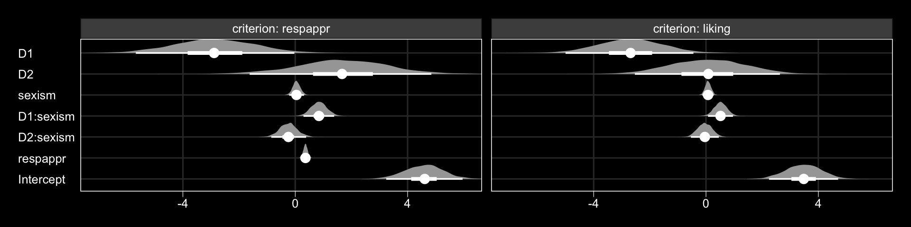
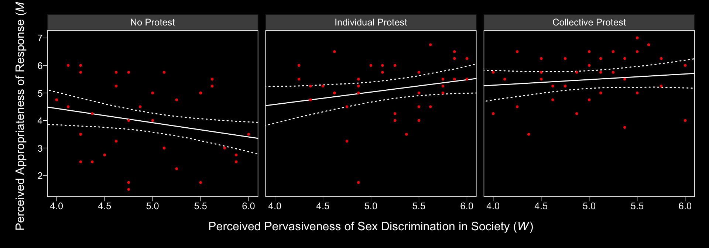
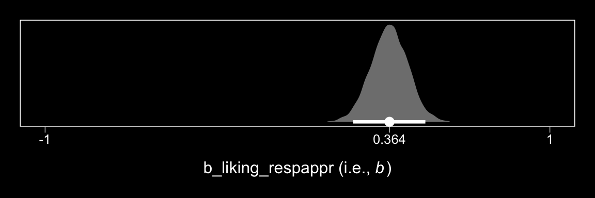
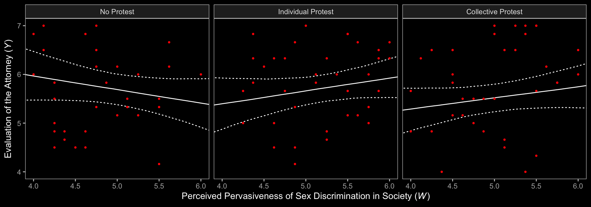

# Conditional Process Analysis with a Multicategorical Antecedent


## Revisiting sexual discrimination in the workplace

Here we load a couple necessary packages, load the data, and take a `glimpse()`.


```r
library(tidyverse)

protest <- read_csv("data/protest/protest.csv")

glimpse(protest)
```

```
## Observations: 129
## Variables: 6
## $ subnum   <int> 209, 44, 124, 232, 30, 140, 27, 64, 67, 182, 85, 109, 122, 69, 45, 28, 170, 66...
## $ protest  <int> 2, 0, 2, 2, 2, 1, 2, 0, 0, 0, 2, 2, 0, 1, 1, 0, 1, 2, 2, 1, 2, 1, 1, 2, 2, 0, ...
## $ sexism   <dbl> 4.87, 4.25, 5.00, 5.50, 5.62, 5.75, 5.12, 6.62, 5.75, 4.62, 4.75, 6.12, 4.87, ...
## $ angry    <int> 2, 1, 3, 1, 1, 1, 2, 1, 6, 1, 2, 5, 2, 1, 1, 1, 2, 1, 3, 4, 1, 1, 1, 5, 1, 5, ...
## $ liking   <dbl> 4.83, 4.50, 5.50, 5.66, 6.16, 6.00, 4.66, 6.50, 1.00, 6.83, 5.00, 5.66, 5.83, ...
## $ respappr <dbl> 4.25, 5.75, 4.75, 7.00, 6.75, 5.50, 5.00, 6.25, 3.00, 5.75, 5.25, 7.00, 4.50, ...
```

With a little `ifelse()`, we can make the `D1` and `D2` contrast-coded dummies.


```r
protest <-
  protest %>% 
  mutate(D1 = ifelse(protest == 0, -2/3, 1/3),
         D2 = ifelse(protest == 0, 0,
                     ifelse(protest == 1, -1/2, 1/2)))
```

Load brms.


```r
library(brms)
```

Here are the sub-model formulas.


```r
m_model <- bf(respappr ~ 1 + D1 + D2 + sexism + D1:sexism + D2:sexism)
y_model <- bf(liking   ~ 1 + D1 + D2 + respappr + sexism + D1:sexism + D2:sexism)
```

Now we're ready to fit our primary model, the conditional process model with a multicategorical antecedent.


```r
model1 <-
  brm(data = protest, family = gaussian,
      m_model + y_model + set_rescor(FALSE),
      chains = 4, cores = 4)
```

Here's the model summary, which coheres reasonably well with the output in Table 13.1.


```r
print(model1, digits = 3)
```

```
##  Family: MV(gaussian, gaussian) 
##   Links: mu = identity; sigma = identity
##          mu = identity; sigma = identity 
## Formula: respappr ~ 1 + D1 + D2 + sexism + D1:sexism + D2:sexism 
##          liking ~ 1 + D1 + D2 + respappr + sexism + D1:sexism + D2:sexism 
##    Data: protest (Number of observations: 129) 
## Samples: 4 chains, each with iter = 2000; warmup = 1000; thin = 1;
##          total post-warmup samples = 4000
## 
## Population-Level Effects: 
##                    Estimate Est.Error l-95% CI u-95% CI Eff.Sample  Rhat
## respappr_Intercept    4.587     0.681    3.239    5.957       4000 0.999
## liking_Intercept      3.478     0.633    2.243    4.705       4000 1.000
## respappr_D1          -2.876     1.443   -5.675   -0.031       3545 1.000
## respappr_D2           1.672     1.622   -1.624    4.845       3595 1.001
## respappr_sexism       0.045     0.132   -0.213    0.312       4000 0.999
## respappr_D1:sexism    0.843     0.280    0.294    1.386       3575 1.000
## respappr_D2:sexism   -0.244     0.311   -0.854    0.387       3579 1.001
## liking_D1            -2.690     1.154   -5.001   -0.447       3523 1.000
## liking_D2             0.069     1.334   -2.531    2.632       3310 1.001
## liking_respappr       0.364     0.073    0.220    0.507       4000 1.000
## liking_sexism         0.074     0.104   -0.127    0.273       4000 1.000
## liking_D1:sexism      0.519     0.228    0.074    0.960       3488 1.000
## liking_D2:sexism     -0.042     0.255   -0.537    0.457       3358 1.000
## 
## Family Specific Parameters: 
##                Estimate Est.Error l-95% CI u-95% CI Eff.Sample  Rhat
## sigma_respappr    1.149     0.075    1.013    1.307       4000 1.001
## sigma_liking      0.917     0.060    0.805    1.041       4000 0.999
## 
## Samples were drawn using sampling(NUTS). For each parameter, Eff.Sample 
## is a crude measure of effective sample size, and Rhat is the potential 
## scale reduction factor on split chains (at convergence, Rhat = 1).
```

The `tidybayes::geom_halfeyeh()` function gives us a nice way to look at the output with a coefficient plot.


```r
library(tidybayes)

post <- posterior_samples(model1)

post %>% 
  select(starts_with("b_")) %>% 
  gather() %>% 
  mutate(criterion = ifelse(str_detect(key, "respappr"), "criterion: respappr", "criterion: liking"),
         criterion = factor(criterion, levels = c("criterion: respappr", "criterion: liking")),
         key = str_remove(key, "b_respappr_"),
         key = str_remove(key, "b_liking_"),
         key = factor(key, levels = c("Intercept", "respappr", "D2:sexism", "D1:sexism", "sexism", "D2", "D1"))) %>% 

  ggplot(aes(x = value, y = key, group = key)) +
  geom_halfeyeh(.prob = c(0.95, 0.5), 
                scale = "width", relative_scale = .75,
                color = "white") +
  coord_cartesian(xlim = c(-7, 6)) +
  labs(x = NULL, y = NULL) +
  theme_black() +
  theme(axis.text.y = element_text(hjust = 0),
        axis.ticks.y = element_blank(),
        panel.grid.minor = element_blank(),
        panel.grid.major = element_line(color = "grey20")) +
  facet_wrap(~criterion)
```



The Bayesian $R^2$ distributions are reasonably close to the estimates in the text.


```r
bayes_R2(model1) %>% round(digits = 3)
```

```
##             Estimate Est.Error  Q2.5 Q97.5
## R2_respappr    0.320     0.052 0.213 0.413
## R2_liking      0.294     0.055 0.181 0.397
```

## Looking at the components of the indirect effect of $X$

### Examiing the first stage of the mediation process.

When making a `newdata` object to feed into `fitted()` with more complicated models, it can be useful to review the model formula like so:


```r
model1$formula
```

```
## respappr ~ 1 + D1 + D2 + sexism + D1:sexism + D2:sexism 
## liking ~ 1 + D1 + D2 + respappr + sexism + D1:sexism + D2:sexism
```

Now we'll prep for and make our version of Figure 13.3.


```r
nd <-
  tibble(D1 = rep(c(1/3, -2/3, 1/3), each = 30),
         D2 = rep(c(1/2, 0, -1/2), each = 30),
         sexism = rep(seq(from = 3.5, to = 6.5, length.out = 30),
                      times = 3))

model1_fitted <-
  fitted(model1, 
       newdata = nd,
       resp = "respappr") %>% 
  as_tibble() %>% 
  bind_cols(nd) %>% 
  mutate(condition = ifelse(D2 == 0, "No Protest",
                            ifelse(D2 == -1/2, "Individual Protest", "Collective Protest"))) %>% 
  mutate(condition = factor(condition, levels = c("No Protest", "Individual Protest", "Collective Protest")))

protest <-
  protest %>% 
  mutate(condition = ifelse(protest == 0, "No Protest",
                            ifelse(protest == 1, "Individual Protest", "Collective Protest"))) %>% 
  mutate(condition = factor(condition, levels = c("No Protest", "Individual Protest", "Collective Protest")))

model1_fitted %>% 
  ggplot(aes(x = sexism, group = condition)) +
  geom_ribbon(aes(ymin = Q2.5, ymax = Q97.5),
              linetype = 3, color = "white", fill = "transparent") +
  geom_line(aes(y = Estimate), color = "white") +
  geom_point(data = protest, aes(x = sexism, y = respappr),
             color = "red", size = 2/3) +
  coord_cartesian(xlim = 4:6) +
  labs(x = expression(paste("Perceived Pervasiveness of Sex Discrimination in Society (", italic(W), ")")),
       y = expression(paste("Perceived Appropriateness of Response (", italic(M), ")"))) +
  theme_black() +
  theme(panel.grid = element_blank()) +
  facet_wrap(~condition)
```



In order to get the $\Delta R^2$ distribution analogous to the change in $R^2$ $F$-test Hayes discussed on page 482, we'll have to first refit the model without the interaction for the $M$ criterion. Here are the sub-models.


```r
m_model <- bf(respappr ~ 1 + D1 + D2 + sexism)
y_model <- bf(liking   ~ 1 + D1 + D2 + respappr + sexism + D1:sexism + D2:sexism)
```

Now we fit `model2`.


```r
model2 <-
  brm(data = protest, family = gaussian,
      m_model + y_model + set_rescor(FALSE),
      chains = 4, cores = 4)
```

Now we're ready to compare $R^2$ distributions.


```r
R2s <-
  bayes_R2(model1, resp = "respappr", summary = F) %>% 
  as_tibble() %>% 
  rename(model1 = R2_respappr) %>% 
  bind_cols(
    bayes_R2(model2, resp = "respappr", summary = F) %>% 
      as_tibble() %>% 
      rename(model2 = R2_respappr)
  ) %>% 
  mutate(difference = model1 - model2) 

R2s %>% 
  ggplot(aes(x = difference)) +
  geom_halfeyeh(aes(y = 0), fill = "grey50", color = "white",
                point_interval = median_qi, .prob = 0.95) +
  scale_x_continuous(breaks = median_qi(R2s$difference, .prob = .95)[1, 1:3],
                     labels = median_qi(R2s$difference, .prob = .95)[1, 1:3] %>% round(2)) +
  scale_y_continuous(NULL, breaks = NULL) +
  xlab(expression(paste(Delta, italic(R)^2))) +
  theme_black() +
  theme(panel.grid = element_blank())
```


And we might also compare the models by their information criteria. 


```r
loo(model1, model2)
```

```
##                  LOOIC    SE
## model1          760.10 29.56
## model2          765.47 29.71
## model1 - model2  -5.37  7.96
```

```r
waic(model1, model2)
```

```
##                   WAIC    SE
## model1          759.74 29.47
## model2          765.32 29.71
## model1 - model2  -5.58  7.96
```

The Bayesian $R^2$, the LOO-CV, and the WAIC all suggest there's little difference between the two models with respect to their predictive utility. In such a case, I'd lean on theory to choose between them. If inclined, one could also do Bayesian model averaging. 

Within our Bayesian modeling paradigm, we don't have a direct analogue to the $F$-tests Hayes presented on page 483. But a little `fitted()` and follow-up wrangling will give us some difference scores.


```r
# we need new `nd` data
nd <-
  tibble(D1 = rep(c(1/3, -2/3, 1/3), each = 3),
         D2 = rep(c(1/2, 0, -1/2), each = 3),
         sexism = rep(c(4.250, 5.120, 5.896), times = 3))

# this time we'll use `summary = F`
model1_fitted <-
  fitted(model1, 
       newdata = nd,
       resp = "respappr", 
       summary = F) %>% 
  as_tibble() %>% 
  gather() %>% 
  mutate(condition = rep(c("Collective Protest", "No Protest", "Individual Protest"),
                         each = 3*4000),
         sexism = rep(c(4.250, 5.120, 5.896), times = 3) %>% rep(., each = 4000),
         iter = rep(1:4000, times = 9)) %>% 
  select(-key) %>% 
  spread(key = condition, value = value) %>% 
  mutate(`Individual Protest - No Protest` = `Individual Protest` - `No Protest`,
         `Collective Protest - No Protest` = `Collective Protest` - `No Protest`,
         `Collective Protest - Individual Protest` = `Collective Protest` - `Individual Protest`)

# a tiny bit more wrangling and we're ready to plot the difference distributions
model1_fitted %>% 
  select(sexism, contains("-")) %>% 
  gather(key, value, -sexism) %>% 
  
  ggplot(aes(x = value)) +
  geom_halfeyeh(aes(y = 0), fill = "grey50", color = "white",
                point_interval = median_qi, .prob = 0.95) +
  geom_vline(xintercept = 0, color = "grey25", linetype = 2) +
  scale_y_continuous(NULL, breaks = NULL) +
  facet_grid(sexism~key) +
  theme_black() +
  theme(panel.grid = element_blank())
```


Now we have `model1_fitted`, it's easy to get the typical numeric summaries for the differences.


```r
model1_fitted %>% 
  select(sexism, contains("-")) %>% 
  gather(key, value, -sexism) %>% 
  group_by(key, sexism) %>% 
  summarize(mean = mean(value),
            ll = quantile(value, probs = .025),
            ul = quantile(value, probs = .975)) %>% 
  mutate_if(is.double, round, digits = 3)
```

```
## # A tibble: 9 x 5
## # Groups:   key [3]
##   key                                     sexism  mean     ll    ul
##   <chr>                                    <dbl> <dbl>  <dbl> <dbl>
## 1 Collective Protest - Individual Protest   4.25 0.636 -0.102 1.38 
## 2 Collective Protest - Individual Protest   5.12 0.424 -0.059 0.898
## 3 Collective Protest - Individual Protest   5.90 0.234 -0.418 0.879
## 4 Collective Protest - No Protest           4.25 1.02   0.348 1.72 
## 5 Collective Protest - No Protest           5.12 1.65   1.19  2.11 
## 6 Collective Protest - No Protest           5.90 2.21   1.53  2.87 
## 7 Individual Protest - No Protest           4.25 0.388 -0.34  1.16 
## 8 Individual Protest - No Protest           5.12 1.23   0.739 1.73 
## 9 Individual Protest - No Protest           5.90 1.98   1.31  2.68
```

The three levels of `Collective Protest - Individual Protest` correspond nicely with some of the analyses Hayes presented on pages 484--486. However, they don't get at the differences Hayes expressed as $\theta_{D_{1}\rightarrow M}$ to . For those, we'll have to work directly with the `posterior_samples()`.


```r
post <- posterior_samples(model1)

post %>% 
  mutate(`Difference in how Catherine's behavior is perceived between being told she protested or not when W is 4.250` = b_respappr_D1 + `b_respappr_D1:sexism`*4.250,
         `Difference in how Catherine's behavior is perceived between being told she protested or not when W is 5.210` = b_respappr_D1 + `b_respappr_D1:sexism`*5.120,
         `Difference in how Catherine's behavior is perceived between being told she protested or not when W is 5.896` = b_respappr_D1 + `b_respappr_D1:sexism`*5.896) %>% 
  select(contains("Difference")) %>% 
  gather() %>% 
  group_by(key) %>% 
  summarize(mean = mean(value),
            ll = quantile(value, probs = .025),
            ul = quantile(value, probs = .975)) %>% 
  mutate_if(is.double, round, digits = 3)
```

```
## # A tibble: 3 x 4
##   key                                                                              mean    ll    ul
##   <chr>                                                                           <dbl> <dbl> <dbl>
## 1 Difference in how Catherine's behavior is perceived between being told she pro… 0.706 0.086  1.34
## 2 Difference in how Catherine's behavior is perceived between being told she pro… 1.44  1.02   1.85
## 3 Difference in how Catherine's behavior is perceived between being told she pro… 2.09  1.51   2.69
```

### Estimating the second stage of the mediation process.

Here's $b$.


```r
post %>% 
  
  ggplot(aes(x = b_liking_respappr)) +
  geom_halfeyeh(aes(y = 0), fill = "grey50", color = "white",
                point_interval = median_qi, .prob = 0.95) +
  scale_x_continuous(breaks = c(-1, median(post$b_liking_respappr), 1),
                     labels = c(-1, 
                                median(post$b_liking_respappr) %>% round(3),
                                1)) +
  scale_y_continuous(NULL, breaks = NULL) +
  coord_cartesian(xlim = -1:1) +
  xlab(expression(paste("b_liking_respappr (i.e., ", italic(b), ")"))) +
  theme_black() +
  theme(panel.grid = element_blank())
```



## Relative conditional indirect effects

Before we use Hayes's formulas at the top of pate 488 to re-express the posterior in terms of the relative conditional indirect effects, we might want to clarify which of the `post` columns correspond to the relevant parameters.

* $a_{1}$ = `b_respappr_D1`
* $a_{2}$ = `b_respappr_D2`
* $a_{4}$ = `b_respappr_D1:sexism`
* $a_{5}$ = `b_respappr_D2:sexism`
* $b$ = `b_liking_respappr`

To get our posterior transformations, we'll use the `tidyverse::map()` approach, which first requires we define two custom functions.


```r
# (a1 + a4W)*b
D1_function <- function(w){
  (post$b_respappr_D1 + post$`b_respappr_D1:sexism`*w)*post$b_liking_respappr
  }

# (a2 + a5W)*b
D2_function <- function(w){
  (post$b_respappr_D2 + post$`b_respappr_D2:sexism`*w)*post$b_liking_respappr
  }
```

Next, we'll make a 30-row tibble with each row a value for `sexism`, ranging from 3.5 to 6.5. We'll then apply our two custom functions to the `sexism` values and wrangle the results a bit to make them useful for our purposes.


```r
rcie_tibble <-
  tibble(sexism = seq(from = 3.5, to = 6.5, length.out = 30)) %>% 
  group_by(sexism) %>% 
  mutate(`Protest vs. No Protest` = map(sexism, D1_function),
         `Collective vs. Individual Protest` = map(sexism, D2_function)) %>% 
  unnest() %>% 
  ungroup() %>% 
  mutate(iter = rep(1:4000, times = 30)) %>% 
  gather(`indirect effect`, value, -sexism, -iter) %>% 
  mutate(`indirect effect` = factor(`indirect effect`, levels = c("Protest vs. No Protest", "Collective vs. Individual Protest")))

head(rcie_tibble)
```

```
## # A tibble: 6 x 4
##   sexism  iter `indirect effect`         value
##    <dbl> <int> <fct>                     <dbl>
## 1    3.5     1 Protest vs. No Protest  0.160  
## 2    3.5     2 Protest vs. No Protest -0.0305 
## 3    3.5     3 Protest vs. No Protest -0.174  
## 4    3.5     4 Protest vs. No Protest -0.143  
## 5    3.5     5 Protest vs. No Protest -0.118  
## 6    3.5     6 Protest vs. No Protest  0.00955
```

Here is our variant of Figure 13.4, with respect to the relative conditional indirect effects.


```r
rcie_tibble %>% 
  group_by(`indirect effect`, sexism) %>% 
  summarize(median = median(value),
            ll = quantile(value, probs = .025),
            ul = quantile(value, probs = .975)) %>% 
  
  ggplot(aes(x = sexism, group = `indirect effect`)) +
  geom_ribbon(aes(ymin = ll, ymax = ul),
              color = "white", fill = "transparent", linetype = 3) +
  geom_line(aes(y = median),
            color = "white") +
  coord_cartesian(xlim = 4:6,
                  ylim = c(-.6, .8)) +
  labs(x = expression(paste("Perceived Pervasiveness of Sex Discrimination in Society (", italic(W), ")")),
       y = "Relative Conditional Effect on Liking") +
  theme_black() +
  theme(panel.grid = element_blank(),
        legend.position = "none") +
  facet_grid(~ `indirect effect`)
```


Here are the indirect effect summaries relevant to the contents of Table 13.2.


```r
rcie_tibble_pick_a_point <-
  # notice how we've restricted ourselves to only 3 values for `sexism`
  tibble(sexism = c(4.25, 5.125, 5.896)) %>% 
  group_by(sexism) %>% 
  mutate(`Protest vs. No Protest` = map(sexism, D1_function),
         `Collective vs. Individual Protest` = map(sexism, D2_function)) %>% 
  unnest() %>% 
  ungroup() %>% 
  # because we only have 3 `sexism` values, we only need to repeat `times = 3`
  mutate(iter = rep(1:4000, times = 3)) %>% 
  gather(`indirect effect`, value, -sexism, -iter) %>% 
  mutate(`indirect effect` = factor(`indirect effect`, levels = c("Protest vs. No Protest", "Collective vs. Individual Protest")))

rcie_tibble_pick_a_point %>% 
  group_by(sexism, `indirect effect`) %>% 
  summarize(median = median(value),
            ll = quantile(value, probs = .025),
            ul = quantile(value, probs = .975)) %>% 
  mutate_if(is.double, round, digits = 3)
```

```
## # A tibble: 6 x 5
## # Groups:   sexism [3]
##   sexism `indirect effect`                 median     ll    ul
##    <dbl> <fct>                              <dbl>  <dbl> <dbl>
## 1   4.25 Protest vs. No Protest             0.248  0.03  0.538
## 2   4.25 Collective vs. Individual Protest  0.225 -0.033 0.545
## 3   5.12 Protest vs. No Protest             0.518  0.288 0.807
## 4   5.12 Collective vs. Individual Protest  0.15  -0.021 0.347
## 5   5.90 Protest vs. No Protest             0.755  0.423 1.16 
## 6   5.90 Collective vs. Individual Protest  0.083 -0.152 0.331
```

## Testing and probing moderation of mediation

### A test of moderation of the relative indirect effect.

To get the slopes of `Protest vs. No Protest` and `Collective vs. Individual Protest` (i.e., $a_{4}b$ and $a_{5}b$, respectively), we just work directly with the `posterior_samples()`, which we've saved as `post`.


```r
post <-
  post %>% 
  mutate(a4b = `b_respappr_D1:sexism`*b_liking_respappr,
         a5b = `b_respappr_D2:sexism`*b_liking_respappr) 

post %>% 
  select(a4b:a5b) %>%
  gather() %>% 
  group_by(key) %>% 
  summarize(mean = mean(value),
            ll = quantile(value, probs = .025),
            ul = quantile(value, probs = .975)) %>% 
  mutate_if(is.double, round, digits = 3)
```

```
## # A tibble: 2 x 4
##   key     mean     ll    ul
##   <chr>  <dbl>  <dbl> <dbl>
## 1 a4b    0.307  0.099  0.56
## 2 a5b   -0.089 -0.326  0.14
```

Here they are in a `geom_halfeyeh()` plot.


```r
post %>% 
  select(a4b:a5b) %>%
  gather() %>% 
 
  ggplot(aes(x = value, y = key, group = key)) +
  geom_halfeyeh(point_interval = median_qi, .prob = c(0.95, 0.5),
                fill = "grey50", color = "white") +
  scale_y_discrete(expand = c(.1, .1)) +
  labs(x = NULL, y = NULL) +
  theme_black() +
  theme(axis.ticks.y = element_blank(),
        panel.grid.minor.y = element_blank(),
        panel.grid.major.y = element_blank()) 
```


### Probing moderation of mediation.

We already computed the relevant 95% credible intervals at the end of section **13.3 Relative conditional indirect effects**. We could inspect those in a `geom_halfeyeh()` plot, too.


```r
rcie_tibble_pick_a_point %>%   
  
  ggplot(aes(x = value, y = sexism, group = sexism)) +
  geom_halfeyeh(point_interval = median_qi, .prob = c(0.95, 0.5),
                fill = "grey50", color = "white") +
  labs(x = "Relative Conditional Effect on Liking", y = NULL) +
  theme_black() +
  theme(axis.text.y = element_text(hjust = 0),
        panel.grid.minor.y = element_blank(),
        panel.grid.major.y = element_blank()) +
  facet_wrap(~`indirect effect`)
```


## Relative conditional direct effects

In order to get the $R^2$ difference distribution analogous to the change in $R^2$ $F$-test Hayes discussed on pages 495--496, we'll have to first refit the model without the interaction for the $Y$ criterion, `liking`.


```r
m_model <- bf(respappr ~ 1 + D1 + D2 + sexism + D1:sexism + D2:sexism)
y_model <- bf(liking   ~ 1 + D1 + D2 + respappr + sexism)

model3 <-
  brm(data = protest, family = gaussian,
      m_model + y_model + set_rescor(FALSE),
      chains = 4, cores = 4)
```

Here's the $\Delta R^2$ density.


```r
R2s <-
  bayes_R2(model1, resp = "liking", summary = F) %>% 
  as_tibble() %>% 
  rename(model1 = R2_liking) %>% 
  bind_cols(
    bayes_R2(model3, resp = "liking", summary = F) %>% 
      as_tibble() %>% 
      rename(model3 = R2_liking)
  ) %>% 
  mutate(difference = model1 - model3) 

R2s %>% 
  ggplot(aes(x = difference, y = 0)) +
  
  geom_halfeyeh(point_interval = median_qi, .prob = c(0.95, 0.5),
                fill = "grey50", color = "white") +
  scale_x_continuous(breaks = c(-.5, median(R2s$difference) %>% round(2), .5)) +
  scale_y_continuous(NULL, breaks = NULL) +
  coord_cartesian(xlim = c(-.5, .5)) +
  xlab(expression(paste(Delta, italic(R)^2))) +
  theme_black() +
  theme(panel.grid = element_blank())
```


We'll also compare the models by their information criteria. 


```r
loo(model1, model3)
```

```
##                 LOOIC    SE
## model1          760.1 29.56
## model3          761.6 30.99
## model1 - model3  -1.5  5.49
```

```r
waic(model1, model3)
```

```
##                   WAIC    SE
## model1          759.74 29.47
## model3          761.34 30.92
## model1 - model3  -1.60  5.47
```

As when we went through these steps for `resp = "respappr"`, above, the Bayesian $R^2$, the LOO-CV, and the WAIC all suggest there's little difference between the two models with respect to predictive utility. In such a case, I'd lean on theory to choose between them. If inclined, one could also do Bayesian model averaging. 

Our approach to plotting the relative conditional *direct* effects will mirror what we did for the relative conditional *indirect* effects, above. Here are the `brm()` parameters that correspond to the parameter names of Hayes's notation.

* $c_{1}$ = `b_liking_D1`
* $c_{2}$ = `b_liking_D2`
* $c_{4}$ = `b_liking_D1:sexism`
* $c_{5}$ = `b_liking_D2:sexism`

With all clear, we're off to the races.


```r
# c1 + c4W
D1_function <- function(w){
  post$b_liking_D1 + post$`b_liking_D1:sexism`*w
  }

# c2 + c5W
D2_function <- function(w){
  post$b_liking_D2 + post$`b_liking_D2:sexism`*w
  }

rcde_tibble <-
  tibble(sexism = seq(from = 3.5, to = 6.5, length.out = 30)) %>% 
  group_by(sexism) %>% 
  mutate(`Protest vs. No Protest`            = map(sexism, D1_function),
         `Collective vs. Individual Protest` = map(sexism, D2_function)) %>% 
  unnest() %>% 
  ungroup() %>% 
  mutate(iter = rep(1:4000, times = 30)) %>% 
  gather(`direct effect`, value, -sexism, -iter) %>% 
  mutate(`direct effect` = factor(`direct effect`, levels = c("Protest vs. No Protest", "Collective vs. Individual Protest")))

head(rcde_tibble)
```

```
## # A tibble: 6 x 4
##   sexism  iter `direct effect`         value
##    <dbl> <int> <fct>                   <dbl>
## 1    3.5     1 Protest vs. No Protest -0.856
## 2    3.5     2 Protest vs. No Protest -0.482
## 3    3.5     3 Protest vs. No Protest -1.24 
## 4    3.5     4 Protest vs. No Protest -1.23 
## 5    3.5     5 Protest vs. No Protest -1.06 
## 6    3.5     6 Protest vs. No Protest -0.663
```

Here is our variant of Figure 13.4, with respect to the relative conditional direct effects.


```r
rcde_tibble %>% 
  group_by(`direct effect`, sexism) %>% 
  summarize(median = median(value),
            ll = quantile(value, probs = .025),
            ul = quantile(value, probs = .975)) %>% 
  
  ggplot(aes(x = sexism, group = `direct effect`)) +
  geom_ribbon(aes(ymin = ll, ymax = ul),
              color = "white", fill = "transparent", linetype = 3) +
  geom_line(aes(y = median),
            color = "white") +
  coord_cartesian(xlim = 4:6,
                  ylim = c(-.6, .8)) +
  labs(x = expression(paste("Perceived Pervasiveness of Sex Discrimination in Society (", italic(W), ")")),
       y = "Relative Conditional Effect on Liking") +
  theme_black() +
  theme(panel.grid = element_blank(),
        legend.position = "none") +
  facet_grid(~ `direct effect`)
```


Holy smokes, them are some wide 95% CIs! No wonder the information criteria and $R^2$ comparisons were so uninspiring. 

Notice that the y-axis is on the parameter space. In Hayes's Figure 13.5, the y-axis is on the `liking` space, instead. When we want things in the parameter space, we work with the output of `posterior_samples()`; when we want them in the criterion space, we use `fitted()`.


```r
# we need new `nd` data
nd <-
  tibble(D1 = rep(c(1/3, -2/3, 1/3), each = 30),
         D2 = rep(c(1/2, 0, -1/2), each = 30),
         respappr = mean(protest$respappr),
         sexism = seq(from = 3.5, to = 6.5, length.out = 30) %>% rep(., times = 3))

# we feed `nd` into `fitted()`
model1_fitted <-
  fitted(model1, 
       newdata = nd,
       resp = "liking", 
       summary = T) %>% 
  as_tibble() %>% 
  bind_cols(nd) %>% 
  mutate(condition = ifelse(D2 == 0, "No Protest",
                            ifelse(D2 == -1/2, "Individual Protest", "Collective Protest"))) %>% 
  mutate(condition = factor(condition, levels = c("No Protest", "Individual Protest", "Collective Protest")))
 
model1_fitted %>% 
  ggplot(aes(x = sexism, group = condition)) +
  geom_ribbon(aes(ymin = Q2.5, ymax = Q97.5),
              linetype = 3, color = "white", fill = "transparent") +
  geom_line(aes(y = Estimate), color = "white") +
  geom_point(data = protest, aes(x = sexism, y = liking),
             color = "red", size = 2/3) +
  coord_cartesian(xlim = 4:6,
                  ylim = 4:7) +
  labs(x = expression(paste("Perceived Pervasiveness of Sex Discrimination in Society (", italic(W), ")")),
       y = expression(paste("Evaluation of the Attorney (", italic(Y), ")"))) +
  theme_black() +
  theme(panel.grid = element_blank()) +
  facet_wrap(~condition)
```


We expanded the range of the y-axis, a bit, to show more of that data (and there's even more data outside of our expanded range). Also note how after doing so and after including the 95% CI bands, the crossing regression line effect in Hayes’s Figure 13.5 isn’t as impressive looking any more.

On pages 497--498, Hayes discussed more omnibus $F$-tests. Much like with the $M$ criterion, we won't come up with Bayesian $F$-tests, but we might go ahead and make pairwise comparisons at the three percentiles Hayes prefers. 


```r
# we need new `nd` data
nd <-
  tibble(D1 = rep(c(1/3, -2/3, 1/3), each = 3),
         D2 = rep(c(1/2, 0, -1/2), each = 3),
         respappr = mean(protest$respappr),
         sexism = rep(c(4.250, 5.120, 5.896), times = 3))

# this tie we'll use `summary = F`
model1_fitted <-
  fitted(model1, 
       newdata = nd,
       resp = "liking", 
       summary = F) %>% 
  as_tibble() %>% 
  gather() %>% 
  mutate(condition = rep(c("Collective Protest", "No Protest", "Individual Protest"),
                         each = 3*4000),
         sexism = rep(c(4.250, 5.120, 5.896), times = 3) %>% rep(., each = 4000),
         iter = rep(1:4000, times = 9)) %>% 
  select(-key) %>% 
  spread(key = condition, value = value) %>% 
  mutate(`Individual Protest - No Protest` = `Individual Protest` - `No Protest`,
         `Collective Protest - No Protest` = `Collective Protest` - `No Protest`,
         `Collective Protest - Individual Protest` = `Collective Protest` - `Individual Protest`)

# a tiny bit more wrangling and we're ready to plot the difference distributions
model1_fitted %>% 
  select(sexism, contains("-")) %>% 
  gather(key, value, -sexism) %>% 
  
  ggplot(aes(x = value)) +
  geom_halfeyeh(aes(y = 0), fill = "grey50", color = "white",
                point_interval = median_qi, .prob = 0.95) +
  geom_vline(xintercept = 0, color = "grey25", linetype = 2) +
  scale_y_continuous(NULL, breaks = NULL) +
  facet_grid(sexism~key) +
  theme_black() +
  theme(panel.grid = element_blank())
```



Now we have `model1_fitted`, it's easy to get the typical numeric summaries for the differences.


```r
model1_fitted %>% 
  select(sexism, contains("-")) %>% 
  gather(key, value, -sexism) %>% 
  group_by(key, sexism) %>% 
  summarize(mean = mean(value),
            ll = quantile(value, probs = .025),
            ul = quantile(value, probs = .975)) %>% 
  mutate_if(is.double, round, digits = 3)
```

```
## # A tibble: 9 x 5
## # Groups:   key [3]
##   key                                     sexism   mean     ll    ul
##   <chr>                                    <dbl>  <dbl>  <dbl> <dbl>
## 1 Collective Protest - Individual Protest   4.25 -0.11  -0.713 0.487
## 2 Collective Protest - Individual Protest   5.12 -0.147 -0.539 0.254
## 3 Collective Protest - Individual Protest   5.90 -0.179 -0.72  0.361
## 4 Collective Protest - No Protest           4.25 -0.542 -1.11  0.036
## 5 Collective Protest - No Protest           5.12 -0.109 -0.569 0.338
## 6 Collective Protest - No Protest           5.90  0.277 -0.381 0.904
## 7 Individual Protest - No Protest           4.25 -0.432 -1.05  0.18 
## 8 Individual Protest - No Protest           5.12  0.038 -0.373 0.465
## 9 Individual Protest - No Protest           5.90  0.456 -0.147 1.06
```

We don't have $p$-values, but all the differences are small in magnitude and have wide 95% intervals straddling zero.

To get the difference scores Hayes presented on pages 498--500, one might:


```r
post %>% 
  mutate(`Difference in liking between being told she protested or not when W is 4.250` = b_liking_D1 + `b_liking_D1:sexism`*4.250,
         `Difference in liking between being told she protested or not when W is 5.120` = b_liking_D1 + `b_liking_D1:sexism`*5.120,
         `Difference in liking between being told she protested or not when W is 5.896` = b_liking_D1 + `b_liking_D1:sexism`*5.896,
         
         `Difference in liking between collective vs. individual protest when W is 4.250` = b_liking_D2 + `b_liking_D2:sexism`*4.250,
         `Difference in liking between collective vs. individual protest when W is 5.120` = b_liking_D2 + `b_liking_D2:sexism`*5.120,
         `Difference in liking between collective vs. individual protest when W is 5.896` = b_liking_D2 + `b_liking_D2:sexism`*5.896) %>% 
  select(contains("Difference in liking")) %>% 
  gather() %>% 
  group_by(key) %>% 
  summarize(mean = mean(value),
            ll = quantile(value, probs = .025),
            ul = quantile(value, probs = .975)) %>% 
  mutate_if(is.double, round, digits = 3)
```

```
## # A tibble: 6 x 4
##   key                                                                             mean     ll    ul
##   <chr>                                                                          <dbl>  <dbl> <dbl>
## 1 Difference in liking between being told she protested or not when W is 4.250  -0.487 -1.00  0.017
## 2 Difference in liking between being told she protested or not when W is 5.120  -0.036 -0.43  0.35 
## 3 Difference in liking between being told she protested or not when W is 5.896   0.367 -0.207 0.923
## 4 Difference in liking between collective vs. individual protest when W is 4.2… -0.11  -0.713 0.487
## 5 Difference in liking between collective vs. individual protest when W is 5.1… -0.147 -0.539 0.254
## 6 Difference in liking between collective vs. individual protest when W is 5.8… -0.179 -0.72  0.361
```

## References {-}

[Hayes, A. F. (2018). *Introduction to mediation, moderation, and conditional process analysis: A regression-based approach.* (2nd ed.). New York, NY, US: The Guilford Press.](http://afhayes.com/introduction-to-mediation-moderation-and-conditional-process-analysis.html)

## Session info {-}


```r
sessionInfo()
```

```
## R version 3.5.1 (2018-07-02)
## Platform: x86_64-apple-darwin15.6.0 (64-bit)
## Running under: macOS High Sierra 10.13.4
## 
## Matrix products: default
## BLAS: /Library/Frameworks/R.framework/Versions/3.5/Resources/lib/libRblas.0.dylib
## LAPACK: /Library/Frameworks/R.framework/Versions/3.5/Resources/lib/libRlapack.dylib
## 
## locale:
## [1] en_US.UTF-8/en_US.UTF-8/en_US.UTF-8/C/en_US.UTF-8/en_US.UTF-8
## 
## attached base packages:
## [1] stats     graphics  grDevices utils     datasets  methods   base     
## 
## other attached packages:
##  [1] tidybayes_0.12.1.9000 brms_2.4.0            Rcpp_0.12.18          bindrcpp_0.2.2       
##  [5] forcats_0.3.0         stringr_1.3.1         dplyr_0.7.6           purrr_0.2.5          
##  [9] readr_1.1.1           tidyr_0.8.1           tibble_1.4.2          ggplot2_3.0.0        
## [13] tidyverse_1.2.1      
## 
## loaded via a namespace (and not attached):
##  [1] nlme_3.1-137              matrixStats_0.54.0        xts_0.10-2               
##  [4] lubridate_1.7.4           threejs_0.3.1             httr_1.3.1               
##  [7] LaplacesDemon_16.1.1      rprojroot_1.3-2           rstan_2.17.3             
## [10] tools_3.5.1               backports_1.1.2           utf8_1.1.4               
## [13] R6_2.2.2                  DT_0.4                    lazyeval_0.2.1           
## [16] colorspace_1.3-2          withr_2.1.2               tidyselect_0.2.4         
## [19] gridExtra_2.3             mnormt_1.5-5              Brobdingnag_1.2-5        
## [22] compiler_3.5.1            cli_1.0.0                 rvest_0.3.2              
## [25] arrayhelpers_1.0-20160527 shinyjs_1.0               xml2_1.2.0               
## [28] labeling_0.3              colourpicker_1.0          bookdown_0.7             
## [31] scales_0.5.0              dygraphs_1.1.1.5          mvtnorm_1.0-8            
## [34] psych_1.8.4               ggridges_0.5.0            digest_0.6.15            
## [37] StanHeaders_2.17.2        foreign_0.8-70            rmarkdown_1.10           
## [40] base64enc_0.1-3           pkgconfig_2.0.1           htmltools_0.3.6          
## [43] htmlwidgets_1.2           rlang_0.2.1               readxl_1.1.0             
## [46] rstudioapi_0.7            shiny_1.1.0               svUnit_0.7-12            
## [49] bindr_0.1.1               zoo_1.8-2                 jsonlite_1.5             
## [52] gtools_3.8.1              crosstalk_1.0.0           inline_0.3.15            
## [55] magrittr_1.5              loo_2.0.0                 bayesplot_1.5.0          
## [58] Matrix_1.2-14             munsell_0.5.0             abind_1.4-5              
## [61] stringi_1.2.3             yaml_2.1.19               MASS_7.3-50              
## [64] ggstance_0.3              plyr_1.8.4                grid_3.5.1               
## [67] parallel_3.5.1            promises_1.0.1            crayon_1.3.4             
## [70] miniUI_0.1.1.1            lattice_0.20-35           haven_1.1.2              
## [73] hms_0.4.2                 knitr_1.20                pillar_1.2.3             
## [76] igraph_1.2.1              markdown_0.8              shinystan_2.5.0          
## [79] codetools_0.2-15          reshape2_1.4.3            stats4_3.5.1             
## [82] rstantools_1.5.0          glue_1.2.0                evaluate_0.10.1          
## [85] modelr_0.1.2              httpuv_1.4.4.2            cellranger_1.1.0         
## [88] gtable_0.2.0              assertthat_0.2.0          xfun_0.3                 
## [91] mime_0.5                  xtable_1.8-2              broom_0.4.5              
## [94] coda_0.19-1               later_0.7.3               rsconnect_0.8.8          
## [97] shinythemes_1.1.1         bridgesampling_0.4-0
```
