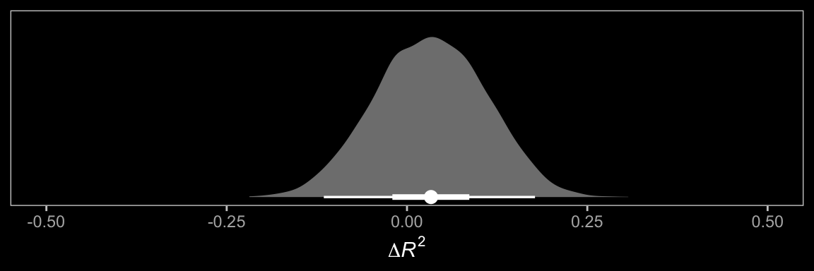
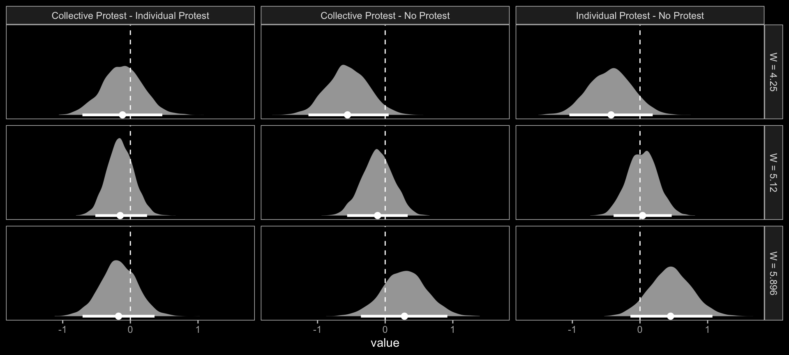

# Conditional Process Analysis with a Multicategorical Antecedent


With his opening lines, Hayes prepared us:

> At the end of any great fireworks show is the grand finale, where the pyrotechnicians throw everything remaining in their arsenal at you at once, leaving you amazed, dazed, and perhaps temporarily a little hard of hearing. Although this is not the final chapter of this book, I am now going to throw everything at you at once with an example of the most complicated conditional process model I will cover in this book. (p. 469)

Enjoy the fireworks.

## Revisiting sexual discrimination in the workplace

Here we load a couple necessary packages, load the data, and take a `glimpse()`.


```r
library(tidyverse)

protest <- read_csv("data/protest/protest.csv")

glimpse(protest)
```

```
## Observations: 129
## Variables: 6
## $ subnum   <dbl> 209, 44, 124, 232, 30, 140, 27, 64, 67, 182, 85, 109, 122, 69, 45, 28, 170, 66, …
## $ protest  <dbl> 2, 0, 2, 2, 2, 1, 2, 0, 0, 0, 2, 2, 0, 1, 1, 0, 1, 2, 2, 1, 2, 1, 1, 2, 2, 0, 1,…
## $ sexism   <dbl> 4.87, 4.25, 5.00, 5.50, 5.62, 5.75, 5.12, 6.62, 5.75, 4.62, 4.75, 6.12, 4.87, 5.…
## $ angry    <dbl> 2, 1, 3, 1, 1, 1, 2, 1, 6, 1, 2, 5, 2, 1, 1, 1, 2, 1, 3, 4, 1, 1, 1, 5, 1, 5, 1,…
## $ liking   <dbl> 4.83, 4.50, 5.50, 5.66, 6.16, 6.00, 4.66, 6.50, 1.00, 6.83, 5.00, 5.66, 5.83, 6.…
## $ respappr <dbl> 4.25, 5.75, 4.75, 7.00, 6.75, 5.50, 5.00, 6.25, 3.00, 5.75, 5.25, 7.00, 4.50, 6.…
```

With a little `ifelse()`, we can make the `d1` and `d2` contrast-coded dummies.


```r
protest <-
  protest %>% 
  mutate(d1 = ifelse(protest == 0, -2/3, 1/3),
         d2 = ifelse(protest == 0, 0,
                     ifelse(protest == 1, -1/2, 1/2)))
```

Now load **brms**.


```r
library(brms)
```

Our statistical model follows two primary equations,

\begin{align*}
M & = i_M + a_1 D_1 + a_2 D_2 + a_3 W + a_4 D_1 W + a_5 D_2 W + e_M \\
Y & = i_Y + c_1' D_1 + c_2' D_2 + c_3' W + c_4' D_1 W + c_5' D_2 W + b M + e_Y.
\end{align*}

Here's how we might specify the sub-model formulas with `bf()`.


```r
m_model <- bf(respappr ~ 1 + d1 + d2 + sexism + d1:sexism + d2:sexism)
y_model <- bf(liking   ~ 1 + d1 + d2 + sexism + d1:sexism + d2:sexism + respappr)
```

Now we're ready to fit our primary model, the conditional process model with a multicategorical antecedent.


```r
model13.1 <-
  brm(data = protest, 
      family = gaussian,
      m_model + y_model + set_rescor(FALSE),
      chains = 4, cores = 4)
```

Here's the model summary, which coheres reasonably well with the output in Table 13.1.


```r
print(model13.1, digits = 3)
```

```
##  Family: MV(gaussian, gaussian) 
##   Links: mu = identity; sigma = identity
##          mu = identity; sigma = identity 
## Formula: respappr ~ 1 + d1 + d2 + sexism + d1:sexism + d2:sexism 
##          liking ~ 1 + d1 + d2 + sexism + d1:sexism + d2:sexism + respappr 
##    Data: protest (Number of observations: 129) 
## Samples: 4 chains, each with iter = 2000; warmup = 1000; thin = 1;
##          total post-warmup samples = 4000
## 
## Population-Level Effects: 
##                    Estimate Est.Error l-95% CI u-95% CI  Rhat Bulk_ESS Tail_ESS
## respappr_Intercept    4.621     0.676    3.323    5.952 1.001     5032     2988
## liking_Intercept      3.481     0.642    2.231    4.725 1.000     5526     2823
## respappr_d1          -2.941     1.485   -5.844    0.119 1.000     2890     2585
## respappr_d2           1.654     1.663   -1.595    4.912 1.002     3184     2347
## respappr_sexism       0.039     0.131   -0.221    0.295 1.001     5038     2707
## respappr_d1:sexism    0.856     0.288    0.270    1.425 1.000     2861     2703
## respappr_d2:sexism   -0.240     0.319   -0.863    0.373 1.003     3186     2359
## liking_d1            -2.722     1.204   -5.122   -0.422 1.002     3379     2730
## liking_d2             0.015     1.309   -2.596    2.565 1.001     3089     2830
## liking_sexism         0.073     0.106   -0.137    0.281 1.001     5836     2702
## liking_respappr       0.366     0.072    0.226    0.502 1.001     4902     2692
## liking_d1:sexism      0.524     0.237    0.076    0.997 1.001     3245     2690
## liking_d2:sexism     -0.032     0.251   -0.522    0.460 1.001     3035     2828
## 
## Family Specific Parameters: 
##                Estimate Est.Error l-95% CI u-95% CI  Rhat Bulk_ESS Tail_ESS
## sigma_respappr    1.149     0.073    1.017    1.302 1.000     4880     3006
## sigma_liking      0.917     0.059    0.812    1.040 1.000     4714     3427
## 
## Samples were drawn using sampling(NUTS). For each parameter, Eff.Sample 
## is a crude measure of effective sample size, and Rhat is the potential 
## scale reduction factor on split chains (at convergence, Rhat = 1).
```

Why not look at the output with a coefficient plot?


```r
library(tidybayes)

post <- posterior_samples(model13.1)

post %>% 
  pivot_longer(starts_with("b_")) %>% 
  mutate(criterion = ifelse(str_detect(name, "respappr"), "criterion: respappr", "criterion: liking"),
         criterion = factor(criterion, levels = c("criterion: respappr", "criterion: liking")),
         name = str_remove(name, "b_respappr_"),
         name = str_remove(name, "b_liking_"),
         name = factor(name, levels = c("Intercept", "respappr", "d2:sexism", "d1:sexism", "sexism", "d2", "d1"))) %>% 

  ggplot(aes(x = value, y = name, group = name)) +
  geom_halfeyeh(.width = .95, 
                scale = "width", relative_scale = .75,
                color = "white") +
  coord_cartesian(xlim = c(-7, 6)) +
  labs(x = NULL, y = NULL) +
  theme_black() +
  theme(axis.text.y = element_text(hjust = 0),
        axis.ticks.y = element_blank(),
        panel.grid.minor = element_blank(),
        panel.grid.major = element_line(color = "grey20")) +
  facet_wrap(~criterion)
```


The Bayesian $R^2$ distributions are reasonably close to the estimates in the text.


```r
bayes_R2(model13.1) %>% round(digits = 3)
```

```
##            Estimate Est.Error  Q2.5 Q97.5
## R2respappr    0.321     0.054 0.208 0.419
## R2liking      0.296     0.054 0.185 0.394
```

## Looking at the components of the indirect effect of $X$

> A mediation process contains at least two "stages." The first stage is the effect of the presumed causal antecedent variable $X$ on the proposed mediator $M$, and the second stage is the effect of the mediator $M$ on the final consequent variable $Y$. More complex models, such as the serial mediation model, will contain more stages. In a model such as the one that is the focus of this chapter with only a single mediator, the indirect effect of $X$ on $Y$ through $M$ is quantified as the product of the effects in these two stages. When one or both of the stages of a mediation process is moderated, making sense of the indirect effect requires getting intimate with each of the stages, so that when they are integrated or multiplied together, you can better understand how differences or changes in $X$ map on to differences in $Y$ through a mediator differently depending on the value of a moderator. (p. 480)

### Examining the first stage of the mediation process.

When making a `newdata` object to feed into `fitted()` with more complicated models, it can be useful to review the model formula like so.


```r
model13.1$formula
```

```
## respappr ~ 1 + d1 + d2 + sexism + d1:sexism + d2:sexism 
## liking ~ 1 + d1 + d2 + sexism + d1:sexism + d2:sexism + respappr
```

Now we'll prep for and make our version of Figure 13.3.


```r
nd <-
  tibble(d1 = c(1/3, -2/3, 1/3),
         d2 = c(1/2, 0, -1/2)) %>% 
  expand(nesting(d1, d2),
         sexism = seq(from = 3.5, to = 6.5, length.out = 30))

f1 <-
  fitted(model13.1, 
         newdata = nd,
         resp = "respappr") %>% 
  as_tibble() %>% 
  bind_cols(nd) %>% 
  mutate(condition = ifelse(d2 == 0, "No Protest",
                            ifelse(d2 == -1/2, "Individual Protest", "Collective Protest"))) %>% 
  mutate(condition = factor(condition, levels = c("No Protest", "Individual Protest", "Collective Protest")))

protest <-
  protest %>% 
  mutate(condition = ifelse(protest == 0, "No Protest",
                            ifelse(protest == 1, "Individual Protest", "Collective Protest"))) %>% 
  mutate(condition = factor(condition, levels = c("No Protest", "Individual Protest", "Collective Protest")))

f1 %>% 
  ggplot(aes(x = sexism, group = condition)) +
  geom_ribbon(aes(ymin = Q2.5, ymax = Q97.5),
              linetype = 3, color = "white", fill = "transparent") +
  geom_line(aes(y = Estimate), color = "white") +
  geom_point(data = protest, aes(x = sexism, y = respappr),
             color = "red", size = 2/3) +
  coord_cartesian(xlim = 4:6) +
  labs(x = expression(paste("Perceived Pervasiveness of Sex Discrimination in Society (", italic(W), ")")),
       y = expression(paste("Perceived Appropriateness of Response (", italic(M), ")"))) +
  theme_black() +
  theme(panel.grid = element_blank()) +
  facet_wrap(~condition)
```


In order to get the $\Delta R^2$ distribution analogous to the change in $R^2$ $F$-test Hayes discussed on page 482, we'll have to first refit the model without the interaction for the $M$ criterion. Here are the sub-models.


```r
m_model <- bf(respappr ~ 1 + d1 + d2 + sexism)
y_model <- bf(liking   ~ 1 + d1 + d2 + respappr + sexism + d1:sexism + d2:sexism)
```

Now we fit `model13.2`.


```r
model13.2 <-
  brm(data = protest, 
      family = gaussian,
      m_model + y_model + set_rescor(FALSE),
      chains = 4, cores = 4)
```

With `model13.2` in hand, we're ready to compare $R^2$ distributions.


```r
# extract the R2 draws and wrangle
r2 <-
  bayes_R2(model13.1, resp = "respappr", summary = F) %>% 
  as_tibble() %>% 
  set_names("model13.1") %>% 
  bind_cols(
    bayes_R2(model13.2, resp = "respappr", summary = F) %>% 
      as_tibble() %>% 
      set_names("model13.2")
  ) %>% 
  mutate(difference = model13.1 - model13.2) 

# plot!
r2 %>% 
  ggplot(aes(x = difference)) +
  geom_halfeyeh(aes(y = 0), fill = "grey50", color = "white",
                point_interval = median_qi, .width = 0.95) +
  scale_x_continuous(expression(paste(Delta, italic(R)^2)),
                     breaks = median_qi(r2$difference, .width = .95)[1, 1:3],
                     labels = median_qi(r2$difference, .width = .95)[1, 1:3] %>% round(2)) +
  scale_y_continuous(NULL, breaks = NULL) +
  theme_black() +
  theme(panel.grid = element_blank())
```


And we might also compare the models by their information criteria. 


```r
model13.1 <- add_criterion(model13.1, c("waic", "loo"))
model13.2 <- add_criterion(model13.2, c("waic", "loo"))

loo_compare(model13.1, model13.2, criterion = "loo") %>% 
  print(simplify = F)
```

```
##           elpd_diff se_diff elpd_loo se_elpd_loo p_loo  se_p_loo looic  se_looic
## model13.1    0.0       0.0  -380.3     14.8        16.3    2.8    760.6   29.6  
## model13.2   -2.5       4.0  -382.8     14.8        14.0    2.5    765.6   29.6
```

```r
loo_compare(model13.1, model13.2, criterion = "waic") %>% 
  print(simplify = F)
```

```
##           elpd_diff se_diff elpd_waic se_elpd_waic p_waic se_p_waic waic   se_waic
## model13.1    0.0       0.0  -380.1      14.7         16.1    2.7     760.2   29.5 
## model13.2   -2.5       4.0  -382.6      14.7         13.8    2.4     765.2   29.4
```

The Bayesian $R^2$, the LOO-CV, and the WAIC all suggest there's little difference between the two models with respect to their predictive utility. In such a case, I'd lean on theory to choose between them. If inclined, one could also do Bayesian model averaging. 

Within our Bayesian modeling paradigm, we don't have a direct analogue to the $F$-tests Hayes presented on page 483. But a little `fitted()` and follow-up wrangling will give us some difference scores.


```r
# we need new `nd` data
nd <-
  tibble(d1 = c(1/3, -2/3, 1/3),
         d2 = c(1/2, 0, -1/2)) %>% 
  expand(nesting(d1, d2),
         sexism = c(4.250, 5.120, 5.896)) %>% 
  mutate(condition = ifelse(d2 == 0, "No Protest",
                            ifelse(d2 < 0, "Individual Protest", "Collective Protest")))

# this time we'll use `summary = F`
f1 <-
  fitted(model13.1, 
       newdata = nd,
       resp = "respappr", 
       summary = F) %>% 
  as_tibble() %>% 
  gather() %>% 
  bind_cols(
    nd %>% 
      expand(nesting(condition, sexism),
             iter = 1:4000)
  ) %>% 
  select(-key) %>% 
  pivot_wider(names_from = condition, values_from = value) %>% 
  mutate(`Individual Protest - No Protest` = `Individual Protest` - `No Protest`,
         `Collective Protest - No Protest` = `Collective Protest` - `No Protest`,
         `Collective Protest - Individual Protest` = `Collective Protest` - `Individual Protest`)

# a tiny bit more wrangling and we're ready
f1 %>% 
  pivot_longer(cols = contains("-")) %>% 
  
  # plot the difference distributions!
  ggplot(aes(x = value)) +
  geom_halfeyeh(aes(y = 0), fill = "grey50", color = "white",
                point_interval = median_qi, .width = .95) +
  geom_vline(xintercept = 0, linetype = 2) +
  scale_y_continuous(NULL, breaks = NULL) +
  facet_grid(sexism~name) +
  theme_black() +
  theme(panel.grid = element_blank())
```


Now we have `f1`, it's easy to get the typical numeric summaries for the differences.


```r
f1 %>% 
  select(sexism, contains("-")) %>% 
  pivot_longer(-sexism) %>% 
  group_by(name, sexism) %>% 
  mean_qi() %>% 
  mutate_if(is.double, round, digits = 3) %>% 
  select(name:.upper) %>% 
  rename(mean = value)
```

```
## # A tibble: 9 x 5
## # Groups:   name [3]
##   name                                    sexism   mean .lower .upper
##   <chr>                                    <dbl>  <dbl>  <dbl>  <dbl>
## 1 Collective Protest - Individual Protest   4.25 -0.38  -1.16   0.421
## 2 Collective Protest - Individual Protest   5.12 -1.23  -1.73  -0.72 
## 3 Collective Protest - Individual Protest   5.90 -1.99  -2.68  -1.25 
## 4 Collective Protest - No Protest           4.25 -1.01  -1.72  -0.334
## 5 Collective Protest - No Protest           5.12 -1.65  -2.15  -1.16 
## 6 Collective Protest - No Protest           5.90 -2.22  -2.93  -1.51 
## 7 Individual Protest - No Protest           4.25 -0.634 -1.40   0.111
## 8 Individual Protest - No Protest           5.12 -0.425 -0.918  0.073
## 9 Individual Protest - No Protest           5.90 -0.239 -0.905  0.433
```

The three levels of `Collective Protest - Individual Protest` correspond nicely with some of the analyses Hayes presented on pages 484--486. However, they don't get at the differences Hayes expressed as $\theta_{D_{1}\rightarrow M}$ to. For those, we'll have to work directly with the `posterior_samples()`.


```r
post <- posterior_samples(model13.1)

post %>% 
  transmute(`4.250` = b_respappr_d1 + `b_respappr_d1:sexism` * 4.250,
            `5.210` = b_respappr_d1 + `b_respappr_d1:sexism` * 5.120,
            `5.896` = b_respappr_d1 + `b_respappr_d1:sexism` * 5.896) %>% 
  pivot_longer(everything()) %>% 
  group_by(name) %>% 
  mean_qi(value) %>% 
  mutate_if(is.double, round, digits = 3) %>% 
  select(name:.upper) %>% 
  rename(mean = value,
         `Difference in how Catherine's behavior is perceived between being told she protested or not when W is:` = name)
```

```
## # A tibble: 3 x 4
##   `Difference in how Catherine's behavior is perceived between being told she p…  mean .lower .upper
##   <chr>                                                                          <dbl>  <dbl>  <dbl>
## 1 4.250                                                                          0.697   0.06   1.35
## 2 5.210                                                                          1.44    1.01   1.86
## 3 5.896                                                                          2.10    1.46   2.73
```

At the end of the subsection, Hayes highlighted $a_5$. Here it is.


```r
post %>% 
  ggplot(aes(x = `b_respappr_d2:sexism`)) +
  geom_halfeyeh(aes(y = 0), fill = "grey50", color = "white",
                point_interval = median_qi, .width = 0.95) +
  scale_y_continuous(NULL, breaks = NULL) +
  coord_cartesian(xlim = -1:1) +
  xlab(expression(paste("b_respappr_d2:sexism (i.e., ", italic(a)[5], ")"))) +
  theme_black() +
  theme(panel.grid = element_blank())
```


### Estimating the second stage of the mediation process.

Now here's $b$.


```r
post %>% 
  ggplot(aes(x = b_liking_respappr)) +
  geom_halfeyeh(aes(y = 0), fill = "grey50", color = "white",
                point_interval = median_qi, .width = 0.95) +
  scale_x_continuous(expression(paste("b_liking_respappr (i.e., ", italic(b), ")")),
                     breaks = c(-1, median(post$b_liking_respappr), 1),
                     labels = c(-1, 
                                median(post$b_liking_respappr) %>% round(3),
                                1)) +
  scale_y_continuous(NULL, breaks = NULL) +
  coord_cartesian(xlim = -1:1) +
  theme_black() +
  theme(panel.grid = element_blank())
```


## Relative conditional indirect effects

> When $X$ is a multicategorical variable representing $g = 3$ groups, there are two indirect effects, which we called *relative* indirect effects in Chapter 10. But these relative indirect effects are still products of effects. In this example, because one of these effects is a function, then the relative indirect effects become a function as well. (p. 487, *emphasis* in the original)

Before we use Hayes's formulas at the top of page 488 to re-express the posterior in terms of the relative conditional indirect effects, we might want to clarify which of the `post` columns correspond to the relevant parameters.

* $a_1$ = `b_respappr_d1`
* $a_2$ = `b_respappr_d2`
* $a_4$ = `b_respappr_d1:sexism`
* $a_5$ = `b_respappr_d2:sexism`
* $b$   = `b_liking_respappr`

To get our posterior transformations, we'll use the `expand()`-based approach from Chapter 12. Here's the preparatory data wrangling.


```r
indirect <-
  post %>% 
  expand(nesting(b_respappr_d1, b_respappr_d2, `b_respappr_d1:sexism`, `b_respappr_d2:sexism`, b_liking_respappr),
         sexism = seq(from = 3.5, to = 6.5, length.out = 30)) %>% 
  mutate(`Protest vs. No Protest`            = (b_respappr_d1 + `b_respappr_d1:sexism` * sexism) * b_liking_respappr,
         `Collective vs. Individual Protest` = (b_respappr_d2 + `b_respappr_d2:sexism` * sexism) * b_liking_respappr) %>% 
  pivot_longer(contains("Protest")) %>% 
  select(sexism:value) %>% 
  
  group_by(name, sexism) %>% 
  median_qi(value)

head(indirect)
```

```
## # A tibble: 6 x 8
## # Groups:   name [1]
##   name                              sexism value  .lower .upper .width .point .interval
##   <chr>                              <dbl> <dbl>   <dbl>  <dbl>  <dbl> <chr>  <chr>    
## 1 Collective vs. Individual Protest   3.5  0.285 -0.115   0.772   0.95 median qi       
## 2 Collective vs. Individual Protest   3.60 0.276 -0.0999  0.737   0.95 median qi       
## 3 Collective vs. Individual Protest   3.71 0.268 -0.0888  0.709   0.95 median qi       
## 4 Collective vs. Individual Protest   3.81 0.259 -0.0778  0.677   0.95 median qi       
## 5 Collective vs. Individual Protest   3.91 0.250 -0.0682  0.649   0.95 median qi       
## 6 Collective vs. Individual Protest   4.02 0.243 -0.0610  0.622   0.95 median qi
```

Now we've saved our results in `indirect`, we just need to plug them into `ggplot()` to make our version of Figure 13.4.


```r
indirect %>% 
  ggplot(aes(x = sexism, group = name)) +
  geom_ribbon(aes(ymin = .lower, ymax = .upper),
              color = "white", fill = "transparent", linetype = 3) +
  geom_line(aes(y = value),
            color = "white") +
  coord_cartesian(xlim = 4:6,
                  ylim = c(-.6, .8)) +
  labs(title = "These are just the conditional indirect effects",
       x     = expression(paste("Perceived Pervasiveness of Sex Discrimination in Society (", italic(W), ")")),
       y     = "Relative Conditional Effect on Liking") +
  theme_black() +
  theme(panel.grid = element_blank(),
        legend.position = "none") +
  facet_grid(~name)
```


Do not that unlike the figure in the text, we're only displaying the conditional indirect effects. Once you include the 95% intervals, things get too cluttered to add in other effects. Here's how we might make our version of Table 13.2 based on posterior means.


```r
post %>% 
  expand(nesting(b_respappr_d1, b_respappr_d2, `b_respappr_d1:sexism`, `b_respappr_d2:sexism`, b_liking_respappr),
         w = c(4.250, 5.125, 5.896)) %>% 
  rename(b = b_liking_respappr) %>% 
  mutate(`relative effect of d1` = (b_respappr_d1 + `b_respappr_d1:sexism` * w),
         `relative effect of d2` = (b_respappr_d2 + `b_respappr_d2:sexism` * w)) %>% 
  mutate(`conditional indirect effect of d1` = `relative effect of d1` * b,
         `conditional indirect effect of d2` = `relative effect of d2` * b) %>% 
  pivot_longer(cols = c(contains("of d"), b)) %>% 
  group_by(w, name) %>% 
  summarise(mean = mean(value) %>% round(digits = 3)) %>% 
  pivot_wider(names_from = name, values_from = mean) %>% 
  select(w, `relative effect of d1`, `relative effect of d2`, everything())
```

```
## # A tibble: 3 x 6
## # Groups:   w [3]
##       w `relative effect o… `relative effect o…     b `conditional indirect … `conditional indirect…
##   <dbl>               <dbl>               <dbl> <dbl>                   <dbl>                  <dbl>
## 1  4.25               0.697               0.634 0.366                   0.255                  0.232
## 2  5.12               1.45                0.424 0.366                   0.529                  0.155
## 3  5.90               2.10                0.239 0.366                   0.77                   0.087
```

## Testing and probing moderation of mediation

Surely by now you knew we weren't going to be satisfied with summarizing the model with a bunch of posterior means.

### A test of moderation of the relative indirect effect.

In this section Hayes referred to $a_4 b$ and $a_5b$ as the indexes of moderated mediation of the indirect effects of `Protest vs. No Protest` and `Collective vs. Individual Protest`, respectively. To express their uncertainty we'll just work directly with the `posterior_samples()`, which we've saved as `post`.


```r
post <-
  post %>% 
  mutate(a4b = `b_respappr_d1:sexism` * b_liking_respappr,
         a5b = `b_respappr_d2:sexism` * b_liking_respappr) 

post %>% 
  pivot_longer(a4b:a5b,
               names_to = "parameter") %>% 
  group_by(parameter) %>% 
  mean_qi(value) %>% 
  mutate_if(is.double, round, digits = 3) %>% 
  select(parameter:.upper)
```

```
## # A tibble: 2 x 4
##   parameter  value .lower .upper
##   <chr>      <dbl>  <dbl>  <dbl>
## 1 a4b        0.313  0.089  0.576
## 2 a5b       -0.088 -0.341  0.141
```

Here they are in a `geom_halfeyeh()` plot.


```r
post %>% 
  pivot_longer(a4b:a5b,
               names_to = "parameter") %>% 
 
  ggplot(aes(x = value, y = parameter)) +
  geom_halfeyeh(point_interval = median_qi, .width = c(0.95, 0.5),
                fill = "grey50", color = "white") +
  scale_y_discrete(NULL, expand = c(.1, .1)) +
  xlab(NULL) +
  theme_black() +
  theme(axis.ticks.y = element_blank(),
        panel.grid.minor.y = element_blank(),
        panel.grid.major.y = element_blank()) 
```


### Probing moderation of mediation.

We already computed the relevant 95% credible intervals at the end of section 13.3. We could inspect those in a `geom_halfeyeh()` plot, too.


```r
# we did this all before
post %>% 
  expand(nesting(b_respappr_d1, b_respappr_d2, `b_respappr_d1:sexism`, `b_respappr_d2:sexism`, b_liking_respappr),
         w = c(4.250, 5.125, 5.896)) %>% 
  rename(b = b_liking_respappr) %>% 
  mutate(`relative effect of d1` = (b_respappr_d1 + `b_respappr_d1:sexism` * w),
         `relative effect of d2` = (b_respappr_d2 + `b_respappr_d2:sexism` * w)) %>% 
  mutate(`conditional indirect effect of d1` = `relative effect of d1` * b,
         `conditional indirect effect of d2` = `relative effect of d2` * b) %>% 
  pivot_longer(contains("conditional")) %>% 
  
  # now plot instead of summarizing
  ggplot(aes(x = value, y = w)) +
  geom_halfeyeh(point_interval = median_qi, .width = c(0.95, 0.5),
                fill = "grey50", color = "white") +
  labs(x = "Relative Conditional Effect on Liking", 
       y = "Sexism") +
  coord_flip() +
  theme_black() +
  theme(panel.grid.minor.x = element_blank(),
        panel.grid.major.x = element_blank()) +
  facet_wrap(~name)
```



## Relative conditional direct effects

In order to get the $R^2$ difference distribution analogous to the change in $R^2$ $F$-test Hayes discussed on pages 495--496, we'll have to first refit the model without the interaction for the $Y$ criterion, `liking`.


```r
m_model <- bf(respappr ~ 1 + d1 + d2 + sexism + d1:sexism + d2:sexism)
y_model <- bf(liking   ~ 1 + d1 + d2 + respappr + sexism)

model13.3 <-
  brm(data = protest, 
      family = gaussian,
      m_model + y_model + set_rescor(FALSE),
      chains = 4, cores = 4)
```

Here's the $\Delta R^2$ density for our $Y$, `liking`.


```r
# wrangle
bayes_R2(model13.1, resp = "liking", summary = F) %>% 
  as_tibble() %>% 
  set_names("model13.1") %>% 
  bind_cols(
    bayes_R2(model13.3, resp = "liking", summary = F) %>% 
      as_tibble() %>% 
      set_names("model13.3")
  ) %>% 
  mutate(difference = model13.1 - model13.3) %>%
  
  # plot
  ggplot(aes(x = difference, y = 0)) +
  geom_halfeyeh(point_interval = median_qi, .width = c(0.95, 0.5),
                fill = "grey50", color = "white") +
  scale_y_continuous(NULL, breaks = NULL) +
  coord_cartesian(xlim = c(-.5, .5)) +
  xlab(expression(paste(Delta, italic(R)^2))) +
  theme_black() +
  theme(panel.grid = element_blank())
```


We'll also compare the models by their information criteria. 


```r
model13.3 <- add_criterion(model13.3, c("waic", "loo"))

loo_compare(model13.1, model13.3, criterion = "loo")
```

```
##           elpd_diff se_diff
## model13.1  0.0       0.0   
## model13.3 -0.7       2.8
```

```r
loo_compare(model13.1, model13.3, criterion = "waic")
```

```
##           elpd_diff se_diff
## model13.1  0.0       0.0   
## model13.3 -0.8       2.8
```

As when we went through these steps for `resp = "respappr"`, above, the Bayesian $R^2$, the LOO-CV, and the WAIC all suggest there's little difference between the two models with respect to predictive utility. In such a case, I'd lean on theory to choose between them. If inclined, one could also do Bayesian model averaging. 

Our approach to plotting the relative conditional *direct* effects will mirror what we did for the relative conditional *indirect* effects, above. Here are the `brm()` parameters that correspond to the parameter names of Hayes's notation.

* $c_1$ = `b_liking_d1`
* $c_2$ = `b_liking_d2`
* $c_4$ = `b_liking_d1:sexism`
* $c_5$ = `b_liking_d2:sexism`

With all clear, we're ready to make our version of Figure 13.4 with respect to the conditional direct effects.


```r
# wrangle
post %>% 
  expand(nesting(b_liking_d1, b_liking_d2, `b_liking_d1:sexism`, `b_liking_d2:sexism`),
         sexism = seq(from = 3.5, to = 6.5, length.out = 30)) %>% 
  mutate(`Protest vs. No Protest`            = b_liking_d1 + `b_liking_d1:sexism` * sexism,
         `Collective vs. Individual Protest` = b_liking_d2 + `b_liking_d2:sexism` * sexism) %>% 
  pivot_longer(contains("Protest")) %>% 
  group_by(name, sexism) %>% 
  median_qi(value) %>% 
  
  # plot
  ggplot(aes(x = sexism, y = value,
             ymin = .lower, ymax = .upper)) +
  geom_ribbon(color = "white", fill = "transparent", linetype = 3) +
  geom_line(color = "white") +
  coord_cartesian(xlim = 4:6,
                  ylim = c(-.6, .8)) +
  labs(title = "These are just the conditional direct effects",
       x = expression(paste("Perceived Pervasiveness of Sex Discrimination in Society (", italic(W), ")")),
       y = "Relative Conditional Effect on Liking") +
  theme_black() +
  theme(panel.grid = element_blank(),
        legend.position = "none") +
  facet_grid(~name)
```



Holy smokes, them are some wide 95% CIs! No wonder the information criteria and $R^2$ comparisons were so uninspiring. 

Notice that the y-axis is on the parameter space. When Hayes made his Figure 13.5, he put the y-axis on the `liking` space, instead. When we want things in the parameter space, we work with the output of `posterior_samples()`; when we want them in the criterion space, we use `fitted()`.


```r
# we need new `nd` data
nd <-
  tibble(d1 = c(1/3, -2/3, 1/3),
         d2 = c(1/2, 0, -1/2)) %>% 
  expand(nesting(d1, d2),
         sexism = seq(from = 3.5, to = 6.5, length.out = 30)) %>% 
  mutate(respappr = mean(protest$respappr),
         condition = ifelse(d2 == 0, "No Protest",
                            ifelse(d2 < 0, "Individual Protest", "Collective Protest"))) %>% 
  mutate(condition = factor(condition, 
                            levels = c("No Protest", "Individual Protest", "Collective Protest")))

# feed `nd` into `fitted()`
f <-
  fitted(model13.1, 
       newdata = nd,
       resp = "liking", 
       summary = T) %>% 
  as_tibble() %>% 
  bind_cols(nd)

# plot!
f %>% 
  ggplot(aes(x = sexism)) +
  geom_ribbon(aes(ymin = Q2.5, ymax = Q97.5),
              linetype = 3, color = "white", fill = "transparent") +
  geom_line(aes(y = Estimate), color = "white") +
  geom_point(data = protest, 
             aes(y = liking),
             color = "red", size = 2/3) +
  coord_cartesian(xlim = 4:6,
                  ylim = 4:7) +
  labs(x = expression(paste("Perceived Pervasiveness of Sex Discrimination in Society (", italic(W), ")")),
       y = expression(paste("Evaluation of the Attorney (", italic(Y), ")"))) +
  theme_black() +
  theme(panel.grid = element_blank()) +
  facet_wrap(~condition)
```


Relative to the text, we expanded the range of the y-axis a bit to show more of that data (and there's even more data outside of our expanded range). Also note how after doing so and after including the 95% CI bands, the crossing regression line effect in Hayes's Figure 13.5 isn't as impressive looking any more.

On pages 497--498, Hayes discussed more omnibus $F$-tests. Much like with the $M$ criterion, we won't come up with Bayesian $F$-tests, but we might go ahead and make pairwise comparisons at the three percentiles Hayes prefers. 


```r
# we need new `nd` data
nd <-
  tibble(d1 = c(1/3, -2/3, 1/3),
         d2 = c(1/2, 0, -1/2)) %>% 
  expand(nesting(d1, d2),
         sexism = c(4.250, 5.120, 5.896)) %>% 
  mutate(respappr  = mean(protest$respappr),
         condition = ifelse(d2 == 0, "No Protest",
                            ifelse(d2 < 0, "Individual Protest", "Collective Protest"))) %>% 
  mutate(condition = factor(condition, 
                            levels = c("No Protest", "Individual Protest", "Collective Protest")))

# this time we'll use `summary = F`
f <-
  fitted(model13.1, 
       newdata = nd,
       resp = "liking", 
       summary = F) %>% 
  as_tibble() %>% 
  gather() %>% 
  bind_cols(
    nd %>% 
      expand(nesting(condition, sexism),
             iter = 1:4000)
  ) %>% 
  select(-key) %>% 
  pivot_wider(names_from = condition, values_from = value) %>% 
  mutate(`Individual Protest - No Protest` = `Individual Protest` - `No Protest`,
         `Collective Protest - No Protest` = `Collective Protest` - `No Protest`,
         `Collective Protest - Individual Protest` = `Collective Protest` - `Individual Protest`)

# a tiny bit more wrangling and we're ready to plot the difference distributions
f %>% 
  select(sexism, contains("-")) %>% 
  gather(key, value, -sexism) %>% 
  mutate(sexism = str_c("W = ", sexism)) %>% 
  
  ggplot(aes(x = value)) +
  geom_halfeyeh(aes(y = 0), color = "white",
                point_interval = median_qi, .width = .95) +
  geom_vline(xintercept = 0, linetype = 2) +
  scale_y_continuous(NULL, breaks = NULL) +
  facet_grid(sexism~key) +
  theme_black() +
  theme(panel.grid = element_blank())
```


Now we have `f`, it's easy to get the typical numeric summaries for the differences.


```r
f %>% 
  select(sexism, contains("-")) %>% 
  pivot_longer(-sexism) %>% 
  group_by(name, sexism) %>% 
  mean_qi(value) %>% 
  mutate_if(is.double, round, digits = 3) %>% 
  select(name:.upper) %>% 
  rename(mean = value)
```

```
## # A tibble: 9 x 5
## # Groups:   name [3]
##   name                                    sexism   mean .lower .upper
##   <chr>                                    <dbl>  <dbl>  <dbl>  <dbl>
## 1 Collective Protest - Individual Protest   4.25 -0.122 -0.715  0.469
## 2 Collective Protest - Individual Protest   5.12 -0.15  -0.543  0.251
## 3 Collective Protest - Individual Protest   5.90 -0.175 -0.723  0.358
## 4 Collective Protest - No Protest           4.25 -0.555 -1.15   0.028
## 5 Collective Protest - No Protest           5.12 -0.112 -0.570  0.337
## 6 Collective Protest - No Protest           5.90  0.282 -0.367  0.927
## 7 Individual Protest - No Protest           4.25 -0.433 -1.05   0.182
## 8 Individual Protest - No Protest           5.12  0.037 -0.394  0.46 
## 9 Individual Protest - No Protest           5.90  0.457 -0.168  1.06
```

We don't have $p$-values, but who needs them? All the differences are small in magnitude and have wide 95% intervals straddling zero.

To get the difference scores Hayes presented on pages 498--500, one execute something like this.


```r
post %>% 
  transmute(d1_4.250 = b_liking_d1 + `b_liking_d1:sexism` * 4.250,
            d1_5.120 = b_liking_d1 + `b_liking_d1:sexism` * 5.120,
            d1_5.896 = b_liking_d1 + `b_liking_d1:sexism` * 5.896,
            
            d2_4.250 = b_liking_d2 + `b_liking_d2:sexism` * 4.250,
            d2_5.120 = b_liking_d2 + `b_liking_d2:sexism` * 5.120,
            d2_5.896 = b_liking_d2 + `b_liking_d2:sexism` * 5.896) %>%
  pivot_longer(everything(),
               names_sep = "_",
               names_to = c("protest dummy", "sexism")) %>% 
  group_by(`protest dummy`, sexism) %>% 
  mean_qi() %>% 
  mutate_if(is.double, round, digits = 3) %>% 
  select(`protest dummy`:.upper) %>% 
  rename(mean = value)
```

```
## # A tibble: 6 x 5
## # Groups:   protest dummy [2]
##   `protest dummy` sexism   mean .lower .upper
##   <chr>           <chr>   <dbl>  <dbl>  <dbl>
## 1 d1              4.250  -0.494 -1.03   0.021
## 2 d1              5.120  -0.037 -0.438  0.353
## 3 d1              5.896   0.369 -0.199  0.941
## 4 d2              4.250  -0.122 -0.715  0.469
## 5 d2              5.120  -0.15  -0.543  0.251
## 6 d2              5.896  -0.175 -0.723  0.358
```

Each of those was our Bayesian version of an iteration of what you might call $\theta_{D_i \rightarrow Y} | W$.

## References {-}

[Hayes, A. F. (2018). *Introduction to mediation, moderation, and conditional process analysis: A regression-based approach.* (2nd ed.). New York, NY, US: The Guilford Press.](http://afhayes.com/introduction-to-mediation-moderation-and-conditional-process-analysis.html)

## Session info {-}


```r
sessionInfo()
```

```
## R version 3.6.0 (2019-04-26)
## Platform: x86_64-apple-darwin15.6.0 (64-bit)
## Running under: macOS High Sierra 10.13.6
## 
## Matrix products: default
## BLAS:   /Library/Frameworks/R.framework/Versions/3.6/Resources/lib/libRblas.0.dylib
## LAPACK: /Library/Frameworks/R.framework/Versions/3.6/Resources/lib/libRlapack.dylib
## 
## locale:
## [1] en_US.UTF-8/en_US.UTF-8/en_US.UTF-8/C/en_US.UTF-8/en_US.UTF-8
## 
## attached base packages:
## [1] stats     graphics  grDevices utils     datasets  methods   base     
## 
## other attached packages:
##  [1] tidybayes_1.1.0 brms_2.10.3     Rcpp_1.0.2      forcats_0.4.0   stringr_1.4.0   dplyr_0.8.3    
##  [7] purrr_0.3.3     readr_1.3.1     tidyr_1.0.0     tibble_2.1.3    ggplot2_3.2.1   tidyverse_1.2.1
## 
## loaded via a namespace (and not attached):
##  [1] colorspace_1.4-1          ellipsis_0.3.0            ggridges_0.5.1           
##  [4] rsconnect_0.8.15          ggstance_0.3.2            markdown_1.1             
##  [7] base64enc_0.1-3           rstudioapi_0.10           rstan_2.19.2             
## [10] svUnit_0.7-12             DT_0.9                    fansi_0.4.0              
## [13] lubridate_1.7.4           xml2_1.2.0                bridgesampling_0.7-2     
## [16] knitr_1.23                shinythemes_1.1.2         zeallot_0.1.0            
## [19] bayesplot_1.7.0           jsonlite_1.6              broom_0.5.2              
## [22] shiny_1.3.2               compiler_3.6.0            httr_1.4.0               
## [25] backports_1.1.5           assertthat_0.2.1          Matrix_1.2-17            
## [28] lazyeval_0.2.2            cli_1.1.0                 later_1.0.0              
## [31] htmltools_0.4.0           prettyunits_1.0.2         tools_3.6.0              
## [34] igraph_1.2.4.1            coda_0.19-3               gtable_0.3.0             
## [37] glue_1.3.1.9000           reshape2_1.4.3            cellranger_1.1.0         
## [40] vctrs_0.2.0               nlme_3.1-139              crosstalk_1.0.0          
## [43] xfun_0.10                 ps_1.3.0                  rvest_0.3.4              
## [46] mime_0.7                  miniUI_0.1.1.1            lifecycle_0.1.0          
## [49] gtools_3.8.1              zoo_1.8-6                 scales_1.0.0             
## [52] colourpicker_1.0          hms_0.4.2                 promises_1.1.0           
## [55] Brobdingnag_1.2-6         parallel_3.6.0            inline_0.3.15            
## [58] shinystan_2.5.0           gridExtra_2.3             loo_2.1.0                
## [61] StanHeaders_2.19.0        stringi_1.4.3             dygraphs_1.1.1.6         
## [64] pkgbuild_1.0.5            rlang_0.4.1               pkgconfig_2.0.3          
## [67] matrixStats_0.55.0        evaluate_0.14             lattice_0.20-38          
## [70] rstantools_2.0.0          htmlwidgets_1.5           labeling_0.3             
## [73] tidyselect_0.2.5          processx_3.4.1            plyr_1.8.4               
## [76] magrittr_1.5              R6_2.4.0                  generics_0.0.2           
## [79] pillar_1.4.2              haven_2.1.0               withr_2.1.2              
## [82] xts_0.11-2                abind_1.4-5               modelr_0.1.4             
## [85] crayon_1.3.4              arrayhelpers_1.0-20160527 utf8_1.1.4               
## [88] rmarkdown_1.13            grid_3.6.0                readxl_1.3.1             
## [91] callr_3.3.2               threejs_0.3.1             digest_0.6.21            
## [94] xtable_1.8-4              httpuv_1.5.2              stats4_3.6.0             
## [97] munsell_0.5.0             shinyjs_1.0
```

